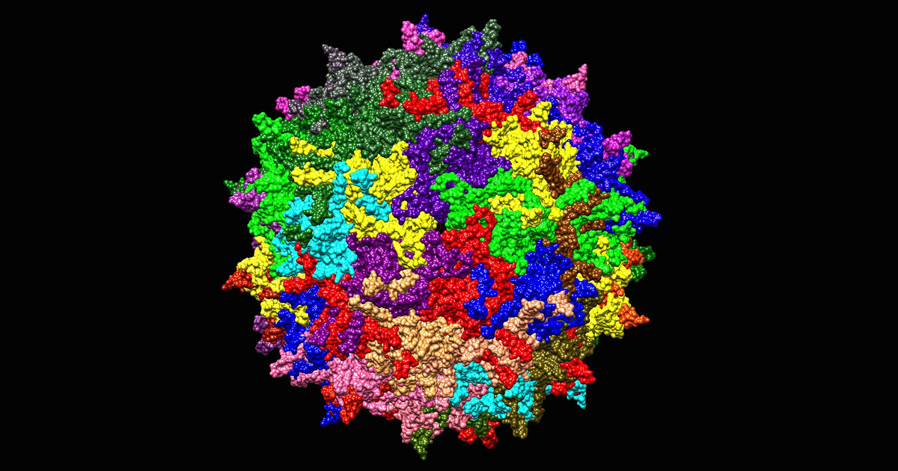

A gene therapy arrives as a vector. The body has no category for that. What reaches the
bloodstream is a protein shell around 25 nanometres across with a single strand of DNA
folded inside, assembled from the same genes a wild virus uses, and the receptors that
meet it evolved to find exactly that shape. They cannot read intent.

Four arms of the immune system answer. They read three different things: the capsid shell,
the DNA folded inside it, and the protein that DNA goes on to make. The shell is read
twice — intact from the outside, and again in fragments from the inside, after a cell has
taken a particle up and broken it apart. Which arm dominates decides whether enough
genomes reach a nucleus, whether the patient's liver enzymes climb in week three, and
whether a second dose is ever possible.

## Recombinant AAV

Adeno-associated virus is a small, non-enveloped parvovirus. It carries about 4.7
kilobases of single-stranded DNA and cannot copy itself without a helper virus. In the
wild it causes no known disease, which is most of why it became the delivery vehicle for
in-vivo gene therapy.

A recombinant AAV — rAAV — keeps the shell and throws away the contents:

- **The capsid** is unchanged. Sixty copies of three related proteins, VP1, VP2 and VP3,
  packed into an icosahedron. This is the part the therapy needs, because the outside of
  the shell is what picks which tissue the particle enters.
- **The genome** is replaced. Everything between the two inverted terminal repeats — the
  short hairpin sequences at each end that mark where packaging starts and stops — is
  swapped for a promoter and the therapeutic gene.
- **The particle is replication-defective.** The genes for making more virus are gone, so
  a transduced cell produces the therapeutic protein and no progeny virus.

Two features of that construction matter to the immune system, and neither is a design
choice anyone would make freely.

- The shell is a viral protein whether or not it carries viral genes. Around 30 to 60
  percent of adults carry antibodies against common serotypes such as AAV2 from ordinary
  childhood exposure, and those antibodies bind a therapeutic capsid exactly as well.
- The cargo is unmethylated bacterial-style DNA. Plasmid DNA grown in *E. coli* is rich in
  CpG dinucleotides that the mammalian genome has largely lost, and the manufacturing
  process leaves that signature in the packaged genome.

## What the host can sense

The four responses look like four separate topics. They collapse to one question — which
part of the particle is exposed, and when.

| Exposed | Where | Sensor | Arm |
| :--- | :--- | :--- | :--- |
| Capsid, outside surface | Blood, cell surface | Pre-existing antibody, TLR2, complement C3 | Humoral, innate, complement |
| Capsid ssDNA, unmethylated CpG | Endosome, during uncoating | TLR9 | Innate |
| Capsid peptides | Cell surface, on MHC class I | CD8$^+$ T cell receptor | Cellular |
| Transgene product | Cell surface, on MHC class I | CD8$^+$ T cell receptor | Cellular |

Reading the table down is reading the route. The shell is exposed first and is sensed
first; the DNA is exposed only after the particle is inside a compartment where it can
begin to open; the peptides appear only after a capsid has been broken up, which takes
hours, and the T cells that recognise them take days to weeks to expand.

## Timing

- **Minutes.** Complement activation and TLR2 engagement. Both act on the intact particle
  in circulation, so both scale directly with how many particles are in circulation.
- **Hours.** TLR9 sensing inside the endosome, and the type I interferon response it
  drives. The particle has to be taken up first.
- **Days.** Innate signalling licenses antigen-presenting cells, which prime naive T
  cells.
- **Weeks.** Capsid-specific CD8$^+$ T cells expand and kill transduced cells. This is the
  arm that takes away expression the patient already had.
- **Any time.** Pre-existing neutralising antibodies act before the first two, and a
  post-dose antibody response closes the door on a second administration for years.

## The route

Six barriers stand between the syringe and a working episome. Each removes a fraction of
the dose. The widget runs that attrition as an explicit chain: switch an arm on, and the
particles it removes drop out at the station where that arm acts.

::: {.column-page}
::: {.widget-container}
::: {.widget-header}
<span class="widget-title">From bloodstream to nucleus</span>
<span class="widget-badge">runs in your browser</span>
:::
<div id="aav-route"></div>
<div class="widget-note">Click a station to pin its explanation. The dots are vector
genomes, scaled so the full panel is the injected dose.</div>
:::
:::

Things to try, and what each should show:

- **Turn everything off.** About one genome in thirteen reaches a nucleus — 7.6% of the
  dose. Almost all of that loss is trafficking, not immunity. The endosome is the single
  most expensive step, with entry across the plasma membrane and the race against the
  proteasome close behind, and all three are expensive in a patient with no response to
  the vector at all.
- **Turn on antibodies with the titre at 1:1000.** The figure falls to 0.15%, about one genome in 660.
  Almost the whole dose goes before a particle is ever inside a cell: opsonised capsids
  cleared at the sinusoid, then neutralising antibody blocking entry at the cell surface.
  The inflammatory lamps stay dark, because the particles never got far enough to be
  sensed from inside.
- **Turn on CD8$^+$ T cells alone.** The nucleus count does not move at all. Expression at
  week 8 falls to 44 anyway. This arm does not stop delivery; it removes the cells that
  already received it.
- **Turn on complement and drag the dose from $10^{13}$ to $10^{14}$ vg/kg.** The share
  reaching a nucleus falls from 5.4% to 4.0% while the genomes delivered rise
  roughly sevenfold, and the complement lamp goes from amber to red. Both halves of the
  dose problem are in one picture.

### Model

The numbers are synthetic and illustrative. They are not fitted to any trial, and no
patient produced them.

The generating process is a product of survival fractions, one per station:

$$
N_{\text{nucleus}} = N_0 \prod_{s=1}^{6} p_s(\text{dose},\ \text{titre},\ \text{arms on}).
$$

Each $p_s$ is a baseline trafficking fraction multiplied by a penalty for whichever arms
act at station $s$. The baselines are set so a seronegative patient with no active
response lands at 7.6% of the dose reaching a nucleus, the right order for the few percent
that reach target-cell nuclei in practice, and the dose and titre terms move in the
direction the literature reports. Expression at week 8 multiplies the nucleus count by a
T-cell survival term.

What it stands in for: a single intravenous, liver-directed dose in an adult. It is a
teaching device for the *ordering and coupling* of the four arms — which one acts where,
and what happens when two act together. It is not a predictor of any individual outcome.

## Innate sensing

Toll-like receptors are pattern receptors: each one binds a molecular shape that is common
in pathogens and rare in the host, and converts binding into a signalling cascade. Two of
them see AAV, at different places, and they drive different cytokines.

```{=html}
<figure class="dia">
<svg viewBox="0 0 720 300" role="img" aria-label="TLR2 at the cell surface and TLR9 in the endosome both signal through MyD88; TLR2 drives NF-kappa-B and inflammatory cytokines, TLR9 drives IRF7 and type I interferon.">
  <defs>
    <marker id="ah" viewBox="0 0 10 10" refX="9" refY="5" markerWidth="7" markerHeight="7" orient="auto-start-reverse">
      <path d="M0,0 L10,5 L0,10 z" fill="#5C6B7A"/>
    </marker>
  </defs>
  <rect x="16" y="86" width="688" height="196" rx="14" fill="#F7F9FB" stroke="#D5DCE3"/>
  <text x="30" y="106" font-size="12" fill="#5C6B7A" font-family="system-ui,sans-serif">cytoplasm</text>
  <path d="M16 86 H704" stroke="#16202B" stroke-width="5" stroke-linecap="round"/>
  <text x="30" y="76" font-size="12" fill="#5C6B7A" font-family="system-ui,sans-serif">plasma membrane</text>

  <circle cx="232" cy="46" r="15" fill="#4A3AA7"/>
  <text x="232" y="26" font-size="12" fill="#16202B" text-anchor="middle" font-family="system-ui,sans-serif">capsid</text>
  <path d="M220 78 v-14 M244 78 v-14" stroke="#E69F00" stroke-width="6" stroke-linecap="round"/>
  <text x="232" y="106" font-size="13" font-weight="700" fill="#E69F00" text-anchor="middle" font-family="system-ui,sans-serif">TLR2</text>

  <ellipse cx="470" cy="150" rx="86" ry="56" fill="#FFFFFF" stroke="#16202B" stroke-width="4"/>
  <text x="470" y="118" font-size="12" fill="#5C6B7A" text-anchor="middle" font-family="system-ui,sans-serif">endosome</text>
  <path d="M452 168 q18 -16 36 0" stroke="#4A3AA7" stroke-width="3" fill="none"/>
  <text x="470" y="140" font-size="11" fill="#4A3AA7" text-anchor="middle" font-family="system-ui,sans-serif">ssDNA, CpG</text>
  <path d="M430 196 l-14 12 M510 196 l14 12" stroke="#E69F00" stroke-width="6" stroke-linecap="round"/>
  <text x="470" y="228" font-size="13" font-weight="700" fill="#E69F00" text-anchor="middle" font-family="system-ui,sans-serif">TLR9</text>

  <rect x="252" y="130" width="86" height="34" rx="8" fill="#FFFFFF" stroke="#5C6B7A"/>
  <text x="295" y="152" font-size="13" font-weight="700" fill="#16202B" text-anchor="middle" font-family="system-ui,sans-serif">MyD88</text>
  <path d="M232 114 L232 147 L246 147" stroke="#5C6B7A" stroke-width="2" fill="none" marker-end="url(#ah)"/>
  <path d="M400 190 L360 165 L344 152" stroke="#5C6B7A" stroke-width="2" fill="none" marker-end="url(#ah)"/>

  <text x="118" y="212" font-size="13" font-weight="700" fill="#16202B" font-family="system-ui,sans-serif">NF-&#954;B</text>
  <text x="118" y="234" font-size="12" fill="#5C6B7A" font-family="system-ui,sans-serif">TNF-&#945;, IL-6, IL-1&#946;</text>
  <path d="M270 168 L200 202" stroke="#5C6B7A" stroke-width="2" fill="none" marker-end="url(#ah)"/>

  <text x="596" y="212" font-size="13" font-weight="700" fill="#16202B" text-anchor="middle" font-family="system-ui,sans-serif">IRF7</text>
  <text x="596" y="234" font-size="12" fill="#5C6B7A" text-anchor="middle" font-family="system-ui,sans-serif">IFN-&#945;/&#946;</text>
  <path d="M322 164 L560 202" stroke="#5C6B7A" stroke-width="2" fill="none" marker-end="url(#ah)"/>
</svg>
<figcaption>Left: TLR2 reads the intact shell at the plasma membrane. Right: TLR9 reads
the released DNA inside the endosome. Both route through MyD88 and split at the
transcription factor.</figcaption>
</figure>
```

### TLR2

TLR2 sits on the cell surface, and on the endosomal membrane, and binds the structural
capsid proteins of the intact particle. Human endothelial cells and Kupffer cells — the
resident macrophages lining the liver's blood channels — carry it, which puts it exactly
where an intravenous dose goes first.

Binding recruits MyD88, an adaptor protein, which activates the transcription factor
NF-$\kappa$B. NF-$\kappa$B turns on the pro-inflammatory cytokine genes: TNF-$\alpha$,
IL-6 and IL-1$\beta$. The consequence is a general inflammatory alarm, raised by the
outside of the particle, with no reference to what the particle carries.

### TLR9

TLR9 is inside the endosome, facing the compartment's interior, and it binds unmethylated
CpG dinucleotides in single-stranded DNA. That is a bacterial and viral signature: the
mammalian genome depletes CpG and methylates most of what is left, so unmethylated CpG in
an endosome means something foreign has begun to open.

- The capsid must start uncoating for the DNA to become visible. TLR9 sensing therefore
  lags TLR2 sensing, and it reports on particles that got at least as far as an endosome.
- Signalling goes through MyD88 again, but in plasmacytoid dendritic cells it branches to
  IRF7 and drives type I interferons, IFN-$\alpha$ and IFN-$\beta$, at high levels.
- Interferon does two things at once. It suppresses transgene expression directly, and it
  matures the antigen-presenting cells that go on to prime the T-cell response. The innate
  arm is what licenses the adaptive one.

CpG content is a manufacturing variable, not a fixed property of the vector. Codon choices
and regulatory sequences can be redesigned to strip CpG motifs out of the expression
cassette without changing the protein, and CpG-depleted vectors are one of the levers the
field pulls on this response.

## Antibodies

B cells make antibodies against the capsid — often long before the therapy, from ordinary
exposure to wild AAV. They act on the particle while it is still outside a cell, and they
split into two functionally different classes.

### Neutralising antibodies

Neutralising antibodies bind the outer surface of the capsid at or near the sites the
particle uses to attach. The blocking is steric — the antibody is physically in the way of
the glycan the capsid binds and of AAVR, the receptor that carries it into the cell. The
particle is intact and undamaged and simply cannot dock.

- Neutralisation is close to all-or-nothing at the level of a single particle, so titre
  translates into dose loss steeply.
- Titres are reported as the reciprocal dilution at which neutralisation is still
  measurable, so 1:1000 is a high titre and 1:5 is a low one. Many trials exclude patients
  above a threshold as low as 1:5, because a small amount of circulating antibody removes
  a large fraction of the dose.
- This is the reason a second dose usually fails. The first dose raises a durable
  neutralising response against the capsid it was delivered in, and re-dosing with the
  same serotype years later meets a titre far above any enrolment threshold.

### Binding antibodies

Binding antibodies attach to the capsid without covering a receptor site. The particle
could still dock, but it does not get the chance: the antibody's Fc tail is now sticking
out, and Fc$\gamma$ receptors on macrophages and Kupffer cells grip it.

The effect is opsonisation — coating a particle to mark it for eating. A capsid tagged
this way is pulled into a phagocyte and degraded. The dose is cleared from circulation
faster, and the liver's resident macrophages do most of that clearing, which is one reason
an intravenous dose is a liver problem before it is anything else.

An assay that only measures neutralisation misses this entirely. A patient can be
seronegative by a neutralisation assay and still clear a dose quickly through binding
antibodies alone. Total-antibody assays are run alongside for that reason.

## Capsid-specific T cells

The first three arms act on the particle. This one acts on the patient's own cells, and it
is the arm that takes away expression that was already working.

```{=html}
<figure class="dia">
<svg viewBox="0 0 720 280" role="img" aria-label="A capsid that fails to reach the nucleus is degraded by the proteasome into peptides, loaded onto MHC class I, and displayed on the cell surface, where a CD8 T cell recognises it and releases perforin and granzyme.">
  <rect x="16" y="30" width="470" height="228" rx="16" fill="#F7F9FB" stroke="#16202B" stroke-width="3"/>
  <text x="34" y="52" font-size="12" fill="#5C6B7A" font-family="system-ui,sans-serif">transduced hepatocyte</text>

  <circle cx="86" cy="112" r="14" fill="#4A3AA7"/>
  <text x="86" y="146" font-size="11" fill="#5C6B7A" text-anchor="middle" font-family="system-ui,sans-serif">capsid</text>

  <rect x="146" y="88" width="96" height="48" rx="6" fill="#FFFFFF" stroke="#5C6B7A" stroke-width="2"/>
  <text x="194" y="110" font-size="12" font-weight="700" fill="#16202B" text-anchor="middle" font-family="system-ui,sans-serif">proteasome</text>
  <text x="194" y="127" font-size="11" fill="#5C6B7A" text-anchor="middle" font-family="system-ui,sans-serif">degrades</text>
  <path d="M104 112 H140" stroke="#5C6B7A" stroke-width="2" marker-end="url(#ah)"/>

  <g fill="#4A3AA7">
    <rect x="266" y="100" width="12" height="8" rx="2"/>
    <rect x="286" y="112" width="12" height="8" rx="2"/>
    <rect x="266" y="124" width="12" height="8" rx="2"/>
  </g>
  <text x="286" y="152" font-size="11" fill="#5C6B7A" text-anchor="middle" font-family="system-ui,sans-serif">peptides</text>
  <path d="M246 112 H260" stroke="#5C6B7A" stroke-width="2" marker-end="url(#ah)"/>

  <path d="M420 30 V258" stroke="#16202B" stroke-width="3"/>
  <path d="M400 118 h20 M400 118 v-16 h-10 M400 118 v16 h-10" stroke="#0072B2" stroke-width="3" fill="none"/>
  <rect x="386" y="96" width="14" height="10" rx="2" fill="#4A3AA7"/>
  <text x="356" y="176" font-size="12" font-weight="700" fill="#0072B2" text-anchor="middle" font-family="system-ui,sans-serif">MHC class I</text>
  <path d="M306 116 H378" stroke="#5C6B7A" stroke-width="2" marker-end="url(#ah)"/>

  <circle cx="576" cy="118" r="58" fill="#FFFFFF" stroke="#A8437A" stroke-width="3"/>
  <text x="576" y="112" font-size="14" font-weight="700" fill="#A8437A" text-anchor="middle" font-family="system-ui,sans-serif">CD8&#8314;</text>
  <text x="576" y="132" font-size="12" fill="#A8437A" text-anchor="middle" font-family="system-ui,sans-serif">T cell</text>
  <path d="M518 108 h-24 v20 h24" stroke="#A8437A" stroke-width="3" fill="none"/>

  <path d="M494 148 q-30 34 -66 44" stroke="#A8437A" stroke-width="2" stroke-dasharray="5 4" fill="none" marker-end="url(#ah)"/>
  <text x="486" y="244" font-size="12" font-weight="700" fill="#A8437A" text-anchor="end" font-family="system-ui,sans-serif">perforin, granzyme</text>
  <text x="240" y="222" font-size="13" font-weight="700" fill="#16202B" text-anchor="middle" font-family="system-ui,sans-serif">apoptosis, expression lost</text>
</svg>
<figcaption>A capsid that never reached the nucleus becomes the antigen that destroys the
cell that took it up.</figcaption>
</figure>
```

The chain has four links, and the first one is a trafficking failure rather than an immune
event:

1. **A capsid fails to reach the nucleus.** Most do. It is tagged with ubiquitin and fed to
   the proteasome, the cell's general-purpose protein shredder.
2. **The proteasome cuts it into short peptides.** These are the ordinary raw material of
   the class I presentation pathway — every cell continuously advertises samples of its own
   protein contents this way.
3. **Peptides are loaded onto MHC class I and displayed** on the cell surface. A hepatocyte
   that took up a vector is now showing capsid fragments to anything that walks past.
4. **A capsid-specific CD8$^+$ T cell recognises the complex** and releases perforin, which
   opens the target membrane, and granzymes, which enter and trigger apoptosis.

The observable signature is specific and well documented: a rise in the liver enzymes ALT
and AST at roughly four to eight weeks after infusion, coinciding with a fall in transgene
expression. It looks like liver toxicity and it is really the immune system finding cells
that took up the dose. Prophylactic corticosteroids, started before the enzymes rise, are
the standard countermeasure, and their timing is set by that four-to-eight-week window.

Two points are easy to get backwards.

- **The antigen is usually the capsid, not the transgene.** The capsid arrived by the
  thousand per cell and is presented immediately; the transgene product is a protein the
  patient may already be tolerant to. A transgene-directed response does happen, and it
  matters most when the patient's own gene is deleted, so the therapeutic protein is
  foreign to them in the way a viral protein is.
- **The dose is already delivered when this arm acts.** Steroids cannot recover killed
  cells. They prevent the killing of cells that are still expressing.

## Complement

Complement is a cascade of plasma proteins that amplifies: a small trigger cleaves a
protein, the fragments cleave more, and the output climbs steeply with input. Both the
classical pathway, triggered by antibody bound to a capsid, and the alternative pathway,
which turns over continuously and settles on surfaces, activate on AAV.

```{=html}
<figure class="dia">
<svg viewBox="0 0 720 250" role="img" aria-label="C3 is cleaved into C3a and C3b; the cascade continues to C5, producing C5a and the membrane attack complex C5b-9 which forms a pore in an endothelial cell.">
  <rect x="18" y="52" width="128" height="46" rx="8" fill="#FFFFFF" stroke="#009E73" stroke-width="3"/>
  <text x="82" y="81" font-size="15" font-weight="700" fill="#009E73" text-anchor="middle" font-family="system-ui,sans-serif">C3</text>
  <path d="M150 75 H196" stroke="#5C6B7A" stroke-width="2" marker-end="url(#ah)"/>
  <rect x="200" y="30" width="112" height="40" rx="8" fill="#FDF0E4" stroke="#D55E00" stroke-width="2"/>
  <text x="256" y="56" font-size="14" font-weight="700" fill="#D55E00" text-anchor="middle" font-family="system-ui,sans-serif">C3a</text>
  <rect x="200" y="82" width="112" height="40" rx="8" fill="#FFFFFF" stroke="#009E73" stroke-width="2"/>
  <text x="256" y="108" font-size="14" font-weight="700" fill="#009E73" text-anchor="middle" font-family="system-ui,sans-serif">C3b</text>
  <path d="M316 102 H360" stroke="#5C6B7A" stroke-width="2" marker-end="url(#ah)"/>
  <rect x="364" y="82" width="104" height="40" rx="8" fill="#FFFFFF" stroke="#009E73" stroke-width="2"/>
  <text x="416" y="108" font-size="14" font-weight="700" fill="#009E73" text-anchor="middle" font-family="system-ui,sans-serif">C5</text>
  <path d="M416 78 V58 H470" stroke="#5C6B7A" stroke-width="2" marker-end="url(#ah)"/>
  <rect x="474" y="38" width="112" height="40" rx="8" fill="#FDF0E4" stroke="#D55E00" stroke-width="2"/>
  <text x="530" y="64" font-size="14" font-weight="700" fill="#D55E00" text-anchor="middle" font-family="system-ui,sans-serif">C5a</text>
  <path d="M416 126 V150 H470" stroke="#5C6B7A" stroke-width="2" marker-end="url(#ah)"/>
  <rect x="474" y="130" width="160" height="40" rx="8" fill="#FFFFFF" stroke="#009E73" stroke-width="3"/>
  <text x="554" y="156" font-size="14" font-weight="700" fill="#009E73" text-anchor="middle" font-family="system-ui,sans-serif">C5b-9 (MAC)</text>

  <text x="530" y="98" font-size="12" fill="#D55E00" text-anchor="middle" font-family="system-ui,sans-serif">anaphylatoxins</text>
  <text x="256" y="146" font-size="12" fill="#D55E00" text-anchor="middle" font-family="system-ui,sans-serif">systemic inflammation</text>

  <path d="M120 196 H660" stroke="#16202B" stroke-width="6" stroke-linecap="round"/>
  <text x="120" y="230" font-size="12" fill="#5C6B7A" font-family="system-ui,sans-serif">vascular endothelium</text>
  <g stroke="#009E73" stroke-width="4" stroke-linecap="round">
    <path d="M470 188 v16 M486 188 v16 M502 188 v16"/>
  </g>
  <path d="M554 174 V186" stroke="#5C6B7A" stroke-width="2" marker-end="url(#ah)"/>
  <text x="660" y="230" font-size="12" font-weight="700" fill="#009E73" text-anchor="end" font-family="system-ui,sans-serif">pores, thrombosis, platelet loss</text>
</svg>
<figcaption>The cascade splits at every step into a soluble alarm signal and a
surface-bound fragment. Only the second branch reaches the membrane.</figcaption>
</figure>
```

The cascade produces two kinds of output, and they cause different problems.

- **Anaphylatoxins.** Cleaving C3 and C5 releases the small fragments C3a and C5a into the
  plasma. These recruit and activate neutrophils and mast cells and drive systemic
  inflammation. This is the fast, whole-body reaction, and it is the one that follows an
  infusion within hours.
- **The membrane attack complex.** The larger fragments assemble C5b-9, a ring that
  inserts into a lipid membrane and opens a pore. On vascular endothelial cells, that
  damage exposes the surfaces that start clotting, and the clinical consequence is
  microvascular thrombosis with falling platelets — the picture reported as
  thrombotic microangiopathy after high-dose systemic AAV.

Complement is the arm most tightly coupled to dose, for two reasons that compound. The
cascade is an amplifier, so it responds non-linearly to how much surface is presented to
it; and circulating antibody-capsid complexes trigger the classical pathway, so a patient
with any pre-existing titre starts the cascade with a much lower threshold. Dose and
serostatus are not independent risks.

## Dose

Every arm is dose-sensitive, and none is dose-sensitive in the same way.

| Arm | What rises with dose | Shape |
| :--- | :--- | :--- |
| Complement | Surface presented to an amplifying cascade | Steeply non-linear |
| TLR2, TLR9 | Particles sensed per cell | Roughly proportional |
| Antibody clearance | Saturates once titre is exhausted | Flattens at high dose |
| CD8$^+$ T cells | Capsid peptides displayed per cell | Proportional, then a threshold for killing |

The trap is that the reason to raise the dose and the reason not to are the same number.
Delivery is inefficient, so a therapeutic effect needs a large dose; a large dose is what
turns the amplifying arms on. Systemic doses in the $10^{13}$ to $10^{14}$ vg/kg range are
where the severe complement and liver events have been reported, and they are also where
enough genomes arrive for some indications to work at all.

## Clinical signatures

Each arm shows up as something a clinician measures, on its own clock. Reading backwards
from the observation to the mechanism is most of how these events are managed.

| Observation | Timing | Arm |
| :--- | :--- | :--- |
| Fever, raised IL-6 and TNF-$\alpha$ | Hours | TLR2, innate |
| Raised type I interferon signature | Hours to days | TLR9, innate |
| Falling platelets, haemolysis, renal impairment | Hours to days | Complement, MAC |
| No expression at all despite a full dose | Immediate | Pre-existing neutralising antibody |
| ALT and AST rise with falling expression | 4 to 8 weeks | Capsid-specific CD8$^+$ T cells |
| Second dose has no effect | Years | Post-dose neutralising antibody |

The countermeasures line up with the same table: pre-screening for neutralising titre
before enrolment, CpG depletion in cassette design, prophylactic corticosteroids over the
T-cell window, and complement inhibition where the cascade is the presenting problem.

## Constraints

- **The four arms are not independent.** Innate signalling licenses the adaptive response,
  antibody-capsid complexes trigger complement, and complement fragments opsonise capsids
  for the same phagocytes that binding antibodies recruit. The widget treats the arms as
  separable because that is what makes the ordering visible, and the separability is the
  simplification.
- **Serotype changes the numbers, not the mechanisms.** AAV8 and AAV9 differ from AAV2 in
  tropism, in seroprevalence, and in how strongly each arm engages. The route is the same.
- **Route of administration changes the exposure.** Delivery to the eye, the central
  nervous system or a single muscle presents far less capsid to the circulation than an
  intravenous dose, and the complement and antibody arms weaken accordingly.
- **Preclinical models under-report this.** Mice have different TLR9 distribution and
  different complement handling from humans, and no colony has the pre-existing anti-AAV
  antibody that a third to a half of adult patients arrive with.

Shell. Sensed. DNA. Sensed. Peptides. Presented. Dose. Amplifies. Screen. Titre. First.

## References

- Manno, C. S. et al. (2006). [Successful transduction of liver in hemophilia by AAV-Factor IX and limitations imposed by the host immune response](https://doi.org/10.1038/nm1358). *Nature Medicine*. The trial that identified the capsid-specific CD8$^+$ T-cell response and the ALT rise.
- Zhu, J., Huang, X. and Yang, Y. (2009). [The TLR9-MyD88 pathway is critical for adaptive immune responses to adeno-associated virus gene therapy vectors in mice](https://doi.org/10.1172/JCI37607). *Journal of Clinical Investigation*. The CpG-TLR9 link.
- Faust, S. M. et al. (2013). [CpG-depleted adeno-associated virus vectors evade immune detection](https://doi.org/10.1172/JCI68205). *Journal of Clinical Investigation*. CpG content as a manufacturing lever.
- Hösel, M. et al. (2012). [Toll-like receptor 2-mediated innate immune response in human nonparenchymal liver cells toward adeno-associated viral vectors](https://doi.org/10.1002/hep.25801). *Hepatology*. TLR2 sensing of the capsid.
- Pillay, S. et al. (2016). [An essential receptor for adeno-associated virus infection](https://doi.org/10.1038/nature16465). *Nature*. Identification of AAVR, the entry receptor neutralising antibodies block access to.
- Mingozzi, F. and High, K. A. (2013). [Immune responses to AAV vectors: overcoming barriers to successful gene therapy](https://doi.org/10.1182/blood-2013-01-306647). *Blood*. Review covering the humoral and cellular arms together.
- Verdera, H. C., Kuranda, K. and Mingozzi, F. (2020). [AAV vector immunogenicity in humans: a long journey to successful gene transfer](https://doi.org/10.1016/j.ymthe.2020.02.010). *Molecular Therapy*. Clinical synthesis, including complement and dose.
