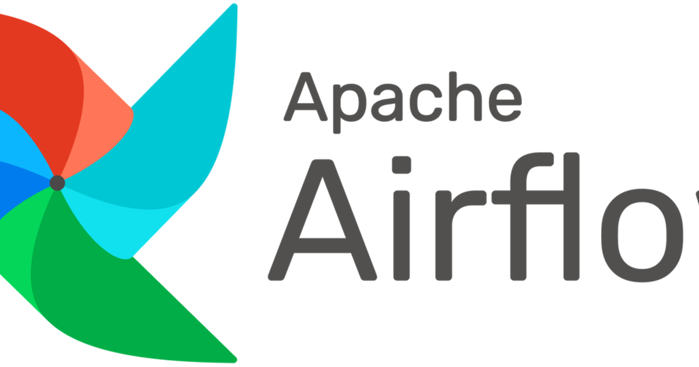

The first version of every data pipeline is a script and a cron entry. It works until
the night the upstream file is late, the script fails, nobody notices until the
dashboard is stale on Monday, and the fix is a rerun by hand. Airflow is the tool
people reach for at that point, and it is worth being precise about what it adds,
because it is a lot of machinery and most of it is for the failure cases. This post
says what an orchestrator does that a script does not, and the four concepts needed
to use Airflow for it, as of early 2025.

## A script hides its structure; a DAG declares it

A pipeline is a set of steps with an order: fetch, then clean, then load, then report.
In a script that order is implicit in the lines. Airflow makes it explicit as a
**DAG**, a directed acyclic graph of tasks, with a schedule and a start date. Once the
structure is data rather than code, the scheduler can do things a script cannot: run
independent tasks in parallel, retry one failed task without redoing the others, show
which task is running and which failed, and rerun a day's work for a range of past
dates. The smallest DAG is a few lines:

```python
from datetime import datetime

from airflow import DAG
from airflow.operators.python import PythonOperator


def fetch():
    print("fetching")


with DAG(dag_id="daily_report", start_date=datetime(2024, 3, 31),
         schedule="@daily", catchup=False) as dag:
    fetch_task = PythonOperator(task_id="fetch", python_callable=fetch)
```

The declaration is the whole value. The scheduler reads it and runs the graph at each
tick, while the script would have had to be a loop with `sleep` in it, or a cron entry
with no memory of what it ran last time.

## Four concepts cover most pipelines

- **Tasks and operators.** A task is one node; an operator is its type. `PythonOperator`
  runs a function, `BashOperator` a command, and the SQL and cloud providers ship
  operators for their systems, so a task that loads a table into a warehouse is
  configuration rather than code.
- **Dependencies.** `a >> b` says b runs after a. Two tasks with no edge between them
  run in parallel when the executor allows it.
- **Sensors.** A task that waits for a condition, a file appearing, a table being
  populated, an API returning ready, and times out if it never comes. This is the
  answer to the late upstream file:

  ```python
  from airflow.sensors.filesystem import FileSensor

  wait = FileSensor(task_id="wait_for_input", filepath="/data/input.csv", timeout=600)
  wait >> fetch_task
  ```

- **Executors.** Where tasks run: the `LocalExecutor` on one machine, `CeleryExecutor`
  across a pool of workers, `KubernetesExecutor` as one pod per task. The DAG does not
  change when the executor does, which is how a pipeline grows from a laptop to a
  cluster without a rewrite.

Retries, with a delay and a back-off, are one argument on a task. Logs are captured
per task and shown in the web UI, which `airflow standalone` serves on port 8080
after `pip install apache-airflow`. Together those are the features the failure cases
need, and none of them exists in the cron version.

## The cost is the scheduler itself

Airflow is a scheduler, a web server, a metadata database and a worker pool, and
someone runs them. For a single script on a schedule it is more infrastructure than
the job, which is why the managed offerings exist (Amazon's MWAA, Google's Cloud
Composer, Astronomer): they charge for what a team would otherwise spend keeping the
scheduler alive. The point at which the machinery pays for itself is easy to name. It
is the third time someone reruns a failed step by hand, or the first time two steps
that could run in parallel take twice as long in series.

## Where it stops holding

Airflow schedules and runs; it does not transform, and a DAG whose tasks do heavy
work in the worker process is misusing it. The tasks should hand work to the system
built for it: a [dbt](../dbt/) run for SQL, a Spark job for data that does not fit,
a container for anything else. Airflow's task is to say when, in what order, and what
to do when it fails. And the DAG file is Python that the scheduler imports repeatedly,
so top-level code in it (a database call, a slow import) runs every few seconds
forever; the recurring beginner's outage is a DAG file that does work at import time.

Scripts. Break. Quietly. DAGs. Retry. Log. Scale. Orchestrate. When. Order. Matters.

## References

- [Apache Airflow documentation](https://airflow.apache.org/docs/)
- [Airflow: best practices for DAG files](https://airflow.apache.org/docs/apache-airflow/stable/best-practices.html)
- [dbt](../dbt/) and [Kafka, NiFi and Flink](../streaming-kafka-flink-nifi/) on this blog
