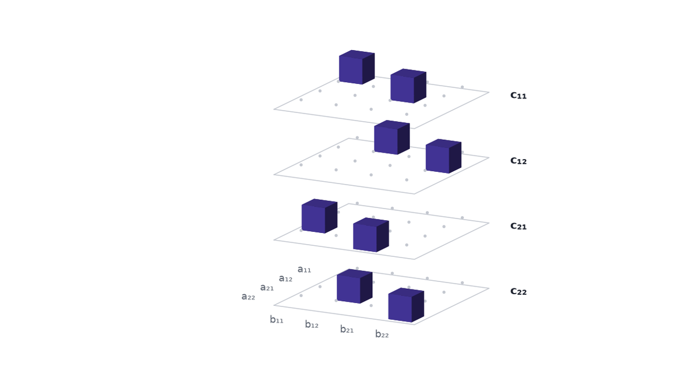
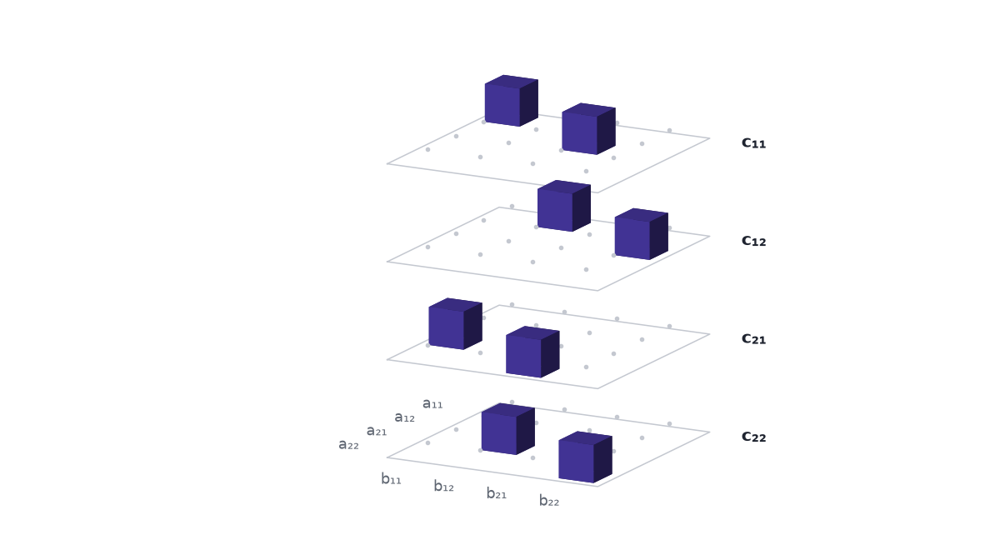

The rule for multiplying two matrices fits in a block of zeros and ones, and the product can be read straight off that block. This is the first of three parts. [Part 2](../alphatensor-seven-multiplications/) splits the block into pieces and gets a faster way to multiply; [Part 3](../alphatensor-tensor-game/) shows how AlphaTensor turned the hunt for those pieces into a game for one player.

## Eight multiplications look forced, and they are not

We learn to multiply matrices once and then stop looking at the rule. For two $2\times2$ matrices it is

$$
\begin{pmatrix} a_{11} & a_{12}\\ a_{21} & a_{22}\end{pmatrix}
\begin{pmatrix} b_{11} & b_{12}\\ b_{21} & b_{22}\end{pmatrix}
=
\begin{pmatrix}
a_{11}b_{11} + a_{12}b_{21} & a_{11}b_{12} + a_{12}b_{22}\\
a_{21}b_{11} + a_{22}b_{21} & a_{21}b_{12} + a_{22}b_{22}
\end{pmatrix}.
$$

Count the work on the right: eight multiplications and four additions. With numbers,

$$
\begin{pmatrix} 1 & 2\\ 3 & 4\end{pmatrix}
\begin{pmatrix} 5 & 6\\ 7 & 8\end{pmatrix}
=
\begin{pmatrix} 1\cdot5 + 2\cdot7 & 1\cdot6 + 2\cdot8\\ 3\cdot5 + 4\cdot7 & 3\cdot6 + 4\cdot8\end{pmatrix}
=
\begin{pmatrix} 19 & 22\\ 43 & 50\end{pmatrix}.
$$

Eight feels like a fact about the problem. The answer has four entries, every entry is a sum of two products, and all eight products are different. Where would a saving come from?

Yet in 1969 Volker Strassen multiplied $2\times2$ matrices with seven multiplications. In 2022 a program from DeepMind called AlphaTensor found a way to multiply $4\times4$ matrices in arithmetic modulo 2 with 47 multiplications, where the best known count had been 49, and the paper notes that this "improves on Strassen's two-level algorithm for the first time, to our knowledge, since its discovery 50 years ago" (Fawzi et al. 2022).

Neither result comes from staring at the formula. Both come from treating "the rule for multiplying matrices" as an object that can be taken apart. This post builds the object.

## Every product in the rule names an entry of A, an entry of B and a destination in C

Take one term of the rule, say $a_{12}b_{21}$ in the top-left corner. Three facts pin it down: which entry of $A$ it uses, which entry of $B$ it uses, and which entry of $C = AB$ it is added to. Here those are $a_{12}$, $b_{21}$ and $c_{11}$.

All eight terms fit that description, so the rule is a list of eight triples:

| product | entry of $A$ | entry of $B$ | added to |
|:--|:--|:--|:--|
| $a_{11}b_{11}$ | $a_{11}$ | $b_{11}$ | $c_{11}$ |
| $a_{12}b_{21}$ | $a_{12}$ | $b_{21}$ | $c_{11}$ |
| $a_{11}b_{12}$ | $a_{11}$ | $b_{12}$ | $c_{12}$ |
| $a_{12}b_{22}$ | $a_{12}$ | $b_{22}$ | $c_{12}$ |
| $a_{21}b_{11}$ | $a_{21}$ | $b_{11}$ | $c_{21}$ |
| $a_{22}b_{21}$ | $a_{22}$ | $b_{21}$ | $c_{21}$ |
| $a_{21}b_{12}$ | $a_{21}$ | $b_{12}$ | $c_{22}$ |
| $a_{22}b_{22}$ | $a_{22}$ | $b_{22}$ | $c_{22}$ |

That table is matrix multiplication for $2\times2$ matrices. It mentions no numbers. It works for every $A$ and every $B$.

## Put a 1 at each triple and the rule becomes a 4 × 4 × 4 cube

A list of triples is a set of points in a three-way grid. Give the grid one axis for the four entries of $A$, one for the four entries of $B$, and one for the four entries of $C$. That makes $4\times4\times4 = 64$ cells. Put a 1 in the eight cells the table names and a 0 in the other 56.

To write this down we number the entries of a matrix by reading it row by row: $a_1 = a_{11}$, $a_2 = a_{12}$, $a_3 = a_{21}$, $a_4 = a_{22}$, and likewise for $B$ and $C$. Then the array is

$$
T_{ijk} =
\begin{cases}
1 & \text{if the product } a_i b_j \text{ is one of the terms of } c_k,\\
0 & \text{otherwise.}
\end{cases}
$$

The second row of the table becomes $T_{2,3,1} = 1$: entry 2 of $A$ times entry 3 of $B$ goes to entry 1 of $C$.

A grid of numbers with two axes is a matrix. A grid with three or more is a **tensor**, and $T$ is the **matrix multiplication tensor** for $2\times2$ matrices. The AlphaTensor paper opens with this picture: "as $c_1 = a_1b_1 + a_2b_3$, tensor entries located at $(a_1, b_1, c_1)$ and $(a_2, b_3, c_1)$ are set to 1" (Fawzi et al. 2022, Fig. 1).

{.at-figure fig-alt="Four square trays stacked vertically, labelled c11 to c22, with two purple cubes on each tray."}

We draw the cube as a stack of four trays, one per entry of $C$, so that no cell hides behind another. Inside a tray the rows are the entries of $A$ and the columns are the entries of $B$.

Press $c_{21}$ in the scene. The other trays pull away and fade, its two cubes stay lit, and the line under the buttons reads $c_{21} = a_{21}b_{11} + a_{22}b_{21}$, which for the example matrices is $3\cdot5 + 4\cdot7 = 43$. Then press the product $a_{12} \cdot b_{21}$: one cube grows, the scene labels it $a_{12} \cdot b_{21} \to c_{11}$, and the example gives $2\cdot7 = 14$.

::: {#widget-cube}
:::

```{=html}
<script src="../../widget-kit/stage.js"></script>
<script src="model.js"></script>
<script src="cube.js"></script>
<script src="widgets.js"></script>
```

## One formula reads the product off the cube

The cube is more than a record of the rule. It can do the multiplying. For every entry of the answer,

$$
c_k = \sum_{i=1}^{4}\sum_{j=1}^{4} T_{ijk}\, a_i\, b_j .
$$

In words: to get entry $k$ of $C$, look at tray $k$, and for every cell on it multiply the entry of $A$ for its row by the entry of $B$ for its column by the number in the cell. Sixteen terms, of which fourteen are multiplied by 0 and vanish. On tray 1 the two cells that hold a 1 are $(1, 1)$ and $(2, 3)$, so

$$
c_1 = a_1 b_1 + a_2 b_3 = a_{11}b_{11} + a_{12}b_{21} = 1\cdot5 + 2\cdot7 = 19 .
$$

A tray is a $4\times4$ matrix of zeros and ones, and the formula is a sandwich with that matrix in the middle. Write $\mathbf{a} = (a_1, a_2, a_3, a_4)$ and $\mathbf{b} = (b_1, b_2, b_3, b_4)$ as columns, and $M_k$ for tray $k$. Then $c_k = \mathbf{a}^\top M_k\, \mathbf{b}$, and for the first entry

$$
c_1 =
\begin{pmatrix} a_1 & a_2 & a_3 & a_4 \end{pmatrix}
\begin{pmatrix}
1 & 0 & 0 & 0\\
0 & 0 & 1 & 0\\
0 & 0 & 0 & 0\\
0 & 0 & 0 & 0
\end{pmatrix}
\begin{pmatrix} b_1 \\ b_2 \\ b_3 \\ b_4 \end{pmatrix}.
$$

Four trays, four sandwiches, four entries of $C$. The tensor holds no data. The matrices $A$ and $B$ arrive as the two slices of bread.

## Reading cell by cell costs one multiplication per 1

The formula tells us what the schoolbook rule costs. A cell that holds 0 contributes nothing and costs nothing. A cell that holds 1 costs one multiplication, $a_i$ times $b_j$. The cube has eight ones, so reading it one cell at a time takes eight multiplications. The tile under the scene counts them.

The eight we started with is the number of ones in the cube. The count of multiplications in the schoolbook rule is a count of filled cells.

## A bigger matrix gives a bigger, emptier cube

The construction works for any size. Two $n \times n$ matrices have $n^2$ entries apiece, so the cube has $n^2$ cells along every side. The rule $c_{ik} = \sum_j a_{ij} b_{jk}$ has one product for every choice of $i$, $j$ and $k$, so the cube holds $n^3$ ones.

| matrices | side of the cube | cells | ones | share that is nonzero |
|:--|--:|--:|--:|--:|
| $2\times2$ | 4 | 64 | 8 | 12.5% |
| $3\times3$ | 9 | 729 | 27 | 3.7% |
| $4\times4$ | 16 | 4,096 | 64 | 1.6% |
| $5\times5$ | 25 | 15,625 | 125 | 0.8% |

Switch the scene to $3\times3$: nine trays, three cubes on every tray, and 27 multiplications if we read one cell at a time. The familiar "matrix multiplication takes $n^3$ multiplications" is the statement that the cube has $n^3$ ones and we pay for them one by one.

## One multiplication per 1 is a choice

Reading the cube one cell at a time takes it apart into eight pieces, and every piece is one cell. Nothing in the formula says the pieces have to be cells. [Part 2](../alphatensor-seven-multiplications/) takes the cube apart into seven pieces that overlap and cancel, shows that every piece still costs one multiplication, and so multiplies $2\times2$ matrices with seven.

Rule. Becomes. Cube. Ones. Mark. Products. Count. Ones. Count. Multiplications.

## References

- Fawzi, A., et al. (2022). [Discovering faster matrix multiplication algorithms with reinforcement learning](https://doi.org/10.1038/s41586-022-05172-4). *Nature* 610, 47–53.
- Strassen, V. (1969). Gaussian elimination is not optimal. *Numerische Mathematik* 13, 354–356.
- [AlphaTensor, Part 2: A Factorization Is an Algorithm](../alphatensor-seven-multiplications/) — splitting the cube into blocks that cost one multiplication apiece.
- [AlphaTensor, Part 3: A Game Nobody Can Brute-Force](../alphatensor-tensor-game/) — the search for a short split.
