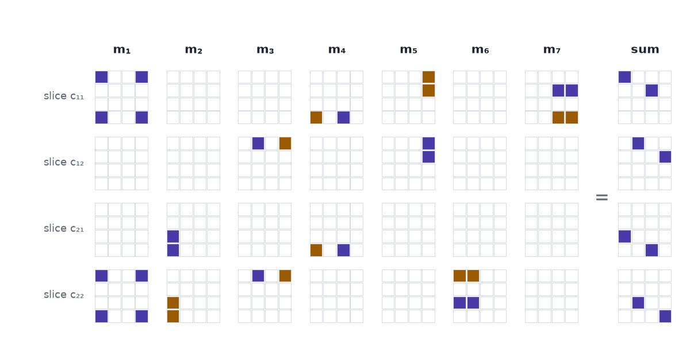

A way of splitting the multiplication cube into $R$ simple blocks is a recipe for multiplying matrices with $R$ multiplications, and Strassen's seven-multiplication method is a split into seven. [Part 1](../alphatensor-matmul-cube/) built the cube: a $4\times4\times4$ array $T$ of zeros and ones that records the rule for multiplying two $2\times2$ matrices, with eight ones because the rule has eight products. [Part 3](../alphatensor-tensor-game/) turns the search for a split into a game.

## One multiplication can buy four products

Start with a piece of school algebra. The expression $(a_{11} + a_{22})(b_{11} + b_{22})$ takes two additions and one multiplication to compute. Expand it and four products appear:

$$
(a_{11} + a_{22})(b_{11} + b_{22}) = a_{11}b_{11} + a_{11}b_{22} + a_{22}b_{11} + a_{22}b_{22}.
$$

In Part 1 every product cost its own multiplication. Here one multiplication delivers four of them, bundled into one number.

The bundle is a mixed blessing. Two of the four, $a_{11}b_{11}$ and $a_{22}b_{22}$, are products the rule wants: the first belongs in $c_{11}$ and the second in $c_{22}$. The other two, $a_{11}b_{22}$ and $a_{22}b_{11}$, appear nowhere in the product of two matrices. Add the bundle to both $c_{11}$ and $c_{22}$ and we have done some of the right work and some damage, and later steps have to undo the damage. Strassen's method is seven bundles chosen so that all the damage cancels.

Cancelling looks like luck when it is written as algebra. On the cube it is geometry, so we go back to the cube.

## A bundle is a block of the cube

The cube has one axis for the entries of $A$, one for the entries of $B$, and one for the entries of $C$. A 1 in the cell $(a_{12}, b_{21}, c_{11})$ means "the product $a_{12}b_{21}$ goes into $c_{11}$".

The bundle uses two entries of $A$, namely $a_{11}$ and $a_{22}$. It uses two entries of $B$, and we add it to two entries of $C$. So it puts a 1 in every cell whose three coordinates come from those three pairs: $2\times2\times2 = 8$ cells. Two of the eight are cells where the cube has a 1. The other six are the damage.

Three lists of weights describe the bundle. With the entries of a matrix taken in the order 11, 12, 21, 22:

$$
u = (1, 0, 0, 1), \qquad v = (1, 0, 0, 1), \qquad w = (1, 0, 0, 1).
$$

The cell at position $(i, j, k)$ holds the product $u_i v_j w_k$. An array built this way is written $u \circ v \circ w$ and called a **rank-one tensor**; [CP or Tucker](../cp-or-tucker/) introduces it as the outer product of three vectors. We will call it a block. Weights may be negative: the sum $a_{21} - a_{11}$ has weights $(-1, 0, 1, 0)$, and a cell holds $-1$ when its three weights multiply to $-1$.

Read as an instruction, a block says three things:

1. add up the entries of $A$ with the weights $u$;
2. add up the entries of $B$ with the weights $v$;
3. multiply the two sums, and add the result to the entries of $C$ with the weights $w$.

Step 3 holds the only multiplication. A block costs one multiplication however many cells it covers.

## If R blocks add up to the cube, R multiplications multiply the matrices

Suppose we find $R$ blocks whose sum, cell by cell, is the cube:

$$
T = \sum_{r=1}^{R} u_r \circ v_r \circ w_r,
\qquad\text{that is,}\qquad
T_{ijk} = \sum_{r=1}^{R} u_{ri}\, v_{rj}\, w_{rk}.
$$

A sum of this shape is a **CP factorization** of $T$. [Tensor Factorizations and Tensor Inverses](../tensor-factorizations/) uses one to approximate data, with a $\approx$ sign. Here the sign is $=$: every one of the 64 cells has to match.

Part 1 read the product off the cube with $c_k = \sum_i \sum_j T_{ijk}\, a_i\, b_j$, where $a_1, \dots, a_4$ are the entries of $A$ read row by row. Put the factorization in place of $T$ and collect the sums:

$$
c_k
= \sum_{i}\sum_{j}\Big(\sum_{r=1}^{R} u_{ri}\, v_{rj}\, w_{rk}\Big) a_i\, b_j
= \sum_{r=1}^{R} w_{rk}\,
\underbrace{\Big(\sum_{i} u_{ri}\, a_i\Big)\Big(\sum_{j} v_{rj}\, b_j\Big)}_{m_r}.
$$

That line changes the order of summation and does nothing else. It says the product $C = AB$ can be computed in two stages:

$$
m_r = \Big(\sum_{i} u_{ri}\, a_i\Big)\Big(\sum_{j} v_{rj}\, b_j\Big) \quad\text{for } r = 1, \dots, R,
\qquad
c_k = \sum_{r=1}^{R} w_{rk}\, m_r .
$$

The first stage does $R$ multiplications, one per block. The weights are fixed numbers, here $0$, $1$ and $-1$, so applying them takes additions and subtractions and no multiplications of data by data. The number of blocks in the factorization is the number of multiplications in the algorithm. The AlphaTensor paper states it in one sentence: "A decomposition of $\mathcal{T}_n$ into $R$ rank-one terms provides an algorithm for multiplying arbitrary $n \times n$ matrices using $R$ scalar multiplications" (Fawzi et al. 2022).

## The schoolbook rule is the split into eight single cells

The schoolbook rule fits this mould. Give $u$, $v$ and $w$ one nonzero weight apiece and the block shrinks to one cell. Take $u = (0,1,0,0)$, $v = (0,0,1,0)$, $w = (1,0,0,0)$: the block is the cell $(a_{12}, b_{21}, c_{11})$, and the instruction is "multiply $a_{12}$ by $b_{21}$ and add the result to $c_{11}$".

The cube has eight ones, so this split has eight blocks and the schoolbook rule has eight multiplications. No block does any damage, and no block does more than one cell of work. To get under eight, some block has to cover more than one wanted cell, and the six-cells-of-damage problem returns.

## Strassen's seven blocks overshoot and cancel

Strassen published these seven products in 1969:

$$
\begin{aligned}
m_1 &= (a_{11} + a_{22})(b_{11} + b_{22}) & m_5 &= (a_{11} + a_{12})\, b_{22}\\
m_2 &= (a_{21} + a_{22})\, b_{11} & m_6 &= (a_{21} - a_{11})(b_{11} + b_{12})\\
m_3 &= a_{11}\,(b_{12} - b_{22}) & m_7 &= (a_{12} - a_{22})(b_{21} + b_{22})\\
m_4 &= a_{22}\,(b_{21} - b_{11})
\end{aligned}
$$

and the product is assembled from them with additions and subtractions:

$$
\begin{aligned}
c_{11} &= m_1 + m_4 - m_5 + m_7 & c_{12} &= m_3 + m_5\\
c_{21} &= m_2 + m_4 & c_{22} &= m_1 - m_2 + m_3 + m_6 .
\end{aligned}
$$

Written as weights on the entries 11, 12, 21, 22 of each matrix, the seven blocks are:

| product | $u$, weights on $A$ | $v$, weights on $B$ | $w$, weights on $C$ |
|:--|:--|:--|:--|
| $m_1$ | $(1, 0, 0, 1)$ | $(1, 0, 0, 1)$ | $(1, 0, 0, 1)$ |
| $m_2$ | $(0, 0, 1, 1)$ | $(1, 0, 0, 0)$ | $(0, 0, 1, -1)$ |
| $m_3$ | $(1, 0, 0, 0)$ | $(0, 1, 0, -1)$ | $(0, 1, 0, 1)$ |
| $m_4$ | $(0, 0, 0, 1)$ | $(-1, 0, 1, 0)$ | $(1, 0, 1, 0)$ |
| $m_5$ | $(1, 1, 0, 0)$ | $(0, 0, 0, 1)$ | $(-1, 1, 0, 0)$ |
| $m_6$ | $(-1, 0, 1, 0)$ | $(1, 1, 0, 0)$ | $(0, 0, 0, 1)$ |
| $m_7$ | $(0, 1, 0, -1)$ | $(0, 0, 1, 1)$ | $(1, 0, 0, 0)$ |

The $w$ column is the assembly step read sideways: $m_2$ has weight $1$ on $c_{21}$ and $-1$ on $c_{22}$, and those are the two places $m_2$ appears in the formulas for $C$.

One entry is short enough to check by hand. For $c_{12}$:

$$
m_3 + m_5 = a_{11}(b_{12} - b_{22}) + (a_{11} + a_{12})\,b_{22}
= a_{11}b_{12} - a_{11}b_{22} + a_{11}b_{22} + a_{12}b_{22}
= a_{11}b_{12} + a_{12}b_{22}.
$$

The unwanted product $a_{11}b_{22}$ arrives once with a minus sign from $m_3$ and once with a plus sign from $m_5$. On the cube that is one cell, $(a_{11}, b_{22}, c_{12})$, going to $-1$ and coming back to $0$.

{.at-figure fig-alt="A grid of small four-by-four panels: seven columns for Strassen's products and an eighth for their sum, four rows for the slices of the cube."}

The scene adds the blocks one at a time. Press *Add the next block* once. Eight cells light up, the block of $m_1$, and the tile counting cells that differ from the target goes from 8 to 12: two of the eight are wanted, six are damage, and six wanted cells are still missing. Keep pressing. The tile reads 12, 12, 10, 8, 4, and after the seventh block 0. Over the seven steps 20 different cells hold something; 12 of them end hollow, cancelled back to zero, and the 8 that are left are the cube. After the third block the cell $(a_{11}, b_{22})$ in slice $c_{12}$ holds $-1$, and the fifth block clears it, as the algebra said. Switch to *Schoolbook's 8* for the contrast: every press fills one wanted cell and nothing is ever cancelled.

::: {#widget-build}
:::

```{=html}
<script src="../../widget-kit/stage.js"></script>
<script src="../alphatensor-matmul-cube/model.js"></script>
<script src="../alphatensor-matmul-cube/cube.js"></script>
<script src="widgets.js"></script>
```

The same seven blocks run as an algorithm on numbers. With $A = \begin{pmatrix}1&2\\3&4\end{pmatrix}$ and $B = \begin{pmatrix}5&6\\7&8\end{pmatrix}$, the example from Part 1, the seven products are $65, 35, -2, 8, 24, 22$ and $-30$, and they assemble to $c_{11} = 65 + 8 - 24 - 30 = 19$, $c_{12} = 22$, $c_{21} = 43$ and $c_{22} = 50$. Type other integers, or press *Random matrices*: the tile that compares the result with the schoolbook product stays at "yes".

::: {#widget-run}
:::

## Seven beats eight because the entries can be matrices

On numbers, Strassen's recipe is a bad trade. It uses 7 multiplications and 18 additions and subtractions where the schoolbook rule uses 8 and 4: 25 operations against 12.

The trade pays for a different reason. In every product $m_r$ the entries of $A$ stand on the left and the entries of $B$ on the right, and the recipe never swaps two factors. It never assumes $xy = yx$. So the "entries" do not have to be numbers. They can be matrices.

Cut two $n \times n$ matrices into quarters of size $n/2 \times n/2$ and treat the four quarters as the entries of a $2 \times 2$ matrix. The recipe multiplies them with 7 products of quarters where the schoolbook rule needs 8. A product of two quarters is a smaller matrix multiplication, so apply the recipe to it again, and keep halving. After $k$ levels a matrix of size $n = 2^k$ has cost $7^k$ multiplications of numbers under Strassen and $8^k$ under the schoolbook rule. Since $8^k = n^3$ and $7^k = n^{\log_2 7}$, the saving is in the exponent: $n^{2.81}$ in place of $n^3$. The additions at every level cost in proportion to the number of entries, and the total work, additions included, still grows like $n^{\log_2 7}$ (Strassen 1969).

| size $n$ | schoolbook, $8^k$ | Strassen, $7^k$ | multiplications saved |
|--:|--:|--:|--:|
| 2 | 8 | 7 | 12.5% |
| 8 | 512 | 343 | 33.0% |
| 1,024 | 1,073,741,824 | 282,475,249 | 73.7% |

Drag the slider to $1{,}024 \times 1{,}024$: the schoolbook rule does 3.80 multiplications for every one of Strassen's.

::: {#widget-recursion}
:::

One block fewer in the factorization of the $2\times2$ cube lowers the exponent for matrices of every size. That is why the count of blocks is worth a search.

## The fewest blocks has a name, and for 3 × 3 matrices nobody knows it

The smallest $R$ for which $R$ blocks sum to a tensor is the tensor's **rank**. For the $2\times2$ multiplication cube the rank is 7: Winograd proved in 1971 that six multiplications cannot do it.

For $3\times3$ matrices the cube is $9\times9\times9$ with 27 ones, and its rank is an open problem. Laderman found a split into 23 blocks in 1976. The best proof says no split has fewer than 19 (Bläser 2003), and in arithmetic modulo 2 no fewer than 20 (Wang 2026). Where in that range the answer lies, nobody knows.

A fast algorithm for multiplying matrices and a short factorization of one fixed cube are the same object. "Invent a better algorithm" becomes "find fewer blocks that sum to $T$": a search over short lists of small integers, which is a thing a machine can attempt. [Part 3](../alphatensor-tensor-game/) measures how large that search is and shows how AlphaTensor plays it.

Blocks. Sum. Cube. Terms. Become. Multiplications. Seven. Beats. Eight. Recursively.

## References

- Strassen, V. (1969). Gaussian elimination is not optimal. *Numerische Mathematik* 13, 354–356.
- Winograd, S. (1971). On multiplication of 2 × 2 matrices. *Linear Algebra and its Applications* 4, 381–388.
- Laderman, J. D. (1976). A noncommutative algorithm for multiplying 3 × 3 matrices using 23 multiplications. *Bulletin of the American Mathematical Society* 82, 126–128.
- Bläser, M. (2003). On the complexity of the multiplication of matrices of small formats. *Journal of Complexity* 19(1), 43–60.
- Wang, C. (2026). [Automated lower bounds for bilinear complexity over finite fields](https://arxiv.org/abs/2603.07280). arXiv:2603.07280.
- Fawzi, A., et al. (2022). [Discovering faster matrix multiplication algorithms with reinforcement learning](https://doi.org/10.1038/s41586-022-05172-4). *Nature* 610, 47–53.
- [CP or Tucker](../cp-or-tucker/) — rank-one tensors and the CP factorization.
- [Tensor Factorizations and Tensor Inverses](../tensor-factorizations/) — CP as an approximation of data.
- [AlphaTensor, Part 1: Matrix Multiplication Is a Cube](../alphatensor-matmul-cube/) — the cube and how to read the product off it.
- [AlphaTensor, Part 3: A Game Nobody Can Brute-Force](../alphatensor-tensor-game/) — the search for a short factorization.
