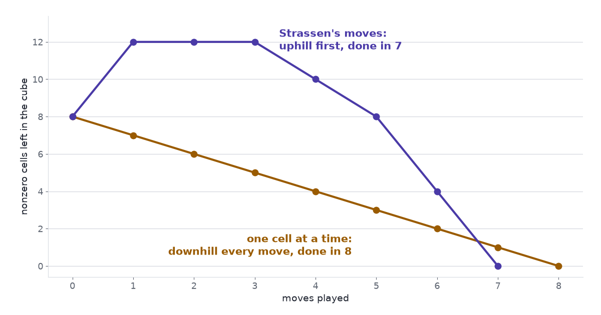

Finding a faster way to multiply matrices means finding a short list of blocks that sum to the multiplication cube, and that list can be found neither by trying every list nor by always taking the move that looks best. [Part 1](../alphatensor-matmul-cube/) built the cube $T$ for $2\times2$ matrices, a $4\times4\times4$ array with eight ones. [Part 2](../alphatensor-seven-multiplications/) showed that $R$ blocks $u \circ v \circ w$ summing to $T$ are an algorithm with $R$ multiplications, and that Strassen's method is a list of seven.

## Finding an algorithm is the same job as emptying the cube

Part 2 handed us Strassen's seven blocks without saying where they came from. Strassen found them by hand. Suppose nobody had, and we wanted them, or wanted a shorter list for bigger matrices. How would we look?

Move the blocks to the other side of the equation. If $T = \sum_r u_r \circ v_r \circ w_r$, then

$$
T - u_1 \circ v_1 \circ w_1 - u_2 \circ v_2 \circ w_2 - \dots - u_R \circ v_R \circ w_R = 0 .
$$

Start with the cube, take away one block at a time, and try to be left with zeros in as few steps as possible. The AlphaTensor paper calls this TensorGame, and its rules take four lines (Fawzi et al. 2022):

- The game starts from the tensor: "The start position $\mathcal{S}_0$ of the game corresponds to the tensor $\mathcal{T}$ representing the bilinear operation of interest".
- A move is three vectors $(u, v, w)$, whose entries come from a small fixed set such as $\{-2, -1, 0, 1, 2\}$. The move subtracts their block: $\mathcal{S}_t \leftarrow \mathcal{S}_{t-1} - u \circ v \circ w$.
- "The game ends when the state reaches the zero tensor".
- "For every step taken, we provide a reward of −1", and a game that runs past a set number of moves is stopped with a further penalty.

There is one player and no opponent. The score is minus the number of moves, so playing well means finishing fast. By Part 2, a game won in $R$ moves is an algorithm with $R$ multiplications: winning the $2\times2$ game in 7 moves is Strassen's result, and winning the $4\times4$ game in fewer than 49, in arithmetic modulo 2, was AlphaTensor's.

The scene plays the game on the $2\times2$ cube with entries $-1$, $0$ and $1$. Three things to try, in order:

1. Press *Schoolbook's next move* eight times. The tile for nonzero cells left counts down 7, 6, 5 and on to 0. That is a win in 8 moves.
2. Press *Start over*, then *Strassen's next move*. The count goes *up*, from 8 to 12. Six more presses take it through 12, 12, 10, 8, 4 to 0: a win in 7.
3. Press *Start over* and build a move by hand. Set $a_{11}$ in $u$, $b_{11}$ in $v$ and $c_{11}$ in $w$ to $+1$. The tile for the count after this move reads 7 (−1), and *Subtract this block* plays it.

::: {#widget-play}
:::

```{=html}
<script src="../../widget-kit/stage.js"></script>
<script src="../alphatensor-matmul-cube/model.js"></script>
<script src="../alphatensor-matmul-cube/cube.js"></script>
<script src="widgets.js"></script>
```

The second experiment is the strange one, and we come back to it. First, the obvious plan: the game is finite, so list every game and keep the shortest win.

## Counting the games rules out trying them all

A move fills three vectors. For $n \times n$ matrices a vector has $n^2$ entries, so a move is $3n^2$ entries, and with $f$ allowed coefficients there are $f^{3n^2}$ ways to fill them.

For the $2\times2$ game with the five coefficients $-2, \dots, 2$ that is $5^{12} = 244{,}140{,}625$ choices at one move. A Go player, on a board with 361 points, has at most 361. For $3\times3$ matrices the count is $5^{27} \approx 7.5 \times 10^{18}$, and for $4\times4$ it is $5^{48} \approx 3.6 \times 10^{33}$. With three coefficients in place of five, the $3\times3$ game still has $3^{27} \approx 7.6 \times 10^{12}$ choices a move. The paper puts it as "more than $10^{12}$ actions for most interesting cases", an action space "much larger than that of traditional board games such as chess and Go".

A game is a sequence of moves, so the counts multiply. Seven moves of the $2\times2$ game with five coefficients make $5.2 \times 10^{58}$ sequences. A machine that wrote down a billion of them every second would need $1.6 \times 10^{42}$ years. For $4\times4$ matrices and 49 moves the number of sequences is about $10^{1644}$.

Those counts overstate the task. They include moves that subtract nothing, they count one block several times because flipping the signs of two of its vectors leaves it unchanged, and they count the same seven moves in all $7! = 5{,}040$ orders. So cut the $2\times2$ game down as far as it will go. Allow only the entries $-1$, $0$, $1$. There are $3^4 - 1 = 80$ nonzero vectors, $80^3 = 512{,}000$ triples, and after removing the sign duplicates $128{,}000$ different blocks. Ignore order and ask how many sets of seven blocks there are: about $1.1 \times 10^{32}$. At a billion a second, checking them takes $3.5 \times 10^{15}$ years, for the smallest case there is.

The calculator shows how fast the numbers leave the page. It opens on the $2\times2$ game with five coefficients and seven moves. Choose $4 \times 4$ and drag the slider to 49 moves: one move has $3.6 \times 10^{33}$ choices, and the number of games has 1,644 digits.

::: {#widget-size}
:::

### Caveat: enumeration can be smarter than this

Nobody serious lists every sequence. A good exhaustive search prunes branches that cannot win and skips arrangements that are mirror images of ones already tried, and proofs can replace search: the $2\times2$ case was closed in 1971, when Winograd proved that six multiplications are too few. The size of the space still bites one step up. The fewest multiplications for $3\times3$ matrices is known only to lie between 19 and 23 (Bläser 2003; Laderman 1976), and the AlphaTensor paper says why: "the search space is so large that even the optimal algorithm for multiplying two 3 × 3 matrices is still unknown".

## Always taking the best-looking move finds eight, and never seven

If we cannot look at every game, we can try to play one game well. Matrices allow that. The singular value decomposition peels off the best rank-one layer of a matrix, then the best layer of what is left, and the result is the best possible approximation at every step ([The Matrix That Rotates, Stretches, and Rotates Again](../svd-rotate-stretch-rotate/)). A greedy player gets the right answer.

Try the same plan on the cube. Measure a position by its number of nonzero cells, and always play the move that leaves the fewest. From the starting position there are 128,000 moves to compare, and the tally is lopsided: 8 of them lower the count, 176 leave it at 8, and 127,816 raise it, by as much as 56. The 8 that help are the 8 single cells of the cube. A greedy player takes one, faces the same choice with seven cells left, and takes another. It plays the schoolbook rule and wins in 8.

Strassen's first move is among the 127,816. It takes the count from 8 to 12, as the second experiment showed, and the full run is 8, 12, 12, 12, 10, 8, 4, 0. The order of the seven moves does not rescue it. In every one of the 5,040 orders, the count climbs to 10 or more before it falls.

{.at-figure fig-alt="A line chart. The amber line falls steadily from 8 to 0 over eight moves. The purple line rises from 8 to 12, stays there for two moves, and falls to 0 at move seven."}

The scene makes the same point with one extra press. *Start over*, press *Strassen's next move*, then press *Greedy move*. The count returns to 8 and the cube is back where it started: the best-looking reply to Strassen's first move is to take it back. Left to finish from there, greedy needs 10 moves in all.

The seven-move win exists, and a player who insists on visible progress walks away from it at the first step. The game's own score does not help either. Every move costs the same $-1$, whether it is Strassen's first or a blunder, so the score says how long a finished game was and nothing about which unfinished position is promising. Nor is there a theorem to lean on in place of the singular value decomposition: finding the rank of a tensor is NP-hard (Håstad 1990), and the paper adds that it "is also hard in practice".

### Caveat: we tried one yardstick

Counting nonzero cells is one way to measure a position, and the result above belongs to that measure. Another measure might rank Strassen's first move above a single cell. We know of no simple one that ranks the right moves first at every size. Learning such a measure from experience of the game is the job AlphaTensor gives to a neural network.

## AlphaTensor learns the sense of progress that counting cannot give

AlphaTensor is built on AlphaZero, the system that learned Go and chess by playing itself, and it keeps AlphaZero's two parts (Fawzi et al. 2022). [Reinforcement Learning Splits on One Question](../reinforcement-learning/) has the background.

The first part is a network. It "takes as input a state (that is, a tensor $\mathcal{S}_t$ to decompose), and outputs a policy and a value": a ranking of promising moves, and an estimate of how many more moves the game will take. That estimate is the yardstick greedy lacked. The second part is a tree search that uses the network to look a few moves ahead along the lines it rates highly, in place of every one of the $10^{33}$ moves a $4\times4$ position offers, and the games the search produces become training data for the network.

Two further ideas come from the problem itself. Taking a tensor apart is hard, but building one is easy: pick $R$ random blocks, add them up, and the result is a tensor with a known $R$-move win. The paper trains on such made-up examples, which it calls synthetic demonstrations: "Although tensor decomposition is NP-hard, the inverse task of constructing the tensor from its rank-one factors is elementary." And a multiplication cube can be written in other coordinates without changing the fewest moves it needs, so the system plays the same game in many disguises.

The results are counts of moves:

- $4\times4$ matrices in arithmetic modulo 2: 47 multiplications, against the 49 of Strassen's method applied twice.
- A $4\times5$ matrix times a $5\times5$ matrix: 76 multiplications, against the previous best of 80.
- $4\times4$ matrices in ordinary arithmetic: 49 multiplications, matching the record, reached by "more than 14,000 non-equivalent factorizations" where one was known before.

Matrix multiplication was a rule in Part 1 and a cube by the end of it. Part 2 showed that a list of blocks summing to the cube is an algorithm. Here the list became the record of a game, and the game showed why short lists are hard to find: the space is too wide to cover, and the short wins begin by making the position look worse. AlphaTensor did not make the space smaller. It learned which uphill moves are worth making. For $3\times3$ matrices the fewest moves is still unknown.

Search. Too. Wide. Greedy. Finds. Eight. Seven. Climbs. First. Learn. Progress.

## References

- Fawzi, A., et al. (2022). [Discovering faster matrix multiplication algorithms with reinforcement learning](https://doi.org/10.1038/s41586-022-05172-4). *Nature* 610, 47–53.
- Strassen, V. (1969). Gaussian elimination is not optimal. *Numerische Mathematik* 13, 354–356.
- Winograd, S. (1971). On multiplication of 2 × 2 matrices. *Linear Algebra and its Applications* 4, 381–388.
- Laderman, J. D. (1976). A noncommutative algorithm for multiplying 3 × 3 matrices using 23 multiplications. *Bulletin of the American Mathematical Society* 82, 126–128.
- Bläser, M. (2003). On the complexity of the multiplication of matrices of small formats. *Journal of Complexity* 19(1), 43–60.
- Håstad, J. (1990). Tensor rank is NP-complete. *Journal of Algorithms* 11(4), 644–654.
- [The Matrix That Rotates, Stretches, and Rotates Again](../svd-rotate-stretch-rotate/) — rank-one layers of a matrix, where greedy works.
- [Reinforcement Learning Splits on One Question: Learn the Value, or Learn the Policy?](../reinforcement-learning/) — policies and values.
- [AlphaTensor, Part 1: Matrix Multiplication Is a Cube](../alphatensor-matmul-cube/) — the cube.
- [AlphaTensor, Part 2: A Factorization Is an Algorithm](../alphatensor-seven-multiplications/) — why a list of blocks is an algorithm.
