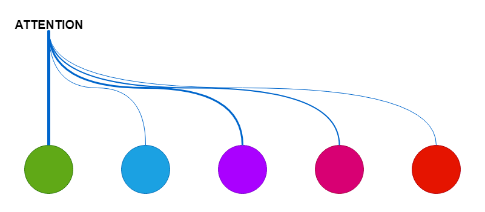

Read the sentence "the cat sat on the mat because it was tired" and you resolve "it"
to the cat without noticing. A transformer has to do that resolution explicitly, for
every token against every other, and attention is the mechanism that does it: score
each pair of tokens, turn the scores into weights with a softmax, and mix the tokens'
values in proportion. This post builds the mechanism from the input matrix up, uses an
interactive grid to show why one small constant in the formula is the difference
between a layer that trains and one that does not, and ends with the layer in PyTorch.

## A sentence becomes a matrix before attention sees it

Attention operates on vectors, so the first job is to make some. The sentence is
split into tokens by a subword tokenizer, each token id indexes a row of an embedding
table $E \in \mathbb{R}^{V \times d}$ ($V$ vocabulary entries, $d$ dimensions), and the
rows for the sentence are stacked into $X \in \mathbb{R}^{n \times d}$, one row per
token. Nothing in that matrix says which token came first, and attention itself is
order-blind, so a positional encoding is added: sinusoids of different frequencies,

$$
P_{i,2j} = \sin\!\left(\frac{i}{10000^{2j/d}}\right), \qquad
P_{i,2j+1} = \cos\!\left(\frac{i}{10000^{2j/d}}\right),
$$

and the input to the first layer is $X + P$. Everything after this point is linear
algebra on that matrix.

## Query, key, value: one input, three roles

Each token plays three parts. As a **query** it asks what it needs from the rest of
the sentence; as a **key** it advertises what it has; as a **value** it is the content
handed over when chosen. Three learned matrices produce the three views of the same
input:

$$
Q = X W_Q, \qquad K = X W_K, \qquad V = X W_V, \qquad W_Q, W_K, W_V \in \mathbb{R}^{d \times d}.
$$

The scores are every query against every key, a single matrix product, and the
softmax turns each row of scores into weights that sum to one; the output for a token
is those weights applied to the values:

$$
S = \frac{Q K^\mathsf{T}}{\sqrt{d}}, \qquad A = \operatorname{softmax}(S), \qquad Z = A V.
$$

Row $i$ of $A$ is token $i$'s attention: how much of each other token it reads. The
softmax is what makes it a choice rather than a blur, and the $\sqrt{d}$ under the
scores is what keeps the choice from becoming a fixed one.

## Why the scores are divided by $\sqrt{d}$

A dot product of two $d$-dimensional vectors with unit-variance entries has variance
$d$, so the raw scores grow with the embedding width, and the softmax of large scores is
nearly one-hot. Dividing by $\sqrt{d}$ holds the score variance at one whatever $d$ is.
The grid shows the softmax weights of six tokens attending to each other, with random
query and key vectors standing in for $XW_Q$ and $XW_K$; each row is one query, and the
two stats average over the six rows, since any single row can be close by chance. With
the divisor on, step $d$ from 4 up to 256: the largest raw score climbs from about 4 to
about 32, yet the average largest weight stays near 0.4 and the average entropy above
2.1 bits at every width. Now switch the divisor to nothing and step $d$ again: the
average largest weight climbs 0.57, 0.86, 0.91, 1.00, and at $d = 256$ the entropy is
0.02 bits, so one key takes nearly everything in every row and the gradient through the
softmax vanishes. The divisor is what keeps attention trainable at the widths real
models use.

::: {#widget-attention}
:::

```{=html}
<script src="widgets.js"></script>
```

## Several heads read the sentence differently

One attention pattern per layer is one way of reading the sentence. Multi-head
attention runs $H$ of them in parallel, each with its own $W_Q^{(h)}, W_K^{(h)},
W_V^{(h)}$ of width $d_k = d / H$, so that one head can track syntax while another
tracks coreference and a third tracks position:

$$
Z^{(h)} = \operatorname{softmax}\!\left(\frac{Q^{(h)} K^{(h)\mathsf{T}}}{\sqrt{d_k}}\right) V^{(h)},
\qquad
Z = \left[ Z^{(1)} \,\|\, \cdots \,\|\, Z^{(H)} \right] W_O.
$$

The heads' outputs are concatenated back to width $d$ and mixed by one more learned
matrix $W_O$. The divisor is now $\sqrt{d_k}$, the per-head width, for the same
reason as before.

## The layer in PyTorch is the equations in order

Everything above is a dozen lines. The projections, the reshape into heads, the scaled
scores, the softmax, the weighted sum, and the output projection appear in that order:

```python
import math

import torch
import torch.nn as nn
import torch.nn.functional as F


class MultiHeadSelfAttention(nn.Module):
    def __init__(self, d_model: int, n_heads: int):
        super().__init__()
        self.n_heads, self.d_k = n_heads, d_model // n_heads
        self.w_q = nn.Linear(d_model, d_model)
        self.w_k = nn.Linear(d_model, d_model)
        self.w_v = nn.Linear(d_model, d_model)
        self.w_o = nn.Linear(d_model, d_model)

    def forward(self, x: torch.Tensor) -> torch.Tensor:          # x: (batch, n, d_model)
        b, n, _ = x.shape
        split = lambda t: t.view(b, n, self.n_heads, self.d_k).transpose(1, 2)  # (b, H, n, d_k)
        q, k, v = split(self.w_q(x)), split(self.w_k(x)), split(self.w_v(x))
        scores = q @ k.transpose(-2, -1) / math.sqrt(self.d_k)   # (b, H, n, n)
        weights = F.softmax(scores, dim=-1)
        z = weights @ v                                           # (b, H, n, d_k)
        z = z.transpose(1, 2).contiguous().view(b, n, -1)         # (b, n, d_model)
        return self.w_o(z)
```

The earlier version of this post called `math` and `F` without importing them; the
block above runs as written. Training the weights $W_Q, W_K, W_V, W_O$ is ordinary
gradient descent on whatever loss sits on top, and the two engineering notes worth
knowing are that padding tokens are masked out of the softmax so they receive no
weight, and that the $n \times n$ score matrix is the memory cost that limits sequence
length.

## Where it stops holding

The picture of a query "looking up" a key is a useful fiction: the learned weights do
not have to correspond to anything a linguist would name, and interpretability work
finds heads that do and heads that do not. And the widget's random vectors show the
scale argument only; in a trained model the scores are not Gaussian and the softmax is
meant to be peaked where the training signal wants it. The divisor does not stop that.
It stops it from happening before training has said anything.

Attention. Weighs. Tokens. Against. Tokens. Heads. Read. Differently. Softmax. Does. The. Choosing.

## References

- Vaswani, A. et al. (2017). Attention is all you need. *NeurIPS 30*.
  [arXiv:1706.03762](https://arxiv.org/abs/1706.03762)
- Bahdanau, D., Cho, K. and Bengio, Y. (2015). Neural machine translation by jointly
  learning to align and translate. *ICLR*.
- Clark, K. et al. (2019). What does BERT look at? An analysis of BERT's attention.
  *BlackboxNLP*.
- [Embeddings](../embeddings/) on this blog, for where $X$ comes from.
