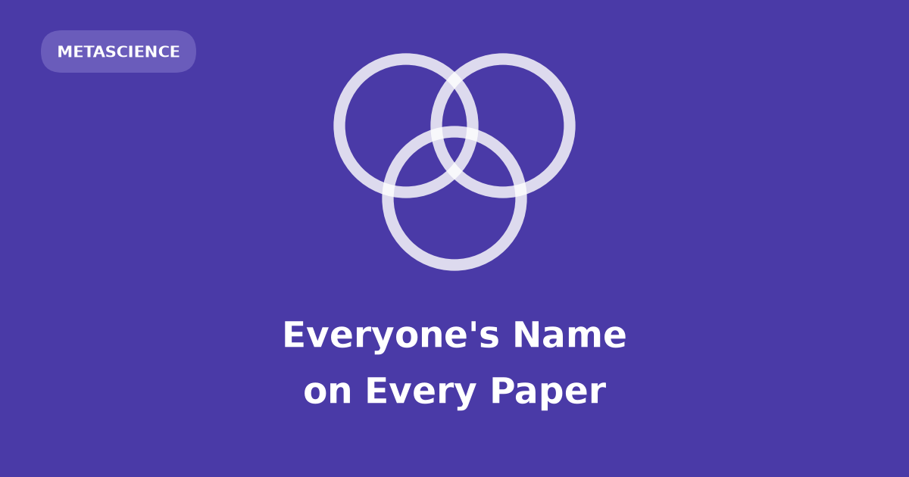

[Brian Ripley](../brian-ripley-rousseeuw-prize/), my doctoral supervisor, hardly
published papers. He was among R core's most active committers for two decades, and
used to say code mattered more than citations: writing code is a good way to debug
your thinking. His citation count is not what he did, which makes it worth asking what
such counts *are*: sums over an author list, and the list is chosen.

## Adding names multiplies papers by n, citations by more

Take $n$ researchers, each with one solo paper drawing $c_i$ citations, who put all
$n$ names on every paper. No new work exists, yet every paper count goes 1 → $n$ and
every citation count $c_i$ → $S = \sum_j c_j$:

$$\frac{S}{c_i} = n \cdot \frac{\bar{c}}{c_i}.$$

Papers multiply by exactly $n$. Citations are heavy-tailed, so the group mean sits far
above the median: the typical member beats $n\times$, by an amount the tail decides.

## Simulated citations, because the tail decides

The counts are synthetic: $c_i$ from a lognormal ($\mu = 1.5$, $\sigma = 1.2$ on the
log scale) — median near 4.5, long right tail — standing in for
one field's citations. No corpus settles it: the question is counterfactual — the same
researchers *without* the agreement — and only simulation has both branches. What rides on it is a hiring panel's read of a CV.

```{python}
#| label: multipliers
import numpy as np

RNG = np.random.default_rng(0)
MU, SIGMA = 1.5, 1.2          # lognormal, on the log scale
GROUPS = (5, 10, 20)
REPS = 20_000                 # many draws, so the medians are not a fluke of one

print(f"{'n':>3}  {'papers':>7}  {'median':>9}  {'share above':>12}  {'large-n':>8}")
print(f"{'':>3}  {'':>7}  {'citations':>9}  {'n times':>12}  {'limit':>8}")
for n in GROUPS:
    c = RNG.lognormal(MU, SIGMA, size=(REPS, n))
    # Everyone is credited with the group total, so the multiplier is S / c_i.
    mult = c.sum(axis=1, keepdims=True) / c
    limit = n * np.exp(SIGMA**2 / 2)   # what median(S / c_i) tends to as n grows
    print(f"{n:>3}  {n:>6}x  {np.median(mult):>8.1f}x  {np.mean(mult > n):>11.0%}"
          f"  {limit:>7.1f}x")
```

The median beats $n\times$ at every size — 7.3× at $n = 5$, 37× at $n = 20$ — nearing
$n\,e^{\sigma^2/2}$ from below. But it hides who pays.

## The gain is unequal, which makes it a transaction

Everyone ends on the same total $S$ whatever they brought. The tick marks
$n \times c_i$: left of the total beat $n\times$, right of it did worse.

```{python}
#| label: fig-inflation
#| fig-cap: "One draw per group size. Left ends are what each researcher earned alone; right ends are what all of them are credited with after combining."
import matplotlib.pyplot as plt

SOLO, COMBINED, REF = "#6b7280", "#4a3aa7", "#eb6834"
rng = np.random.default_rng(1)

fig, axes = plt.subplots(3, 1, figsize=(7.4, 8.2), sharex=True,
                         gridspec_kw={"height_ratios": GROUPS, "hspace": 0.16})

for ax, n in zip(axes, GROUPS):
    c = np.sort(rng.lognormal(MU, SIGMA, size=n))
    total, y = c.sum(), np.arange(n)
    ax.hlines(y, c, total, color=SOLO, lw=1.2, alpha=0.55, zorder=1)
    ax.scatter(c, y, s=34, color=SOLO, zorder=3, label="solo: own paper only")
    ax.scatter(np.full(n, total), y, s=34, color=COMBINED, zorder=3,
               label="combined: credited the group total")
    ax.scatter(n * c, y, s=52, marker="|", color=REF, lw=1.8, zorder=4,
               label=r"$n \times$ the solo count")
    ax.set_xscale("log")
    ax.set_ylim(-0.9, n - 0.1)
    ax.set_yticks([])
    ax.set_ylabel(f"$n = {n}$", fontsize=11)
    ax.grid(axis="x", color="0.9", lw=0.7)
    ax.set_axisbelow(True)
    for side in ("top", "right", "left"):
        ax.spines[side].set_visible(False)
for ax in axes[:-1]:
    ax.spines["bottom"].set_visible(False)
    ax.tick_params(axis="x", which="both", bottom=False)

axes[0].legend(frameon=False, fontsize=9, loc="upper left",
               bbox_to_anchor=(0.0, 1.6))
axes[-1].set_xlabel("credited citations (log scale)", fontsize=10)
plt.show()
```

Two thirds clear $n\times$; the most-cited does not. The swap moves credit toward the
weakly cited at the tail-holder's expense — so the strong party must be paid.

## Real publishing runs the same sum at three scales

**Authors** — seniority. A 2024
[meta-analysis](https://doi.org/10.1038/s41598-024-54909-w) put honorary authorship in
the health sciences at 26% with no criteria supplied, 18% when shown ICMJE criteria,
and 51% when declared contributions were checked against them.

**Journals** — reciprocity. By 2019 the Journal Citation Reports had suspended 46
journal pairs — 55 journals — for excessive pairwise citation;
[CIDRE](https://doi.org/10.1038/s41598-021-93572-3) (Kojaku, Livan and Masuda, 2021)
detects such groups from citation flow.

**Institutions** — cash. In 2011
[*Science*](https://doi.org/10.1126/science.334.6061.1344) reported 60-plus highly
cited researchers adding King Abdulaziz University as a paid second affiliation; by
2014 the university ranked second worldwide on the highly cited list.

None is the model at full strength: the mechanism is a dial, not a switch.

## Caveat: nearly all co-authorship is real collaboration

Most author lists are what they look like: a trial, an instrument, a consortium. This
arithmetic cannot tell an earned name from a gifted one — it says what the incentive
is worth: widening a list is cheap and the counts cannot see the difference. Ripley's
could not see him.
