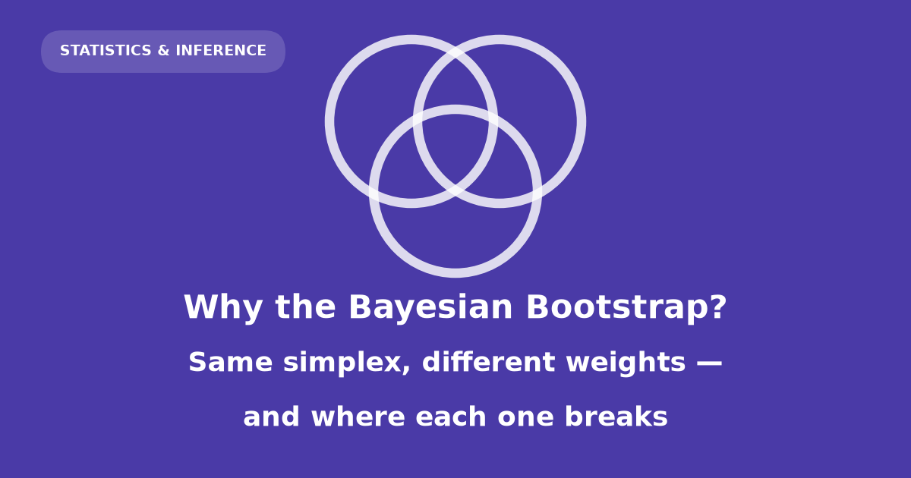

{fig-alt="Cover card reading Why the Bayesian Bootstrap, over a triangle scattered with weight vectors."}

```{python}
#| echo: false
#| output: false
import sys, time, json, itertools
from math import comb, factorial
from pathlib import Path

sys.path.insert(0, "src")

import numpy as np
import pandas as pd
import matplotlib as mpl
import matplotlib.pyplot as plt
from matplotlib.patches import Polygon as MplPolygon
from scipy import stats, special

import bootstrap as bs
import data as dt
import layout_qa as qa

bs.use_house_style()

# Every figure is registered here and checked for text collisions at the end
# of the build; see the reproducibility section.
FIGS: dict[str, plt.Figure] = {}

def register(name, fig):
    FIGS[name] = fig
    return fig

# Replicate counts. B_BIG for every headline univariate number, B_FIG where a
# figure only needs the shape of a distribution.
B_BIG = 200_000
B_FIG = 20_000

TOY = np.array([1.0, 2.0, 3.0, 4.0, 10.0])
TRIPLE = np.array([1.0, 3.0, 10.0])

returns = dt.load_returns()
SP, IBM = returns.head_to_head()
SP_LONG, SP_SHORT = returns.long_window(), returns.short_window()
LABELS = returns.window_labels()
N_HEAD = SP.size

# Barycentric coordinates: a weight vector *is* a point of the triangle.
_CORNERS = np.array([[0.0, 0.0], [1.0, 0.0], [0.5, np.sqrt(3) / 2]])

def bary(W):
    """Map weight vectors on the 2-simplex to plane coordinates."""
    return np.atleast_2d(W) @ _CORNERS

def triangle_axes(ax, labels=("$w_1$", "$w_2$", "$w_3$")):
    """Draw the bare simplex outline with corner labels."""
    ax.add_patch(MplPolygon(_CORNERS, closed=True, fill=False,
                            edgecolor=bs.MUTED, lw=1.0))
    offs = [(-0.055, -0.055), (0.055, -0.055), (0.0, 0.05)]
    for (x, y), (dx, dy), lab in zip(_CORNERS, offs, labels):
        ax.text(x + dx, y + dy, lab, ha="center", va="center",
                fontsize=9, color=bs.MUTED)
    ax.set_xlim(-0.16, 1.16)
    ax.set_ylim(-0.16, 1.02)
    ax.set_aspect("equal")
    ax.axis("off")
```

Both bootstraps place a random probability distribution on the observed data and evaluate a statistic on it.

- **Efron:** resample with replacement; weights lie on a discrete lattice.
- **Bayesian bootstrap (Rubin):** draw Dirichlet weights on the simplex; weights are continuous.

Core claim:

> A statistic is $T(F)$. Both methods randomise the empirical distribution $\hat F_n$ via weights $w$. They differ only in the law of $w$.

Derivations below are from first principles unless noted. Every closed form in prose is checked against simulation at build time.

::: {.callout-warning appearance="default"}
## Constraints

- Not investment advice.
- Return series are illustrative; monthly equity returns are not i.i.d. (volatility clusters). Both bootstraps assume i.i.d. sampling anyway.
- See [Non-weightable estimators](#non-weightable-estimators) for dependent-data fixes.
:::

## Statistics as functionals

A **statistic** is a **functional** $T(F)$ of the unknown data-generating distribution $F$, not a property of one sample alone.

| you say | you mean |
|---|---|
| mean | $T(F) = \int x \, dF(x)$ |
| median | $T(F) = \inf\{x : F(x) \ge 1/2\}$ |
| mode | $T(F) = \arg\max_x f(x)$ |
| maximum | $T(F) = \sup\{x : F(x) < 1\}$ |
| minimum | $T(F) = \inf\{x : F(x) > 0\}$ |
| tail risk | $T(F) = F(-5\%)$ |

: Six familiar statistics, each written as a functional of the distribution rather than of the data. {tbl-colwidths="[30,70]"}

Empirical cdf with equal weights:

$$\hat F_n = \frac{1}{n}\sum_{i=1}^{n} \delta_{x_i}$$

Plug-in estimate: $T(\hat F_n)$. Bootstrap question: how does $T$ vary over plausible perturbations of $\hat F_n$?

### Datasets

Four datasets recur below. Toy samples support exact enumeration; real series support reporting decisions.

| dataset | $n$ | the functional $T(F)$ | what the answer is for |
|---|---|---|---|
| toy sample $x = (1,2,3,4,10)$ | 5 | mean, median, max, min, mode | exhaustive verification |
| three points $x = (1,3,10)$ | 3 | mean, median | drawing the geometry |
| S&P 500 monthly returns | 59 | mean, median, $F(-5\%)$ | market risk reporting |
| IBM monthly returns | 59 | the same, plus the maximum | is this stock different? |
| MNIST test set | 10,000 | accuracy, per-class recall | ship / don't ship |

: The running examples. The small ones are for proof, the real ones are for consequence. {tbl-colwidths="[26,8,30,36]"}

**Toy sample** $x=(1,2,3,4,10)$: $\bar x=4$, $\tilde s^2=10$; $n=5$ gives 126 resamples — all enumerated.

**Three-point sample** $x=(1,3,10)$: simplex plots use $n=3$.

Both toy sets are hand-picked for exact checks, not realism.

**Returns and MNIST** are introduced in [Real return data](#real-return-data) and [MNIST example](#mnist-example).

## Efron's bootstrap

Resampling with replacement yields counts $N \sim \text{Multinomial}(n; 1/n,\ldots,1/n)$.

$$N = (N_1, \dots, N_n) \sim \text{Multinomial}(n;\ 1/n, \dots, 1/n).$$

Now write down the empirical distribution *of the resample*. The value $x_i$ appears $N_i$ times out of $n$, so it carries mass $N_i / n$:

$$F^*_n = \sum_{i=1}^n \frac{N_i}{n}\,\delta_{x_i} = \sum_{i=1}^n w_i\,\delta_{x_i}, \qquad w = N/n.$$

The resample empirical cdf equals $\sum_i (N_i/n)\,\delta_{x_i}$. Weights $w=N/n$ lie on a lattice.

The moments follow from the multinomial. With $p_i = 1/n$:

$$E[N_i] = n p_i = 1, \qquad \operatorname{Var}(N_i) = n p_i (1 - p_i) = 1 - \tfrac1n, \qquad \operatorname{Cov}(N_i, N_j) = -n p_i p_j = -\tfrac1n.$$

Divide by $n$ to get the weights, remembering that variances pick up $1/n^2$:

$$E[w_i] = \frac{1}{n}, \qquad \operatorname{Var}(w_i) = \frac{n-1}{n^3}, \qquad \operatorname{Cov}(w_i, w_j) = -\frac{1}{n^3}.$$

The covariance is negative, and it has to be. The weights sum to one, so if one goes up another must come down. That is not a quirk of the multinomial; it is a consequence of the constraint, and it will reappear for the Bayesian weights with the identical sign and a different scale.

How many distinct weight vectors are there? A weight vector is determined by the counts $(N_1, \dots, N_n)$, non-negative integers summing to $n$. That is the classic stars-and-bars count: lay out $n$ stars and $n-1$ bars in a row, and each arrangement encodes one allocation. There are

$$\binom{2n-1}{n-1}$$

such arrangements.

```{python}
#| echo: false
n5 = 5
patterns = [p for p in itertools.product(range(n5 + 1), repeat=n5) if sum(p) == n5]
pat_probs = np.array([factorial(n5) / np.prod([float(factorial(c)) for c in p]) / n5**n5
                      for p in patterns])
assert len(patterns) == comb(2 * n5 - 1, n5 - 1) == 126
assert np.isclose(pat_probs.sum(), 1.0), "multinomial probabilities must sum to 1"
n_head_patterns = comb(2 * N_HEAD - 1, N_HEAD - 1)
assert f"{n_head_patterns:.3e}" == "1.218e+34"
assert f"{1/special.gamma(N_HEAD):.3e}" == "4.254e-79"
```

At $n = 5$ that is $\binom{9}{4} = `{python} f"{len(patterns)}"`$ patterns, and enumerating them with their exact multinomial probabilities gives a total of `{python} f"{pat_probs.sum():.12f}"` — the enumeration is complete. At $n = `{python} f"{N_HEAD}"`$, the size of the returns window used later, it is $\binom{117}{58} \approx 1.218 \times 10^{34}$.

So Efron's bootstrap draws from an astronomically large but strictly **finite** set of weight vectors. The weights are confined to a lattice inside some space. Naming that space is the next step, and it turns out to be the whole story.

## The weight simplex

Weights satisfy $w_i\ge 0$ and $\sum_i w_i=1$. The feasible set is the **standard simplex**:

$$\Delta^{n-1} = \Big\{ w \in \mathbb{R}^n : w_i \ge 0,\ \sum_{i=1}^n w_i = 1 \Big\}.$$

The superscript is $n-1$ because one equation removes one degree of freedom: fix any $n-1$ of the weights and the last is determined.

```{python}
#| echo: false
#| label: fig-simplex
#| fig-cap: "The constraint $\\sum w_i = 1$ does all the work: it slices the positive orthant into a flat triangle, and that triangle — not the data — is the space both bootstraps operate in."
fig = plt.figure(figsize=(9.6, 3.4))

ax = fig.add_subplot(1, 3, 1, projection="3d")
tri = [[1, 0, 0], [0, 1, 0], [0, 0, 1]]
from mpl_toolkits.mplot3d.art3d import Poly3DCollection
ax.add_collection3d(Poly3DCollection([tri], facecolor=bs.BAYES, alpha=0.42,
                                     edgecolor=bs.MUTED, lw=1.0))
for a, b in [((0, 0, 0), (1.15, 0, 0)), ((0, 0, 0), (0, 1.15, 0)), ((0, 0, 0), (0, 0, 1.15))]:
    ax.plot(*zip(a, b), color=bs.MUTED, lw=0.8)
ax.set_xlim(0, 1.15); ax.set_ylim(0, 1.15); ax.set_zlim(0, 1.15)
ax.set_xticks([0, 1]); ax.set_yticks([0, 1]); ax.set_zticks([0, 1])
ax.set_xlabel("$w_1$", labelpad=-11); ax.set_ylabel("$w_2$", labelpad=-11)
ax.set_zlabel("$w_3$", labelpad=-11)
ax.tick_params(pad=-3, labelsize=7)
ax.set_title("the plane cuts the orthant", pad=2)
ax.view_init(elev=24, azim=32)
ax.set_facecolor(bs.PAPER)
ax.xaxis.pane.fill = ax.yaxis.pane.fill = ax.zaxis.pane.fill = False

ax2 = fig.add_subplot(1, 3, 2)
ax2.add_patch(MplPolygon(_CORNERS, closed=True, facecolor=bs.BAYES, alpha=0.42,
                         edgecolor=bs.MUTED, lw=1.0))
triangle_axes(ax2)
c = bary(np.full(3, 1 / 3))[0]
ax2.plot(*c, "o", color=bs.DATA, ms=6, zorder=5)
ax2.annotate(r"$\hat F_n$", c, xytext=(c[0] + 0.20, c[1] + 0.10), fontsize=9,
             color=bs.DATA, arrowprops=dict(arrowstyle="-", color=bs.DATA, lw=0.7))
ax2.set_title("face-on, the working view", pad=2)

ax3 = fig.add_subplot(1, 3, 3)
ax3.plot([0.06, 0.44], [0.80, 0.80], color=bs.EFRON, lw=2.4)
ax3.add_patch(MplPolygon(np.array([[0.08, 0.40], [0.42, 0.40], [0.25, 0.66]]),
                         closed=True, fill=False, edgecolor=bs.EFRON, lw=1.4))
seg = np.array([[0.60, 0.38], [0.94, 0.44], [0.72, 0.62], [0.78, 0.30]])
for i in range(4):
    for j in range(i + 1, 4):
        ax3.plot(*zip(seg[i], seg[j]), color=bs.EFRON, lw=1.0)
for xx, yy, lab in [(0.25, 0.88, "$n=2$: a segment"),
                    (0.25, 0.30, "$n=3$: a triangle"),
                    (0.77, 0.20, "$n=4$: a tetrahedron")]:
    ax3.text(xx, yy, lab, ha="center", fontsize=8.5, color=bs.INK)
ax3.text(0.5, 0.06, r"$\dim \Delta^{n-1} = n-1$", ha="center", fontsize=10, color=bs.INK)
ax3.set_xlim(0, 1); ax3.set_ylim(0, 1); ax3.axis("off")
ax3.set_title("the dimension ladder", pad=2)

register("fig-simplex", fig)
plt.show()
```

Four features of this object carry the rest of the post.

**The corners are degenerate distributions.** At corner $i$, $w_i = 1$ and everything else is zero: all your mass on a single observation.

**The edges and faces are deletions.** A point lies on a face exactly when some $w_i = 0$ — that observation has been removed from the distribution entirely. Remember this; it explains almost every failure discussed later.

**The centre is the plug-in.** $w = (1/n, \dots, 1/n)$ is $\hat F_n$ itself.

**The volume is $1/(n-1)!$,** so the uniform density on the simplex is the constant $(n-1)!$. At $n = `{python} f"{N_HEAD}"`$ the simplex is a $`{python} f"{N_HEAD-1}"`$-dimensional polytope of volume $4.254 \times 10^{-79}$, and Efron's $1.2 \times 10^{34}$ lattice points sit inside it.

The most important thing to internalise is that a point in this triangle is not a summary of a distribution. It **is** a distribution.

```{python}
#| echo: false
#| label: fig-point-is-dist
#| fig-cap: "A point in the triangle is a probability distribution on the three observed values, not a summary of one. Moving toward a corner deletes observations; the mean's level sets are straight lines because the mean is linear in $w$."
fig, axes = plt.subplots(1, 5, figsize=(11.0, 2.7),
                         gridspec_kw={"width_ratios": [1.5, 1, 1, 1, 1]})
picks = np.array([[1/3, 1/3, 1/3], [0.70, 0.20, 0.10], [0.15, 0.15, 0.70], [0.05, 0.60, 0.35]])
cols = [bs.DATA, bs.EFRON, bs.BAYES, "#4A3AA7"]

ax = axes[0]
grid = np.linspace(0, 1, 220)
G1, G2 = np.meshgrid(grid, grid)
G3 = 1 - G1 - G2
ok = (G3 >= 0)
XY = bary(np.column_stack([G1[ok], G2[ok], G3[ok]]))
vals = np.column_stack([G1[ok], G2[ok], G3[ok]]) @ TRIPLE
ax.tricontour(XY[:, 0], XY[:, 1], vals, levels=8, colors=bs.MUTED,
              linewidths=0.6, alpha=0.85)
triangle_axes(ax, labels=("$x=1$", "$x=3$", "$x=10$"))
for p, col in zip(picks, cols):
    ax.plot(*bary(p)[0], "o", color=col, ms=7, zorder=6)
ax.set_title("level sets of the mean", pad=3)

for k, (p, col) in enumerate(zip(picks, cols), start=1):
    ax = axes[k]
    ax.vlines(TRIPLE, 0, p, color=col, lw=2.4)
    ax.plot(TRIPLE, p, "o", color=col, ms=5)
    m = float(p @ TRIPLE)
    med = TRIPLE[np.searchsorted(np.cumsum(p), 0.5)]
    ax.set_ylim(0, 0.82); ax.set_xlim(-0.6, 11.6)
    ax.set_xticks(TRIPLE)
    ax.set_title(f"$w$ = ({p[0]:.2f}, {p[1]:.2f}, {p[2]:.2f})", pad=3, fontsize=9)
    ax.text(0.5, 0.94, f"mean {m:.2f}   median {med:.0f}", transform=ax.transAxes,
            ha="center", va="top", fontsize=8.5, color=bs.MUTED)
    if k == 1:
        ax.set_ylabel("mass")
register("fig-point-is-dist", fig)
plt.show()
```

The level sets are straight because the mean $\sum_i w_i x_i$ is a linear function of $w$. Any functional that is linear in the weights will have flat level sets like these; the median's will not be, and that difference is exactly what makes the median harder.

::: {.widget}
**W1 — Simplex explorer.** Drag the black point. The bars show the distribution it *is*.

```{=html}
<div id="w1"></div>
```

<div class="widget-note">Try dragging into a corner. You are not “weighting one point heavily” — you are deleting the other two.</div>
:::

Now that the space is named, put a distribution on it.

## Dirichlet posterior

Bayesian update on the simplex, with Dirichlet appearing from conjugacy.

::: {.callout-important appearance="default"}
## Assumption

$F$ is discrete and supported on the $n$ observed values. The unknown parameter is then the probability vector $p = (p_1, \dots, p_n)$ attached to those values, and the parameter space is exactly the simplex $\Delta^{n-1}$.

This is a strong assumption, and both bootstraps make it. The Bayesian version is merely the one that forces you to write it down.
:::

**Step 1 — the likelihood.** If the data are $n$ draws from the distribution with masses $p$, and observation $i$ was seen $n_i$ times, the likelihood is multinomial:

$$L(p) \propto \prod_{i=1}^n p_i^{\,n_i}.$$

With distinct data — no exact ties, which is the normal case for returns — every $n_i = 1$, so

$$L(p) \propto \prod_{i=1}^n p_i .$$

**Step 2 — a prior of matching shape.** Try a prior of the form $\pi(p) \propto \prod_i p_i^{\alpha_i - 1}$ on the simplex. This is the Dirichlet density, but nothing yet depends on knowing its name.

**Step 3 — multiply.** Posterior $\propto$ prior $\times$ likelihood:

$$\pi(p \mid \text{data}) \;\propto\; \prod_i p_i^{\alpha_i - 1} \cdot \prod_i p_i^{\,n_i} \;=\; \prod_i p_i^{\alpha_i + n_i - 1}.$$

The exponents simply increment. Prior and posterior have the same shape, with $\alpha_i \mapsto \alpha_i + n_i$ — which is what conjugacy means, shown here rather than asserted.

**Step 4 — take the limit.** Set every $\alpha_i = a$ and let $a \to 0$. The prior $\propto \prod_i p_i^{-1}$ is **improper**: it does not integrate to a finite number, so it is not a distribution at all, only a formula you can still multiply by. With $n_i = 1$ the posterior is $\propto \prod_i p_i^{a}$. Match that against the Dirichlet's $\prod_i p_i^{\alpha_i - 1}$ and the posterior parameters are $\alpha_i = a + 1$, which go to 1 as $a \to 0$. So the posterior is

$$p \mid \text{data} \;\sim\; \text{Dirichlet}(1, 1, \dots, 1),$$

whose density $\propto \prod_i p_i^{0} = 1$ is **constant**: the uniform distribution on the simplex. That is the Bayesian bootstrap.

::: {.callout-warning appearance="default"}
## Posterior versus prior

- Prior (Haldane): $\pi(p)\propto\prod_i p_i^{-1}$ — improper, edge-heavy.
- Posterior after one observation per category: $\text{Dirichlet}(1,\ldots,1)$ — uniform on the simplex.
- "Uniform prior on the simplex" misstates the method.
:::

Two sanity checks make the construction believable.

First, $E[w_i \mid \text{data}] = 1/n$ by symmetry, so the posterior mean of $F$ is exactly $\hat F_n$. The method is centred on the plug-in estimate — it does not pull your answer anywhere.

Second, $a \to \infty$ collapses the posterior onto the single point $(1/n, \dots, 1/n)$: infinite prior confidence that all masses are equal. So $a$ is a smoothing knob, $\infty$ is "I already know the answer", and $0$ is the let-the-data-speak end.

### Why the Dirichlet is forced, not merely convenient

Here is the property that makes this family the only sensible choice. Suppose you merge two of the categories — you stop distinguishing observation 1 from observation 2 and ask only about the combined mass $p_1 + p_2$. A coherent theory must give the same answer whether you bin the sample space coarsely from the start or merge afterwards.

The Dirichlet does. Merging coordinates keeps you inside the family with the parameters **added**:

$$(p_1 + p_2, p_3, \dots, p_n) \sim \text{Dirichlet}(\alpha_1 + \alpha_2, \alpha_3, \dots, \alpha_n).$$

Iterating this to a set $S$ of size $k$ with all $\alpha_i = 1$ collapses everything to two categories and gives

$$\sum_{i \in S} w_i \;\sim\; \text{Beta}(k,\ n-k).$$

This one line is worth more than any other in the post. Accuracy, tail probabilities, per-class recall, any proportion at all — all of them are sums of subsets of the weights, so all of them have an exact Beta posterior with no simulation whatsoever. It is used repeatedly below.

Pushing the same consistency requirement to a continuous sample space gives Ferguson's Dirichlet process, and the Bayesian bootstrap is its $\alpha \to 0$ posterior.

```{python}
#| echo: false
#| label: fig-dirichlet
#| fig-cap: "The exponent $\\alpha_i - 1$ decides everything: below 1 the density explodes onto the edges, at exactly 1 it vanishes from the formula and the density is flat, above 1 it is pushed to the centre."
def dirichlet_density_panel(ax, alpha, title, sub):
    g = np.linspace(1e-4, 1 - 1e-4, 420)
    G1, G2 = np.meshgrid(g, g)
    G3 = 1 - G1 - G2
    ok = G3 > 1e-4
    W = np.column_stack([G1[ok], G2[ok], G3[ok]])
    a = np.asarray(alpha, dtype=float)
    logd = ((a - 1.0) * np.log(W)).sum(axis=1)
    logd -= logd.max()
    XY = bary(W)
    ax.tricontourf(XY[:, 0], XY[:, 1], np.exp(logd), levels=24, cmap="YlGnBu")
    triangle_axes(ax)
    ax.set_title(title, pad=3, fontsize=10)
    ax.text(0.5, -0.10, sub, transform=ax.transAxes, ha="center",
            fontsize=8.5, color=bs.MUTED)

fig, axes = plt.subplots(1, 4, figsize=(10.6, 3.0))
dirichlet_density_panel(axes[0], [0.1]*3, r"$\alpha = 0.1$", "the prior, as $a \\to 0$")
dirichlet_density_panel(axes[1], [1.0]*3, r"$\alpha = 1$", "the posterior: flat")
dirichlet_density_panel(axes[2], [5.0]*3, r"$\alpha = 5$", "shrunk toward $\\hat F_n$")
dirichlet_density_panel(axes[3], [8.0, 2.0, 2.0], r"$\alpha = (8,2,2)$", "asymmetric")
register("fig-dirichlet", fig)
plt.show()
```

::: {.widget}
**W2 — Dirichlet explorer.** Sweep $\alpha$ and watch the cloud move between the edges and the centre.

```{=html}
<div id="w2"></div>
```

<div class="widget-note">No value of α ever puts mass <em>on</em> the petrol dots. The cloud has a density; the lattice has none.</div>
:::

## Exponential weight construction

Normalized independent $\text{Gamma}(1,1)=\text{Exp}(1)$ draws give $\text{Dirichlet}(1,\ldots,1)$ weights.

Let $G_1, \dots, G_n$ be independent with $G_i \sim \text{Gamma}(\alpha_i, 1)$, so the joint density is

$$f(g) = \prod_{i=1}^n \frac{1}{\Gamma(\alpha_i)} g_i^{\alpha_i - 1} e^{-g_i}.$$

Change variables to the total and the direction: $s = \sum_i g_i$ and $w_i = g_i / s$. The inverse map is $g_i = s\,w_i$. Because $w$ has only $n-1$ free coordinates, use $(w_1, \dots, w_{n-1}, s)$ as the new variables; the Jacobian of $g_i = s w_i$ is

$$\left|\frac{\partial g}{\partial(w_1,\dots,w_{n-1},s)}\right| = s^{\,n-1}.$$

Substituting $g_i = s w_i$ and $\sum_i g_i = s$:

$$f(w, s) \;\propto\; \prod_i (s w_i)^{\alpha_i - 1} e^{-s} \cdot s^{n-1} \;=\; \underbrace{s^{\sum_i \alpha_i - 1} e^{-s}}_{\text{Gamma}(\sum \alpha_i,\,1) \text{ in } s} \;\times\; \underbrace{\prod_i w_i^{\alpha_i - 1}}_{\text{Dirichlet}(\alpha) \text{ in } w}.$$

The joint density factors into a function of $s$ alone times a function of $w$ alone, with no cross-term. That single factorisation delivers three facts at once: $w \sim \text{Dirichlet}(\alpha)$, $S \sim \text{Gamma}(\sum_i \alpha_i, 1)$, and $w \perp S$.

Now set every $\alpha_i = 1$. Since $\text{Gamma}(1,1) = \text{Exp}(1)$, the recipe becomes: draw $n$ exponentials, divide by their sum. The exponentials are not a trick; the normalisation costs nothing precisely because the direction carries no information about the length.

### The same weights come from breaking a stick

Rubin's original description is more vivid. Scatter $n-1$ points uniformly on the interval $[0,1]$, sort them, and take the $n$ gaps between consecutive points, counting the two ends. Those gaps — **uniform spacings** — are exactly $\text{Dirichlet}(1,\dots,1)$.

The two constructions describe the same law: writing the sorted uniforms as running sums of scaled exponentials, the Rényi representation, turns one picture into the other. The spacings picture then hands you something the gamma picture hides. Because the gaps are laid out along the stick in order, their partial sums are the sorted uniforms themselves:

$$w_1 + \dots + w_j \;\stackrel{d}{=}\; U_{(j)},$$

the $j$-th order statistic of $n-1$ uniforms. That fact does all the work for the median later.

```{python}
#| echo: false
rng = bs.rng_for("constructions")
n_c, B_c = 6, 60_000
W_exp = bs.dirichlet_weights(n_c, B_c, rng)
U = np.sort(rng.random((B_c, n_c - 1)), axis=1)
W_gap = np.diff(np.column_stack([np.zeros(B_c), U, np.ones(B_c)]), axis=1)
W_lib = rng.dirichlet(np.ones(n_c), size=B_c)

ks_gap = stats.kstest(W_gap[:, 0], stats.beta(1, n_c - 1).cdf)
ks_exp = stats.kstest(W_exp[:, 0], stats.beta(1, n_c - 1).cdf)
ks_two = stats.ks_2samp(W_exp[:, 0], W_lib[:, 0])
W_g4 = bs.gamma_weights(n_c, B_c, 4.0, rng)
ks_g4 = stats.kstest(W_g4[:, 0], stats.beta(4, 4 * (n_c - 1)).cdf)
assert ks_gap.pvalue > 0.01 and ks_exp.pvalue > 0.01
assert ks_two.pvalue > 0.01 and ks_g4.pvalue > 0.01
```

Both constructions and the library agree, and normalised $\text{Gamma}(4,1)$ variates give $\text{Dirichlet}(4,\dots,4)$ as the factorisation predicts. Against the exact $\text{Beta}(1, n-1)$ marginal at $n = `{python} f"{n_c}"`$, a Kolmogorov–Smirnov test gives $p$ = `{python} f"{ks_exp.pvalue:.3f}"` for the exponential construction and $p$ = `{python} f"{ks_gap.pvalue:.3f}"` for uniform spacings; the two samples are indistinguishable from each other ($p$ = `{python} f"{ks_two.pvalue:.3f}"`), and the $\text{Gamma}(4,1)$ check against $\text{Beta}(4, 4(n-1))$ gives $p$ = `{python} f"{ks_g4.pvalue:.3f}"`.

### Why the weights must sum to one

Three arguments, shallowest first.

**1. It is the definition of the object.** $F_w$ is supposed to be a probability distribution. Total mass one is what makes it one. Without it, $F_w(-5\%)$ is not a probability and there is nothing to interpret.

**2. Otherwise the statistic stops behaving like a statistic.** With $\sum_i w_i = 1$, shifting every observation by $c$ shifts the weighted mean by $c$. Without the constraint, $\sum_i w_i (x_i + c) = \sum_i w_i x_i + c\sum_i w_i$, so the answer scales with the total. And the total is random: $\sum_i E_i \sim \text{Gamma}(n, 1)$ has standard deviation $\sqrt n$ against a mean of $n$, a relative fluctuation of $1/\sqrt n$ — the same order as the standard error you are trying to measure. Skipping the normalisation roughly inflates your uncertainty by $\sqrt 2$.

```{python}
#| echo: false
rng = bs.rng_for("normalise")
n_x = SP.size
E = rng.exponential(1.0, size=(B_FIG, n_x))
norm_mean = (E / E.sum(axis=1, keepdims=True)) @ SP
raw_mean = (E @ SP) / n_x
infl = raw_mean.std() / norm_mean.std()
```

On the S&P window, dividing by $n$ instead of by $\sum_i E_i$ inflates the standard deviation of the bootstrapped mean by a factor of `{python} f"{infl:.2f}"` — against the predicted $\sqrt 2 \approx 1.41$.

**3. The simplex is the parameter space.** This is the real reason. The constraint is not something imposed on the posterior after the fact; it is the domain the posterior lives on. Sum-to-one and the negative correlation between weights are the same geometric fact seen from two sides.

### Identical means, second moments off by a single factor

By symmetry $E[w_i] = 1/n$ for $\text{Dirichlet}(1,\dots,1)$. Merging gives $w_i \sim \text{Beta}(1, n-1)$, whose variance is

$$\operatorname{Var}(w_i) = \frac{1 \cdot (n-1)}{(1 + n - 1)^2 (1 + n)} = \frac{n-1}{n^2 (n+1)},$$

and the constraint $\operatorname{Var}(\sum_i w_i) = 0$ forces $n \operatorname{Var}(w_i) + n(n-1)\operatorname{Cov}(w_i,w_j) = 0$, hence $\operatorname{Cov}(w_i, w_j) = -1/[n^2(n+1)]$.

Put the two methods side by side.

::: {.twin}
<div>
<h4>Efron</h4>

$E[w_i] = 1/n$

$\operatorname{Var}(w_i) = \dfrac{n-1}{n^3}$

$\operatorname{Cov}(w_i,w_j) = -\dfrac{1}{n^3}$

$P(w_i = 0) = (1-1/n)^n$
</div>
<div>
<h4>Bayes</h4>

$E[w_i] = 1/n$

$\operatorname{Var}(w_i) = \dfrac{n-1}{n^2(n+1)}$

$\operatorname{Cov}(w_i,w_j) = -\dfrac{1}{n^2(n+1)}$

$P(w_i = 0) = 0$
</div>
:::

Same mean, same sign of covariance, and every variance in the ratio

$$\frac{\operatorname{Var}_{\text{Bayes}}(w_i)}{\operatorname{Var}_{\text{Efron}}(w_i)} = \frac{n^3}{n^2(n+1)} = \frac{n}{n+1}.$$

```{python}
#| echo: false
rng = bs.rng_for("moment-check")
n_m, B_m = 5, 400_000
for name, gen, var_t, cov_t in [
    ("efron", bs.efron_weights, (n_m - 1) / n_m**3, -1 / n_m**3),
    ("bayes", bs.dirichlet_weights, (n_m - 1) / (n_m**2 * (n_m + 1)), -1 / (n_m**2 * (n_m + 1))),
]:
    W = gen(n_m, B_m, rng)
    C = np.cov(W.T)
    assert np.isclose(W.mean(), 1 / n_m, atol=1e-4)
    assert np.isclose(C[0, 0], var_t, rtol=0.02), name
    assert np.isclose(C[0, 1], cov_t, rtol=0.02), name
```

Every one of those closed forms is checked against `{python} f"{B_m:,}"` simulated replicates in the cell above; the build fails if any disagrees.

## Conjugate-pair duality

Efron and Bayes are opposite conditionings of one multinomial–Dirichlet pair.

$$\underbrace{\text{counts} \mid p = \hat F_n \;\sim\; \text{Multinomial}(n;\ 1/n, \dots, 1/n)}_{\textbf{Efron: fix the probabilities, randomise the counts}}$$

$$\underbrace{p \mid \text{counts} \;\sim\; \text{Dirichlet}(1, \dots, 1)}_{\textbf{Bayes: fix the counts, randomise the probabilities}}$$

Same pair of distributions, opposite arrows. Efron's object is a **sampling distribution**: the randomness answers "what other datasets might I have drawn?" The Bayesian bootstrap's is a **posterior**: the randomness answers "what might $F$ be?" They produce nearly identical numbers and mean opposite things.

### Does the resampling side secretly generate a posterior?

No — and the argument is short enough to give in full.

In this model every observed $x_i$ contributes a factor $p_i$ to the likelihood, so $L(p) = 0$ whenever any $p_i = 0$. Bayes' theorem multiplies prior by likelihood. Therefore **every** posterior under **every** prior must assign probability zero to the faces of the simplex. You watched $x_i$ happen; no amount of conditioning can leave you believing it was impossible.

But an Efron resample that omits an observation lands *exactly* on a face. And the share of resamples that omit at least one observation is $1 - n!/n^n$.

```{python}
#| echo: false
def omit_any(n):
    return 1.0 - float(np.exp(special.gammaln(n + 1) - n * np.log(n)))

omit_tbl = {n: omit_any(n) for n in (3, 5, 12, N_HEAD)}
p_zero_head = (1 - 1 / N_HEAD) ** N_HEAD
rng = bs.rng_for("omit")
W_chk = bs.efron_weights(5, 200_000, rng)
assert np.isclose((W_chk == 0).any(axis=1).mean(), omit_tbl[5], atol=2e-3)
```

At $n=3$ it is `{python} f"{omit_tbl[3]:.4f}"`; at $n=5$, `{python} f"{omit_tbl[5]:.4f}"`; at $n=12$, `{python} f"{omit_tbl[12]:.5f}"`; at $n=`{python} f"{N_HEAD}"`$ it is 1 to within $5\times10^{-25}$. Essentially **every** Efron replicate corresponds to a distribution that assigns probability zero to something you watched happen. At $n = `{python} f"{N_HEAD}"`$ a typical resample omits about `{python} f"{N_HEAD * p_zero_head:.1f}"` of the `{python} f"{N_HEAD}"` observations.

So Efron's bootstrap is not a Bayesian procedure in disguise. It is a different kind of object that happens to give nearly the same numbers.

### A second, independent obstruction

Take the prior $\text{Dirichlet}(a, \dots, a)$, so the posterior is $\text{Dirichlet}(a+1, \dots, a+1)$ and the symmetric-Dirichlet variance formula gives, for the mean functional,

$$\operatorname{Var}(\text{mean} \mid \text{data}) = \frac{\tilde s^2}{n a + n + 1}, \qquad \tilde s^2 = \frac1n \sum_i (x_i - \bar x)^2 .$$

This is **largest** at $a = 0$. Every proper prior is *tighter* than the Bayesian bootstrap. To reach Efron's $\tilde s^2/n$ you would need $na + n + 1 = n$, that is $a = -1/n$ — a negative concentration, which is not a distribution.

```{python}
#| echo: false
x = TOY; n_t = x.size; s2 = bs.biased_var(x)
rng = bs.rng_for("prior-ladder")
rows = []
for a, label in [(0.0, "Haldane — the Bayesian bootstrap"), (1 / n_t, "Perks"),
                 (0.5, "Jeffreys"), (1.0, "uniform")]:
    W = (bs.dirichlet_weights(n_t, B_FIG, rng) if a == 0.0
         else bs.gamma_weights(n_t, B_FIG, a + 1.0, rng))
    mc = bs.weighted_mean(x, W).var()
    theo = s2 / (n_t * a + n_t + 1)
    assert np.isclose(mc, theo, rtol=0.06), (label, mc, theo)
    rows.append((label, f"{a:.2f}" if a else "0", f"{n_t*a+n_t+1:g}", f"{np.sqrt(theo):.3f}"))
rows.append(("*boundary of what a prior can do*", "", "", ""))
rows.append(("Efron bootstrap", "−1/n (invalid)", f"{n_t}", f"{np.sqrt(s2/n_t):.3f}"))
rows.append(("classical $s^2/n$", "—", f"{n_t-1}", f"{np.sqrt(s2/(n_t-1)):.3f}"))
prior_table = pd.DataFrame(rows, columns=["prior", "$a$", "denominator", "sd"])
```

```{python}
#| echo: false
#| label: tbl-prior-ladder
#| tbl-cap: "Prior strength against the answer, on the toy sample $x=(1,2,3,4,10)$. Efron and the classical formula sit on the far side of a line no prior can cross."
from IPython.display import Markdown
Markdown(prior_table.to_markdown(index=False))
```

### What the Bayesian bootstrap's prior actually believes

Lest this read as a free lunch. Under the stick-breaking construction of a Dirichlet process, the first weight is $\text{Beta}(1, \alpha)$, which concentrates at 1 as $\alpha \to 0$. So a **prior** draw from the Bayesian bootstrap's prior is a point mass at a single random location: its opinion is that the world is deterministic and you have no idea where.

```{python}
#| echo: false
rng = bs.rng_for("stick")
stick_rows = []
for a in (0.01, 0.05, 1.0, 20.0):
    K, R = 400, 4000
    V = rng.beta(1.0, a, size=(R, K))
    W = V * np.cumprod(np.column_stack([np.ones(R), 1 - V[:, :-1]]), axis=1)
    stick_rows.append((a, W.max(axis=1).mean(), float(np.mean(1.0 / (W**2).sum(axis=1)))))
assert stick_rows[0][1] > 0.98 and stick_rows[0][2] < 1.1
```

At $\alpha = 0.01$ the largest atom averages `{python} f"{stick_rows[0][1]:.4f}"` and the effective number of atoms is `{python} f"{stick_rows[0][2]:.2f}"`; by $\alpha = 20$ those are `{python} f"{stick_rows[3][1]:.4f}"` and `{python} f"{stick_rows[3][2]:.1f}"`. This single fact explains both the good behaviour and the bad: it is why the posterior mean is exactly $\hat F_n$, and it is why the maximum degenerates.

```{python}
#| echo: false
#| label: fig-prior
#| fig-cap: "The Bayesian bootstrap's prior is not vague — it believes the world is a point mass. And no prior can reach Efron, which charges parameter values the likelihood has already ruled out."
fig, axes = plt.subplots(1, 3, figsize=(10.4, 3.2))
rng = bs.rng_for("prior-fig")

ax = axes[0]
for j, (a, off) in enumerate(zip((0.05, 1.0, 20.0), (0, 1.25, 2.5))):
    V = rng.beta(1.0, a, size=60)
    w = V * np.cumprod(np.concatenate([[1.0], 1 - V[:-1]]))
    loc = rng.random(60)
    ax.vlines(loc, off, off + w, color=[bs.BAYES, bs.EFRON, bs.DATA][j], lw=1.3)
    ax.text(1.02, off + 0.5, rf"$\alpha={a:g}$", fontsize=9, color=bs.MUTED, va="center")
ax.set_xlim(0, 1.16); ax.set_ylim(-0.1, 3.7)
ax.set_yticks([]); ax.set_xlabel("location")
ax.set_title("a prior draw is a point mass", pad=3)

ax = axes[1]
ns = np.arange(2, 61)
ax.plot(ns, [omit_any(int(v)) for v in ns], color=bs.EFRON, lw=1.8)
ax.axhline(1.0, color=bs.MUTED, lw=0.7, ls=":")
ax.scatter([5, N_HEAD], [omit_tbl[5], omit_tbl[N_HEAD]], color=bs.DATA, zorder=5, s=26)
ax.set_ylim(0, 1.08); ax.set_xlabel("$n$")
ax.set_ylabel("$1 - n!/n^n$")
ax.set_title("share of Efron mass on\nlikelihood-zero parameters", pad=3)

ax = axes[2]
avals = np.linspace(0.0, 2.0, 200)
ax.plot(avals, np.sqrt(s2 / (n_t * avals + n_t + 1)), color=bs.BAYES, lw=1.9)
ax.axhline(np.sqrt(s2 / n_t), color=bs.EFRON, lw=1.4, ls="--")
ax.axhline(np.sqrt(s2 / (n_t - 1)), color=bs.DATA, lw=1.4, ls=":")
ax.axvspan(-0.55, 0.0, facecolor=bs.MUTED, alpha=0.16, hatch="//", edgecolor=bs.MUTED)
for a, lab in [(0.0, "Haldane"), (0.5, "Jeffreys"), (1.0, "uniform")]:
    ax.plot([a], [np.sqrt(s2 / (n_t * a + n_t + 1))], "o", color=bs.INK, ms=4.5, zorder=6)
    ax.annotate(lab, (a, np.sqrt(s2 / (n_t * a + n_t + 1))), textcoords="offset points",
                xytext=(6, 7), fontsize=8, color=bs.MUTED)
ax.text(-0.50, 1.02, "not a prior", fontsize=8, color=bs.MUTED, rotation=90, va="bottom")
ax.text(1.98, np.sqrt(s2 / n_t) + 0.012, "Efron", fontsize=8.5, color=bs.EFRON, ha="right")
ax.text(1.98, np.sqrt(s2 / (n_t - 1)) + 0.012, "classical", fontsize=8.5, color=bs.DATA, ha="right")
ax.set_xlim(-0.55, 2.0); ax.set_ylim(0.85, 1.70)
ax.set_xlabel("prior strength $a$"); ax.set_ylabel("posterior sd of the mean")
ax.set_title("no prior reaches Efron", pad=3)
register("fig-prior", fig)
plt.show()
```

### Rubin's actual point

Rubin's 1981 paper is less an endorsement than a diagnosis. He built the Bayesian analogue of Efron's method and then pointed at the prior it had forced on him: no unobserved value can ever occur. Efron's bootstrap makes the identical assumption the moment it substitutes $\hat F_n$ for $F$ — it simply never has to say so out loud. The value of the Bayesian version is that it puts the assumption on the page where you can object to it.

If the two live on the same space with the same centre, what does the difference actually look like?

## Lattice versus continuous weights

At $n=3$, Efron has ten lattice points; Dirichlet$(1,1,1)$ has a density on the full triangle.

```{python}
#| echo: false
#| label: fig-lattice
#| fig-cap: "Same space, same centre, different resolution. Efron can only land on ten points; the Bayesian bootstrap fills the triangle."
fig, axes = plt.subplots(1, 2, figsize=(8.4, 3.6))
n3 = 3
pats3 = [p for p in itertools.product(range(n3 + 1), repeat=n3) if sum(p) == n3]
pr3 = np.array([factorial(n3) / np.prod([float(factorial(c)) for c in p]) / n3**n3 for p in pats3])
assert np.isclose(pr3.sum(), 1.0) and len(pats3) == 10
xy3 = bary(np.array(pats3) / n3)

ax = axes[0]
triangle_axes(ax)
ax.scatter(xy3[:, 0], xy3[:, 1], s=40 + 1500 * pr3, color=bs.EFRON, alpha=0.85, zorder=4)
ax.set_title(f"Efron: {len(pats3)} points, area $\\propto$ probability", pad=3)

ax = axes[1]
rng = bs.rng_for("cloud")
cloud = bary(bs.dirichlet_weights(n3, 4000, rng))
triangle_axes(ax)
ax.scatter(cloud[:, 0], cloud[:, 1], s=1.6, color=bs.BAYES, alpha=0.30, zorder=3)
ax.scatter(xy3[:, 0], xy3[:, 1], s=18, color=bs.EFRON, zorder=5)
ax.set_title("Bayes: the whole triangle", pad=3)
register("fig-lattice", fig)
plt.show()
```

Look at one weight at a time. Efron's marginal is a rescaled $\text{Binomial}(n, 1/n)$ — a picket fence with a spike of height $(1-1/n)^n$ at zero. The Bayesian marginal is the continuous $\text{Beta}(1, n-1)$.

```{python}
#| echo: false
#| label: fig-marginal
#| fig-cap: "The law of a single weight. Efron's spike at zero is the deletion probability; it never goes away, converging to $1/e \\approx 0.368$. The sd ratio $\\sqrt{n/(n+1)}$ is already within 1% of one by $n=59$."
fig, axes = plt.subplots(1, 3, figsize=(10.6, 3.2))
for ax, nn in zip(axes[:2], (5, N_HEAD)):
    ks = np.arange(0, min(nn, 8) + 1)
    pmf = stats.binom.pmf(ks, nn, 1 / nn)
    ax.vlines(ks / nn, 0, pmf, color=bs.EFRON, lw=2.6, label="Efron")
    ax.plot(ks / nn, pmf, "o", color=bs.EFRON, ms=4)
    grid = np.linspace(1e-4, min(1.0, 9 / nn), 400)
    dens = stats.beta(1, nn - 1).pdf(grid)
    ax.plot(grid, dens / dens.max() * pmf.max(), color=bs.BAYES, lw=1.9,
            label="Bayes (scaled)")
    ax.set_title(f"$n = {nn}$", pad=3)
    ax.set_xlabel("$w_i$")
    ax.set_ylabel("probability" if nn == 5 else "")
    ax.legend(loc="upper right")

ax = axes[2]
ns = np.arange(2, 501)
ax.plot(ns, np.sqrt(ns / (ns + 1)), color=bs.INK, lw=1.8)
for nn, lab in [(12, "n=12"), (N_HEAD, f"n={N_HEAD}"), (SP_LONG.size, f"n={SP_LONG.size}")]:
    ax.plot([nn], [np.sqrt(nn / (nn + 1))], "o", color=bs.DATA, ms=5, zorder=5)
    ax.annotate(lab, (nn, np.sqrt(nn / (nn + 1))), textcoords="offset points",
                xytext=(7, -9), fontsize=8, color=bs.DATA)
ax.set_xscale("log"); ax.set_ylim(0.79, 1.005)
ax.set_xlabel("$n$"); ax.set_ylabel(r"$\sqrt{n/(n+1)}$")
ax.set_title("the sd ratio", pad=3)
register("fig-marginal", fig)
plt.show()
```

### One variance, three denominators

For the mean, do the algebra once. With weights having $\operatorname{Var}(w_i) = v$ and $\operatorname{Cov}(w_i,w_j) = c$,

$$\operatorname{Var}\Big(\sum_i w_i x_i\Big) = v \sum_i x_i^2 + c \sum_{i \ne j} x_i x_j = (v - c)\sum_i x_i^2 + c\Big(\sum_i x_i\Big)^2 .$$

For the symmetric Dirichlet with posterior concentration $\alpha_0'$, $v - c = \frac{1}{n(n\alpha_0'+1)}$ and $c = -\frac{1}{n^2(n\alpha_0'+1)}$, so

$$\operatorname{Var}\Big(\sum_i w_i x_i\Big) = \frac{n\sum_i x_i^2 - (\sum_i x_i)^2}{n^2 (n\alpha_0' + 1)} = \frac{\tilde s^2}{n\alpha_0' + 1}.$$

Setting $\alpha_0' = 1$ gives the Bayesian bootstrap; running the same computation with Efron's $v, c$ gives $\tilde s^2 / n$. So all three familiar answers are the *same quantity with a different fudge*, and they are ordered:

$$\underbrace{\frac{\tilde s^2}{n+1}}_{\text{Bayes}} \;<\; \underbrace{\frac{\tilde s^2}{n}}_{\text{Efron}} \;<\; \underbrace{\frac{\tilde s^2}{n-1}}_{\text{textbook } s^2/n}$$

```{python}
#| echo: false
b_l, e_l, c_l = bs.ladder(TOY)
rng = bs.rng_for("ladder-check")
m_e = bs.bootstrap_apply(np.sort(TOY), bs.efron_weights, bs.weighted_mean, B_BIG, rng)
m_b = bs.bootstrap_apply(np.sort(TOY), bs.dirichlet_weights, bs.weighted_mean, B_BIG, rng)
assert np.isclose(m_e.var(), e_l, rtol=0.02) and np.isclose(m_b.var(), b_l, rtol=0.02)
```

On the toy sample $x = (1,2,3,4,10)$ with $\tilde s^2 = `{python} f"{bs.biased_var(TOY):.0f}"`$: variances `{python} f"{b_l:.4f}"` < `{python} f"{e_l:.4f}"` < `{python} f"{c_l:.4f}"`, standard deviations `{python} f"{np.sqrt(b_l):.4f}"` < `{python} f"{np.sqrt(e_l):.4f}"` < `{python} f"{np.sqrt(c_l):.4f}"`, and a simulated check at $B = `{python} f"{B_BIG:,}"`$ giving `{python} f"{m_b.std():.4f}"` and `{python} f"{m_e.std():.4f}"`.

::: {.widget}
**W3 — The ladder.** Move $n$ and watch the three denominators converge.

```{=html}
<div id="w3"></div>
```

<div class="widget-note">By n = 59 the entire disagreement is 0.84% of a standard error. That is the honest headline.</div>
:::

### The asymptotic position, stated honestly

For smooth functionals both bootstraps converge to the same normal limit. That is Lo's 1987 theorem for the Bayesian bootstrap, and Præstgaard and Wellner (1993) generalise it: the limit is the same for *any* weighting scheme that is exchangeable — meaning the joint law of the weights does not care which observation is which — and has the right first two moments. Efron's multinomial weights, Dirichlet weights and Poisson weights are three members of one family.

This is the one result in the post I am not deriving — the proof is a functional central limit theorem and genuinely does not fit. What I can do is verify its consequence numerically, which the $n = `{python} f"{SP_LONG.size}"`$ row of the sample-size table below does: by then the two standard errors agree to four significant figures.

Differences appear only at small $n$, or for functionals the asymptotic theory does not cover. Which is the next question.

## Mutual singularity

No $\text{Dirichlet}(\alpha)$ with $\alpha>0$ can equal Efron's lattice law: continuous vs atomic measures are mutually singular.

### But the first two moments match exactly

Set every $\alpha_i = \alpha$ and equate the variances:

$$\frac{n-1}{n^2(n\alpha + 1)} = \frac{n-1}{n^3} \implies n\alpha + 1 = n \implies \alpha = 1 - \frac1n .$$

The covariance then matches automatically, because both families satisfy the same sum-to-one identity linking $v$ and $c$. So $\text{Dirichlet}(1 - 1/n, \dots, 1 - 1/n)$ has the **identical** mean vector and covariance matrix to Efron's weights, and for any linear functional the first two moments agree exactly on every dataset.

Note the value is *below* 1 — the edge-seeking regime. To imitate Efron you need a prior that likes deleting observations, which is conceptually exactly right. And $\alpha \to 1$ as $n \to \infty$.

### Matching the variance does not match the shape

Two moments are not a distribution. Push past the variance and the agreement stops, which is easiest to see on the toy sample: run its bootstrapped mean through Efron's weights and through Dirichlet weights at both $\alpha = 0.8$ — the matching value at $n=5$ — and $\alpha = 1$, then compare not only the spread but the skewness and the excess kurtosis, which measure how lopsided and how heavy-tailed the bootstrap distribution is.

```{python}
#| echo: false
rng = bs.rng_for("moment-break")
xs = np.sort(TOY); n_b = xs.size
rows = []
for label, W in [("Efron", bs.efron_weights(n_b, B_BIG, rng)),
                 ("Dirichlet(0.8)", bs.gamma_weights(n_b, B_BIG, 1 - 1 / n_b, rng)),
                 ("Dirichlet(1)", bs.dirichlet_weights(n_b, B_BIG, rng))]:
    m = bs.weighted_mean(xs, W)
    rows.append((label, m.std(), stats.skew(m), stats.kurtosis(m)))
moment_tbl = pd.DataFrame(rows, columns=["weights", "sd", "skewness", "excess kurtosis"])

alphas = np.linspace(0.3, 6.0, 26)
sds, skews = [], []
for a in alphas:
    m = bs.weighted_mean(xs, bs.gamma_weights(n_b, B_FIG, a, rng))
    sds.append(m.std()); skews.append(stats.skew(m))
sd_match = np.interp(rows[0][1], np.array(sds)[::-1], alphas[::-1])
skew_match = np.interp(rows[0][2], np.array(skews)[::-1], alphas[::-1])
assert np.isclose(sd_match, 1 - 1 / n_b, atol=0.12)
```

```{python}
#| echo: false
#| label: tbl-moments
#| tbl-cap: "Two moments, two values of $\\alpha$, one parameter. Matching Efron's spread does not match its shape."
Markdown(moment_tbl.to_markdown(index=False, floatfmt=".4f"))
```

The standard deviation matches Efron at $\alpha \approx$ `{python} f"{sd_match:.2f}"`, exactly as the algebra predicted. The skewness matches at $\alpha \approx$ `{python} f"{skew_match:.1f}"`. One parameter cannot do both jobs.

```{python}
#| echo: false
rng = bs.rng_for("median-worse")
med_e = bs.lower_median(xs, bs.efron_weights(n_b, B_BIG, rng))
law_e = np.array([np.mean(med_e == v) for v in xs])
med_8 = bs.lower_median(xs, bs.gamma_weights(n_b, B_BIG, 0.8, rng))
law_8 = np.array([np.mean(med_8 == v) for v in xs])
law_1 = np.array([comb(n_b - 1, j) * 2.0 ** (-(n_b - 1)) for j in range(n_b)])
d8, d1 = np.abs(law_8 - law_e).sum(), np.abs(law_1 - law_e).sum()
assert d8 > d1
```

Worse, tuning to match the variance makes other things *worse*. The median law under $\text{Dirichlet}(0.8)$ is `{python} f"{np.round(law_8,3).tolist()}"`, which is further from Efron's `{python} f"{np.round(law_e,3).tolist()}"` (total variation distance `{python} f"{d8/2:.4f}"`) than plain $\alpha = 1$ is (`{python} f"{d1/2:.4f}"`).

### The construction that does contain both

Both methods are "draw i.i.d. non-negative weights from a unit-rate source, then fix up the total".

| | generator | fix-up | result |
|---|---|---|---|
| <span class="efron">Efron</span> | $W_i \sim \text{Poisson}(1)$ | condition on $\sum_i W_i = n$ | exactly $\text{Multinomial}(n; 1/n)/n$ |
| <span class="bayes">Bayes</span> | $W_i \sim \text{Exp}(1)$ | divide by $\sum_i W_i$ | exactly $\text{Dirichlet}(1,\dots,1)$ |

: Two fix-ups on the same unit-rate source. {tbl-colwidths="[14,30,30,26]"}

The Poisson claim is exact, and cheap to verify by brute force.

```{python}
#| echo: false
worst = 0.0
for n_p in (3, 4, 5):
    pats = [p for p in itertools.product(range(n_p + 1), repeat=n_p) if sum(p) == n_p]
    pois = np.array([np.prod([stats.poisson.pmf(c, 1.0) for c in p]) for p in pats])
    pois /= pois.sum()
    mult = np.array([stats.multinomial.pmf(p, n_p, [1 / n_p] * n_p) for p in pats])
    worst = max(worst, float(np.abs(pois - mult).max()))
assert worst < 1e-14
```

Enumerating every pattern for $n = 3, 4, 5$ and comparing conditioned-Poisson probabilities against multinomial probabilities gives a maximum absolute discrepancy of `{python} f"{worst:.1e}"` — machine precision.

And now the punchline. $\text{Exp}(1)$ and $\text{Poisson}(1)$ are the interarrival times and the counts of the *same* unit-rate Poisson process. The chunky-versus-smooth distinction has been pushed all the way back to its source: **Efron counts arrivals, the Bayesian bootstrap measures the gaps between them.**

### Two corners of one family

The Dirichlet-multinomial with resample size $m$ and concentration $\alpha$ contains Efron at $(m = n,\ \alpha \to \infty)$ and Bayes at $(m \to \infty,\ \alpha = 1)$. Both are corners; neither contains the other.

```{python}
#| echo: false
n_dm = 4
pats_dm = [p for p in itertools.product(range(n_dm + 1), repeat=n_dm) if sum(p) == n_dm]
dm = []
for p in pats_dm:
    val = factorial(n_dm) * special.gamma(n_dm) / special.gamma(2 * n_dm)
    for c in p:
        val *= special.gamma(c + 1) / factorial(c)
    dm.append(val)
dm = np.array(dm)
assert np.allclose(dm, 1 / len(pats_dm))
```

The naive "discretised Bayesian bootstrap" at $(m = n, \alpha = 1)$ is worth a warning: it is exactly **uniform** over all $\binom{2n-1}{n-1}$ lattice patterns — verified above, all `{python} f"{len(pats_dm)}"` patterns at $n = 4$ carry probability `{python} f"{dm[0]:.6f}"` $= 1/`{python} f"{len(pats_dm)}"`$ — and it has exactly **twice** the Bayesian bootstrap's weight variance. It is not a good approximation to anything.

### The reverse direction is cleaner

Run Efron's resampling with a self-reinforcing urn. Draw an observation, then return it *together with a copy* — a Pólya urn — and let the resample size grow. The frequency vector converges to $\text{Dirichlet}(1,\dots,1)$ exactly.

```{python}
#| echo: false
rng = bs.rng_for("polya")
n_u, m_u, R_u = 5, 3000, 4000
Wp = np.empty((R_u, n_u))
for r in range(R_u):
    counts = np.ones(n_u)
    for _ in range(m_u):
        i = rng.choice(n_u, p=counts / counts.sum())
        counts[i] += 1
    Wp[r] = (counts - 1) / m_u
ks_polya = stats.kstest(Wp[:, 0], stats.beta(1, n_u - 1).cdf)
assert ks_polya.pvalue > 0.01
```

At $n = `{python} f"{n_u}"`$ with a resample of size `{python} f"{m_u:,}"`, the marginal of a single frequency against the exact $\text{Beta}(1, n-1)$ gives a Kolmogorov–Smirnov statistic $D$ = `{python} f"{ks_polya.statistic:.4f}"` with $p$ = `{python} f"{ks_polya.pvalue:.3f}"` — no evidence against the identity.

One line for the whole section: **ordinary resampling forgets what it has drawn; the Bayesian bootstrap reinforces it.**

## Statistic choice

Bootstrap uncertainty is area on the simplex under Dirichlet$(1,\ldots,1)$ weights.

```{python}
#| echo: false
#| label: fig-regions
#| fig-cap: "Every statistic partitions the triangle. The median's regions have area 1/4, 1/2, 1/4. The max's interesting region is a single edge — zero area, hence a point-mass posterior — but that edge carries real Efron probability."
fig, axes = plt.subplots(1, 3, figsize=(10.6, 3.4))
rng = bs.rng_for("regions")

ax = axes[0]
cloud = bs.dirichlet_weights(3, 30_000, rng)
med_idx = (np.cumsum(cloud, axis=1) < 0.5).sum(axis=1)
xy = bary(cloud)
for j, col in enumerate([bs.EFRON, bs.BAYES, bs.DATA]):
    sel = med_idx == j
    ax.scatter(xy[sel, 0], xy[sel, 1], s=1.2, color=col, alpha=0.28)
    ax.text(*bary(np.eye(3)[j] * 0.55 + np.full(3, 0.15))[0],
            f"{sel.mean():.2f}", fontsize=10, color=col, weight="bold", ha="center")
triangle_axes(ax)
ax.scatter(xy3[:, 0], xy3[:, 1], s=16, color=bs.INK, zorder=6)
ax.set_title("median: areas 1/4, 1/2, 1/4", pad=3)

ax = axes[1]
triangle_axes(ax)
edge = np.array([bary(np.array([1.0, 0, 0]))[0], bary(np.array([0, 1.0, 0]))[0]])
ax.plot(edge[:, 0], edge[:, 1], color=bs.EFRON, lw=3.4, zorder=5)
on_edge = [i for i, p in enumerate(pats3) if p[2] == 0]
ax.scatter(xy3[on_edge, 0], xy3[on_edge, 1], s=60, color=bs.EFRON, zorder=6)
ax.text(0.5, -0.13, f"edge carries {pr3[on_edge].sum():.3f} of Efron's mass\nand zero area",
        transform=ax.transAxes, ha="center", fontsize=8.5, color=bs.MUTED)
ax.set_title(r"max: losing $x_{(3)}$ needs an edge", pad=3)

ax = axes[2]
ax.hist(cloud[:, 0], bins=60, density=True, color=bs.BAYES, alpha=0.55)
gg = np.linspace(1e-3, 1, 300)
ax.plot(gg, stats.beta(1, 2).pdf(gg), color=bs.INK, lw=1.7)
ax.set_xlabel("$w_1$"); ax.set_ylabel("density")
ax.set_title(r"marginals are shadows: Beta$(1, n-1)$", pad=3)
register("fig-regions", fig)
plt.show()
```

### Mean — both work

Derived above: variances $\tilde s^2/(n+1)$ against $\tilde s^2/n$, in ratio $n/(n+1)$. Smooth, linear, no surprises. This is the case the asymptotic theory covers and the case where the choice does not matter.

### Median — an exact law, and a century-old interval falls out

First, a definitional point that is usually fudged. Define the median as $F_w^{-1}(1/2) = \inf\{x : F_w(x) \ge 1/2\}$ for **both** methods. Without a shared definition the two are being scored on different statistics and the comparison is meaningless.

Now use the uniform-spacings construction. The partial sums of the weights are the order statistics of $n-1$ uniforms, so the median sits at the rank

$$J = \min\{j : U_{(j)} \ge 1/2\} = 1 + \#\{i : U_i < 1/2\},$$

and each of the $n-1$ uniforms falls below $1/2$ independently with probability $1/2$. Therefore

$$P(\text{median} = x_{(j)}) = \binom{n-1}{j-1} 2^{-(n-1)}.$$

A $\text{Binomial}(n-1, \tfrac12)$ law over the **ranks**, completely free of the data values.

```{python}
#| echo: false
rng = bs.rng_for("median-law")
med_mc = bs.lower_median(xs, bs.dirichlet_weights(n_b, B_BIG, rng))
law_mc = np.array([np.mean(med_mc == v) for v in xs])
assert np.allclose(law_mc, law_1, atol=3e-3)
lo_rank = int(stats.binom.ppf(0.025, N_HEAD - 1, 0.5)) + 1
hi_rank = int(stats.binom.ppf(0.975, N_HEAD - 1, 0.5)) + 1
```

At $n = 5$ the exact law is $(1,4,6,4,1)/16$ = `{python} f"{np.round(law_1,4).tolist()}"`, and $`{python} f"{B_BIG:,}"`$ simulated replicates give `{python} f"{np.round(law_mc,4).tolist()}"`.

Here is the payoff. At $n = `{python} f"{N_HEAD}"`$, the central 95% of a $\text{Binomial}(`{python} f"{N_HEAD-1}"`, \tfrac12)$ runs from rank `{python} f"{lo_rank}"` to rank `{python} f"{hi_rank}"`. So the Bayesian bootstrap's 95% interval for the median is *order statistics `{python} f"{lo_rank}"` and `{python} f"{hi_rank}"`* — which is **exactly** the classical distribution-free sign-test interval for a median. A century-old nonparametric procedure drops out of the Dirichlet posterior with no approximation anywhere.

::: {.callout-warning appearance="default"}
## Quantile lumpiness

Continuous weights do not smooth quantiles. Both methods assume support on observed points only.
:::

### Max and min — mirror images, both useless

Under $\text{Dirichlet}(1,\dots,1)$ every weight is strictly positive almost surely. So $\sup \operatorname{supp}(F_w) = x_{(n)}$ with probability one: the posterior for the maximum is a **point mass**. No uncertainty at all, which is obviously wrong.

Efron is merely non-degenerate. The resample maximum is at most $x_{(j)}$ exactly when no draw exceeded rank $j$, and each of the $n$ independent draws does so with probability $j/n$:

$$P(\max{}^* \le x_{(j)}) = (j/n)^n \implies P(\max{}^* = x_{(j)}) = \Big(\frac{j}{n}\Big)^n - \Big(\frac{j-1}{n}\Big)^n .$$

The top atom is $1 - (1-1/n)^n \to 1 - e^{-1} \approx 0.632$.

```{python}
#| echo: false
rng = bs.rng_for("max-law")
mx_e = bs.support_max(xs, bs.efron_weights(n_b, B_BIG, rng))
mx_b = bs.support_max(xs, bs.dirichlet_weights(n_b, B_BIG, rng))
cdf_mc = np.array([np.mean(mx_e <= v) for v in xs])
cdf_th = np.array([((j + 1) / n_b) ** n_b for j in range(n_b)])
assert np.allclose(cdf_mc, cdf_th, atol=3e-3)
assert np.all(mx_b == xs[-1])
atom_top = 1 - (1 - 1 / n_b) ** n_b
```

Simulation confirms $P(\max^* \le x_{(j)}) = (j/n)^n$ to within `{python} f"{np.abs(cdf_mc-cdf_th).max():.4f}"`, and the top atom is `{python} f"{atom_top:.4f}"`. Meanwhile 100% of Bayesian replicates return $x_{(n)}$.

But notice that Efron's distribution is also bounded above by $x_{(n)}$. **Neither bootstrap can say anything about an extremum**, because both assume $F$ gives zero probability to unseen values, and an extremum is entirely a statement about that region. The theory says the same thing: the bootstrap is consistent for functionals that respond smoothly to a small nudge in $F$ — Hadamard-differentiable ones — and the maximum, which jumps the moment the largest point moves, is not one. For extremes the bootstrap is provably inconsistent.

There are three real fixes. Ask for a high quantile instead of the maximum. Or model the tail rather than resample it: keep only the observations above some high threshold and fit a generalised Pareto distribution to their excesses, the peaks-over-threshold approach, which can then say something about values you have not seen. Or stay Bayesian and use a full Dirichlet process prior with $\alpha > 0$ and a continuous base measure $F_0$ — a guess at where unseen values would fall — which gives them posterior predictive mass $\alpha/(\alpha + n)$.

```{python}
#| echo: false
mu_i, sd_i = IBM.mean(), IBM.std(ddof=1)
obs_max = IBM.max()
base_tail = float(stats.norm(mu_i, sd_i).sf(obs_max))
repair = {a: a / (a + N_HEAD) * base_tail for a in (0.0, 1.0, 5.0)}
assert f"{repair[1.0]:.3e}" == "1.386e-05" and f"{repair[5.0]:.3e}" == "6.499e-05"
```

Demonstrating the third on IBM: with $F_0$ a normal fitted to the returns ($\mu$ = `{python} f"{mu_i:.3f}"`, $\sigma$ = `{python} f"{sd_i:.3f}"`) and the observed maximum `{python} f"{obs_max:+.3f}"`%, the probability that a fresh month beats the record goes from exactly $0$ at $\alpha = 0$, to $1.386 \times 10^{-5}$ at $\alpha = 1$, to $6.499 \times 10^{-5}$ at $\alpha = 5$. **The degeneracy is a property of the prior, not of Bayesian inference.**

### Mode — here the estimator is broken, not the bootstrap

For a distribution supported on distinct observed values, the mode is $\arg\max_i w_i$: the observation with the largest weight. By exchangeability, the Bayesian posterior over which observation that is must be **uniform, $1/n$ each** — completely uninformative.

```{python}
#| echo: false
rng = bs.rng_for("mode")
n_md = 6
Wb = bs.dirichlet_weights(n_md, B_BIG, rng)
mode_b = np.bincount(np.argmax(Wb, axis=1), minlength=n_md) / B_BIG
We = bs.efron_weights(n_md, B_BIG, rng)
mode_e = np.bincount(np.argmax(We, axis=1), minlength=n_md) / B_BIG
tied = float(np.mean((We == We.max(axis=1, keepdims=True)).sum(axis=1) > 1))
assert np.allclose(mode_b, 1 / n_md, atol=3e-3)
```

At $n = `{python} f"{n_md}"`$ the Bayesian law is `{python} f"{np.round(mode_b,4).tolist()}"` against $1/6$ = `{python} f"{1/6:.4f}"`.

Efron's is worse in a more insidious way: it is dominated by ties. At $n = `{python} f"{n_md}"`$, `{python} f"{100*tied:.1f}"`% of resamples have a tied modal count, so the answer is decided by your tie-breaking rule rather than by the data. NumPy's `argmax` breaks ties toward the first index, producing the spuriously non-uniform law `{python} f"{np.round(mode_e,4).tolist()}"`. That is an artefact of the code, not a finding about the data; with random tie-breaking it is uniform by symmetry.

The lesson here is different from the maximum. There, the bootstrap was being asked an unanswerable question. Here, the **estimator** is broken: the mode of an empirical distribution over distinct points is meaningless. Fix the estimator — use a weighted kernel density estimate

$$\hat f_w(t) = \sum_i w_i K_h(t - x_i)$$

and take its argmax — and both bootstraps work.

```{python}
#| echo: false
rng = bs.rng_for("kde-mode")
xs_i = np.sort(IBM)
bw = 1.06 * xs_i.std(ddof=1) * xs_i.size ** (-1 / 5)   # Silverman
kde_b = bs.bootstrap_apply(xs_i, bs.dirichlet_weights,
                           lambda x, W: bs.weighted_kde_mode(x, W, bw), B_FIG, rng)
kde_e = bs.bootstrap_apply(xs_i, bs.efron_weights,
                           lambda x, W: bs.weighted_kde_mode(x, W, bw), B_FIG, rng)
```

On the IBM returns with a Silverman bandwidth of `{python} f"{bw:.2f}"` percentage points, the KDE mode has a posterior standard deviation of `{python} f"{kde_b.std():.3f}"` pp under the Bayesian bootstrap and `{python} f"{kde_e.std():.3f}"` pp under Efron — both perfectly usable. Note that **the Dirichlet weights slot into the weighted KDE with no modification at all**, which is the first concrete instance of a theme that returns below.

### The whole distribution — an exact Beta at every point

With $k = \#\{x_i \le t\}$, the value $F_w(t)$ is a sum of $k$ of the weights. Aggregation gives it immediately:

$$F_w(t) \sim \text{Beta}(k,\ n-k) \quad \text{(Bayes)}, \qquad F^*(t) \sim \text{Bin}(n,\ k/n)/n \quad \text{(Efron)}.$$

Same mean $k/n$; variances $\frac{k(n-k)}{n^2(n+1)}$ and $\frac{k(n-k)}{n^3}$, in ratio $n/(n+1)$ once again.

The Beta is exactly the posterior you would get by treating "is the return below $t$?" as a coin flip and taking the same $a \to 0$ limit in two categories rather than $n$ — the Haldane prior. The construction agrees with itself, which is reassuring.

```{python}
#| echo: false
#| label: fig-staircase
#| fig-cap: "Forty draws from the posterior over distributions. Each staircase is one candidate $F$, not a summary of one; the closed-form 95% band is $\\mathrm{Beta}(k, n-k)$ evaluated pointwise."
fig, ax = plt.subplots(figsize=(8.4, 4.2))
rng = bs.rng_for("staircase")
xs_sp = np.sort(SP)
W40 = bs.dirichlet_weights(N_HEAD, 40, rng)
grid = np.linspace(xs_sp[0] - 0.4, xs_sp[-1] + 0.4, 400)
for w in W40:
    ax.step(xs_sp, np.cumsum(w), where="post", color=bs.BAYES, alpha=0.28, lw=0.9)
ks = np.searchsorted(xs_sp, grid, side="right")
lo = np.where(ks == 0, 0.0, stats.beta.ppf(0.025, np.maximum(ks, 1), np.maximum(N_HEAD - ks, 1)))
hi = np.where(ks >= N_HEAD, 1.0, stats.beta.ppf(0.975, np.maximum(ks, 1), np.maximum(N_HEAD - ks, 1)))
ax.plot(grid, lo, color=bs.EFRON, lw=1.3, ls="--")
ax.plot(grid, hi, color=bs.EFRON, lw=1.3, ls="--", label="95% band, closed form")
ax.step(xs_sp, np.arange(1, N_HEAD + 1) / N_HEAD, where="post",
        color=bs.INK, lw=2.0, label="observed ecdf")
ax.plot([], [], color=bs.BAYES, lw=1.4, label=r"40 draws of $F_w$")
ax.set_xlabel("monthly return, %"); ax.set_ylabel("$F(t)$")
ax.set_title("S&P 500: forty candidate distributions", pad=4)
ax.legend(loc="upper left")
register("fig-staircase", fig)
plt.show()
```

::: {.widget}
**W5 — CDF and tail explorer.** Drag the threshold into the left tail and watch Efron’s answer collapse onto zero.

```{=html}
<div id="w5"></div>
```

<div class="widget-note">At t = −5% on the S&amp;P, k = 1 and Efron returns exactly zero in more than a third of its replicates.</div>
:::

## Real return data

Headline mean/median differences are tiny at $n=59$; tail probabilities on sparse events differ materially.

### Data provenance

The **S&P 500** is a broad US equity index — roughly "the market" — and **IBM** is one large-cap stock, so the pair is the smallest interesting contrast: everything, against one thing.

The index figures come from the monthly S&P 500 series compiled by the economist Robert Shiller, who publishes it alongside his work on long-run market valuation; this post reads the [`datasets/s-and-p-500`](https://github.com/datasets/s-and-p-500) repackaging of it. The IBM figures come from [plotly's five-year file of daily closes for S&P 500 constituents](https://github.com/plotly/datasets), assembled as a sample dataset for charting demos. Neither file was collected with a bootstrap in mind, which is rather the point: they are ordinary public data of the kind anyone actually has.

Both series are converted to *monthly percentage changes*, and both are cut to the same 59 months, March 2013 to January 2018, so that every comparison below is like-for-like rather than an artefact of one series covering a calmer period than the other.

One row of these datasets is one month. That matters: the resampling unit is a month, so everything here is a statement about month-to-month variation, and every interval below answers "if the next five years of months were drawn from the same process, how differently might this number have come out?"

### Functionals reported

Four questions are asked of both series, and each is a functional of the return distribution $F$:

| question | functional | why anyone asks |
|---|---|---|
| what does this earn on average? | $T(F) = \int x\,dF$ | expected return, the input to any allocation |
| what does a typical month look like? | $T(F) = F^{-1}(1/2)$ | a median is robust to one crash |
| how often is there a bad month? | $T(F) = F(-5\%)$ | tail risk, drawdown budgeting |
| how good can a month get? | $T(F) = \sup \operatorname{supp} F$ | best case — and, as it turns out, unanswerable |

: The same four functionals applied to both series. The first three are ordinary; the fourth is included precisely because both bootstraps fail on it. {tbl-colwidths="[30,26,44]"}

Plus one two-sample question: **is the mean of one series different from the mean of the other?**

### Decision stakes

Concretely, these are the numbers behind three decisions. *How much of a portfolio to hold in equities* rests on the mean and its uncertainty. *How much loss to plan for* rests on $F(-5\%)$ — a risk limit, a capital buffer, a margin calculation. *Whether a stock has beaten the market* rests on the two-sample difference, and is the question behind every performance-attribution argument.

Getting any of those wrong is expensive in a specific direction: an interval that is too narrow understates how much of this is luck, and a lower endpoint of exactly zero on a tail probability says a $-5\%$ month cannot happen, which is the one thing a capital buffer exists to survive.

That is also why a bootstrap rather than a formula. With 59 months there is no reliable normal approximation for a tail probability, the tail here rests on a single observed month, and the question is precisely what an interval does when the count underneath it is one. All three decisions are made from an *interval* rather than a point estimate, and the interval is exactly what the two methods disagree about — by nothing at all for the mean, and enormously for the tail.

::: {.callout-warning appearance="default"}
## Sample-size constraint

These series are here because they are small, public, and contain a genuine rare-event problem — not because five years of monthly data can settle an investment question. It cannot. The intervals below are wide, the tail estimate rests on a single month, and the i.i.d. assumption both methods make is false for returns. Read them as a worked example of *how the uncertainty behaves*, not as a finding about markets.
:::

```{python}
#| echo: false
lo_p, hi_p = pd.Period(dt.HEAD_START), pd.Period(dt.HEAD_END)
sp_idx = returns.sp500[(returns.sp500.index >= lo_p) & (returns.sp500.index <= hi_p)].index
ibm_idx = returns.ibm[(returns.ibm.index >= lo_p) & (returns.ibm.index <= hi_p)].index
desc = pd.DataFrame([dt.describe("S&P 500", SP, sp_idx), dt.describe("IBM", IBM, ibm_idx)])
vol_long = dt.annualised_vol(SP_LONG)
assert 11.5 < vol_long < 13.0, f"unexpected long-window volatility {vol_long}"
```

```{python}
#| echo: false
#| label: tbl-sample
#| tbl-cap: "The head-to-head window: the same 59 months for both series, so the comparison is apples-to-apples."
Markdown(desc.to_markdown(index=False, floatfmt=".3f"))
```

::: {.callout-warning appearance="default"}
## Series definitions

The S&P figures come from the Shiller monthly series, in which each monthly level is the **average of that month's daily closes**, not a month-end close. Averaging smooths, so this slightly *understates* monthly volatility. As a check on the download, the annualised volatility from `{python} f"{LABELS['long']}"` comes out at `{python} f"{vol_long:.1f}"`%.

The IBM figures come from unadjusted daily closes, so they are **price** returns: dividends are excluded, which understates total return by roughly 3–4%/yr over this window.

And, as stated at the top: these returns are not i.i.d., and both bootstraps assume they are.
:::

```{python}
#| echo: false
#| label: fig-returns
#| fig-cap: "Fifty-nine months, same window. IBM's March 2016 is more than twice its second-best month — the kind of observation that decides an extremum single-handed."
fig, ax = plt.subplots(figsize=(8.6, 3.4))
t = np.arange(N_HEAD)
ax.axhline(0, color=bs.MUTED, lw=0.8)
ax.plot(t, SP, color=bs.EFRON, lw=1.5, label="S&P 500")
ax.plot(t, IBM, color=bs.DATA, lw=1.5, label="IBM")
imax = int(np.argmax(IBM))
ax.annotate(f"{IBM[imax]:+.2f}%", (imax, IBM[imax]), textcoords="offset points",
            xytext=(8, 2), fontsize=9, color=bs.DATA)
ticks = np.arange(0, N_HEAD, 12)
ax.set_xticks(ticks); ax.set_xticklabels([str(sp_idx[i]) for i in ticks])
ax.set_ylabel("monthly return, %")
ax.set_title(f"Monthly returns, {LABELS['head']}", pad=4)
ax.legend(loc="lower left", ncol=2)
register("fig-returns", fig)
plt.show()
```

```{python}
#| echo: false
def compare_mean(x, tag):
    xs = np.sort(x)
    rng = bs.rng_for("cmp-mean-" + tag)
    me = bs.bootstrap_apply(xs, bs.efron_weights, bs.weighted_mean, B_BIG, rng)
    mb = bs.bootstrap_apply(xs, bs.dirichlet_weights, bs.weighted_mean, B_BIG, rng)
    b, e, c = bs.ladder(x)
    assert np.isclose(me.std(), np.sqrt(e), rtol=0.02)
    assert np.isclose(mb.std(), np.sqrt(b), rtol=0.02)
    return {
        "series": tag, "Bayes sd": mb.std(), "Efron sd": me.std(),
        "closed Bayes": np.sqrt(b), "closed Efron": np.sqrt(e),
        "classical": np.sqrt(c), "ratio": mb.std() / me.std(),
        "Efron 95%": f"[{np.percentile(me,2.5):.3f}, {np.percentile(me,97.5):.3f}]",
        "Bayes 95%": f"[{np.percentile(mb,2.5):.3f}, {np.percentile(mb,97.5):.3f}]",
    }

mean_tbl = pd.DataFrame([compare_mean(SP, "S&P 500"), compare_mean(IBM, "IBM")])
mc_se_ratio = 1 / np.sqrt(B_BIG)
ratio_theory = np.sqrt(N_HEAD / (N_HEAD + 1))
```

```{python}
#| echo: false
#| label: tbl-mean
#| tbl-cap: "The mean. Simulated standard deviations agree with the closed forms; the two methods differ in the third decimal place."
Markdown(mean_tbl.to_markdown(index=False, floatfmt=".5f"))
```

**Lead with this: at $n = `{python} f"{N_HEAD}"`$ the choice between the two methods changes your standard error in the third decimal place.** The theoretical ratio is $\sqrt{`{python} f"{N_HEAD}"`/`{python} f"{N_HEAD+1}"`}$ = `{python} f"{ratio_theory:.4f}"`, and the simulated ratios are `{python} f"{mean_tbl['ratio'][0]:.4f}"` and `{python} f"{mean_tbl['ratio'][1]:.4f}"`.

::: {.callout-note appearance="default"}
## Monte Carlo precision

At $B = `{python} f"{B_BIG:,}"`$, the relative Monte-Carlo standard error of a simulated standard deviation is about $1/\sqrt{2B}$ = `{python} f"{1/np.sqrt(2*B_BIG):.5f}"`, so a *ratio* of two simulated sds carries roughly ±`{python} f"{2*mc_se_ratio:.4f}"`. Several Efron-versus-Bayes comparisons in this post differ by less than that. Where they do, they are ties, and this post reports them as ties.
:::

So spend the section on the two places where the choice does matter.

### Where it matters, case 1 — a probability resting on one month

The question is $F(-5\%)$: how often a month loses more than five per cent. Both series get the identical treatment, but they are in very different positions to answer it. IBM had ten such months in this window; the S&P had one. A number resting on a single observation is where the deletion property stops being a curiosity and starts changing the answer.

```{python}
#| echo: false
def compare_tail(x, tag, t=-5.0):
    xs = np.sort(x); n = xs.size; k = int((xs <= t).sum())
    rng = bs.rng_for("tail-" + tag)
    f = lambda a, W: bs.weighted_cdf(a, W, t)
    te = bs.bootstrap_apply(xs, bs.efron_weights, f, B_BIG, rng)
    tb = bs.bootstrap_apply(xs, bs.dirichlet_weights, f, B_BIG, rng)
    beta = stats.beta(k, n - k)
    assert np.isclose(tb.std(), beta.std(), rtol=0.03)
    assert np.isclose(np.mean(te == 0.0), ((n - k) / n) ** n, atol=3e-3)
    return {
        "series": tag, "k": k, "plug-in": k / n,
        "Bayes sd": tb.std(), "Beta sd": beta.std(), "Efron sd": te.std(),
        "Beta 95%": f"[{beta.ppf(.025):.5f}, {beta.ppf(.975):.4f}]",
        "Efron 95%": f"[{np.percentile(te,2.5):.5f}, {np.percentile(te,97.5):.4f}]",
        "P(Efron = 0)": np.mean(te == 0.0),
    }

tail_tbl = pd.DataFrame([compare_tail(SP, "S&P 500"), compare_tail(IBM, "IBM")])
sp_atom = float(tail_tbl["P(Efron = 0)"][0])
sp_beta = stats.beta(1, N_HEAD - 1)
sp_atom_theory = (1 - 1 / N_HEAD) ** N_HEAD
assert f"{sp_atom_theory:.3f}" == "0.365"
assert np.isclose(sp_atom, sp_atom_theory, atol=3e-3)
```

```{python}
#| echo: false
#| label: tbl-tail
#| tbl-cap: "$P(\\text{monthly return} \\le -5\\%)$. With $k=1$, Efron spends more than a third of its replicates in a world where the event is impossible."
Markdown(tail_tbl.to_markdown(index=False, floatfmt=".5f"))
```

IBM has $k = 10$ such months and the two methods agree to within Monte-Carlo noise. The S&P has $k = 1$ — a single month, January 2016 — and

$$P(\text{that month is omitted}) = \Big(1 - \tfrac{1}{59}\Big)^{59} = 0.365 .$$

So **`{python} f"{100*sp_atom_theory:.1f}"`% of the time Efron's answer is exactly zero**: "a $-5\%$ month is impossible." Its 95% interval has a hard zero as its lower endpoint, which is a statement about the resampling scheme rather than about markets. The Bayesian bootstrap never says that. It returns the exact $\text{Beta}(1, `{python} f"{N_HEAD-1}"`)$ posterior, with a lower endpoint of `{python} f"{100*sp_beta.ppf(0.025):.2f}"`%.

This generalises, and it is the practical heart of the post: **when a statistic rests on a handful of observations, Efron spends a large share of its replicates in a state where those observations do not exist.** The same arithmetic reappears on MNIST's rare classes below.

### Where it matters, case 2 — one enormous month

The maximum was shown above to be unanswerable by either method. IBM's window makes that concrete, because it contains one month far larger than any other — and a single observation like that decides an extremum on its own.

```{python}
#| echo: false
rng = bs.rng_for("real-max")
xs_ibm = np.sort(IBM)
mx_ibm = bs.bootstrap_apply(xs_ibm, bs.efron_weights, bs.support_max, B_BIG, rng)
atom_ibm = float(np.mean(mx_ibm == xs_ibm[-1]))
second = xs_ibm[-2]
q025 = float(np.percentile(mx_ibm, 2.5))
```

IBM's best month, `{python} f"{obs_max:+.2f}"`% in March 2016, is more than twice its second best, `{python} f"{second:+.2f}"`%. Efron reports a bimodal law with `{python} f"{100*atom_ibm:.1f}"`% of its mass on `{python} f"{obs_max:.2f}"` and most of the rest near `{python} f"{second:.2f}"`, and a 95% lower endpoint of `{python} f"{q025:+.2f}"`% that is an artefact of the resampling scheme rather than a statement about markets. Bayes reports certainty. Both are useless, in the two different ways derived earlier.

### A two-sample difference needs no new theory

Both failures above were about one series at a time. The question people actually argue over compares two, and it costs nothing extra: because the weight vectors for the two series are drawn independently, the difference of means is just the difference of two bootstrapped means, replicate by replicate.

```{python}
#| echo: false
rng = bs.rng_for("two-sample")
xs_s, xs_i = np.sort(SP), np.sort(IBM)
diff_rows = []
for tag, gen in (("Efron", bs.efron_weights), ("Bayes", bs.dirichlet_weights)):
    d = (bs.bootstrap_apply(xs_s, gen, bs.weighted_mean, B_BIG, rng)
         - bs.bootstrap_apply(xs_i, gen, bs.weighted_mean, B_BIG, rng))
    diff_rows.append({"method": tag, "point": SP.mean() - IBM.mean(), "sd": d.std(),
                      "95%": f"[{np.percentile(d,2.5):.3f}, {np.percentile(d,97.5):.3f}]",
                      "P(Δ < 0)": np.mean(d < 0)})
diff_tbl = pd.DataFrame(diff_rows)
p_neg = float(diff_tbl["P(Δ < 0)"][1])
```

```{python}
#| echo: false
#| label: tbl-diff
#| tbl-cap: "mean(S&P 500) − mean(IBM), in percentage points per month. The interval straddles zero."
Markdown(diff_tbl.to_markdown(index=False, floatfmt=".3f"))
```

The point estimate is `{python} f"{SP.mean()-IBM.mean():+.2f}"` percentage points per month in the market's favour, with a 95% interval that **straddles zero**. Nothing here establishes that IBM underperformed; the data are consistent with no difference at all.

The interpretive difference between the columns is the whole point of the duality section:

::: {.twin}
<div>
<h4>Efron licenses</h4>

"A one-sided test at the `{python} f"{100*float(diff_tbl['P(Δ < 0)'][0]):.1f}"`% level would reject."

A statement about the *procedure's* long-run behaviour over hypothetical repeat samples.
</div>
<div>
<h4>Bayes licenses</h4>

"There is a `{python} f"{100*p_neg:.1f}"`% posterior probability that IBM's mean exceeded the market's, given the model."

A statement about the *parameter*.
</div>
:::

Same numbers to two decimal places. Only one of them is a probability statement about the thing you wanted to know.

### The gap closes as the window lengthens

Every number so far was computed at $n = 59$. The ratio $\sqrt{n/(n+1)}$ predicts that the disagreement widens on a shorter window and all but vanishes on a longer one, which is easy to check directly: run the same S&P series over twelve months, over the head-to-head 59, and over everything back to 1990.

```{python}
#| echo: false
size_rows = []
for tag, x in (("short", SP_SHORT), ("head", SP), ("long", SP_LONG)):
    n = x.size; b, e, c = bs.ladder(x)
    size_rows.append({"window": LABELS[tag], "n": n,
                      "Bayes": np.sqrt(b), "Efron": np.sqrt(e),
                      "classical": np.sqrt(c), "ratio": np.sqrt(n / (n + 1))})
size_tbl = pd.DataFrame(size_rows)
```

```{python}
#| echo: false
#| label: tbl-size
#| tbl-cap: "The Efron/Bayes gap is a small-sample phenomenon and nothing else. By $n \\approx 440$ the two agree to four significant figures — the numerical consequence of the asymptotic equivalence theorem."
Markdown(size_tbl.to_markdown(index=False, floatfmt=".4f"))
```

::: {.widget}
**W4 — Live returns bootstrap.** Both bootstraps, run in your browser, on the real series.

```{=html}
<div id="w4"></div>
```

<div class="widget-note">Choose “max” to watch the Bayesian posterior collapse to a spike. Choose P(R ≤ t) with t = −5% on the S&amp;P to see Efron’s atom at zero.</div>
:::

## Computational cost

Cost is $O(B\times T_\text{estimator})$; weight generation is $O(Bn)$.

*Cheap to implement.* The two methods differ by one line.

```{python}
#| echo: true
#| eval: false
n, B, rng = 59, 200_000, np.random.default_rng(20260726)

# Efron
W = rng.multinomial(n, np.full(n, 1 / n), size=B) / n

# Bayesian
E = rng.exponential(1.0, size=(B, n)); W = E / E.sum(axis=1, keepdims=True)
```

*Cheap to compute — but be precise about why.*

- **Weight generation** is $O(n)$ per replicate for both, so $O(Bn)$ overall.
- **Working memory** is $O(n)$ per replicate. Vectorising to a dense $(B, n)$ array makes it $O(Bn)$ — 94 MB at $B = `{python} f"{B_BIG:,}"`, n = `{python} f"{N_HEAD}"`$, and 16 GB for the MNIST test set. So **chunk the replicate axis**; every result in this post is computed in bounded memory that way.
- **Evaluating the functional** is $O(n)$ for the mean and for any weighted cumulative-sum statistic.
- **The sort-once trick, which falls out of the weights view.** Order-statistic functionals — median, quantiles, max, min, the CDF — look like they need a re-sort per replicate, $O(Bn\log n)$, *if you think of Efron as producing a new dataset*. Viewing it as weights lets you sort the data **once**, $O(n\log n)$, and make every replicate a single $O(n)$ cumulative sum. The same trick serves both methods. Viewing Efron as a weighted bootstrap *is* the optimisation.

Both are $O(Bn)$. The differences are constants, and constants must be measured rather than assumed.

```{python}
#| echo: false
def best_of(fn, repeats=5):
    times = []
    for _ in range(repeats):
        t0 = time.perf_counter(); fn(); times.append(time.perf_counter() - t0)
    return min(times) * 1000

n_c2, B_c2 = 2000, 4000
rng = bs.rng_for("timing")
x_c = np.sort(rng.normal(size=n_c2))

def t_efron():
    return rng.multinomial(n_c2, np.full(n_c2, 1 / n_c2), size=B_c2) / n_c2

def t_bayes():
    E = rng.exponential(1.0, size=(B_c2, n_c2))
    return E / E.sum(axis=1, keepdims=True)

def t_index():
    return rng.integers(0, n_c2, size=(B_c2, n_c2))

def t_median_naive():
    idx = rng.integers(0, n_c2, size=(B_c2, n_c2))
    return np.median(x_c[idx], axis=1)

def t_median_sorted():
    W = t_bayes()
    return bs.lower_median(x_c, W)

cost_tbl = pd.DataFrame([
    ("Efron weights via rng.multinomial", best_of(t_efron)),
    ("Bayes weights via rng.exponential + normalise", best_of(t_bayes)),
    ("Efron via index resampling (rng.integers)", best_of(t_index)),
    ("Efron median, naive re-sort per replicate", best_of(t_median_naive)),
    ("Bayes median, sort once + cumulative sum", best_of(t_median_sorted)),
], columns=["operation", "ms"])
speedup = cost_tbl["ms"][0] / cost_tbl["ms"][1]
```

```{python}
#| echo: false
#| label: tbl-cost
#| tbl-cap: "Measured on the machine that built this page, $n=2000$, $B=4000$, best of 5. These are constants, not asymptotics — measure your own stack."
Markdown(cost_tbl.to_markdown(index=False, floatfmt=".1f"))
```

The counter-intuitive result, which surprises most people: generating Dirichlet weights is about **`{python} f"{speedup:.1f}"`× faster** than NumPy's multinomial sampler at this $n$. `rng.multinomial` is expensive when there are many categories. This is library-specific and version-specific; the table above was regenerated when this page was built, and you should regenerate it on yours.

**Where the Bayesian bootstrap is asymptotically cheaper: sometimes it needs $B = 0$.** The CDF at any point is $\text{Beta}(k, n-k)$; the median's rank law is $\text{Binomial}(n-1, \tfrac12)$; accuracy is $\text{Beta}(k, n-k)$. Closed forms, exact, no simulation. Efron has no comparable shortcut and must simulate.

**Degenerate-replicate waste.** If your estimator fails on a resample that is missing a class, your *effective* $B$ is lower than your nominal $B$ — you paid for replicates you had to discard. The MNIST rare-class case below quantifies this.

Both methods are embarrassingly parallel. And for streaming settings there is the Poisson bootstrap: because its weights are i.i.d., it needs no knowledge of $n$, uses $O(1)$ memory and a single pass, which is why it is the version that runs at scale.

*Not cheap, and this is the honest part:* the total cost is $B$ times the cost of the estimator. For a mean that is nothing. For a neural network it is everything.

## MNIST example

Two resampling targets: test-set metrics (cheap) vs training-set refits (expensive).

```{python}
#| echo: false
import mnist_experiment as mx
ev = mx.train_and_cache()
wlb = mx.weighted_likelihood_bootstrap()
n_te, k_te = ev.n, ev.k
beta_acc = stats.beta(k_te, n_te - k_te)
rng = bs.rng_for("mnist-acc")
ind = np.sort(np.where(np.arange(n_te) < k_te, 1.0, 0.0))
acc_mc = bs.bootstrap_apply(ind, bs.dirichlet_weights, bs.weighted_mean, B_FIG, rng, chunk_size=2000)
assert np.isclose(acc_mc.std(), beta_acc.std(), rtol=0.05)
```

### Where MNIST came from, and why it is the right dataset here

[MNIST](https://yann.lecun.com/exdb/mnist/) is 70,000 greyscale images of handwritten digits, 28×28 pixels, labelled 0–9: 60,000 for training and a **fixed, public test set of 10,000**. The handwriting was not gathered for machine learning at all. It comes from forms filled in for the US National Institute of Standards and Technology — US Census Bureau staff and high-school students writing digits into boxes — which Yann LeCun, Corinna Cortes and Christopher Burges then size-normalised and centred into the images everyone now downloads.

It became the field's standard first benchmark, and that is exactly what makes it useful here. Nobody is going to be misled about the modelling, so all the attention stays on the uncertainty.

The model that produced every number in this section is a 784–128–10 MLP — a plain feed-forward network, 784 pixels in, one hidden layer of 128 units, ten class scores out — trained for three epochs, on **`{python} f"{ev.backend}"`**. Its test accuracy is `{python} f"{ev.accuracy:.4f}"` — $k = `{python} f"{k_te:,}"`$ correct out of $n = `{python} f"{n_te:,}"`$ — and a single fit takes `{python} f"{ev.train_seconds:.1f}"` seconds.

The crucial structural point is that there are **two different populations** you could resample here, and they answer different questions:

::: {.twin}
<div>
<h4>Resample the test set</h4>

One row = one *test image*. $n = `{python} f"{n_te:,}"`$.

Answers: how much would this metric move if I had drawn a different test set from the same distribution?

Costs nothing — the model is already trained.
</div>
<div>
<h4>Resample the training set</h4>

One row = one *training image*. $n = `{python} f"{wlb['n_train']:,}"`$.

Answers: how much would this metric move if I had trained on a different sample?

Costs a full refit per replicate.
</div>
:::

### Every evaluation metric is a functional too

Nothing about the earlier machinery changes here. Every evaluation metric is a functional of the distribution of *test examples*, exactly as the mean and the tail probability were functionals of the distribution of months:

| metric | functional | effective denominator |
|---|---|---|
| overall accuracy | $T(F) = F(\text{correct})$ | all `{python} f"{n_te:,}"` |
| per-class recall | $F(\text{correct} \mid \text{true} = c)$ | ~1,000 |
| per-class precision | $F(\text{correct} \mid \text{pred} = c)$ | ~1,000 |
| a confusion-matrix cell | $F(\text{true}=c,\ \text{pred}=c')$ | can be single digits |

: Accuracy and any per-class rate are means of indicators, so they have exact Beta posteriors. The right-hand column is the whole story of this section. {tbl-colwidths="[30,42,28]"}

### What a wrong number would ship

Three decisions rest on these numbers. **Ship or don't ship**: is accuracy above the threshold in the requirements, *including* uncertainty? **Model A versus model B**: is a 0.3-point gap on the leaderboard real, or inside the noise of a 10,000-example test set? **Where to spend the next labelling budget**: which class is genuinely worst, as opposed to merely unlucky in this particular test set?

The third is where the choice of bootstrap starts to matter, because per-class and per-cell metrics have small denominators — and that is precisely the regime, established on the S&P tail above, where Efron's resampling spends a large share of its replicates in a world where the relevant examples do not exist.

### The cheap path — bootstrap the evaluation, not the training

Train **once**. Cache the per-example correctness vector. Now every evaluation metric is a functional of the empirical distribution of test examples, and bootstrapping is free.

Accuracy is $\sum_i w_i \mathbb{1}\{\text{correct}_i\}$ — a sum of $k$ of the weights. By the aggregation property derived earlier, the Bayesian posterior is

$$\text{accuracy} \mid \text{data} \;\sim\; \text{Beta}(k,\ n-k)$$

**exactly**, with no simulation at all.

```{python}
#| echo: true
# The entire Bayesian bootstrap for accuracy, with B = 0.
from scipy import stats
posterior = stats.beta(k_te, n_te - k_te)
print(f"accuracy {k_te/n_te:.4f}   sd {posterior.std():.6f}   "
      f"95% [{posterior.ppf(.025):.5f}, {posterior.ppf(.975):.5f}]")
```

Monte Carlo agrees: `{python} f"{B_FIG:,}"` simulated replicates give a standard deviation of `{python} f"{acc_mc.std():.6f}"` against the exact `{python} f"{beta_acc.std():.6f}"`. Efron gives $\text{Bin}(n, k/n)/n$, indistinguishable at this $n$.

Not every metric is that obliging. Per-class recall is a ratio of two weighted sums rather than a single one, and macro-F1 — the F1 score worked out separately for each digit and then averaged over the ten, so a rare class gets the same say as a common one — is a ratio of ratios. Those need simulation, and the interesting column is the last one.

```{python}
#| echo: false
rng = bs.rng_for("mnist-metrics")
correct = ev.correct.astype(np.float64)

def metric_boot(gen, B=4000, chunk=500):
    recalls, macro_f1 = [], []
    for step in bs.chunked(B, chunk):
        W = gen(n_te, step, rng)
        for w in W:
            rec, f1 = [], []
            for c in range(10):
                m_t = ev.y_true == c
                m_p = ev.y_pred == c
                tp = float(w[m_t & m_p].sum())
                fn_ = float(w[m_t & ~m_p].sum())
                fp = float(w[~m_t & m_p].sum())
                r = tp / (tp + fn_) if tp + fn_ > 0 else 0.0
                p = tp / (tp + fp) if tp + fp > 0 else 0.0
                rec.append(r)
                f1.append(2 * p * r / (p + r) if p + r > 0 else 0.0)
            recalls.append(rec); macro_f1.append(float(np.mean(f1)))
    return np.array(recalls), np.array(macro_f1)

rec_b, f1_b = metric_boot(bs.dirichlet_weights)
rec_e, f1_e = metric_boot(bs.efron_weights)
metric_tbl = pd.DataFrame({
    "metric": ["macro-F1"] + [f"recall, class {c}" for c in range(10)],
    "point": [float(np.mean(f1_b))] + [float((ev.correct & (ev.y_true == c)).sum() /
                                             max((ev.y_true == c).sum(), 1)) for c in range(10)],
    "Bayes sd": [f1_b.std()] + [rec_b[:, c].std() for c in range(10)],
    "Efron sd": [f1_e.std()] + [rec_e[:, c].std() for c in range(10)],
    "support": [n_te] + [int((ev.y_true == c).sum()) for c in range(10)],
})
```

```{python}
#| echo: false
#| label: tbl-mnist
#| tbl-cap: "Metrics that are not simple means still need simulation, and the two methods still agree. The effective denominator — the support column — is what governs how uncertain each row really is."
Markdown(metric_tbl.to_markdown(index=False, floatfmt=".5f"))
```

### Where the two diverge on real ML numbers: rare cells

Take any per-class or per-slice metric whose denominator is small. When an error count is $k = 1$ out of $n = 50$:

```{python}
#| echo: false
rng = bs.rng_for("rare-cell")
n_r, k_r = 50, 1
ind_r = np.sort(np.where(np.arange(n_r) < k_r, 1.0, 0.0))
er = bs.bootstrap_apply(ind_r, bs.efron_weights, bs.weighted_mean, B_BIG, rng)
atom_r = float(np.mean(er == 0.0))
theory_r = ((n_r - k_r) / n_r) ** n_r
assert np.isclose(atom_r, theory_r, atol=3e-3)
beta_r = stats.beta(k_r, n_r - k_r)
```

Efron's bootstrap reports an error rate of **exactly zero in `{python} f"{100*atom_r:.1f}"`% of replicates** (theory: `{python} f"{100*theory_r:.1f}"`%) — the identical $((n-k)/n)^n$ atom that appeared in the S&P tail. A 95% interval whose lower endpoint is a hard zero is a statement about the resampling scheme, not about the classifier. The Bayesian answer is the exact $\text{Beta}(1, `{python} f"{n_r-k_r}"`)$, with a 95% interval of [`{python} f"{beta_r.ppf(.025):.5f}"`, `{python} f"{beta_r.ppf(.975):.4f}"`].

```{python}
#| echo: false
#| label: fig-mnist
#| fig-cap: "The rare-cell problem. As the count $k$ falls, the share of Efron replicates reporting exactly zero rises to $e^{-1}$ — and that is precisely the regime where per-class metrics live."
fig, axes = plt.subplots(1, 2, figsize=(9.0, 3.3))
ax = axes[0]
ns_r = np.array([20, 50, 100, 500])
ks_r = np.arange(1, 11)
for nn, col in zip(ns_r, [bs.EFRON, bs.BAYES, bs.DATA, bs.INK]):
    ax.plot(ks_r, ((nn - ks_r) / nn) ** nn, "o-", color=col, ms=3.6, lw=1.5, label=f"n = {nn}")
ax.axhline(np.exp(-1), color=bs.MUTED, ls=":", lw=1.0)
ax.text(9.8, np.exp(-1) + 0.012, "$e^{-1}$", fontsize=9, color=bs.MUTED, ha="right")
ax.set_xlabel("$k$, the count the metric rests on")
ax.set_ylabel("$P(\\mathrm{Efron} = 0)$")
ax.set_title("Efron's atom at exactly zero", pad=3)
ax.legend(loc="upper right")

ax = axes[1]
supports = np.array([int((ev.y_true == c).sum()) for c in range(10)])
errs = np.array([int(((ev.y_true == c) & ~ev.correct).sum()) for c in range(10)])
lo = np.array([stats.beta(max(e, 1e-9), s - e).ppf(0.025) if e > 0 else 0.0
               for e, s in zip(errs, supports)])
hi = np.array([stats.beta(max(e, 1e-9), s - e).ppf(0.975) if e > 0 else 0.0
               for e, s in zip(errs, supports)])
pos = np.arange(10)
ax.vlines(pos, lo * 100, hi * 100, color=bs.BAYES, lw=3.2)
ax.plot(pos, errs / supports * 100, "o", color=bs.INK, ms=5, zorder=5)
ax.set_xticks(pos)
ax.set_xlabel("class"); ax.set_ylabel("error rate, %")
ax.set_title("per-class error, exact Beta intervals", pad=3)
register("fig-mnist", fig)
plt.show()
```

Recommendation, stated plainly: **use the Bayesian bootstrap, or its exact Beta form, for any per-class or per-slice metric with a small denominator.** The reason is one sentence — continuous weights cannot delete an observation.

::: {.widget}
**W6 — Rare-event / rare-class atom.** The widget that justifies the Bayesian bootstrap for practitioners.

```{=html}
<div id="w6"></div>
```

<div class="widget-note">Slide k down to 1 at any n. The atom converges to 1/e ≈ 0.368 — it does not shrink with more data.</div>
:::

::: {.widget}
**W7 — MNIST metric explorer.** The effective denominator is why some cells are far more uncertain than the headline accuracy suggests.

```{=html}
<div id="w7"></div>
```

<div class="widget-note">Switch to a per-class metric: the denominator drops from 10,000 to about 1,000, and the interval widens accordingly.</div>
:::

### The expensive path — bootstrap the training

This is the **weighted likelihood bootstrap**: draw $w^{(b)} \sim \text{Dirichlet}(1,\dots,1)$ over the $n$ *training* points and minimise

$$\sum_{i=1}^{n} w^{(b)}_i \,\ell(x_i, \theta).$$

It gives an approximate posterior for *any* estimator defined by minimising a loss — generalised linear models, boosted trees, neural nets — and it gets there without Markov chain Monte Carlo: no proposals to accept or reject, no chains to diagnose, only refits you already know how to run. In PyTorch it is a per-example loss multiplied by a weight tensor:

```{python}
#| echo: true
#| eval: false
criterion = nn.CrossEntropyLoss(reduction="none")   # the whole trick
...
per_example = criterion(net(xb), yb)
loss = (per_example * wb).mean()                    # the weighted likelihood bootstrap
loss.backward()
```

One line different from weighted training. The Efron equivalent is `WeightedRandomSampler` or integer duplication.

```{python}
#| echo: false
acc_wlb = np.array(wlb["accuracies"])
per_fit = float(wlb["seconds_per_fit"])
cost_rows = pd.DataFrame([
    ("single fit (the cheap path trains once)", 1, ev.train_seconds),
    (f"weighted likelihood bootstrap, B = {wlb['B']}", wlb["B"], wlb["total_seconds"]),
    ("extrapolated to B = 200", 200, per_fit * 200),
    ("a model taking 6 h per fit, B = 200", 200, 200 * 6 * 3600),
], columns=["what", "fits", "seconds"])
cost_rows["wall clock"] = [
    f"{s:.1f} s" if s < 90 else (f"{s/60:.1f} min" if s < 5400 else f"{s/3600:.0f} h")
    for s in cost_rows["seconds"]
]
```

```{python}
#| echo: false
#| label: tbl-wlb
#| tbl-cap: "The cost multiplier, measured on this machine. The bottom row is the point: $O(B \\times T_\\text{train})$ is fine until $T_\\text{train}$ is not."
Markdown(cost_rows[["what", "fits", "wall clock"]].to_markdown(index=False))
```

At $B = `{python} f"{wlb['B']}"`$ the refits give a spread of test accuracy with standard deviation `{python} f"{acc_wlb.std():.5f}"`, against the *evaluation-only* posterior standard deviation of `{python} f"{beta_acc.std():.6f}"`. The retraining interval is wider, and it is measuring something different — which brings us to the part that should not be softened.

### The real drawbacks

Both paths measure one thing well and several things not at all, and it is worth being blunt about which is which. Every item below is a source of error the interval does not contain.

- The bootstrap prices **sampling variability of the data**. It does not price model misspecification, distribution shift, label noise, or the choice of architecture.
- It does not capture **training randomness** — initialisation, SGD ordering — unless you deliberately resample that too, in which case you are measuring a different quantity and should say which.
- Bootstrapping the test set tells you about **test-set sampling variability**, not about behaviour on a new deployment distribution. On a fixed public benchmark like MNIST everyone shares one test set, so this interval does not cover the thing people usually want when they ask how accurate a model is.
- Retraining-based intervals inherit every pathology of the training procedure, **including non-convexity**: two fits with different weights may land in different basins, and the resulting spread mixes parameter uncertainty with optimisation noise. The `{python} f"{acc_wlb.std():.5f}"` above contains both, inseparably.
- Both bootstraps still assume **i.i.d. sampling**. Grouped, temporal or hierarchical data need the resampling to happen at the level of the independent unit.

## Non-weightable estimators

Weights must enter linearly as $\sum_i w_i \ell(x_i,\theta)$. Failures fall into four classes.

### (a) The weighting is ambiguous

Some statistics are not built from single observations at all, but from every *pair* of them: Gini, Kendall's $\tau$, Spearman, Mann–Whitney $U$, the Hodges–Lehmann estimator, energy distance, maximum mean discrepancy. These are the U- and V-statistics, and they are where the weights view first runs into trouble. For a statistic $\sum_{i<j} h(x_i, x_j)$ there is no single obvious weighted form. Using $w_i w_j$ is defensible but is not the only choice, and different choices give different answers.

```{python}
#| echo: false
rng = bs.rng_for("hl")
xs_hl = np.sort(SP)
n_hl = xs_hl.size
iu = np.triu_indices(n_hl, k=1)
pair_avg = (xs_hl[iu[0]] + xs_hl[iu[1]]) / 2.0
order = np.argsort(pair_avg)
pair_sorted = pair_avg[order]

def hl_product(W):
    pw = W[:, iu[0]] * W[:, iu[1]]
    pw = pw[:, order]
    pw /= pw.sum(axis=1, keepdims=True)
    idx = (np.cumsum(pw, axis=1) < 0.5).sum(axis=1)
    return pair_sorted[np.clip(idx, 0, pair_sorted.size - 1)]

def hl_min(W):
    pw = np.minimum(W[:, iu[0]], W[:, iu[1]])
    pw = pw[:, order]
    pw /= pw.sum(axis=1, keepdims=True)
    idx = (np.cumsum(pw, axis=1) < 0.5).sum(axis=1)
    return pair_sorted[np.clip(idx, 0, pair_sorted.size - 1)]

W_hl = bs.dirichlet_weights(n_hl, 4000, rng)
hl_p, hl_m = hl_product(W_hl), hl_min(W_hl)
```

Concretely, on the S&P window the Hodges–Lehmann estimator (the median of the $\binom{59}{2}$ pairwise averages) weighted by $w_i w_j$ has posterior standard deviation `{python} f"{hl_p.std():.4f}"`, while weighting by $\min(w_i, w_j)$ gives `{python} f"{hl_m.std():.4f}"` — a `{python} f"{100*abs(hl_m.std()-hl_p.std())/hl_p.std():.0f}"`% difference produced entirely by a modelling choice with no principled resolution. Efron sidesteps the question by producing an actual sample, which has an unambiguous set of pairs.

### (b) A count is structurally required

$k$-nearest-neighbours: is $k$ a count of points, or a mass of $k/n$? Decision trees with `min_samples_leaf` — a *count*, which is precisely why scikit-learn also offers `min_weight_fraction_leaf`, the weighted-world translation and the canonical example of the fix. Cross-validation fold construction. Anything with an integer threshold or a hard cardinality constraint. The number of distinct values. And the extrema and the mode from earlier, which are functionals of the *support* rather than of the masses.

### (c) The objective does not decompose over observations

Time series and dependent data generally: an AR or GARCH likelihood does not factor into per-observation terms that reweighting respects, and reweighting individual months breaks exactly the dependence you care about. This applies directly to the returns used throughout this post — see the caveat at the top.

Also: ranking and contrastive losses defined over pairs or batches; a softmax normalised over a whole dataset; batch normalisation, whose statistics depend on batch composition rather than on any weighted sum; graph and network data; and clustered or matched designs, where the weights must attach to clusters rather than to rows. The fix in that last case is a Dirichlet-weighted **block** bootstrap — the same idea, one level up. That is also the fix for the non-i.i.d. returns problem.

### (d) The software will not take weights

The mundane case, and by far the most common. There is a clean escape hatch, and it is derivable.

> Draw $w \sim \text{Dirichlet}(1,\dots,1)$, then resample $m$ points i.i.d. **with probabilities $w$** instead of uniformly, and hand that ordinary-looking sample to the weight-blind code.

What does this cost? Use the law of total variance on the resample mean $\bar X_m$, conditioning on $w$. Given $w$, the $m$ draws are i.i.d. from $F_w$, so $E[\bar X_m \mid w] = \mu_w := \sum_i w_i x_i$ and $\operatorname{Var}(\bar X_m \mid w) = \sigma^2_w/m$ where $\sigma^2_w = \sum_i w_i x_i^2 - \mu_w^2$. Then

$$\operatorname{Var}(\bar X_m) = \underbrace{\operatorname{Var}(\mu_w)}_{=\ \tilde s^2/(n+1)} + \frac{1}{m}\,E[\sigma^2_w].$$

For $\text{Dirichlet}(1,\dots,1)$, $E[\sigma_w^2] = \frac{n}{n+1}\tilde s^2$, and substituting gives

$$\operatorname{Var}(\bar X_m) = \frac{\tilde s^2}{n+1} + \frac{n\,\tilde s^2}{m(n+1)} = \frac{\tilde s^2}{n+1}\Big(1 + \frac{n}{m}\Big).$$

The inflation factor is exactly $1 + n/m$.

```{python}
#| echo: false
rng = bs.rng_for("bridge")
n_br = TOY.size; s2_br = bs.biased_var(TOY)
bridge_rows = []
for m_br in (5, 25, 100, 500):
    Wd = bs.dirichlet_weights(n_br, 200_000, rng)
    picks = (np.cumsum(Wd, axis=1)[:, None, :] < rng.random((200_000, m_br, 1))).sum(axis=2)
    mean_m = TOY[np.clip(picks, 0, n_br - 1)].mean(axis=1)
    theo = s2_br / (n_br + 1) * (1 + n_br / m_br)
    assert np.isclose(mean_m.var(), theo, rtol=0.04)
    bridge_rows.append({"m": m_br, "m/n": m_br / n_br, "MC variance": mean_m.var(),
                        "formula": theo, "inflation": 1 + n_br / m_br})
bridge_tbl = pd.DataFrame(bridge_rows)
```

```{python}
#| echo: false
#| label: tbl-bridge
#| tbl-cap: "The weight-blind bridge, verified. $m = n$ doubles the variance; $m \\approx 100n$ costs about 1%."
Markdown(bridge_tbl.to_markdown(index=False, floatfmt=".3f"))
```

So $m = n$ **doubles** the variance — that is exactly the $(m = n, \alpha = 1)$ corner warned about earlier — while $m \approx 100n$ costs about 1%. This is the Pólya-urn bridge turned into a recipe, and it is the single most useful practical takeaway in the section.

## Method selection

Reach for the <span class="bayes">Bayesian bootstrap</span> when you want a posterior rather than a sampling distribution; when degenerate resamples would break the estimator — a missing class, a zero-variance feature, an empty stratum; when the statistic leans on few observations, which is the rare-cell case that recurs everywhere in machine learning; when you want to differentiate through the weights or drop them into a loss; and when you want an exact answer instead of a simulated one.

Reach for <span class="efron">Efron</span> when your estimator needs a *sample* rather than weights; when you want to make no Bayesian commitment at all; and when you want the surrounding machinery — BCa and bootstrap-$t$ for better interval coverage, the block bootstrap for dependent data, the double bootstrap for correcting the correction — which mostly exists only for the Efron version.

And note that both fail identically on dependent data, extrema, heavy tails, and very small $n$. Those failures matter far more than the choice between the two.

**Bayesian bootstrap:** posterior interpretation; no zero weights; exact Beta laws for proportions; weighted likelihood.

**Efron:** sampling distribution; BCa/block bootstrap tooling; estimators needing actual resamples.

## Reference card

Everything derived above, on one page: each row a quantity you might actually need, with the Efron answer and the Bayesian answer side by side.

```{python}
#| echo: false
n_sym = "n"
ref = pd.DataFrame([
    ("weight mean", "$1/n$", "$1/n$"),
    ("weight variance", r"$(n-1)/n^3$", r"$(n-1)/[n^2(n+1)]$"),
    ("weight covariance", r"$-1/n^3$", r"$-1/[n^2(n+1)]$"),
    ("marginal law", r"$\mathrm{Bin}(n,1/n)/n$", r"$\mathrm{Beta}(1,n-1)$"),
    ("$P(w_i = 0)$", r"$(1-1/n)^n \to e^{-1}$", "$0$"),
    ("variance of the mean", r"$\tilde s^2/n$", r"$\tilde s^2/(n+1)$"),
    ("median law", "no closed form", r"$P(x_{(j)}) = \binom{n-1}{j-1}2^{-(n-1)}$"),
    ("$F(t)$, $k=\\#\\{x_i \\le t\\}$", r"$\mathrm{Bin}(n,k/n)/n$", r"$\mathrm{Beta}(k,n-k)$"),
    ("a proportion / accuracy", r"$\mathrm{Bin}(n,k/n)/n$", r"$\mathrm{Beta}(k,n-k)$, exact"),
    ("maximum", r"$P(\max \le x_{(j)}) = (j/n)^n$", r"point mass at $x_{(n)}$"),
    ("mode of $\\hat F$", "decided by tie-breaking", r"uniform, $1/n$ each"),
    ("support", "a lattice of $\\binom{2n-1}{n-1}$ points", "the whole simplex"),
    ("generator", r"$\mathrm{Poisson}(1)$ cond. $\sum W_i = n$", r"$\mathrm{Exp}(1)$, normalised"),
], columns=["quantity", "Efron", "Bayesian bootstrap"])
```

```{python}
#| echo: false
#| label: tbl-ref
#| tbl-cap: "Every closed form in this post, side by side."
Markdown(ref.to_markdown(index=False))
```

Each method is six lines.

```{python}
#| echo: true
#| eval: false
def efron_weights(n, B, rng):
    return rng.multinomial(n, np.full(n, 1 / n), size=B) / n

def dirichlet_weights(n, B, rng):
    E = rng.exponential(1.0, size=(B, n))
    return E / E.sum(axis=1, keepdims=True)
```

### Reproducibility

The claim made at the top — that the page does not build if the algebra and the arithmetic disagree — is worth making checkable. What follows is the build's own report on itself: a layout check over every figure, then the versions and seeds behind every number above.

```{python}
#| echo: false
overlaps = qa.check_all(FIGS, strict=False)
print(qa.report(FIGS))
assert not overlaps, f"{len(overlaps)} text collisions"
```

```{python}
#| echo: false
import scipy, torch
env = pd.DataFrame([
    ("seed", str(bs.SEED)),
    ("replicates, headline", f"{B_BIG:,}"),
    ("replicates, figures", f"{B_FIG:,}"),
    ("python", sys.version.split()[0]),
    ("numpy", np.__version__), ("scipy", scipy.__version__),
    ("pandas", pd.__version__), ("matplotlib", mpl.__version__),
    ("torch", torch.__version__),
    ("MNIST backend", ev.backend),
    ("S&P 500 source", "Shiller monthly series, datasets/s-and-p-500"),
    ("IBM source", "plotly/datasets all_stocks_5yr.csv"),
    ("data retrieved", returns.retrieved),
], columns=["item", "value"])
Markdown(env.to_markdown(index=False))
```

Every figure above is reproducible from the single seed `{python} f"{bs.SEED}"`; each experiment derives its own independent generator from it by name, so adding an experiment never shifts an existing one. Every closed form stated in the prose is `assert`ed against simulation in a code cell **at build time**, with tolerances set by the Monte-Carlo standard error — this page does not render if the algebra and the arithmetic disagree. The figure layout checker reported above walks every text artist in every figure and fails the build on any overlap.

Data provenance and its caveats are given where the two series are introduced: the S&P series is Shiller's monthly *averages* of daily closes, and the IBM series is unadjusted closes and therefore price-only. Both were retrieved on `{python} f"{returns.retrieved}"`. The MNIST test set is fixed and public, so the intervals here describe test-set sampling variability and nothing else.

## References

- Efron, B. (1979). Bootstrap methods: another look at the jackknife. *Annals of Statistics* **7**(1), 1–26.
- Rubin, D. B. (1981). The Bayesian bootstrap. *Annals of Statistics* **9**(1), 130–134.
- Ferguson, T. S. (1973). A Bayesian analysis of some nonparametric problems. *Annals of Statistics* **1**(2), 209–230.
- Lo, A. Y. (1987). A large sample study of the Bayesian bootstrap. *Annals of Statistics* **15**(1), 360–375.
- Newton, M. A. and Raftery, A. E. (1994). Approximate Bayesian inference with the weighted likelihood bootstrap. *JRSS B* **56**(1), 3–48.
- Præstgaard, J. and Wellner, J. A. (1993). Exchangeably weighted bootstraps of the general empirical process. *Annals of Probability* **21**(4), 2053–2086.
- Blackwell, D. and MacQueen, J. B. (1973). Ferguson distributions via Pólya urn schemes. *Annals of Statistics* **1**(2), 353–355.
- Sethuraman, J. (1994). A constructive definition of Dirichlet priors. *Statistica Sinica* **4**, 639–650.
- Efron, B. (2012). Bayesian inference and the parametric bootstrap. *Annals of Applied Statistics* **6**(4), 1971–1997.

- [The Poor Person's Bayesian](../poor-persons-bayesian/) — survey-level view of bootstrap-as-cheap-Bayes.

```{python}
#| echo: false
#| output: asis
import json as _json
_payload = {name: _json.loads((Path("widget-data") / f"{name}.json").read_text())
            for name in ("toy", "returns", "mnist", "ladder")}
_js = Path("widgets.js").read_text()
print('```{=html}')
print('<script id="bb-data" type="application/json">'
      + _json.dumps(_payload, separators=(",", ":")).replace("</", "<\\/")
      + "</script>")
print("<script>" + _js + "</script>")
print("```")
```
