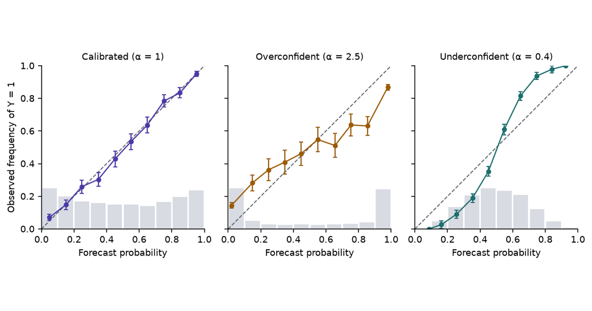

A forecast of 70% rain cannot be wrong on one day: it rains or it does not. It can be wrong over a season, if it rained on far more or far fewer than 70% of the days that got that forecast. That season-long check is calibration, and a decision model's probabilities need to pass it before software can act on them.

[Part 1](../jev-system-one-model/) described Jev, TypeSafe's model that answers typed questions with probabilities, and TypeSafe's claim that those probabilities are calibrated. This part defines calibration, measures it, and sets out the scoring rules that reward it. Those are the tools for judging the claim, and for asking what TypeSafe's training method, RLCD, could add to ordinary maximum likelihood. [Part 3](../recalibration-and-decisions/) repairs miscalibration on your own data and turns calibrated probabilities into decisions.

Statements about Jev carry a label. [vendor]{.tag-vendor} means documented by TypeSafe. [theory]{.tag-theory} means standard statistics. [inference]{.tag-inference} means our reading of documented facts. [speculation]{.tag-spec} means a hypothesis about undisclosed internals.

```{python}
#| label: setup
#| echo: false
import warnings

import matplotlib.pyplot as plt
import numpy as np
import pandas as pd
import statsmodels.api as sm
from IPython.display import Markdown
from scipy.special import expit, logit
from sklearn.metrics import roc_auc_score

warnings.filterwarnings("ignore")
plt.rcParams.update(
    {
        "figure.dpi": 140,
        "savefig.dpi": 140,
        "figure.facecolor": "white",
        "axes.facecolor": "white",
        "font.size": 9,
        "axes.titlesize": 9,
        "axes.spines.top": False,
        "axes.spines.right": False,
    }
)
INK, MUTED, RULE = "#1F2430", "#5F6672", "#D8DBE2"
PURPLE, TEAL, AMBER, PINK, BLUE = "#4A3AA7", "#1D6E6E", "#9A5B00", "#A8437A", "#0072B2"
EPS = 1e-3  # log loss clips probabilities to [EPS, 1 - EPS]
R = 200  # every quoted range is the median and 5-95% interval over R seeds
```

## Data

All data in this part is synthetic. One generating process stands in for a labelled evaluation set for a yes/no question, such as a Noul asking "Does this message request a refund?" over tickets whose true answer is known:

$$
X \sim N(0, 1), \qquad p^*(x) = \sigma(2x), \qquad Y \mid X = x \sim \operatorname{Bernoulli}\big(p^*(x)\big).
$$

- $x$ plays the role of the evidence in one ticket, and $p^*(x)$ is the true probability that the answer is yes.
- Simulation fixes $p^*$, so a forecaster's error can be measured against the truth instead of only estimated from labels.
- A wrong answer here has a price: a model that says 0.96 on cases that are yes 84% of the time automates decisions it should escalate.

Miscalibrated forecasters are built by distorting the true probability on the logit scale:

$$
\hat p_\alpha(x) = \sigma\big(\alpha \operatorname{logit} p^*(x)\big).
$$

$\alpha > 1$ pushes every probability away from 0.5 (overconfident); $\alpha < 1$ pulls it toward 0.5 (underconfident); $\alpha = 1$ is the truth.

```{python}
#| label: helpers
def draw(rng, n, slope=2.0):
    """X ~ N(0, 1), p*(x) = sigmoid(slope * x), Y ~ Bernoulli(p*)."""
    x = rng.standard_normal(n)
    p_star = expit(slope * x)
    y = (rng.random(n) < p_star).astype(float)
    return x, p_star, y


def distort(p, alpha):
    """sigmoid(alpha * logit(p)): alpha > 1 is overconfident, alpha < 1 underconfident."""
    return expit(alpha * logit(p))


def brier(p, y):
    return np.mean((p - y) ** 2)


def log_loss(p, y):
    p = np.clip(p, EPS, 1 - EPS)
    return -np.mean(y * np.log(p) + (1 - y) * np.log(1 - p))


def ece(p, y, m=15):
    """Binned ECE with m equal-width bins on the positive-class probability."""
    idx = np.minimum((p * m).astype(int), m - 1)
    gap = sum(np.sum(idx == b) * abs(y[idx == b].mean() - p[idx == b].mean()) for b in np.unique(idx))
    return gap / len(p)


def murphy(p, y, m=10):
    """Reliability, resolution and uncertainty on m equal-count bins of the forecast."""
    if np.unique(p).size <= m:
        groups = [np.flatnonzero(p == v) for v in np.unique(p)]
    else:
        groups = np.array_split(np.argsort(p, kind="stable"), m)
    ybar = y.mean()
    rel = sum(len(g) * (p[g].mean() - y[g].mean()) ** 2 for g in groups) / len(p)
    res = sum(len(g) * (y[g].mean() - ybar) ** 2 for g in groups) / len(p)
    return rel, res, ybar * (1 - ybar)


def reliability_bins(p, y, m=10):
    """Mean forecast, event frequency and count in m equal-width bins."""
    idx = np.minimum((p * m).astype(int), m - 1)
    rows = [(p[idx == b].mean(), y[idx == b].mean(), np.sum(idx == b)) for b in np.unique(idx)]
    return np.array(rows).T


def summary(a, d=3):
    a = np.asarray(a)
    return f"{np.median(a):.{d}f} [{np.quantile(a, 0.05):.{d}f}, {np.quantile(a, 0.95):.{d}f}]"


def cell(a, d=3):
    """Median over seeds, with the 5-95% interval on a second, smaller line."""
    a = np.asarray(a)
    lo, hi = np.quantile(a, [0.05, 0.95])
    return f"{np.median(a):.{d}f}<br><span class='rng'>{lo:.{d}f}–{hi:.{d}f}</span>"


def md_table(df):
    return Markdown(df.to_markdown(index=False, disable_numparse=True))
```

## Calibration

A binary forecaster outputs $\hat p(X) = P_\theta(Y = 1 \mid X)$. It is calibrated when

$$
P\big(Y = 1 \mid \hat p(X) = p\big) = p \quad \text{for every } p \text{ it outputs}.
$$

Among the cases that receive 0.8, about 80% are positive; among the cases that receive 0.1, about 10% are.

- The condition is on the forecast value, not on the input. Two inputs with the same $\hat p$ are pooled, however different they are.
- It is a statement about groups of predictions. TypeSafe's own documentation says the same about Jev: "Calibration is measured across groups of predictions; it does not guarantee that an individual answer is correct." [vendor]{.tag-vendor}

```{python}
#| label: tbl-reliability
#| tbl-cap: "Mean forecast and observed frequency of $Y = 1$ in five equal-width bins, one sample of 200,000 cases. The calibrated forecaster is $\\hat p_1 = p^*$; the overconfident one is $\\hat p_{2.5}$."
x, p_star, y = draw(np.random.default_rng(0), 200_000)
rows = []
edges = np.linspace(0, 1, 6)
for lo, hi in zip(edges[:-1], edges[1:]):
    row = {"Bin": f"[{lo:.1f}, {hi:.1f})"}
    for name, alpha in (("Calibrated", 1.0), ("Overconfident", 2.5)):
        p = distort(p_star, alpha)
        s = (p >= lo) & (p < hi)
        row[f"{name}: mean forecast"] = f"{p[s].mean():.3f}"
        row[f"{name}: frequency"] = f"{y[s].mean():.3f}"
    rows.append(row)
md_table(pd.DataFrame(rows))
```

```{python}
#| label: table-numbers
#| echo: false
p_over = distort(p_star, 2.5)
top = p_over >= 0.8
top_mean, top_freq = p_over[top].mean(), y[top].mean()
above_09 = p_over > 0.9
wrong_09, mean_09 = 1 - y[above_09].mean(), p_over[above_09].mean()
```

In the top bin the overconfident forecaster averages `{python} f"{top_mean:.2f}"` while the event happens `{python} f"{top_freq:.2f}"` of the time. A threshold of 0.9 on its output automates cases whose forecasts average `{python} f"{mean_09:.2f}"`, so they should be wrong about `{python} f"{100 * (1 - mean_09):.0f}"`% of the time. They are wrong `{python} f"{100 * wrong_09:.0f}"`% of the time.

### Multiclass calibration

A Choice answer is a probability vector $\hat{\mathbf p}(X)$ over $K$ options. Three definitions are in use [theory]{.tag-theory}:

1. **Canonical:** $P\big(Y = k \mid \hat{\mathbf p}(X) = \mathbf p\big) = p_k$ for every $k$ and every vector $\mathbf p$.
2. **Classwise:** $P\big(Y = k \mid \hat p_k(X) = c\big) = c$ for every $k$.
3. **Top-label:** $P\big(Y = \hat y \mid \max_k \hat p_k(X) = c\big) = c$, where $\hat y$ is the arg max.

Canonical calibration implies the other two, which do not imply each other. Vaicenavicius et al. (2019) give an example where both of the weaker conditions hold and canonical calibration fails. Machine learning papers usually call $\max_k \hat p_k$ the "confidence" and check top-label calibration (Guo et al. 2017). TypeSafe's `confidence` field is a different number: a statistic of the spread of the distribution, discussed in Part 1. This series writes $p_{\max}$ for the largest probability.

### Calibration and accuracy

A monotone distortion moves probabilities without changing which side of 0.5 they fall on, or the order of any two cases. Accuracy at 0.5 and AUC therefore cannot see it.

```{python}
#| label: tbl-metrics
#| tbl-cap: "Four forecasters on the same data, $n = 5{,}000$ per seed, 200 seeds: median, and the 5–95% interval beneath it. REL and RES are the Murphy reliability and resolution terms on ten equal-count bins."
forecasters = {"Calibrated": 1.0, "Overconfident α = 2.5": 2.5, "Underconfident α = 0.4": 0.4, "Base rate": None}
metric_names = ["Accuracy", "AUC", "Brier", "Log loss", "ECE", "REL", "RES"]
runs = {f: {m: [] for m in metric_names} for f in forecasters}
for r in range(R):
    x, p_star, y = draw(np.random.default_rng(1000 + r), 5000)
    for name, alpha in forecasters.items():
        p = np.full_like(p_star, y.mean()) if alpha is None else distort(p_star, alpha)
        rel, res, _ = murphy(p, y)
        vals = [np.mean((p > 0.5) == y), roc_auc_score(y, p) if alpha else 0.5, brier(p, y), log_loss(p, y), ece(p, y), rel, res]
        for m, v in zip(metric_names, vals):
            runs[name][m].append(v)
table = pd.DataFrame({"Metric": metric_names} | {f: [cell(runs[f][m]) for m in metric_names] for f in forecasters})
md_table(table)
```

```{python}
#| label: metrics-numbers
#| echo: false
med = {f: {m: np.median(runs[f][m]) for m in metric_names} for f in forecasters}
acc_same = all(
    np.allclose(runs["Calibrated"][m], runs[f][m]) for f in list(forecasters)[:3] for m in ("Accuracy", "AUC")
)
res_same = all(np.allclose(runs["Calibrated"]["RES"], runs[f]["RES"]) for f in list(forecasters)[:3])
```

- Accuracy and AUC are identical, seed by seed, for the calibrated, overconfident and underconfident forecasters (`{python} "true" if acc_same else "false"` for both metrics on all `{python} R` seeds). Brier, log loss and ECE all separate them.
- The base-rate forecaster gives every case the sample's base rate, about one half here, and is perfectly calibrated: its ECE is `{python} f"{med['Base rate']['ECE']:.3f}"`. It is also useless, with accuracy `{python} f"{med['Base rate']['Accuracy']:.2f}"` and AUC 0.5.
- A lower-accuracy forecaster can therefore be better calibrated than a higher-accuracy one. Calibration and discrimination are separate axes.

::: {.callout-caution title="Common misconception"}
"The model is 95% accurate, so its probabilities are trustworthy." Accuracy counts how often the arg max is right. Calibration asks whether the stated probability matches the frequency. A model can be 95% accurate and still say 0.999 on the 5% it gets wrong.
:::

### Calibration and uncertainty quantification

Calibration is one property of a predictive distribution. It leaves open the questions a full uncertainty analysis asks [theory]{.tag-theory}:

- **Individual correctness.** A calibrated 0.8 is wrong one time in five, and calibration does not say which time.
- **Sharpness.** The base-rate forecaster is calibrated and says nothing. Gneiting, Balabdaoui & Raftery (2007) frame the goal as maximising sharpness subject to calibration.
- **Conditional validity.** Calibration pools every case with the same forecast. It can hold on average while failing in every subgroup, which Part 3 demonstrates.
- **Source of uncertainty.** A calibrated probability does not separate noise in the outcome (aleatoric) from ignorance about the model (epistemic).
- **Shift.** Calibration is measured on one distribution. It is not a property the model carries to new data.

### Thresholds

Software turns a probability into an action with thresholds:

```python
if p > 0.99:
    execute_automatically()
elif p > 0.80:
    cheap_secondary_check()
else:
    human_review()
```

- The 0.99 line means "automate when the error rate is below 1%" only if $P(Y = 1 \mid \hat p > 0.99)$ is at least 0.99. That is a calibration statement.
- An overconfident model sends more cases over the line than the line was designed for. Part 3 prices the damage.

::: {.callout-note title="Statistical subtlety"}
TypeSafe's launch post says Jev is "Calibrated: higher confidence means higher accuracy." [vendor]{.tag-vendor} The second half describes monotonicity: accuracy rises with the score. Monotonicity is weaker than calibration. The $\alpha = 2.5$ forecaster is perfectly monotone and still says 0.96 where the frequency is 0.84. TypeSafe's AI primer states the stronger property ("Outcomes assigned a probability of `0.8` should occur about 80% of the time"), which is the one thresholds need. [vendor]{.tag-vendor}
:::

## Maximum likelihood, MAP and calibration

Maximum likelihood (MLE) and maximum a posteriori (MAP) estimation are procedures for choosing parameters:

$$
\hat\theta_{\mathrm{MLE}} = \arg\max_\theta \sum_{i=1}^n \log p_\theta(y_i \mid x_i),
\qquad
\hat\theta_{\mathrm{MAP}} = \arg\max_\theta \left[\sum_{i=1}^n \log p_\theta(y_i \mid x_i) + \log p(\theta)\right].
$$

Calibration is a property of the probabilities the fitted model then produces: $P(Y = 1 \mid \hat p = p) = p$. A procedure and a property are different kinds of object, so neither implies the other by definition.

### Log loss as a proper scoring rule

The negative log likelihood is the log loss, and the log loss is a strictly proper scoring rule [theory]{.tag-theory}. Its expectation is minimised only by the true conditional probability. Under four idealisations, minimising it recovers $p^*$ and therefore calibration:

1. infinite data, so the empirical loss equals the expected loss;
2. a correctly specified model family that contains $p^*$;
3. an optimiser that finds the global minimum;
4. test data drawn from the training distribution.

### Sources of miscalibration in MLE-trained models

Each idealisation fails in practice, and each failure has a known effect:

- **Finite samples and overparameterisation.** Coefficients are fitted to noise, and the fitted logits come out too large.
- **Misspecification.** The best model in a wrong family is the one closest to $p^*$ in KL divergence, which need not be calibrated.
- **Regularisation and MAP.** A prior shrinks logits toward zero and can leave a model underconfident.
- **Optimisation effects.** Early stopping, learning-rate schedules and label smoothing all change the final logit scale.
- **Dataset shift.** Calibration on the training distribution says nothing about a new one.
- **Class imbalance, label noise and model selection.** Resampling changes base rates; noisy labels change what "true" means; choosing the model with the best validation accuracy selects on a quantity that ignores calibration.

Guo et al. (2017) documented the effect in deep networks: modern architectures trained with the log loss were markedly overconfident, and a single temperature fitted on held-out data repaired most of it.

### Example: high-dimensional logistic regression

Logistic regression is the cleanest case. With an intercept, the MLE score equations force

$$
\sum_{i=1}^n \big(y_i - \hat p(x_i)\big) = 0
$$

on the training data. The mean forecast equals the base rate there, whatever else goes wrong.

The experiment fits an unpenalised logistic regression by Newton's method to $n = 1{,}000$ cases with $d = 200$ features. Only the first feature matters (true logit $2x_1$); the other 199 are noise. Sur & Candès (2019) showed that when $d/n$ is not small, the MLE inflates coefficients, so its probabilities come out too extreme; in their example at $d/n = 0.2$ the estimates average about 1.5 times the true values.

```{python}
#| label: mle
n_train, d, n_test = 1000, 200, 20_000
mle = {k: [] for k in ("citl", "ece_train", "ece_test", "slope", "ll_test", "ll_true")}
failed = 0
for r in range(R):
    rng = np.random.default_rng(9000 + r)
    X = rng.standard_normal((n_train, d))
    y = (rng.random(n_train) < expit(2 * X[:, 0])).astype(float)
    fit = sm.Logit(y, sm.add_constant(X)).fit(disp=0, maxiter=100)
    if not fit.mle_retvals["converged"]:
        failed += 1
        continue
    p_train = fit.predict(sm.add_constant(X))
    Xt = rng.standard_normal((n_test, d))
    p_true = expit(2 * Xt[:, 0])
    yt = (rng.random(n_test) < p_true).astype(float)
    p_test = fit.predict(sm.add_constant(Xt))
    slope = sm.Logit(yt, sm.add_constant(logit(np.clip(p_test, 1e-12, 1 - 1e-12)))).fit(disp=0).params[1]
    mle["citl"].append(abs(np.sum(y - p_train)))
    mle["ece_train"].append(ece(p_train, y))
    mle["ece_test"].append(ece(p_test, yt))
    mle["slope"].append(slope)
    mle["ll_test"].append(log_loss(p_test, yt))
    mle["ll_true"].append(log_loss(p_true, yt))
    if r == 0:
        example = (p_train, y, p_test, yt)
```

```{python}
#| label: fig-mle
#| fig-cap: "One seed of the high-dimensional logistic regression. Left: on its 1,000 training cases the MLE looks calibrated. Right: on 20,000 fresh cases its high forecasts are too high and its low forecasts too low. Larger dots hold more cases."
fig, axes = plt.subplots(1, 2, figsize=(7.2, 3.4), sharey=True)
for ax, (p, yy, title) in zip(axes, [(example[0], example[1], "Training data"), (example[2], example[3], "Test data")]):
    mp, fr, cnt = reliability_bins(p, yy)
    ax.plot([0, 1], [0, 1], color=MUTED, lw=1, ls="--", label="calibrated")
    ax.plot(mp, fr, color=PURPLE, lw=1.2)
    ax.scatter(mp, fr, s=400 * cnt / cnt.sum() + 8, color=PURPLE, zorder=3, label="binned frequency")
    ax.set(title=title, xlabel="Forecast probability", xlim=(0, 1), ylim=(0, 1))
    ax.set_aspect("equal")
axes[0].set_ylabel("Observed frequency of Y = 1")
axes[0].legend(frameon=False, loc="upper left")
plt.tight_layout()
plt.show()
```

Over `{python} R - failed` converged seeds:

- On training data, $\big|\sum_i (y_i - \hat p_i)\big|$ is at most `{python} f"{max(mle['citl']):.0e}"`: calibration in the large holds to solver precision.
- Training ECE is `{python} summary(mle['ece_train'])`. Test ECE is `{python} summary(mle['ece_test'])`.
- Regressing test outcomes on the model's test logit gives a calibration slope of `{python} summary(mle['slope'], 2)`. A slope below 1 means the logits are too large, which is overconfidence.
- Test log loss is `{python} summary(mle['ll_test'])` against `{python} summary(mle['ll_true'])` for the true probabilities.

The training-set number is close to the noise floor of a perfectly calibrated forecaster at $n = 1{,}000$ (@sec-ece). Evaluating calibration on the data the model was fitted to hides the defect.

## Proper scoring rules

A scoring rule $S(p, y)$ assigns a reward to the forecast $p$ when outcome $y$ occurs. Let the true distribution of $Y$ be $q$, while the forecaster reports $p$. The rule is **proper** if

$$
\mathbb E_{Y \sim q}\big[S(q, Y)\big] \ge \mathbb E_{Y \sim q}\big[S(p, Y)\big] \quad \text{for every } p,
$$

and **strictly proper** if equality holds only at $p = q$ (Gneiting & Raftery 2007).

- A proper rule makes an honest report of one's beliefs optimal in expectation. Reporting anything else cannot gain.
- Every strictly proper rule for categorical outcomes has the form $S(p, y) = G(p) + \langle G'(p), e_y - p \rangle$ for a strictly convex $G$ with subgradient $G'$, where $e_y$ is the indicator vector of the outcome. Different $G$ give different rules.
- Losses in this series are negatively oriented: lower is better. A loss $L$ is proper when $-L$ is.

### Brier score

For a binary outcome the Brier score (Brier 1950) is the squared error of the probability:

$$
\mathrm{BS}(p, y) = (p - y)^2.
$$

It penalises each outcome by the distance from $p$ to where the forecast should have been:

$$
y = 1: \ \mathrm{BS} = (1 - p)^2, \qquad y = 0: \ \mathrm{BS} = p^2.
$$

With $Y \sim \operatorname{Bernoulli}(q)$, the expected score is

$$
\mathbb E\big[(p - Y)^2\big] = q(p - 1)^2 + (1 - q)p^2 = q(p^2 - 2p + 1) + (1 - q)p^2 = p^2 - 2pq + q.
$$

Its derivative in $p$ is

$$
\frac{d}{dp}\,\mathbb E\big[(p - Y)^2\big] = 2p - 2q,
$$

which is zero only at $p = q$, and the second derivative is $2 > 0$. The expected Brier score is minimised by the true probability. Writing it as $(p - q)^2 + q(1 - q)$ shows the penalty for misreporting is the squared distance $(p - q)^2$.

For $K$ classes, with $y_k = 1$ for the observed class and 0 otherwise:

$$
\mathrm{BS}(\mathbf p, y) = \sum_{k=1}^K (p_k - y_k)^2.
$$

### Log score

The log score rewards the probability placed on what happened (Good 1952):

$$
S(p, y) = \log p_y, \qquad L(p, y) = -\log p_y,
$$

which for a binary outcome is the familiar

$$
L = -y \log p - (1 - y) \log(1 - p).
$$

Its expectation splits into the entropy of $q$ and the Kullback–Leibler divergence from $q$ to $p$:

$$
\mathbb E_{Y \sim q}\big[-\log p_Y\big] = -\sum_k q_k \log p_k = H(q) + \mathrm{KL}(q \,\|\, p).
$$

$H(q)$ does not depend on the report and $\mathrm{KL}(q\,\|\,p) \ge 0$ with equality only at $p = q$, so the log score is strictly proper.

The two rules differ in how they charge for a high probability on the wrong outcome:

- Brier is quadratic and bounded: the worst possible loss is 1.
- Log loss is unbounded: a probability of 0.001 on an event that happens costs $-\log 0.001 \approx 6.9$.
- Both judge the whole probability, not just the arg max.

```{python}
#| label: fig-penalty
#| fig-cap: "Loss when the event happens, as a function of the probability the forecaster gave it. Brier stays below 1; log loss grows without bound as the probability goes to zero."
p = np.linspace(0.001, 1, 800)
fig, ax = plt.subplots(figsize=(6.2, 3.2))
ax.plot(p, -np.log(p), color=PURPLE, lw=1.8, label=r"log loss $-\log p$")
ax.plot(p, (1 - p) ** 2, color=TEAL, lw=1.8, label=r"Brier $(1-p)^2$")
for pp in (0.01, 0.1):
    ax.annotate(f"p = {pp}: log {-np.log(pp):.1f}, Brier {(1 - pp) ** 2:.2f}", xy=(pp, -np.log(pp)),
                xytext=(pp + 0.12, -np.log(pp) + 0.4), fontsize=8, color=INK,
                arrowprops=dict(arrowstyle="-", color=MUTED, lw=0.8))
ax.set(xlabel="Probability given to the event that happened", ylabel="Loss", xlim=(0, 1), ylim=(0, 7))
ax.legend(frameon=False)
plt.tight_layout()
plt.show()
```

The widget puts a forecaster with true belief $q$ in front of four rules. Move the report $p$ away from $q$ and every proper rule charges for it. The improper absolute error rewards jumping to 0 or 1 whenever $q \ne 0.5$, and at $q = 0.5$ it cannot tell any two reports apart.

::: {#widget-scoring-rules}
:::

### Other proper scoring rules

Propriety matters more than the choice among proper rules. The rules differ in what outcomes they handle and how they weight errors:

| Rule | Loss for outcome $y$ | Proper? | Use |
|:---|:---|:---|:---|
| Multiclass log | $-\log p_y$ | strictly | $K$ classes; the cross-entropy used to train classifiers; unbounded |
| Multiclass Brier | $\sum_k (p_k - y_k)^2$ | strictly | $K$ classes; bounded |
| Spherical | $-p_y / \lVert \mathbf p \rVert_2$ | strictly | $K$ classes; bounded |
| Ranked probability (RPS) | $\sum_{k=1}^{K-1} \big(P_k - \mathbb 1\{y \le k\}\big)^2$ | strictly | ordered levels; $P_k$ is cumulative, so near misses cost less (Epstein 1969) |
| CRPS | $\int \big(F(z) - \mathbb 1\{y \le z\}\big)^2 dz$ | strictly | continuous outcomes; RPS in the limit (Matheson & Winkler 1976) |
| Absolute error | $\lvert p - y \rvert$ | no | minimised at 0 or 1, not at $q$ |
| 0–1 loss of the arg max | $\mathbb 1\{\hat y \ne y\}$ | no | ignores the probability |

: Scoring rules for categorical and continuous outcomes, written as losses. {#tbl-rules}

A Score question returns a distribution over ordered levels, so RPS is the natural rule for evaluating it: putting mass on "frustrated" when the truth is "very angry" should cost less than putting it on "calm". This is a suggestion for evaluation, not a statement about how Jev is trained [inference]{.tag-inference}.

### Brier decomposition

Murphy (1973) split the Brier score of forecasts that take a finite set of values $f_b$, with $n_b$ cases and observed frequency $\bar y_b$ at each value:

$$
\mathrm{BS} = \underbrace{\frac1n \sum_b n_b (f_b - \bar y_b)^2}_{\text{reliability (REL)}} - \underbrace{\frac1n \sum_b n_b (\bar y_b - \bar y)^2}_{\text{resolution (RES)}} + \underbrace{\bar y (1 - \bar y)}_{\text{uncertainty}}.
$$

- REL is a calibration error: zero when every forecast value matches its frequency.
- RES rewards forecasts that separate cases with different outcome rates. It is where discrimination lives.
- Uncertainty depends only on the data.

@tbl-metrics computes REL and RES on ten equal-count bins. The bins depend only on the order of the forecasts, and a monotone distortion keeps the order, so RES is identical for the three distorted forecasters (`{python} "true" if res_same else "false"` on every seed) and only REL moves. A proper score is not a calibration metric: it adds calibration and discrimination into one number.

## RLHF, RLVR and RLCD {#sec-rlcd}

Post-training reward decides what a model is pushed toward. The three methods named in TypeSafe's AI primer reward different things.

### RLHF

Reinforcement learning from human feedback (Christiano et al. 2017; Ouyang et al. 2022) fits a reward model to human comparisons and optimises the policy against it:

$$
x \rightarrow (y_1, y_2) \rightarrow \text{human preference} \rightarrow r_\phi(x, y) \rightarrow \max_\pi \ \mathbb E_{y \sim \pi(\cdot \mid x)}\big[r_\phi(x, y)\big] - \beta\,\mathrm{KL}(\pi \,\|\, \pi_{\text{ref}}).
$$

- **Objective:** produce responses people prefer.
- Nothing in $r_\phi$ scores a probability against an outcome. A fluent answer that sounds certain can be preferred whether or not the certainty is warranted.
- The evidence agrees. In the GPT-4 technical report the pre-trained model has an ECE of 0.007 on a subset of MMLU and the post-trained model 0.074 (OpenAI 2023, Figure 8). Kadavath et al. (2022) found RLHF policies poorly calibrated until a temperature of 2.5 was applied.

### RLVR

Reinforcement learning with verifiable rewards replaces the reward model with a program that checks the answer: a unit test, a proof checker, an exact-match grader (Lambert et al. 2024).

- **Objective:** produce an answer that passes the verifier.
- A pass/fail reward $r = \mathbb 1\{\text{correct}\}$ has expectation $P(\text{correct})$. It rewards being right more often and says nothing about reporting how often one is right.

### RLCD

TypeSafe describes RLCD as "Reinforcement learning for calibrated decisions", which "trains TypeSafe to return decisions and calibrated probabilities instead of generated text" [vendor]{.tag-vendor}. The launch post says it optimises for "answers with epistemically honest probabilities on System One tasks", and the documentation says the probabilities "are optimized against outcomes to reflect uncertainty" [vendor]{.tag-vendor}.

- **Claimed objective:** typed decisions whose probabilities match empirical frequencies of being correct.
- **Undisclosed:** the reward, the loss, the source of the outcomes, the training data, and how calibration is evaluated.

The theory suggests a chain:

```{mermaid}
%%| label: fig-rlcd-chain
%%| fig-cap: "How a calibration objective connects to older ideas. Each link is standard theory; which links RLCD uses is not public."
flowchart LR
  A["RLCD<br/>(reward undisclosed)"] <--> B["probabilistic<br/>forecasting"]
  B <--> C["proper<br/>scoring rules"]
  C <--> D["calibration"]
```

**Could RLCD simply reward decisions with a proper scoring rule?** It is mathematically plausible and has published precedent. Damani et al. (2025) train a reasoning model to state a probability $c$ that its answer is correct, with the reward $\mathbb 1\{\text{correct}\} - \big(c - \mathbb 1\{\text{correct}\}\big)^2$: a correctness term plus a Brier term. No TypeSafe source says RLCD does this. It should not be stated as Jev's implementation [speculation]{.tag-spec}.

The theory also limits what RL can add [inference]{.tag-inference}. If the model outputs a distribution $p_\theta(\cdot \mid x)$ directly and the reward is a proper score $S(p_\theta, y)$ of that distribution, the expected reward is the negative of an ordinary supervised loss, and its gradient is the supervised gradient. For the log score that is maximum likelihood again. RL earns its keep only where the supervised setting does not fit. Hypotheses, none confirmed [speculation]{.tag-spec}:

1. **Rewards from downstream outcomes**, such as whether a routed ticket was resolved, which arrive without a label for the question asked.
2. **Sequence-level decisions**, where a chain of typed answers is scored as a whole.
3. **Off-policy data**, reweighting logged decisions made by an earlier model.
4. **Exploration**, choosing which questions to learn from.
5. **Operational utilities** optimised alongside a calibration term, such as a cost for escalation.
6. **Non-differentiable environments**, where a workflow's result cannot be backpropagated.
7. **Delayed outcomes**, known days after the decision.

The question that matters for a user does not depend on the answer. Whatever RLCD optimises, calibration on your data is checked with the tools in @sec-reliability and @sec-ece.

## Reliability diagrams {#sec-reliability}

A reliability diagram (Niculescu-Mizil & Caruana 2005 popularised it in machine learning; the idea comes from weather forecasting) estimates the calibration function $m(p) = P(Y = 1 \mid \hat p = p)$ by binning:

1. Split the forecasts into $M$ bins, here ten of width 0.1.
2. In each bin, plot the mean forecast against the fraction of positive outcomes.
3. Compare with the diagonal $y = x$, which is perfect calibration.

```{python}
#| label: fig-reliability
#| fig-cap: "Reliability diagrams for three forecasters on one sample of 5,000 cases. Error bars are 95% binomial intervals; the grey bars along the bottom are the histogram of forecasts. The overconfident forecaster's curve is flatter than the diagonal; the underconfident one's is steeper."
x, p_star, y = draw(np.random.default_rng(1), 5000)
fig, axes = plt.subplots(1, 3, figsize=(8.4, 3.2), sharey=True)
for ax, (title, alpha, colour) in zip(axes, [("Calibrated (α = 1)", 1.0, PURPLE), ("Overconfident (α = 2.5)", 2.5, AMBER), ("Underconfident (α = 0.4)", 0.4, TEAL)]):
    p = distort(p_star, alpha)
    mp, fr, cnt = reliability_bins(p, y)
    half = 1.96 * np.sqrt(fr * (1 - fr) / cnt)
    counts, _ = np.histogram(p, bins=np.linspace(0, 1, 11))
    ax.bar(np.linspace(0.05, 0.95, 10), 0.25 * counts / counts.max(), width=0.09, color=RULE, zorder=0)
    ax.plot([0, 1], [0, 1], color=MUTED, lw=1, ls="--")
    ax.errorbar(mp, fr, yerr=half, fmt="o-", color=colour, ms=4, lw=1.2, capsize=2)
    ax.set(title=title, xlabel="Forecast probability", xlim=(0, 1), ylim=(0, 1))
    ax.set_aspect("equal")
axes[0].set_ylabel("Observed frequency of Y = 1")
plt.tight_layout()
plt.show()
```

Read the curve against the diagonal, and read it on both sides of 0.5:

- **Overconfident:** above the diagonal at low forecasts and below it at high forecasts. The curve is flatter than the forecasts claim.
- **Underconfident:** the reverse, steeper than the diagonal.
- **Biased:** entirely above (forecasts too low) or entirely below (too high).

Binning has costs [theory]{.tag-theory}:

- The picture depends on the number and placement of bins, and sparse bins at the extremes carry wide intervals.
- A bin averages over all the cases in it, so structure inside a bin disappears.
- Equal-width bins put most cases of a sharp forecaster into the two end bins, where a small gap on many cases matters most.

Part 3 replaces the bins with a LOESS curve. In the lab, $\alpha$ distorts the forecaster; $n$, the bin count and the LOESS span change how well a finite sample reveals it.

::: {#widget-calibration-lab}
:::

```{=html}
<script src="widgets.js"></script>
```

- Slide $\alpha$ from 0.25 to 4 at $n = 1{,}000$. Accuracy and AUC do not move. ECE, Brier and log loss bottom out between about $\alpha = 0.85$ and $1.15$, depending on the sample.
- Set $\alpha = 1$ and $n = 200$, then draw new samples. With the lab's default of fifteen bins, ECE lands between about 0.06 and 0.11 for a forecaster whose forecasts are the true probabilities; at $n = 20{,}000$ it falls to about 0.008.

## Expected calibration error {#sec-ece}

The expected calibration error summarises a reliability diagram in one number (Naeini et al. 2015; Guo et al. 2017):

$$
\mathrm{ECE} = \sum_{m=1}^M \frac{|B_m|}{n} \left| \operatorname{acc}(B_m) - \operatorname{conf}(B_m) \right|.
$$

In the top-label form, $B_m$ holds the cases whose $p_{\max}$ falls in bin $m$, $\operatorname{acc}(B_m)$ is the fraction of them whose arg max is correct, and $\operatorname{conf}(B_m)$ is their mean $p_{\max}$. For a binary problem this series uses the positive-class form: frequency of $Y = 1$ against mean $\hat p$, fifteen equal-width bins.

ECE is useful and flawed [theory]{.tag-theory}:

- **Binning dependence.** Different bin counts give different values on the same forecasts.
- **Sample-size dependence.** Noise in each bin's frequency is added as an absolute value, so the plug-in estimate is biased upward, and the bias shrinks only as $n$ grows (Kumar, Liang & Ma 2019).
- **Cancellation.** Gaps of opposite sign inside one bin cancel, which hides local miscalibration.
- **Not a proper score.** The base-rate forecaster scores zero in @tbl-metrics. Minimising ECE alone rewards saying the base rate.

```{python}
#| label: fig-ece-bias
#| fig-cap: "ECE of a forecaster whose forecasts are the true probabilities, against sample size, for three bin counts; median and 5–95% band over 200 seeds. The dotted line is the median ECE of the overconfident forecaster ($\\alpha = 2.5$) at $n = 5{,}000$ from @tbl-metrics."
sizes = [100, 300, 1000, 3000, 10_000, 30_000]
bias = {m: [] for m in (5, 15, 30)}
for n in sizes:
    vals = {m: [] for m in bias}
    for r in range(R):
        x, p_star, y = draw(np.random.default_rng(5000 + r), n)
        for m in bias:
            vals[m].append(ece(p_star, y, m))
    for m in bias:
        bias[m].append(np.quantile(vals[m], [0.05, 0.5, 0.95]))
fig, ax = plt.subplots(figsize=(6.2, 3.4))
for m, colour in zip(bias, (TEAL, PURPLE, AMBER)):
    q = np.array(bias[m])
    ax.fill_between(sizes, q[:, 0], q[:, 2], color=colour, alpha=0.15, lw=0)
    ax.plot(sizes, q[:, 1], "o-", color=colour, ms=3.5, lw=1.4, label=f"{m} bins")
ax.axhline(med["Overconfident α = 2.5"]["ECE"], color=INK, lw=1, ls=":")
ax.set(xscale="log", xlabel="Sample size n", ylabel="ECE of a calibrated forecaster")
ax.legend(frameon=False)
plt.tight_layout()
plt.show()
ece_100 = np.array(bias[15])[0, 1]
ece_1000 = np.array(bias[15])[2, 1]
```

- With fifteen bins, a calibrated forecaster scores a median ECE of `{python} f"{ece_1000:.3f}"` at $n = 1{,}000$ and `{python} f"{ece_100:.3f}"` at $n = 100$.
- At $n = 100$ that noise floor matches the ECE of the overconfident forecaster at $n = 5{,}000$ (`{python} f"{med['Overconfident α = 2.5']['ECE']:.3f}"`). A small evaluation set cannot tell a calibrated model from a badly miscalibrated one by ECE.
- ECE values are comparable only at equal $n$ and equal binning. A published ECE without both is hard to interpret.

Brier score and log loss measure more than calibration. By the Murphy decomposition, a lower Brier score can come from better calibration, better discrimination, or both, and @tbl-metrics shows the two moving separately. Report a proper score for overall quality and a calibration measure, with its sample size and binning, for calibration.

## Constraints

- Every experiment is synthetic and binary. The Choice and Score primitives need the multiclass and ordinal versions of the same checks.
- None of the numbers measure Jev. No independent evaluation of Jev's calibration had been published when this was written.
- The overconfident forecaster is a logit-scale distortion. Real miscalibration can be non-monotone, local, or different in subgroups.

Calibration. Checks. Frequencies. Accuracy. Checks. Labels. Proper. Scores. Reward. Both.

## References

- Brier, G. W. (1950). [Verification of forecasts expressed in terms of probability](https://doi.org/10.1175/1520-0493(1950)078%3C0001:VOFEIT%3E2.0.CO;2). *Monthly Weather Review* 78(1), 1–3.
- Christiano, P. et al. (2017). [Deep reinforcement learning from human preferences](https://arxiv.org/abs/1706.03741). *NeurIPS*.
- Damani, M. et al. (2025). [Beyond binary rewards: training LMs to reason about their uncertainty](https://arxiv.org/abs/2507.16806). arXiv.
- Epstein, E. S. (1969). [A scoring system for probability forecasts of ranked categories](https://doi.org/10.1175/1520-0450(1969)008%3C0985:ASSFPF%3E2.0.CO;2). *Journal of Applied Meteorology* 8(6), 985–987.
- Gneiting, T., Balabdaoui, F. & Raftery, A. E. (2007). [Probabilistic forecasts, calibration and sharpness](https://doi.org/10.1111/j.1467-9868.2007.00587.x). *JRSS B* 69(2), 243–268.
- Gneiting, T. & Raftery, A. E. (2007). [Strictly proper scoring rules, prediction, and estimation](https://doi.org/10.1198/016214506000001437). *JASA* 102(477), 359–378.
- Good, I. J. (1952). [Rational decisions](https://doi.org/10.1111/j.2517-6161.1952.tb00104.x). *JRSS B* 14(1), 107–114.
- Guo, C., Pleiss, G., Sun, Y. & Weinberger, K. Q. (2017). [On calibration of modern neural networks](https://proceedings.mlr.press/v70/guo17a.html). *ICML*.
- Kadavath, S. et al. (2022). [Language models (mostly) know what they know](https://arxiv.org/abs/2207.05221). arXiv.
- Kumar, A., Liang, P. & Ma, T. (2019). [Verified uncertainty calibration](https://arxiv.org/abs/1909.10155). *NeurIPS*.
- Lambert, N. et al. (2024). [Tülu 3: pushing frontiers in open language model post-training](https://arxiv.org/abs/2411.15124). arXiv.
- Matheson, J. E. & Winkler, R. L. (1976). [Scoring rules for continuous probability distributions](https://doi.org/10.1287/mnsc.22.10.1087). *Management Science* 22(10), 1087–1096.
- Murphy, A. H. (1973). [A new vector partition of the probability score](https://doi.org/10.1175/1520-0450(1973)012%3C0595:ANVPOT%3E2.0.CO;2). *Journal of Applied Meteorology* 12(4), 595–600.
- Naeini, M. P., Cooper, G. F. & Hauskrecht, M. (2015). [Obtaining well calibrated probabilities using Bayesian binning](https://doi.org/10.1609/aaai.v29i1.9602). *AAAI*.
- Niculescu-Mizil, A. & Caruana, R. (2005). [Predicting good probabilities with supervised learning](https://doi.org/10.1145/1102351.1102430). *ICML*.
- OpenAI (2023). [GPT-4 technical report](https://arxiv.org/abs/2303.08774). arXiv.
- Ouyang, L. et al. (2022). [Training language models to follow instructions with human feedback](https://arxiv.org/abs/2203.02155). *NeurIPS*.
- Sur, P. & Candès, E. J. (2019). [A modern maximum-likelihood theory for high-dimensional logistic regression](https://doi.org/10.1073/pnas.1810420116). *PNAS* 116(29), 14516–14525.
- Vaicenavicius, J. et al. (2019). [Evaluating model calibration in classification](https://proceedings.mlr.press/v89/vaicenavicius19a.html). *AISTATS*.
- TypeSafe (2026). [Introducing System One Models & Jev](https://typesafe.ai/blog/introducing-system-one-models-and-jev). Launch post, 2026-09-15.
- TypeSafe (2026). Documentation: [System One](https://docs.typesafe.ai/concepts/system-one), [AI primer](https://docs.typesafe.ai/introduction/machine-learning-primer), [Confidence](https://docs.typesafe.ai/confidence). Accessed 2026-09-27.
- [Calibrated Decisions, Part 1: Jev and the System One Model](../jev-system-one-model/) — what Jev returns and what TypeSafe claims.
- [Calibrated Decisions, Part 3: Recalibration and Decisions](../recalibration-and-decisions/) — LOESS, recalibration maps, domain shift and cost-based thresholds.
- [Tribes and Calibration](../tribes-and-calibration/) — Platt and temperature scaling in another setting.
