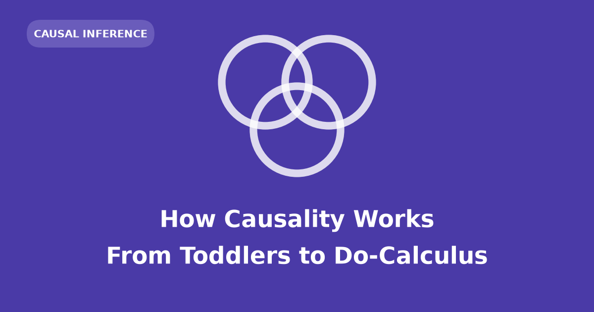

A two-year-old at a light switch does not have a sample size. They flip it, watch the
room, flip it again, and by the third repetition they own the fact: this thing causes
that thing. No control group, no p-value, no worry about unmeasured confounding. Science
spends enormous effort recovering that certainty and mostly falls short — not because
scientists reason worse than toddlers, but because the questions worth asking rarely
permit the toddler's one move. Reach out and wiggle the world yourself.

## A toddler runs the whole causal-inference curriculum before school

The instinct arrives early, in pieces. Albert Michotte, screening crude animations in the
1940s, found that a square sliding into a second square that immediately moves off is not
*seen* as two events but as a launch, as directly as a colour is. Add a fifth of a
second of delay and the impression collapses into unrelated motions. Infants show the same
sensitivity to contact and timing before they have words for either.

Perception alone is a poor detector, so children add statistics. In Gopnik's blicket
detector studies, a machine lights up when certain blocks are set on it, and preschoolers
track which blocks coincide with the light. They discount a block whose apparent power is
fully explained by another present at the same time: toddlers screen off spurious
associations.

Then they do what no observer can: they intervene. A child at an unfamiliar machine does
not wait for informative data; they push, pull and remove one block at a time,
manufacturing comparisons a watcher might wait years for. Play is experimental design.

By three or four the counterfactual arrives — *if you hadn't knocked it, it would still be
standing* — and with it blame and regret. They also start demanding mechanism, building
naive theories of how plants grow, and taking causal claims on testimony.

Formal science is this toolkit — perception, covariation, intervention, counterfactuals,
mechanism, testimony — made explicit, written down and left where strangers can check it.

## Time is causality's most reliable symptom, not its essence

The toolkit leans hard on one regularity: causes come first. Hume built his account on it,
defining a cause as constant conjunction plus temporal priority plus contiguity. Modern
accounts drop it. Pearl's causes are fixed by structural equations,
Woodward's by what stays invariant under intervention; in both the essential relation is
dependence — change the cause, the effect follows — with time order nowhere in the
definition.

The gap shows where nothing waits. A book resting on a table causes the tabletop's
deformation *now*: pressure and sag are simultaneous, as equilibrium models in economics
assume. Temporal order remains the best-behaved symptom of causation we have, and the
methods below lean on it in one specific place — deciding which variables count as
pre-treatment, and so which are safe to adjust for. It just isn't what causation is.

## Two dashboard numbers, and the budget riding on each

Dependence under intervention is the thing to measure, then, and measuring it is expensive
enough that nobody funds it out of curiosity. Everything below runs on one company and two
numbers somebody is about to act on.

Picture a consumer subscription app: roughly two million monthly actives, about $30 of
spend per user per month across subscriptions and in-app add-ons, and a growth team three
weeks out from quarterly planning.

**The promotion.** Marketing sent a $5-off coupon to 400,000 users across the November and
December window. It applies automatically at checkout, so it costs roughly $5 of margin per
recipient per month whether or not the recipient noticed it — which makes finance's rule for
renewing the $2M annual promo budget a single comparison: the programme pays for itself only
if it *adds* more than $5 of monthly spend per user *sent*. Treating incremental spend as near-pure margin is generous to the promo; it is
the assumption its defenders would choose, and the promo will lose anyway. The dashboard
says promoted users spend $10.35 more per month.

**The feature.** "Collections" — saved, curated lists — shipped to everyone four months
ago, and about half the userbase has touched it. Three decisions ride on its measured
lift: whether next quarter's engineering goes into deepening it or into the checkout
redesign, whether the onboarding flow spends one of its few slots pushing it, and, quietly,
which team gets credited at review time. The dashboard says adopters spend $9.26 more per
month.

Both numbers are correct, in the sense that the SQL is correct. Neither is the number
either decision needs.

No real company is being reported on here: every figure below comes from a simulation
whose code is on the page. That is not a convenience, it is the only way to grade the
methods. The quantity all of them estimate — what a user would have spent under the
treatment they did not get — is missing from every real dataset by construction, so a real
dataset can tell you which estimator you *like* but never which one is right. Writing the
true effect down first and then hiding it is the only experiment available.

What the simulation stands in for is ordinary product telemetry: an event log of sessions
and feature touches joined to a billing table, one row per user per month, of the sort
every subscription business already has sitting in a warehouse. The generating processes
are deliberately small — a holiday flag, a pre-launch engagement score, a tenure
variable — because the failure being demonstrated needs no complexity to appear. It
appears with one confounder and eight thousand rows, and here it is worth about $2M a year.

## Pearl draws the assumption, Rubin does the arithmetic

Two traditions grew up around questions like these, and the folklore says they compete.
They don't, and the division of labour is the reason both appear below on both examples.
Judea Pearl's graphical framework is a language for *declaring* what causes what, and its
payoff is a verdict: given this structure, is the effect recoverable from data at all, and
which variables must you adjust for? Neyman and Rubin's potential outcomes framework is a
language for *estimating*: given that some set of variables suffices, here is how to
weight, impute or match your way to a number, with a standard error attached. One licenses
the adjustment; the other performs it. A third tradition, uplift modelling, throws the
average away entirely and asks the question a platform actually acts on.

Pearl's *ladder of causation* sorts the growth team's questions by how much of the world
you have to be able to move to answer them.

```{mermaid}
flowchart TB
  R1["<b>1 · Seeing</b><br/>what promoted users spend<br/><i>the dashboard: +$10.35</i>"]
  R2["<b>2 · Doing</b><br/>what happens if we send the coupon<br/><i>the budget-renewal decision</i>"]
  R3["<b>3 · Imagining</b><br/>what this user would have done untreated<br/><i>who to target, and who to spare</i>"]
  R1 -->|"needs a causal assumption"| R2
  R2 -->|"needs a model per user"| R3
```

Every dashboard in the company lives on rung one. Both decisions in the planning meeting
live on rung two, the targeting question on rung three, and no quantity of rung-one data
climbs by itself. The promo shows what the climb costs.

## The promo's $10.35 is mostly the holiday, not the coupon

Start where Pearl starts, by drawing the assumption. A directed graph declares which
variables cause which, and the `do` operator is surgery on it: delete every arrow *into*
the treatment, because you, not the world, decide who gets it now.

::: {.callout-note}
## Confounder
A variable that causes both the treatment and the outcome, manufacturing correlation
between two variables with no causal arrow linking them. That is how "correlated with" and
"causes" come apart.
:::

Marketing sent the coupon during the holiday window, when people were going to spend more
anyway. The holiday therefore causes both the promo and the spend, and the two get tangled
along a path — `promo ← holiday → spend` — that runs *backwards* out of the treatment.
Pearl calls it a backdoor path, and the surgery is what cuts it.

```{mermaid}
flowchart LR
  subgraph OBS["What marketing ran"]
    direction TB
    H1["🎄 holiday window"] -->|"targeting rule"| P1["promo sent"]
    H1 -->|"people spend more<br/>anyway (the backdoor)"| S1["monthly spend"]
    P1 -->|"the effect we want"| S1
  end

  subgraph DOG["do(promo): a coin decides"]
    direction TB
    C2(("coin")) --> P2["promo sent"]
    H2["🎄 holiday window"] --> S2["monthly spend"]
    P2 -->|"the effect we want"| S2
  end

  %% Invisible link, purely to pin the observed graph left of the surgery.
  OBS ~~~ DOG
```

### Pearl: the surgery deletes the arrow into the promo

The graph is a claim, not a result, so the way to test it is to build a world that obeys
it. Below a promo truly adds $4 of monthly spend. We run the same world twice, changing
only who gets the promo: first marketing chooses, then a coin does.

```{python}
import networkx as nx
import numpy as np

rng = np.random.default_rng(7)
n = 20_000
TRUE_LIFT = 4.0  # dollars of monthly spend a promo really causes
COUPON_COST = 5.0  # dollars of margin the coupon gives away each month

# The assumed structure: the holiday window drives targeting *and* spending.
g = nx.DiGraph([("holiday", "promo"), ("holiday", "spend"), ("promo", "spend")])
print("parents of spend:", sorted(g.predecessors("spend")))


# One population, drawn once: the same users, the same holidays, the same luck.
holiday = rng.binomial(1, 0.3, n)  # 30% of users are in a holiday window
luck = rng.normal(0, 5, n)


def assign(marketing_targets: bool):
    # Intervening severs holiday -> promo: a coin decides, so targeting can't bias it.
    p = 0.2 + 0.6 * holiday if marketing_targets else np.full(n, 0.5)
    return rng.binomial(1, p)


def spend_under(promo):
    return 30 + 12 * holiday + TRUE_LIFT * promo + luck


def gap(promo, spend):
    return round(spend[promo == 1].mean() - spend[promo == 0].mean(), 2)


promo = assign(marketing_targets=True)  # who marketing chose
promo_rct = assign(marketing_targets=False)  # who a coin would have chosen
spend, spend_rct = spend_under(promo), spend_under(promo_rct)

dashboard = gap(promo, spend)
do_estimate = gap(promo_rct, spend_rct)
print("seeing, E[spend | promo]    :", dashboard)
print("doing,  E[spend | do(promo)]:", do_estimate)
```

Seeing credits the promo with $10.35; doing returns $4.06, within noise of the true $4. The
surplus is the holiday arriving along a path that was never causal, and no further
observation shrinks it — the promo looks two and a half times better than it is because it
was aimed at people already about to spend. Randomise the send and the bias is gone. The
trouble is that nobody can rerun last December.

### Rubin: the same $4 without the rerun

Randomising was a simulation luxury; the growth team has one dataset, the targeted one.
Rubin's framework is built for exactly that position. Give each unit two potential
outcomes — spend under the coupon and spend without it — and the causal effect is their
difference, unobservable by construction, because only one of the two ever happens.

::: {.callout-note}
## Counterfactual
The outcome that would have occurred under the treatment a unit did not receive. Every
estimate in this post is an attempt to fill that missing column with something defensible.
:::

Randomisation would make the missing column *ignorable*: coin-flip assignment leaves the
groups differing only by chance, so group averages stand in for each other. Absent the
coin, you argue for a weaker version — treatment is as good as random *among users alike
on the holiday flag* — which is precisely what Pearl's graph already licensed by naming
`{holiday}` as a set that blocks the backdoor. Inverse propensity weighting cashes that
licence in.

```{python}
from sklearn.linear_model import LogisticRegression

# Only the observational arm: marketing targeted, and there is no rerun.
X = holiday[:, None]
ps = LogisticRegression().fit(X, promo).predict_proba(X)[:, 1]

# Weight each user by 1 / P(the arm they landed in), rebuilding a population in
# which the holiday no longer predicts who was sent a coupon.
w = np.where(promo == 1, 1 / ps, 1 / (1 - ps))
ipw_promo = round(
    np.average(spend[promo == 1], weights=w[promo == 1])
    - np.average(spend[promo == 0], weights=w[promo == 0]),
    2,
)
print("dashboard gap      :", dashboard)
print("propensity-weighted:", ipw_promo)
```

Weighting recovers $3.88 from the same rows the dashboard read as $10.35, and it never saw
the randomised world. Pearl said *which* variable to adjust for and that adjusting for it
was enough; Rubin said what to do about it. The estimate that comes out is close enough to
the coin-flip rerun that the difference no longer matters — but the decision it implies is
the opposite one.

### The decision flips, and it flips against the promo

The break-even is the only arithmetic finance needs, and the two estimates fall on opposite
sides of it.

```{mermaid}
flowchart LR
  D["one dataset<br/>400k coupons<br/>sent in Nov–Dec"]
  D --> N["read it raw<br/><b>+$10.35</b>"]
  D --> A["adjust for<br/>the holiday<br/><b>+$3.88</b>"]
  N --> N2["clears the $5<br/>coupon cost<br/>→ renew the $2M budget"]
  A --> A2["misses the $5<br/>coupon cost<br/>→ stop, or retarget off-season"]
  N2 --> N3["≈ −$1 per user<br/>per month, booked<br/>as the quarter's win"]
  A2 --> A3["$2M freed, and the<br/>holiday cohort stops<br/>being double-counted"]
```

Plotting the estimates against that $5 line makes the sign change visible: everything the
adjustment does is move the programme from one side of a decision boundary to the other.

```{python}
#| fig-cap: "Two readings of December against the coupon's own cost, plus the randomised rerun nobody gets to run. Only the unadjusted reading clears break-even."
#| fig-alt: "Horizontal bar chart of three promo estimates. The dashboard gap at $10.35 sits right of the $5 break-even line; the propensity-weighted estimate at $3.88 and the randomised rerun at $4.06 sit left of it, next to the true $4.00 lift."
import matplotlib.pyplot as plt

PURPLE, PURPLE_MID, PURPLE_LIGHT = "#4A3AA7", "#6A5CBB", "#B7AEE4"
ACCENT, INK, MUTED, GRID = "#C2570A", "#1F1D24", "#6B6673", "#DCDAE2"


def estimate_chart(labels, values, truth, truth_label, line, line_label, region_label):
    """Estimates as bars, with the truth and the decision boundary as rules."""
    fig, ax = plt.subplots(figsize=(7.6, 2.9))
    y = np.arange(len(labels))[::-1]
    colours = [PURPLE_LIGHT] + [PURPLE_MID] * (len(labels) - 1)
    ax.barh(y, values, height=0.55, color=colours, zorder=3)
    for yi, v in zip(y, values):
        # White backing so a value label never reads as crossed out by the decision rule.
        ax.text(v + 0.12, yi, f"${v:.2f}", va="center", color=INK, fontsize=10, zorder=7,
                bbox=dict(facecolor="white", edgecolor="none", pad=1.2))

    top = max(values + [line, truth]) * 1.28
    ax.axvspan(line, top, color=ACCENT, alpha=0.06, zorder=0)
    ax.axvline(truth, color=INK, lw=1.4, zorder=2)
    ax.axvline(line, color=ACCENT, lw=1.4, ls="--", zorder=2)
    ax.text(truth, len(labels) - 0.35, f"  {truth_label}", color=INK, fontsize=9)
    ax.text(line, -0.95, f" {line_label}", color=ACCENT, fontsize=9, va="center")
    ax.text(top, -0.95, f"{region_label} ", color=ACCENT, fontsize=9,
            va="center", ha="right", style="italic")

    ax.set_yticks(y, labels, fontsize=10, color=INK)
    ax.set_xlim(0, top)
    ax.set_ylim(-1.4, len(labels) - 0.1)
    ax.set_xlabel("incremental monthly spend per user ($)", color=MUTED, fontsize=9)
    ax.xaxis.grid(True, color=GRID, lw=0.7, zorder=1)
    ax.tick_params(colors=MUTED, labelsize=9)
    ax.tick_params(axis="y", colors=INK)
    for side in ("top", "right", "left"):
        ax.spines[side].set_visible(False)
    ax.spines["bottom"].set_color(GRID)
    fig.tight_layout()
    return fig


estimate_chart(
    ["Dashboard\n(promoted vs not)", "Rubin\n(propensity-weighted)", "Randomised rerun\n(unavailable in practice)"],
    [dashboard, ipw_promo, do_estimate],
    truth=TRUE_LIFT,
    truth_label=f"true lift ${TRUE_LIFT:.2f}",
    line=COUPON_COST,
    line_label=f"${COUPON_COST:.0f} coupon cost — break-even",
    region_label="renew territory",
)
plt.show()
```

The dashboard is the only bar in renew territory, and it is the one the promo programme was
being judged on. A product manager who ships the adjusted number into the planning meeting
is not reporting a smaller win; they are reporting a loss of roughly a dollar per user per
month, recommending the coupon be stopped or retargeted at users *outside* the holiday
window, and freeing $2M — while conceding that the retarget is a new question the old data
cannot answer, and needs a real test. The feature question looks easier, because nothing
was targeted at all. It isn't.

## The feature's adopters were never comparable to its non-adopters

Nobody assigned Collections to anyone: it shipped to everyone, and users decided for
themselves whether to touch it. That removes marketing's targeting rule and replaces it
with the users' own, which is worse, because the heaviest users adopt first and heavy users
were always going to spend more. The confounder here is engagement before launch — sessions
per week in the months before Collections existed — and it plays exactly the role the
holiday played.

```{mermaid}
flowchart LR
  E["pre-launch engagement<br/><i>sessions per week</i>"] -->|"heavy users<br/>adopt first"| A["adopted Collections"]
  E -->|"heavy users<br/>spend more"| S["monthly spend"]
  A -->|"the effect we want"| S
```

### Pearl: the graph says engagement is enough, and says why

Read the backdoor rule off that picture. There is one path from `adopted` to `spend` that
starts with an arrow pointing *into* `adopted` — via engagement — and conditioning on
engagement blocks it. No other path qualifies, so `{engagement}` is a sufficient adjustment
set, and the effect of adopting is identified as the *adjustment formula*: average the
outcome model over the population, once with everyone set to adopt and once with nobody
adopting. Implemented directly, that is g-computation.

```{python}
from sklearn.linear_model import LinearRegression

rng = np.random.default_rng(0)
n = 8_000
engagement = rng.normal(size=n)  # measured confounder: sessions/week before launch

# Both potential outcomes, written down for everyone. Reality reveals one.
y0 = 30 + 8 * engagement + rng.normal(0, 4, n)  # monthly spend if they never adopt
y1 = y0 + 2.50  # spend if they adopt: true average lift = $2.50

# Nobody assigned this: heavy users found the feature on their own.
adopted = rng.binomial(1, 1 / (1 + np.exp(-engagement)))
spend = np.where(adopted == 1, y1, y0)  # the other column is now missing
naive_feature = round(spend[adopted == 1].mean() - spend[adopted == 0].mean(), 2)
print("dashboard adopter gap:", naive_feature)

# The adjustment formula: model spend given adoption *and* engagement, then average
# the model over everyone twice -- once forcing adoption on, once forcing it off.
outcome = LinearRegression().fit(np.column_stack([adopted, engagement]), spend)


def population_mean(arm):
    return outcome.predict(np.column_stack([np.full(n, arm), engagement])).mean()


gcomp = round(population_mean(1) - population_mean(0), 2)
print("adjustment formula   :", gcomp)
```

The adjustment formula returns $2.44 where the dashboard read $9.26, and the true lift is
$2.50. Notice what the graph contributed: not the estimate, but the permission to compute
one, plus the fact that engagement alone closes every backdoor, so no further covariate is
needed to remove bias. Others might still be worth measuring — a covariate that predicts
spend tightens the estimate even when it changes nothing about identification — but that is
a question about variance, and the graph is silent on it. What the graph also did not supply
is a second opinion on the arithmetic.

### Rubin: weighting arrives at the same place from the other side

Potential outcomes give one. Instead of modelling the *outcome* and averaging over the
population, model the *treatment* and reweight the population — each user counted by the
reciprocal of their probability of landing in the cohort they landed in, so that engagement
stops predicting adoption in the weighted world.

```{python}
X = engagement[:, None]
ps = LogisticRegression().fit(X, adopted).predict_proba(X)[:, 1]
w = np.where(adopted == 1, 1 / ps, 1 / (1 - ps))
ipw_feature = round(
    np.average(spend[adopted == 1], weights=w[adopted == 1])
    - np.average(spend[adopted == 0], weights=w[adopted == 0]),
    2,
)
print("propensity-weighted:", ipw_feature)
```

$2.45, against g-computation's $2.44 and a truth of $2.50. The two estimators share nothing
but the adjustment set: one fits a model of spend, the other a model of adoption. Don't read
too much into the penny between them — the sampling error on either is several times that,
and the outcome model here is the true one, so g-computation is close to just reading off a
regression coefficient. What the agreement is worth is a check that neither model is badly
misspecified. What it is *not* worth is the subject of the next section. First, the roadmap.

### What the roadmap turns on is a ranking, not a threshold

The feature decision is not go/no-go — Collections is already shipped and costs nothing to
leave alone. It is a queue. Next quarter has one engineering slot and one onboarding slot,
and the other contender is a checkout redesign whose $3.10 lift came out of an actual
randomised test and needs no argument at all.

```{python}
#| fig-cap: "The same four months of telemetry, read three ways, against the one competing initiative that was properly randomised."
#| fig-alt: "Horizontal bar chart of three Collections estimates. The dashboard gap at $9.26 sits right of the $3.10 line marking the randomised checkout redesign; the adjustment formula at $2.44 and the propensity-weighted estimate at $2.45 sit left of it, near the true $2.50 lift."
NEXT_BEST = 3.10  # checkout redesign, measured in a clean A/B test

estimate_chart(
    ["Dashboard\n(adopters vs not)", "Pearl\n(adjustment formula)", "Rubin\n(propensity-weighted)"],
    [naive_feature, gcomp, ipw_feature],
    truth=2.50,
    truth_label="true lift $2.50",
    line=NEXT_BEST,
    line_label=f"${NEXT_BEST:.2f} — randomised checkout redesign",
    region_label="Collections goes first",
)
plt.show()
```

At $9.26 Collections is the largest lever anyone can point at and takes both slots. At
$2.45 it drops below a rival that was measured properly, so the engineers and the
onboarding slot go to checkout, Collections gets maintenance, and the team that shipped it
is credited with a real but ordinary $2.50 rather than a fictional $9.26. Same telemetry,
same quarter, inverted priorities — and all of it resting on a claim about the world that
the data never checked.

## Caveat: both frameworks fail identically when the confounder isn't logged

Everything above assumed engagement was the whole story. Suppose it isn't. People start new
jobs, have babies, move cities; those changes make them both more likely to reorganise
their app into Collections *and* more likely to spend, and none of them appear in the event
log. The graph acquires a node nobody can condition on.

```{mermaid}
flowchart LR
  E["pre-launch engagement<br/><i>logged</i>"] --> A["adopted Collections"]
  E --> S["monthly spend"]
  A -->|"the effect we want"| S
  U["life change<br/><i>never logged</i>"] -.->|"open backdoor"| A
  U -.-> S
  style U fill:#FDF1E7,stroke:#C2570A,stroke-dasharray:4 3
```

The backdoor `adopted ← life change → spend` is open and conditioning on engagement does
nothing to it, so Pearl's verdict is not "adjust harder" but "not identified": no function
of this data returns the causal effect. The instructive part is what the estimators do when
you run them anyway.

```{python}
rng = np.random.default_rng(11)
n = 8_000
engagement = rng.normal(size=n)
life_change = rng.binomial(1, 0.25, n)  # new job, new baby, new city -- never logged

y0 = 30 + 8 * engagement + 9 * life_change + rng.normal(0, 4, n)
y1 = y0 + 2.50  # the true lift has not changed
adopted = rng.binomial(1, 1 / (1 + np.exp(-(engagement + 1.6 * life_change))))
spend = np.where(adopted == 1, y1, y0)

# Adjust for everything that was logged, which is engagement and nothing else.
X = engagement[:, None]
ps = LogisticRegression().fit(X, adopted).predict_proba(X)[:, 1]
w = np.where(adopted == 1, 1 / ps, 1 / (1 - ps))
ipw_u = np.average(spend[adopted == 1], weights=w[adopted == 1]) - np.average(
    spend[adopted == 0], weights=w[adopted == 0]
)
mu = LinearRegression().fit(np.column_stack([adopted, engagement]), spend)
g_u = mu.predict(np.column_stack([np.ones(n), engagement])).mean() - mu.predict(
    np.column_stack([np.zeros(n), engagement])
).mean()

print("dashboard adopter gap:", round(spend[adopted == 1].mean() - spend[adopted == 0].mean(), 2))
print("propensity-weighted  :", round(ipw_u, 2))
print("adjustment formula   :", round(g_u, 2))
print("true lift            : 2.5")
```

Both return $4.80 — near enough the same wrong answer, from two estimators with almost
nothing in common. Nearly double the truth, and delivered with all the reassuring
machinery of the previous section: the adjustment ran, the two methods cross-checked, the
number moved sensibly away from the naive $10.71. They agree because they inherit the same
bias from the same missing column, which is exactly why their agreement carries no
information about whether that column mattered. Cross-validation would not catch it, a
larger sample would only tighten the confidence interval around the wrong value, and no
diagnostic computed from these columns can, because the information required is not in
them.

What a careful team does instead is stop treating the estimate as a point and start asking
how much hidden confounding it would take to explain the result away — Rosenbaum bounds,
or VanderWeele and Ding's E-value, which reports exactly that in the units of the problem.
The PM-facing version is one sentence, and it is the most useful sentence in the post: two
methods agreeing tells you the arithmetic is sound, not that the assumption held. Which
argues for buying the assumption outright, with a randomised test — and even that, it
turns out, answers a narrower question than teams think.

## Platforms don't want the average effect, they want yours

Suppose the growth team had run the feature properly, splitting users into experimental
groups before launch. That buys a clean average effect and stops there — frequently the
least useful number, because the third question was never about the average. Below the
feature helps newcomers exactly as much as it costs veterans, so the two cancel and the
honest reading of the experiment is "ship nothing". Fitting one model per arm and differencing at
each user recovers the split that the average buried.

```{python}
from sklearn.ensemble import RandomForestRegressor

rng = np.random.default_rng(42)
n = 8_000
tenure = rng.uniform(0, 1, n)  # 0 = brand new user, 1 = long-time power user
variant = rng.binomial(1, 0.5, n)  # a clean 50/50 split: no confounding at all

# The feature helps newcomers and annoys veterans; averaged over users it cancels.
effect = 0.60 - 1.20 * tenure
spend = 30 + 16 * tenure + variant * effect + rng.normal(0, 1.2, n)
measured = round(spend[variant == 1].mean() - spend[variant == 0].mean(), 2)
print("measured average effect :", measured)


# One model per arm. Their gap at the same user is that user's predicted effect.
def fit(arm):
    X = tenure[variant == arm][:, None]
    return RandomForestRegressor(min_samples_leaf=50, random_state=0).fit(
        X, spend[variant == arm]
    )


ite = fit(1).predict(tenure[:, None]) - fit(0).predict(tenure[:, None])
print("newest quartile         :", round(ite[tenure < 0.25].mean(), 2))
print("longest-tenured quartile:", round(ite[tenure > 0.75].mean(), 2))
print("share with positive lift:", round((ite > 0).mean(), 2))
```

An average of one cent described nobody: the model puts the newest quartile at 56 cents a
month and the longest-tenured at minus 49, against a truth of plus and minus 45 — the
direction and the split are right, the magnitudes run hot, for reasons the end of this
section makes precise. Shipping to everyone spends the second group to buy the first.
Plotting the per-user estimate against tenure shows how completely the average hides the
shape it came from.

```{python}
#| fig-cap: "Per-user predicted effect against tenure, with the experiment's headline average laid over it. The reported figure describes no user in the sample."
#| fig-alt: "Line chart against tenure. A straight dashed line shows the true effect falling from +$0.60 for the newest users to -$0.60 for the longest-tenured, crossing zero at the midpoint. A jagged purple line, the per-user forest estimate, tracks it loosely but swings between about +$1.2 and -$1.0. A flat dotted line marks the A/B test's reported average of about one cent."
order = np.argsort(tenure)
t_sorted, ite_sorted = tenure[order], ite[order]
crossing = 0.60 / 1.20  # tenure at which the true effect changes sign
lo, hi = ite[tenure < 0.25].mean(), ite[tenure > 0.75].mean()
label_box = dict(facecolor="white", edgecolor="none", alpha=0.85, pad=1.8)

fig, ax = plt.subplots(figsize=(7.6, 3.8))
ax.axvspan(0, crossing, color=PURPLE, alpha=0.06, zorder=0)
ax.axvline(crossing, color=MUTED, lw=1.0, ls=(0, (4, 3)), zorder=2)

ax.plot(t_sorted, ite_sorted, color=PURPLE, lw=1.1, alpha=0.55, zorder=3,
        label="predicted per-user effect")
ax.plot(t_sorted, 0.60 - 1.20 * t_sorted, color=INK, lw=1.5, ls=(0, (5, 3)), zorder=4,
        label="true effect")
ax.axhline(measured, color=ACCENT, lw=1.8, ls=":", zorder=5,
           label=f"what the A/B test reported: ${measured:+.2f}")

# The two quartile averages, drawn where they actually apply.
ax.hlines(lo, 0, 0.25, color=ACCENT, lw=3, zorder=6)
ax.hlines(hi, 0.75, 1, color=ACCENT, lw=3, zorder=6)
ax.text(0.125, lo + 0.16, f"newest quartile  ${lo:+.2f}", color=ACCENT, fontsize=9,
        ha="center", zorder=7, bbox=label_box)
ax.text(0.875, hi - 0.24, f"longest-tenured  ${hi:+.2f}", color=ACCENT, fontsize=9,
        ha="center", zorder=7, bbox=label_box)
ax.text(crossing - 0.02, ite_sorted.min() * 1.05, "ship to this side ", color=MUTED,
        fontsize=9, ha="right", style="italic", zorder=7)

ax.set_xlabel("tenure  (0 = brand new, 1 = long-time power user)", color=MUTED, fontsize=9)
ax.set_ylabel("effect on monthly spend ($)", color=MUTED, fontsize=9)
ax.set_xlim(0, 1)
ax.yaxis.grid(True, color=GRID, lw=0.7, zorder=1)
ax.tick_params(colors=MUTED, labelsize=9)
for side in ("top", "right"):
    ax.spines[side].set_visible(False)
for side in ("bottom", "left"):
    ax.spines[side].set_color(GRID)
ax.legend(frameon=False, fontsize=9, loc="upper right", labelcolor=INK)
fig.tight_layout()
plt.show()
```

The reported average is a flat line through a curve that spans more than a dollar. This is
uplift modelling, the machinery behind targeted rollouts and personalisation, and it turns
"ship nothing" into a gate: ship where the predicted effect is positive, which is about half
the userbase. Because this is a simulation, the gate can be graded against the effect it was
aiming at.

### Caveat: the uplift model overstates its own win

The obvious way to size the prize is to add up the predicted effects of the users you chose
to treat. That number is inflated, and by the post's own mechanism: those users were chosen
*because* their estimate came out high, so the selection keeps the upward noise and discards
the downward. It is the winner's curse, and the simulation can price it.

```{python}
AUDIENCE = 2_000_000  # monthly actives
ship = ite > 0


def monthly(mask, per_user):
    return AUDIENCE * per_user[mask].sum() / n


print("promised by the model :", round(monthly(ship, ite)))  # sums the estimates
print("actually delivered    :", round(monthly(ship, effect)))  # sums the true effects
print("best possible gate    :", round(monthly(effect > 0, effect)))
print("ship to everyone      :", round(monthly(np.ones(n, bool), effect)))
```

Read off the estimates, the gate promises about $394k a month. It delivers $272k — a real
win against shipping to everyone, which by construction is worth exactly nothing (the
generating process cancels; the $10k the last line prints is sampling noise on eight
thousand users, and flips sign with the seed) — but a third less than advertised, and only
$32k short of what a gate with perfect knowledge could have managed.
The gap between $394k and $272k is not a bug in the method; it is the same error the promo
and the feature made, arriving one level up. A number computed from the same estimates that
chose the audience is not evidence about that audience, and a product manager who books
$394k against this rollout will miss the quarter by $122k.

What none of these figures price is the standing cost of the gate itself: two product
experiences to design, support, document and eventually reconcile, forever. That cost is
real, it is not in the experiment, and it is the part of the decision that stays the
manager's judgement rather than the model's.

## Every method is a machine for guessing what didn't happen

Lined up, these methods all estimate the same unobservable thing: what would have happened
otherwise. What separates them is the kind of as-if randomness each can claim. A trial
claims it outright, owning the randomiser. Propensity weighting and the adjustment formula
claim it conditionally — treatment is as good as random among users alike on everything
recorded — which is why they agreed twice, once on the truth and once on a number that was
$2.30 wrong. A DAG claims it structurally, asserting which arrows do not exist. Each is
only as good as its claim, and the claim is an assumption about the world, not a result the
data hands back.

That is the division of labour worth taking to a planning meeting. Pearl's contribution is
to make the assumption writable down, arguable, and occasionally refusable — "not
identified" is an answer, and a more valuable one than a confident estimate of the wrong
quantity. Rubin's is to turn a licensed assumption into a number with error bars. Uplift's
is to notice that the number a platform acts on was never the average anyway — and then,
when you total up its own promise, to demonstrate that the trap is recursive: every estimate
used to *choose* something is optimistic about the thing it chose. The $2M budget, the
engineering quarter and the $122k rollout gap all turned on which of these got done before
the dashboard was read.

Which returns us to the switch. The toddler's certainty came from the strongest claim
available to anyone: they were the randomiser. Everything since — graphs, weights,
two-model fits — buys back a fragment of that position from data somebody else
generated. Worth remembering how much is reconstruction, and how casually a two-year-old
had it.

## References

- **Michotte, A.** — *The Perception of Causality* (1946): the launching effect, and
  causality as something seen rather than inferred.
- **Gopnik, A. and colleagues** — blicket detector studies on causal learning and
  intervention in preschoolers.
- **Hume, D.** — *A Treatise of Human Nature* (1739): constant conjunction, contiguity,
  temporal priority.
- **Pearl, J.** — *Causality* (2000) and *The Book of Why* (2018): DAGs, the `do`
  operator, the backdoor criterion, the ladder of causation.
- **Neyman, J. and Rubin, D.** — the potential outcomes framework; Rosenbaum and Rubin
  (1983) on propensity scores.
- **Hernán, M. and Robins, J.** — *Causal Inference: What If* (2020): the standard modern
  treatment of the adjustment formula and g-computation, after Robins (1986).
- **VanderWeele, T. and Ding, P.** — "Sensitivity Analysis in Observational Research:
  Introducing the E-Value" (2017): how much unmeasured confounding would be needed.
- **Künzel, S. and colleagues** — "Metalearners for estimating heterogeneous treatment
  effects" (2019): the one-model-per-arm construction used above.
- **Woodward, J.** — *Making Things Happen* (2003): the interventionist account of causal
  explanation.
- **Chernozhukov, V. and colleagues** — "Double/Debiased Machine Learning" (2018): using
  ML nuisance models without importing their bias.
