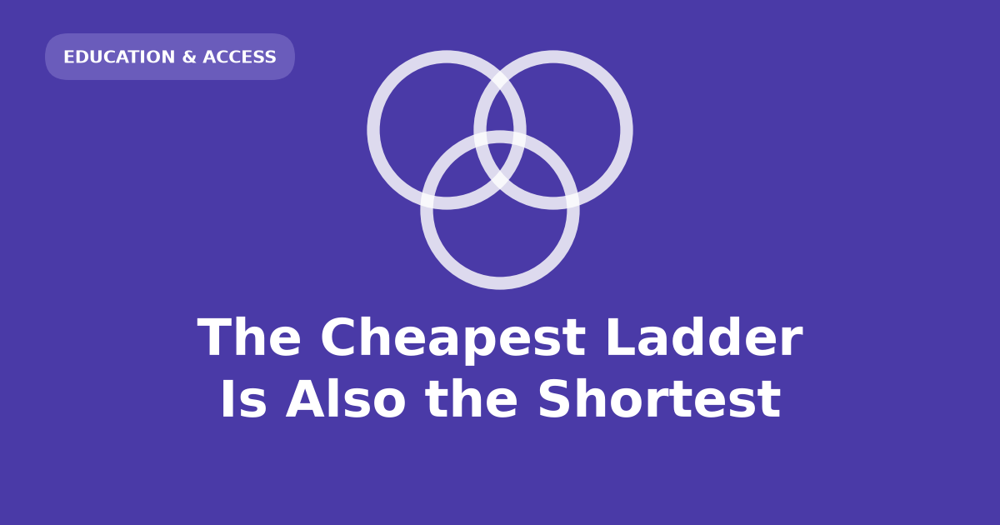

Think about what each school subject quietly billed your parents. Chemistry
needed a lab. Music needed an instrument, and someone to drive you to the
lesson. Essays rewarded a childhood of being read to — years of it, paid for
long before you sat down to write one. Set against that, mathematics asks for a
pencil, paper, and maybe one book.

Mathematics has always been the cheap subject. It is also self-verifying: you
can know you are right without an adult's approval, which matters enormously if
there is no adult at home who can judge your work. Maths is the one arena where
a kid with no cultural inheritance isn't already behind on arrival.

## Talent from poor households gets funnelled into maths

No entry cost and no gatekeeper on correctness do what you would expect. I grew
up poor in London and have since spent time in Mexico City, Guadalajara,
Guatemala City and Bogotá, and the pattern repeats in all of them. I have no
numbers for this. It is what I have watched happen, in five cities, to people I
knew.

What I don't think gets said is that the ladder is shorter than it looks.

## Cheap to enter, expensive to exhaust

The entry price is a pencil. The exit price is a decade of low income after
school, plus the network to convert credentials into money. Poor kids are
recruited on the first price and discover the second at twenty-two.

The outcomes are respectable and stable — teaching, statistics, actuarial work
— and well below what the same ability would have earned elsewhere with a family
behind it. Nobody lied about any of this. The subject keeps its promise. The
second price was simply never quoted, and the people best placed to quote it are
the ones who never had to pay it.

## The new threshold sits below the old one

That was already worth saying when the premise held. The premise is now
breaking. Computational mathematics is not pencil-and-paper, and its real
prerequisite isn't the maths — it's years of unsupervised, low-stakes time at a
keyboard: knowing things can be broken and fixed, having built something
pointless at thirteen. You cannot be taught that in a term. It accumulates, and
it accumulates at home.

A browser console is the cheapest rung that exists — free, already installed,
and it will let you break things without consequence. A smartphone is not a
substitute. It is a good machine for consuming and a poor one for tinkering, and
a household with one shared phone and no laptop is a household where that decade
doesn't happen.

So the subject that used to ask for nothing now asks for something, and it asks
early, before anyone is looking. The old ladder was shorter than it appeared.
The new one has lost its bottom rung, and the sorting happens years before
anybody starts measuring.
