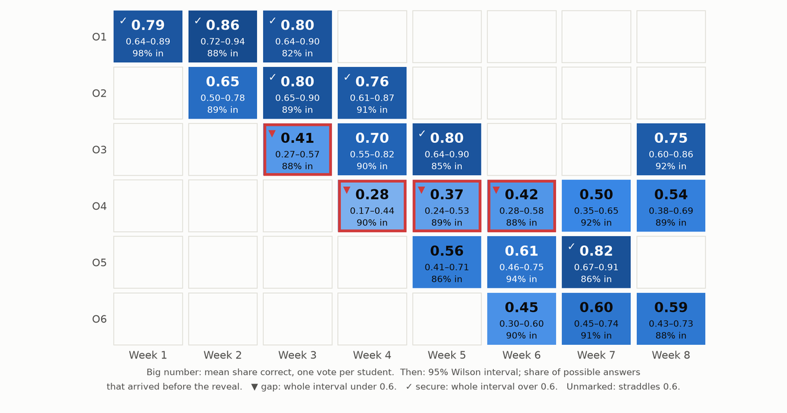

The answers from a live quiz can tell a professor which parts of the syllabus the class has and which it lacks, provided the report claims no more than the answers support: every objective gets an interval rather than a score, every cell says how many answers never arrived, and every weak objective points back to the passages behind the missed questions.

Think about what a quiz game shows at the end of a session. The leaderboard is on the projector, it is the most exciting screen of the hour, and it answers a question no professor needs answered: who won. The professor's question after class is a different one. What did they not get, and what do I do on Thursday?

The usual per-question report doesn't answer it either. It gives *question 7: 55% correct*, and it leaves two jobs to the professor: working out which part of the syllabus question 7 tested, and deciding whether 55% from 34 phones is a finding or noise. [Part 1](../classroom-quiz-generation-pipeline/) and [Part 2](../classroom-quiz-live-game/) already recorded what both jobs need, so the report can do them automatically. This part does them.

## Every answer already knows which objective it tests

Nothing needs tagging after class. A stored answer points at its question (Part 2's `responses` table). The question points at its learning objective and at the passage it was written from, and each wrong option carries a misconception tag from the objective's closed list (Part 1's `questions` table). So an answer is already evidence about one objective, and a wrong answer is evidence about one named misconception.

Objective ids don't depend on language, which matters for courses that run in more than one. The course language (`es`, `pt-BR` or `en`) sets the language Part 1's generator writes in, while the instructions to the model stay in English. When the reading is in English and the class runs in Spanish or Portuguese, the question is written in the class's language but the evidence quote stays in the reading's, because Part 1 asks for the quote in the passage's own words. That keeps the substring check working across languages. Two sections of one course taught in two languages report onto the same objective rows.

## A class of forty can't give a precise score

Suppose 24 of 40 students answer an objective's questions correctly. It is tempting to paint that cell 60% and move on, but 40 students are a small sample of what this class knows. Another day, with other questions on the same objective, 21 or 27 of them might have got it right. What we want is the range of mastery levels that could plausibly have produced 24 of 40.

That range is a confidence interval for a proportion. The textbook version, the estimate plus or minus two standard errors, misbehaves in small samples and near 0 or 1, and can even run below 0. The Wilson score interval (Wilson, 1927) fixes both problems, and Agresti and Coull (1998) compare it with the alternatives. It is what the heatmap uses. For 24 of 40 it runs from 0.45 to 0.74, so the cell doesn't tell us whether this class is above or below a 0.6 bar. Each verdict reads the whole interval, not the midpoint:

```python
def wilson(successes: float, n: int, z: float = Z) -> tuple[float, float] | None:
    """Wilson score interval; stays inside [0, 1] and behaves at small n."""
    if n == 0:
        return None
    p = successes / n
    centre = (p + z * z / (2 * n)) / (1 + z * z / n)
    half = z * math.sqrt(p * (1 - p) / n + z * z / (4 * n * n)) / (1 + z * z / n)
    return max(0.0, centre - half), min(1.0, centre + half)
```

```python
    @property
    def verdict(self) -> str:
        """Judge against the bar only as far as the interval allows."""
        if self.high is None:
            return "no data"
        if self.high < MASTERY:
            return "gap"  # weak even on the most generous reading
        if self.low >= MASTERY:
            return "secure"
        return "unclear"
```

A cell is a **gap** only if even the top of its interval is under the bar, and **secure** only if even the bottom clears it. A cell whose interval straddles the bar is **unclear**, and the heatmap says so. The bar (0.6 here) is the professor's choice for the course, not something the data provides.

Three details keep the interval from claiming more than it knows:

- **One vote per student.** Two answers from the same student on the same objective aren't independent, since a student who misunderstands the idea is likely to miss both. So each student's share correct counts once, and `n` is the number of students, not answers. Putting a fractional count into a formula built for yes/no outcomes is an approximation. It errs on the side of wider intervals.
- **An empty cell is not a zero.** A cell nobody answered gets `no data`, not 0%.
- **Questions differ in difficulty.** A cell usually rests on two questions, and two hard ones can make a class look weak for a week. The heatmap shows one case.

The same numbers come out of Postgres, so a Supabase dashboard can read them directly. The view in `heatmap.sql` was checked against the Python on 63 cells from three synthetic seeds and agreed to within floating-point rounding (largest difference about 10⁻¹⁶).

::: {.callout-note collapse="true" title="heatmap.sql"}
```sql
-- One row per (session, objective): the heatmap cell and its denominators.
-- Reads Part 1's questions and Part 2's session tables; same numbers as
-- objective_cells() in diagnostics.py.

create view objective_cells as
with answered as (
  select r.session_id, r.player_id, r.timing, q.objective_id,
         (q.options -> r.choice ->> 'correct')::boolean as correct
  from responses r
  join questions q on q.id = r.question_id
),
per_student as (  -- each student counts once per cell, however many items
  select session_id, objective_id, player_id, avg(correct::int) as share
  from answered
  where timing <> 'late_after_reveal'  -- the key was already on the screen
  group by 1, 2, 3
),
scored as (
  select session_id, objective_id, count(*) as students, avg(share) as mastery
  from per_student
  group by 1, 2
),
expected as (  -- answers we could have had: who was there when each question
               -- opened, plus anyone who joined late and answered it anyway
  select seats.session_id, q.objective_id, count(*) as possible
  from (
    select sq.session_id, sq.question_id, sp.player_id
    from session_questions sq
    join session_players sp
      on sp.session_id = sq.session_id and sp.joined_at <= sq.opened_at
    union
    select session_id, question_id, player_id from responses
  ) seats
  join questions q on q.id = seats.question_id
  group by 1, 2
),
counts as (
  select session_id, objective_id,
         count(*) filter (where timing <> 'late_after_reveal') as usable,
         count(*) filter (where timing = 'late_after_reveal') as late_after_reveal
  from answered
  group by 1, 2
)
select e.session_id, e.objective_id,
       coalesce(s.students, 0) as students,
       s.mastery,
       w.low, w.high,
       coalesce(c.usable, 0)::float / e.possible as answer_rate,
       coalesce(c.late_after_reveal, 0) as late_after_reveal
from expected e
left join scored s using (session_id, objective_id)
left join counts c using (session_id, objective_id)
left join lateral (  -- Wilson interval, z = 1.96; nulls when nobody answered
  select greatest(0, (p + z*z/(2*n) - z*sqrt(p*(1-p)/n + z*z/(4*n*n))) / (1 + z*z/n)) as low,
         least(1, (p + z*z/(2*n) + z*sqrt(p*(1-p)/n + z*z/(4*n*n))) / (1 + z*z/n)) as high
  from (select s.mastery::float as p, nullif(s.students, 0)::float as n, 1.96 as z) v
) w on true;
```
:::

### The synthetic class behind the heatmap

There are no real students here. The heatmap comes from a synthetic semester generated by `synthetic.py`, a stand-in for one course section of 40 students. It is built so that the effects this part discusses are present and their size is known:

- Six objectives, `O1` to `O6`, over eight weekly sessions. A session covers up to three objectives with two questions each, on a fixed schedule.
- A student's mastery of an objective is drawn from a Beta distribution for that objective. `O4` is built to be hard, with a mean of 0.4. Mastery rises by 0.05 a week once an objective has been introduced, and each question gets a small random difficulty offset.
- A wrong answer picks a distractor by weights set for its objective. On `O4`, one misconception takes 70% of the weight.
- Ten of the 40 students are on weak connections. A weak connection delivers an answer on time with probability 0.55, after time is up but before the reveal 0.15, after the reveal 0.05, and never 0.25. A good connection loses 3% of answers and delivers the rest on time.
- The weak-connection students' mastery is set 0.10 lower. That link between connectivity and mastery is an assumption made to test the next section's worry, not a finding about any real class.

{.paper-card fig-alt="A grid of six learning objectives by eight weeks. Covered cells are shaded blue by share correct, darker for higher. Four cells have red outlines marking gaps: O3 in week 3 and O4 in weeks 4, 5 and 6. Several cells in O1, O2, O3 and O5 carry check marks for secure. Most other cells are unmarked, meaning their intervals straddle 0.6."}

Two cells in that figure show why the interval matters more than the colour. `O4` is flagged as a gap three weeks running. That is the hard objective built into the data, and the verdict survives the interval's width. `O3` is flagged in week 3 at 0.41 and reads 0.70 a week later. Both of its week-3 questions were drawn harder than average, so that red cell is item difficulty, not a collapse in understanding. Over 20 seeds, between 48% and 86% of cells come out **unclear**, and the average interval is 0.27 to 0.28 wide. A class of forty and two questions per cell can't resolve most objectives against a 0.6 bar, and a heatmap that paints them all a confident colour would be making things up.

## Lost answers cost individual students more than the class average

The platform is designed for Latin American university classrooms, and it assumes a room of phones rather than laptops, many on prepaid mobile data or crowded campus Wi-Fi. That assumption, not a measured statistic, is behind two of Part 2's choices. A game-state message stays under 1 KB (579 bytes for a question, 786 at the reveal, for the sample question), and phones never download sound or images. The same assumption is behind the replay queue, which rescues answers that were only delayed. An answer that arrives after time is up but before the reveal still counts as evidence, labelled `late_before_reveal`.

Some answers never arrive, and the students they belong to aren't a random sample of the class. If the students on the weakest connections also know the material less well, which is the assumption built into the synthetic class, then dropping their answers makes the class look better than it is. We can measure how much, because in the synthetic data we know what every lost answer would have been. Comparing each cell as observed with the same cell had every answer arrived, over 20 seeds:

- The average cell moved by between −0.005 and +0.014.
- The biggest move in any one cell, on any seed, was 0.08.
- The answer rate averaged 89% to 91%.

Those shifts are small next to intervals 0.27 wide, and the arithmetic says why. About one answer in ten went missing, and the students most likely to lose theirs are 0.10 weaker in this model, so the expected shift is on the order of a tenth of 0.10. Counting students rather than answers helps as well, because a student stays in a cell as long as one of their answers gets through.

The damage lands on individuals instead. Students on weak connections had usable answers for 66% to 74% of the questions, against 96% to 98% for everyone else. The class-level picture survives. The picture of *these particular students*, the ones a professor most needs to see, is the thinnest. So the report puts the answer rate beside every cell, and `student_coverage` lists each student's share of usable answers, lowest first. The design sends a student with low coverage the same questions later through a channel that doesn't need a live connection, such as a take-home form, rather than guessing from half their answers.

## Wrong answers point back to the reading

A gap says *what* the class doesn't have. The distractor tags say *how* it is wrong. `misconceptions` counts the tags on wrong usable answers for one objective. In the synthetic class, `O4`'s most common tag accounts for 64% to 77% of its wrong answers across seeds, which only confirms that the counting recovers the 70% built into the data. In a real course, a dominant tag is something a professor can teach against, such as students treating the standard error as the standard deviation. A spread of tags points to a vaguer problem.

`remediation` ranks the source passages behind the missed questions, most missed first. These are Part 1's chunk addresses, so the output is a reading list to hand back to the class: *re-read page 4 of the stats notes*, not *study harder*.

The loop closes when the next quiz is generated. `next_quiz` shares a question budget over objectives and doubles the weight of a confident gap:

```python
def next_quiz(cells: list[Cell], sessions: list[str], total: int) -> dict[str, int]:
    """Share `total` questions over objectives, doubling the weight of gaps.

    Uses each objective's cell from the latest of `sessions` (oldest first)
    that covered it. Only a confident gap (the upper bound under the bar)
    earns extra questions; an unclear cell does not.
    """
    when = {s: i for i, s in enumerate(sessions)}
    latest = {}
    for c in sorted(cells, key=lambda c: when[c.session_id]):
        latest[c.objective_id] = c
    weights = {o: 2 if c.verdict == "gap" else 1 for o, c in latest.items()}
    scale = total / sum(weights.values())
    shares = {o: w * scale for o, w in weights.items()}
    plan = {o: math.floor(s) for o, s in shares.items()}
    by_remainder = sorted(shares, key=lambda o: shares[o] - plan[o], reverse=True)
    for o in by_remainder[: total - sum(plan.values())]:
        plan[o] += 1
    return plan
```

The trigger is the interval's upper bound, not the midpoint, so an objective that merely looked weak on two hard questions doesn't take over the next quiz. The shares feed straight back into Part 1: more (passage, objective) jobs for the gap objectives, at the same Bloom levels.

Two cautions come with closing the loop:

- **Regression to the mean.** An objective chosen because it scored low will tend to score higher next time even if nothing changed, because part of the low score was bad luck. Improvement after extra practice isn't proof that the practice worked.
- **The figure doesn't validate the loop.** In the synthetic data, `O4` rises in weeks 7 and 8 because the generating process adds 0.05 a week and the schedule is fixed. The figure shows what the professor would see. It says nothing about whether reweighting helps. That would take real classes and a comparison group.

## Running the companion code

The files are [diagnostics.py](./diagnostics.py), [heatmap.sql](./heatmap.sql), [synthetic.py](./synthetic.py), [make_figures.py](./make_figures.py) and [requirements.txt](./requirements.txt). `make_figures.py` draws the heatmap and prints every synthetic number quoted here as a range over 20 seeds. A test re-runs that computation and fails if any number drifts outside the range the text states. The other tests cover the Wilson interval, one vote per student, the exclusion of answers that arrived after the reveal, the misconception and remediation rankings, and the question budget.

The three parts share one rule: claim no more than the evidence supports. A question has to quote its source, the game counts each answer once, and the report shows an interval rather than a bare score.

Leaderboards. Entertain. Intervals. Inform. Missing. Answers. Hide. Students. Passages. Guide. Remediation.

## References

- Wilson, E. B. (1927). Probable inference, the law of succession, and statistical inference. *Journal of the American Statistical Association*, 22(158), 209–212.
- Agresti, A., and Coull, B. A. (1998). Approximate is better than "exact" for interval estimation of binomial proportions. *The American Statistician*, 52(2), 119–126.
