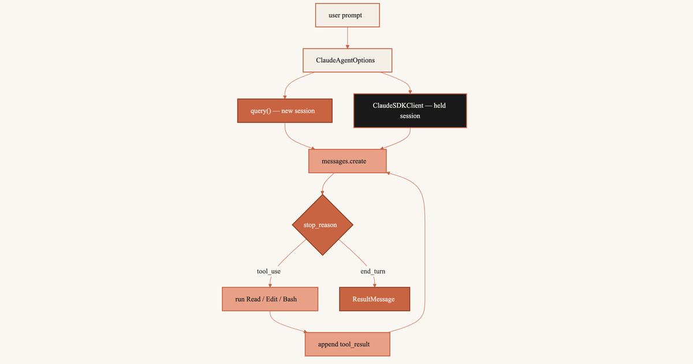

`messages.create()` returns one model turn. An agent that reads a file, edits it, and runs a test needs many turns. You append the `tool_use`, run the function, append the `tool_result`, and call again.

The Agent SDK wraps Claude Code so you skip that loop. Use `query()` for one shot. Use `ClaudeSDKClient` to keep talking.

`query()` starts a child process, works, and exits. `ClaudeSDKClient` starts the process once and leaves it up. A later prompt can say "the first one".

```{mermaid}
%%{init: {"theme": "base", "themeVariables": {"fontFamily": "ui-sans-serif, system-ui, sans-serif", "lineColor": "#C96442", "edgeLabelBackground": "#FAF7F2", "clusterBkg": "#F4F0E8", "clusterBorder": "#C96442"}}}%%
flowchart TB
  Prompt["user prompt"] --> Options["ClaudeAgentOptions"]
  Options --> Query["query() — new session"]
  Options --> Client["ClaudeSDKClient — held session"]
  Query --> Create["messages.create"]
  Client --> Create
  Create --> Stop{"stop_reason"}
  Stop -->|"tool_use"| Tools["run Read / Edit / Bash"]
  Tools --> Append["append tool_result"]
  Append --> Create
  Stop -->|"end_turn"| Result["ResultMessage"]

  classDef cream fill:#F4F0E8,stroke:#C96442,stroke-width:2px,color:#191919
  classDef terracotta fill:#C96442,stroke:#8F3F24,stroke-width:2px,color:#FAF7F2
  classDef dark fill:#191919,stroke:#C96442,stroke-width:2px,color:#FAF7F2
  classDef peach fill:#E8A087,stroke:#C96442,stroke-width:2px,color:#191919

  class Prompt,Options cream
  class Query terracotta
  class Client dark
  class Create,Tools,Append peach
  class Stop,Result terracotta
```

`query()` shuts the child process down after one turn. The client keeps it. The diamond is `stop_reason`. Loop while the model wants a tool. Stop when it is done.

## Agent SDK

Claude Code already does this in a terminal. You type a prompt. Claude reads a file or runs a command. It looks at the output. It decides whether to continue. The Agent SDK starts that process from Python. The package is `claude-agent-sdk`.

The child process:

- starts and stops Claude Code
- offers `Read`, `Edit`, `Write`, `Bash`, `Glob`, `Grep`
- checks permissions (`permission_mode`, `allowed_tools`)
- calls the model again after each tool result

`messages.create()` is one HTTP request. You send the history. You get one turn back. Claude does not open a shell. It does not edit files. It does not call itself again. A `tool_use` block means you run the function and send the next request. That package is [the Anthropic Python SDK](../claude-api-python-sdk/). Write the loop there. Let Claude Code write it here.

## query vs ClaudeSDKClient

Two ways in. Both take `ClaudeAgentOptions`: system prompt, tools, permissions. Both are `asyncio`. Wrap them in `async def main()` and start with `asyncio.run(main())`. That `asyncio.run` starts the event loop. It is not a client method.

- **`query()`** — one prompt, no follow-up. Opens a session, works, closes. No `interrupt()`. To continue later, pass `continue_conversation=True` or a `resume` id.
- **`ClaudeSDKClient`** — the next prompt depends on the last answer. The `async with` block holds the connection. A second `client.query()` keeps the session. No `resume`. `interrupt()` works.

Open the client with `async with ClaudeSDKClient(options) as client`. Python connects on enter and disconnects on leave. After `client.query()`, read `receive_response()` until the turn ends. Then send the next prompt.

### run

Other libraries ship `client.run(prompt)`. One call sends and waits. `ClaudeSDKClient` has no `.run()`. It splits the turn so you can interrupt.

- **`await client.query(prompt)`** — write the user turn. Returns when the write lands. Tools may still be running.
- **`async for message in client.receive_response()`** — read until `ResultMessage`.

```{mermaid}
%%{init: {"theme": "base", "themeVariables": {"fontFamily": "ui-sans-serif, system-ui, sans-serif", "lineColor": "#C96442", "edgeLabelBackground": "#FAF7F2", "clusterBkg": "#F4F0E8", "clusterBorder": "#C96442"}}}%%
flowchart TB
  subgraph missing ["Guessed one-shot"]
    Run["client.run(prompt)"]
  end
  subgraph present ["Actual turn"]
    Q["query(prompt) — write"]
    Gap["interrupt() window"]
    Recv["receive_response() — wait"]
    Done["ResultMessage"]
    Q --> Gap --> Recv --> Done
  end
  Run -.-> Q

  classDef cream fill:#F4F0E8,stroke:#C96442,stroke-width:2px,color:#191919
  classDef terracotta fill:#C96442,stroke:#8F3F24,stroke-width:2px,color:#FAF7F2
  classDef dark fill:#191919,stroke:#C96442,stroke-width:2px,color:#FAF7F2
  classDef peach fill:#E8A087,stroke:#C96442,stroke-width:2px,color:#191919

  class Run peach
  class Q terracotta
  class Gap dark
  class Recv peach
  class Done terracotta
```

The dashed edge is `run()`. It is missing. Send, optionally cancel, then wait.

## One-shot query

Use `query()` for one prompt. `ClaudeAgentOptions` sets the system prompt, the tools, and whether edits apply without asking.

```{python}
#| eval: false
import asyncio

from claude_agent_sdk import (
    AssistantMessage,
    ClaudeAgentOptions,
    ResultMessage,
    TextBlock,
    query,
)


async def main():
    options = ClaudeAgentOptions(
        system_prompt="You are a Python reviewer. Edit only what the prompt names.",
        allowed_tools=["Read", "Edit", "Glob"],
        permission_mode="acceptEdits",
    )
    async for message in query(
        prompt="Add a one-line module docstring to src/auth.py",
        options=options,
    ):
        if isinstance(message, AssistantMessage):
            for block in message.content:
                if isinstance(block, TextBlock):
                    print(block.text)
        elif isinstance(message, ResultMessage):
            print(message.subtype, message.total_cost_usd)


asyncio.run(main())
```

Hand-written. No `ANTHROPIC_API_KEY`; the cell does not run.

```
AssistantMessage(
    content=[
        TextBlock(
            type='text',
            text='Added a module docstring to src/auth.py.',
        ),
    ],
)
ResultMessage(
    subtype='success',
    total_cost_usd=0.0421,
)
```

`query()` starts Claude Code. It can `Read` and `Edit` `src/auth.py`. Text streams out. `ResultMessage` ends the loop. You never check `stop_reason`. The child process already did.

## Persistent client

List the files under `src/`. Then ask Claude to open the first one. The second prompt names no path. Claude needs the first answer to pick `src/auth.py`.

`ClaudeSDKClient` keeps the session. Stay in the `async with` block. Each `client.query()` continues the conversation. Send with `query()`. Wait with `receive_response()`.

```{python}
#| eval: false
import asyncio

from claude_agent_sdk import (
    AssistantMessage,
    ClaudeAgentOptions,
    ClaudeSDKClient,
    TextBlock,
)


async def main():
    options = ClaudeAgentOptions(
        allowed_tools=["Read", "Glob"],
        permission_mode="acceptEdits",
    )
    async with ClaudeSDKClient(options=options) as client:
        await client.query("List the Python files under src/")
        async for message in client.receive_response():
            if isinstance(message, AssistantMessage):
                for block in message.content:
                    if isinstance(block, TextBlock):
                        print(block.text)

        await client.query("Open the first one and quote its module docstring.")
        async for message in client.receive_response():
            if isinstance(message, AssistantMessage):
                for block in message.content:
                    if isinstance(block, TextBlock):
                        print(block.text)


asyncio.run(main())
```

Hand-written. The second answer names `src/auth.py`. The prompt did not.

First turn:

```
Claude: src/auth.py
src/app.py
```

Second turn:

```
Claude: src/auth.py starts with: """Session tokens and password checks."""
```

Two standalone `query()` calls start two sessions. The second has no file list. Pass `resume` or `continue_conversation=True`, or name `src/auth.py`.

## Messages API loop

`query()` and the client still call `messages.create()`. You or Claude Code must keep the `messages` list and run the tools.

Write the loop and you do eight steps each time the model wants a tool:

1. Call `client.messages.create(...)` with `tools` and the current `messages` list.
2. Read `response.stop_reason`.
3. If it is `"tool_use"`, collect every `tool_use` block.
4. Run each named function on `block.input`.
5. Append the assistant turn (`response.content`) to `messages`.
6. Append a user turn whose content is the matching `tool_result` blocks.
7. Call `messages.create()` again with that longer list.
8. Repeat from step 2 until `stop_reason` is not `"tool_use"`.

```{python}
#| eval: false
import asyncio

import anthropic

POLICIES = {
    "standard": "Refunds within 30 days of purchase, unused items only.",
    "plus": "Refunds within 60 days; opened software is excluded.",
}


def lookup_policy(plan: str) -> str:
    return POLICIES.get(plan, "No policy found for that plan.")


async def main():
    client = anthropic.AsyncAnthropic()
    tools = [
        {
            "name": "lookup_policy",
            "description": "Return the refund policy text for a subscription plan.",
            "input_schema": {
                "type": "object",
                "properties": {"plan": {"type": "string"}},
                "required": ["plan"],
            },
        }
    ]
    messages = [{"role": "user", "content": "What is the refund window on Plus?"}]

    response = await client.messages.create(
        model="claude-sonnet-5",
        max_tokens=1024,
        tools=tools,
        messages=messages,
    )

    while response.stop_reason == "tool_use":
        messages.append({"role": "assistant", "content": response.content})
        results = []
        for block in response.content:
            if block.type == "tool_use":
                results.append(
                    {
                        "type": "tool_result",
                        "tool_use_id": block.id,
                        "content": lookup_policy(block.input["plan"]),
                    }
                )
        messages.append({"role": "user", "content": results})
        response = await client.messages.create(
            model="claude-sonnet-5",
            max_tokens=1024,
            tools=tools,
            messages=messages,
        )


asyncio.run(main())
```

The refund rows are made up. They show block shape, not a real policy store.

`query()` and `ClaudeSDKClient` run those eight steps inside Claude Code. Set `allowed_tools`. Read `AssistantMessage` and `ResultMessage`. [The Anthropic Python SDK post](../claude-api-python-sdk/) lists the six `stop_reason` values. [The orchestrator-worker loop](../claude-architect-prep-week-1/) writes the branch.

Query. Starts. Fresh. Client. Holds. Context. Loop. Stays. Hidden.

## References

- [Agent SDK reference — Python](https://code.claude.com/docs/en/agent-sdk/python)
- [Agent SDK: Sessions](https://code.claude.com/docs/en/agent-sdk/sessions)
- [Anthropic: Tool use](https://platform.claude.com/docs/en/agents-and-tools/tool-use/overview)
- [Claude API with the Anthropic Python SDK](../claude-api-python-sdk/) — this blog; `messages.create()` and the six `stop_reason` values.
- [Claude Certified Architect, Week 1: The Orchestrator-Worker Loop](../claude-architect-prep-week-1/) — this blog; the loop that branches on every `stop_reason`.
