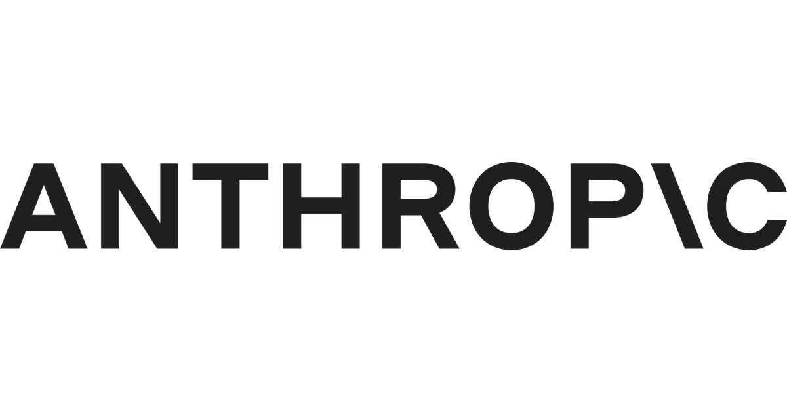

The official `anthropic` Python SDK talks to Claude through one method, `client.messages.create()`. Roles, content blocks, tools, and retrieved documents are fields on that call — not separate endpoints.

## Messages

`Anthropic()` reads `ANTHROPIC_API_KEY` from the environment. Every request is stateless: resend the full `messages` list each turn.

`messages` accepts two roles on this model:

- **`user`** — the human turn, or a `tool_result` you are sending back.
- **`assistant`** — a prior model turn you are replaying.

System instructions are a top-level `system` parameter, not a role in that list — a string, or a list of text blocks. `max_tokens` is required. This post uses `claude-sonnet-5`, the current Sonnet API id.

The Opus-tier models take a third role. On `claude-opus-5`, `claude-opus-4-8`, `claude-fable-5` and `claude-mythos-5` you can append `{"role": "system", "content": ...}` inside `messages` to give the model a new operator instruction part-way through a conversation. Rewriting the top-level `system` would say the same thing and throw the cached prefix away with it; a message appended at the end does not. It cannot be the first entry, and it has to be either the last one or followed by an assistant turn. `claude-sonnet-5` rejects the role.

```{python}
#| eval: false
import anthropic

client = anthropic.Anthropic()

response = client.messages.create(
    model="claude-sonnet-5",
    max_tokens=1024,
    system="Answer in one sentence.",
    messages=[{"role": "user", "content": "What is a content block?"}],
)
```

A string `content` is shorthand for one `text` block. The response `content` is always a list; do not assume `response.content[0].text`. Streaming, timeouts, and `input_json_delta` are covered in [Waiting, and Not Waiting](../messages-api-streaming/). Schema-constrained JSON is covered in [Stop Parsing Prose](../structured-json-with-claude/).

## Content blocks

Each block has a `type`. Inspect `block.type` before reading any other field. `claude-sonnet-5` may emit a `thinking` block before text; a tool call adds another.

Documented input and output types used in this post:

- **`text`** — ordinary prose. String `content` expands to this.
- **`image`** — a `source` object (`base64`, `url`, or `file` / `file_id`).
- **`document`** — plain text, PDF, or custom content; optional `citations`.
- **`search_result`** — a retrieved hit you already have, also citation-capable.
- **`tool_use`** — model output: `id`, `name`, `input`.
- **`tool_result`** — your follow-up: `tool_use_id` plus `content`.
- **`thinking`** / **`redacted_thinking`** — reasoning blocks. Pass them back unchanged on the next turn if the API returned them.

```{python}
#| eval: false
for block in response.content:
    if block.type == "text":
        print(block.text)
    elif block.type == "tool_use":
        print(block.name, block.input)
```

Unknown types should be ignored or forwarded, not parsed as text.

## Tools

A **client tool** is a function you run. Pass `name`, `description`, and a JSON Schema `input_schema`. The model returns `stop_reason="tool_use"` and one or more `tool_use` blocks. You execute the function, then send a `user` message whose `content` is a `tool_result` whose `tool_use_id` matches.

A **server tool** (`web_search`, `web_fetch`, `code_execution`, and similar) runs on Anthropic's infrastructure. You declare it by `type` and `name`; you do not execute it or invent a `tool_result` for it.

The loop for a client tool is always: request → `tool_use` → your code → `tool_result` → request again, with both the assistant turn and the result appended.

### Stop reasons

`stop_reason` says why the model stopped. It has six values, not two:

- **`end_turn`** — finished on its own. Read the text.
- **`stop_sequence`** — hit a stop sequence you configured. Also finished.
- **`tool_use`** — wants tools run. The loop above.
- **`max_tokens`** — cut off part-way. Retry with a bigger cap; do not read it as an answer.
- **`pause_turn`** — a server tool hit its own iteration limit. Send the history back unchanged to resume.
- **`refusal`** — declined on safety grounds. Only here is `stop_details` filled in; it is `null` for the other five.

A loop written as `while response.stop_reason == "tool_use"` leaves four of those as though the model had finished, and hands the caller a partial answer with no error. [The Orchestrator-Worker Loop](../claude-architect-prep-week-1/) branches on all six and sets the budgets that stop a run going forever.

### Tool runner

The SDK will run that loop for you. Decorate a function with `@beta_tool`, pass it to `client.beta.messages.tool_runner(...)`, and call `runner.until_done()`. It dispatches the calls, appends the results, and returns the final message. The helper lives on `client.beta.messages`, so it needs the beta namespace.

Write the loop by hand once, to see what the runner is doing. Use the runner in production.

## A tool-use round trip

The dict below is synthetic. Three invented refund rows stand in for an internal policy store a support bot would query. A real policy table would be confidential, and it would be out of date by the time you read this. Neither matters here: what the example shows is the shape of the blocks going in and out, not the rows. No live system is called; this post has no API key, so the cell is not executed.

```{python}
#| eval: false
import anthropic

POLICIES = {
    "standard": "Refunds within 30 days of purchase, unused items only.",
    "plus": "Refunds within 60 days; opened software is excluded.",
    "enterprise": "Refunds require a ticket and manager approval within 90 days.",
}


def lookup_policy(plan: str) -> str:
    return POLICIES.get(plan, "No policy found for that plan.")


client = anthropic.Anthropic()  # reads ANTHROPIC_API_KEY

tools = [
    {
        "name": "lookup_policy",
        "description": "Return the refund policy text for a subscription plan.",
        "input_schema": {
            "type": "object",
            "properties": {
                "plan": {
                    "type": "string",
                    "enum": ["standard", "plus", "enterprise"],
                    "description": "The customer's subscription plan.",
                }
            },
            "required": ["plan"],
        },
    }
]

messages = [
    {"role": "user", "content": "What is the refund window on the Plus plan?"},
]

response = client.messages.create(
    model="claude-sonnet-5",
    max_tokens=1024,
    system="Answer only from lookup_policy. If the tool returns nothing, say so.",
    tools=tools,
    messages=messages,
)

if response.stop_reason == "tool_use":
    messages.append({"role": "assistant", "content": response.content})
    results = []
    for block in response.content:
        if block.type == "tool_use":
            results.append(
                {
                    "type": "tool_result",
                    "tool_use_id": block.id,
                    "content": lookup_policy(block.input["plan"]),
                }
            )
    messages.append({"role": "user", "content": results})
    response = client.messages.create(
        model="claude-sonnet-5",
        max_tokens=1024,
        system="Answer only from lookup_policy. If the tool returns nothing, say so.",
        tools=tools,
        messages=messages,
    )

print(response)
text = next(b.text for b in response.content if b.type == "text")
print(text)
```

The objects below are hand-written to show the two `Message` shapes that loop produces. They are not a captured transcript.

First return, `stop_reason="tool_use"`:

```
Message(
    id='msg_01SimulatedFirstTurn000000001',
    type='message',
    role='assistant',
    model='claude-sonnet-5',
    content=[
        ToolUseBlock(
            id='toolu_01SimulatedLookup00000001',
            name='lookup_policy',
            input={'plan': 'plus'},
            type='tool_use',
        )
    ],
    stop_reason='tool_use',
    usage=Usage(input_tokens=412, output_tokens=56),
)
```

Second return, after `tool_result`:

```
Message(
    id='msg_01SimulatedSecondTurn00000001',
    type='message',
    role='assistant',
    model='claude-sonnet-5',
    content=[
        TextBlock(
            type='text',
            text='The Plus plan allows refunds within 60 days; opened software is excluded.',
        )
    ],
    stop_reason='end_turn',
    usage=Usage(input_tokens=481, output_tokens=24),
)
```

Check `stop_reason` before reading text. `tool_use` means there is no final answer yet; `end_turn` is the text turn.

## RAG

The SDK has no vector store and no embeddings client. Retrieval is your job; Claude only sees what you put on the next request.

Three patterns the Messages API actually supports:

1. **Stuff the hits.** Put retrieved text in the user turn as `document` or `search_result` blocks, then ask the question as a `text` block.
2. **Citations.** Set `citations={"enabled": True}` on those documents (all or none in the request). The model can emit citation blocks pointing at spans. Citations cannot be combined with structured outputs (`output_config.format`).
3. **Retrieval as a tool.** Expose `search_kb` (or similar) as a client tool. Claude decides when to call it; you run the retriever and return a `tool_result`. Same loop as `lookup_policy` above.

A stable document prefix can carry `cache_control={"type": "ephemeral"}` so later turns reuse it at cache-read prices. Changing the prefix, the tool list, or the model id misses the cache.

### Embeddings and stores

[Anthropic does not offer an embedding model](https://platform.claude.com/docs/en/build-with-claude/embeddings). The docs name [Voyage AI](https://www.voyageai.com/) as the provider to start with (`voyageai` package, `VOYAGE_API_KEY`). Use `voyage-4` for a general index; `input_type="document"` on ingest and `input_type="query"` at search. Assess other vendors if the domain needs it.

The SDK still has no vector store. Typical indexes for the Voyage vectors:

- **pgvector** — default when you already run Postgres. Hosted as RDS, Cloud SQL, Azure Database for PostgreSQL, [Supabase](https://supabase.com/), or [Neon](https://neon.tech/).
- **Pinecone** — managed, serverless. Anthropic's [RAG cookbook](https://platform.claude.com/cookbook/capabilities-retrieval-augmented-generation-guide) uses it.
- **Qdrant** or **Weaviate** — self-host or their clouds when you want an OSS engine and hybrid (keyword + vector) search. [Weaviate vs Pinecone](../pinecone-vs-weaviate/) compares the two; [Building a Simple Vector Database](../vector-databases-and-rag/) shows the FAISS-shaped core.

### Hosting

Claude itself is not only `api.anthropic.com`. The same Python package exposes first-party plus cloud hosts:

- **`Anthropic()`** — first-party Messages API.
- **`AnthropicAWS`** — Claude Platform on AWS (`anthropic[aws]`).
- **`AnthropicBedrockMantle`** — Amazon Bedrock (`anthropic[bedrock]`). `AnthropicBedrock` still works, but it is the older `bedrock-runtime` InvokeModel path; new code wants the Mantle client.
- **`AnthropicVertex`** — Google Vertex AI (`anthropic[vertex]`).
- **`AnthropicFoundry`** — Microsoft Foundry.

Who runs the service decides what you get. Claude Platform on AWS is Anthropic-operated: AWS sign-in and billing, the first-party API surface, same-day feature parity, and plain model ids. Bedrock and Vertex are partner-operated, so each has its own prices, its own release lag, and a smaller feature set — and Bedrock prefixes the model id (`anthropic.claude-sonnet-5`). Foundry bills through the Microsoft Marketplace at first-party rates.

Voyage embeddings are a separate key: Voyage's API, or Voyage on AWS Marketplace. The vector store is a third bill — Pinecone, Qdrant Cloud, Weaviate Cloud, or pgvector on the Postgres you already pay for.

## Audio

The Messages API has no speech endpoint and no audio content block. The OpenAI-compatible surface ignores `audio` and `input_audio` fields.

Claude Code `/voice` dictation is a CLI product feature. It is not `client.messages.create()`.

Spoken I/O is a second vendor. Anthropic's cookbook builds a low-latency voice loop with [ElevenLabs](https://elevenlabs.io/) for STT and TTS around a streaming Claude turn. Keep Claude on text; send transcripts in and pipe tokens out to ElevenLabs. [Voice AI architectures (2026)](../voice-ai-architectures-2026/) compares ElevenLabs to the rest of that market.

## CLAUDE.md

`CLAUDE.md` is a Claude Code convention: a markdown file the coding agent reads at session start and holds as project context. Analogues are `AGENTS.md` and editor rule files. This repository's root `CLAUDE.md` is one — render commands, register, freeze rules.

`client.messages.create()` does not load it. Nothing in the Python SDK opens the working tree or injects a file by that name.

For an API app, put the same rules in `system` (optionally as cached text blocks). For a coding agent, keep them in `CLAUDE.md` and let the agent host load them. Do not expect a `claude_md=` parameter.

Messages. Stay. Stateless. Voyage. Embeds. Stores. Host. Voice. Needs. ElevenLabs.

## References

- [Anthropic: Messages API](https://platform.claude.com/docs/en/api/messages)
- [Anthropic: Tool use](https://platform.claude.com/docs/en/agents-and-tools/tool-use/overview)
- [Anthropic: Citations](https://platform.claude.com/docs/en/build-with-claude/citations)
- [Anthropic: Embeddings (Voyage)](https://platform.claude.com/docs/en/build-with-claude/embeddings)
- [Anthropic: Python SDK](https://platform.claude.com/docs/en/cli-sdks-libraries/sdks/python)
- [Anthropic cookbook: RAG](https://platform.claude.com/cookbook/capabilities-retrieval-augmented-generation-guide)
- [Anthropic cookbook: ElevenLabs voice](https://platform.claude.com/cookbook/third-party-elevenlabs-low-latency-stt-claude-tts)
- [Claude Code: Memory / CLAUDE.md](https://code.claude.com/docs/en/memory)
- [Claude Certified Architect, Week 1: The Orchestrator-Worker Loop](../claude-architect-prep-week-1/) — this blog; the loop that branches on every `stop_reason` this post lists.
