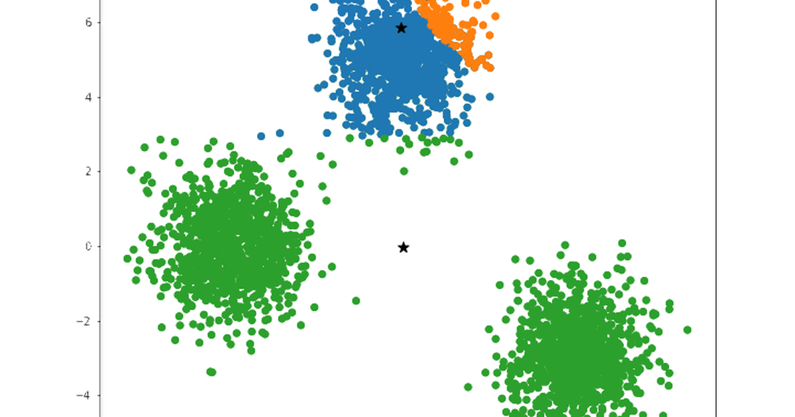

Tuning a classifier is a solved routine: hold out some data, try the settings, keep
the one that scores best on the held-out part. Clustering breaks the routine at the
last step, because there is no score. Nothing in the data says which points belong
together, so the number of clusters, the density threshold or the linkage rule has to
be chosen against a metric that is computed from the clustering itself. Those metrics
are useful and they are not the truth, and the gap between the two is what this post
is about: which knobs can be tuned on a split at all, what the label-free metrics
reward, and a small case where the most popular one picks the wrong answer.

## Only some clustering algorithms can be tuned on a split

A validation split works for a classifier because the model can be fitted on one part
and scored on another. Some clustering algorithms have that shape and some do not.
K-means and Gaussian mixtures produce a rule that assigns a *new* point to a cluster,
so they can be fitted on training data and their assignments scored on validation
data. Agglomerative clustering has no such rule in scikit-learn, but its clusters have
centroids, and assigning each held-out point to the nearest one is a rule of the same
kind, written by hand. DBSCAN and OPTICS do not: they label the points they were given
by local density, and a held-out point has no label until it is clustered along with
the rest. Spectral clustering needs the affinity matrix of the whole set, which a
split distorts.

| Algorithm | Knobs | Tune on a split? |
|---|---|---|
| K-means | `n_clusters`, `init` | yes: `predict` exists |
| Agglomerative | `n_clusters`, `linkage` | yes, by nearest training centroid, written by hand |
| Gaussian mixture | `n_components`, `covariance_type` | yes, and log-likelihood or BIC is a real score |
| DBSCAN, OPTICS | `eps`, `min_samples` | no: refit on subsets instead |
| Spectral | `n_clusters`, `affinity` | no: the affinity matrix is global |

For the first three the recipe is the classifier's, with one change: the score on the
validation set is a label-free metric rather than accuracy.

## The label-free metrics reward compactness and separation, not correctness

Three metrics come up, and they all measure geometry:

- The **silhouette** of a point compares its mean distance to its own cluster with its
  mean distance to the nearest other cluster; the score averages over points and runs
  from $-1$ to $1$. High means tight clusters far apart.
- **Davies–Bouldin** is a ratio of within-cluster scatter to between-cluster distance,
  averaged over the worst pairing; lower is better.
- **Inertia**, k-means's own objective, is the total squared distance to the centroids;
  it always falls as $k$ grows, so it is read for an elbow rather than a minimum.

With ground truth, the **adjusted Rand index** and **normalised mutual information**
compare a clustering to the true labels, and those are the honest scores. They are
also unavailable in exactly the situation clustering is for. The metrics above stand
in for them by assuming that the true clusters are compact and well separated, and
that assumption is where they fail.

## A case where the silhouette is confident and wrong

The data is synthetic so that the truth is known: 500 points in the plane from four
Gaussian blobs of equal size, generated by scikit-learn's `make_blobs`, standing in for
any dataset with a handful of real groups. Split 70/15/15, fit k-means on the training
part for $k$ from 2 to 6, and score the validation assignments both ways.

```{python}
#| label: tune-round
import numpy as np
from sklearn.cluster import KMeans
from sklearn.datasets import make_blobs
from sklearn.metrics import adjusted_rand_score, silhouette_score
from sklearn.model_selection import train_test_split

X, y = make_blobs(n_samples=500, centers=4, cluster_std=0.6, random_state=42)
X_train, X_tmp, y_train, y_tmp = train_test_split(X, y, test_size=0.3, random_state=42)
X_val, X_test, y_val, y_test = train_test_split(X_tmp, y_tmp, test_size=0.5, random_state=42)


def score_by_k(X_fit, X_score, y_score, ks=(2, 3, 4, 5, 6)):
    rows = []
    for k in ks:
        labels = KMeans(n_clusters=k, n_init=10, random_state=42).fit(X_fit).predict(X_score)
        rows.append((k, silhouette_score(X_score, labels), adjusted_rand_score(y_score, labels)))
    return rows


print("round blobs   k   silhouette   ARI")
for k, sil, ari in score_by_k(X_train, X_val, y_val):
    print(f"{'':13} {k}      {sil:.3f}    {ari:.3f}")
```

On round, well-separated blobs the silhouette and the ARI agree: both peak at
$k = 4$, the silhouette at 0.887 and the ARI at 1.000. This is the case the metric was
designed for, and a validation split with a silhouette score picks the right $k$.

Now shear the same points, so that each blob becomes an elongated ellipse leaning the
same way. The four groups are unchanged; only their shape is.

```{python}
#| label: tune-sheared
shear = np.array([[0.6, -0.6], [-0.4, 0.8]])
Xs = X @ shear
Xs_train, Xs_val = X_train @ shear, X_val @ shear

print("sheared blobs k   silhouette   ARI")
for k, sil, ari in score_by_k(Xs_train, Xs_val, y_val):
    print(f"{'':13} {k}      {sil:.3f}    {ari:.3f}")
```

The ARI still peaks at $k = 4$, because the groups are still there. The silhouette
now peaks at $k = 2$: two elongated blobs lying near each other look, to a metric
built from mean distances, like one wide cluster, and merging them raises the score.
A tuning loop that keeps the best silhouette returns two clusters, prints a
respectable score, and is wrong, with nothing in its output to say so.

```{python}
#| label: plot
#| fig-cap: "The same four groups, round (left) and sheared (right). The silhouette picks four clusters on the left and two on the right; the truth is four in both."
import matplotlib.pyplot as plt

fig, axes = plt.subplots(1, 2, figsize=(9, 4))
for ax, data, title in ((axes[0], X, "round"), (axes[1], Xs, "sheared")):
    ax.scatter(data[:, 0], data[:, 1], c=y, s=8, cmap="tab10")
    ax.set_title(title)
    ax.set_aspect("equal")
plt.tight_layout()
plt.show()
```

## What to do when the metric cannot be trusted

The failure is not a bug in the silhouette; it is the assumption of compact, round
clusters being false. Three responses follow from that.

**Match the model to the shape.** A Gaussian mixture with full covariance fits
elongated clusters that k-means cannot, and its likelihood gives a score that does not
assume roundness: the Bayesian information criterion, the fitted log-likelihood
penalised by the number of parameters, lower being better. On the sheared training
data it picks four components, and those four match the truth on the validation set.

```{python}
#| label: gmm
from sklearn.mixture import GaussianMixture

print("sheared blobs k   BIC (train)   ARI (val)")
for k in (2, 3, 4, 5, 6):
    gmm = GaussianMixture(n_components=k, covariance_type="full", random_state=42).fit(Xs_train)
    print(f"{'':13} {k}      {gmm.bic(Xs_train):7.0f}     {adjusted_rand_score(y_val, gmm.predict(Xs_val)):.3f}")
```

**Read the metric against the data, not alone.** A silhouette curve that peaks at
$k = 2$ on data with visible structure is a prompt to look, and a scatter plot is
cheap. Where the data are high-dimensional, plot the clusters in a two-dimensional
projection rather than trusting a number.

**Use cross-validation for the algorithms without `predict`.** For DBSCAN and
spectral clustering, refit on several subsets of the training data and check that
the clustering is *stable* across them; a parameter setting whose clusters change
from subset to subset is not finding structure.

And keep the test set for the end, as in supervised learning: a test-set silhouette
is only informative about the settings chosen on validation data if it was never used
to choose them.

Clustering. Hides. Errors. Tune. Anyway. Metrics. Assume. Shapes. Look. First.

## References

- Rousseeuw, P. J. (1987). Silhouettes: a graphical aid to the interpretation and
  validation of cluster analysis. *Journal of Computational and Applied Mathematics*
  **20**, 53–65.
- Davies, D. L. and Bouldin, D. W. (1979). A cluster separation measure. *IEEE TPAMI*
  **1**(2).
- Hubert, L. and Arabie, P. (1985). Comparing partitions. *Journal of Classification*
  **2**, 193–218. (The adjusted Rand index.)
- [scikit-learn: clustering performance evaluation](https://scikit-learn.org/stable/modules/clustering.html#clustering-performance-evaluation)
- [Train, dev, test splits](../train-dev-test-splits/) on this blog
