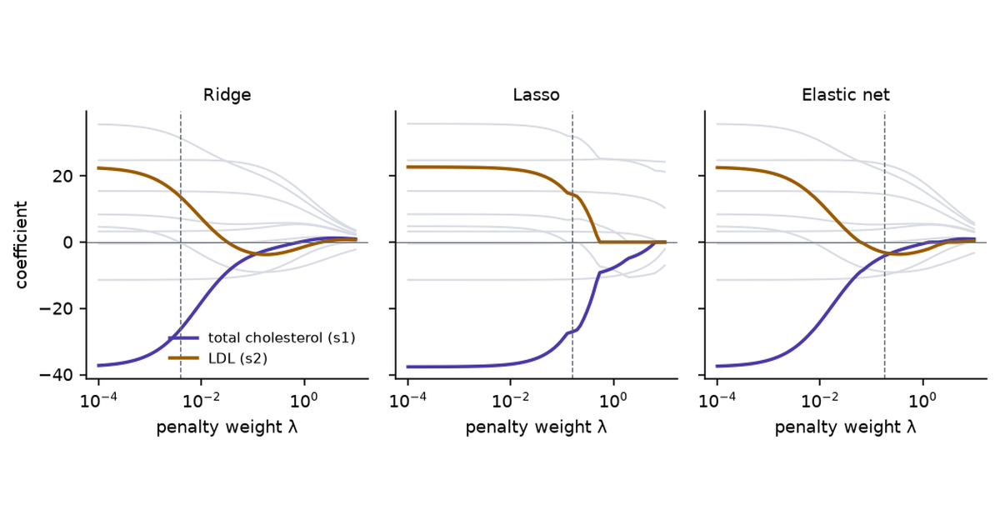

Every remedy for collinearity supplies, from outside the data, a value for the combination of coefficients the data cannot determine. The remedies differ in which value they supply and how firmly they hold it.

The remedies look like repairs. A regression with unstable coefficients goes into ridge, or the lasso, or a principal components step, and comes out with coefficients that hold still. The data did not change, so the information that was missing is still missing. The method filled the gap with an assumption, and the coefficients are stable because the assumption is.

[Part 1](../collinearity/) found the gap. With two nearly parallel predictor columns, the data fix the sum of the two coefficients and say almost nothing about their difference. With more columns the undetermined part is whichever combination nearly cancels.

- What does each method assume about that combination?
- What does the assumption cost when it is wrong?
- Which problems does each method leave unsolved?
- When is dropping a column, or doing nothing, the better choice?

```{python}
#| label: setup
#| echo: false
import warnings

import matplotlib.pyplot as plt
import numpy as np
import pandas as pd
import statsmodels.api as sm
from IPython.display import Markdown
from sklearn.datasets import load_diabetes
from sklearn.decomposition import PCA
from sklearn.linear_model import ElasticNetCV, LassoCV, LinearRegression, RidgeCV, enet_path, lasso_path
from sklearn.model_selection import RepeatedKFold, cross_val_score
from sklearn.pipeline import make_pipeline
from sklearn.preprocessing import StandardScaler

warnings.filterwarnings("ignore")
plt.rcParams.update(
    {
        "figure.dpi": 140,
        "savefig.dpi": 140,
        "figure.facecolor": "white",
        "axes.facecolor": "white",
        "font.size": 9,
        "axes.titlesize": 9,
        "axes.spines.top": False,
        "axes.spines.right": False,
    }
)
INK, MUTED, RULE = "#1F2430", "#5F6672", "#D8DBE2"
PURPLE, TEAL, AMBER, PINK, BLUE = "#4A3AA7", "#1D6E6E", "#9A5B00", "#A8437A", "#0072B2"


def md(df, **kw):
    return Markdown(df.to_markdown(disable_numparse=True, **kw))
```

## The weak direction

The facts carried over from Part 1:

- Write the singular value decomposition $X = \sum_i \sigma_i u_i v_i^\top$. Least squares is $\hat\beta = \sum_i (u_i^\top y / \sigma_i)\, v_i$.
- Near collinearity is a small $\sigma_i$. Its $v_i$ is the **weak direction**: a combination of coefficients that barely changes the fitted values.
- Dividing by the small $\sigma_i$ turns noise in $y$ into large swings of $\hat\beta$ along $v_i$.
- For two standardised columns at correlation $r$, the weak direction is $v_2 \propto (-1, 1)$: raise one coefficient, lower the other.

### The synthetic data

The two scenes reuse Part 1's synthetic data with one change.

- **Rows.** $n = 40$, the same $x$ values and the same 200 noise draws as Part 1.
- **Predictors.** Two centred columns with standard deviation 1 and correlation $r$.
- **Target.** $y = 1.5\,x_1 + 0.5\,x_2 + \varepsilon$, noise standard deviation 0.6. Part 1 used $(1, 1)$.
- **Why the change.** With true coefficients $(1, 1)$ the true difference $\beta_2 - \beta_1$ is zero, and a method that pushes the difference towards zero would look free. With $(1.5, 0.5)$ the difference is $-1$, and pushing it towards zero is an error the scenes can show.
- **What it stands in for.** Two measurements that track each other and matter unequally.

## One formula for the linear remedies

Standardise the columns and write the loss as the mean squared error, $\mathrm{MSE}(\beta) = \tfrac{1}{n}\lVert y - X\beta\rVert^2$. Let $d_i = \sigma_i^2 / n$, the eigenvalues of $X^\top X / n$. Ridge and principal components regression both return

$$
\tilde\beta = \sum_i f_i \,\frac{u_i^\top y}{\sigma_i}\, v_i ,
$$

least squares with each term multiplied by a **filter factor** $f_i$ between 0 and 1.

| Method | Filter factor | Effect on a weak direction |
|---|---|---|
| Least squares | $f_i = 1$ | kept at full size |
| Ridge, weight $\lambda$ | $f_i = d_i / (d_i + \lambda)$ | shrunk, more as $d_i$ falls below $\lambda$ |
| Principal components, $k$ kept | $f_i = 1$ for $i \le k$, else $0$ | deleted |

: Filter factors. {#tbl-filters}

The lasso and the elastic net are not of this form. They act on the coefficients $\beta_j$ themselves and can set them to zero.

## What each method minimises

Every method here minimises $\mathrm{MSE}(\beta) + \lambda \cdot \text{penalty}(\beta)$, or the MSE under a restriction. The scene draws that objective for two predictors.

::: {#widget-remedy-valley}
:::

```{=html}
<script src="../../widget-kit/stage.js"></script>
<script src="model.js"></script>
<script src="widgets.js"></script>
```

With **least squares** at **0.99** it is Part 1's trough. The answers of the 200 samples lie strewn along its floor, the $x_1$ coefficient has a standard deviation of 0.68, and a typical answer is 0.96 away from the truth.

### Ridge

Ridge (Hoerl and Kennard, 1970) adds the squared length of the coefficient vector:

$$
\tilde\beta_{\text{ridge}} = \arg\min_\beta \; \mathrm{MSE}(\beta) + \lambda \lVert\beta\rVert^2 = \Big(\tfrac{1}{n}X^\top X + \lambda I\Big)^{-1} \tfrac{1}{n}X^\top y .
$$

- **In the trough.** The penalty adds curvature $2\lambda$ in every direction. Across the trough that is negligible beside the curvature already there. Along the floor it is most of what there is.
- **Filter factors.** For two columns, $d_1 = 1 + r$ and $d_2 = 1 - r$. At $r = 0.99$ and $\lambda = 0.1$: $f_1 = 1.99/2.09 = 0.95$ and $f_2 = 0.01/0.11 = 0.09$. The sum of the coefficients keeps 95% of its least-squares value and the difference keeps 9%.
- **Condition number.** That of $\tfrac{1}{n}X^\top X + \lambda I$ is $(d_1 + \lambda)/(d_2 + \lambda)$: 19 in place of 199.
- **As extra rows.** Ridge is least squares on the data plus one made-up row per predictor, in which that predictor alone is non-zero and the response is 0. Those are rows in which the predictors move separately, the kind the data lacked.
- **As a prior.** It is the posterior mode under independent Gaussian priors centred on zero.

1. Press **ridge** and set the penalty weight to **0.10**. The floor of the trough has curled up into a bowl. The pink dot, least squares for this sample at $(1.68, 0.18)$, has been pulled along the floor to the amber answer at $(0.95, 0.82)$.
2. Read the stats. The standard deviation of the $x_1$ coefficient is 0.07. The average answer is $(1.00, 0.90)$, and the truth is $(1.5, 0.5)$.
3. Slide the weight down to **0.018**. The average answer moves to $(1.17, 0.81)$ and the typical distance from the truth is 0.57, the lowest ridge reaches at this correlation.
4. Slide it up to **1.0**. Both coefficients shrink towards zero together, to an average of $(0.67, 0.66)$, and the distance rises to 0.85.

Ridge does not find the difference. It replaces "unknown" with "close to zero", which here is wrong by 1.

### Principal components regression

Principal components regression (PCR) rotates the predictors onto their principal components, the directions $v_i$, regresses $y$ on the first $k$ of them, and rotates back.

- **For two columns.** The first component is the average of the two predictors and the second is their difference. Keeping one component forces $\tilde\beta_1 = \tilde\beta_2 = (\hat\beta_1 + \hat\beta_2)/2$.
- **Filter factors.** 1 for the kept components, 0 for the others: ridge's shrinkage taken to its limit for the small $d_i$ and switched off for the large ones.
- **What $k$ is.** The tuning knob, in whole steps.

1. Press **one component**. The amber line on the surface is the restriction $\beta_1 = \beta_2$, and every answer lies on it.
2. Read the stats. The standard deviation of the $x_1$ coefficient is 0.05, the average answer is $(1.00, 1.00)$, and the typical distance from the truth is 0.71.
3. Press **0.9**. Least squares has a typical distance of 0.31 at this correlation. One component still has 0.71.

That 0.71 is the length of the part of the truth that lies along the weak direction: $(1.5, 0.5) = (1, 1) + (0.5, -0.5)$, and $\lVert(0.5, -0.5)\rVert = 0.71$. PCR deletes that part at every correlation. At $r = 0.99$ deleting it costs less than estimating it. At $r = 0.9$ it costs more.

PCR chooses components by the variance of the predictors and never looks at $y$. A low-variance component can be the one that predicts (Jolliffe, 1982).

### Lasso

The lasso (Tibshirani, 1996) penalises the sum of absolute values:

$$
\tilde\beta_{\text{lasso}} = \arg\min_\beta \; \mathrm{MSE}(\beta) + \lambda \big(\lvert\beta_1\rvert + \dots + \lvert\beta_p\rvert\big).
$$

- **What it is for.** The absolute value has a corner at zero, so the minimum often sits exactly on $\beta_j = 0$. The lasso selects predictors.
- **On the floor of the trough.** Along the floor $\beta_1 + \beta_2$ is fixed. While both coefficients are positive, $\lvert\beta_1\rvert + \lvert\beta_2\rvert$ is that same sum, so the penalty is flat along the floor. The lasso adds no curvature where curvature was missing.
- **What breaks the tie.** The slight tilt of the floor in each sample: noise.

1. Press **0.99**, **lasso**, and set the weight to **0.10**. The two dark lines on the surface are $\beta_1 = 0$ and $\beta_2 = 0$. The grey answers are still spread along the floor, and some have stopped on a line.
2. Read the stats. The standard deviation of the $x_1$ coefficient is 0.54, against 0.68 for least squares. 4 samples drop $x_1$ and 54 drop $x_2$.
3. Press **New noise** three times. The answer goes from $(1.65, 0.16)$ to $(1.29, 0.56)$, $(1.37, 0.62)$ and $(1.92, 0.00)$.
4. Press **0.999**. 48 samples drop $x_1$, the predictor with three times the true coefficient, and 82 drop $x_2$.

With collinear predictors the lasso still selects, and the selection is unstable. It reports one predictor of a pair as irrelevant, and a different sample reverses the report.

### Elastic net

The elastic net (Zou and Hastie, 2005) uses both penalties. The scene uses equal weights:

$$
\tilde\beta_{\text{enet}} = \arg\min_\beta \; \mathrm{MSE}(\beta) + \lambda \Big(\tfrac{1}{2}\lVert\beta\rVert_1 + \tfrac{1}{2}\lVert\beta\rVert^2\Big).
$$

- **The squared term** curls the floor of the trough, as ridge does, so correlated predictors share the weight. Zou and Hastie call this the grouping effect.
- **The absolute term** keeps the corner at zero, so predictors unrelated to $y$ can still be dropped.

1. Press **0.99**, **elastic net**, weight **0.10**. The answers have gathered: the standard deviation of the $x_1$ coefficient is 0.12, and no sample drops either predictor.
2. Press **0.999**. Still none dropped, against 130 of 200 for the lasso at the same weight.
3. Read the average answer, $(0.97, 0.95)$. It shares the weight equally. The truth does not.

### Summary of the scene

| Method at $r = 0.99$ | sd of the $x_1$ coefficient | Average answer | Typical distance from $(1.5, 0.5)$ | Samples dropping $x_1$ / $x_2$ |
|---|---|---|---|---|
| Least squares | 0.68 | (1.50, 0.49) | 0.96 | 0 / 0 |
| Ridge, $\lambda = 0.018$ | 0.25 | (1.17, 0.81) | 0.57 | 0 / 0 |
| Ridge, $\lambda = 0.10$ | 0.07 | (1.00, 0.90) | 0.65 | 0 / 0 |
| One component | 0.05 | (1.00, 1.00) | 0.71 | 0 / 0 |
| Lasso, $\lambda = 0.10$ | 0.54 | (1.39, 0.56) | 0.78 | 4 / 54 |
| Elastic net, $\lambda = 0.10$ | 0.12 | (1.05, 0.88) | 0.62 | 0 / 0 |

: The scene's stats over its 200 noise draws. {#tbl-scene}

Least squares is right on average and far off in any one sample. Ridge, one component and the elastic net are wrong on average by a fixed amount and stay close to that answer in every sample. The lasso keeps most of the spread.

## The cost

The stability is bought with bias, and the bias sits where Part 1 located the damage: at points where the predictors disagree.

::: {#widget-remedy-fence}
:::

1. Start with **least squares** at **0.99**. At $(1.5, -1.5)$ the true value is 1.50. The average prediction is 1.52, its standard deviation is 2.05, and the typical error is 2.04.
2. Press **ridge**, weight **0.10**. The fan closes. The average prediction is 0.14 with a standard deviation of 0.19, and the typical error is 1.37. Every plane now misses the dark dot, and all miss it by about the same amount.
3. Press **one component**. The prediction at $(1.5, -1.5)$ is 0.00 in every sample. The typical error is 1.50, the true value itself.
4. Compare at $(1.5, 1.5)$, where the predictors agree. The typical error is 0.14 for least squares, 0.20 for ridge at 0.10, and 0.14 for one component.
5. Press **0.999** and **least squares**. The typical error at $(1.5, -1.5)$ is 6.47. For ridge at 0.10 it is 1.49.

- A point where the predictors disagree is a point along the weak direction. Least squares answers there with a guess that is right on average and wild in any one sample. The remedies answer with the assumption: no effect of the difference.
- Whether the trade is good depends on how wild the guess was. At $r = 0.999$ an error of 1.5 replaces one of 6.5. At $r = 0.9$ ridge at 0.10 has a typical error of 0.82 there and least squares 0.64.
- No method predicts well where the predictors disagree. The training rows hold no evidence about such points, and a penalty adds none.

## Real data

### The diabetes data

- **Source.** Efron, Hastie, Johnstone and Tibshirani (2004), shipped with scikit-learn: 442 diabetes patients, ten baseline measurements, and a measure of disease progression a year later.
- **What Part 1 found.** Total cholesterol (`s1`), LDL (`s2`), HDL (`s3`) and the triglyceride column (`s5`) are tied by the Friedewald formula, from which LDL is computed. The variance inflation factor (VIF) of total cholesterol is 59, and its least-squares coefficient is negative with a standard error half its size.
- **What this post asks of it.** What each remedy does to those coefficients, and whether any remedy predicts better.
- **Cost of a wrong answer.** Reporting a stabilised coefficient as an effect, or reporting a selected predictor as the relevant one.
- **Why these methods fit.** Ten standardised predictors, one strong dependence among four of them, and enough rows to resample.

```{python}
#| label: data
#| echo: false
D = load_diabetes(as_frame=True, scaled=False).frame
names = list(D.columns[:-1])
X_raw, y = D[names].values, D["target"].values
n, p = X_raw.shape
Z = (X_raw - X_raw.mean(0)) / X_raw.std(0)
yc = y - y.mean()
G = Z.T @ Z / n
d_eig = np.linalg.eigvalsh(G)[::-1]
ALPHAS = np.logspace(-2, 4, 60)
ridge_cv = RidgeCV(alphas=ALPHAS).fit(Z, y)
lam_cv = ridge_cv.alpha_ / n
# The number of principal components with the lowest cross-validated error.
cv10 = RepeatedKFold(n_splits=10, n_repeats=10, random_state=0)
pcr_err = {
    k: -cross_val_score(
        make_pipeline(StandardScaler(), PCA(n_components=k), LinearRegression()), X_raw, y, cv=cv10, scoring="neg_mean_squared_error"
    ).mean()
    for k in range(1, p + 1)
}
k_best = min(pcr_err, key=pcr_err.get)
assert k_best == 7, "the prose and two captions say seven components"
```

#### Filter factors

```{python}
#| label: fig-filters
#| fig-cap: "Filter factors on the ten singular directions of the standardised diabetes predictors, ordered from the strongest to the weakest. Left: ridge at the weight cross-validation chooses and at a weight twenty times larger. Right: principal components regression keeping seven components."
fig, axes = plt.subplots(1, 2, figsize=(7.4, 2.8), sharey=True)
idx = np.arange(1, p + 1)
w = 0.38
axes[0].bar(idx - w / 2, d_eig / (d_eig + lam_cv), w, color=PURPLE, label=f"λ = {lam_cv:.4f} (cross-validated)")
axes[0].bar(idx + w / 2, d_eig / (d_eig + 20 * lam_cv), w, color=TEAL, label=f"λ = {20 * lam_cv:.3f}")
axes[0].set_title("Ridge")
axes[0].legend(frameon=True, framealpha=0.92, edgecolor=RULE, fontsize=7.5, loc="lower left")
axes[1].bar(idx, (idx <= k_best).astype(float), 0.6, color=AMBER)
axes[1].set_title(f"Principal components, k = {k_best}")
for ax in axes:
    ax.set_xticks(idx)
    ax.set_xlabel("singular direction")
axes[0].set_ylabel("filter factor")
fig.tight_layout()
plt.show()
```

- The eigenvalues $d_i$ run from `{python} f"{d_eig[0]:.2f}"` down to `{python} f"{d_eig[-2]:.3f}"` and `{python} f"{d_eig[-1]:.4f}"`. The last is the Friedewald identity.
- Cross-validation chooses a ridge weight of `{python} f"{lam_cv:.4f}"`, which leaves the weakest direction with a factor of `{python} f"{d_eig[-1] / (d_eig[-1] + lam_cv):.2f}"`. Prediction error does not ask for more.
- Of the ten possible settings, PCR with `{python} k_best` components has the lowest cross-validated error. It deletes the `{python} p - k_best` weakest directions.

#### Coefficient paths

```{python}
#| label: fig-paths
#| fig-cap: "Coefficients of the ten standardised diabetes predictors as the penalty weight grows. Total cholesterol (s1) and LDL (s2) are coloured; the other eight are grey. The dashed line marks the weight chosen by five-fold cross-validation."
lams = np.logspace(-4, 1, 80)
ridge_path = np.array([np.linalg.solve(G + lam * np.eye(p), Z.T @ yc / n) for lam in lams])
# scikit-learn's lasso minimises RSS/(2n) + alpha |b|_1, so lambda = 2 alpha here; its elastic
# net with l1_ratio rho minimises RSS/(2n) + alpha rho |b|_1 + alpha (1 - rho) |b|^2 / 2, so
# this post's equal mix lambda (|b|_1 / 2 + |b|^2 / 2) is alpha = 0.75 lambda, rho = 1/3.
_, lasso_coefs, _ = lasso_path(Z, yc, alphas=lams[::-1] / 2)
_, enet_coefs, _ = enet_path(Z, yc, alphas=0.75 * lams[::-1], l1_ratio=1 / 3)
lasso_cv = LassoCV(cv=5, random_state=0).fit(Z, y)
enet_cv = ElasticNetCV(l1_ratio=1 / 3, cv=5, random_state=0).fit(Z, y)
chosen = {"Ridge": lam_cv, "Lasso": 2 * lasso_cv.alpha_, "Elastic net": enet_cv.alpha_ / 0.75}
paths = {"Ridge": ridge_path, "Lasso": lasso_coefs.T[::-1], "Elastic net": enet_coefs.T[::-1]}
fig, axes = plt.subplots(1, 3, figsize=(7.6, 2.9), sharey=True)
for ax, (name, path) in zip(axes, paths.items()):
    for j, c in enumerate(names):
        if c not in ("s1", "s2"):
            ax.plot(lams, path[:, j], color=RULE, lw=1)
    ax.plot(lams, path[:, names.index("s1")], color=PURPLE, lw=1.8, label="total cholesterol (s1)")
    ax.plot(lams, path[:, names.index("s2")], color=AMBER, lw=1.8, label="LDL (s2)")
    ax.axvline(chosen[name], color=MUTED, lw=0.7, ls="--")
    ax.axhline(0, color=MUTED, lw=0.5)
    ax.set_xscale("log")
    ax.set_title(name)
    ax.set_xlabel("penalty weight λ")
axes[0].set_ylabel("coefficient")
axes[0].legend(frameon=False, fontsize=7.5, loc="lower right")
fig.tight_layout()
plt.show()
```

```{python}
#| label: path-numbers
#| echo: false
i1, i2, ib = names.index("s1"), names.index("s2"), names.index("bmi")


def at(path, lam):
    return path[np.argmin(np.abs(lams - lam))]


r_lo, r_hi = at(ridge_path, 1e-4), at(ridge_path, 0.05)
lasso_first_zero = lams[np.argmax(paths["Lasso"][:, i2] == 0)]
```

- **Ridge.** Between $\lambda = 0.0001$ and $\lambda = 0.05$ the coefficient of total cholesterol goes from `{python} f"{r_lo[i1]:.1f}"` to `{python} f"{r_hi[i1]:.1f}"` and LDL's from `{python} f"{r_lo[i2]:+.1f}"` to `{python} f"{r_hi[i2]:+.1f}"`. Body mass index goes from `{python} f"{r_lo[ib]:.1f}"` to `{python} f"{r_hi[ib]:.1f}"`. A small weight removes the opposed pair and leaves the predictors outside the dependence alone.
- **Lasso.** The pair holds its opposed values until $\lambda$ is near 0.1. LDL then falls to zero at $\lambda \approx$ `{python} f"{lasso_first_zero:.2f}"`, and total cholesterol keeps a negative coefficient after it.
- **Elastic net.** The ridge shape, at larger weights because half of the weight goes to the absolute-value term.
- **The dashed lines.** For ridge and the lasso, cross-validation stops short of the weight at which the pair settles. For the elastic net it does not: at its chosen weight the coefficients are `{python} f"{enet_cv.coef_[i1]:.1f}"` and `{python} f"{enet_cv.coef_[i2]:.1f}"`.

#### Stability and prediction

Two measurements for each method, with its tuning chosen by cross-validation:

- **Stability.** Refit on 500 bootstrap resamples of the 442 patients and record the coefficient of total cholesterol.
- **Prediction.** Ten-fold cross-validated root mean squared error, repeated ten times.

"Drop LDL" is least squares on the nine predictors that remain when the computed column is removed.

```{python}
#| label: tbl-stability
#| tbl-cap: "The coefficient of total cholesterol (standardised) over 500 bootstrap resamples, and cross-validated prediction error, for each method on the diabetes data. Tuning is by five-fold cross-validation inside each fit. The error column is the mean of ten repeats of ten-fold cross-validation, with the range of the ten repeats in brackets."
keep_no_ldl = [j for j, c in enumerate(names) if c != "s2"]


class DropLDL(LinearRegression):
    def fit(self, X, y):
        return super().fit(X[:, keep_no_ldl], y)

    def predict(self, X):
        return super().predict(X[:, keep_no_ldl])


def s1_coef(model, name):
    if name == "PCR, 7 components":
        return (model[1].components_.T @ model[2].coef_)[i1]
    if name == "Drop LDL":
        return model[-1].coef_[keep_no_ldl.index(i1)]
    return model[-1].coef_[i1]


models = {
    "Least squares": make_pipeline(StandardScaler(), LinearRegression()),
    "Ridge": make_pipeline(StandardScaler(), RidgeCV(alphas=ALPHAS)),
    "PCR, 7 components": make_pipeline(StandardScaler(), PCA(n_components=k_best), LinearRegression()),
    "Lasso": make_pipeline(StandardScaler(), LassoCV(cv=5, random_state=0)),
    "Elastic net": make_pipeline(StandardScaler(), ElasticNetCV(l1_ratio=1 / 3, cv=5, random_state=0)),
    "Drop LDL": make_pipeline(StandardScaler(), DropLDL()),
}
B = 500
rng = np.random.default_rng(1)
resamples = [rng.integers(0, n, n) for _ in range(B)]
boot = {name: np.array([s1_coef(m.fit(X_raw[ix], y[ix]), name) for ix in resamples]) for name, m in models.items()}
cv_rmse = {}
for name, m in models.items():
    mse = -cross_val_score(m, X_raw, y, cv=cv10, scoring="neg_mean_squared_error")
    cv_rmse[name] = np.sqrt(mse.reshape(10, 10).mean(1))
rows = []
for name in models:
    b = boot[name]
    rows.append(
        {
            "Method": name,
            "Mean": f"{b.mean():.1f}",
            "sd": f"{b.std():.1f}",
            "Positive": f"{(b > 0).mean():.0%}",
            "Exactly zero": f"{(b == 0).mean():.0%}",
            "CV error": f"{cv_rmse[name].mean():.1f} [{cv_rmse[name].min():.1f}, {cv_rmse[name].max():.1f}]",
        }
    )
md(pd.DataFrame(rows), index=False, colalign=("left",) + ("right",) * 5)
```

```{python}
#| label: stability-numbers
#| echo: false
err_lo = min(v.mean() for v in cv_rmse.values())
err_hi = max(v.mean() for v in cv_rmse.values())
sd = {k: v.std() for k, v in boot.items()}
```

- **Prediction.** The methods are within `{python} f"{err_hi - err_lo:.1f}"` of each other, `{python} f"{err_lo:.1f}"` to `{python} f"{err_hi:.1f}"`, on a response whose standard deviation is `{python} f"{y.std():.0f}"`. With 442 rows whose predictors follow the training pattern, collinearity was not costing any prediction accuracy, so no remedy could buy any.
- **Ridge and lasso.** Tuned for prediction, both leave the coefficient as unstable as least squares: a standard deviation of `{python} f"{sd['Ridge']:.1f}"` and `{python} f"{sd['Lasso']:.1f}"` against `{python} f"{sd['Least squares']:.1f}"`. Cross-validation picks the weight that predicts best, and prediction did not need the pair settled.
- **Elastic net and PCR.** These settle it: `{python} f"{sd['Elastic net']:.1f}"` and `{python} f"{sd['PCR, 7 components']:.1f}"`.
- **Drop LDL.** One deleted column gives a standard deviation of `{python} f"{sd['Drop LDL']:.1f}"` at the same prediction error.

The stable answers disagree with each other about the size of the coefficient. Each reflects its method's assumption about the weak direction, and the data cannot rank the assumptions.

#### Fewer rows

Remedies do improve prediction when rows are scarce, because then the noise in the weak directions reaches the predictions.

```{python}
#| label: tbl-small-n
#| tbl-cap: "Test root mean squared error on the diabetes data when only some of the 442 patients are used for fitting and the others for testing. The median of 200 random splits, with the 5–95% interval in brackets. Tuning is by five-fold cross-validation on the training rows."
def pcr_cv(Xtr, ytr, Xte):
    best, best_k = np.inf, 1
    for k in range(1, min(p, len(ytr) - 6) + 1):
        model = make_pipeline(PCA(n_components=k), LinearRegression())
        score = -cross_val_score(model, Xtr, ytr, cv=5, scoring="neg_mean_squared_error").mean()
        if score < best:
            best, best_k = score, k
    return make_pipeline(PCA(n_components=best_k), LinearRegression()).fit(Xtr, ytr).predict(Xte)


sizes = [20, 30, 50, 100, 200]
small = {s: {k: [] for k in ["Least squares", "Ridge", "PCR", "Lasso", "Elastic net"]} for s in sizes}
for size in sizes:
    for seed in range(200):
        perm = np.random.default_rng(seed).permutation(n)
        tr, te = perm[:size], perm[size:]
        sc = StandardScaler().fit(X_raw[tr])
        Xtr, Xte, ytr, yte = sc.transform(X_raw[tr]), sc.transform(X_raw[te]), y[tr], y[te]
        preds = {
            "Least squares": LinearRegression().fit(Xtr, ytr).predict(Xte),
            "Ridge": RidgeCV(alphas=ALPHAS).fit(Xtr, ytr).predict(Xte),
            "PCR": pcr_cv(Xtr, ytr, Xte),
            "Lasso": LassoCV(cv=5, random_state=0, max_iter=5000).fit(Xtr, ytr).predict(Xte),
            "Elastic net": ElasticNetCV(l1_ratio=1 / 3, cv=5, random_state=0, max_iter=5000).fit(Xtr, ytr).predict(Xte),
        }
        for k, pr in preds.items():
            small[size][k].append(np.sqrt(np.mean((pr - yte) ** 2)))
rows = []
for size in sizes:
    row = {"Training rows": str(size)}
    for k, v in small[size].items():
        lo, mid, hi = np.percentile(v, [5, 50, 95])
        row[k] = f"{mid:.1f} [{lo:.1f}, {hi:.1f}]"
    rows.append(row)
md(pd.DataFrame(rows), index=False, colalign=("right",) * 6)
```

```{python}
#| label: small-numbers
#| echo: false
med = {s: {k: np.median(v) for k, v in small[s].items()} for s in sizes}
```

- With 20 training rows least squares has a median error of `{python} f"{med[20]['Least squares']:.1f}"` and ridge `{python} f"{med[20]['Ridge']:.1f}"`.
- With 50 the gap is `{python} f"{med[50]['Least squares']:.1f}"` against `{python} f"{med[50]['Ridge']:.1f}"`.
- With 200 all five methods are within `{python} f"{max(med[200].values()) - min(med[200].values()):.1f}"`.

### Longley: the two columns

- **Source.** Longley (1967), shipped with `statsmodels`: 16 annual observations of the US economy, 1947 to 1962.
- **What Part 1 found.** Total employment regressed on standardised GNP and population gives coefficients of 6,279 and −2,850, although each predictor alone has a coefficient near 3,400. The two columns correlate at 0.991.
- **What this post asks of it.** What a ridge penalty does to that pair.
- **Cost of a wrong answer.** Reading the negative coefficient, or the stabilised one, as the effect of population.
- **Why it fits.** Two columns, so the sum and the difference can be read off.

```{python}
#| label: tbl-longley
#| tbl-cap: "Ridge coefficients for total employment (thousands) on standardised GNP and population, Longley data, as the penalty weight grows."
Lg = sm.datasets.longley.load_pandas().data
Z2 = ((Lg[["GNP", "POP"]] - Lg[["GNP", "POP"]].mean()) / Lg[["GNP", "POP"]].std()).values
yL = Lg["TOTEMP"].values - Lg["TOTEMP"].mean()
m = len(yL) - 1  # the sample standard deviation divides by n - 1, as in Part 1
G2 = Z2.T @ Z2 / m
rows, longley = [], {}
for lam in [0, 0.001, 0.01, 0.032, 0.1]:
    b = np.linalg.solve(G2 + lam * np.eye(2), Z2.T @ yL / m)
    longley[lam] = b
    rows.append({"$\\lambda$": f"{lam:g}", "GNP": f"{b[0]:,.0f}", "Population": f"{b[1]:,.0f}", "Sum": f"{b.sum():,.0f}", "Difference": f"{b[0] - b[1]:,.0f}"})
md(pd.DataFrame(rows), index=False, colalign=("right",) * 5)
```

- The sum moves from `{python} f"{longley[0].sum():,.0f}"` to `{python} f"{longley[0.1].sum():,.0f}"` from the first row to the last.
- The difference falls from `{python} f"{longley[0][0] - longley[0][1]:,.0f}"` to `{python} f"{longley[0.1][0] - longley[0.1][1]:,.0f}"`.
- Population's coefficient turns positive between $\lambda = 0.01$ and $\lambda = 0.032$.

The sign of population's coefficient is set by the penalty weight. Sixteen yearly figures in which GNP and population rose together cannot say what population does at fixed GNP, with a penalty or without one.

## Other approaches

```{python}
#| label: centring
#| echo: false
xs = np.linspace(10, 20, 50)
corr_raw = np.corrcoef(xs, xs**2)[0, 1]
corr_centred = np.corrcoef(xs - xs.mean(), (xs - xs.mean()) ** 2)[0, 1]
```

- **Drop a column.** When one column is computed from others, as LDL is, remove it. On the diabetes data that took the standard deviation of total cholesterol's coefficient from `{python} f"{sd['Least squares']:.1f}"` to `{python} f"{sd['Drop LDL']:.1f}"` at no cost in prediction. The coefficient that remains then describes that predictor with the dropped one free to vary alongside it.
- **Combine columns.** Replace a group by one index: an average, a ratio, a sum. This is PCR with the components chosen by subject knowledge.
- **Collect rows that break the pattern.** A designed experiment sets the predictors independently, and is the only item on this list that adds information about the weak direction.
- **Partial least squares.** Like PCR, but each component is chosen for its covariance with $y$, which answers Jolliffe's objection.
- **An informative prior.** Ridge is a prior centred on zero. A prior centred on a value from earlier studies puts outside knowledge into the weak direction explicitly.
- **Centre before forming powers and products.** $x$ and $x^2$ are nearly collinear when $x$ is far from zero: for 50 evenly spaced values from 10 to 20 their correlation is `{python} f"{corr_raw:.3f}"`, and after centring $x$ it is `{python} f"{abs(corr_centred):.3f}"`. The fitted curve is the same either way. Centring changes which coefficients are asked for.
- **Errors in the predictors.** Part 1 showed that noise in $X$ is amplified by $\kappa^2$ when the residual is large. Total least squares models that noise; none of the penalties here do.
- **Nothing.** For predicting new rows that follow the training pattern, with enough rows, least squares on collinear predictors is already as accurate as any remedy.

## Choosing

| Goal | Reasonable choice | What it will not give |
|---|---|---|
| Predict rows like the training rows, many rows | least squares | interpretable coefficients inside the dependence |
| Predict rows like the training rows, few rows | ridge or elastic net, tuned by cross-validation | interpretable coefficients inside the dependence |
| Predict rows that break the pattern | new data | a penalty cannot supply it |
| Stable coefficients to report | drop or combine columns by subject knowledge; ridge or elastic net with a weight chosen for stability | an estimate of each predictor's separate effect |
| A short list of predictors | elastic net; lasso only if the list need not be stable | evidence that the dropped predictors are irrelevant |
| Many near-duplicate predictors, such as spectra | PCR or partial least squares | coefficients on the original columns that mean much |

: A choice for each goal. {#tbl-choosing}

A weight chosen for prediction and a weight chosen for stable coefficients are different weights. On the diabetes data cross-validation chose the first and left the coefficients unsettled.

Remedies. Assume. Ridge. Shrinks. Components. Delete. Lasso. Flips. Nets. Share. None. Recovers.

## References

- Efron, B., Hastie, T., Johnstone, I., and Tibshirani, R. (2004). [Least angle regression](https://doi.org/10.1214/009053604000000067). *Annals of Statistics*, 32(2), 407–499.
- Hoerl, A. E., and Kennard, R. W. (1970). Ridge regression: biased estimation for nonorthogonal problems. *Technometrics*, 12(1), 55–67.
- Jolliffe, I. T. (1982). A note on the use of principal components in regression. *Journal of the Royal Statistical Society, Series C*, 31(3), 300–303.
- Longley, J. W. (1967). An appraisal of least squares programs for the electronic computer from the point of view of the user. *Journal of the American Statistical Association*, 62(319), 819–841.
- Tibshirani, R. (1996). Regression shrinkage and selection via the lasso. *Journal of the Royal Statistical Society, Series B*, 58(1), 267–288.
- Zou, H., and Hastie, T. (2005). Regularization and variable selection via the elastic net. *Journal of the Royal Statistical Society, Series B*, 67(2), 301–320.
- [Collinearity, Part 1: The Direction the Data Cannot See](../collinearity/).
