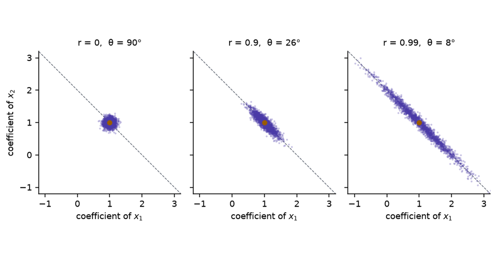

When two predictors carry nearly the same information, least squares still predicts well, but it can no longer say how much each predictor contributes: the individual coefficients swing with every small change to the data.

The symptom is familiar. A regression is refitted with one more month of data. Its predictions barely move and its $R^2$ is the same to three decimals, yet one coefficient has doubled and another has changed sign. The software is working. The data pin down some combinations of the coefficients tightly and others hardly at all, and a nearly collinear pair of columns is the smallest example of the second kind.

The questions came from one scene in an interactive [linear-algebra stage](https://project-delphi.github.io/tensors-workshop/interactive/linalg-stage.html#collinear). A button there moves a target vector by 2%, and with the two predictor columns half a degree apart the fitted coefficients go from $(1.41, 0)$ to $(-1.83, 3.24)$.

- 2% of what?
- Why is the response violent only when the columns are nearly parallel?
- Do the fitted values and the loss move as well?
- Is a change to the predictors worse than a change to the target?
- What changes with more than two columns, and with real data?

[Part 2](../collinearity-remedies/) covers what to do about it: ridge, principal components, the lasso, and the elastic net.

```{python}
#| label: setup
#| echo: false
import warnings

import matplotlib.pyplot as plt
import numpy as np
import pandas as pd
import statsmodels.api as sm
from IPython.display import Markdown
from sklearn.datasets import load_diabetes

warnings.filterwarnings("ignore")
plt.rcParams.update(
    {
        "figure.dpi": 140,
        "savefig.dpi": 140,
        "figure.facecolor": "white",
        "axes.facecolor": "white",
        "font.size": 9,
        "axes.titlesize": 9,
        "axes.spines.top": False,
        "axes.spines.right": False,
    }
)
INK, MUTED, RULE = "#1F2430", "#5F6672", "#D8DBE2"
PURPLE, TEAL, AMBER, PINK, BLUE = "#4A3AA7", "#1D6E6E", "#9A5B00", "#A8437A", "#0072B2"


def md(df, **kw):
    return Markdown(df.to_markdown(disable_numparse=True, **kw))
```

## The symptom

The first scene uses synthetic data, so the cause can be turned up and down.

- **Rows.** $n = 40$.
- **Predictors.** Two columns $x_1, x_2$, centred, with standard deviation 1 and correlation $r$.
- **Target.** $y = x_1 + x_2 + \varepsilon$, with $\varepsilon$ Gaussian noise of standard deviation 0.6.
- **What it stands in for.** Any pair of measurements that track each other: two assays of the same quantity, a country's output and its population, total and LDL cholesterol.

Changing $r$ turns $x_2$ towards $x_1$ and leaves the noise, the true coefficients $(1, 1)$, and the 40 values of $x_1$ as they were.

::: {#widget-fence}
:::

```{=html}
<script src="../../widget-kit/stage.js"></script>
<script src="model.js"></script>
<script src="widgets.js"></script>
```

Each sheet is one least-squares plane $\hat y = \hat\beta_1 x_1 + \hat\beta_2 x_2$, fitted to the same $x$ values under a different draw of the noise.

1. Press **r = 0**. The grey shadows of the data fill the floor, the 25 planes lie almost on top of each other, and the $x_1$ coefficient has a standard deviation of 0.09 over 200 noise draws.
2. Press **0.99**. The shadows collapse onto a narrow band along the diagonal. The planes still agree above that band and fan out away from it, as if hinged on a fence that runs over the data. The standard deviation of the $x_1$ coefficient is 0.68.
3. Read the sum. The standard deviation of $\hat\beta_1 + \hat\beta_2$ is 0.09, lower than the 0.13 it had at $r = 0$.
4. Compare the two vertical lines. At $(1.5, 1.5)$, a point like the data, the predictions have standard deviation 0.14. At $(1.5, -1.5)$, where the predictors disagree, it is 2.05.
5. Press **0.999**, then **New noise** four times. The amber points barely move, and the solid plane's coefficients go from $(1.87, 0.00)$ to $(0.63, 1.27)$, $(0.57, 1.47)$, $(3.73, -1.76)$ and $(-2.24, 4.29)$. Both true values are 1.

The planes pivot because the data say where the plane is along the fence and almost nothing about its tilt across it.

## Notation

- $X = [\,x_1 \;\; x_2\,] \in \mathbb{R}^{n \times 2}$, the predictor columns, centred and of equal length.
- $y \in \mathbb{R}^n$, the target.
- $\hat\beta = \arg\min_\beta \lVert y - X\beta \rVert^2$, the least-squares coefficients, and $\hat y = X\hat\beta$, the fitted vector.
- $\theta$, the angle between $x_1$ and $x_2$ as vectors in $\mathbb{R}^n$. For centred columns $\cos\theta = r$, the sample correlation.

**Collinear** means $\theta = 0$: one column is a multiple of the other, $X^\top X$ is singular, and no unique $\hat\beta$ exists. **Nearly collinear** means $\theta$ is small.

Correlation compresses the scale near 1.

```{python}
#| label: tbl-angles
#| tbl-cap: "Correlation, the angle between the two columns, the smaller singular value of $X$ for unit-length columns, the condition number, and the variance inflation factor. The last three are derived in the sections that follow."
rows = []
for r in [0.0, 0.5, 0.9, 0.99, 0.999, 0.9999]:
    t = np.arccos(r)
    rows.append(
        {
            "$r$": f"{r:g}",
            "$\\theta$": f"{np.degrees(t):.2f}°",
            "$\\sigma_2$": f"{np.sqrt(2) * np.sin(t / 2):.4f}",
            "$\\kappa = \\cot(\\theta/2)$": f"{1 / np.tan(t / 2):.1f}",
            "VIF $= 1/\\sin^2\\theta$": f"{1 / np.sin(t) ** 2:,.1f}",
        }
    )
md(pd.DataFrame(rows), index=False, colalign=("right",) * 5)
```

A correlation of 0.9 sounds close to collinear and is 26° apart. The instability starts in earnest at 0.99.

## Which 2%

With $n$ observations, $x_1$, $x_2$ and $y$ are three arrows in $\mathbb{R}^n$, and least squares is a projection.

- The columns span a plane. $\hat y$ is the point of that plane closest to $y$: its shadow.
- The coefficients are the coordinates of $\hat y$ in the basis $(x_1, x_2)$: go $\hat\beta_1$ steps along $x_1$, then $\hat\beta_2$ steps along $x_2$.
- The residual $y - \hat y$ is perpendicular to the plane, and its squared length is the minimum loss.

With $n = 3$ the picture fits on a screen. The scene uses $x_1 = (1, 0, 0)$, $x_2 = (\cos\theta, \sin\theta, 0)$ and $y = (1.4, 0, 0.7)$, a synthetic target chosen so that $\hat\beta = (1.4, 0)$ at every angle before any nudge.

::: {#widget-nudge}
:::

The three buttons add a vector $\delta$ with $\lVert\delta\rVert = 0.02\,\lVert y\rVert$ to $y$. That is the 2%: a change in the target of 2% of its own length. Its direction decides what happens.

1. Press **0.99**, then **out of the floor**. The coefficients do not move. The squared residual grows by 9.1%.
2. Press **along the columns**. $\hat y$ moves by 2.2% of its length and the coefficients by 1.6%.
3. Press **across them**. $\hat y$ moves by the same 2.2%. The coefficients move by 22%.
4. Keep **across them** and press **0.999**, then **θ = 0.5°**. The change in the coefficients is 71%, then 362%: from $(1.40, 0)$ to $(-2.19, 3.59)$. The route to $\hat y$ now runs 2.19 units backwards along $x_1$ and 3.59 units forwards along $x_2$ to land 0.03 from where it started.

| Nudge $\delta$ | Fitted vector $\hat y$ | Coefficients $\hat\beta$ | Minimum loss |
|---|---|---|---|
| out of the column plane | unchanged | unchanged | changes |
| in the plane, along the columns | moves by $\lVert\delta\rVert$ | move a little | unchanged |
| in the plane, across the columns | moves by $\lVert\delta\rVert$ | move by $\lVert\delta\rVert/\sigma_2$ | unchanged |

: What a nudge to $y$ does, by direction. {#tbl-nudge}

The fitted vector is never the unstable part. Its coordinates in a basis of two nearly parallel arrows are.

## The linear algebra

### Sum and difference

Take the columns to have length 1. Their Gram matrix and its eigenvectors are

$$
X^\top X = \begin{bmatrix} 1 & \cos\theta \\ \cos\theta & 1 \end{bmatrix},
\qquad
v_1 = \tfrac{1}{\sqrt 2}\begin{bmatrix} 1 \\ 1 \end{bmatrix},\;\;
v_2 = \tfrac{1}{\sqrt 2}\begin{bmatrix} -1 \\ 1 \end{bmatrix},
$$

with eigenvalues $1 + \cos\theta$ and $1 - \cos\theta$. The singular values of $X$ are their square roots:

$$
\sigma_1 = \sqrt{1 + \cos\theta} = \sqrt 2\,\cos\tfrac{\theta}{2},
\qquad
\sigma_2 = \sqrt{1 - \cos\theta} = \sqrt 2\,\sin\tfrac{\theta}{2}.
$$

- $X v_1 = (x_1 + x_2)/\sqrt 2$ has length $\sigma_1$, between 1 and $\sqrt 2$. Raising both coefficients together moves the fitted vector a long way.
- $X v_2 = (x_2 - x_1)/\sqrt 2$ has length $\sigma_2 \approx \theta/\sqrt 2$. Raising one coefficient and lowering the other by the same amount moves the fitted vector by almost nothing, because the two columns nearly cancel.

$v_2$ is the direction the data cannot see. A unit step along it changes every fitted value by a total length of $\sigma_2$, so the data hold almost no evidence for or against that step.

### Least squares in the singular basis

Write the singular value decomposition $X = \sigma_1 u_1 v_1^\top + \sigma_2 u_2 v_2^\top$, with $u_1, u_2$ the unit vectors along $x_1 + x_2$ and $x_2 - x_1$. Then

$$
\hat\beta = \frac{u_1^\top y}{\sigma_1}\, v_1 + \frac{u_2^\top y}{\sigma_2}\, v_2 .
$$

- $u_1^\top y / \sigma_1$ sets the sum $\hat\beta_1 + \hat\beta_2$.
- $u_2^\top y / \sigma_2$ sets the difference $\hat\beta_2 - \hat\beta_1$.
- A nudge $\delta$ changes the coefficients by $(u_1^\top\delta/\sigma_1)\,v_1 + (u_2^\top\delta/\sigma_2)\,v_2$. The part of $\delta$ along $u_2$ is divided by $\sigma_2$.

```{python}
#| label: nudge-numbers
#| echo: false
y0 = np.array([1.4, 0.0, 0.7])
delta = 0.02 * np.linalg.norm(y0)
half = np.deg2rad(0.5) / 2
s1_half, s2_half = np.sqrt(2) * np.cos(half), np.sqrt(2) * np.sin(half)
db_weak, db_strong = delta / s2_half, delta / s1_half
```

That accounts for the scene.

- The target has length `{python} f"{np.linalg.norm(y0):.3f}"`, so the nudge has length `{python} f"{delta:.4f}"`.
- At $\theta = 0.5°$ the smaller singular value $\sigma_2$ is `{python} f"{s2_half:.5f}"`.
- A nudge along $u_2$ moves the coefficients by `{python} f"{delta:.4f}"` ÷ `{python} f"{s2_half:.5f}"` = `{python} f"{db_weak:.2f}"`, which is `{python} f"{100 * db_weak / 1.4:.0f}"`% of $\lVert\hat\beta\rVert = 1.4$.
- The same nudge along $u_1$ moves them by `{python} f"{db_strong:.4f}"`.

The scene that prompted the questions uses a nudge perpendicular to $x_1$, which lies almost entirely along $u_2$ at small angles, and a target with $\lVert\hat\beta\rVert = \sqrt 2$: the same division, giving 324% at half a degree.

### Many noise draws

Random noise has a component along $u_2$ in every sample, so repeated samples scatter the coefficients along $v_2$.

```{python}
#| label: fig-cloud
#| fig-cap: "Least-squares coefficients from 2,000 noise draws on the synthetic data of the first scene ($n = 40$, noise sd 0.6, true coefficients $(1, 1)$, marked). The dashed line is $\\beta_1 + \\beta_2 = 2$. As the correlation rises the cloud stretches along that line and stays narrow across it."
n, sigma, beta_true = 40, 0.6, np.array([1.0, 1.0])


def pair(theta_deg, n, rng):
    """Two centred unit-length columns at angle theta."""
    Z = rng.standard_normal((n, 2))
    Z -= Z.mean(0)
    Q, _ = np.linalg.qr(Z)
    t = np.deg2rad(theta_deg)
    return np.column_stack([Q[:, 0], np.cos(t) * Q[:, 0] + np.sin(t) * Q[:, 1]])


cloud = {}
fig, axes = plt.subplots(1, 3, figsize=(7.4, 2.9), sharex=True, sharey=True)
for ax, r in zip(axes, [0.0, 0.9, 0.99]):
    theta = np.degrees(np.arccos(r))
    rng = np.random.default_rng(1)
    X = np.sqrt(n) * pair(theta, n, rng)
    E = sigma * rng.standard_normal((2000, n))
    B = beta_true + E @ np.linalg.pinv(X).T
    cloud[r] = B
    ax.plot([-2, 4], [4, -2], color=MUTED, lw=0.7, ls="--", zorder=1)
    ax.scatter(B[:, 0], B[:, 1], s=4, alpha=0.3, color=PURPLE, lw=0, zorder=2)
    ax.plot(1, 1, "o", color=AMBER, ms=4.5, zorder=3)
    ax.set_title(f"r = {r:g},  θ = {theta:.0f}°")
    ax.set_xlabel("coefficient of $x_1$")
    ax.set_xlim(-1.2, 3.2)
    ax.set_ylim(-1.2, 3.2)
    ax.set_aspect("equal")
axes[0].set_ylabel("coefficient of $x_2$")
fig.tight_layout()
plt.show()
```

```{python}
#| label: cloud-numbers
#| echo: false
sd_sum = {r: (B[:, 0] + B[:, 1]).std() for r, B in cloud.items()}
sd_diff = {r: (B[:, 1] - B[:, 0]).std() for r, B in cloud.items()}
```

- The standard deviation of the sum $\hat\beta_1 + \hat\beta_2$ is `{python} f"{sd_sum[0.0]:.2f}"`, `{python} f"{sd_sum[0.9]:.2f}"` and `{python} f"{sd_sum[0.99]:.2f}"` in the three panels.
- The standard deviation of the difference is `{python} f"{sd_diff[0.0]:.2f}"`, `{python} f"{sd_diff[0.9]:.2f}"` and `{python} f"{sd_diff[0.99]:.2f}"`.

## The condition number

### Definition and the two-column value

The **condition number** of $X$ is the ratio of its largest to its smallest singular value, $\kappa(X) = \sigma_{\max}/\sigma_{\min}$. It measures how unequally $X$ stretches different directions.

For two columns of equal length,

$$
\kappa(X) = \frac{\sqrt 2\,\cos(\theta/2)}{\sqrt 2\,\sin(\theta/2)} = \cot\frac{\theta}{2} \approx \frac{2}{\theta} \quad (\theta \text{ in radians, small}).
$$

- $\sigma_{\max}$ stays between 1 and $\sqrt 2$ whatever the angle: two unit columns cannot add up to more than a vector of length 2.
- $\sigma_{\min}$ goes to zero in proportion to $\theta$.
- So $\kappa$ grows like $1/\theta$. Halving the angle doubles it. Nothing is special about any threshold; the ratio is unbounded because its denominator reaches zero when the columns coincide.

### What it bounds

For a nudge $\delta$ to $y$ that lies in the column plane,

$$
\frac{\lVert\Delta\hat\beta\rVert}{\lVert\hat\beta\rVert} \;\le\; \kappa(X)\,\frac{\lVert\delta\rVert}{\lVert\hat y\rVert}.
$$

- The bound is reached when $\hat y$ lies along $u_1$ and $\delta$ along $u_2$: the fit uses the strong direction and the nudge hits the weak one.
- The denominator is $\lVert\hat y\rVert$, not $\lVert y\rVert$. A target that is mostly residual has a small fitted vector, and the same nudge is a larger fraction of it.
- $\kappa$ is a worst case. The nudge **along the columns** in the scene is nowhere near it.

$\sigma_{\min}$ is also the distance, in the spectral norm, from $X$ to the nearest matrix with exactly collinear columns (the Eckart–Young theorem). Relative to $\lVert X\rVert = \sigma_{\max}$ that distance is $1/\kappa$. At $\kappa = 100$ a 1% change to $X$ is enough to make the columns exactly dependent.

### A change to X or a change to y

The target enters $\hat\beta = X^{+} y$ linearly, so a nudge to $y$ is amplified by at most $\kappa$. The predictors enter through the pseudoinverse $X^{+}$, and the first-order bound for a perturbation $E$ of $X$ has two terms (Wedin, 1973; Golub and Van Loan, 2013, §5.3):

$$
\frac{\lVert\Delta\hat\beta\rVert}{\lVert\hat\beta\rVert} \;\lesssim\; \Big(\kappa + \kappa^2 \tan\phi\Big)\,\frac{\lVert E\rVert}{\lVert X\rVert},
$$

where $\phi$ is the angle between $y$ and the column plane, so $\tan\phi = \lVert y - \hat y\rVert / \lVert\hat y\rVert$.

- With an exact fit, $\tan\phi = 0$ and a change to $X$ is no worse than a change to $y$.
- With a residual, the $\kappa^2$ term appears. Perturbing $X$ tilts the plane, and the residual, which was perpendicular to the old plane, acquires a component inside the new one along the weak direction.

A simulation separates the two cases. It is synthetic: $n = 50$, unit columns at angle $\theta$, $y = x_1 + x_2$ plus a residual perpendicular to both columns, scaled to 0%, 5% or 30% of the signal's length. Each of 1,000 seeds applies one random perturbation of relative size 2% to $y$, and separately to $X$.

```{python}
#| label: tbl-xy
#| tbl-cap: "Median relative change in the coefficients, $\\lVert\\Delta\\hat\\beta\\rVert/\\lVert\\hat\\beta\\rVert$, after a random 2% perturbation, over 1,000 seeds. The 5–95% interval is in brackets."
def one_seed(theta, resid, seed):
    rng = np.random.default_rng(seed)
    n = 50
    X = pair(theta, n, rng)
    signal = X @ np.array([1.0, 1.0])
    e = rng.standard_normal(n)
    e -= X @ np.linalg.lstsq(X, e, rcond=None)[0]
    y = signal + resid * np.linalg.norm(signal) * e / np.linalg.norm(e)
    b0 = np.linalg.lstsq(X, y, rcond=None)[0]
    dy = rng.standard_normal(n)
    dy *= 0.02 * np.linalg.norm(y) / np.linalg.norm(dy)
    dX = rng.standard_normal((n, 2))
    dX *= 0.02 * np.linalg.norm(X, 2) / np.linalg.norm(dX, 2)
    by = np.linalg.lstsq(X, y + dy, rcond=None)[0]
    bx = np.linalg.lstsq(X + dX, y, rcond=None)[0]
    return np.linalg.norm(by - b0) / np.linalg.norm(b0), np.linalg.norm(bx - b0) / np.linalg.norm(b0)


def cell(v):
    lo, mid, hi = np.percentile(v, [5, 50, 95]) * 100
    return f"{mid:.1f}% [{lo:.1f}, {hi:.1f}]"


xy = {}
rows = []
for r in [0.0, 0.99, 0.999, 0.99996]:
    theta = np.degrees(np.arccos(r)) if r < 0.9999 else 0.5
    row = {"$\\theta$": f"{theta:.2f}°", "$\\kappa$": f"{1 / np.tan(np.deg2rad(theta) / 2):.1f}"}
    for resid in [0.0, 0.05, 0.30]:
        out = np.array([one_seed(theta, resid, s) for s in range(1000)])
        xy[(r, resid)] = np.median(out, axis=0) * 100
        if resid == 0.0:
            row["nudge $y$"] = cell(out[:, 0])
        row[f"nudge $X$, residual {resid:.0%}"] = cell(out[:, 1])
    rows.append(row)
md(pd.DataFrame(rows), index=False, colalign=("right",) * 6)
```

- A random nudge to $y$ is amplified in proportion to $\kappa$, at about a tenth of the worst case, because a random direction in 50 dimensions has only a small component along $u_2$.
- With an exact fit, the same-sized change to $X$ does less than the change to $y$: `{python} f"{xy[(0.99996, 0.0)][1]:.0f}"`% against `{python} f"{xy[(0.99996, 0.0)][0]:.0f}"`% at half a degree.
- With a residual 30% as long as the signal, the change to $X$ does more: `{python} f"{xy[(0.99996, 0.30)][1]:.0f}"`% against `{python} f"{xy[(0.99996, 0.0)][0]:.0f}"`%.

Regression data have residuals, so in practice noise in the predictors is the more damaging of the two. The reason is the size of the residual, and the claim fails for a system that is solved exactly.

### Floating point

Rounding in the arithmetic is one more perturbation, of relative size about $10^{-16}$ in double precision, and $\kappa$ amplifies it as it does any other.

- A solver that works on $X$ directly (QR or the SVD) loses about $\log_{10}\kappa$ of its 16 digits.
- The normal equations $X^\top X \beta = X^\top y$ work on $X^\top X$, whose condition number is $\kappa^2$, and lose twice as many.

```{python}
#| label: tbl-float
#| tbl-cap: "Relative error in the computed coefficients for exact data $y = x_1 + x_2$ in double precision, at increasing condition number. The median of 200 seeds, with the largest in brackets; \"fails\" means the solver reported a singular matrix on at least one seed."
rows = []
for k in [1e2, 1e4, 1e6, 1e8]:
    theta = np.degrees(2 * np.arctan(1 / k))
    err_ne, err_ls = [], []
    for s in range(200):
        X = pair(theta, 50, np.random.default_rng(s))
        y = X @ np.array([1.0, 1.0])
        try:
            b_ne = np.linalg.solve(X.T @ X, X.T @ y)
            err_ne.append(np.linalg.norm(b_ne - 1) / np.sqrt(2))
        except np.linalg.LinAlgError:
            err_ne.append(np.inf)
        err_ls.append(np.linalg.norm(np.linalg.lstsq(X, y, rcond=None)[0] - 1) / np.sqrt(2))
    rows.append(
        {
            "$\\kappa(X)$": f"$10^{{{int(np.log10(k))}}}$",
            "normal equations": f"{np.median(err_ne):.0e} [{'fails' if np.isinf(np.max(err_ne)) else format(np.max(err_ne), '.0e')}]",
            "SVD on $X$ (`lstsq`)": f"{np.median(err_ls):.0e} [{np.max(err_ls):.0e}]",
        }
    )
float_rows = rows
md(pd.DataFrame(rows), index=False, colalign=("right",) * 3)
```

This part of the problem is solved by the choice of algorithm. The statistical part is not: no solver recovers information the data do not hold.

## The loss surface

The singular values also set the shape of the loss. With $\hat\beta$ the minimiser,

$$
L(\beta) = \lVert y - X\beta\rVert^2 = L_{\min} + (\beta - \hat\beta)^\top X^\top X\, (\beta - \hat\beta).
$$

- The surface is a bowl whose curvature is $2\sigma_1^2$ along $v_1$ and $2\sigma_2^2$ along $v_2$.
- The ratio of the two curvatures is $\kappa^2$.
- $L_{\min}$ is the squared distance from $y$ to the column plane.

The scene plots the mean squared error, $L/n$, for the synthetic data of the first scene, with columns of standard deviation 1.

::: {#widget-valley}
:::

1. Press **r = 0**. The bowl is round: curvature 2 in every direction. The grey minima of the other 199 draws huddle at its bottom, and this draw's minimum loss is 0.298.
2. Press **0.99**. The bowl has become a trough. Its curvature is 3.98 across and 0.020 along, a ratio of 199, which is $\kappa^2 = 14.1^2$. The other draws' minima lie strewn along its floor. The minimum loss is still 0.298.
3. Press **0.999**. The floor is ten times flatter and the minimum has moved from $(1.18, 0.68)$ to $(1.87, 0.00)$. The minimum loss is still 0.298.
4. Press **0.99** again, then **New noise** four times. The trough slides along its own length and the amber minimum visits $(0.82, 1.09)$, $(0.90, 1.15)$, $(1.84, 0.13)$ and $(0.02, 2.04)$.

Steps 2 and 3 answer the question about the loss. The minimum loss depends only on the plane the columns span, and turning one column towards the other inside that plane leaves the plane where it was. A sample that moves the minimum a long way along the trough changes the loss at the old minimum by almost nothing, since the floor of the trough is nearly flat.

Gradient descent has to cross this surface. Its step size is limited by the steep direction and its progress along the floor is slower by the factor $\kappa^2$.

## The statistics

Under the model $y = X\beta + \varepsilon$ with independent noise of variance $\sigma^2$ (here $\sigma$ is the noise level, not a singular value), the covariance of the estimate is $\operatorname{Var}(\hat\beta) = \sigma^2 (X^\top X)^{-1}$. For two centred columns with sum of squares $S$ each:

$$
\operatorname{Var}(\hat\beta_j) = \frac{\sigma^2}{S}\cdot\frac{1}{1 - r^2},
\qquad
\operatorname{Corr}(\hat\beta_1, \hat\beta_2) = -r .
$$

- **Variance inflation factor.** $\mathrm{VIF} = 1/(1 - r^2) = 1/\sin^2\theta$ is the factor by which the variance of a coefficient exceeds what it would be with uncorrelated columns. For small angles $\mathrm{VIF} \approx \kappa^2/4$.
- **Opposite errors.** The two estimates are correlated at $-r$. When one comes out too high the other comes out too low by nearly the same amount, which is how the fourth noise draw of the first scene, at half a degree, fits $(15.1, -13.1)$ to data generated with $(1, 1)$.
- **Sum and difference.** $\operatorname{Var}(\hat\beta_1 + \hat\beta_2) = 2\sigma^2 / (S(1 + r))$ falls slightly as $r$ rises. $\operatorname{Var}(\hat\beta_1 - \hat\beta_2) = 2\sigma^2 / (S(1 - r))$ has $1 - r$ in the denominator.
- **Tests.** Each coefficient's $t$-statistic shrinks by $\sqrt{\mathrm{VIF}}$. Two predictors can each test as indistinguishable from zero while the pair is, jointly, strongly related to $y$.
- **Predictions.** The variance of a prediction at a new point $x$ is $\sigma^2 x^\top (X^\top X)^{-1} x$: small when $x$ lies along $v_1$, where the data are, and large along $v_2$.

The first scene agrees: $\sigma = 0.6$, $S = 40$ and $r = 0.99$ give a standard deviation of $0.6/\sqrt{40 \times 0.0199} = 0.67$ for a coefficient, against 0.68 over the scene's 200 draws.

## More than two columns

With $p$ columns, near collinearity means that some combination of them nearly cancels: $Xv \approx 0$ for a unit vector $v$. That is the statement that the smallest singular value is small, and $v$ is its right singular vector.

- $v$ is again the direction the data cannot see, now a combination of several coefficients.
- $\hat\beta = \sum_i (u_i^\top y / \sigma_i)\, v_i$ still holds, with one term for each singular value.
- $\mathrm{VIF}_j = 1/(1 - R_j^2)$, where $R_j^2$ is the $R^2$ from regressing column $j$ on the other columns.

No two columns need be close for this to happen.

::: {#widget-three}
:::

1. At 90° the three columns are perpendicular. The box has volume 1 and $\kappa = 1$.
2. Drag the lift down to about 8°. The box is nearly flat. The largest correlation between any two columns is 0.70, and $\kappa$ is 14, the value two columns reach at $r = 0.99$.
3. Drag to 1°. The largest pairwise correlation is 0.707 and will never exceed it. The VIF of $x_3$ is above 3,000.

The Gram matrix of these three columns has eigenvalues $1 + \cos\alpha$, $1$ and $1 - \cos\alpha$ for a lift of $\alpha$, so $\kappa = \cot(\alpha/2)$: the two-column formula, with the angle between $x_3$ and the plane of the others in place of the angle between two columns. A table of pairwise correlations shows none of it.

Two diagnostics do:

- The singular values of $X$ after scaling every column to the same length, and the right singular vector of the smallest one, which names the columns involved. Belsley, Kuh and Welsch (1980) built their collinearity diagnostics on these.
- The VIFs, which are the diagonal of the inverse correlation matrix.

## Real data

### Longley: two columns, then six

- **Source.** Longley (1967): 16 annual observations of the US economy, 1947 to 1962, taken from official statistics. It ships with `statsmodels`.
- **Motive.** Longley used it to test the regression programs of the day. They disagreed with each other, some in the leading digit.
- **Columns.** Total employment (the target), the GNP price deflator, GNP, the number unemployed, the size of the armed forces, the population aged 14 and over, and the year.
- **What this post asks of it.** How far the coefficients move under changes to the data too small to matter.
- **Cost of a wrong answer.** Reading a coefficient as an effect: for example, concluding from a negative coefficient that population growth lowers employment.
- **Why it fits.** Four of the six predictors rise almost in step with the year.

Start with two columns, GNP and population, each standardised.

```{python}
#| label: longley-two
#| echo: false
L = sm.datasets.longley.load_pandas().data
yL = L["TOTEMP"].values
Z2 = (L[["GNP", "POP"]] - L[["GNP", "POP"]].mean()) / L[["GNP", "POP"]].std()
r_gp = np.corrcoef(Z2.values.T)[0, 1]
theta_gp = np.degrees(np.arccos(r_gp))
fit_both = sm.OLS(yL, sm.add_constant(Z2)).fit()
fit_gnp = sm.OLS(yL, sm.add_constant(Z2[["GNP"]])).fit()
fit_pop = sm.OLS(yL, sm.add_constant(Z2[["POP"]])).fit()
```

```{python}
#| label: tbl-longley-two
#| tbl-cap: "Total employment (thousands) regressed on standardised GNP and population, separately and together. Standard errors in brackets."
rows = [
    {"Model": "GNP alone", "GNP": f"{fit_gnp.params['GNP']:,.0f} ({fit_gnp.bse['GNP']:,.0f})", "Population": "", "$R^2$": f"{fit_gnp.rsquared:.3f}"},
    {"Model": "Population alone", "GNP": "", "Population": f"{fit_pop.params['POP']:,.0f} ({fit_pop.bse['POP']:,.0f})", "$R^2$": f"{fit_pop.rsquared:.3f}"},
    {
        "Model": "Both",
        "GNP": f"{fit_both.params['GNP']:,.0f} ({fit_both.bse['GNP']:,.0f})",
        "Population": f"{fit_both.params['POP']:,.0f} ({fit_both.bse['POP']:,.0f})",
        "$R^2$": f"{fit_both.rsquared:.3f}",
    },
]
md(pd.DataFrame(rows), index=False, colalign=("left", "right", "right", "right"))
```

- The two columns correlate at `{python} f"{r_gp:.3f}"`: an angle of `{python} f"{theta_gp:.1f}"`°, a condition number of `{python} f"{1 / np.tan(np.deg2rad(theta_gp) / 2):.1f}"`, and a VIF of `{python} f"{1 / (1 - r_gp**2):.0f}"`.
- Alone, each has a positive coefficient near 3,400. Together, GNP's is `{python} f"{fit_both.params['GNP']:,.0f}"` and population's is `{python} f"{fit_both.params['POP']:,.0f}"`.
- Their sum is `{python} f"{fit_both.params['GNP'] + fit_both.params['POP']:,.0f}"`, close to either coefficient alone. The data fix the sum and leave the split open, and the standard errors grow from `{python} f"{fit_gnp.bse['GNP']:,.0f}"` to `{python} f"{fit_both.bse['GNP']:,.0f}"`.

Now all six predictors.

```{python}
#| label: tbl-longley-six
#| tbl-cap: "The six-predictor Longley regression in the published units, with each predictor's variance inflation factor."
cols = ["GNPDEFL", "GNP", "UNEMP", "ARMED", "POP", "YEAR"]
names = {"GNPDEFL": "GNP deflator", "GNP": "GNP", "UNEMP": "Unemployed", "ARMED": "Armed forces", "POP": "Population", "YEAR": "Year"}
XL = L[cols].values
fit6 = sm.OLS(yL, sm.add_constant(L[cols])).fit()
vif6 = np.diag(np.linalg.inv(np.corrcoef(XL.T)))
ZL = (XL - XL.mean(0)) / XL.std(0)
svL = np.linalg.svd(ZL, compute_uv=False)
kappa6 = svL[0] / svL[-1]
rows = [
    {
        "Predictor": names[c],
        "Coefficient": f"{fit6.params[c]:.4g}",
        "Standard error": f"{fit6.bse[c]:.3g}",
        "$t$": f"{fit6.tvalues[c]:.2f}",
        "VIF": f"{vif6[j]:,.0f}",
    }
    for j, c in enumerate(cols)
]
md(pd.DataFrame(rows), index=False, colalign=("left", "right", "right", "right", "right"))
```

$R^2$ is `{python} f"{fit6.rsquared:.4f}"`, the condition number of the standardised predictors is `{python} f"{kappa6:.0f}"`, and three coefficients have $\lvert t\rvert$ below 1.1.

Two perturbations show how little holds those coefficients in place.

- **Rounding.** The published figures are rounded. Following Beaton, Rubin and Barone (1976), add to every predictor value except the year a uniform random amount within half a unit of its last published digit, and refit. A perturbed dataset would round to the published one.
- **One year.** Refit 16 times, leaving out one year each time.

```{python}
#| label: fig-longley
#| fig-cap: "Longley coefficients under two small changes to the data, each divided by its value in the full published fit, so 1 means no change. Purple: 2,000 refits with the predictors perturbed within their rounding. Amber: 16 refits with one year left out. The horizontal axis is clipped at −4 and 5."
half_unit = np.array([0.05, 0.5, 0.5, 0.5, 0.5, 0.0])
b_full = fit6.params[cols].values
rng = np.random.default_rng(0)
B_round, r2_round = [], []
for _ in range(2000):
    Xp = np.column_stack([np.ones(16), XL + rng.uniform(-1, 1, XL.shape) * half_unit])
    b = np.linalg.lstsq(Xp, yL, rcond=None)[0]
    B_round.append(b[1:])
    r2_round.append(1 - ((yL - Xp @ b) ** 2).sum() / ((yL - yL.mean()) ** 2).sum())
B_round, r2_round = np.array(B_round) / b_full, np.array(r2_round)
B_loo = []
for i in range(16):
    keep = np.arange(16) != i
    B_loo.append(np.linalg.lstsq(np.column_stack([np.ones(15), XL[keep]]), yL[keep], rcond=None)[0][1:])
B_loo = np.array(B_loo) / b_full

fig, ax = plt.subplots(figsize=(7.2, 3.3))
jit = np.random.default_rng(1)
for j, c in enumerate(cols):
    yy = len(cols) - 1 - j
    ax.scatter(np.clip(B_round[::8, j], -4, 5), yy + 0.18 + 0.1 * jit.uniform(-1, 1, 250), s=4, alpha=0.35, color=PURPLE, lw=0)
    ax.scatter(np.clip(B_loo[:, j], -4, 5), np.full(16, yy - 0.2), s=16, color=AMBER, alpha=0.85, lw=0)
ax.axvline(1, color=MUTED, lw=0.7)
ax.axvline(0, color=RULE, lw=0.7, ls="--")
ax.set_yticks(range(len(cols)))
ax.set_yticklabels([names[c] for c in cols][::-1])
ax.set_xlabel("coefficient ÷ coefficient in the full published fit")
ax.set_xlim(-4.2, 5.2)
fig.tight_layout()
plt.show()
```

```{python}
#| label: longley-numbers
#| echo: false
rel_step = (half_unit[:5] / np.abs(XL[:, :5]).mean(0)).max()
q_defl = np.percentile(B_round[:, 0] * b_full[0], [2.5, 97.5])
q_pop = np.percentile(B_round[:, 4] * b_full[4], [2.5, 97.5])
loo_pop = B_loo[:, 4] * b_full[4]
loo_defl = B_loo[:, 0] * b_full[0]
loo_year = B_loo[:, 5] * b_full[5]
years = L["YEAR"].astype(int).values
```

- **Rounding.** The largest perturbation is `{python} f"{100 * rel_step:.2f}"`% of a typical value in its column. The GNP deflator's coefficient, `{python} f"{b_full[0]:.1f}"` in the published fit, has a 95% range of `{python} f"{q_defl[0]:.1f}"` to `{python} f"{q_defl[1]:.1f}"`. Population's, `{python} f"{b_full[4]:.3f}"`, ranges from `{python} f"{q_pop[0]:.3f}"` to `{python} f"{q_pop[1]:.3f}"`. $R^2$ stays between `{python} f"{r2_round.min():.5f}"` and `{python} f"{r2_round.max():.5f}"`.
- **One year.** Population's coefficient changes sign in `{python} int((loo_pop > 0).sum())` of the 16 refits, reaching `{python} f"{loo_pop.max():.3f}"` without `{python} int(years[loo_pop.argmax()])`. The deflator's runs from `{python} f"{loo_defl.min():.0f}"` to `{python} f"{loo_defl.max():.0f}"`. The year's runs from `{python} f"{loo_year.min():,.0f}"` to `{python} f"{loo_year.max():,.0f}"`.
- **The stable ones.** Unemployment and the armed forces, with the two smallest VIFs, keep their sign and rough size throughout.

A change of at most 0.05% in the inputs moved one coefficient by a quarter of its value, and removing one row of 16 changed another's sign.

### Diabetes: an identity among four columns

- **Source.** Efron, Hastie, Johnstone and Tibshirani (2004): 442 diabetes patients, ten baseline measurements, and a measure of disease progression one year later. It ships with scikit-learn, whose documentation names the six blood-serum columns.
- **Motive.** The authors used it to demonstrate least angle regression, a way of choosing among correlated predictors.
- **Columns.** Age, sex, body mass index, blood pressure, and six serum measurements: total cholesterol (`s1`), LDL (`s2`), HDL (`s3`), the ratio of total cholesterol to HDL (`s4`), a column scikit-learn describes as possibly the log of triglycerides (`s5`), and glucose (`s6`).
- **What this post asks of it.** Which columns are tied together, and what that does to their coefficients.
- **Cost of a wrong answer.** Reading the fitted coefficient of total cholesterol as its effect on the disease.
- **Why it fits.** The dependence involves four columns and no pairwise correlation reveals it.

```{python}
#| label: diabetes
#| echo: false
D = load_diabetes(as_frame=True, scaled=False).frame
yD = D["target"].values
XD = D.drop(columns="target")
ZD = (XD - XD.mean()) / XD.std()
fitD = sm.OLS(yD, sm.add_constant(ZD)).fit()
fit_s1 = sm.OLS(yD, sm.add_constant(ZD[["s1"]])).fit()
vifD = pd.Series(np.diag(np.linalg.inv(np.corrcoef(ZD.values.T))), index=XD.columns)
corrD = XD.corr()
gap = D["s1"] - D["s2"] - D["s3"] - np.exp(D["s5"]) / 5
UD, SD, VtD = np.linalg.svd(ZD.values / np.linalg.norm(ZD.values, axis=0), full_matrices=False)
weak = pd.Series(VtD[-1], index=XD.columns)
weak = weak * np.sign(weak["s1"])
weak_txt = ", ".join(f"{weak[c]:+.2f} on {c}" for c in weak.abs().sort_values(ascending=False).index[:4])
```

In the ten-predictor fit on standardised columns, total cholesterol has a coefficient of `{python} f"{fitD.params['s1']:.1f}"` (standard error `{python} f"{fitD.bse['s1']:.1f}"`) and LDL `{python} f"{fitD.params['s2']:+.1f}"` (`{python} f"{fitD.bse['s2']:.1f}"`). Fitted alone, total cholesterol's coefficient is `{python} f"{fit_s1.params['s1']:+.1f}"`.

- The VIF of total cholesterol is `{python} f"{vifD['s1']:.0f}"`.
- Its largest pairwise correlation is `{python} f"{corrD.loc['s1', 's2']:.2f}"`, with LDL. Two columns at that correlation give a VIF of `{python} f"{1 / (1 - corrD.loc['s1', 's2'] ** 2):.1f}"`.
- Its correlation with HDL is `{python} f"{corrD.loc['s1', 's3']:.2f}"`.

The singular vector of the smallest singular value shows what the pairwise correlations miss. Its largest entries are `{python} weak_txt`: total cholesterol against LDL, HDL and the triglyceride column.

That is a formula. LDL is rarely measured directly; it is usually computed from the other three by the Friedewald equation, $\text{LDL} = \text{TC} - \text{HDL} - \text{TG}/5$ (Friedewald, Levy and Fredrickson, 1972). If `s5` is the natural log of triglycerides, then `s1 − s2 − s3` should equal `exp(s5)/5`, and it does: the largest gap over the 442 patients is `{python} f"{gap.abs().max():.2f}"` mg/dL and the median gap is `{python} f"{gap.abs().median():.4f}"`. Four columns satisfy an exact identity, and the regression sees it through a logarithm, which is why the VIF is `{python} f"{vifD['s1']:.0f}"` and not infinite.

```{python}
#| label: fig-diabetes
#| fig-cap: "Coefficients of total cholesterol and LDL in the ten-predictor diabetes regression, refitted on 2,000 bootstrap resamples of the 442 patients. The marker is the fit to the original data; the dashed lines are zero."
rng = np.random.default_rng(0)
A = np.column_stack([np.ones(len(yD)), ZD.values])
boot, boot_r2 = [], []
for _ in range(2000):
    idx = rng.integers(0, len(yD), len(yD))
    b = np.linalg.lstsq(A[idx], yD[idx], rcond=None)[0]
    boot.append(b[1:])
    boot_r2.append(1 - ((yD[idx] - A[idx] @ b) ** 2).sum() / ((yD[idx] - yD[idx].mean()) ** 2).sum())
boot = pd.DataFrame(boot, columns=XD.columns)
fig, ax = plt.subplots(figsize=(4.6, 3.6))
ax.axhline(0, color=RULE, lw=0.7, ls="--")
ax.axvline(0, color=RULE, lw=0.7, ls="--")
ax.scatter(boot["s1"], boot["s2"], s=4, alpha=0.3, color=PURPLE, lw=0)
ax.plot(fitD.params["s1"], fitD.params["s2"], "o", color=AMBER, ms=5)
ax.set_xlabel("coefficient of total cholesterol (s1)")
ax.set_ylabel("coefficient of LDL (s2)")
fig.tight_layout()
plt.show()
```

- The two coefficients correlate at `{python} f"{np.corrcoef(boot['s1'], boot['s2'])[0, 1]:.2f}"` over the resamples.
- Their sum has a standard deviation of `{python} f"{(boot['s1'] + boot['s2']).std():.1f}"`; their difference, `{python} f"{(boot['s1'] - boot['s2']).std():.1f}"`.
- Body mass index, outside the identity with a VIF of `{python} f"{vifD['bmi']:.1f}"`, has a coefficient of `{python} f"{fitD.params['bmi']:.1f}"` with a bootstrap standard deviation of `{python} f"{boot['bmi'].std():.1f}"`.
- $R^2$ runs from `{python} f"{np.percentile(boot_r2, 5):.2f}"` to `{python} f"{np.percentile(boot_r2, 95):.2f}"` (5th to 95th percentile) and does not depend on how the cholesterol columns share their weight.

A negative coefficient on total cholesterol is the regression's way of writing "holding LDL, HDL and triglycerides fixed", a comparison the identity makes almost impossible within these data.

## What breaks and what does not

Unaffected by collinearity among the predictors:

- The fitted values, the residuals, and $R^2$.
- Predictions for new rows whose predictors follow the pattern of the training rows.
- Coefficients of predictors outside the dependence.

Affected:

- The size and sign of the coefficients inside the dependence, their standard errors, and their tests.
- Predictions for new rows that break the pattern, where the weak direction is no longer cancelled.
- The arithmetic, by $\log_{10}\kappa$ digits, or twice that through the normal equations.

More decimal places and better solvers address only the third item in that list. The first two are a statement about the data: the rows contain almost no variation along one direction, so they cannot say what happens along it. Either new rows supply that variation, or something other than the data settles the direction. [Part 2](../collinearity-remedies/) is about the second option.

Columns. Align. One. Direction. Vanishes. Coefficients. Swing. Sums. Hold. Predictions. Survive.

## References

- Beaton, A. E., Rubin, D. B., and Barone, J. L. (1976). The acceptability of regression solutions: another look at computational accuracy. *Journal of the American Statistical Association*, 71(353), 158–168.
- Belsley, D. A., Kuh, E., and Welsch, R. E. (1980). *Regression Diagnostics: Identifying Influential Data and Sources of Collinearity*. Wiley.
- Efron, B., Hastie, T., Johnstone, I., and Tibshirani, R. (2004). [Least angle regression](https://doi.org/10.1214/009053604000000067). *Annals of Statistics*, 32(2), 407–499.
- Friedewald, W. T., Levy, R. I., and Fredrickson, D. S. (1972). Estimation of the concentration of low-density lipoprotein cholesterol in plasma, without use of the preparative ultracentrifuge. *Clinical Chemistry*, 18(6), 499–502.
- Golub, G. H., and Van Loan, C. F. (2013). *Matrix Computations*, 4th edition. Johns Hopkins University Press.
- Longley, J. W. (1967). An appraisal of least squares programs for the electronic computer from the point of view of the user. *Journal of the American Statistical Association*, 62(319), 819–841.
- Wedin, P.-Å. (1973). Perturbation theory for pseudo-inverses. *BIT Numerical Mathematics*, 13, 217–232.
- scikit-learn, [Diabetes dataset](https://scikit-learn.org/stable/datasets/toy_dataset.html#diabetes-dataset).
- The [linear-algebra stage](https://project-delphi.github.io/tensors-workshop/interactive/linalg-stage.html#collinear) of the tensors workshop, scene 7.
