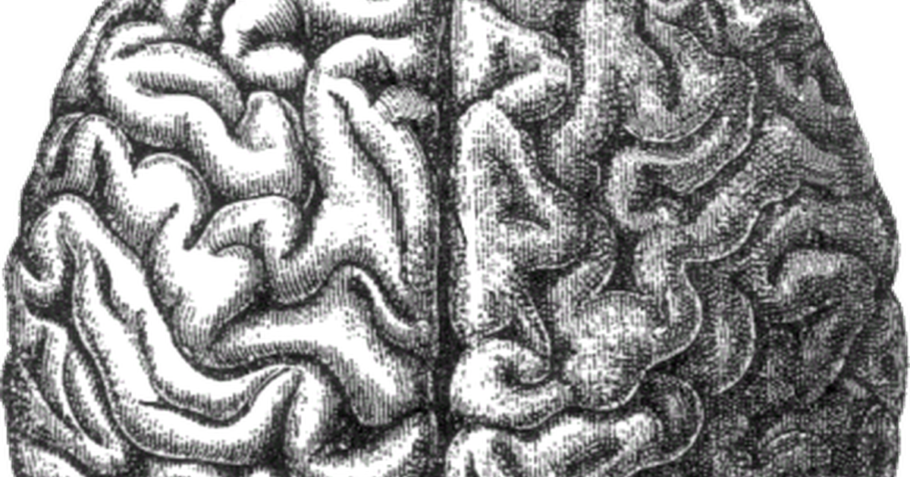

## Nobody is born knowing where they end

Here is something you did this morning without noticing: you knew which parts of the world were you.

Your hand came into view and registered as yours; the door it opened did not. No effort, no deliberation — the boundary was simply there, the way the floor is there. It is the least remarkable fact about being a person, and one of the strangest, because it isn't given. It gets built.

A newborn has hands and no idea they belong to it. Put a smudge on a toddler's forehead and sit them in front of a mirror: before about eighteen months they reach for the reflection, and after it they reach for their own head. Psychologists call that the mirror test, and the switch is the first hard evidence of a line drawn between self and everything else. Before it, no line — and nobody installs one at the factory.

So the line has to be assembled, which turns a mystery into a mechanical question: what process, running on nothing but raw sensation, ends up with a self inside it?

## Perception is a guess that gets corrected

Start from what a brain actually has to work with. Signals arrive with no labels attached, from causes it never gets to see directly — light on a retina, pressure on skin, no annotations. About the only thing you can do with a stream like that is guess what comes next, then find out whether you were right.

So the candidate is prediction. Under *predictive processing* the brain isn't a camera but a thermostat scaled up — at every moment it guesses what its senses will report, checks against what arrives, and updates on the difference.

One loop like that only ever learns the statistics of whatever it is wired to. So stack them, and let each rung take the rung below as its subject: the lowest levels predict raw detail — an edge, a pressure, a pitch — and the levels above predict the errors arriving from beneath, which amounts to learning the regularities of the level under them. That stack is the *hierarchy*. Here is one rung of it, with the one above:

```{mermaid}
%%{init: {'theme':'base', 'themeVariables': {'primaryColor':'#ffffff','primaryBorderColor':'#4A3AA7','primaryTextColor':'#1a1a1a','lineColor':'#4A3AA7','edgeLabelBackground':'#ffffff'}}}%%
flowchart LR
    P[prediction] --> C{compare with<br/>what arrives}
    C -->|error| U[update model]
    U --> P
    U --> H[level above predicts<br/>these errors]
    H --> P
```

Nothing in that machinery is about a self. It is about being less surprised. But run it for years and something starts turning up in every frame it ever sees.

## The self is the term that never leaves

Across a life nearly everything varies: rooms, faces, tasks, the weather. One thing never does — the predictor itself is in every frame, because it is the thing doing the framing. Something that holds still while everything around it changes earns a name of its own, and the name is *invariant*. You are the brain's.

An invariant is only useful if you can pick it out, and infants seem to pick this one out by contingency — by which effects follow reliably from what they do. Move your hand and a sensation follows every time; the mobile across the room does nothing, until a ribbon ties it to your ankle and suddenly it does. I am whatever answers when I act.

The neuroscientist Karl Friston turns that into a definition. His free energy principle casts everything an organism does as one job — keeping surprise low — with perception changing the model to fit the world and action changing the world to fit the model. The self/world boundary then falls exactly where action has reliable control. On that reading the self isn't something found in the data. It's the compression that finally accounts for the term that never leaves.

## The loop must bend back on itself

Compressing that term is easy to say and awkward to arrange, because of where the thing being compressed sits. Every other rung of the hierarchy takes the rung below as its input. A rung that models the predictor has to take its own earlier output as input instead: the model is inside the thing it is modelling. That is recursion, not depth — a loop folded back on itself rather than one more storey on the stack.

It also has to be nonlinear. Feed a linear map its own output over and over and only two things ever happen: everything decays to zero, or everything runs off to infinity. Neither is a stable picture of anything, least of all a self. A fold that keeps producing something has to bend. Nothing about a fold like that, though, promises it can be run in reverse.

## The loop doesn't run backwards

Could you rewind a loop that never stops folding, recovering the state someone was in a year ago?

Rewinding anything requires that no two different starting states ever land on the same result. Otherwise the present has more than one past that could have produced it, and nothing tells you which. A step with that property — distinct inputs always giving distinct outputs — is *injective*, and memory is not.

We compress rather than store. Gist survives, detail goes, and recall reconstructs rather than replays, so countless possible pasts collapse onto the one present you have. It works like a hash: any number of inputs produce the same digest, and the digest tells you nothing about which one did.

That's the feature, not the bug. Discarding detail *is* generalization; keeping only what recurs *is* abstraction. A lossless self-model would be a recording, and recordings don't help with tomorrow.

## This explains the self-model, not the feeling

Everything so far is mechanism for a *self-model*: a system that represents itself, and where it stops. It is not an account of why there is something it is like to be you — why any of this is accompanied by experience at all, rather than running in the dark. That second question is what David Chalmers named the *hard problem*, and it is a different explanatory target. Answering the first and presenting it as the second is how the hard problem usually gets waved past.

None of this is settled science either; it is a synthesis of live hypotheses. The philosopher Andy Clark and the neuroscientist Anil Seth put the self-model's origin in the business of keeping a body alive — regulating temperature, blood chemistry, hunger — rather than in an abstract reasoner that happens to have a body attached. Seth calls the result a "beast machine". Compelling, unproven.

## Nobody finds a self; they keep showing up in the data

So nothing is installed and nothing is discovered. The baby simply keeps turning up in their own data, frame after frame, until the recurring term is worth the cost of modelling — and that model is the line your hand fell on the right side of this morning. It was drawn in pencil, and the loop that drew it threw the erasures away. Which is why the line feels like it was always there.

## Further reading

- Karl Friston on the free energy principle and active inference.
- Andy Clark, *Surfing Uncertainty* — predictive processing, at book length.
- Anil Seth, *Being You* — the embodied "beast machine".
- Infant contingency-detection research and the ribbon-and-mobile experiments.
- Sutton and Barto's agent–environment loop, for computational shape only.
