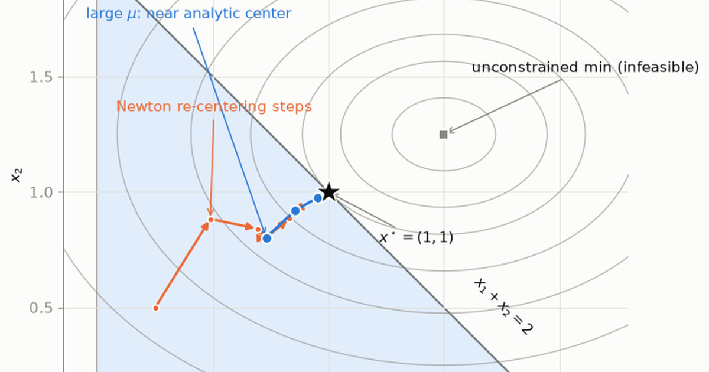

Most numerical algorithms come with asterisks. Gradient descent on a neural network *might* find a good solution. A genetic algorithm *might* escape a bad basin. Convex optimization is the rare corner of computational mathematics where the asterisks disappear: if your problem is convex, a solver will find **the** global optimum, certify it with a mathematical proof of optimality, and do so in polynomial time.

Two things have to be true for that to work, and neither is obvious. The first is geometric: a convex problem has no false bottoms, so an algorithm that can only see its immediate neighborhood is still entitled to make claims about the whole landscape. The second is that the proof comes out of the algorithm as a by-product — the solver knows how far from optimal it is at every step, not only once it stops.

Earning the second one is the harder job, and the obstacle is the constraints. A constraint is a wall: you are on the legal side of it or you are not, and which walls the answer ends up pressed against is a combinatorial question with $2^m$ possible answers. **Interior point methods** — the algorithm family behind most solvers you would actually use — get around that by refusing to ask it. They replace every hard wall with a smooth forcefield, solve the easy problem that results, and then turn the forcefield down until it is indistinguishable from the wall. Everything below is an argument for why that works and a demonstration that it does.

## Convexity is the assumption that makes a local answer a global one

### A local search only ever knows its own neighborhood

An optimization landscape can hide arbitrary cruelty: exponentially many local minima, saddle plateaus, discontinuous cliffs. A local search method — which is essentially all we have in high dimensions — can only ever report "I can't improve from here." For a general nonconvex problem, that statement is nearly worthless: the true optimum may be a mountain range away.

Convexity is precisely the structural assumption that upgrades "I can't improve locally" into "this is the global optimum." The landscape is a single bowl (possibly with flat regions, but never a false bottom), and the feasible region has no disconnected pockets to get trapped in. That single fact is why R. Tyrrell Rockafellar famously wrote:

> "The great watershed in optimization isn't between linearity and nonlinearity, but convexity and nonconvexity."

### A convex set is one you can see across

Two separate objects have to be well behaved before any of that holds: the region you are allowed to search, and the function you are minimizing over it. Take the region first. What it must not do is let you leave and come back — if the straight route between two allowed points passes through forbidden ground, a method that only walks downhill can be walled off from the answer by terrain it is never permitted to cross. Ruling that out is the whole definition.

::: {.callout-note title="Definition: Convex set"}
A set $C \subseteq \mathbb{R}^n$ is **convex** if the line segment between any two of its points stays inside it:

$$
x, y \in C,\ \theta \in [0, 1] \quad \Longrightarrow \quad \theta x + (1-\theta)y \in C.
$$

Intuition: a convex set has no dents, holes, or disconnected pieces. Stand anywhere inside it, look toward any other point of the set — your line of sight never leaves the set.
:::

Nearly everything you would want to write down qualifies. A hyperplane $\{x : a^T x = b\}$ — a flat sheet cutting through the space — is convex, and so is the halfspace $\{x : a^T x \le b\}$ on one side of it, the norm ball $\{x : \lVert x - c \rVert \le r\}$ of all points within distance $r$ of a center, and the probability simplex $\{x : x \succeq 0,\ \mathbf{1}^T x = 1\}$ of all ways to split one unit of something across $n$ options. So, crucially, is **any intersection of convex sets**. That last closure property is why constraint systems work at all: each constraint carves out its own convex region, and the feasible set — the points obeying every constraint at once — stays convex no matter how many you stack.

### A convex function is a bowl with no hump to hide behind

The function needs the mirror image of that property. Draw its graph, pick two points on it, and stretch a straight chord between them. For a convex function the chord never dips below the graph. That is the precise version of "a single bowl": the surface is allowed to be flat in places, but it can never bulge upward into a ridge with a hollow behind it.

::: {.callout-note title="Definition: Convex function"}
A function $f : \mathbb{R}^n \to \mathbb{R}$ with convex domain is **convex** if the chord between any two points on its graph lies on or above the graph:

$$
f\big(\theta x + (1-\theta) y\big) \;\le\; \theta f(x) + (1-\theta) f(y),
\qquad \forall\, x, y \in \operatorname{dom} f,\ \theta \in [0,1].
$$
:::

::: {.callout-tip title="Two equivalent tests you will actually use"}
For differentiable $f$, convexity is equivalent to the **first-order condition**

$$
f(y) \;\ge\; f(x) + \nabla f(x)^T (y - x) \qquad \forall\, x, y,
$$

i.e. *every tangent plane is a global underestimator*. This is the secret engine of the whole theory: local gradient information gives you a **global** lower bound on the function. For twice-differentiable $f$, convexity is equivalent to the matrix of second derivatives — the Hessian — never curving downward in any direction, written $\nabla^2 f(x) \succeq 0$ and read as *positive semidefinite everywhere*.
:::

### Why a local minimum has to be a global one

Those two definitions are all the machinery the central guarantee needs. Convex set, convex function, and the argument below: if you cannot find anywhere better nearby, there is nowhere better at all.

::: {.callout-important title="Theorem — no false bottoms"}
Let $f$ be a convex function and $C$ a convex set. If $x^\star \in C$ is a **local** minimum of $f$ over $C$, then $x^\star$ is a **global** minimum of $f$ over $C$.
:::

**Proof (by contradiction).**

**Step 1 — write down what "local minimum" means.** There exists a radius $\varepsilon > 0$ such that

$$
f(x^\star) \le f(x) \quad \text{for every } x \in C \text{ with } \lVert x - x^\star \rVert \le \varepsilon.
$$

**Step 2 — suppose the theorem is false.** Then there exists some feasible point $y \in C$ that is strictly better:

$$
f(y) < f(x^\star).
$$

**Step 3 — build a path from $x^\star$ toward $y$ that never leaves the feasible set.** For $\theta \in [0,1]$ define

$$
z_\theta = (1-\theta)\, x^\star + \theta\, y.
$$

Because $C$ is a **convex set** and both endpoints are in $C$, every $z_\theta$ is feasible. (This is exactly where set-convexity earns its keep — in a nonconvex feasible set the segment could exit and re-enter, and the argument dies.)

**Step 4 — step only a tiny distance, staying inside the local neighborhood.** Pick

$$
\theta = \min\!\left(1,\ \frac{\varepsilon}{\lVert y - x^\star \rVert}\right) > 0,
\qquad\text{so that}\qquad
\lVert z_\theta - x^\star \rVert = \theta \,\lVert y - x^\star \rVert \le \varepsilon.
$$

So $z_\theta$ lives in the $\varepsilon$-ball where $x^\star$ is supposed to be unbeatable.

**Step 5 — apply function-convexity along the segment.**

$$
f(z_\theta) \;\le\; (1-\theta)\, f(x^\star) + \theta\, f(y)
\;<\; (1-\theta)\, f(x^\star) + \theta\, f(x^\star) \;=\; f(x^\star),
$$

where the strict inequality uses $f(y) < f(x^\star)$ and $\theta > 0$.

**Step 6 — contradiction.** We produced a feasible point $z_\theta$ inside the $\varepsilon$-ball with $f(z_\theta) < f(x^\star)$, contradicting Step 1. Hence no such $y$ exists, and $x^\star$ is globally optimal. $\blacksquare$

The proof is short but the consequence is enormous: **any algorithm that reliably finds local minima is, on convex problems, an algorithm that finds global minima.** Everything else here is engineering built on top of that guarantee — which leaves the question of what a problem has to look like to qualify for it.

## Every convex program fits one standard form {#sec-formulation}

A solver cannot read your intentions; it reads a data structure. So problems get written in a single agreed shape — an objective to minimize, a list of things that must stay below zero, and a list of things that must equal zero — and the convexity requirements attach to the pieces of that shape. Getting a real problem into this form *is* most of the modeling work, and the payoff is that everything proved above transfers to it wholesale:

$$
\begin{aligned}
\min_{x \in \mathbb{R}^n} \quad & f(x) \\
\text{subject to} \quad & g_i(x) \le 0, \quad i = 1, \dots, m \\
& h_j(x) = a_j^T x - b_j = 0, \quad j = 1, \dots, p.
\end{aligned}
$$

Each component carries a specific structural obligation:

| Component | Symbol | Requirement | Geometric role |
|---|---|---|---|
| Objective | $f(x)$ | convex | the bowl we descend |
| Inequality constraints | $g_i(x) \le 0$ | each $g_i$ convex | carve out convex regions (sublevel sets) |
| Equality constraints | $h_j(x) = 0$ | each $h_j$ **affine**: $a_j^T x - b_j$ | restrict to a flat plane |

- **Objective $f$**: convexity guarantees no false bottoms, per the theorem above.
- **Inequalities $g_i(x) \le 0$**: the region where a convex function stays at or below a fixed level — its sublevel set $\{x : g_i(x) \le 0\}$ — is a convex set, and intersecting $m$ of them stays convex.
- **Equalities $h_j(x) = 0$**: each must be *affine*, meaning linear plus a constant. Stacked up they read $Ax = b$ with $A \in \mathbb{R}^{p \times n}$, which describes a flat slice through the space and is convex.

### Why equality constraints *must* be affine

This is the constraint people most often get wrong. An equality $h(x) = 0$ is the intersection of two inequalities:

$$
\{x : h(x) = 0\} \;=\; \{x : h(x) \le 0\} \,\cap\, \{x : -h(x) \le 0\}.
$$

For both pieces to be convex sets via the sublevel-set argument, we need $h$ convex **and** $-h$ convex — i.e. $h$ both convex and concave. The only functions that are both are **affine** functions $h(x) = a^T x - b$.

::: {.callout-warning title="A concrete failure"}
Take the perfectly convex function $h(x) = x_1^2 + x_2^2 - 1$. The *inequality* $h(x) \le 0$ gives the unit disk — convex, fine. But the *equality* $h(x) = 0$ gives the unit **circle**: take the two feasible points $(1, 0)$ and $(-1, 0)$; their midpoint $(0,0)$ is not on the circle. The feasible set is nonconvex, the local-implies-global theorem no longer applies, and every guarantee in this post evaporates. Curved equality constraints silently convert your convex program into a nonconvex one.
:::

## The austere standard form swallows most of engineering {#sec-applications}

Three lines of notation with an affineness rule bolted to one of them does not sound like it should reach very far. It reaches remarkably far. Problems in the standard form are sorted into a handful of named classes by how complicated their objective and constraints are, and the names are worth knowing because solvers advertise themselves by them.

A **linear program** (LP) has a linear objective and linear constraints. A **quadratic program** (QP) upgrades the objective to a convex quadratic — a sum of squares, essentially — while keeping the constraints linear. A **second-order cone program** (SOCP) allows constraints of the form "this vector's length is at most this linear function," which covers most norms and robustness requirements. A **semidefinite program** (SDP) constrains a matrix built from the variables to be positive semidefinite. Each class contains the one before it:

```{mermaid}
flowchart LR
    LP["LP<br/>linear objective,<br/>linear constraints"] --> QP["QP<br/>quadratic objective,<br/>linear constraints"]
    QP --> SOCP["SOCP<br/>second-order<br/>cone constraints"]
    SOCP --> SDP["SDP<br/>semidefinite<br/>matrix constraints"]
    LP -.- LPex["network flows,<br/>resource allocation"]
    QP -.- QPex["Markowitz, SVM,<br/>LASSO, MPC"]
    SDP -.- SDPex["control synthesis,<br/>relaxations"]
```

The nesting is what makes the machinery worth building once: interior point methods solve all four classes with the same core mechanism, so a technique developed for linear programs in the 1980s is what runs inside a semidefinite solver today. Five problems, spread across seventy years and four fields, show how little the shape changes:

| Application | Era | Class | Objective | Binding constraints |
|---|---|---|---|---|
| Markowitz portfolios | 1952 | QP | portfolio variance | target return, budget, no shorting |
| Network flows / LP | 1940s | LP | linear cost | capacity, conservation |
| Support Vector Machines | 1995 | QP | margin + slack penalty | classification margins |
| LASSO / compressed sensing | 1996 | QP | squared error + $\ell_1$ | (in constrained form) sparsity budget |
| Model Predictive Control | 1980s→today | QP/SOCP | tracking cost | dynamics, actuator & state limits |

### Markowitz: portfolio risk is a convex quadratic

Start with the oldest of them. An investor splitting a fixed sum across $n$ assets faces a trade-off nobody can dodge: the combinations with the highest expected return are also the ones that swing hardest. Harry Markowitz's 1952 move was to make "swings hardest" a number — the variance of the portfolio's return, which the assets' covariance matrix determines exactly — and then ask for the least of it subject to a promised return. Choose weights $w \in \mathbb{R}^n$ over assets with expected returns $\mu \in \mathbb{R}^n$ and covariance $\Sigma \succeq 0$:

$$
\begin{aligned}
\min_{w} \quad & w^T \Sigma w && \text{(portfolio variance — convex quadratic since } \Sigma \succeq 0\text{)} \\
\text{s.t.} \quad & \mu^T w \ge r_{\min} && \text{(target return — linear inequality)} \\
& \mathbf{1}^T w = 1 && \text{(fully invested — affine equality)} \\
& w \succeq 0 && \text{(no short selling — linear inequalities)}.
\end{aligned}
$$

The Lagrange multiplier on the return constraint *is* the marginal risk price of demanding one more unit of expected return — a preview of the shadow-price interpretation in @sec-duality.

### Network flow: the LP that made interior point methods famous

The other classical case is even plainer, and it is the one the whole algorithm family was invented on. Anything that moves through a network with limited pipes — goods through depots, power through cables, packets through links — has to satisfy two rules: nothing may exceed a pipe's capacity, and nothing may appear or vanish at a junction. Both are linear, so minimizing cost under them is a linear program. Route flow $x_{uv}$ over the edges of a network with edge costs $c_{uv}$ and capacities $k_{uv}$:

$$
\begin{aligned}
\min_{x} \quad & \sum_{(u,v)} c_{uv}\, x_{uv} \\
\text{s.t.} \quad & \textstyle\sum_{u} x_{uv} - \sum_{w} x_{vw} = d_v \quad \forall v && \text{(flow conservation — affine)} \\
& 0 \le x_{uv} \le k_{uv} && \text{(capacities — linear)}.
\end{aligned}
$$

This LP skeleton underlies supply chains, airline scheduling, electricity dispatch, and ad-budget allocation. It is also where interior point methods made history. Until 1984 large LPs were solved by the simplex method, which walks along the *outside* of the feasible region from corner to corner; Karmarkar's algorithm cut through the interior instead and was the first practical solver with a polynomial-time guarantee, ending simplex's monopoly.

### Support vector machines are a QP whose dual explains their sparsity

The same shape shows up in machine learning half a century later. A classifier that separates two labeled classes with a straight boundary has many boundaries to choose from; the support vector machine picks the one sitting as far as possible from the nearest example of either class, and pays a penalty for each point it has to let sit on the wrong side. Given labeled data $(x_i, y_i)$ with $y_i \in \{-1, +1\}$, that is:

$$
\begin{aligned}
\min_{w, b, \xi} \quad & \tfrac{1}{2}\lVert w \rVert_2^2 + C \sum_{i=1}^N \xi_i \\
\text{s.t.} \quad & y_i\,(w^T x_i + b) \ge 1 - \xi_i, \quad i = 1, \dots, N \\
& \xi_i \ge 0.
\end{aligned}
$$

A convex QP: quadratic objective, linear constraints. Restating it in terms of the constraint prices of @sec-duality is what exposes the kernel trick, and it also shows that only the points actually touching the margin — the *support vectors* — carry a nonzero price. That property, complementary slackness, is derived below; it is literally why a trained SVM can forget most of its training set.

### LASSO relaxes an intractable problem into a convex one

Feature selection asks a harder question than it looks. Choosing which handful of variables to keep is a search over subsets, and doing it exactly is intractable at any realistic size. Penalizing the sum of the coefficients' absolute values instead turns that search into a convex problem, and it drives coefficients to exactly zero rather than merely shrinking them — regression and selection in one fit:

$$
\min_{x} \;\; \tfrac{1}{2} \lVert A x - b \rVert_2^2 + \lambda \lVert x \rVert_1
\qquad\Longleftrightarrow\qquad
\begin{aligned}
\min_{x,\,t} \;\; & \tfrac{1}{2} \lVert A x - b \rVert_2^2 + \lambda\, \mathbf{1}^T t \\
\text{s.t.} \;\; & -t \preceq x \preceq t,
\end{aligned}
$$

where the right-hand form splits each $\lvert x_k \rvert$ into linear inequalities, making it a QP in $(x, t)$. Compressed sensing rests on the same object. Under a technical condition on the measurement matrix — restricted isometry, which says the matrix nearly preserves the lengths of sparse vectors — this convex problem provably returns the answer to the intractable subset-selection problem it was standing in for. Convex relaxation at its most spectacular.

### Model predictive control has to finish before the next tick

The last example is the one with a stopwatch on it. Rather than react to where a vehicle is now, model predictive control plans the next second or two of actuator commands, applies only the first of them, and re-plans from scratch on the next tick. Every 10–100 ms, then, a self-driving car or a drone solves a fresh convex program over a horizon of $T$ steps:

$$
\begin{aligned}
\min_{u_0, \dots, u_{T-1},\, x_1, \dots, x_T} \quad & \sum_{k=0}^{T-1} \big( x_k^T Q x_k + u_k^T R u_k \big) + x_T^T Q_f x_T \\
\text{s.t.} \quad & x_{k+1} = A x_k + B u_k, \quad k = 0, \dots, T-1 && \text{(dynamics — affine equality!)} \\
& u_{\min} \preceq u_k \preceq u_{\max} && \text{(actuator limits)} \\
& F x_k \preceq g && \text{(state/safety constraints)}.
\end{aligned}
$$

Note how the physics enters as **affine equality constraints** — exactly the form @sec-formulation demands — because linear(ized) dynamics $x_{k+1} = Ax_k + Bu_k$ are affine in the decision variables. MPC is arguably the most demanding customer of interior point methods: the solve must finish, with a certified answer, before the next control tick.

Five problems, one shape. What none of them has yet is a way to recognize the answer when a solver hands it over — and that is where the constraints stop being obstacles and start being useful.

## Every constraint has a price, and the prices are the proof {#sec-duality}

### Turning each constraint into a force you can measure

Constraints are usually treated as fences: the solver stays inside them and that is the end of it. The more productive view is that a constraint has a price. Suppose you could relax one — one more unit of budget, one more amp of current — and ask what the objective would improve by. That number says how hard the constraint is pushing back at the optimum, and it turns out to be exactly what a solver needs to prove it has finished.

Making this concrete means writing the constraints into the objective instead of enforcing them separately: charge a per-unit price for violating each one and let the objective absorb the bill. That combination is the **Lagrangian** of the standard problem,

$$
L(x, \lambda, \nu) \;=\; f(x) \;+\; \sum_{i=1}^m \lambda_i\, g_i(x) \;+\; \sum_{j=1}^p \nu_j\, h_j(x),
$$

The prices $\lambda \in \mathbb{R}^m$ and $\nu \in \mathbb{R}^p$ are the *multipliers*, one per constraint. The inequality prices must be non-negative, $\lambda \succeq 0$ — an inequality can only charge you for crossing it, never reward you. The equality prices are sign-free, because an equality can be violated in either direction.

::: {.callout-tip title="Physical intuition: constraint forces and shadow prices"}
Two equivalent mental models:

- **Mechanics.** Think of a ball rolling down the bowl $f$ and coming to rest against a wall $g_i(x) = 0$. At equilibrium the gravity force $-\nabla f$ is exactly balanced by a *normal force* from the wall, pointing inward along $-\nabla g_i$, with magnitude $\lambda_i$. Stationarity, $\nabla f + \sum_i \lambda_i \nabla g_i = 0$, is literally a force-balance equation. Walls the ball isn't touching exert zero force — that will become complementary slackness.
- **Economics.** $\lambda_i$ is the **shadow price** of constraint $i$: if the constraint is relaxed to $g_i(x) \le u_i$, the optimal value $p^\star(u)$ satisfies $\lambda_i^\star = -\partial p^\star / \partial u_i$ (where differentiable). It answers "how much would I pay for one more unit of this resource?" A slack constraint has price zero — you don't pay for what you're not using.
:::

### Any set of prices gives you a lower bound for free

Fix the prices and the constraints have vanished: what is left is an unconstrained function of $x$, and its minimum is some number. That number is a floor under the original problem, because at the true optimum the constraint charges are either zero or in your favor. Minimizing away the freedom you cannot control, and keeping the prices as the thing you can, gives the **dual function**

$$
q(\lambda, \nu) \;=\; \inf_{x} \, L(x, \lambda, \nu).
$$

For each fixed $x$, $L(x, \lambda, \nu)$ is *affine* in $(\lambda, \nu)$; hence $q$, a pointwise infimum of affine functions, is **concave** — always, even if the original problem were nonconvex. The **dual problem** maximizes this lower bound:

$$
\max_{\lambda \succeq 0,\ \nu} \;\; q(\lambda, \nu).
$$

::: {.callout-note title="Weak duality (with proof)"}
For every dual-feasible $(\lambda, \nu)$ with $\lambda \succeq 0$ and every primal-feasible $\tilde{x}$:

$$
q(\lambda, \nu)
= \inf_x L(x, \lambda, \nu)
\le L(\tilde{x}, \lambda, \nu)
= f(\tilde{x}) + \underbrace{\sum_i \lambda_i\, g_i(\tilde{x})}_{\le\, 0} + \underbrace{\sum_j \nu_j\, h_j(\tilde{x})}_{=\, 0}
\le f(\tilde{x}).
$$

The first brace is $\le 0$ because each $\lambda_i \ge 0$ multiplies each $g_i(\tilde{x}) \le 0$; the second vanishes because $\tilde{x}$ satisfies the equalities. Taking the infimum over feasible $\tilde{x}$ gives $d^\star \le p^\star$: **every dual point certifies a lower bound on the primal optimum.** This holds for *any* problem, convex or not.
:::

The difference $p^\star - d^\star \ge 0$ is the **duality gap**. When it closes — $d^\star = p^\star$ — we have **strong duality**, and the dual is not merely a bound but an exact certificate of optimality. Convexity alone doesn't quite guarantee it; a mild regularity condition does:

::: {.callout-note title="Slater's condition"}
For a convex problem, if there exists a **strictly feasible** point $\tilde{x}$ — one with $g_i(\tilde{x}) < 0$ for all non-affine $g_i$ (affine inequalities need only hold non-strictly) and $A\tilde{x} = b$ — then strong duality holds: $d^\star = p^\star$, and the dual optimum is attained.

Plain English: if the feasible region has genuine interior volume (it isn't a degenerate sliver where some inequality is forced to be exactly tight everywhere), primal and dual meet. Nearly every practical problem satisfies this.
:::

This certificate is what a solver means when it reports an answer *with proof*: it returns $x^\star$ and $(\lambda^\star, \nu^\star)$ whose objective values match to tolerance — a checkable, self-contained proof of global optimality. Squeezing that gap to zero also pins down what an optimal point must look like.

### Four conditions replace the optimization problem entirely

The argument is a squeeze. Weak duality strung a chain of inequalities between the dual value and the primal value; strong duality says the two ends of that chain are the same number. An inequality with equal ends has no slack anywhere in the middle, so every step in it collapses to an equality — and each collapsed step turns out to say something concrete about the optimal point.

Assume strong duality holds and both optima are attained. Chain the weak-duality inequalities at the optimum:

$$
f(x^\star) \;=\; q(\lambda^\star, \nu^\star)
\;=\; \inf_x L(x, \lambda^\star, \nu^\star)
\;\overset{(a)}{\le}\; L(x^\star, \lambda^\star, \nu^\star)
\;\overset{(b)}{=}\; f(x^\star) + \sum_i \lambda_i^\star g_i(x^\star)
\;\overset{(c)}{\le}\; f(x^\star).
$$

The chain starts and ends at $f(x^\star)$, so *every* inequality is forced to be an equality:

- $(a)$ tight $\Rightarrow$ $x^\star$ minimizes $L(\cdot, \lambda^\star, \nu^\star)$ over all $x$ $\Rightarrow$ its gradient vanishes there → **stationarity**;
- $(c)$ tight $\Rightarrow$ $\sum_i \lambda_i^\star g_i(x^\star) = 0$; a sum of non-positive terms is zero only if each term is zero → **complementary slackness**.

That derivation *is* the KKT theorem. Collecting the pieces:

::: {.callout-important title="The four Karush–Kuhn–Tucker conditions"}
$x^\star$, $(\lambda^\star, \nu^\star)$ are primal/dual optimal for a convex problem with strong duality **iff**:

**1. Stationarity** — the forces balance:
$$
\nabla f(x^\star) + \sum_{i=1}^m \lambda_i^\star\, \nabla g_i(x^\star) + \sum_{j=1}^p \nu_j^\star\, a_j = 0.
$$
*The objective's downhill pull is exactly canceled by the normal forces of the walls currently being touched.*

**2. Primal feasibility** — the point obeys the rules:
$$
g_i(x^\star) \le 0 \;\; \forall i, \qquad A x^\star = b.
$$

**3. Dual feasibility** — walls can only push, never pull:
$$
\lambda_i^\star \ge 0 \;\; \forall i.
$$
*An inequality constraint is a barrier, not a magnet: its force points into the feasible region or is absent.*

**4. Complementary slackness** — you only pay for what binds:
$$
\lambda_i^\star \, g_i(x^\star) = 0 \;\; \forall i.
$$
*Either the constraint is tight ($g_i = 0$, wall touched, force allowed) or its multiplier is zero ($\lambda_i = 0$, wall irrelevant, zero shadow price). Never both slack and priced.*
:::

For convex problems satisfying Slater's condition, KKT is **necessary and sufficient**: solving the optimization problem is *equivalent* to solving this system of equations and inequalities. That reframing is the pivot to algorithms — and the one genuinely nasty component is condition 4, a *combinatorial* on/off switch per constraint. Interior point methods exist precisely to melt that switch into something smooth.

## Interior point methods melt the switch into a dial {#sec-ipm}

### A hard wall is invisible until you have already hit it

The natural first attempt is to make the constraints part of the objective, charging nothing while you obey them and infinity the moment you do not. That is exactly what the problem says, and it is useless to an algorithm: a function that is flat everywhere it is finite offers no direction to move in, and the only information it ever gives is that you have already gone too far. Written out with the indicator function — equalities, being affine, are easy to carry along, so set them aside for clarity:

$$
\min_x \;\; f(x) + \sum_{i=1}^m I_-\big(g_i(x)\big),
\qquad
I_-(u) =
\begin{cases}
0 & u \le 0, \\
+\infty & u > 0.
\end{cases}
$$

Exact, and computationally hopeless. $I_-$ is discontinuous with zero gradient everywhere it is finite, so a derivative-based method sees a flat plain ending in an invisible cliff.

### Replacing each wall with a forcefield makes the problem smooth

What an algorithm can work with is a wall that announces itself in advance. Instead of charging nothing until the boundary and infinity past it, charge a small amount well inside the feasible region and let the charge grow without limit as the boundary approaches. A point pushed by such a forcefield can never leave: the cost of getting there is already infinite by the time it arrives. The natural function with that shape is the negative logarithm of the distance to the wall,

$$
I_-(u) \;\approx\; -\mu \ln(-u), \qquad \mu > 0,
$$

known as the **logarithmic barrier**, with $\mu$ the dial controlling how far into the region the wall's influence reaches. Adding one per constraint gives the **barrier problem**

$$
\min_x \;\; B_\mu(x) \;=\; f(x) \;-\; \mu \sum_{i=1}^m \ln\big(-g_i(x)\big),
$$

which has no constraints left in it at all. The barrier term is convex (it is a convex, decreasing function $-\ln(\cdot)$ composed with concave $-g_i$), smooth, and finite only in the **strict interior** $\{x : g_i(x) < 0\ \forall i\}$ — an iterate can never leave the feasible region because the objective blows up first. As $\mu \to 0$, the forcefield hugs the walls ever more tightly and $B_\mu \to f + \sum_i I_-(g_i)$ pointwise on the interior.

```{python}
#| label: fig-barrier-1d
#| fig-cap: "The logarithmic barrier $-\\mu \\ln(-u)$ approximating the hard indicator $I_-(u)$. As $\\mu$ shrinks, the smooth forcefield sharpens toward the vertical wall at $u=0$ — gaining fidelity and losing conditioning in the same breath."
import numpy as np
import matplotlib.pyplot as plt

# palette
BLUE, ORANGE, INK = "#2a78d6", "#eb6834", "#0b0b0b"
MUTED, GRID, SURFACE = "#898781", "#e1e0d9", "#fcfcfb"
BLUES = ["#9ec5f4", "#5598e7", "#2a78d6", "#0d366b"]  # ordinal light -> dark

plt.rcParams.update({
    "figure.facecolor": SURFACE, "axes.facecolor": SURFACE,
    "savefig.facecolor": SURFACE,
    "axes.edgecolor": MUTED, "axes.labelcolor": INK,
    "xtick.color": MUTED, "ytick.color": MUTED, "text.color": INK,
    "axes.grid": True, "grid.color": GRID, "grid.linewidth": 0.8,
    "axes.spines.top": False, "axes.spines.right": False,
    "font.size": 11, "axes.titlesize": 12,
})

u = np.linspace(-3.0, -1e-4, 600)
fig, ax = plt.subplots(figsize=(7.5, 4.6))
for mu, c in zip([1.0, 0.5, 0.1, 0.01], BLUES):
    ax.plot(u, -mu * np.log(-u), color=c, lw=2, label=rf"$\mu = {mu}$")
# the hard indicator I_-(u): 0 for u<=0, wall at u=0
ax.plot([-3.0, 0.0], [0.0, 0.0], color=INK, lw=2.2, ls="--")
ax.plot([0.0, 0.0], [0.0, 4.0], color=INK, lw=2.2, ls="--")
ax.annotate(r"hard indicator $I_-(u)$", xy=(0.0, 2.6), xytext=(-1.5, 2.9),
            arrowprops=dict(arrowstyle="->", color=MUTED), color=INK)
ax.set_xlim(-3.0, 0.6); ax.set_ylim(-2.0, 4.0)
ax.set_xlabel(r"constraint value $u = g_i(x)$")
ax.set_ylabel("penalty")
ax.legend(frameon=False, loc="upper left")
ax.set_title("Log barrier vs. hard constraint")
plt.tight_layout()
plt.show()
```

### Turning the dial down traces a curve to the answer

Each setting of the dial is a different problem with a different answer, and the plot above shows why: at $\mu = 1$ the forcefield is felt across the whole region, at $\mu = 0.01$ only in a thin skin near the wall. Solve at one $\mu$ and you get a point sitting well clear of the boundary. Solve at a smaller one and the point moves closer in. Sweep the dial from large to small and those answers trace out a curve.

For each $\mu > 0$, the barrier problem is smooth, strictly convex near its solution, and unconstrained on the interior — so it has a unique minimizer $x^\star(\mu)$. The curve

$$
\{\, x^\star(\mu) : \mu > 0 \,\}
$$

is the **central path**: a smooth trajectory through the strict interior of the feasible region that starts (for large $\mu$) near the *analytic center* — the point maximally distant, in barrier terms, from all walls — and converges to the constrained optimum $x^\star$ as $\mu \to 0$.

The central path is not just a heuristic; it carries exact duality information. Setting the gradient of $B_\mu$ to zero at $x^\star(\mu)$:

$$
\nabla f\big(x^\star(\mu)\big) + \sum_{i=1}^m \underbrace{\frac{\mu}{-g_i\big(x^\star(\mu)\big)}}_{=:\ \lambda_i(\mu)\ >\ 0} \nabla g_i\big(x^\star(\mu)\big) = 0.
$$

Compare with KKT: this is **exactly stationarity**, with a specific positive multiplier estimate $\lambda_i(\mu) = \mu / (-g_i)$ attached to each constraint. Multiply through:

$$
\lambda_i(\mu)\,\big(\!-g_i(x^\star(\mu))\big) = \mu
\qquad\text{vs. KKT's}\qquad
\lambda_i^\star\,\big(\!-g_i(x^\star)\big) = 0.
$$

::: {.callout-note title="The key insight: a homotopy on complementary slackness"}
The central path satisfies the KKT conditions **exactly**, except that complementary slackness $\lambda_i \cdot (-g_i) = 0$ is relaxed to $\lambda_i \cdot (-g_i) = \mu$. The brutal combinatorial switch ("which constraints are active?") becomes a smooth equation with a dial. Interior point methods never *decide* which constraints bind — they turn the dial $\mu \to 0$ and let the active set reveal itself continuously: for binding constraints $-g_i \to 0$ so $\lambda_i(\mu)$ converges to a positive force; for slack constraints $-g_i$ stays bounded away from zero so $\lambda_i(\mu) = \mu/(-g_i) \to 0$.
:::

Better still, the path comes with a built-in **optimality certificate**. Since $x^\star(\mu)$ minimizes the convex Lagrangian $L(\cdot, \lambda(\mu))$ (that is what the stationarity display says), the dual function evaluates exactly there:

$$
q\big(\lambda(\mu)\big) = f\big(x^\star(\mu)\big) + \sum_{i=1}^m \lambda_i(\mu)\, g_i\big(x^\star(\mu)\big)
= f\big(x^\star(\mu)\big) - m\mu.
$$

By weak duality $q(\lambda(\mu)) \le p^\star$, so

$$
f\big(x^\star(\mu)\big) - p^\star \;\le\; m\,\mu.
$$

**On the central path, the duality gap is at most $m\mu$** — the solver knows, at every moment, exactly how suboptimal it is. To certify accuracy $\varepsilon$, drive $\mu$ below $\varepsilon / m$. This is the equation that turns "iterate until it looks converged" into "iterate until *provably* within $\varepsilon$."

### The dial has to be turned down gradually, not all at once

If small $\mu$ means an accurate answer, the obvious move is to set $\mu = 10^{-10}$ and minimize once. It does not work, and the reason is worth understanding, because it dictates the shape of every solver in this family.

::: {.callout-warning title="The barrier is a deliberately ill-conditioned forcefield"}
The barrier's Hessian contains terms $\dfrac{\mu}{g_i(x)^2}\, \nabla g_i \nabla g_i^T$. Near a wall that will be active at the optimum, $-g_i \approx \mu / \lambda_i^\star$, so these terms scale like $\lambda_i^{\star 2}/\mu \to \infty$: the landscape becomes a canyon — astronomically steep across the wall, gently sloped along it. Newton's method handles a canyon *if started near its floor*, but from a distant point the pure barrier problem at tiny $\mu$ is numerically hopeless. The cure is to never solve a hard problem cold. Solve for a moderate $\mu$, shrink $\mu$ a little, and re-solve starting from the previous solution — which, because the path is continuous, is already close to the new one. Deforming an easy problem into a hard one through a family of intermediates is a **homotopy**, and starting each solve from the last answer is a **warm start**.
:::

Nesting the two moves — shrink the dial, then re-solve — gives the architecture every barrier solver has. The outer loop owns $\mu$ and the accuracy guarantee; the inner loop owns the actual arithmetic and knows nothing about the dial except its current value:

```{mermaid}
flowchart TB
    S["strictly feasible x0, barrier weight mu0, factor sigma in (0,1)"] --> C{"duality gap m*mu &le; epsilon ?"}
    C -- yes --> D["return x  (certified epsilon-optimal)"]
    C -- no --> N1["INNER LOOP: Newton re-centering on B_mu"]
    subgraph inner ["inner loop &mdash; Newton's method at fixed mu"]
        N1 --> N2["solve  Hessian(B_mu) dx = -grad(B_mu)"]
        N2 --> N3["backtracking line search: stay strictly interior + sufficient decrease"]
        N3 --> N4{"Newton decrement small?"}
        N4 -- no --> N2
    end
    N4 -- yes --> O["OUTER LOOP: mu &larr; sigma &middot; mu  (tighten the forcefield)"]
    O --> C
```

- **Outer loop** — reduce $\mu \leftarrow \sigma \mu$ (typically $\sigma \in [0.1, 0.5]$, or even $\mu/10$). Each reduction shrinks the certified duality gap by the same factor, so the gap decays *geometrically*: $\mathcal{O}(\log(1/\varepsilon))$ outer iterations.
- **Inner loop** — at fixed $\mu$, run **Newton's method** to re-center on the path: fit a quadratic to the barrier objective at the current point using its first and second derivatives, jump to that quadratic's minimum, repeat. Each step solves the linear system

$$
\nabla^2 B_\mu(x)\, \Delta x = -\nabla B_\mu(x),
\qquad
\begin{aligned}
\nabla B_\mu &= \nabla f + \sum_i \frac{\mu}{-g_i} \nabla g_i, \\
\nabla^2 B_\mu &= \nabla^2 f + \sum_i \frac{\mu}{g_i^2} \nabla g_i \nabla g_i^T + \sum_i \frac{\mu}{-g_i} \nabla^2 g_i,
\end{aligned}
$$

followed by a backtracking line search that (i) rejects any step leaving the strict interior and (ii) enforces sufficient decrease. With equality constraints $Ax = b$ present, the Newton step instead solves the saddle-point **KKT system**

$$
\begin{bmatrix} \nabla^2 B_\mu(x) & A^T \\ A & 0 \end{bmatrix}
\begin{bmatrix} \Delta x \\ \nu \end{bmatrix}
=
\begin{bmatrix} -\nabla B_\mu(x) \\ 0 \end{bmatrix},
$$

which keeps every iterate on the affine subspace while minimizing the barrier over it — the same linear algebra, one block bigger.

::: {.callout-tip title="Why this is provably fast"}
The reason the inner loop needs only a handful of Newton steps — regardless of how nonlinear the constraints are — is **self-concordance** (Nesterov & Nemirovski, 1994): the log barrier's third derivative is controlled by its second, which makes Newton's method's convergence analysis *affine-invariant and constant-free*. The headline result: following the central path to $\varepsilon$-accuracy needs $\mathcal{O}\!\big(\sqrt{m}\, \log(1/\varepsilon)\big)$ Newton steps in total. In practice it's even better — production solvers (which use a *primal–dual* variant with Mehrotra's predictor–corrector, treating $\lambda$ as an independent variable rather than the estimate $\mu/(-g_i)$) routinely finish in 10–50 Newton iterations almost independent of problem size. Each iteration is one linear solve — which is why sparse linear algebra, not iteration count, dominates solver engineering.
:::

### Watching the path on a problem you can solve by hand

All of that is a claim about what happens between iterations, and claims like that are best checked against a case where the right answer is already known. So the example below is invented rather than measured: two variables, a quadratic objective, and three linear inequalities that fence off a triangle. Two variables because the central path is a curve and this is the only dimension in which you can actually look at it; invented because the KKT conditions solve this instance exactly in three lines of algebra, which turns "the solver converged" into a statement that can be checked digit by digit.

The shape stands in for the smallest interesting real problem: an ideal operating point you would like to sit at, two quantities that cannot go negative, and a shared budget they must sum under — with the ideal point placed deliberately outside the budget, so the constraint has to bite. Take a 2D quadratic objective with three linear inequality constraints:

$$
\begin{aligned}
\min_{x \in \mathbb{R}^2} \quad & f(x) = (x_1 - 1.5)^2 + 2\,(x_2 - 1.25)^2 \\
\text{s.t.} \quad & g_1(x) = -x_1 \le 0, \qquad g_2(x) = -x_2 \le 0, \qquad g_3(x) = x_1 + x_2 - 2 \le 0.
\end{aligned}
$$

The unconstrained minimum $(1.5, 1.25)$ violates $g_3$ (its coordinates sum to $2.75 > 2$), so the optimum must press against the wall $x_1 + x_2 = 2$. Solving stationarity with only $g_3$ active gives, by hand:

$$
2(x_1 - 1.5) + \lambda_3 = 0, \quad 4(x_2 - 1.25) + \lambda_3 = 0, \quad x_1 + x_2 = 2
\;\;\Longrightarrow\;\;
x^\star = (1, 1), \;\; \lambda^\star = (0, 0, 1).
$$

That is the target to check against: the solver should converge to $(1,1)$, with a shadow price of exactly $1$ on the budget wall it presses against and $0$ on the two positivity walls it never touches. The implementation below is complete — outer loop, inner Newton loop, line search — in about fifty lines:

```{python}
#| label: barrier-solver
#| code-fold: show
def f(x):        # objective
    return (x[0] - 1.5)**2 + 2.0 * (x[1] - 1.25)**2

def g(x):        # constraint values, g_i(x) <= 0
    return np.array([-x[0], -x[1], x[0] + x[1] - 2.0])

G = np.array([[-1.0, 0.0], [0.0, -1.0], [1.0, 1.0]])   # rows: grad g_i (affine)

def B(x, mu):    # barrier objective (inf if not strictly interior)
    gx = g(x)
    if np.any(gx >= 0):
        return np.inf
    return f(x) - mu * np.sum(np.log(-gx))

def grad_hess(x, mu):
    gx = g(x)
    grad_f = np.array([2.0 * (x[0] - 1.5), 4.0 * (x[1] - 1.25)])
    hess_f = np.diag([2.0, 4.0])
    lam = mu / (-gx)                                   # dual estimates mu/(-g_i)
    grad = grad_f + G.T @ lam
    hess = hess_f + G.T @ np.diag(mu / gx**2) @ G
    return grad, hess

def newton_recenter(x, mu, tol=1e-10, max_iter=50):
    """Inner loop: Newton's method on B_mu from x. Returns minimizer + iterates."""
    path = [x.copy()]
    for _ in range(max_iter):
        grad, hess = grad_hess(x, mu)
        dx = np.linalg.solve(hess, -grad)              # Newton system H dx = -g
        decrement2 = -grad @ dx                        # lambda(x)^2 = dx^T H dx
        if decrement2 / 2.0 < tol:
            break
        t = 1.0                                        # backtracking line search
        while B(x + t * dx, mu) > B(x, mu) - 0.25 * t * decrement2:
            t *= 0.5                                   # also rejects infeasible steps
        x = x + t * dx
        path.append(x.copy())
    return x, np.array(path)

def barrier_method(x0, mu0=2.0, sigma=0.2, eps=1e-8):
    """Outer loop: shrink mu until the certified gap m*mu is below eps."""
    x, mu, m = x0.copy(), mu0, len(g(x0))
    stages = []                                        # (mu, central point, inner path)
    while m * mu >= eps:
        x, inner = newton_recenter(x, mu)
        stages.append((mu, x.copy(), inner))
        mu *= sigma
    return x, stages

x_opt, stages = barrier_method(x0=np.array([0.25, 0.50]))
print(f"solution: x = ({x_opt[0]:.8f}, {x_opt[1]:.8f})   [analytic: (1, 1)]")
```

Every piece of the theory above appears in the numbers. The table below tracks the outer loop: the central-path point $x^\star(\mu)$, the dual estimates $\lambda_i(\mu) = \mu / (-g_i)$, and the certified duality gap $m\mu$:

```{python}
#| label: convergence-table
print(f"{'mu':>10} | {'x1(mu)':>9} {'x2(mu)':>9} | "
      f"{'lam1':>8} {'lam2':>8} {'lam3':>8} | {'gap <= m*mu':>11}")
print("-" * 78)
for mu, xc, _ in stages:
    lam = mu / (-g(xc))
    print(f"{mu:10.2e} | {xc[0]:9.6f} {xc[1]:9.6f} | "
          f"{lam[0]:8.5f} {lam[1]:8.5f} {lam[2]:8.5f} | {3*mu:11.2e}")
```

Read the price columns against the KKT conditions. The two positivity walls end up slack, and their prices $\lambda_1, \lambda_2$ go to zero — you are not charged for a wall you never touch. The budget wall binds, and $\lambda_3$ converges to $1$, the force the hand calculation predicted. Every row, meanwhile, satisfies the relaxed complementary slackness $\lambda_i \cdot (-g_i) = \mu$ by construction; the solver never had to guess which of the three would bind. Now the picture — the feasible triangle, the objective's contours, the central path gliding through the interior, and the orange Newton steps of the first re-centerings:

```{python}
#| label: fig-central-path
#| fig-cap: "The central path (blue) for the 2D barrier problem. Each blue dot is $x^\\star(\\mu)$ for one outer iteration; orange arrows are the inner-loop Newton steps for the first two values of $\\mu$. The path bends smoothly through the interior and converges to $x^\\star = (1,1)$ on the wall $x_1 + x_2 = 2$."
fig, ax = plt.subplots(figsize=(7.5, 7.0))

# objective contours (recessive gray)
xx, yy = np.meshgrid(np.linspace(-0.15, 2.3, 400), np.linspace(-0.15, 2.3, 400))
zz = (xx - 1.5)**2 + 2.0 * (yy - 1.25)**2
ax.contour(xx, yy, zz, levels=[0.05, 0.2, 0.375, 0.7, 1.2, 2.0, 3.2, 5.0],
           colors=MUTED, linewidths=0.9, alpha=0.6)

# feasible triangle
tri = plt.Polygon([(0, 0), (2, 0), (0, 2)], closed=True,
                  facecolor="#cde2fb", alpha=0.55, edgecolor=INK, lw=1.4)
ax.add_patch(tri)

# inner-loop Newton steps for the first two outer stages (orange arrows)
for mu, _, inner in stages[:2]:
    for a, b in zip(inner[:-1], inner[1:]):
        ax.annotate("", xy=b, xytext=a,
                    arrowprops=dict(arrowstyle="-|>", color=ORANGE,
                                    lw=1.8, shrinkA=2, shrinkB=2))
    ax.plot(inner[:, 0], inner[:, 1], "o", color=ORANGE, ms=5,
            mec=SURFACE, mew=1.2, zorder=4)

# central path: one point per outer iteration
central = np.array([xc for _, xc, _ in stages])
ax.plot(central[:, 0], central[:, 1], "-", color=BLUE, lw=2, zorder=5)
ax.plot(central[:, 0], central[:, 1], "o", color=BLUE, ms=8,
        mec=SURFACE, mew=1.5, zorder=6)

# landmarks
ax.plot(1.5, 1.25, "s", color=MUTED, ms=8, mec=SURFACE, mew=1.5, zorder=6)
ax.plot(1.0, 1.0, "*", color=INK, ms=20, mec=SURFACE, mew=1.0, zorder=7)
ax.annotate(r"unconstrained min (infeasible)", xy=(1.5, 1.25), xytext=(1.62, 1.52),
            color=INK, arrowprops=dict(arrowstyle="->", color=MUTED))
ax.annotate(r"$x^\star = (1,1)$", xy=(1.0, 1.0), xytext=(1.22, 0.78),
            color=INK, arrowprops=dict(arrowstyle="->", color=MUTED))
ax.annotate(r"large $\mu$: near analytic center", xy=central[0], xytext=(-0.05, 1.75),
            color=BLUE, arrowprops=dict(arrowstyle="->", color=BLUE))
ax.annotate(r"$x_1 + x_2 = 2$", xy=(1.62, 0.38), rotation=-45, color=INK)
ax.annotate("Newton re-centering steps", xy=tuple(stages[0][2][1]),
            xytext=(0.08, 1.35), color=ORANGE,
            arrowprops=dict(arrowstyle="->", color=ORANGE))

ax.set_xlim(-0.15, 2.3); ax.set_ylim(-0.15, 2.3)
ax.set_aspect("equal")
ax.set_xlabel(r"$x_1$"); ax.set_ylabel(r"$x_2$")
ax.set_title(r"Central path $x^\star(\mu)$ as $\mu \to 0$")
plt.tight_layout()
plt.show()
```

The geometry tells the whole story. For large $\mu$ the barrier dominates and the minimizer sits near the triangle's analytic center, pushed away from all three walls. As the outer loop turns the dial down, the objective takes over and the path bends toward the unconstrained minimum — until the capacity wall's forcefield stops it, and the path slides *along* the incipient active constraint into $x^\star = (1,1)$. Finally, the certificate in action — the duality gap bound $m\mu$ and the true errors, per outer iteration:

```{python}
#| label: fig-gap-convergence
#| fig-cap: "Geometric (linear-on-log-scale) convergence of the outer loop: each reduction of $\\mu$ shrinks the certified gap $m\\mu$ by the same factor $\\sigma$. The true suboptimality $f(x^\\star(\\mu)) - p^\\star$ tracks the certificate from below, exactly as the bound promises."
p_star = 0.375                                # f(1,1), analytic optimum
mus = np.array([mu for mu, _, _ in stages])
subopt = np.array([f(xc) - p_star for _, xc, _ in stages])
dist = np.array([np.linalg.norm(xc - np.array([1.0, 1.0])) for _, xc, _ in stages])

fig, ax = plt.subplots(figsize=(7.5, 4.4))
it = np.arange(1, len(mus) + 1)
ax.semilogy(it, 3 * mus, "o-", color=BLUE, lw=2, ms=7, mec=SURFACE, mew=1.2,
            label=r"certified gap bound $m\mu$")
ax.semilogy(it, np.maximum(subopt, 1e-16), "o-", color=ORANGE, lw=2, ms=7,
            mec=SURFACE, mew=1.2, label=r"true gap $f(x^\star(\mu)) - p^\star$")
ax.semilogy(it, dist, "o--", color=MUTED, lw=1.6, ms=6, mec=SURFACE, mew=1.2,
            label=r"distance $\| x^\star(\mu) - x^\star \|$")
ax.set_xlabel("outer iteration")
ax.set_ylabel("error (log scale)")
ax.set_title("The optimality certificate at work")
ax.legend(frameon=False, loc="upper right")
plt.tight_layout()
plt.show()
```

Straight lines on a log scale mean geometric convergence, and the certified bound $m\mu$ sits above the true suboptimality at every iteration, exactly as weak duality promised it would. The point is not the speed. It is that the solver could have been stopped at any iteration and would still have reported an honest worst case for the answer it had — which is what separates this from a method that merely stops improving.

That guarantee has a price, and it is worth knowing when not to pay it.

## Interior point is the right default, not the only tool

Certified accuracy is not free. Every Newton step costs a full linear solve, and a solver that has just finished is oddly bad at restarting on a nearly identical problem, because the answer it is holding sits jammed against the walls — the worst possible starting point for a fresh barrier solve at large $\mu$. The two main alternatives make the opposite trades. Boundary methods — the simplex method and its active-set cousins — do the thing interior point refuses to do and reason directly about which constraints are tight, which makes them superb at re-solving a problem they have seen before. First-order methods such as ADMM and proximal gradient give up the linear solve entirely and take many cheap steps instead of a few expensive ones, trading digits of accuracy for scale.

::: {.callout-important title="Interior point vs. the alternatives"}
| | **Interior point** | **Simplex / active set** | **First-order (ADMM, prox-grad)** |
|---|---|---|---|
| Strategy | glide through the interior along the central path | walk the boundary, vertex to vertex / swap active constraints | cheap gradient-like steps |
| Iterations | ~10–50, nearly size-independent | can be exponential (worst case); great in practice on LPs | thousands, but each is trivial |
| Cost per iteration | one linear solve (Newton KKT system) | one basis update (cheap) | matrix–vector products |
| Complexity | polynomial: $\mathcal{O}(\sqrt{m}\log(1/\varepsilon))$ Newton steps | exponential worst case | dimension-free but $\mathcal{O}(1/\varepsilon)$-ish accuracy |
| Warm starts | weak — the path restarts | excellent — ideal for re-solving similar problems | good |
| Accuracy | high (8+ digits, with certificate) | exact (vertex solutions) | low–moderate (2–4 digits) |
| Sweet spot | medium–large smooth problems, cones (LP/QP/SOCP/SDP) | LPs, small QPs, sequences of related problems | huge-scale ML problems where 3 digits suffice |

Rule of thumb: interior point when you need *certified* accuracy on problems up to millions of variables with sparse structure; simplex/active-set when re-solving many nearby LPs; first-order methods when the problem is enormous and modest accuracy is fine.
:::

## Most of the work is recognizing the problem in the first place

Choosing among those columns only matters once the problem is in the standard form, and that is where the real difficulty sits. Nothing arrives labeled as a convex program. The skill is spotting that a cost function is built from pieces that are already convex, or that a nonlinear balance equation can be relaxed into an inequality, or that a discrete choice has a standard relaxation waiting for it.

::: {.callout-tip title="Cheat sheet: framing an engineering problem as convex optimization"}
**Recognize it.** Ask, in order:

1. **Decision variables** — what vector $x$ do I control?
2. **Objective** — is my cost built from convex atoms? (norms $\lVert \cdot \rVert$, max, log-sum-exp, quadratics $x^TQx$ with $Q \succeq 0$, negative log of concave) combined by convexity-preserving rules (nonnegative sums, pointwise max, composition with affine maps)?
3. **Inequalities** — can each be written $g_i(x) \le 0$ with $g_i$ convex?
4. **Equalities** — are they all *affine*? If a physics/balance equation is nonlinear, can it be linearized, relaxed to an inequality, or is the problem genuinely nonconvex?
5. **Hidden nonconvexity** — integer variables, products of decision variables, ratios, "either/or" logic? Then look for the standard convex relaxation ($\ell_1$ for sparsity, SDP lifting for quadratics) before reaching for heuristics.

**Then trust the guarantees.** If all checks pass: any local optimum is global, KKT certifies it, strong duality gives you shadow prices for free, and an interior point solver will deliver a certified answer in polynomial time. Prototype with a modeling layer (`cvxpy` — it verifies convexity by construction and dispatches to IPM solvers like Clarabel, ECOS, MOSEK); deploy with a structure-exploiting solver (OSQP for embedded MPC, LIBLINEAR-style duals for SVMs).

**The one-line summary.** Convexity buys the guarantee, duality prices the constraints, the log barrier melts the combinatorics of complementary slackness into a smooth dial, and Newton's method turns the dial to zero — that is the whole machine.
:::

## The asterisks really are gone

The claim at the top was that convex optimization is where the asterisks disappear, and every piece of that is now on the table. Convexity is what makes a local answer global, so an algorithm that can only see its own neighborhood is entitled to speak for the whole landscape. Duality is what makes the answer checkable, because any set of constraint prices hands you a floor and the right prices make the floor meet the ceiling. And the log barrier is what makes the combinatorial part go away, by never asking which constraints are active and letting the dial reveal them instead.

That last move is the one to keep. The genuinely hard part of a constrained problem is not the geometry but the on-off switch buried in complementary slackness, and interior point methods do not solve it — they refuse to pose it, replacing an exponential question with a continuous one and taking a certified answer out the other side. Where the trick stops holding is written into the same conditions: curve an equality constraint, or introduce a variable that must be an integer, and the feasible set stops being convex, the local-implies-global theorem lapses, and every guarantee here goes with it.

## Further reading

- Boyd & Vandenberghe, [*Convex Optimization*](https://web.stanford.edu/~boyd/cvxbook/) — the canonical text; Chapter 11 covers barrier methods in full.
- Nesterov & Nemirovski, *Interior-Point Polynomial Algorithms in Convex Programming* — the self-concordance theory behind the $\mathcal{O}(\sqrt{m})$ bound.
- Wright, *Primal-Dual Interior-Point Methods* — the algorithms production LP/QP solvers actually implement.
