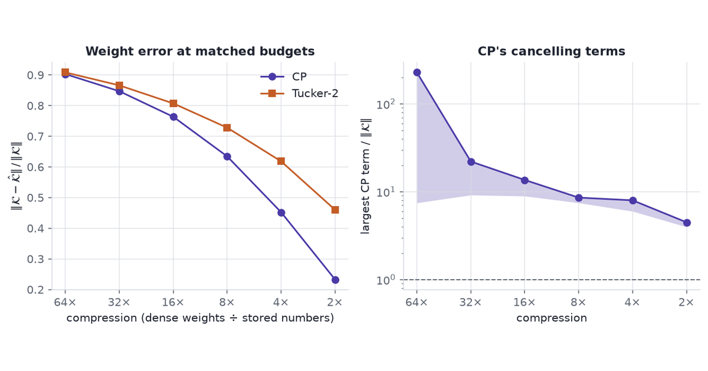

{fig-alt="Relative reconstruction error of a ResNet-18 conv kernel against compression ratio for CP and Tucker-2, beside the size of CP's largest component relative to the kernel."}

CP and Tucker differ in one object, the core tensor, and the right core depends on
whether the factorization has to predict entries nobody observed or store a known
tensor in fewer numbers.

A knowledge-graph embedding and a compressed convolution layer are both tensor
factorizations, and both literatures offer the same two families. The jobs pull
apart. A knowledge-graph model has to score facts nobody recorded, and has to score
(Paris, capital of, France) high while scoring (France, capital of, Paris) low. A
compressed layer has to reproduce a kernel it has already seen, in fewer numbers,
without making the network unstable to fine-tune. The first job asks what a core can
express. The second asks what it costs.

[CP or Tucker](../cp-or-tucker/) derives both models: CP's uniqueness, Tucker's
rotational freedom, and their storage counts. Here they meet two real tensors — the
FB15k-237 knowledge graph and a trained ResNet-18 kernel — then the question both
leave open, which rank to fit, and then a photograph that can be asked either job. HOSVD appears as a way to fit Tucker and read off its
ranks, not as a third model.

```{python}
#| label: setup
#| echo: false
import json
import sys
from pathlib import Path

import matplotlib.pyplot as plt
import numpy as np
import pandas as pd
import tensorly as tl
import torch
import torch.nn as nn
import torch.nn.functional as F
from IPython.display import Markdown
from tensorly.decomposition import parafac, partial_tucker

INK = "#1F2430"
ACCENT = "#4A3AA7"
TEAL = "#2A9D8F"
CORAL = "#C45C26"
MUTED = "#5F6672"
RULE = "#D8DBE2"

plt.rcParams.update(
    {
        "figure.facecolor": "white",
        "axes.facecolor": "white",
        "axes.edgecolor": RULE,
        "axes.linewidth": 0.8,
        "axes.labelcolor": INK,
        "text.color": INK,
        "xtick.color": MUTED,
        "ytick.color": MUTED,
        "font.size": 10,
        "axes.titlesize": 11,
        "axes.titleweight": "bold",
        "axes.grid": True,
        "grid.color": RULE,
        "grid.alpha": 0.7,
        "axes.spines.top": False,
        "axes.spines.right": False,
    }
)

DATA = Path("data")
sys.path.insert(0, "src")


def md_table(df):
    """A pandas frame as a Markdown table, without the tabulate dependency."""
    head = "| " + " | ".join(df.columns) + " |"
    rule = "|" + "|".join("---" for _ in df.columns) + "|"
    rows = ["| " + " | ".join(str(v) for v in row) + " |" for row in df.itertuples(index=False)]
    return Markdown("\n".join([head, rule, *rows]))


def millions(n):
    return f"{n / 1e6:.1f}M"
```

## Notation

For an $N$-way tensor $\mathcal{X}\in\mathbb{R}^{I_1\times\cdots\times I_N}$:

- **CP at rank $R$.** A sum of $R$ rank-one terms, one column per mode per term:

  $$
  \mathcal{X}\approx\sum_{r=1}^{R} a^{(1)}_r\circ a^{(2)}_r\circ\cdots\circ a^{(N)}_r .
  $$

- **Tucker at multilinear rank $(R_1,\dots,R_N)$.** A core $\mathcal{G}$ multiplied
  by one factor matrix per mode:

  $$
  \mathcal{X}\approx\mathcal{G}\times_1 U^{(1)}\times_2 U^{(2)}\cdots\times_N U^{(N)},
  \qquad \mathcal{G}\in\mathbb{R}^{R_1\times\cdots\times R_N}.
  $$

- **CP is Tucker with a superdiagonal core.** Set every $R_n=R$ and zero every entry
  of $\mathcal{G}$ except $\mathcal{G}_{r r\cdots r}$. Component $r$ of mode 1 then
  meets only component $r$ of the other modes. A dense core lets any component of one
  mode meet any component of another.
- **Parameter counts.** CP stores $R\sum_n I_n$ numbers. Tucker stores
  $\prod_n R_n+\sum_n I_nR_n$, and the core product is what grows fastest.
- **HOSVD.** Take the SVD of each mode-$n$ unfolding $\mathcal{X}_{(n)}$, keep $R_n$
  left singular vectors as $U^{(n)}$, and set
  $\mathcal{G}=\mathcal{X}\times_1 U^{(1)\top}\cdots\times_N U^{(N)\top}$. HOOI
  iterates from there; `tensorly`'s `tucker(init="svd")` is HOSVD followed by HOOI.

## Knowledge-graph completion

### Tensor

```{python}
#| label: kg-data
kg = json.loads((DATA / "fb15k237_manifest.json").read_text())
rel = pd.read_csv(DATA / "fb15k237_relations.csv")

n_ent, n_rel = kg["entities"], kg["relations"]
n_train = kg["triples"]["train"]
cells = n_ent * n_rel * n_ent
density = n_train / cells

never = rel.reversed_fraction == 0
mostly = rel.reversed_fraction >= 0.5
pairs = rel.train_pairs.sum()
share_never = rel.train_pairs[never].sum() / pairs
share_mostly = rel.train_pairs[mostly].sum() / pairs
share_reversed = (rel.train_pairs * rel.reversed_fraction).sum() / pairs
n_between = int(((rel.reversed_fraction > 0.1) & (rel.reversed_fraction < 0.5)).sum())
assert n_between == 1  # the prose says "1 relation falls"

# Exposure: a pair whose object is also a subject of the relation, or whose
# subject is also an object. Only then can a symmetric score put a reversed pair
# ahead of a true answer in a ranking query.
nv = rel[never]
one_role = nv.two_role_fraction == 0
n_one_role = int(one_role.sum())
exposed_never = (nv.train_pairs * nv.two_role_fraction).sum() / nv.train_pairs.sum()
contains = rel.set_index("relation").loc["/location/location/contains"]
```

FB15k-237 is the standard benchmark for this job.

- **Provenance.** Bordes et al. (2013) cut FB15k out of Freebase, the
  crowd-edited knowledge base Google bought and later shut down. Toutanova and
  Chen (2015) removed near-duplicate and inverse relations from it, because many
  FB15k test triples could be answered by flipping a training triple. The copy read here is the
  one distributed with TuckER; `src/fetch_fb15k237.py` downloads it, counts it, and
  keeps only per-relation counts.
- **Shape.** Subject × relation × object: a binary tensor $\mathcal{Y}$ of shape
  `{python} f"{n_ent:,}"` × `{python} n_rel` × `{python} f"{n_ent:,}"`, with a 1 for
  every recorded fact.
- **Size.** `{python} f"{cells:,}"` cells, `{python} f"{n_train:,}"` of them ones in
  training: a density of `{python} f"{density:.1e}"`. At $10^5$ entities and $10^3$
  relations the count would be $10^{13}$ cells.
- **What a wrong answer costs.** A model that cannot tell a fact from its reversal
  ranks (Paris, contains, France) as high as (France, contains, Paris), and every
  downstream query inherits the error.

The question to ask of the data is how often a relation's reversal is also a fact.

- `{python} int(never.sum())` of the `{python} n_rel` relations — carrying
  `{python} f"{share_never:.0%}"` of the training triples — never contain a reversed
  pair $(o,s)$ alongside $(s,o)$.
- `{python} int(mostly.sum())` relations have reversals for at least half their
  pairs. They are the symmetric ones: siblings, cast members of the same season,
  combatants in the same war.
- Only `{python} n_between` relation falls between 10% and 50%. A relation is either
  directional or symmetric, almost never partly both.
- Over the training set, `{python} f"{share_reversed:.1%}"` of triples have their
  reversal recorded.

```{python}
#| label: fig-reversal
#| fig-cap: "Per-relation fraction of FB15k-237 training pairs $(s,o)$ whose reversal $(o,s)$ is also a training triple, weighted by how many triples the relation carries."
#| fig-alt: "Histogram of the reversed fraction for FB15k-237 relations, weighted by triples. About 85% of the weight sits in the bar at zero and about 15% in one bar near 0.8, with nothing between."
#| fig-height: 3.2
fig, ax = plt.subplots()
ax.hist(
    rel.reversed_fraction,
    bins=np.linspace(0, 1, 21),
    weights=rel.train_pairs / pairs,
    color=ACCENT,
    edgecolor="white",
)
ax.set_xlabel("fraction of a relation's pairs whose reversal is also recorded")
ax.set_ylabel("share of training triples")
ax.yaxis.set_major_formatter(plt.FuncFormatter(lambda v, _: f"{v:.0%}"))
plt.tight_layout()
plt.show()
```

### Scoring functions as cores

Every model in this family scores a triple $(s,r,o)$ as a multilinear form in three
embeddings, $e_s$, $w_r$ and $e_o$. The core decides which coordinates may meet.

- **DistMult** (Yang et al. 2015): superdiagonal core, one entity matrix for both
  subject and object.

  $$
  \phi(s,r,o)=\sum_k e_{s,k}\,w_{r,k}\,e_{o,k}=\phi(o,r,s).
  $$

  The sum is unchanged when $s$ and $o$ swap, for every relation. On FB15k-237 that
  gives every fact in the `{python} int(never.sum())` never-reversed relations the
  same score as its reversal. The score only costs a ranking when an entity plays
  both roles in one relation, though, since only then does a reversed pair compete
  with a true answer. In `{python} n_one_role` of those `{python} int(never.sum())`
  relations no entity does, and across all of them `{python} f"{exposed_never:.1%}"`
  of pairs are exposed. Hierarchies are where it bites: a city contains districts and
  is contained by a country. `/location/location/contains` is never reversed, and
  `{python} f"{contains.two_role_fraction:.0%}"` of its
  `{python} f"{int(contains.train_pairs):,}"` pairs are exposed.
- **CP with untied entities**: superdiagonal core, separate subject matrix $A$ and
  object matrix $C$.

  $$
  \phi(s,r,o)=\sum_k a_{s,k}\,w_{r,k}\,c_{o,k}.
  $$

  This is asymmetric. Its weakness is different: $a_s$ and $c_s$ share nothing, so
  what the model learns about Paris as a subject says nothing about Paris as an
  object. Lacroix et al. (2018) fix that by also training on the reciprocal triple
  $(o,r^{-1},s)$, which puts every entity in both roles.
- **ComplEx** (Trouillon et al. 2016): superdiagonal core over complex embeddings,
  tied entities, $\phi=\operatorname{Re}\sum_k e_{s,k}w_{r,k}\bar e_{o,k}$. The
  conjugate breaks the symmetry.
- **RESCAL** (Nickel et al. 2011): one full $d_e\times d_e$ matrix $M_r$ per relation,
  $\phi=e_s^\top M_re_o$. That is Tucker-2: entity modes compressed, relation mode
  left at full length, core $=$ the stack of $M_r$.
- **TuckER** (Balažević et al. 2019): a dense core
  $\mathcal{G}\in\mathbb{R}^{d_e\times d_r\times d_e}$ shared by every relation,
  and tied entities.

  $$
  \phi(s,r,o)=\mathcal{G}\times_1 e_s\times_2 w_r\times_3 e_o .
  $$

  Each relation's matrix $M_r=\mathcal{G}\times_2 w_r$ is a mix of $d_r$ shared slices.
  Tied entities keep one vector per entity, as in DistMult. The asymmetry comes from
  the core: nothing forces a slice of $\mathcal{G}$ to be a symmetric matrix.

TuckER's paper shows that "RESCAL, DistMult, ComplEx and SimplE are special cases of
TuckER": each is a TuckER core with a constraint. The choice is which constraint to
pay for.

### Loss

The tensor is almost all unobserved, and unobserved is not false. Least squares over
every cell treats each missing triple as a known zero, and all but
`{python} f"{density * 1e6:.1f}"` in every million of its terms are those zeros. The benchmark scores rank,
not reconstruction.

- **Binary cross-entropy with 1-N scoring** (TuckER): score $(s,r,\cdot)$ against every
  entity at once, with target 1 for the recorded objects, 0 elsewhere, and label
  smoothing of 0.1.
- **Softmax cross-entropy over entities** (Lacroix et al. 2018): the recorded object
  must win against all others.
- **BPR** (Rendle et al. 2009), for implicit feedback: a pairwise ranking loss,
  $-\log\sigma\big(\phi(s,r,o)-\phi(s,r,o')\big)$ for a recorded $o$ and a sampled
  unrecorded $o'$. It suits user × item × context recommender tensors, where the
  only signal is what was clicked.

### Published results

```{python}
#| label: kg-params
recip = 2 * n_rel  # both papers also train on reciprocal relations

sizes = {
    # model: (entity numbers per entity, relation numbers per relation, core)
    "CP-N3, rank 4000": (2 * 4000, 4000, 0),  # separate subject and object tables
    "ComplEx-N3, rank 2000": (2 * 2000, 2 * 2000, 0),  # real and imaginary parts
    "TuckER, $d_e=d_r=200$": (200, 200, 200**3),
}
params = {
    name: n_ent * per_ent + recip * per_rel + core
    for name, (per_ent, per_rel, core) in sizes.items()
}
cp_n3, complex_n3, tucker_kg = params.values()
per_entity = {name: per_ent for name, (per_ent, _, _) in sizes.items()}

md_table(
    pd.DataFrame(
        {
            "Model": [
                "DistMult",
                "ComplEx",
                "RESCAL",
                "CP-N3",
                "ComplEx-N3",
                "TuckER",
            ],
            "Core": [
                "superdiagonal",
                "superdiagonal, complex",
                "full matrix per relation",
                "superdiagonal",
                "superdiagonal, complex",
                "dense, shared",
            ],
            "Entities": ["tied", "tied", "tied", "untied", "tied", "tied"],
            "Numbers per entity": ["", "", "", *(f"{n:,}" for n in per_entity.values())],
            "Parameters": ["", "", "", millions(cp_n3), millions(complex_n3), millions(tucker_kg)],
            "FB15k-237 MRR": ["0.343", "0.348", "0.356", "0.36", "0.37", "0.358"],
            "Source": [
                "Ruffinelli et al. 2020",
                "Ruffinelli et al. 2020",
                "Ruffinelli et al. 2020",
                "Lacroix et al. 2018",
                "Lacroix et al. 2018",
                "Balažević et al. 2019",
            ],
        }
    )
)
```

MRR is mean reciprocal rank of the true entity; higher is better. Parameter counts are
computed from each paper's published embedding sizes and FB15k-237's
`{python} f"{n_ent:,}"` entities and `{python} recip` relations with reciprocals. The
Ruffinelli et al. rows come from a common hyperparameter search in LibKGE, where sizes
vary by model, so they carry no count.

- **Symmetry costs less than the algebra suggests.** DistMult reaches 0.343 once
  tuned. TuckER's own table lists it at 0.241, so the training recipe moved one model
  by about 0.10 MRR, more than the spread between all six rows. The exposure
  count shows why it costs so little: on this benchmark the symmetry rarely gets the
  chance.
- **Untied CP is not symmetric, and ties TuckER on MRR.** CP-N3 reaches 0.36 against
  TuckER's 0.358.
- **Tucker's case is size.** At the published settings TuckER matches CP-N3 with
  `{python} f"{cp_n3 / tucker_kg:.0f}"`× fewer parameters and ComplEx-N3 with
  `{python} f"{complex_n3 / tucker_kg:.1f}"`× fewer. Entity tables dominate every count,
  and TuckER stores 200 numbers per entity against CP-N3's 8,000. At $10^5$ entities
  that is $2\times10^7$ numbers against $8\times10^8$.
- **The relation dimension is a separate dial.** TuckER sets $d_r=30$ against
  $d_e=200$ on WN18RR, which has 11 relations. CP and ComplEx force one rank on every
  mode.
- **Sharing is TuckER's argument, not a measurement here.** Its authors describe the
  shared core as multi-task learning across relations, which should help relations
  with few triples. None of the published tables isolates that effect.

The ranking this supports:

- Rule out DistMult when entities play both roles in asymmetric relations —
  containment, parenthood, citation.
- Choose a Tucker core when entity count or memory is the constraint.
- Treat the MRR gap between CP-N3, ComplEx-N3 and TuckER as noise next to the training
  recipe.

## Conv-kernel compression

### Tensor

```{python}
#| label: kernel
meta = json.loads((DATA / "resnet18_manifest.json").read_text())
K = np.load(DATA / "resnet18_layer3_1_conv2.npy").astype(np.float64)
K_norm = np.linalg.norm(K)
dense = K.size
C_out, C_in, kh, kw = K.shape
```

- **Provenance.** `layer3.1.conv2.weight` from ResNet-18 (He et al. 2016), in the
  ImageNet weights torchvision ships as `IMAGENET1K_V1`
  (`{python} meta["url"].rsplit("/", 1)[-1]`). `src/fetch_kernel.py` pulls the one layer
  and caches it.
- **Shape.** Out-channels × in-channels × height × width
  = `{python} C_out` × `{python} C_in` × `{python} kh` × `{python} kw`,
  `{python} f"{dense:,}"` weights, stride 1. ResNets repeat this shape: layer 3 of
  ResNet-18 has three such kernels.
- **What is asked of it.** How many numbers CP and Tucker-2 need to reach a given
  weight error, and whether the fitted terms stay well-behaved.
- **What a wrong answer costs.** A factorization that fits the weights badly needs
  long fine-tuning to recover accuracy. One that fits them unstably may not
  fine-tune at all.

A trained kernel is the right test because it carries whatever structure training
gave it. A random tensor of the same shape would have none.

### CP as four convolutions

Write the rank-$R$ CP of the kernel with one factor matrix per mode:

$$
\mathcal{K}_{t,s,i,j}\approx\sum_{r=1}^{R}U^{\text{out}}_{t r}\,U^{\text{in}}_{s r}\,U^{h}_{i r}\,U^{w}_{j r}.
$$

Substituting into the convolution $y_t=\sum_s\mathcal{K}_{t,s}\ast x_s$ splits it
into four steps (Lebedev et al. 2015):

1. 1×1 conv, `{python} C_in` → $R$ channels, weights $U^{\text{in}}$.
2. 3×1 depthwise conv on each of the $R$ channels, weights $U^{h}$.
3. 1×3 depthwise conv on each of the $R$ channels, weights $U^{w}$.
4. 1×1 conv, $R$ → `{python} C_out` channels, weights $U^{\text{out}}$.

The sequence stores $R(256+3+3+256)=518R$ numbers, and at stride 1 it does that many
multiply-adds per output pixel.
[Uses of Tensor Factorizations](../uses-of-tensor-factorizations/) walks through this
chain on a synthetic kernel. Here it runs on the real one, next to Tucker-2.

```{python}
#| label: cp-convs
R = 36
weights, (U_out, U_in, U_h, U_w) = parafac(K, rank=R, init="random", random_state=0, n_iter_max=50)
U_out = U_out * weights  # fold the CP weights into one factor


def t32(a):
    return torch.tensor(np.ascontiguousarray(a), dtype=torch.float32)


cp_convs = nn.Sequential(
    nn.Conv2d(C_in, R, 1, bias=False),
    nn.Conv2d(R, R, (kh, 1), padding=(kh // 2, 0), groups=R, bias=False),
    nn.Conv2d(R, R, (1, kw), padding=(0, kw // 2), groups=R, bias=False),
    nn.Conv2d(R, C_out, 1, bias=False),
)
with torch.no_grad():
    cp_convs[0].weight.copy_(t32(U_in.T[:, :, None, None]))
    cp_convs[1].weight.copy_(t32(U_h.T[:, None, :, None]))
    cp_convs[2].weight.copy_(t32(U_w.T[:, None, None, :]))
    cp_convs[3].weight.copy_(t32(U_out[:, :, None, None]))

x = torch.randn(8, C_in, 14, 14, generator=torch.Generator().manual_seed(0))
K_cp = t32(tl.cp_to_tensor((np.ones(R), [U_out, U_in, U_h, U_w])))
with torch.no_grad():
    cp_gap = (cp_convs(x) - F.conv2d(x, K_cp, padding=1)).abs().max().item()
    cp_scale = F.conv2d(x, K_cp, padding=1).abs().max().item()
cp_count = sum(p.numel() for p in cp_convs.parameters())
```

The check feeds a random batch through the four-layer chain and through one 3×3 conv
whose kernel is the CP reconstruction. The largest output difference is
`{python} f"{cp_gap:.1e}"` on outputs of size up to `{python} f"{cp_scale:.1f}"`:
float32 rounding. The chain holds `{python} f"{cp_count:,}"` weights, the formula's
518 × `{python} R`. The check tests the wiring, not the approximation.

### Tucker-2

Tucker-2 compresses only the two channel modes and keeps the 3×3 spatial modes
whole (Kim et al. 2016):

$$
\mathcal{K}\approx\mathcal{G}\times_1U^{\text{out}}\times_2U^{\text{in}},
\qquad\mathcal{G}\in\mathbb{R}^{R_o\times R_i\times3\times3}.
$$

1. 1×1 conv, `{python} C_in` → $R_i$ channels, weights $U^{\text{in}}$.
2. 3×3 conv, $R_i\to R_o$ channels, weights $\mathcal{G}$, with the original stride
   and padding.
3. 1×1 conv, $R_o$ → `{python} C_out` channels, weights $U^{\text{out}}$.

It stores $256R_i+256R_o+9R_oR_i$ numbers. Kim et al. leave the spatial modes alone
because they "are already quite small": a length-3 mode has little to give.

```{python}
#| label: tucker2-convs
(core, (V_out, V_in)), _ = partial_tucker(K, rank=[40, 43], modes=[0, 1], init="svd", n_iter_max=50)
tucker_convs = nn.Sequential(
    nn.Conv2d(C_in, 43, 1, bias=False),
    nn.Conv2d(43, 40, 3, padding=1, bias=False),
    nn.Conv2d(40, C_out, 1, bias=False),
)
with torch.no_grad():
    tucker_convs[0].weight.copy_(t32(V_in.T[:, :, None, None]))
    tucker_convs[1].weight.copy_(t32(core))
    tucker_convs[2].weight.copy_(t32(V_out[:, :, None, None]))
    K_t2 = t32(tl.tenalg.multi_mode_dot(core, [V_out, V_in], modes=[0, 1]))
    t2_gap = (tucker_convs(x) - F.conv2d(x, K_t2, padding=1)).abs().max().item()
t2_count = sum(p.numel() for p in tucker_convs.parameters())
```

At $(R_o,R_i)=(40,43)$ the chain holds `{python} f"{t2_count:,}"` weights and matches
its reconstruction to `{python} f"{t2_gap:.1e}"`.

### Matched budgets

"Tucker's core caps compression" is arithmetic before it is a measurement. At equal
rank, Tucker-2 costs $512R+9R^2$ against CP's $518R$, so the quadratic core term wins
early. CP stops compressing at all only past $R\approx1139$, square Tucker-2 past
$R\approx229$.

Equal rank is the wrong comparison, though: the two models fit the kernel to
different errors. The fair one fixes a parameter budget and asks which fits better.

- **Budgets.** 64, 32, 16, 8, 4 and 2 times fewer numbers than the dense kernel.
- **CP.** The rank that meets each budget, fitted by ALS with line search, 1000
  iterations, three random starts.
- **Tucker-2.** Every $(R_o,R_i)$ whose count stays within CP's at that budget — $R_o$
  in steps of 4, then every $R_o$ within 3 of the best — fitted by HOOI from HOSVD.
  The best pair is kept, so Tucker-2 never gets more numbers than CP.
- **Degeneracy tell.** For CP, the largest rank-one term's Frobenius norm divided by
  $\|\mathcal{K}\|$. A term many times larger than the tensor it helps build is
  cancelling against another one. Tucker-2's orthonormal factors keep its core's norm
  at or below $\|\mathcal{K}\|$.
- `src/sweep.py` runs the sweep and caches it; the fits take minutes each at the
  larger ranks.

```{python}
#| label: sweep
cp_runs = pd.concat(pd.read_csv(p) for p in sorted(DATA.glob("sweep_cp_seed*.csv")))
t2_runs = pd.read_csv(DATA / "sweep_tucker2.csv")

cp_sum = (
    cp_runs.groupby("ratio")
    .agg(
        rank=("rank", "first"),
        params=("params", "first"),
        lo=("rel_error", "min"),
        hi=("rel_error", "max"),
        norm_lo=("max_component_norm", "min"),
        norm_hi=("max_component_norm", "max"),
        seeds=("seed", "nunique"),
    )
    .sort_index(ascending=False)
)
t2_best = (
    t2_runs.loc[t2_runs.groupby("ratio").rel_error.idxmin()]
    .set_index("ratio")
    .sort_index(ascending=False)
)
ratios = cp_sum.index.to_numpy()
gap = t2_best.rel_error.loc[ratios] - cp_sum.hi
cp_wins = bool((gap > 0).all())
assert cp_wins, "the prose says CP wins at every budget"
spread = (cp_sum.hi - cp_sum.lo).max()
tail = cp_runs.tail_improvement.max()


def span(lo, hi, fmt):
    """One value when the two ends agree at this precision, else a range."""
    a, b = format(lo, fmt), format(hi, fmt)
    return a if a == b else f"{a}–{b}"


def cp_err(r):
    return span(cp_sum.lo[r], cp_sum.hi[r], ".3f")


def t2_err(r):
    return f"{t2_best.rel_error[r]:.3f}"

md_table(
    pd.DataFrame(
        {
            "Compression": [f"{r}×" for r in ratios],
            "CP rank": cp_sum["rank"].to_numpy(),
            "CP numbers": [f"{n:,}" for n in cp_sum.params],
            "CP error (range)": [span(a, b, ".3f") for a, b in zip(cp_sum.lo, cp_sum.hi)],
            "CP largest term / ‖K‖": [
                span(a, b, ".1f") for a, b in zip(cp_sum.norm_lo, cp_sum.norm_hi)
            ],
            "Tucker-2 $(R_o,R_i)$": [
                f"({o}, {i})" for o, i in zip(t2_best.r_out.loc[ratios], t2_best.r_in.loc[ratios])
            ],
            "Tucker-2 numbers": [f"{n:,}" for n in t2_best.params.loc[ratios]],
            "Tucker-2 error": [f"{e:.3f}" for e in t2_best.rel_error.loc[ratios]],
        }
    )
)
```

```{python}
#| label: fig-matched-error
#| fig-cap: "Left: relative Frobenius error of the ResNet-18 kernel against compression ratio, for CP (band: three random starts) and the best Tucker-2 rank pair at each budget. Right: CP's largest rank-one term relative to the kernel's norm, on a log scale; the dashed line marks the kernel's own norm."
#| fig-alt: "Two panels. On the left, both error curves fall as compression drops from 64 times to 2 times, and the CP curve sits below the Tucker-2 curve at every budget. On the right, CP's largest term is many times the kernel's norm at every budget, far above the dashed line at one."
fig, (ax, bx) = plt.subplots(1, 2, figsize=(9, 3.8))
ax.fill_between(ratios, cp_sum.lo, cp_sum.hi, color=ACCENT, alpha=0.25, lw=0)
ax.plot(ratios, cp_sum.lo, "o-", color=ACCENT, label="CP")
ax.plot(ratios, t2_best.rel_error.loc[ratios], "s-", color=CORAL, label="Tucker-2")
ax.set_xscale("log", base=2)
ax.set_xticks(ratios, [f"{r}×" for r in ratios])
ax.invert_xaxis()
ax.set_xlabel("compression (dense weights ÷ stored numbers)")
ax.set_ylabel(r"$\|\mathcal{K}-\hat{\mathcal{K}}\|\,/\,\|\mathcal{K}\|$")
ax.legend(frameon=False)
ax.set_title("Weight error at matched budgets")

bx.fill_between(ratios, cp_sum.norm_lo, cp_sum.norm_hi, color=ACCENT, alpha=0.25, lw=0)
bx.plot(ratios, cp_sum.norm_hi, "o-", color=ACCENT)
bx.axhline(1, color=MUTED, ls="--", lw=1)
bx.set_yscale("log")
bx.set_xscale("log", base=2)
bx.set_xticks(ratios, [f"{r}×" for r in ratios])
bx.invert_xaxis()
bx.set_xlabel("compression")
bx.set_ylabel(r"largest CP term $/\ \|\mathcal{K}\|$")
bx.set_title("CP's cancelling terms")
plt.tight_layout()
plt.show()
```

CP fits the kernel more closely than Tucker-2 at every budget.

- At 8× compression CP's error is `{python} cp_err(8)` against Tucker-2's
  `{python} t2_err(8)`. At 4× it is `{python} cp_err(4)` against `{python} t2_err(4)`.
- CP at 4× is about as close to the kernel as Tucker-2 at 2×:
  `{python} cp_err(4)` against `{python} t2_err(2)`. Tucker-2 needs about twice the
  numbers for the same error.
- The three CP starts agree to within `{python} f"{spread:.4f}"` at every budget, so
  the gap is not a lucky seed.
- CP's error was still falling at 1,000 iterations, by up to `{python} f"{tail:.1e}"`
  over the last tenth of them. ALS with line search never raises the error, so more
  iterations could only widen the gap.

The price is in the right panel. At every budget CP's largest term is between
`{python} f"{cp_sum.norm_lo.min():.1f}"` and `{python} f"{cp_sum.norm_hi.max():.0f}"`
times the norm of the kernel it helps approximate. CP reaches its low error by adding
large terms that nearly cancel: the degeneracy [CP or Tucker](../cp-or-tucker/) warns
about, and what Phan et al. (2020) found in conv kernels generally. A 1% change to
one factor of a term `{python} f"{cp_sum.norm_lo[4]:.0f}"` times the kernel's norm moves
the kernel by `{python} f"{cp_sum.norm_lo[4]:.0f}"`% of its norm: the fine-tuning
instability Lebedev et al. report.

[CP or Tucker](../cp-or-tucker/) notes that storage separates the two only at fixed
error. On this kernel, at fixed error, CP needs about half the numbers, and gets them
by cancellation rather than because the kernel is a short sum of rank-one terms.

- **Choose CP** when the compression ratio is the target and the pipeline controls
  degeneracy: a norm penalty, Phan et al.'s stability term, a low fine-tuning learning
  rate, or frozen inserted layers, as Lebedev et al. suggest.
- **Choose Tucker-2** when a well-conditioned start for fine-tuning matters more than
  the last factor of two in storage.

## Rank selection

### HOSVD scree

HOSVD gives one singular-value spectrum per mode. A scree plot reads the rank off
each one.

1. Unfold $\mathcal{K}$ along mode $n$ into a $I_n\times\prod_{m\ne n}I_m$ matrix.
2. Take its singular values $\sigma_{n,1}\ge\sigma_{n,2}\ge\cdots$.
3. Plot them, and the retained energy
   $E_n(R)=\sum_{i\le R}\sigma_{n,i}^2/\sum_i\sigma_{n,i}^2$.
4. Pick $R_n$ at the elbow, where the spectrum drops to a floor.

The truncation error is bounded by the energy thrown away (De Lathauwer et al. 2000):

$$
\frac{\|\mathcal{K}-\hat{\mathcal{K}}\|^2}{\|\mathcal{K}\|^2}\ \le\ \sum_n\big(1-E_n(R_n)\big).
$$

Steps 1–3 in `tensorly` and PyTorch:

```{python}
#| label: scree
#| code-fold: show
spectra = {n: torch.linalg.svdvals(torch.tensor(tl.unfold(K, n))) for n in range(4)}
energy = {n: s.square().cumsum(0) / s.square().sum() for n, s in spectra.items()}


def rank_at(n, share):
    """Smallest R_n whose retained energy reaches the share."""
    return int(torch.searchsorted(energy[n], torch.tensor(share, dtype=energy[n].dtype))) + 1
```

```{python}
#| label: scree-bound
r90 = (rank_at(0, 0.90), rank_at(1, 0.90))
r95 = (rank_at(0, 0.95), rank_at(1, 0.95))
r50 = (rank_at(0, 0.50), rank_at(1, 0.50))


def t2_cost(ro, ri):
    return C_out * ro + C_in * ri + kh * kw * ro * ri


# HOSVD truncation at the 90% ranks, against the bound that guarantees it.
U0 = np.linalg.svd(tl.unfold(K, 0), full_matrices=False)[0][:, : r90[0]]
U1 = np.linalg.svd(tl.unfold(K, 1), full_matrices=False)[0][:, : r90[1]]
K_90 = tl.tenalg.multi_mode_dot(K, [U0 @ U0.T, U1 @ U1.T], modes=[0, 1])
err_90 = np.linalg.norm(K - K_90) / K_norm
lost = sum(1 - energy[n][r - 1].item() for n, r in zip((0, 1), r90))
bound_90 = np.sqrt(lost)
assert rank_at(2, 0.9) == rank_at(3, 0.9)  # the prose treats the spatial modes as one
```

```{python}
#| label: fig-scree
#| fig-cap: "HOSVD spectra of the ResNet-18 kernel's two channel modes. Left: singular values divided by the largest, log scale. Right: retained energy against rank, with 90% and 95% marked."
#| fig-alt: "Two panels. On the left, the singular values of the out-channel and in-channel unfoldings decay smoothly over all 256 indices with no visible elbow. On the right, both energy curves rise steadily and cross 90% only past index 150."
fig, (ax, bx) = plt.subplots(1, 2, figsize=(9, 3.6))
idx = np.arange(1, C_out + 1)
for n, name, colour in [(0, "out-channels", ACCENT), (1, "in-channels", TEAL)]:
    ax.plot(idx, (spectra[n] / spectra[n][0]).numpy(), color=colour, label=name)
    bx.plot(idx, energy[n].numpy(), color=colour, label=name)
ax.set_yscale("log")
ax.set_xlabel("index $i$")
ax.set_ylabel(r"$\sigma_i / \sigma_1$")
ax.legend(frameon=False)
ax.set_title("No elbow")
for share in (0.90, 0.95):
    bx.axhline(share, color=MUTED, ls="--", lw=1)
bx.set_xlabel("rank $R_n$")
bx.set_ylabel("retained energy $E_n(R_n)$")
bx.set_title("Retained energy")
plt.tight_layout()
plt.show()
```

The kernel's spectra have no elbow.

- Past the first few values, both channel spectra fall smoothly all the way to index
  `{python} C_out`. No index separates structure from a floor.
- Half the energy needs $(R_o,R_i)=$ (`{python} r50[0]`, `{python} r50[1]`). 90% needs
  (`{python} r90[0]`, `{python} r90[1]`), and 95% needs
  (`{python} r95[0]`, `{python} r95[1]`).
- At the 90% ranks Tucker-2 stores `{python} f"{t2_cost(*r90):,}"` numbers, a
  compression of `{python} f"{dense / t2_cost(*r90):.2f}"`×. The truncation error is
  `{python} f"{err_90:.3f}"`, inside the bound's `{python} f"{bound_90:.3f}"`.
- Both spatial modes need `{python} rank_at(2, 0.9)` of their 3 slices for 90%. That
  is Kim et al.'s reason for leaving them whole, measured.

A scree finds a rank when the tensor has one: a low-rank signal above a noise floor.
A trained kernel spreads its energy over most of its channels, so the scree becomes an
energy budget, and the budget is a guess about accuracy after fine-tuning. Kim et al.
pick Tucker-2 ranks with global analytic VBMF (variational Bayesian matrix
factorization) on the two channel unfoldings instead, which sets the rank from a noise
model rather than a threshold.

On the knowledge-graph tensor a scree says nothing. Its mode-1 unfolding is
`{python} f"{n_ent:,}"` × `{python} f"{n_rel * n_ent:,}"`, and its zeros are missing
entries, not measured ones. Ranks there come from validation MRR.

### Over-parameterise and prune

Grid search does not scale to these models. Tucker-2 on this kernel alone has
$256^2=65{,}536$ rank pairs, a full four-mode Tucker adds two more dials, and one CP-ALS
start at rank `{python} int(cp_sum.loc[4, "rank"])` took about
`{python} f"{cp_runs.loc[cp_runs.ratio == 4, 'seconds'].median() / 60:.0f}"` minutes
here. The alternative is one fit with too many components and a penalty that switches
whole components off.

#### Scale freedom

CP has a scale freedom. Multiply the mode-$n$ column of term $r$ by $c_n>0$, with
$\prod_n c_n=1$, and the fit does not change. A penalty on the factors is therefore
minimised over that freedom, and the AM–GM inequality says what it becomes:

$$
\sum_{n=1}^{N}\big\|a^{(n)}_r\big\|_2\ \ge\ N\Big(\prod_{n}\big\|a^{(n)}_r\big\|_2\Big)^{1/N}=N\,\lambda_r^{1/N},
$$

with equality when the $N$ norms are equal. Here $\lambda_r$ is the Frobenius norm of
term $r$'s rank-one tensor.

- **Group lasso** — the L2 norm of every column — charges term $r$ exactly
  $N\lambda_r^{1/N}$ at a balanced point. At $N=3$ that is a cube root: steepest at
  zero, so small terms are pushed all the way to zero.
- **Elementwise L1** gives the same bound in L1 norms. Since
  $\prod_n\|a^{(n)}_r\|_1=\|a^{(1)}_r\circ\cdots\circ a^{(N)}_r\|_1$, it charges
  $N\|\mathcal{T}_r\|_1^{1/N}$ for term $\mathcal{T}_r$, and it also zeroes entries
  inside the terms that survive.
- **Weight decay** — squared L2 — gives $N\lambda_r^{2/N}$. For a matrix ($N=2$) that
  is the nuclear norm. From $N=3$ on, the exponent is below one, so plain weight decay
  prunes terms too.
- **Lacroix et al.'s N3 penalty**, $\sum_n\|a^{(n)}_r\|_3^3$, is the same construction
  with the exponent chosen so that at $N=3$ it charges $3\prod_n\|a^{(n)}_r\|_3$: linear
  in term size, a tensor nuclear norm.

Every local minimum is balanced — otherwise rescaling would lower the penalty at no
cost to the fit — so the bound is met there. An optimiser's iterates need not be
balanced, so the fits here rebalance after every step.

Tucker has no such reduction. Its freedom is an invertible matrix per mode,
$U^{(n)}\to U^{(n)}Q_n$ with $\mathcal{G}\to\mathcal{G}\times_nQ_n^{-1}$, not a scale
per term. Group penalties on factor columns and the matching core slices are used for
Tucker, without the same one-line guarantee.

#### Proximal steps

A gradient step never lands on zero. Proximal gradient descent takes a gradient step
on the fit, then applies the penalty's proximal map, which can.

- **Group lasso**: $a\leftarrow a\,\max\big(0,\,1-\eta\mu/\|a\|_2\big)$ for step
  $\eta$ and strength $\mu$ — a whole column at once.
- **L1**: soft-threshold each entry by $\eta\mu$.
- **Weight decay** has no zeroing map. Its terms decay toward zero, and a term counts
  as gone once $\lambda_r<10^{-6}$ on a unit-norm tensor.
- Adding any of the three penalties to the loss and running Adam gives no zeroing map
  either, so it needs the same threshold on $\lambda_r$ after training.

The two maps and the rebalancing step, as `src/prune.py` defines them:

```{python}
#| label: prune-code
#| echo: false
#| output: asis
import inspect

import prune

print("```python")
for fn in (prune.prox, prune.rebalance):
    print(inspect.getsource(fn))
print("```")
```

#### Test tensor

The test tensor is synthetic, because grading a rank needs the true one.

- **Generating process.** Six rank-one terms with Gaussian factors on a
  `{python} prune.SHAPE[0]` × `{python} prune.SHAPE[1]` × `{python} prune.SHAPE[2]`
  grid, scaled to unit norm, plus Gaussian noise of norm `{python} prune.NOISE` — a
  signal-to-noise ratio of 20 dB.
- **What it stands in for.** A tensor whose rank is unknown and whose noise floor is
  real: a ratings cube, a sensor array, a batch of spectra.
- **The fit.** Rank `{python} prune.FIT_RANK`, five times too many, from a small
  random start, `{python} f"{prune.ITERS:,}"` proximal steps with backtracking.
- **Seeds.** Five; a seed changes both the tensor and the start.
- **Sweep.** Seven strengths per penalty, from $10^{-5}$ to $10^{-2}$, plus an
  unpenalised fit with the same rebalancing. `src/prune.py` runs it and caches it.

```{python}
#| label: prune-demo
clean, noisy, start = prune.make_problem(0)
demo_mu = 3e-4
demo = prune.fit(noisy, start, "group", demo_mu)
demo_lam = np.sort(prune.component_weights(demo).numpy())[::-1]
demo_alive = int((demo_lam > prune.ALIVE).sum())
demo_zero = int((demo_lam == 0).sum())
demo_err = (clean - prune.cp_tensor(demo)).norm().item()

wd = prune.fit(noisy, start, "wd", 1e-3)
wd_lam = np.sort(prune.component_weights(wd).numpy())[::-1]
wd_alive = int((wd_lam > prune.ALIVE).sum())
wd_dead = wd_lam[wd_alive]

# The prose reads these outcomes; fail the render if a rerun changes them.
assert demo_alive == wd_alive == prune.TRUE_RANK
assert demo_zero == prune.FIT_RANK - demo_alive and wd_dead > 0
```

One group-lasso fit at strength $\mu$ = `{python} f"{demo_mu:g}"` on seed 0 keeps
`{python} demo_alive` of `{python} prune.FIT_RANK` terms. Their weights run from
`{python} f"{demo_lam[0]:.3f}"` down to `{python} f"{demo_lam[demo_alive - 1]:.3f}"`,
and the other `{python} demo_zero` are exactly zero. The fit sits `{python} f"{demo_err:.4f}"` from the noiseless tensor. Weight decay
at $\mu=10^{-3}$ on the same seed also keeps `{python} wd_alive`, but its largest
discarded term is `{python} f"{wd_dead:.0e}"`, small rather than zero.

```{python}
#| label: prune-sweep
runs = pd.concat(pd.read_csv(p) for p in sorted(DATA.glob("prune_*.csv")))
names = {"none": "none", "group": "group lasso", "l1": "elementwise L1", "wd": "weight decay"}
summary = (
    runs.groupby(["kind", "strength"])
    .agg(
        lo=("alive", "min"),
        hi=("alive", "max"),
        err=("error_to_truth", "median"),
    )
    .reset_index()
)
baseline = summary[summary.kind == "none"].iloc[0]
exact = summary[(summary.lo == 6) & (summary.hi == 6)]
window = {
    k: (g.strength.min(), g.strength.max(), g.err.min()) for k, g in exact.groupby("kind")
}
too_strong = {
    k: g.sort_values("strength").iloc[0]
    for k, g in summary[(summary.kind != "none") & (summary.lo < prune.TRUE_RANK)].groupby("kind")
}
# The prose names these outcomes; fail the render if a rerun changes them.
assert set(window) == {"group", "l1", "wd"}
assert set(too_strong) == {"group", "l1"}


def mu(k, end):
    return f"{window[k][end]:g}"

wide = summary[summary.kind != "none"].copy()
wide["cell"] = [
    (f"{lo}" if lo == hi else f"{lo}–{hi}") + f" · {e:.4f}"
    for lo, hi, e in zip(wide.lo, wide.hi, wide.err)
]
grid = wide.pivot(index="strength", columns="kind", values="cell")[["group", "l1", "wd"]]
grid.columns = [names[c] for c in grid.columns]
grid.insert(0, "strength $\\mu$", [f"{m:g}" for m in grid.index])
md_table(grid)
```

Each cell gives the terms left across five seeds (a range where seeds disagree) and
the median distance to the noiseless tensor. Without a penalty all
`{python} int(baseline.hi)` terms survive and the fit sits
`{python} f"{baseline.err:.4f}"` from the truth, because the spare terms fit noise.

- **All three penalties find the rank.** Each has a range of strengths that leaves
  exactly six terms on all five seeds: group lasso from `{python} mu("group", 0)` to
  `{python} mu("group", 1)`, elementwise L1 from `{python} mu("l1", 0)` to
  `{python} mu("l1", 1)`, and weight decay from `{python} mu("wd", 0)` to
  `{python} mu("wd", 1)`.
- **Pruning also denoises.** At its best strength, each penalty lands closer to the
  noiseless tensor than the unpenalised fit: `{python} f"{window['group'][2]:.4f}"`,
  `{python} f"{window['l1'][2]:.4f}"` and `{python} f"{window['wd'][2]:.4f}"` against
  `{python} f"{baseline.err:.4f}"`. The spare terms were fitting noise.
- **Too weak keeps spares; too strong cuts true terms.** Group lasso at
  `{python} f"{too_strong['group'].strength:g}"` and L1 at
  `{python} f"{too_strong['l1'].strength:g}"` drop below six on some seeds, and the
  median distance to the truth jumps to `{python} f"{too_strong['group'].err:.2f}"` and
  `{python} f"{too_strong['l1'].err:.2f}"`. Weight decay still keeps six at the top of
  the grid.
- **Inside the range the penalty still shrinks the survivors**, so the error climbs
  toward the top of it. Refitting at the found rank with no penalty removes that
  shrinkage; it is the usual last step, and not measured here.
- **Weight decay prunes without a zeroing map**, as the $\lambda_r^{2/3}$ bound
  predicts for three modes.

The range moves with the penalty's scale and with the noise, so on a real tensor it
is found against held-out entries: one sweep over a single strength in place of one
over ranks.

## Image: both jobs on one tensor

The knowledge graph only asks for prediction and the kernel only asks for
compression. A photograph can be asked either, so it separates the two choices on one
tensor: the same fold, the same models, two different answers for which ranks are best.

### Tensor

```{python}
#| label: image-data
import image as im

astro = im.crop(im.astronaut())
china = im.crop(im.china())
X_img = im.fold(astro)
Y_img = im.fold(china)
img_dense = X_img.size
img_energy = {
    n: np.cumsum(s**2) / np.sum(s**2)
    for n, s in (
        (n, np.linalg.svd(tl.unfold(X_img, n), compute_uv=False)) for n in range(4)
    )
}
img_r999 = [int(np.searchsorted(img_energy[n], 0.999)) + 1 for n in range(4)]
```

- **Provenance.** The first image is scikit-image's `astronaut`: NASA's portrait of
  Eileen Collins, public domain. The second is scikit-learn's `china.jpg`, a
  photograph of a temple by danielbuechele on Flickr, licensed CC BY 2.0. Both ship
  inside the Python packages, so the render reads no network.
- **Fold.** Cut the image into 8 × 8 blocks, the block size JPEG uses, and index a
  pixel by block row, block column, position within the block and colour. The
  astronaut becomes a `{python} " × ".join(map(str, X_img.shape))` tensor of
  `{python} f"{img_dense:,}"` entries. The temple, cropped to a multiple of 8, becomes
  `{python} " × ".join(map(str, Y_img.shape))`.
- **Why these four modes.** Block rows and block columns carry the layout of this
  particular picture. The within-block mode carries texture every block shares, and
  colour carries three channels. The last two describe photographs in general, which
  is what lets them move to a second image.
- **Spectra.** Keeping 99.9% of the energy needs `{python} img_r999[0]`,
  `{python} img_r999[1]`, `{python} img_r999[2]` and `{python} img_r999[3]` components
  of the four modes' `{python} ", ".join(map(str, X_img.shape))`. Only the
  within-block mode compresses easily.
- **What a wrong answer costs.** A compressed image below the quality bar shows
  blocks and blur. A completion tuned on the pixels it was fitted to fills the holes
  with noise.

### Compression

Every pixel is fitted, and the question is the smallest model that is good enough.

- **Threshold.** PSNR of at least `{python} f"{im.PSNR_TARGET:.0f}"` dB against the
  original on every seed. The floor is a choice, and the sweep shows what a different
  one would cost.
- **CP.** Ranks from `{python} min(im.COMPRESS_CP)` to `{python} max(im.COMPRESS_CP)`,
  three random starts each, `{python} im.CP_ITERS` ALS iterations with line search.
- **Tucker.** Every $(R,R,R_p,R_c)$ on a grid of `{python} len(im.COMPRESS_TUCKER)`,
  with $R$ shared by block rows and columns, fitted by HOOI from HOSVD.
- **Storage.** $195R$ numbers for CP; $\prod_n R_n+64(2R+R_p)+3R_c$ for Tucker.
  `src/image.py` runs the sweeps and caches them.

```{python}
#| label: image-compress
squeeze_runs = pd.read_csv(DATA / "image_compress.csv")
squeeze = im.choose_compression(squeeze_runs)
sq_cp, sq_tk = squeeze["cp"], squeeze["tucker"]
cp_curve = (
    squeeze_runs[squeeze_runs.model == "cp"]
    .groupby("rank")
    .agg(storage=("storage", "first"), lo=("psnr", "min"), hi=("psnr", "max"))
)
# Rank tuples that store at least as many numbers as the dense tensor do not compress.
tk_runs = squeeze_runs[
    (squeeze_runs.model == "tucker") & (squeeze_runs.storage < img_dense)
].sort_values("storage")
tk_front = tk_runs[tk_runs.psnr == tk_runs.psnr.cummax()]

# The same comparison at other thresholds, wherever both families clear it.
sq_ratio = {}
for target in (25.0, 27.5, 30.0, 32.5, 35.0):
    picks = im.choose_compression(squeeze_runs, target)
    if {"cp", "tucker"} <= set(picks):
        sq_ratio[target] = picks["tucker"].storage / picks["cp"].storage
assert all(r > 1 for r in sq_ratio.values())  # the prose says CP always stores less
sq_core = int(np.prod(im.config(sq_tk)))
```

```{python}
#| label: fig-image-compress
#| fig-cap: "Compression of the four-way astronaut tensor: PSNR against stored numbers. Grey dots are the Tucker rank tuples on the grid that store fewer numbers than the dense tensor, and the orange line is their upper frontier; the purple band spans CP's three starts. The dashed line is the 30 dB threshold and the circled points are the smallest models that clear it."
#| fig-alt: "PSNR against stored numbers on a log axis. CP's curve rises steeply and crosses the 30 dB line at far fewer stored numbers than Tucker's frontier, which crosses it much further right."
fig, ax = plt.subplots(figsize=(8, 4))
ax.scatter(tk_runs.storage, tk_runs.psnr, s=8, color=RULE, zorder=1)
ax.plot(tk_front.storage, tk_front.psnr, "-", color=CORAL, label="Tucker frontier", zorder=2)
ax.fill_between(cp_curve.storage, cp_curve.lo, cp_curve.hi, color=ACCENT, alpha=0.25, lw=0)
ax.plot(cp_curve.storage, cp_curve.lo, "o-", color=ACCENT, ms=4, label="CP", zorder=3)
ax.axhline(im.PSNR_TARGET, color=MUTED, ls="--", lw=1)
for pick, colour in ((sq_cp, ACCENT), (sq_tk, CORAL)):
    ax.scatter(pick.storage, pick.psnr, s=140, facecolors="none", edgecolors=colour, lw=1.6, zorder=4)
ax.set_xscale("log")
ax.set_xlabel(f"stored numbers (dense tensor: {img_dense:,})")
ax.set_ylabel("PSNR (dB)")
ax.legend(frameon=False, loc="lower right")
plt.tight_layout()
plt.show()
```

- **CP clears 30 dB at rank `{python} im.config(sq_cp)`**: `{python} f"{int(sq_cp.storage):,}"`
  numbers, `{python} f"{img_dense / sq_cp.storage:.1f}"`× fewer than the dense tensor,
  at `{python} f"{sq_cp.psnr:.1f}"` dB on its worst seed.
- **Tucker clears it first at `{python} im.config(sq_tk)`**:
  `{python} f"{int(sq_tk.storage):,}"` numbers, `{python} f"{img_dense / sq_tk.storage:.1f}"`×,
  at `{python} f"{sq_tk.psnr:.1f}"` dB. Its block-row and block-column ranks sit at
  the full 64, so the core alone holds `{python} f"{sq_core:,}"` of those numbers.
- **The ranking does not depend on the threshold.** At every threshold from 25 to
  `{python} f"{max(sq_ratio):g}"` dB that both families reach on this grid, Tucker
  needs `{python} f"{min(sq_ratio.values()):.1f}"` to
  `{python} f"{max(sq_ratio.values()):.1f}"` times CP's storage.
- **The spectra predicted it.** The layout modes need nearly all their length, so a
  Tucker core over them is close to the full size of those modes multiplied together.
  CP pays for each component once per mode instead of once per combination.

This is the kernel's result again: at fixed error, CP needs fewer numbers.

### Prediction

Now half the pixels are hidden, and the question is which ranks best predict them.

- **Split.** Every pixel is drawn into training (50%), validation (25%) or test (25%),
  with all three colours together. Three random splits.
- **Fitting.** Each model sees only training pixels. Missing entries are re-imputed
  from the current fit at every step: expectation–maximisation around ALS for CP and
  around HOOI for Tucker.
- **Grid.** CP ranks from `{python} min(im.PREDICT_CP)` to `{python} max(im.PREDICT_CP)`
  and `{python} len(im.PREDICT_TUCKER)` Tucker rank tuples.
- **Threshold.** The one-standard-error rule (Hastie et al. 2009): find the best mean
  validation PSNR over the three splits, then take the smallest model whose mean is
  within one standard error of it. A model that fits noise gains nothing on held-out
  pixels, and a small model within noise of the best should win.
- **Baseline.** Each hidden pixel set to the mean of its observed 3 × 3 neighbours.

```{python}
#| label: image-predict
predict_runs = im.predict_runs()
predict, predict_stats = im.choose_prediction(predict_runs)
pr_cp, pr_tk = predict["cp"], predict["tucker"]
interp = predict_runs[predict_runs.model == "interpolate"]
interp_val, interp_test = interp.val_psnr.mean(), interp.test_psnr.mean()
pr_best = {m: g.val.max() for m, g in predict_stats.groupby("model")}
cp_pred = predict_stats[predict_stats.model == "cp"].sort_values("storage")
tk_pred = predict_stats[predict_stats.model == "tucker"].sort_values("storage")
tk_pred_front = tk_pred[tk_pred.val == tk_pred.val.cummax()]
cp_peak = cp_pred.loc[cp_pred.val.idxmax()]
cp_last = cp_pred.iloc[-1]
tk_peak = tk_pred.loc[tk_pred.val.idxmax()]
# The prose says CP overfits past its peak, that Tucker's pick is its best model,
# that Tucker beats CP here, and that neither beats the neighbour mean.
assert cp_last.val < cp_peak.val and cp_last["rank"] > cp_peak["rank"]
assert im.config(pr_tk) == im.config(tk_peak)
assert interp_test > pr_tk.test > pr_cp.test
```

```{python}
#| label: fig-image-predict
#| fig-cap: "Prediction of hidden astronaut pixels: mean validation PSNR over three pixel splits against stored numbers, with one-standard-error bars for CP. Grey dots are every Tucker rank tuple and the orange line their frontier. The dashed line is the 3 × 3 neighbour-mean baseline; circled points are the models the one-standard-error rule picks."
#| fig-alt: "Validation PSNR against stored numbers. CP rises to a peak and then falls; Tucker's frontier keeps rising to its circled pick, above CP's; both stay below the dashed interpolation baseline."
fig, ax = plt.subplots(figsize=(8, 4))
ax.scatter(tk_pred.storage, tk_pred.val, s=8, color=RULE, zorder=1)
ax.plot(tk_pred_front.storage, tk_pred_front.val, "-", color=CORAL, label="Tucker frontier", zorder=2)
ax.errorbar(cp_pred.storage, cp_pred.val, yerr=cp_pred.se, fmt="o-", color=ACCENT, ms=4, label="CP", zorder=3)
ax.axhline(interp_val, color=MUTED, ls="--", lw=1)
for pick, colour in ((pr_cp, ACCENT), (pr_tk, CORAL)):
    ax.scatter(pick.storage, pick.val, s=140, facecolors="none", edgecolors=colour, lw=1.6, zorder=4)
ax.set_xscale("log")
ax.set_xlabel("stored numbers")
ax.set_ylabel("validation PSNR (dB)")
ax.legend(frameon=False, loc="lower right")
plt.tight_layout()
plt.show()
```

- **CP peaks, then overfits.** Mean validation PSNR climbs to
  `{python} f"{cp_peak.val:.2f}"` dB at rank `{python} int(cp_peak['rank'])`, then falls
  to `{python} f"{cp_last.val:.2f}"` dB by rank `{python} int(cp_last['rank'])` as the
  spare components fit noise in the training pixels. The one-standard-error rule picks
  rank `{python} im.config(pr_cp)`, `{python} f"{int(pr_cp.storage):,}"` numbers, with a
  test PSNR of `{python} f"{pr_cp.test:.2f}"` dB.
- **Tucker wins this job.** The rule picks `{python} im.config(pr_tk)`, which is also
  the best model on the grid: nothing smaller comes within a standard error. Its test
  PSNR is `{python} f"{pr_tk.test:.2f}"` dB, `{python} f"{pr_tk.test - pr_cp.test:.1f}"`
  dB above CP's pick, from `{python} f"{pr_tk.storage / pr_cp.storage:.1f}"`× CP's
  storage. Compression ranked the two the other way round.
- **Why the ranking flips.** Tucker at this rank leaves the block-row and block-column
  modes whole, so every block keeps its own 24 coefficients on 8 shared within-block
  patterns, and a hidden pixel is predicted from its own block. CP writes a block's
  weight on component $r$ as the product $a_{Ir}b_{Jr}$ of a row factor and a column
  factor. That tie between blocks is what lets CP compress, and it is what stops CP
  predicting.
- **Neither beats the neighbour mean.** The 3 × 3 baseline reaches
  `{python} f"{interp_test:.2f}"` dB. Random single-pixel holes nearly always have
  observed neighbours, and a photograph is smooth at that scale.

### Transfer to a second image

The tuned models go to the temple unchanged in rank. The within-block and colour
factors learned on the astronaut are held fixed; only the block-row and block-column
factors (and Tucker's core) are fitted to the temple. The fresh fit frees every factor
at the same ranks, and is the most the transfer could hope to match.

```{python}
#| label: image-transfer
moved = pd.read_csv(DATA / "image_transfer.csv")
panels = np.load(DATA / "image_panels.npz")


def moved_psnr(job, model, variant):
    hit = moved[(moved.job == job) & (moved.model == model) & (moved.variant == variant)]
    return hit.psnr.iloc[0]


def moved_storage(job, model, variant):
    hit = moved[(moved.job == job) & (moved.model == model) & (moved.variant == variant)]
    return int(hit.storage.iloc[0])


china_interp = moved[moved.model == "interpolate"].psnr.iloc[0]
cp_terms = json.loads((DATA / "image_cp_terms.json").read_text())
loss = {
    job: {
        m: moved_psnr(job, m, "fresh") - moved_psnr(job, m, "transfer")
        for m in ("cp", "tucker")
    }
    for job in ("compress", "predict")
}
# The prose reads these outcomes; fail the render if a rerun changes them.
assert max(moved_psnr("compress", m, "fresh") for m in ("cp", "tucker")) < im.PSNR_TARGET
assert 0 < loss["compress"]["tucker"] < loss["compress"]["cp"]
assert loss["predict"]["cp"] < 0 < loss["predict"]["tucker"]
assert china_interp > max(moved_psnr("predict", m, v) for m in ("cp", "tucker") for v in ("transfer", "fresh"))
md_table(
    pd.DataFrame(
        {
            "Job": ["compression", "compression", "prediction", "prediction", "prediction"],
            "Model": ["CP", "Tucker", "CP", "Tucker", "3 × 3 neighbour mean"],
            "Ranks": [
                f"{im.config(sq_cp)}",
                f"{im.config(sq_tk)}",
                f"{im.config(pr_cp)}",
                f"{im.config(pr_tk)}",
                "",
            ],
            "Transferred PSNR": [
                f"{moved_psnr('compress', 'cp', 'transfer'):.2f}",
                f"{moved_psnr('compress', 'tucker', 'transfer'):.2f}",
                f"{moved_psnr('predict', 'cp', 'transfer'):.2f}",
                f"{moved_psnr('predict', 'tucker', 'transfer'):.2f}",
                f"{china_interp:.2f}",
            ],
            "Fresh PSNR": [
                f"{moved_psnr('compress', 'cp', 'fresh'):.2f}",
                f"{moved_psnr('compress', 'tucker', 'fresh'):.2f}",
                f"{moved_psnr('predict', 'cp', 'fresh'):.2f}",
                f"{moved_psnr('predict', 'tucker', 'fresh'):.2f}",
                "",
            ],
            "Numbers stored for the temple (transferred / fresh)": [
                f"{moved_storage('compress', 'cp', 'transfer'):,} / {moved_storage('compress', 'cp', 'fresh'):,}",
                f"{moved_storage('compress', 'tucker', 'transfer'):,} / {moved_storage('compress', 'tucker', 'fresh'):,}",
                f"{moved_storage('predict', 'cp', 'transfer'):,} / {moved_storage('predict', 'cp', 'fresh'):,}",
                f"{moved_storage('predict', 'tucker', 'transfer'):,} / {moved_storage('predict', 'tucker', 'fresh'):,}",
                "",
            ],
        }
    )
)
```

```{python}
#| label: fig-image-panels
#| fig-cap: "192 × 192 crops at full resolution. Top: the astronaut's original, CP and Tucker at the compression picks, the half of the pixels kept for prediction, and the CP, Tucker and neighbour-mean fills. Bottom: the same for the temple, where the CP and Tucker models reuse the astronaut's within-block and colour factors. China image: danielbuechele, CC BY 2.0."
#| fig-alt: "Two rows of seven image crops, a face on top and a temple roof below: original, two compressed versions, a speckled half-observed version, and three filled-in versions."
#| fig-width: 12
#| fig-height: 3.6
names = [
    ("original", "original"),
    ("compress_cp", "CP, compressed"),
    ("compress_tucker", "Tucker, compressed"),
    ("observed", "kept pixels"),
    ("predict_cp", "CP fill"),
    ("predict_tucker", "Tucker fill"),
    ("predict_interpolate", "3 × 3 mean fill"),
]
fig, axes = plt.subplots(2, len(names), figsize=(12, 3.6))
for row, image_name in enumerate(("astronaut", "china")):
    for col, (key, title) in enumerate(names):
        ax = axes[row, col]
        key_full = f"{image_name}_{key}"
        ax.imshow(panels[key_full] if key_full in panels else np.ones((192, 192, 3)))
        ax.set_xticks([])
        ax.set_yticks([])
        ax.grid(False)
        for side in ax.spines.values():
            side.set_visible(False)
        if row == 0:
            ax.set_title(title, fontsize=9, fontweight="normal")
plt.tight_layout()
plt.show()
```

- **A quality bar does not transfer.** At the astronaut's 30 dB ranks the temple
  reaches only `{python} f"{moved_psnr('compress', 'cp', 'fresh'):.1f}"` dB with CP and
  `{python} f"{moved_psnr('compress', 'tucker', 'fresh'):.1f}"` dB with Tucker, even
  with every factor refitted. The temple has more fine texture than the portrait, so
  the threshold search has to run again on each image.
- **For compression, Tucker's shared factors transfer and CP's much less.** Reusing the astronaut's
  within-block and colour factors costs Tucker
  `{python} f"{loss['compress']['tucker']:.1f}"` dB against a fresh fit, and CP
  `{python} f"{loss['compress']['cp']:.1f}"` dB. Tucker's shared factors are bases for
  subspaces of block patterns and colours, which photographs share. CP's are
  `{python} im.config(sq_cp)` particular rank-one components chosen to fit one
  picture, the largest of them `{python} f"{cp_terms['compress']:.1f}"` times that
  picture's norm.
- **For prediction, fixed factors help CP.** With half the temple's pixels hidden,
  CP with the astronaut's factors scores
  `{python} f"{moved_psnr('predict', 'cp', 'transfer'):.2f}"` dB against
  `{python} f"{moved_psnr('predict', 'cp', 'fresh'):.2f}"` dB fitted fresh. Fewer free
  factors leave less to overfit. Tucker loses
  `{python} f"{loss['predict']['tucker']:.2f}"` dB by reusing them.
- **The neighbour mean still leads** at `{python} f"{china_interp:.2f}"` dB.

What carries from one photograph to another is the within-block and colour bases,
and Tucker's carry best. The ranks, and the quality they buy, have to be found again.

## Decision matrix

| | CP | Tucker (HOSVD to initialise and to read ranks) |
|---|---|---|
| Core | Superdiagonal: component $r$ meets only component $r$ | Dense: any component meets any other |
| Goal it serves | Interpretable parts; the lowest error per stored number, if degeneracy is controlled | Asymmetric relations through one shared core; predicting hidden entries; a well-conditioned compressed layer; bases that carry to new data |
| Uniqueness | Unique up to order and scale under Kruskal's condition | A subspace per mode; factors fixed only up to rotation |
| Numbers, 256×256×3×3 kernel | $518R$ | $512R+9R^2$ (square Tucker-2) |
| Numbers, FB15k-237 at published size | `{python} millions(cp_n3)` (CP-N3) | `{python} millions(tucker_kg)` (TuckER) |
| Numbers, 64×64×64×3 photograph at 30 dB | `{python} f"{int(sq_cp.storage):,}"` (rank `{python} im.config(sq_cp)`) | `{python} f"{int(sq_tk.storage):,}"` `{python} im.config(sq_tk)` |
| Hidden pixels, test PSNR at the tuned ranks | `{python} f"{pr_cp.test:.1f}"` dB | `{python} f"{pr_tk.test:.1f}"` dB |
| Overfitting risk | Linear in $R$, but entity tables dominate: CP-N3 carries `{python} f"{cp_n3 / n_train:.0f}"` numbers per training triple and leans on its N3 penalty | Core grows as $\prod_n R_n$; TuckER carries `{python} f"{tucker_kg / n_train:.0f}"` per training triple |
| Rank selection | No spectrum to read; over-parameterise and prune with a factor penalty, or validate on held-out entries | HOSVD scree when a gap exists; otherwise an energy budget, VBMF, or held-out entries |
| Typical failure | Rank-one terms many times the tensor's norm, cancelling | A core that eats the budget before the factors can |

## Constraints

- **Weight error is not accuracy.** Lebedev et al. and Kim et al. both fine-tune after
  decomposing. Kim et al. report VGG-16 at 4.93× fewer FLOPs for a 0.5-point top-5
  loss once fine-tuned. The weight error measured here ignores the input activations and the batch norm after the
  layer.
- **Multiply-adds track parameters only at stride 1.** Wall-clock time can reverse the
  ranking: the 3×1 and 1×3 depthwise steps do little arithmetic per byte they move.
- **CP degeneracy.** Lebedev et al. report that gradients inside the inserted layers
  "are prone to gradient explosion". Phan et al. (2020) trace it to "extremely large
  rank-one tensors but canceling each other" and add a penalty against it. The largest
  term relative to $\|\mathcal{K}\|$ is the check.
- **Kruskal's condition runs out.** For an $N$-way array it needs
  $\sum_n k_n\ge2R+N-1$ (Sidiropoulos and Bro 2000). With generic factors on this
  kernel that is $518\ge2R+3$, which fails past $R=257$. The 4× and 2× CP fits sit
  past it, so their components carry no uniqueness guarantee.
- **Tucker's core is exponential in $N$.** At eight modes with $R_n=10$ the core alone
  is $10^8$ numbers.
- **The image test hides single pixels.** Holes that large a neighbour mean cannot
  bridge — missing blocks, missing rows — are where completion by factorization should
  pay, and they are not tested here. The 8 × 8 block size is fixed, not tuned.
- **The knowledge-graph verdict rests on published sizes.** Each paper tuned its own
  embedding size, and none of the quoted tables reports CP-N3 at TuckER's parameter
  count.

CP. Compresses. Tucker. Predicts. Symmetry. Rarely. Bites. Penalties. Find. Ranks.

## References

- Balažević, I., Allen, C., and Hospedales, T. (2019).
  [TuckER: Tensor factorization for knowledge graph completion](https://arxiv.org/abs/1901.09590).
  *EMNLP*. The shared-core model, its special cases, and its FB15k-237 table.
- Bordes, A., Usunier, N., García-Durán, A., Weston, J., and Yakhnenko, O. (2013).
  [Translating embeddings for modeling multi-relational data](https://proceedings.neurips.cc/paper/2013/hash/1cecc7a77928ca8133fa24680a88d2f9-Abstract.html).
  *NeurIPS*. FB15k.
- De Lathauwer, L., De Moor, B., and Vandewalle, J. (2000).
  [A multilinear singular value decomposition](https://doi.org/10.1137/S0895479896305696).
  *SIAM Journal on Matrix Analysis and Applications* 21(4). HOSVD and its truncation
  bound.
- danielbuechele (2011). [China](https://www.flickr.com/photos/danielbuechele/6061409035/).
  Flickr, [CC BY 2.0](https://creativecommons.org/licenses/by/2.0/). The temple image,
  shipped with scikit-learn as `china.jpg`.
- Hastie, T., Tibshirani, R., and Friedman, J. (2009).
  [The elements of statistical learning](https://hastie.su.domains/ElemStatLearn/), 2nd
  ed. Springer. The one-standard-error rule, section 7.10.
- He, K., Zhang, X., Ren, S., and Sun, J. (2016).
  [Deep residual learning for image recognition](https://arxiv.org/abs/1512.03385).
  *CVPR*. ResNet-18.
- Kim, Y.-D., Park, E., Yoo, S., Choi, T., Yang, L., and Shin, D. (2016).
  [Compression of deep convolutional neural networks for fast and low power mobile applications](https://arxiv.org/abs/1511.06530).
  *ICLR*. Tucker-2 conv compression with VBMF ranks.
- Kossaifi, J., Panagakis, Y., Anandkumar, A., and Pantic, M. (2019).
  [TensorLy: Tensor learning in Python](https://jmlr.org/papers/v20/18-277.html).
  *JMLR* 20.
- Lacroix, T., Usunier, N., and Obozinski, G. (2018).
  [Canonical tensor decomposition for knowledge base completion](https://arxiv.org/abs/1806.07297).
  *ICML*. CP-N3, ComplEx-N3, reciprocal relations.
- Lebedev, V., Ganin, Y., Rakhuba, M., Oseledets, I., and Lempitsky, V. (2015).
  [Speeding-up convolutional neural networks using fine-tuned CP-decomposition](https://arxiv.org/abs/1412.6553).
  *ICLR*. CP as four convolutions.
- NASA. [Eileen Collins](https://flic.kr/p/r9qvLn). NASA Great Images, public domain.
  The portrait shipped with scikit-image as `astronaut`.
- Nickel, M., Tresp, V., and Kriegel, H.-P. (2011).
  [A three-way model for collective learning on multi-relational data](https://icml.cc/2011/papers/438_icmlpaper.pdf).
  *ICML*. RESCAL.
- Phan, A.-H., Sobolev, K., Sozykin, K., Ermilov, D., Gusak, J., Tichavský, P.,
  Glukhov, V., Oseledets, I., and Cichocki, A. (2020).
  [Stable low-rank tensor decomposition for compression of convolutional neural network](https://arxiv.org/abs/2008.05441).
  *ECCV*. CP degeneracy in conv kernels.
- Rendle, S., Freudenthaler, C., Gantner, Z., and Schmidt-Thieme, L. (2009).
  [BPR: Bayesian personalized ranking from implicit feedback](https://arxiv.org/abs/1205.2618).
  *UAI*.
- Ruffinelli, D., Broscheit, S., and Gemulla, R. (2020).
  [You CAN teach an old dog new tricks! On training knowledge graph embeddings](https://openreview.net/forum?id=BkxSmlBFvr).
  *ICLR*. Re-tuned baselines; the MRRs quoted are from the
  [LibKGE results table](https://github.com/uma-pi1/kge).
- Sidiropoulos, N. D., and Bro, R. (2000).
  [On the uniqueness of multilinear decomposition of N-way arrays](<https://analyticalsciencejournals.onlinelibrary.wiley.com/doi/abs/10.1002/1099-128X(200005/06)14:3%3C229::AID-CEM587%3E3.0.CO;2-N>).
  *Journal of Chemometrics* 14(3). Kruskal's condition for $N$ modes.
- Toutanova, K., and Chen, D. (2015).
  [Observed versus latent features for knowledge base and text inference](https://aclanthology.org/W15-4007/).
  *Workshop on Continuous Vector Space Models and their Compositionality*. FB15k-237.
- Trouillon, T., Welbl, J., Riedel, S., Gaussier, É., and Bouchard, G. (2016).
  [Complex embeddings for simple link prediction](https://arxiv.org/abs/1606.06357).
  *ICML*. ComplEx.
- Yang, B., Yih, W., He, X., Gao, J., and Deng, L. (2015).
  [Embedding entities and relations for learning and inference in knowledge bases](https://arxiv.org/abs/1412.6575).
  *ICLR*. DistMult.
- [CP or Tucker](../cp-or-tucker/) — uniqueness, rotational freedom and storage for
  the two models.
- [Uses of Tensor Factorizations](../uses-of-tensor-factorizations/) — the CP
  conv chain on a synthetic kernel, and compression of video and audio.
- [Tensor Factorizations and Tensor Inverses](../tensor-factorizations/) — the
  algebra for general $N$, including HOSVD and HOOI.
