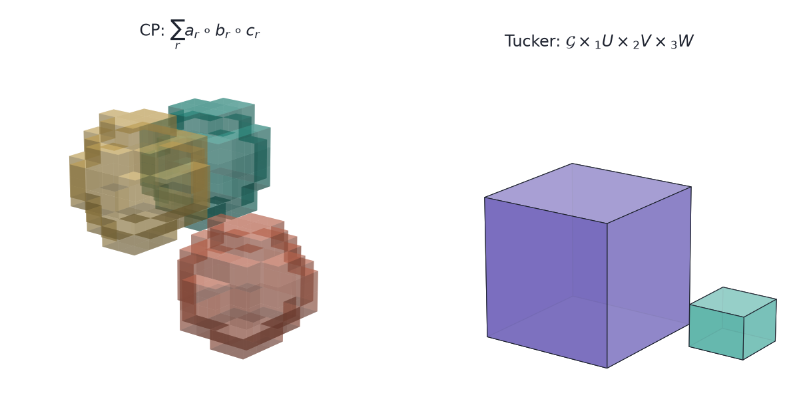

`parafac(X, rank=3)` and `tucker(X, rank=[3, 3, 3])` take the same array, hand back
factor matrices, and differ in the call by one integer against three — so they look
like two settings of one algorithm. They are not. CP returns components that, under a
condition on the factors, are the only ones that fit the array; Tucker returns a basis
per mode and a small core, fixed only up to a rotation that slides between them.

The gap shows up when someone reads the output. A CP component can be named and argued
about. A Tucker factor column is a coordinate: rotate it, push the inverse rotation
into the core, and the fit does not change. Naming a Tucker column picks one of
infinitely many equally good answers.

Every worked form here is three-way. The algebra for general $N$, with unfoldings, HOSVD,
tensor train and the t-product, is in
[Tensor Factorizations and Tensor Inverses](../tensor-factorizations/). What these
compressions cost on real video and audio is in
[Uses of Tensor Factorizations](../uses-of-tensor-factorizations/).

## The two arrays

Two shapes recur, and they pull in opposite directions.

A ratings table with a time axis — user by movie by month — gets asked what the
recurring patterns are. The answer is meant to be read out: *this group of users, these
films, these months*.

A colour image is height by width by colour, and gets asked how few numbers can stand
in for it. Nobody reads a picture's factors.

## Figure data

The volumes in the figures are synthetic and no decomposition is fitted to them.

- The three CP components are outer products of Gaussian bumps on a $12\times 12\times
  12$ grid, each centred somewhere else in it, so a component reads as one blob. They
  stand in for concepts recovered from a ratings cube, which is far too large and too
  sparse to draw.
- The Tucker figure is a layout: a full cube, a small core, and three random
  $12\times R_n$ heatmaps standing in for factor matrices. It is not a fit of the CP
  volumes.
- The rotating cubes are labelled boxes, not data at all.
- `src/make_cubes.py` writes all five images. The page has no executable cells.

Which decomposition answers which question is settled by the algebra, so a
MovieLens-shaped table or a public-domain film clip would not change the answer. What
the compression costs does need measured data, and is measured in
[Uses of Tensor Factorizations](../uses-of-tensor-factorizations/).

## Notation

For a three-way $\mathcal{X}\in\mathbb{R}^{I\times J\times K}$:

- **Mode.** One axis. Mode 1 has length $I$, mode 2 has length $J$, mode 3 has length
  $K$.
- **Outer product.** $a\circ b\circ c$ is the $I\times J\times K$ array with entries
  $a_i b_j c_k$. An array that can be written this way is **rank-1**.
- **Mode-$n$ product.** $\mathcal{G}\times_n U$ multiplies every mode-$n$ fiber of
  $\mathcal{G}$ by $U$, leaving the other modes alone.
- **Mode-$n$ unfolding.** $\mathcal{X}_{(n)}$, the matrix whose columns are the
  mode-$n$ fibers.

## CP

CP — CANDECOMP/PARAFAC — writes the array as a sum of $R$ rank-1 terms:

$$
\mathcal{X} \approx \sum_{r=1}^{R} \lambda_r\, a_r \circ b_r \circ c_r .
$$

One integer $R$ sets the model. Each term carries one vector per mode, so a term is a
triple: a weighting of users, a weighting of movies, a weighting of months.

### Uniqueness

CP's value is that the triples are pinned down. Write $k_A$ for the **k-rank** of the
factor matrix $A$ — the largest $k$ such that every $k$ columns of $A$ are linearly
independent. Kruskal's condition is

$$
k_A + k_B + k_C \ \ge\ 2R + 2 .
$$

When it holds, the rank-$R$ CP decomposition is unique up to permuting the $R$ terms
and rescaling the three vectors inside a term against each other. No rotation is
available. That is why a CP component survives being given a name: a second analyst
fitting the same array recovers the same triples in a different order.

Matrix factorization has no such property. $AB^\top = (AQ)(BQ^{-\top})^\top$ for any
invertible $Q$, so PCA needs an extra rule — maximise variance, or rotate to a varimax
criterion — before a component means anything. The third mode is what makes that rule
unnecessary.

### Storage

$R$ components on an $I\times J\times K$ array need $R(I+J+K)$ numbers, with each
$\lambda_r$ scaled into one of its own three vectors rather than stored. At $R=3$ on
$12\times 12\times 12$ that is 108 against the dense 1728.

## Tucker

Tucker compresses each mode against its own budget:

$$
\mathcal{X} \approx \mathcal{G} \times_1 U \times_2 V \times_3 W,
\qquad \mathcal{G}\in\mathbb{R}^{R_1\times R_2\times R_3}.
$$

$U$ is $I\times R_1$, $V$ is $J\times R_2$, $W$ is $K\times R_3$. The triple
$(R_1,R_2,R_3)$ is the **multilinear rank**, and it is three separate dials: the ranks
of the three unfoldings.

CP is the special case where $R_1=R_2=R_3=R$ and $\mathcal{G}$ is zero off its
superdiagonal. That shared ancestry is why the two library calls look alike.

The dials move independently. A colour image has three colour slices and a good
compression keeps all three, while the height and width modes give up most of their
length.

### Rotational freedom

For any invertible $Q\in\mathbb{R}^{R_1\times R_1}$,

$$
\mathcal{G} \times_1 U
= \left(\mathcal{G} \times_1 Q^{-1}\right) \times_1 (UQ),
$$

and the same holds in modes 2 and 3. The fit does not change. Requiring orthonormal
columns, as the higher-order SVD does, narrows $Q$ to an orthogonal matrix but does not
remove it: the factors are a basis for a subspace, and the subspace is what Tucker
identifies.

Truncated HOSVD is the cheap non-iterative way to get that basis: take the SVD of each
unfolding and keep $R_n$ left singular vectors. It is not the best
multilinear-rank-$(R_1,R_2,R_3)$ approximation, but for an $N$-way array its error is
within $\sqrt{N}$ of the best one. That is close enough to start an iterative fit from.

### Storage

$R_1R_2R_3 + IR_1 + JR_2 + KR_3$ numbers. At $(4,4,3)$ on $12\times 12\times 12$ that
is $48 + 48 + 48 + 36 = 180$, against the dense 1728.

Two parameter counts on one toy array settle nothing: 108 for CP at $R=3$ and 180 for
Tucker at $(4,4,3)$ compare two models that fit the array to different accuracies.
Storage separates the two only at fixed error, and at fixed error the winner depends on
whether the array really is a short sum of rank-1 terms.

## Choosing

The question decides:

- **"What are the parts, and what do they mean?"** CP — but check where Kruskal's
  condition actually bites before leaning on it. Generic factors have full k-rank, so
  for $R \le \min(I,J,K)$ it reduces to $3R \ge 2R+2$ and holds for every $R \ge 2$. It
  bites when $R$ exceeds a mode's length, and when a fit returns near-collinear columns,
  whose k-rank is numerically lower than the exact arithmetic says.
- **"How few numbers can stand in for this?"** Tucker. The per-mode budget is the
  feature — spend where the array has structure, and leave a short mode alone.
- **"Which modes carry the variation?"** Tucker, read as multilinear rank. The three
  unfolding ranks answer directly, and the factors need no interpretation to do it.
- **"How many components are there?"** Neither, not directly. Determining tensor rank is
  NP-hard, so $R$ is chosen by fitting a range and watching the residual and the
  stability of the factors across restarts.

A useful order when both are on the table: fit Tucker first, because it always has a
best fit and gives the multilinear rank cheaply, then fit CP inside the compressed core
if the components are going to be read.

## Constraints

CP:

- A best rank-$R$ approximation need not exist for $R \ge 2$. The infimum can be
  approached by factors that grow without bound and cancel — the ALS iterates diverge
  while the residual keeps falling. Rising factor norms are the tell.
- ALS gets stuck on long plateaus where the residual barely moves for hundreds of
  iterations and then drops. Stopping on "no progress" stops early.
- Kruskal's condition is sufficient, not necessary. Failing it means uniqueness is not
  guaranteed, not that the fit is wrong.

Tucker:

- The core is $\prod_n R_n$, exponential in the number of modes. At eight modes with
  $R_n = 10$ the core alone is $10^8$ numbers. Tensor train exists to avoid that.
- The factors are bases. A heatmap of $U$ is not a picture of concepts, and reading it
  as one is the mistake CP exists to prevent.

Uniqueness. Or. Compression. CP. Names. Parts. Tucker. Spends. Budget. Ask. First.

## References

- Kolda, T. G., and Bader, B. W. (2009). [Tensor decompositions and
  applications](https://doi.org/10.1137/07070111X). *SIAM Review* 51(3). The survey
  both models are usually cited from.
- Kruskal, J. B. (1977). [Three-way arrays: rank and uniqueness of trilinear
  decompositions](https://doi.org/10.1016/0024-3795(77)90069-6). *Linear Algebra and
  its Applications* 18(2). The k-rank condition.
- De Lathauwer, L., De Moor, B., and Vandewalle, J. (2000). [A multilinear singular
  value decomposition](https://doi.org/10.1137/S0895479896305696). *SIAM Journal on
  Matrix Analysis and Applications* 21(4). HOSVD and the $\sqrt{N}$ bound.
- de Silva, V., and Lim, L.-H. (2008). [Tensor rank and the ill-posedness of the best
  low-rank approximation problem](https://doi.org/10.1137/06066518X). *SIAM Journal on
  Matrix Analysis and Applications* 30(3). Why a best rank-$R$ fit can fail to exist.
- Hillar, C. J., and Lim, L.-H. (2013). [Most tensor problems are
  NP-hard](https://doi.org/10.1145/2512329). *Journal of the ACM* 60(6). Tensor rank
  among them.
- [Tensor Factorizations and Tensor Inverses](../tensor-factorizations/) — the algebra
  for general $N$, plus tensor train, t-SVD and four tensor inverses.
- [Uses of Tensor Factorizations](../uses-of-tensor-factorizations/) — what these
  compressions cost on a film clip, a conv kernel and a dense layer.
