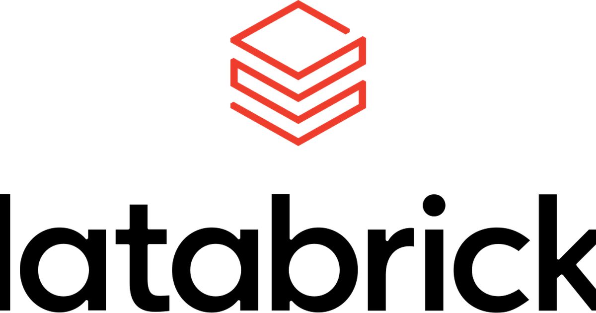

Spark is open source and runs anywhere, so the first question about Databricks is why
anyone pays for it. The answer is not the engine. It is the three things bolted around
the engine: a workspace where several people share one running cluster from notebooks,
a table format that gives a data lake the transactions a database has, and a place
where every model training run is recorded. These are working notes on what each of
those buys, with the airline-delay sample that ships in every workspace as the running
example, written as of early 2025.

## The cluster is Spark, and someone else runs it

A Databricks workspace sits on AWS, Azure or Google Cloud and hands out Spark clusters
on request: pick a runtime version, a node type and an autoscaling range, and a cluster
is up in a few minutes and gone when idle. What that saves is the part of Spark that is
not analysis: installing it, keeping versions consistent across nodes, tuning the JVM,
and being paged when the driver dies. The Community Edition, free and small, is enough
to see all of this: sign up, **Compute → Create Cluster**, name it, pick a runtime, and
open a notebook against it.

A notebook cell is ordinary PySpark; `spark` is already a session on the cluster. The
sample data is the airline on-time table that Databricks preloads, one CSV shard of
flights with their departure and arrival delays:

```python
df = spark.read.csv("/databricks-datasets/airlines/part-00000", header=True, inferSchema=True)
df.printSchema()
df.count()
df.filter(df.Origin == "JFK").show(5)
```

Nothing here is Databricks-specific except the path. That is the point: the code is
portable Spark, and the platform is what is around it.

## Delta Lake makes a folder of files behave like a table

A data lake is a folder of Parquet files in object storage, and a folder of files has no
transactions. Two jobs writing at once corrupt each other, a failed write leaves half a
result behind, and a schema change is silent until a downstream query breaks. Delta
Lake, which Databricks built and open-sourced, keeps a transaction log beside the files,
so writes are atomic, readers see a consistent snapshot, the schema is enforced on
write, and every version is kept (time travel). A Spark table saved as Delta is one
option away:

```python
df.write.format("delta").mode("overwrite").saveAsTable("flights")
spark.sql("SELECT Origin, AVG(ArrDelay) FROM flights GROUP BY Origin ORDER BY 2 DESC").show(5)
```

Of the three extras this is the one that changes what the data lake can be used for:
with transactions, the lake can be the system of record rather than a staging area
copied into a warehouse.

## MLflow keeps the training runs you would otherwise lose

The third extra is for the model side. MLflow records each training run, its
parameters, metrics, and the model artefact, and Databricks hosts it inside the
workspace so a notebook logs to it without setup. A small logistic regression on the
flight data, predicting whether a flight arrives late from its departure delay and
distance, is the shape of it:

```python
import mlflow
from pyspark.ml.classification import LogisticRegression
from pyspark.ml.feature import VectorAssembler
from pyspark.sql.functions import col

data = (VectorAssembler(inputCols=["DepDelay", "Distance"], outputCol="features")
        .transform(df.na.drop(subset=["DepDelay", "Distance", "ArrDelay"]))
        .withColumn("late", (col("ArrDelay") > 15).cast("int"))
        .select("features", "late"))
train, test = data.randomSplit([0.8, 0.2], seed=42)

with mlflow.start_run():
    model = LogisticRegression(featuresCol="features", labelCol="late").fit(train)
    auc = model.evaluate(test).areaUnderROC
    mlflow.log_metric("auc", auc)
    mlflow.spark.log_model(model, "model")
```

The label is a threshold, late by more than fifteen minutes, because logistic
regression classifies; the earlier version of these notes fed it the raw delay in
minutes, which the model cannot fit. The run appears in the workspace's experiment list
with its AUC, and a later run with different features sits beside it for comparison,
which is the thing that a folder of notebooks never gives you.

## Where it stops holding

The same three extras are the lock-in. Delta Lake is open, but the fastest way to run
it is on Databricks; MLflow is open, but the hosted one is the convenient one. For a
team that already runs Spark well, or whose data fits a warehouse and never needs
Spark, the platform is paying for problems it does not have. The honest comparison is
against the alternative that fits the data: a warehouse such as
[Snowflake](../snowflake/) for SQL-shaped analytics, plain Spark on a cloud service for
a team with the operators, and Databricks when the notebooks, the transactions and the
run tracking are the things missing.

Spark. Underneath. Managed. Above. Delta. Adds. Transactions. MLflow. Tracks. Runs. Convenience. Costs.

## References

- [Databricks documentation](https://docs.databricks.com/)
- [Delta Lake](https://delta.io/) and Armbrust, M. et al. (2020). Delta Lake:
  high-performance ACID table storage over cloud object stores. *PVLDB* **13**(12).
- [MLflow](https://mlflow.org/)
- Airline on-time performance data, US Bureau of Transportation Statistics, as
  preloaded in `/databricks-datasets/airlines`.
