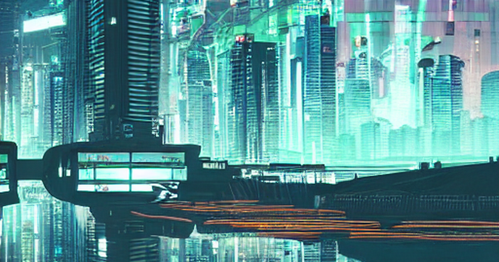

`StableDiffusionPipeline.from_pretrained(...)` returns something that looks like a model and is not. It is a container holding four independently trained parts — a text encoder, a UNet, a scheduler, and a VAE — wired into a loop. Knowing that is what turns image generation from incantation into engineering, because every technique for controlling the output turns out to be an intervention on exactly one of those parts.

Changing the prompt conditions the text encoder. Inpainting constrains what the VAE decodes. Swapping the sampler replaces the scheduler and nothing else. ControlNet bolts a second network onto the UNet. Same four slots, four different places to reach in.

## Where these weights come from, and why that matters

Stable Diffusion v1.5 was trained on subsets of **LAION-5B** — `laion2B-en` and its high-resolution and aesthetic-scored filters — assembled by [LAION e.V.](https://laion.ai/), a German non-profit. The construction is worth understanding because it explains both what the model can do and what it does wrong.

LAION did not photograph anything. They filtered Common Crawl for `` tags with alt-text, kept pairs where OpenAI's CLIP judged image and caption to agree, and published the *URLs* rather than the images. The motive was explicitly political: DALL·E and its peers were trained on undisclosed corpora, so text-to-image research could only be done inside a few companies. An open dataset was an attempt to make the field reproducible from outside.

That origin has consequences the model inherits directly. Alt-text is SEO, filenames, and boilerplate — so the caption distribution is noisy and skews to commercial, English-language, Western web imagery. Artists' names appear in captions in volume, which is why style prompting works at all and why the copyright objection to these models is not frivolous. Watermarks and stock-photo furniture are learned with the rest of the caption noise. And in December 2023 the Stanford Internet Observatory [identified CSAM within LAION-5B](https://purl.stanford.edu/kh752sm9123); LAION withdrew the dataset and republished a filtered **Re-LAION** in August 2024, after these weights were trained.

What we ask of the model here is narrow — generate and manipulate illustrative images to show what each pipeline component does. The cost of being wrong is correspondingly low. That is emphatically not true of the general case: images produced this way get used commercially, diffusion models can and do reproduce near-copies of training images, and the demographic skew of a web-scraped corpus shows up in who the model draws when you ask for "a doctor". None of that is visible in the code below, which is exactly why it needs saying before the code.

## Generation is a loop over the four parts

Load the pipeline. Note the repository id: `runwayml/stable-diffusion-v1-5`, which this post originally used, was deleted by its owner in August 2024 — the weights now live under `stable-diffusion-v1-5/`, and the old path survives only as a redirect.

```{python}
import warnings

warnings.filterwarnings("ignore")

import torch
from diffusers import StableDiffusionPipeline

MODEL = "stable-diffusion-v1-5/stable-diffusion-v1-5"
DEVICE = "mps" if torch.backends.mps.is_available() else "cpu"

pipe = StableDiffusionPipeline.from_pretrained(MODEL, safety_checker=None)
pipe = pipe.to(DEVICE)

for name, component in [
    ("text_encoder", pipe.text_encoder),
    ("unet", pipe.unet),
    ("vae", pipe.vae),
    ("scheduler", pipe.scheduler),
]:
    params = sum(p.numel() for p in component.parameters()) if hasattr(component, "parameters") else 0
    print(f"{name:13s} {type(component).__name__:28s} {params / 1e6:8.1f}M params")
```

Three networks and a scheduler that has no parameters at all — it is an algorithm, not a model, which is why it can be swapped freely. The UNet dominates the parameter count because it does the actual work: predicting, at each step, what noise to remove.

Note `pipe = pipe.to(DEVICE)`. The original version of this post wrote `ipe = pipe.to("mps")` — a typo that bound a stray name and left the pipeline on the CPU, silently making every generation many times slower.

Now run the loop:

```{python}
generator = torch.Generator(device="cpu").manual_seed(42)
image = pipe(
    "a futuristic city at night, cyberpunk style",
    num_inference_steps=25,
    generator=generator,
).images[0]

image.save("cyberpunk_city.png")
image
```

Twenty-five passes through the UNet, each removing a little noise from a 64×64 latent, then one VAE decode to 512×512 pixels. The seeded `generator` matters more than it looks: without it the output changes on every render, and a post whose figures are committed alongside its source would drift from its own text.

## The scheduler is swappable, and it changes the picture

The clearest evidence that these are separable parts: replace the scheduler, keep every weight, and the image changes. The scheduler decides *how* to step from noisy latent to less-noisy latent, and different solvers take different paths.

```{python}
from diffusers import DPMSolverMultistepScheduler, EulerDiscreteScheduler

original = type(pipe.scheduler).__name__
outputs = {}

for name, cls in [("DPMSolver", DPMSolverMultistepScheduler), ("Euler", EulerDiscreteScheduler)]:
    pipe.scheduler = cls.from_config(pipe.scheduler.config)
    outputs[name] = pipe(
        "a futuristic city at night, cyberpunk style",
        num_inference_steps=25,
        generator=torch.Generator(device="cpu").manual_seed(42),
    ).images[0]

print(f"started as {original}; rendered with {', '.join(outputs)}")
```

```{python}
import numpy as np
from PIL import Image

side_by_side = Image.new("RGB", (1024, 512))
side_by_side.paste(outputs["DPMSolver"], (0, 0))
side_by_side.paste(outputs["Euler"], (512, 0))
side_by_side.save("scheduler_comparison.png")

difference = np.abs(
    np.array(outputs["DPMSolver"], dtype=float) - np.array(outputs["Euler"], dtype=float)
)
print(f"mean |pixel difference|: {difference.mean():.1f} / 255")
print(f"max  |pixel difference|: {difference.max():.0f} / 255")
side_by_side
```

Same prompt, same seed, same weights — DPMSolver on the left, Euler on the right. The compositions are recognisably the same scene, because the seed fixes the starting noise, and the printed difference confirms they are nonetheless not the same image.

At 25 steps on a converged prompt, swapping the solver perturbs detail rather than reinventing the picture. The reason people care is speed, not variety — DPMSolver reaches comparable quality in noticeably fewer iterations than the ancestral samplers it replaced, and the place you would see a dramatic difference is at 8 or 10 steps, where the cheaper solvers have not converged at all.

## Inpainting constrains what gets denoised

Inpainting uses a different checkpoint — one whose UNet takes extra input channels for the masked region — but the structural change is that a mask now decides which latents are allowed to move. Everything outside it is pinned to the original image at every step.

```{python}
from diffusers import StableDiffusionInpaintPipeline

inpaint = StableDiffusionInpaintPipeline.from_pretrained(
    "stable-diffusion-v1-5/stable-diffusion-inpainting", safety_checker=None
).to(DEVICE)

base = Image.open("base.png").convert("RGB")
mask = Image.open("mask.png").convert("L")
print(f"base {base.size} {base.mode}   mask {mask.size} {mask.mode}")

result = inpaint(
    prompt="a ruined stone castle on the summit, weathered granite",
    image=base,
    mask_image=mask,
    num_inference_steps=25,
    generator=torch.Generator(device="cpu").manual_seed(0),
).images[0]

result.save("inpainted.png")
result
```

The base image is Half Dome at Yosemite and the mask covers its summit, so a castle appears on the peak while the framing pines, the road and the haze on the far ridge are untouched — pixel-identical, because they were never denoised. That is the structural difference from text-to-image: the mask decides which latents are free to move.

The mask is opened as `"L"`, single-channel greyscale, where white marks the region to regenerate. The original post converted it to `"RGB"`, which is the kind of thing that either throws or silently misinterprets the channels.

It also asked for "a black cat with glowing eyes" — a prompt inherited from some earlier base image, which against this photograph produced a building anyway. The model will put *something* plausible in the masked region regardless of whether your prompt suits the surroundings, and it will not tell you the two disagreed.

Two details also changed from the original. It passed `torch_dtype=torch.float16`, which is unreliable on MPS and produces black images often enough to be a known failure mode; float32 is the safe default on Apple silicon. And `safety_checker=None` above is a deliberate choice for a reproducible post — the checker loads a separate classifier and replaces flagged outputs with black squares, which would make the committed figures depend on its verdict. Leave it enabled for anything user-facing.

## ControlNet adds a second network beside the UNet

The last intervention is structural. ControlNet is a trained copy of the UNet's encoder that accepts a conditioning image — edges, depth, pose — and injects its activations into the main UNet at every block. The base model's weights are untouched; the control signal is added alongside.

The conditioning image has to be computed at the generation resolution. That matters more than it sounds, and is worth doing properly rather than reusing a stored thumbnail — so we run Canny over the same Yosemite photograph the inpainting section used:

```{python}
import cv2
import numpy as np
from diffusers import StableDiffusionControlNetPipeline, ControlNetModel

source = np.array(Image.open("base.png").convert("RGB"))
edges = Image.fromarray(np.stack([cv2.Canny(source, 100, 200)] * 3, axis=-1))
print(f"edge map {edges.size}, {(np.array(edges)[:, :, 0] > 0).mean():.1%} edge pixels")

controlnet = ControlNetModel.from_pretrained("lllyasviel/sd-controlnet-canny")
control_pipe = StableDiffusionControlNetPipeline.from_pretrained(
    MODEL, controlnet=controlnet, safety_checker=None
).to(DEVICE)

controlled = control_pipe(
    "a snowy mountain valley in winter, pine trees, dramatic light",
    image=edges,
    num_inference_steps=25,
    generator=torch.Generator(device="cpu").manual_seed(7),
).images[0]
controlled.save("controlnet_output.png")

triptych = Image.new("RGB", (1536, 512), "white")
for i, panel in enumerate([Image.open("base.png").convert("RGB"), edges, controlled]):
    triptych.paste(panel, (512 * i, 0))
triptych.save("controlnet_comparison.png")
triptych
```

Source photograph, its edge map, and a generated image that is a *winter* scene with the same composition — the dome in the same place, framed by the same trees, with the road curving the same way. The prompt never mentioned a dome, a road, or where anything should sit; the edge map supplied all of that, and the prompt supplied snow.

That division is the argument for ControlNet in one figure. Text specifies content, and no amount of prompt engineering conveys a silhouette.

### Caveat: the conditioning image's resolution is not a detail

An earlier version of this post loaded a stored 225×225 edge map and upscaled it to 512. The result was not a subtly worse image — it was a grey wash with the edge lines drawn *literally on top*, because upscaling one-pixel lines produces broken dotted ones and the model faithfully reproduced the dots as content.

The failure mode is worth recognising: if a ControlNet output looks like a tracing of its control image rather than a picture, the conditioning input is malformed. Compute it at the generation resolution.

## What the four parts buy

The claim was that controlling a diffusion model means intervening on one of four separable components. Each section did exactly one: the prompt reached the text encoder, the scheduler swap replaced a parameterless algorithm and changed the image with identical weights, the inpainting mask constrained which latents could move, and ControlNet attached a parallel network to the UNet.

That decomposition is also the debugging map. Washed-out or artefacted images at low step counts are the scheduler. Prompts that seem ignored are the text encoder's 77-token limit quietly truncating. Colour shifts and mushy fine detail are the VAE, which is lossy and can be swapped for a better-trained one. Black outputs on Apple silicon are float16.

Where it stops being a clean decomposition is training. Fine-tuning with LoRA — the natural next step, and the same technique as in the [`peft` post](../peft/index.qmd) — touches the UNet's attention layers and optionally the text encoder, and the two interact: a LoRA trained against one scheduler's noise conventions can behave differently under another. The parts are separable at inference. They were trained together.
