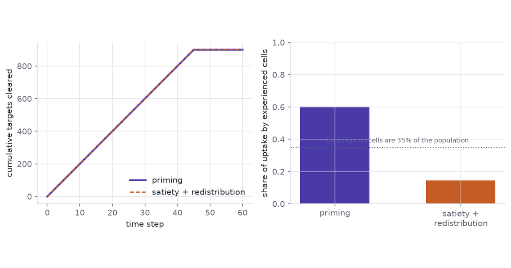

{fig-alt="Two cumulative uptake curves lying on top of each other, beside a bar chart showing the per-cell contributions underneath them diverging sharply."}

A macrophage population clears apoptotic cells at some rate, and that rate is usually
all an assay reports. The number is a sum over cells, and a sum has no memory of which
cells produced it.

Watch a clearance assay for long enough and the same total uptake can arrive two ways.
Experienced macrophages can take on more, so clearance concentrates in the cells that
have already eaten. Or experienced macrophages can slow down while fresh cells absorb
what they leave, so clearance spreads out. Both trajectories are consistent with
continual efferocytosis as it is described, and both give the same population curve.
Separating them needs a model of the per-cell event history and a design that assigns
the history rather than observing it.

Everything here is simulated. No experimental data were used, and no result below is a
claim about a real macrophage population — the point is what an analysis can and cannot
recover when the generating process is known exactly.

```{python}
#| label: setup
#| echo: false
#| output: false
import sys
import time

sys.path.insert(0, "src")

import matplotlib.pyplot as plt
import numpy as np
import pandas as pd

import house
import sim
import fitting

house.apply()
np.set_printoptions(precision=4, suppress=True)
TIMES = {}
T_START = time.perf_counter()


def lap(name, t0):
    TIMES[name] = time.perf_counter() - t0
    return time.perf_counter()
```

## Efferocytosis

Efferocytosis is the recognition, engulfment and disposal of an apoptotic cell by a
phagocyte ([Doran et al. 2020](https://doi.org/10.1038/s41577-019-0240-6)). It runs in stages that are worth keeping separate:

- **Find-me.** Nucleotides and lipids released by the dying cell recruit the phagocyte
  ([Ravichandran 2011](https://doi.org/10.1016/j.immuni.2011.09.004)).
- **Eat-me.** Exposed phosphatidylserine, read directly or through a bridging molecule,
  marks the target for engulfment ([Poon et al. 2014](https://doi.org/10.1038/nri3607)).
- **Internalisation.** The target is drawn into a phagosome.
- **Processing.** The phagolysosome degrades the cargo, and the phagocyte metabolises
  what it recovers.

These are not a strict queue. A macrophage can bind one target while still digesting
another, so binding, internalisation and processing overlap in time.

Macrophages clear targets repeatedly rather than once, and what happens after the first
meal is the part that matters here. Processing the first corpse changes the cell:
mitochondrial fission supports continued uptake ([Wang et al. 2017](https://doi.org/10.1016/j.cell.2017.08.041)), arginine recovered from the
cargo is metabolised into polyamines that promote further uptake ([Yurdagul et al. 2020](https://doi.org/10.1016/j.cmet.2020.01.001)), and
loss of the phagocyte's UCP2 protein blocks continued clearance specifically
([Park et al. 2011](https://doi.org/10.1038/nature10340)). Against that, a cell carrying undigested cargo has finite capacity.

So a cell's own history could push its next uptake either way. Prior uptake could prime
it, or saturate it. Both are described in the literature, and an assay that reports a
population mean cannot tell which one is running.

Neighbours matter too, in two different ways that are easy to conflate. A neighbour that
eats a target removes that target, which lowers the opportunity in the local
neighbourhood. Separately, metabolites released by apoptotic cells act on surrounding
tissue as signals in their own right ([Medina et al. 2020](https://doi.org/10.1038/s41586-020-2121-3)). The first is depletion; the second
is signalling; they are distinguishable only if opportunity is measured.

## Same mean, different mechanism

When targets are limited, the population curve is set by supply, and the allocation
underneath it is free.

```{python}
#| label: toy-run
#| echo: false
#| output: false
t0 = time.perf_counter()
priming, satiety = sim.toy_mechanisms()
t0 = lap("toy", t0)
share_p = priming.per_cell[priming.experienced].sum() / priming.per_cell.sum()
share_s = satiety.per_cell[satiety.experienced].sum() / satiety.per_cell.sum()
total_gap = abs(priming.cumulative[-1] - satiety.cumulative[-1])
```

Two rules draw on one fixed pool of targets. Under priming, cells with prior experience
take a larger share; under satiety they take a smaller one and the naive cells absorb
the remainder. The pool is what runs out, so both rules eat through the same supply on
the same schedule.

```{python}
#| label: fig-same-mean
#| fig-cap: "Simulated supply-limited clearance of 900 targets by 200 cells under two allocation rules. Left: cumulative population uptake through time under priming and under satiety plus redistribution. Right: the share of all uptake taken by the 35% of cells designated as experienced, under each rule."
#| fig-alt: "Two panels. The left shows two cumulative curves that rise together and overlap so closely that one hides the other. The right shows two bars of very different height."
#| fig-width: 9
#| fig-height: 3.6
fig, (ax1, ax2) = plt.subplots(1, 2, figsize=(9, 3.6))

steps = np.arange(len(priming.cumulative))
ax1.plot(steps, priming.cumulative, color=house.ACCENT, lw=2.4, label="priming")
ax1.plot(steps, satiety.cumulative, color=house.CORAL, lw=1.4, ls="--",
         label="satiety + redistribution")
ax1.set_xlabel("time step")
ax1.set_ylabel("cumulative targets cleared")
ax1.legend(loc="lower right")

ax2.bar(["priming", "satiety +\nredistribution"], [share_p, share_s],
        color=[house.ACCENT, house.CORAL], width=0.55)
ax2.axhline(0.35, color=house.MUTED, ls=":", lw=1.2)
ax2.set_ylabel("share of uptake by experienced cells")
ax2.set_ylim(0, 1)
ax2.annotate("experienced cells are 35% of the population",
             xy=(0.5, 0.38), xycoords=("axes fraction", "data"),
             ha="center", color=house.MUTED, fontsize=8)
fig.tight_layout()
plt.show()

print(f"final totals differ by {total_gap:.0f} targets")
print(f"experienced-cell share: priming {share_p:.3f}, satiety {share_s:.3f}")
```

The two population curves are identical, not merely close: the pool empties on a fixed
schedule, so the allocation rule cannot change the total. That is the construction, not
a finding — it is what lets the figure vary the mechanism with the population curve held
exactly still.
The share of the work done by experienced cells is
`{python} f"{share_p:.2f}"` against `{python} f"{share_s:.2f}"` — a factor of
`{python} f"{share_p / share_s:.1f}"`. The mean is the same; the mechanism is not.

## A recurrent-event intensity

Uptake by one cell is a recurrent event, so the object to model is an intensity: the
instantaneous rate of the next uptake given everything that has happened to that cell so
far ([Andersen and Gill 1982](https://doi.org/10.1214/aos/1176345976), [Cook and Lawless 2007](https://doi.org/10.1007/978-0-387-69810-6)).

$$
\lambda_i(t) = \lambda_0 \exp\Bigl\{ f_1\bigl(\ell_i(t)\bigr) + f_2\bigl(g_i(t)\bigr)
+ f_3\bigl(n_i(t)\bigr) + u_{d(i)} + w_{j(i)} \Bigr\} \cdot o_i(t)
$$

Each term carries a separate piece of biology.

- $\ell_i(t)$ — **current load**, targets internalised but not yet processed. This is
  where priming and satiety compete, so $f_1$ is the curve of interest.
- $g_i(t)$ — **time since the last uptake**. $f_2$ is a refractory term: a cell that has
  just engulfed something is briefly occupied.
- $n_i(t)$ — **neighbour load**. $f_3$ is appetite changed by neighbours through
  signalling, over and above their effect on supply.
- $u_{d(i)}$, $w_{j(i)}$ — donor and well random effects. Donors differ, and so do wells
  within a donor.
- $o_i(t)$ — **opportunity**: the number of unconsumed targets within reach of cell $i$.

The opportunity term enters as an offset with coefficient fixed at one, not as a fitted
covariate. This is the load-bearing choice. A cell in a depleted neighbourhood eats
little because there is nothing to eat, and without the offset that cell's low count is
read as low appetite. Low uptake is not low appetite; the offset is what keeps the two
apart, and it is also what makes depletion and neighbour signalling separately
identifiable.

## A simulated two-wave experiment

```{python}
#| label: run-experiment
#| echo: false
#| output: false
t0 = time.perf_counter()
exp = sim.simulate_experiment(neighbour_mode="depletion")
exp_sig = sim.simulate_experiment(neighbour_mode="signalling", seed=4242)
t0 = lap("simulate", t0)

cells = exp.cells
n_cells_total = len(cells)
n_donors = cells["donor"].nunique()
n_wells = cells["well"].nunique()
lost_frac = float((cells["lost_at"] < sim.N_BINS).mean())
mean_w2 = cells.groupby("arm")["wave2_uptake"].mean()
mean_w1 = cells.groupby("arm")["wave1_uptake"].mean()
shares = fitting.naive_share(cells)
share_by_arm = shares.groupby("arm")["share"].mean()
```

The design delivers the **same first-wave target budget** two ways, then gives every arm
the same second wave.

- **`broad`** — the first-wave targets are scattered across the well.
- **`focal`** — the same number of targets, packed around a subset of cells fixed in
  advance.
- **`none`** — no first wave, as a reference for what an inexperienced population does.

After the first wave there is a wash, a three-hour interval, and a second wave common to
every arm. `{python} f"{n_donors}"` donors each contribute one well to each arm:
`{python} f"{n_wells}"` wells and `{python} f"{n_cells_total}"` cells in total. Cells are
lost from tracking at a constant hazard, and `{python} f"{lost_frac:.1%}"` of them are
censored before the end.

The generating process gives $f_1$ a rise then a fall — priming at low load, satiety at
high — and $f_2$ a refractory dip that decays with a time constant of 0.75 h. Digestion
clears a target in 4 h, which is slow relative to the interval between waves; that is
what carries first-wave history into the second wave rather than letting it wash out.
Neighbour effects are generated twice: once by depletion alone, where $f_3$ is flat at
zero and neighbours act only through the offset, and once by depletion plus signalling.

```{python}
#| label: fig-raster
#| fig-cap: "Simulated uptake events for 60 cells drawn from one donor, in the broad and focal arms. Each row is one cell, each mark one uptake. The shaded bands are the two target waves; the gap between them is the wash and interval. Cells are ordered by first-wave uptake."
#| fig-alt: "Two stacked panels of dot rows. In the upper panel marks are spread evenly across rows during the first shaded band. In the lower panel the marks in the first band are concentrated in the rows at the top."
#| fig-width: 9
#| fig-height: 5.0
fig, axes = plt.subplots(2, 1, figsize=(9, 5.0), sharex=True)
panel = exp.panel
for ax, arm in zip(axes, ("broad", "focal")):
    sub = panel[(panel["arm"] == arm) & (panel["donor"] == 0)]
    order = (
        cells[(cells["arm"] == arm) & (cells["donor"] == 0)]
        .sort_values("wave1_uptake", ascending=False)["uid"].to_numpy()[:60]
    )
    rank = {u: r for r, u in enumerate(order)}
    ev = sub[(sub["y"] > 0) & (sub["uid"].isin(rank))]
    ax.axvspan(sim.WAVE1[0] * sim.DT, sim.WAVE1[1] * sim.DT, color=house.RULE, alpha=0.55)
    ax.axvspan(sim.WAVE2[0] * sim.DT, sim.WAVE2[1] * sim.DT, color=house.RULE, alpha=0.55)
    ax.scatter(
        ev["bin"] * sim.DT, [rank[u] for u in ev["uid"]],
        s=5, color=house.ARM_COLOUR[arm], alpha=0.85, linewidths=0,
    )
    ax.set_ylabel(f"{arm}\ncell")
    ax.set_ylim(-1, 60)
    ax.grid(False)
axes[1].set_xlabel("hours")
fig.tight_layout()
plt.show()

print(mean_w1.round(2).to_string())
print(mean_w2.round(2).to_string())
```

Mean first-wave uptake is `{python} f"{mean_w1['broad']:.2f}"` per cell in `broad` and
`{python} f"{mean_w1['focal']:.2f}"` in `focal`, from the same delivered budget. Mean
second-wave uptake is `{python} f"{mean_w2['broad']:.2f}"` against
`{python} f"{mean_w2['focal']:.2f}"` — a difference of
`{python} f"{100 * abs(mean_w2['focal'] / mean_w2['broad'] - 1):.1f}"`%. The population
readout is nearly blind to the manipulation, which is the point of running it.

## Fitting

```{python}
#| label: build-design
#| echo: false
#| output: false
t0 = time.perf_counter()
GRID_FACTOR = 6  # 1.5 h blocks: about twice the 0.75 h refractory time constant
fit_panel = sim.coarsen(sim.second_wave_panel(exp), factor=GRID_FACTOR)
design = fitting.make_design(fit_panel)
alpha_hat = fitting.estimate_alpha(fit_panel, design)
t0 = lap("design", t0)
n_fit_rows = len(fit_panel)
block_hours = sim.DT * GRID_FACTOR
```

The model is fitted on the second wave, with first-wave history carried in as
covariates. The counting-process likelihood factorises into independent contributions on
any partition of follow-up, so the events are aggregated to
`{python} f"{block_hours:.1f}"`-hour blocks — about twice the refractory time constant,
chosen on that scale rather than by looking at the fit. That gives
`{python} f"{n_fit_rows:,}"` rows.

Two models, fixed before either was run:

- **Baseline** — negative-binomial, linear in load, gap and $\log(1 + \text{neighbour
  load})$, with the same offset.
- **Main model** — the same likelihood with $f_1$, $f_2$ and $f_3$ as penalised cubic
  B-splines. The penalty is a second-order random walk on the basis coefficients, which
  is the P-spline prior ([Wood 2017](https://doi.org/10.1201/9781315370279)), written
  non-centred so the sampler sees unit-scale parameters. Fitted in PyMC
  ([Abril-Pla et al. 2023](https://doi.org/10.7717/peerj-cs.1516)), with donor and well
  random effects.

The two are fitted by different machinery, and that matters for what the comparison
means. The smooths and their credible bands come from the Bayesian fit, random effects
included. The model comparison in the next section refits **both** models by maximum
likelihood **without** random effects, because full leave-one-donor-out on two Bayesian
models was out of compute budget. The approximation is the same on both sides, so the
comparison is fair, but it is not a comparison of the two models exactly as specified
here.

```{python}
#| label: fit-gam
#| code-fold: show
#| output: false
import nutpie

t0 = time.perf_counter()
weights = np.ones(len(fit_panel))
compiled = nutpie.compile_pymc_model(fitting.gam_model(design, weights))
# `cores` is pinned, not left to the machine. nutpie is bit-reproducible for a
# fixed seed only when the chain-to-core allocation is also fixed; leaving it to
# whatever the host has free moves the posterior summaries in the last digit.
trace = nutpie.sample(
    compiled, chains=2, cores=2, draws=300, tune=300,
    seed=20260917, progress_bar=False,
)
t0 = lap("sample", t0)
```

```{python}
#| label: smooth-estimates
#| echo: false
#| output: false
def smooth_draws(name, grid):
    beta = trace.posterior[f"beta_{name}"].to_numpy().reshape(-1, 8)
    return beta @ design.bases[name](grid).T


def centred_truth(fn, grid, observed):
    """Put the true curve on the basis's centring, or the two are offset by a
    constant that has nothing to do with fit quality."""
    return fn(grid) - fn(observed).mean()


grid_load = np.linspace(fit_panel["load"].min(), fit_panel["load"].max(), 80)
grid_gap = np.linspace(fit_panel["gap"].min(), fit_panel["gap"].max(), 80)
d_load = smooth_draws("load", grid_load)
d_gap = smooth_draws("gap", grid_gap)
true_load = centred_truth(sim.f1_true, grid_load, fit_panel["load"].to_numpy())
true_gap = centred_truth(sim.f2_true, grid_gap, fit_panel["gap"].to_numpy())
rmse_load = float(np.sqrt(((d_load.mean(0) - true_load) ** 2).mean()))
rmse_gap = float(np.sqrt(((d_gap.mean(0) - true_gap) ** 2).mean()))
cover_load = float(
    np.mean(
        (np.quantile(d_load, 0.025, axis=0) <= true_load)
        & (true_load <= np.quantile(d_load, 0.975, axis=0)),
    ),
)
peak_est = float(grid_load[np.argmax(d_load.mean(0))])
peak_true = float(grid_load[np.argmax(true_load)])
```

```{python}
#| label: fig-smooths
#| fig-cap: "Estimated against generating smooths from the simulated depletion-only experiment, on the log-intensity scale. Left: the load term, rising at low load and falling at high load. Right: the refractory term against time since the last uptake. Bands are 95% credible intervals; both curves are centred over the fitted rows."
#| fig-alt: "Two panels, each with a dashed line, a solid line close to it, and a shaded band around the solid line that widens towards the right edge."
#| fig-width: 9
#| fig-height: 3.6
fig, (ax1, ax2) = plt.subplots(1, 2, figsize=(9, 3.6))
for ax, grid, draws, truth, xlab, title in (
    (ax1, grid_load, d_load, true_load, "load (undigested targets)", "$f_1$: load"),
    (ax2, grid_gap, d_gap, true_gap, "hours since last uptake", "$f_2$: refractory"),
):
    lo, hi = np.quantile(draws, [0.025, 0.975], axis=0)
    ax.fill_between(grid, lo, hi, color=house.ACCENT, alpha=0.20, linewidth=0)
    ax.plot(grid, draws.mean(0), color=house.ACCENT, lw=2.0, label="estimated")
    ax.plot(grid, truth, color=house.INK, lw=1.4, ls="--", label="generating")
    ax.set_xlabel(xlab)
    ax.set_ylabel("contribution to log intensity")
    ax.set_title(title)
ax1.legend(loc="lower left")
fig.tight_layout()
plt.show()

print(f"f1 RMSE {rmse_load:.3f}, 95% band covers {cover_load:.0%} of the grid")
print(f"f2 RMSE {rmse_gap:.3f}")
print(f"estimated f1 peak at load {peak_est:.2f}; generating peak at {peak_true:.2f}")
```

The load term recovers its **sign pattern** and not much more. The estimate rises then
falls, as the generating curve does, so the qualitative claim that priming gives way to
satiety survives. The quantitative recovery is poor: the estimated peak sits at load
`{python} f"{peak_est:.1f}"` against a generating peak at
`{python} f"{peak_true:.1f}"`, root-mean-square error is
`{python} f"{rmse_load:.3f}"` on the log-intensity scale, and the 95% credible band
covers the true curve over only `{python} f"{cover_load:.0%}"` of the grid.

That last number is the honest headline. A band that excludes the truth over
`{python} f"{1 - cover_load:.0%}"` of the range is **under-covering**, so the intervals
here are too narrow to be taken at face value. The random-walk penalty is doing more shrinking than the data
warrant, and the 1.5-hour aggregation blurs the covariate within each block. The refractory
term is better behaved, at root-mean-square error `{python} f"{rmse_gap:.3f}"`. Only
`{python} f"{float((fit_panel['load'] > 4).mean()):.1%}"` of rows carry a load above 4,
which is where the band is widest and the estimate worst.

The estimated dispersion is
`{python} "effectively Poisson" if alpha_hat > 1e3 else f"{alpha_hat:.1f}"`: with the
opportunity offset in place, there is no extra-Poisson variation left for the negative
binomial to absorb. That estimate comes from a fixed-effect Poisson fit on the same
design, not from the Bayesian model's own dispersion posterior. The negative binomial nests the Poisson, so this costs
nothing, but it is worth saying rather than reporting a dispersion that is doing no work.

## Out-of-donor evaluation

The margin was fixed before any model was fitted: **keep the spline model only if it
beats the baseline by more than 4 log points and by more than twice the standard error
of the difference.** Both conditions, not either.

```{python}
#| label: lodo
#| code-fold: show
t0 = time.perf_counter()
folds = fitting.lodo_glm(fit_panel, design, alpha_hat)
score = fitting.score_summary(folds)
calib = fitting.calibration_table(fit_panel, design, alpha_hat)
t0 = lap("evaluation", t0)

kept = (score["diff"] > 4) and (score["diff"] > 2 * score["se"])
print(f"spline  {score['gam']:9.1f}")
print(f"linear  {score['linear']:9.1f}")
print(f"diff    {score['diff']:9.2f}")
print(f"  se     {score['se']:9.2f}  (across {score['n_donors']} donors, the resampling unit)")
print(f"  se_row {score['se_row']:9.2f}  (across {score['n']} rows, which are not independent)")
print(f"margin met: {kept}")
```

Each donor is held out in turn, both models are refitted by maximum likelihood on the
remaining donors, and the held-out donor's counts are scored. These are **plug-in log
scores at the fitted coefficients, not expected log predictive densities** ([Vehtari et al. 2017](https://doi.org/10.1007/s11222-016-9696-4)): they ignore
coefficient uncertainty, carry no random effects, and predict the held-out donor at the
average donor. The
approximation is identical for both models, so the comparison is fair, but neither
number is an ELPD. The scoring rule is the log score, which is strictly proper
([Gneiting and Raftery 2007](https://doi.org/10.1198/016214506000001437)). Both fits
carry a small ridge on the non-intercept columns, because an unpenalised spline GLM
extrapolates without limit on a fold whose training donors do not span the knot range.
The standard error is taken across donors, the unit that is actually resampled; the
row-wise figure is printed beside it and is the larger of the two here.

The spline model scores `{python} f"{score['diff']:.1f}"` log points above the baseline
with a standard error of `{python} f"{score['se']:.1f}"`, so it
`{python} "meets" if kept else "does not meet"` the pre-registered margin. Recovering
the shape of $f_1$ and predicting a new donor better are different achievements, and on
this simulation
`{python} "both hold" if kept else "only the first one holds"`.

```{python}
#| label: fig-calibration
#| fig-cap: "Held-out donor calibration for both models on the simulated experiment. Points are bins of predicted rate; the vertical extent is one standard error of the observed mean. The diagonal is perfect calibration."
#| fig-alt: "A scatter of points with error bars lying close to a dashed diagonal line, in two colours, on log-scaled axes."
#| fig-width: 6.2
#| fig-height: 4.0
fig, ax = plt.subplots(figsize=(6.2, 4.0))
for name, colour, label in (
    ("gam", house.ACCENT, "spline"), ("linear", house.CORAL, "linear baseline"),
):
    sub = calib[calib["model"] == name]
    ax.errorbar(
        sub["predicted"], sub["observed"], yerr=sub["se"],
        fmt="o", ms=5, lw=1.2, color=colour, label=label, capsize=2,
    )
lims = [
    min(calib["predicted"].min(), calib["observed"].min()) * 0.8,
    max(calib["predicted"].max(), calib["observed"].max()) * 1.2,
]
ax.plot(lims, lims, ls="--", color=house.MUTED, lw=1.2)
ax.set_xscale("log")
ax.set_yscale("log")
ax.set_xlabel("predicted uptake per block")
ax.set_ylabel("observed uptake per block")
ax.legend(loc="upper left")
fig.tight_layout()
plt.show()
```

## Prediction and causation

Within an arm, a cell's load is observed, not assigned. Cells that are intrinsically
avid eat more in the first wave *and* more in the second, so the observed relationship
between history and later uptake is confounded by that avidity — which no instrument
measures.

```{python}
#| label: confounding
#| echo: false
#| output: false
treated = cells[cells["arm"].isin(["broad", "focal"])]
corr_w1 = float(np.corrcoef(treated["avidity"], treated["wave1_uptake"])[0, 1])
corr_w2 = float(np.corrcoef(treated["avidity"], treated["wave2_uptake"])[0, 1])

# The observed-history slope, exactly as an experimenter would compute it.
obs = np.polyfit(treated["wave1_uptake"], np.log1p(treated["wave2_uptake"]), 1)[0]
# The same slope with the latent term held fixed, which no experiment can do.
resid_w1 = treated["wave1_uptake"] - np.polyval(
    np.polyfit(treated["avidity"], treated["wave1_uptake"], 1), treated["avidity"],
)
resid_w2 = np.log1p(treated["wave2_uptake"]) - np.polyval(
    np.polyfit(treated["avidity"], np.log1p(treated["wave2_uptake"]), 1), treated["avidity"],
)
adj = float(np.polyfit(resid_w1, resid_w2, 1)[0])

ns = fitting.naive_share(cells)
piv = ns.pivot(index="donor", columns="arm", values="share")
contrast_logit = fitting.arm_contrast(cells)
boot = np.array([
    np.mean(
        fitting._logit(piv["focal"].to_numpy()[i]) - fitting._logit(piv["broad"].to_numpy()[i]),
    )
    for i in [np.random.default_rng(s).integers(0, n_donors, n_donors) for s in range(2000)]
])
ci = np.quantile(boot, [0.025, 0.975])
```

Latent avidity correlates `{python} f"{corr_w1:.2f}"` with first-wave uptake and
`{python} f"{corr_w2:.2f}"` with second-wave uptake. Regressing later uptake on observed
history gives a slope of `{python} f"{obs:.4f}"`; holding the latent term fixed — which
the simulation can do and an experiment cannot — gives
`{python} f"{adj:.4f}"`. The observed-load curve is biased by
`{python} f"{100 * (obs / adj - 1):.0f}"`%.

The assigned arm is different. Arm is randomised across donors, so the broad-versus-focal
contrast is a causal contrast of delivery patterns whatever avidity does
([Hernan and Robins 2020](https://miguelhernan.org/whatifbook)). The quantity it moves is not the mean.

```{python}
#| label: fig-share
#| fig-cap: "Share of second-wave uptake taken by cells that ate nothing in the first wave, by assigned arm, across the simulated donors. Points are donors; bars are the donor mean. The no-first-wave arm is at one by construction and is shown for scale."
#| fig-alt: "A bar chart of three bars of very different height, with individual donor points scattered over each bar."
#| fig-width: 6.4
#| fig-height: 4.0
fig, ax = plt.subplots(figsize=(6.4, 4.0))
order = ["broad", "focal", "none"]
means = [float(share_by_arm[a]) for a in order]
ax.bar(order, means, color=[house.ARM_COLOUR[a] for a in order], width=0.55, alpha=0.75)
for i, arm in enumerate(order):
    pts = ns[ns["arm"] == arm]["share"].to_numpy()
    ax.scatter(
        np.full(pts.size, i) + np.linspace(-0.12, 0.12, pts.size),
        pts, s=26, color=house.INK, zorder=3, linewidths=0,
    )
ax.set_ylabel("share of second-wave uptake\nfrom first-wave-naive cells")
ax.set_ylim(0, 1.08)
fig.tight_layout()
plt.show()

print(share_by_arm.round(3).to_string())
print(f"logit contrast focal - broad = {contrast_logit:.2f}  95% CI [{ci[0]:.2f}, {ci[1]:.2f}]")
```

Naive cells supply `{python} f"{share_by_arm['broad']:.1%}"` of second-wave uptake in
`broad` and `{python} f"{share_by_arm['focal']:.1%}"` in `focal`, from the same delivered
budget and with second-wave means that differ by under two percent. The logit contrast is
`{python} f"{contrast_logit:.2f}"` (95% CI
`{python} f"{ci[0]:.2f}"` to `{python} f"{ci[1]:.2f}"`, donor bootstrap).

One caution about that readout. A share is a composition, and a composition moves when
*any* part moves ([Gloor et al. 2017](https://doi.org/10.3389/fmicb.2017.02224)). The naive-cell share can rise because naive cells ate
more or because experienced cells ate less, and those are different mechanisms. Relative
abundance is not flux: the share needs the total beside it, which is why the second-wave
totals are reported above.

## Design

What a design has to record, if this model is to be fitted at all:

- **Per-cell event times**, not endpoint counts. The intensity is defined on the history.
- **Two distinguishable waves.** Separate labels are what make a second-wave event
  attributable and make "naive" a measurable category.
- **Targets within reach.** The opportunity offset is not optional, and it cannot be
  reconstructed after the fact.
- **Viability and tracking loss.** A cell that stops being tracked is censored, not a
  cell that stopped eating.
- **Assigned delivery.** Observed history is confounded; assigned delivery is not.

```{python}
#| label: fig-power
#| fig-cap: "Simulated probability of detecting the assigned broad-versus-focal contrast in the naive-cell share, against the number of donors. Each point is 200 simulated experiments tested with a donor-paired t-test on the logit share at the 5% level."
#| fig-alt: "A rising curve of points against number of donors, flattening near the top of the panel, with a horizontal dashed reference line."
#| fig-width: 6.2
#| fig-height: 3.8
t0 = time.perf_counter()
power = fitting.power_curve([3, 4, 5, 6, 8], n_rep=200)
t0 = lap("power", t0)

fig, ax = plt.subplots(figsize=(6.2, 3.8))
ax.plot(power["donors"], power["power"], "o-", color=house.ACCENT, lw=2.0, ms=6)
ax.axhline(0.8, color=house.MUTED, ls="--", lw=1.2)
ax.annotate("80%", xy=(power["donors"].max(), 0.8), xytext=(-24, 6),
            textcoords="offset points", color=house.MUTED, fontsize=9)
ax.set_xlabel("donors")
ax.set_ylabel("probability of detection")
ax.set_ylim(0, 1.05)
fig.tight_layout()
plt.show()

print(power.to_string(index=False))
```

```{python}
#| label: power-read
#| echo: false
#| output: false
adequate = power[power["power"] >= 0.8]["donors"]
n_needed = int(adequate.min()) if len(adequate) else None
```

`{python} f"{n_needed}" if n_needed else "More than the largest grid point simulated"`
donors reach 80% power for this contrast at this effect size.
That is a statement about the naive-cell share; the same experiment is badly underpowered
for the population mean, which the design deliberately holds still. The test used here is
a donor-paired comparison, which is cheaper than the fitted intensity model and therefore
conservative.

## Constraints

- **The generating process is mine.** The smooths, the digestion time and the neighbour
  radius were chosen to make the identification problem visible, not measured from an
  assay. Recovering $f_1$ here says the estimator works when the model is true; it says
  nothing about how it behaves under a mechanism nobody wrote down. **This is modelling
  opinion, not an empirical finding.**
- **The evaluation is a plug-in score, not an ELPD, and not of the fitted models.** Full
  leave-one-donor-out with both Bayesian models was out of compute budget, so the fold
  comparison refits by maximum likelihood with no random effects. Coefficient
  uncertainty is ignored and the held-out donor is predicted at the average donor. The
  smooths shown above come from the Bayesian fit; the score below does not.
- **The score is sensitive to the aggregation grid.** The 1.5 h block was chosen against
  the refractory time constant, before looking at the fit; a coarser grid narrows the gap
  between the two models substantially. A comparison that moves with a nuisance choice
  should be reported with that choice, not without it.
- **Six donors is a small random-effect sample.** The donor standard deviation is
  estimated from six values, and its posterior is correspondingly wide.
- **The credible bands under-cover.** The 95% band for $f_1$ contains the generating
  curve over `{python} f"{cover_load:.0%}"` of its range. Reported rather than tuned away: a penalty
  prior and an aggregation grid both chosen before fitting should not be adjusted until
  the intervals look right. The shape conclusion stands; the interval widths do not.
- **The penalty shrinks more than a P-spline should.** The random walk is written
  `tau * cumsum(cumsum(z))`, which puts the constant and linear components of each
  smooth under the same `tau` as the curvature. A standard P-spline leaves that
  two-dimensional null space unpenalised. The result is asymmetric in the basis index —
  the first coefficient is pinned hardest — which is a specific structural reason the
  estimated peak sits to the right of the true one, over and above block blurring.
- **The folds are not fully held out.** The dispersion estimate, the spline knots and
  the covariate standardisation are all computed on the full panel, so a held-out donor
  contributes to them. It is the same leakage on both sides, so the comparison stays
  fair, but each absolute score is optimistic.
- **$f_3$ is the weakest of the three.** Depletion and signalling are separable in
  principle through the offset, but the two generating modes are not compared head to
  head here.
- **Simulated tracking loss is non-informative.** Real loss is not: a cell that dies
  after over-eating is censored precisely because of its history, and that breaks the
  censoring assumption this model relies on.
- **One label-free imaging method is cited as an example only** ([Neto et al. 2022](https://doi.org/10.7554/eLife.77373)). Nothing here
  rests on it.

## Reproducibility

```{python}
#| label: session
#| echo: false
TIMES["total"] = time.perf_counter() - T_START
import pymc

rows = [f"{k:<12s} {v:6.1f} s" for k, v in TIMES.items()]
print("\n".join(rows))
print()
print(f"python {sys.version.split()[0]}  numpy {np.__version__}  pandas {pd.__version__}")
print(f"pymc {pymc.__version__}  nutpie {nutpie.__version__}")
```

Every seed is fixed in `src/sim.py` and at each call site, and the post's numbers are
computed at render time and interpolated into the prose, so a figure and the sentence
beside it cannot drift apart.

The simulation, the maximum-likelihood scoring and the power curve are deterministic and
reproduce exactly. The posterior summaries need one more thing: nutpie is
bit-reproducible for a fixed seed only when the chain-to-core allocation is fixed too,
so `cores` is pinned alongside `chains` above. Left to the host, the smooth summaries
moved in the last reported digit between runs on this machine. To rerun it, build the
environment in `requirements.txt`, register the kernel, and render this document.

Means. Hide. Mechanisms. Offsets. Restore. Opportunity. Assignment. Beats. Observation. Every. Time.

## References

- Abril-Pla, O., et al. (2023). PyMC: a modern, and comprehensive probabilistic programming framework in Python. *PeerJ Computer Science* 9: e1516. [doi:10.7717/peerj-cs.1516](https://doi.org/10.7717/peerj-cs.1516)
- Andersen, P. K., and Gill, R. D. (1982). Cox's regression model for counting processes: a large sample study. *The Annals of Statistics* 10(4). [doi:10.1214/aos/1176345976](https://doi.org/10.1214/aos/1176345976)
- Cook, R. J., and Lawless, J. F. (2007). *The Statistical Analysis of Recurrent Events*. Springer. [doi:10.1007/978-0-387-69810-6](https://doi.org/10.1007/978-0-387-69810-6)
- Doran, A. C., Yurdagul, A., and Tabas, I. (2020). Efferocytosis in health and disease. *Nature Reviews Immunology* 20(4): 254-267. [doi:10.1038/s41577-019-0240-6](https://doi.org/10.1038/s41577-019-0240-6)
- Gloor, G. B., Macklaim, J. M., Pawlowsky-Glahn, V., and Egozcue, J. J. (2017). Microbiome datasets are compositional: and this is not optional. *Frontiers in Microbiology* 8: 2224. [doi:10.3389/fmicb.2017.02224](https://doi.org/10.3389/fmicb.2017.02224)
- Gneiting, T., and Raftery, A. E. (2007). Strictly proper scoring rules, prediction, and estimation. *Journal of the American Statistical Association* 102(477): 359-378. [doi:10.1198/016214506000001437](https://doi.org/10.1198/016214506000001437)
- Hernan, M. A., and Robins, J. M. (2020). *Causal Inference: What If*. Chapman and Hall/CRC. [miguelhernan.org/whatifbook](https://miguelhernan.org/whatifbook)
- Medina, C. B., et al. (2020). Metabolites released from apoptotic cells act as tissue messengers. *Nature* 580: 130-135. [doi:10.1038/s41586-020-2121-3](https://doi.org/10.1038/s41586-020-2121-3)
- Neto, N. G. B., O'Rourke, S. A., Zhang, M., Fitzgerald, H. K., Dunne, A., and Monaghan, M. G. (2022). Non-invasive classification of macrophage polarisation by 2P-FLIM and machine learning. *eLife* 11: e77373. [doi:10.7554/eLife.77373](https://doi.org/10.7554/eLife.77373)
- Park, D., et al. (2011). Continued clearance of apoptotic cells critically depends on the phagocyte Ucp2 protein. *Nature* 477(7363): 220-224. [doi:10.1038/nature10340](https://doi.org/10.1038/nature10340)
- Poon, I. K. H., Lucas, C. D., Rossi, A. G., and Ravichandran, K. S. (2014). Apoptotic cell clearance: basic biology and therapeutic potential. *Nature Reviews Immunology* 14(3): 166-180. [doi:10.1038/nri3607](https://doi.org/10.1038/nri3607)
- Ravichandran, K. S. (2011). Beginnings of a good apoptotic meal: the find-me and eat-me signaling pathways. *Immunity* 35(4): 445-455. [doi:10.1016/j.immuni.2011.09.004](https://doi.org/10.1016/j.immuni.2011.09.004)
- Vehtari, A., Gelman, A., and Gabry, J. (2017). Practical Bayesian model evaluation using leave-one-out cross-validation and WAIC. *Statistics and Computing* 27(5): 1413-1432. [doi:10.1007/s11222-016-9696-4](https://doi.org/10.1007/s11222-016-9696-4)
- Wang, Y., et al. (2017). Mitochondrial fission promotes the continued clearance of apoptotic cells by macrophages. *Cell* 171(2): 331-345.e22. [doi:10.1016/j.cell.2017.08.041](https://doi.org/10.1016/j.cell.2017.08.041)
- Wood, S. N. (2017). *Generalized Additive Models: An Introduction with R*, 2nd edition. Chapman and Hall/CRC. [doi:10.1201/9781315370279](https://doi.org/10.1201/9781315370279)
- Yurdagul, A., et al. (2020). Macrophage metabolism of apoptotic cell-derived arginine promotes continual efferocytosis and resolution of injury. *Cell Metabolism* 31(3): 518-533.e10. [doi:10.1016/j.cmet.2020.01.001](https://doi.org/10.1016/j.cmet.2020.01.001)
- [Causality: From Toddlers to Do-Calculus](../causality-from-toddlers-to-do-calculus/) - assignment against observation.
- [Training Is Not Calibration](../sir-training-vs-calibration/) - fitting a mechanistic model to simulated epidemic data.
