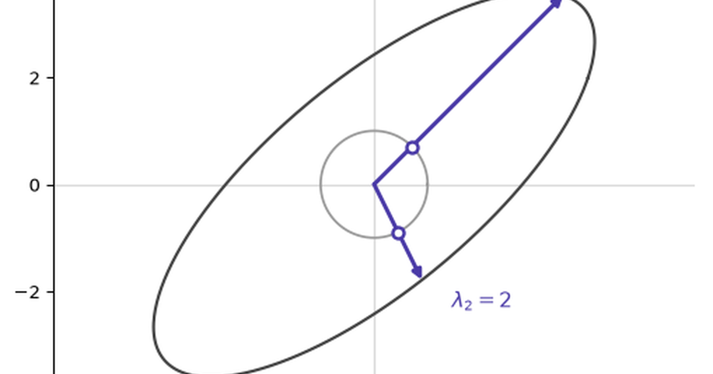

A square matrix reveals its natural axes when some vectors are only stretched, not rotated: $A\mathbf{x} = \lambda \mathbf{x}$. Those vectors are eigenvectors, and $\lambda$ tells us how much the matrix scales each one.

## Eigendecomposition

A unit circle becomes an ellipse. Eigenvectors are directions that stay on their original lines while the circle stretches. For symmetric matrices, those axes are perpendicular.

The trouble starts when the matrix is rectangular: input and output live in different spaces, so a vector cannot keep its direction. A square matrix may also have no real eigenvectors or axes that are not perpendicular. Eigendecomposition is tied to a matrix's coordinate system.

## Singular Value Decomposition

SVD removes those restrictions. It writes $A = U\Sigma V^T$. First, $V^T$ chooses a perpendicular input grid. Then $\Sigma$ stretches or collapses those directions by the singular values. Finally, $U$ rotates them into a perpendicular output grid.

The unit sphere therefore becomes an ellipsoid, even when $A$ changes dimension. The singular vectors identify the input directions with the strongest and weakest effects, which makes SVD useful for compression, denoising, and ill-conditioned models.

Eigenvectors keep their own direction; singular vectors map one orthogonal basis to another.

Axes. Stretch. Rotate. Grids. Map. Scale. Compress. Compare. Choose. Wisely.
