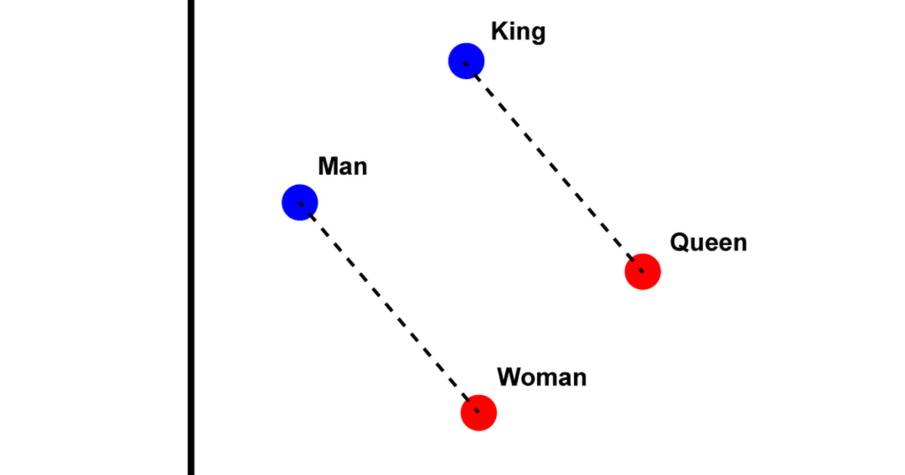

A computer can compare two numbers in a single instruction and has no instruction for
comparing two sentences, two photographs or two seconds of speech. An embedding is the
bridge: a learned function that turns each of those objects into a vector of a few
hundred numbers, arranged so that objects which mean similar things land near each
other. Once that is done, "how similar are these" becomes "how far apart are these",
and every tool that works on distances, nearest-neighbour search, clustering, a linear
classifier, works on words, pictures and voices. This post says what the idea is, how
the three modalities each learn it, and where the geometry stops meaning what it
seems to.

## The idea is one, and it is older than deep learning

A one-hot code for a vocabulary of fifty thousand words is a vector of fifty thousand
zeros and one one. Every pair of words is exactly as far apart as every other pair, so
the code carries identity and nothing else. An embedding replaces it with a dense
vector of, say, 300 numbers whose values are learned so that words used in similar
contexts end up close. *King* and *queen* are near each other; *king* and *carburettor*
are not. The learning signal is always some version of the same bet: things that occur
together, or that a model must treat alike to do its job, should be placed together.

The famous demonstration is that the placement is not only near-or-far but has
directions in it. In word2vec's space,

$$
\text{king} - \text{man} + \text{woman} \approx \text{queen},
$$

which holds well enough to be striking and badly enough that it should be read as a
tendency, not a law. It is the reason the field talks about embeddings as geometry.

## Each modality learns the geometry from a different signal

- **Text.** word2vec and GloVe learn one vector per word from co-occurrence: predict a
  word from its neighbours, or factorise the count of how often words appear together.
  FastText adds subword pieces, so a rare or misspelled word still has a vector.
  Transformer models (BERT, and the encoders behind sentence-embedding models) produce
  *contextual* embeddings: the same word gets a different vector in each sentence, and
  a whole sentence or document gets one vector, which is what retrieval systems index.
- **Images.** A convolutional network (ResNet, EfficientNet) or a vision transformer
  trained to classify images learns, in its penultimate layer, a vector that separates
  the classes, and that vector transfers: two photographs of the same kind of thing are
  near each other even for kinds the network never saw as a class. Self-supervised
  methods (SimCLR, DINO, masked autoencoders) learn the same kind of vector with no
  labels at all, by insisting that two crops or augmentations of one image land
  together. CLIP trains an image encoder and a text encoder into one space, so a photo
  and its caption are neighbours.
- **Voice.** Before deep learning the standard was hand-built: mel-frequency cepstral
  coefficients summarise the spectrum of a short frame of audio. Self-supervised models
  (wav2vec 2.0, HuBERT, WavLM) now learn frame-level vectors from raw audio by
  predicting masked pieces, and those vectors carry the phonetic content. Speaker
  models (x-vectors, ECAPA-TDNN) learn a vector per recording that captures who is
  talking rather than what is said, so recordings of one person cluster.

The table is the same row three times: an input, an encoder, a vector, a task that
uses distance.

| | Input | Encoder | Vector carries | Used for |
|---|---|---|---|---|
| Text | tokens | word2vec, transformer | meaning, context | search, RAG, classification |
| Image | pixels | CNN, ViT, CLIP | visual content | retrieval, face recognition |
| Voice | waveform, spectrogram | wav2vec, x-vector | phonetics, speaker | transcription, verification |

## The geometry promises less than it seems to

Three cautions come with every embedding space.

The space is only as good as the training signal. Word vectors learned from web text
place words near each other by how they are used, including the biases in how they
are used; a model that never saw medical text has no useful geometry for it. The
right embedding model is the one trained on data like yours.

Distances are meaningful *within* one model and meaningless across two. A vector from
one sentence-embedding model cannot be compared with a vector from another, and even
two training runs of the same model produce spaces that differ by a rotation. Whatever
is indexed has to be re-embedded when the model changes.

And nearness is one number for a many-sided relation. Two sentences can be close
because they share a topic, a sentiment, a register or a length; the embedding
collapses all of those into one distance, and which one dominates is whatever the
training task rewarded. That is why a retrieval system's failures, in
[retrieval-augmented generation](../retrieval-augmented-generation/), are so often the
right topic and the wrong fact.

Meaning. Becomes. Geometry. Distance. Becomes. Similarity. Modality. Changes. Encoder. Not. Idea.

## References

- Mikolov, T. et al. (2013). Efficient estimation of word representations in vector
  space. [arXiv:1301.3781](https://arxiv.org/abs/1301.3781)
- Pennington, J., Socher, R. and Manning, C. (2014). GloVe: global vectors for word
  representation. *EMNLP*.
- Devlin, J. et al. (2019). BERT. [arXiv:1810.04805](https://arxiv.org/abs/1810.04805)
- Radford, A. et al. (2021). CLIP. [arXiv:2103.00020](https://arxiv.org/abs/2103.00020)
- Baevski, A. et al. (2020). wav2vec 2.0. [arXiv:2006.11477](https://arxiv.org/abs/2006.11477)
- Desplanques, B., Thienpondt, J. and Demuynck, K. (2020). ECAPA-TDNN. *Interspeech*.
