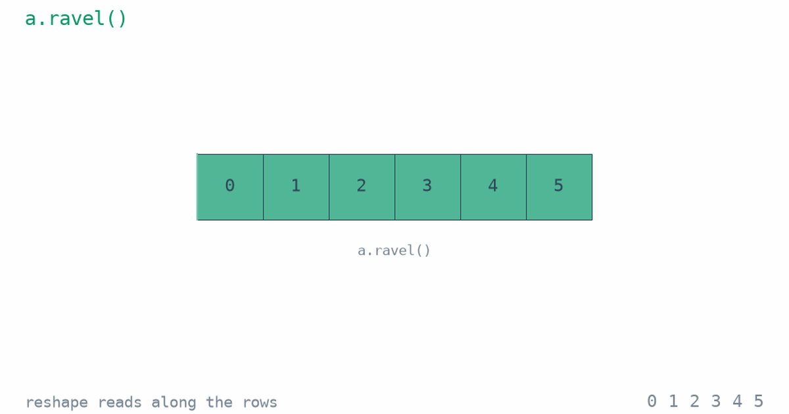

[Brian Ripley](../brian-ripley-rousseeuw-prize/) always said that everything in
R is a vector. The rule also explains tensors.

Ask R for `length(3)` and it answers 1. A matrix is a vector
too, with a `dim` attribute that says how to fold it. Set `dim(x) <- c(2, 3, 4)`
on 24 numbers and you have a three-way array, its numbers in their original
order.

I think he may have said simply that everything is a vector. That holds outside
R too: NumPy stores a tensor as one flat run of numbers, plus the shape and step
sizes for reading it. A NumPy transpose changes the reading, not the numbers.

I've been putting together a workshop,
[Tensors for Machine Learning](https://project-delphi.github.io/tensors-workshop/),
for Universidad El Bosque in Bogotá on 2 October. It starts from the same place:
one number, then a vector, a matrix, a tensor.

Numbers. Sit. In. Line. Shapes. Fold. Them. Into. Tensors.

## References

- Kalia, R. (2026). [The Professor Who Let Us Break R First](../brian-ripley-rousseeuw-prize/).
- Kalia, R. (2026). [Tensors for Machine Learning](https://project-delphi.github.io/tensors-workshop/). Workshop, Universidad El Bosque, Bogotá.
