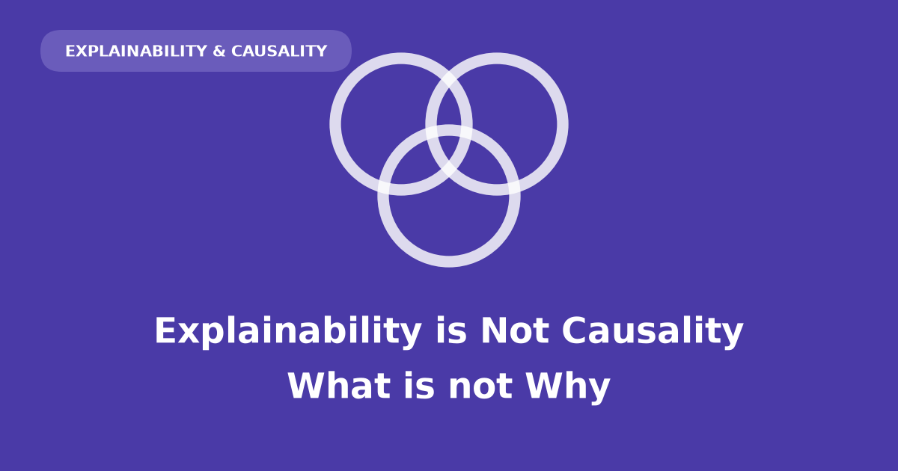
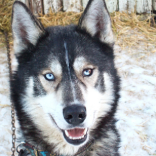
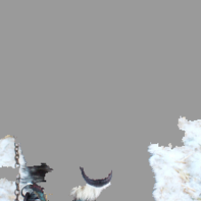
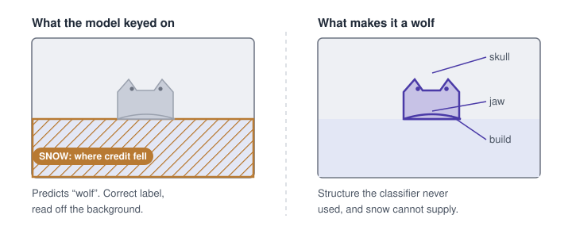
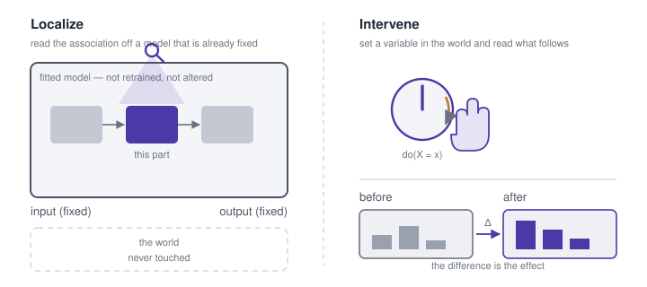
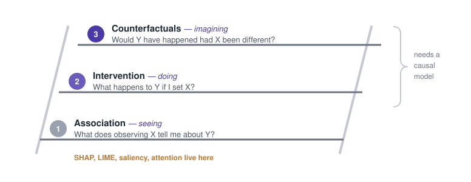

## The snow explained the prediction; it never made the animal a wolf

You fit a model that predicts which customers will cancel, and then you want to know what the
model is keying on. So you run the standard tool for that: something that takes one prediction
and splits the credit for it across the input features, handing back a bar per feature. SHAP is
the usual choice. You stare at the chart, and tenure — how long the customer has been with you
— has the longest bar. Somebody says: *so tenure is what's causing churn, let's go extend
tenure.* Reasonable sentence. It does not follow from anything on the screen.

The cleanest demonstration is a decade old, and it was rigged on purpose. Ribeiro and
colleagues wanted to know whether an explanation would expose a model that was right for the
wrong reason, so they built one: a husky-versus-wolf classifier trained on 20 images
hand-picked so every wolf had snow behind it and no husky did. Asked which pixels it used, the
model said snow — accurate, and nonsense as a causal claim. Snow does not make an animal a
wolf.

The rigging is the only artificial part. On a training set nobody curated for you, a
correlation like that arrives unannounced — a background, a watermark, a quirk of which images
happened to get collected — and the attribution chart looks exactly the same whether the
feature it names is the mechanism or the accident.

::: {layout-ncol=2}

:::

*Reproduced from [Ribeiro, Singh & Guestrin (2016)](https://arxiv.org/abs/1602.04938), Figure 11,
for commentary. Shown only predictions, 10 of 27 graduate students trusted this classifier;
shown the explanation, 3 did, and those naming snow as its evidence rose from 12 to 25.*

Both fields use the same words — *why*, *because*, *important*, *counterfactual* — and mean
something different by each.

## Explainability localizes: which part of a fixed model moved this output

Attribution answers a question about an input-output association: given this model and this
input, which parts account for the output? The methods differ mainly in what counts as a part.
A saliency map scores pixels by how much nudging each one would move the output. SHAP and LIME
divide credit among features — LIME by fitting a simple readable model to the neighbourhood of
that one input, and reading the explanation off the stand-in. Attention visualisation reads out
which tokens the model weighted. Different notions of a part, one operation.

The scope is narrower than the language suggests: one model, one instance, one prediction. The
model is already fitted and stays that way, so what comes back is a property of a correlation
it learned — which may be a real mechanism, an artifact of collection, or snow. The chart
cannot tell you which, because the procedure never consults the world.

## Causality intervenes: change something and watch what follows

Consulting the world is what the other tradition does. A causal claim is bought by intervening
— setting a variable rather than observing it — and watching what moves. A randomized trial, an
A/B test, a natural experiment standing in when neither can be run.

Questions about the world sort into three kinds, and they do not substitute for one another.
Seeing: what tends to occur alongside what. Doing: what follows if I set a variable myself
rather than waiting to observe it. Imagining otherwise: what would have happened to this
particular case had things gone differently. Judea Pearl arranged the three as a ladder, and
the arrangement makes the gap structural rather than a matter of rigour — no quantity of
seeing-data answers a doing-question without assumptions carried in from outside the data.

Hence the asymmetry in cost. The model
is already on disk, so you can localize this afternoon; the world is not, and it only tells you
what it does when you change it.

## The same words, asking two different questions

Neither tradition is confused about which rung it stands on. Each method is honest about its
own question; the confusion is entirely in the reading, and it survives because the two
vocabularies overlap almost exactly. Laid out side by side, with the question each method
answers written next to what it actually computes, the overlap stops being able to hide.

| Field | Method | Question it answers | What it actually does |
|---|---|---|---|
| **Explainability** ("what") | Feature attribution (SHAP, LIME, Integrated Gradients) | "What inputs drove this prediction?" | Assigns credit/weight to each input feature for a specific output |
| | Saliency maps / Grad-CAM | "What part of the input did the model look at?" | Highlights regions (e.g. pixels) with highest influence on output |
| | Attention visualization | "What did the model attend to?" | Surfaces attention weights in transformer-style models |
| | Surrogate models | "What simple rule approximates this decision?" | Builds an interpretable stand-in for a local region of behavior |
| | Counterfactual explanations (ML sense) | "What's the smallest input change that flips the output?" | Finds a minimally-different input the model classifies differently |
| | Concept activation vectors (TCAV) | "What human-understandable concept does this correspond to?" | Tests whether a learned direction in activation space aligns with a concept |
| **Causality** ("why") | Randomized controlled trials (RCTs) | "Does X cause Y?" | Physically intervenes on X (randomly) to rule out confounding |
| | Causal graphs / DAGs (Pearl) | "What's the causal structure connecting these variables?" | Encodes assumed cause-effect relationships |
| | Do-calculus (Pearl) | "What happens if we intervene on X?" | Formal rules for computing intervention effects from observational data + a causal graph |
| | Instrumental variables | "Does X cause Y, despite unmeasured confounding?" | Uses a variable affecting X but not Y directly, to isolate the causal effect |
| | Difference-in-differences / Regression discontinuity | "Did this policy/event cause the change?" | Exploits natural experiments to approximate randomization |
| | Counterfactual reasoning (Pearl's rung 3) | "Would Y have happened if X hadn't?" | Uses a fitted causal model to answer individual-level counterfactuals |

The two counterfactual rows are the trap: same name, different rungs. An ML counterfactual
searches the input space for the nearest point the *model* labels differently — a fact about a
decision boundary, rung one. Pearl's asks what would have happened to *this unit* had the
treatment differed, which needs a structural model to answer at all.

## Causal explainability moves the intervention inside the model

There is a way to take the rung-two move seriously without leaving your laptop, and it starts
by noticing what is cheap to intervene on: the network. The gap has its own literature, and the
move is always the same — stop asking whether a feature covaries with the output, and start
asking whether it survives an intervention on the model's internals. Delete a concept from the
representation and re-run the forward pass. Or take the activations one input produced at some
layer, paste them in while the model processes a different input, and measure how far the
output travels.

What that buys is a causal claim *about the network* — this component carries this behaviour —
earned by intervening on internals rather than searching inputs, which is what separates it
from the ML counterfactual above. Whether the world works that way is a separate question,
still answered the slow way.

## What a model did is not why the world works

So the bar chart you started with was never going to answer the question asked of it. Tenure's
long bar is a fact about your model's decision surface. Whether extending tenure would keep
anyone is a fact about your customers, and the only instrument that reaches it is extending
tenure for some of them and not others.

Explainability tells you what a model did. Causality tells you why something happens. The first
is a fact about an artifact you built, priced at one forward pass; the second is a fact about
the world, and the world charges more. Reading the first as the second is the most common
conceptual error in applied ML — and the snow-covered wolf is still the cheapest cure.

## References

- Ribeiro, M. T., Singh, S. & Guestrin, C. (2016). ["Why Should I Trust You?": Explaining the
  Predictions of Any Classifier](https://arxiv.org/abs/1602.04938). *KDD* — LIME, and the
  husky-versus-wolf classifier that keyed on snow.
- Lundberg, S. M. & Lee, S.-I. (2017). [A Unified Approach to Interpreting Model
  Predictions](https://arxiv.org/abs/1705.07874). *NeurIPS* — SHAP.
- Sundararajan, M., Taly, A. & Yan, Q. (2017). [Axiomatic Attribution for Deep
  Networks](https://arxiv.org/abs/1703.01365). *ICML* — integrated gradients.
- Kim, B. et al. (2018). [Interpretability Beyond Feature Attribution: Testing with Concept
  Activation Vectors (TCAV)](https://arxiv.org/abs/1711.11279). *ICML*.
- Wachter, S., Mittelstadt, B. & Russell, C. (2018). [Counterfactual Explanations Without
  Opening the Black Box](https://arxiv.org/abs/1711.00399). *Harvard Journal of Law &
  Technology* 31(2) — the ML sense of "counterfactual".
- Goyal, Y. et al. (2019). [Explaining Classifiers with Causal Concept Effect
  (CaCE)](https://arxiv.org/abs/1907.07165) — attribution under intervention rather than
  correlation.
- Vig, J. et al. (2020). [Investigating Gender Bias in Language Models Using Causal
  Mediation Analysis](https://papers.nips.cc/paper/2020/hash/92650b2e92217715fe312e6fa7b90d82-Abstract.html).
  *NeurIPS* — activation patching inside a network.
- Pearl, J. (2009). *Causality: Models, Reasoning, and Inference*, 2nd ed. Cambridge — the
  do-operator and do-calculus.
- Pearl, J. & Mackenzie, D. (2018). *The Book of Why*. Basic Books — the ladder of causation.
- Angrist, J. D., Imbens, G. W. & Rubin, D. B. (1996). [Identification of Causal Effects Using
  Instrumental Variables](https://doi.org/10.1080/01621459.1996.10476902). *JASA* 91(434).
- Card, D. & Krueger, A. B. (1994). [Minimum Wages and Employment: A Case Study of the Fast-Food
  Industry in New Jersey and Pennsylvania](https://www.jstor.org/stable/2118030). *American
  Economic Review* 84(4) — difference-in-differences.

Both halves of this post have a long-form treatment elsewhere on this blog:
[Explainability Is a Localization Problem](../explainability-localization/) works through eight
attribution methods on MNIST and Fisher's irises, and [How Causality Works: From Toddlers to
Do-Calculus](../causality-from-toddlers-to-do-calculus/) works through DAGs, potential outcomes
and uplift on a pair of product decisions.
