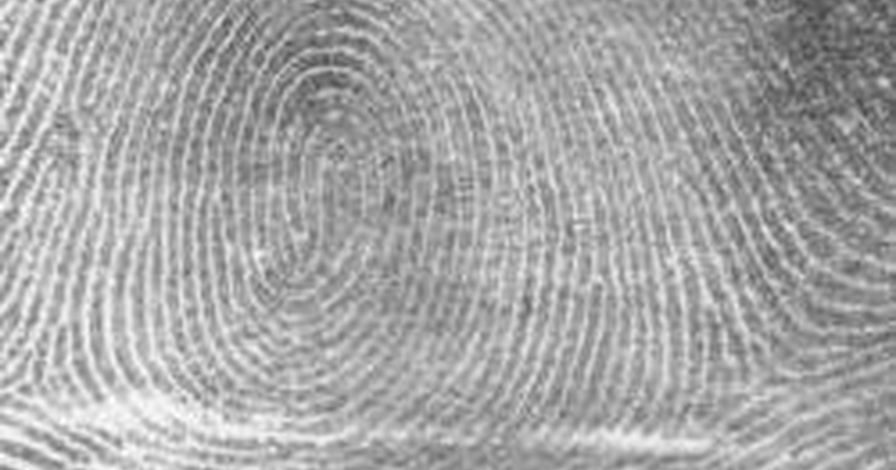
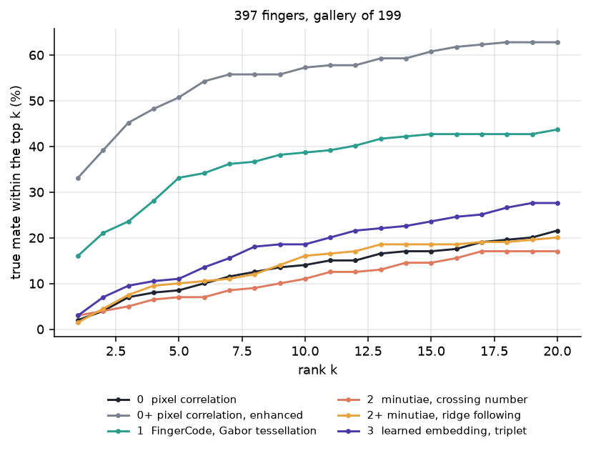

You unlock a phone with your thumb a hundred times a week. It works when your thumb is wet, turned forty degrees off, pressed too hard, or only half on the glass. It fails when you offer a different finger.

The strange part is that the phone has no picture of your thumb. There is nothing in it to compare a photograph against. At enrolment it threw the picture away and kept something much smaller, and every unlock since has been a comparison between two of those smaller things.

So the interesting question is not "how do you match a fingerprint". It is **what do you keep**, and what survives when the capture is bad. This post builds four answers to that question, using 397 real inked fingers from NIST, and scores all four against one shared gallery of two hundred of them. One of the four is a modern metric-learning network. It does not win, and the reason it does not win turns out to be the most useful thing here.

If you have trained a classifier, you already have most of the machinery for this. Matching *is* classification: each enrolled finger is a class, and a probe image has to be assigned to one of them. What makes it strange is the shape of the training data. There is one example per class, the classes are created after the model ships — you enrol a new thumb and nobody retrains anything — and there are as many classes as there are enrolled fingers. Those three conditions break the usual recipe of a softmax over a fixed label set, which is why the work moves out of the decision rule and into the representation. So the post compares four answers to "what do you keep", under one decision rule held fixed.

## A pattern nobody chose, not even your genome

Friction ridges form on the volar pads between roughly week 10 and week 17 of gestation. The basal layer of the epidermis is a stiff sheet growing on a soft foundation, and it is being compressed as the pad underneath it swells and then regresses. A stiff sheet under compression on a soft bed does not stay flat. It buckles, into a regular corrugation, at a wavelength set by the mechanics rather than by any instruction.

Kücken and Newell (2005) fit that picture to fetal pad geometry: ridge direction follows the lines of the compressive stress field, and the pattern type — loop, whorl, arch — falls out of the pad's shape and timing. The same periodic stripes can be produced by a Turing reaction–diffusion system, which is why chemistry is the intuitive guess, but the model that matches the embryology is mechanical.

::: {.callout-note}
## Where the ridge spacing comes from

For a stiff film of thickness $h$ and modulus $E_f$ bonded to a soft substrate of modulus $E_s$, compression buckles the film at the wavelength that minimises the total energy — bending the film wants long waves, deforming the substrate wants short ones. The balance gives the classical wrinkling result

$$
\lambda = 2\pi h \left(\frac{E_f}{3E_s}\right)^{1/3}.
$$

What matters is not the constant but that $\lambda$ depends only on a thickness and a stiffness ratio, so a patch of skin has a ridge period whether or not anything told it what period to have. Every filter in this post has to be tuned to that period, and measuring it per print is the first thing the code does.
:::

Once the epidermis keratinises the pattern is fixed for life, scars aside. And identical twins, who share a genome, do not share ridge detail — the minute arrangement of endings and forks differs between them, and between your own two index fingers. That is what makes this a usable identifier: the thing being measured is a developmental accident, not an inherited plan, so it is effectively a per-finger random draw that then never changes.

A [biological signature](../what-is-a-biological-signature/) in the molecular sense is a short list of features that stands in for a condition. A fingerprint template is the same move performed on skin. The engineering problem is to make the standing-in deterministic, so that two captures of one finger reduce to the same object and two captures of different fingers do not.

## 397 fingers, twice each, and what it cost to standardise them

Everything measured here comes from one cache, so here is what is in it before anything is asked of it.

- **What it is.** NIST's MINEX III validation imagery: 801 raw 8-bit grayscale scans of inked fingerprint cards at 500 dpi, from the `usnistgov/minex` repository (commit `dc57b22`), released into the public domain as a US Government work. Retrieved 2026-09-12; the built cache is 20.3 MB, sha256 `426f1ccf…`.
- **Who made it and why.** NIST publishes it so that vendors' minutiae extractors and matchers can be validated against a common set before certification. It exists *to be a benchmark*, which is exactly why it is safe to use as one, and why the results here are not a comment on anyone's product.
- **The structure that makes it a test.** Files are named `<set><subject>_<position>` — `a001_02` is set A, subject 001, right index. Sets A and B are two separate impressions of the same finger. Two impressions is the minimum that makes identification measurable: enrol one, search with the other, and ask which enrolled finger comes back first. 397 fingers have both impressions, giving 794 images; the remaining seven scans have no mate in the other set and are dropped.
- **What this post asks of it.** Rank-1 identification against a gallery of two hundred fingers, and an equal error rate for the one-against-one case. Nothing about latents, and nothing about live sensors — these are inked cards.
- **What a wrong answer costs.** In the deployed version of this problem, a false accept opens someone else's phone and a false reject locks you out of your own. Those two errors trade against each other, which is why one accuracy number is never enough and the tables here carry both.

Each scan is put on one scale and one centre by `src/fetch_data.py`, and that step makes a trade which bites one of the four methods later:

```{python}
#| eval: false
# src/fetch_data.py -- standardise(), abridged
own = ridges.analyse(img).period        # this print's own ridge period
zoom = period / own                     # resample every print to a common period
source = img.astype(np.float64)
if zoom < 1:
    # Anti-alias before shrinking. Resampling a 10-pixel ridge period down to 6
    # without it folds the ridges back as high-frequency noise.
    source = ndimage.gaussian_filter(source, 0.5 / zoom)
scaled = np.clip(ndimage.zoom(source, zoom, order=1), 0, 255).astype(np.uint8)
```

Two things vary between cards for reasons that have nothing to do with whose finger it is: how large the print was rolled, and where on the card it landed. Both are removed — every print is resampled to a ridge period of 6 pixels and cropped to a 192-pixel square centred on its inked area. Everything a matcher has to survive is left in: rotation, ink coverage, elastic distortion of the skin, damage, and how much of the finger the roll caught.

The cost is resolution. The source scans run a median ridge period of 11.5 pixels and the cache halves that, which keeps the whole print inside a small square — necessary, because the methods that measure global ridge flow lose about four times the accuracy on a sensor-sized window at full resolution. Ridge *flow* survives the resampling comfortably. Individual ridge endings and forks do not, and that is a debt the landmark methods pay in full.

One more thing about the data, because it explains a lot of the spread later: this imagery is not uniformly good. Over 80 randomly drawn prints, the ridge mask covers a median 56% of the frame, seven prints fall under 10%, and on three of them the analysis finds no reliable ridge region at all. NIST's own quality grade correlates only about 0.56 with that coverage, so grade is informative and not decisive.

## The task is classification with one example per class

Two impressions per finger is what makes the problem measurable, and it also fixes the vocabulary every table later is read in.

One impression of each finger is **enrolled** — stored, and treated as the reference copy. The stored set is the **gallery**. The other impression is the **probe**: the image handed over with the question "whose is this?". A probe scored against its own finger's gallery entry is a **genuine pair**, and against any other entry an **impostor pair**. The entry that belongs to the probe is its **mate**.

Put that way, identification is a classification problem with the labels supplied by the gallery. There are 199 test fingers — the 397 are split in half by finger, and the half used for scoring is the half nothing was fitted on — so there are 199 classes, the gallery holds one labelled example of each, and the probe is the point to be labelled. A method answers by scoring the probe against all 199 entries and sorting them.

Three of the numbers in the results tables are then familiar quantities under biometric names:

- **Rank-1** is top-1 accuracy: how often the highest-scoring entry is the mate.
- **Rank-5** is top-5 accuracy: how often the mate is anywhere in the first five.
- **Median rank** is where the mate typically lands in the sorted 199. It reports what rank-1 hides — a method can almost never be right first and still put the mate reliably near the top, or scatter it.

With 199 classes and one example each, guessing gives a rank-1 of $1/199 = 0.005$. Anything near half a percent is a method saying nothing.

The obvious next move would be to train a 199-way softmax on the gallery and read off the argmax. No method here does that, for two reasons that belong to the deployed problem rather than to this dataset. There is one example per class, so a per-class decision boundary has nothing to be fitted to. And the label set is not fixed: enrolling a finger creates a class, and no phone retrains a network when someone adds a thumb. A method that must be refitted whenever the classes change cannot ship.

So the decision rule is nearest neighbour, and it is held fixed for all four methods: encode the probe, score it against every gallery entry with whatever similarity the method defines, take the best. The comparison in this post is never between classifiers. It is between the representations that similarity is computed on, which is what "what do you keep" is asking.

### The other question is a binary classifier over pairs

A phone is not searching a database. It has a claim — this is the enrolled thumb — and has to answer yes or no. That is **verification**, and it is binary classification over *pairs*: genuine or impostor, decided by a threshold on the score.

Two errors trade against each other there. Set the threshold low and impostor pairs get accepted; set it high and genuine pairs get rejected. Sweeping the threshold traces the **false accept rate** up as the **false reject rate** comes down, and the **equal error rate** is the error rate at the threshold where those two meet — one number summarising the trade. Lower is better, and 0.5 means the threshold is doing no work at all.

**d′** asks a blunter question: is there a usable threshold at all? Score every genuine pair and every impostor pair and you have two distributions. d′ is the gap between their means, measured in pooled standard deviations. Near 0 the two sit on top of each other, and no threshold separates them however the ranking looks.

The identification numbers here are **closed-set**: the probe's finger is always somewhere in the gallery, so a right answer always exists to be found. Searching a gallery that might not hold the probe's finger at all is open-set identification, and it is strictly harder, because the system also has to decide when its best match is still not good enough. That decision is a threshold — the same instrument verification needs, which is why a search system ends up caring about both columns.

### Four answers, keeping less each time

With the decision rule fixed, what remains is the representation, and the four built here keep progressively less of the image:

1. **The pixels themselves**, raw and then enhanced.
2. **A fixed-length measurement of ridge flow**, cell by cell.
3. **A list of landmark points**, with the image thrown away.
4. **128 floats a network chose**, with nobody telling it what a ridge is.

Three of the four need to know which way the ridges run before they can start.

## Everything downstream needs to know which way the ridges run

Before any method can describe a print, it has to answer a smaller question at every point: which direction do the ridges run here, and how far apart are they? The answer is computed once and shared, so every method that needs it is reading the same geometry.

Direction is the awkward part, because a ridge has no arrowhead. A ridge running north-east is the same ridge running south-west, so the two gradient directions $\theta$ and $\theta + \pi$ are the same answer. Averaging them naively cancels them out. The fix is to average the *doubled* angle, where the two agree instead of opposing:

$$
\theta = \frac{1}{2}\operatorname{atan2}\!\left(2\sum g_x g_y,\; \sum\left(g_x^2 - g_y^2\right)\right) + \frac{\pi}{2}.
$$

```{python}
#| eval: false
# src/ridges.py -- orientation()
gy, gx = np.gradient(ndimage.gaussian_filter(x, 1.0))
gxx, gyy, gxy = blocks(gx * gx, block), blocks(gy * gy, block), blocks(gx * gy, block)
num, den = 2 * gxy, gxx - gyy
theta = 0.5 * np.arctan2(num, den) + np.pi / 2   # gradient normal -> ridge tangent
coherence = np.hypot(num, den) / (gxx + gyy + 1e-12)
```

That second line out is `coherence`: how single-minded the gradients in a block are. It runs near 1 on clean parallel ridges and near 0 on blank card, which makes it the natural measure of whether a block is worth trusting.


With direction and period in hand, the enhancement step is a **directional comb**. A Gabor filter is a sinusoid wrapped in a Gaussian envelope — it has teeth at one spacing, running in one direction — and combing a patch of ridges along the direction they already run reinforces them, while noise that runs across the teeth is flattened:

$$
g(x,y;\lambda,\theta,\psi,\sigma,\gamma)
=\exp\left(-\frac{x'^2+\gamma^2 y'^2}{2\sigma^2}\right)
\cos\left(2\pi\frac{x'}{\lambda}+\psi\right),
$$

with $x'=x\cos\theta+y\sin\theta$ and $y'=-x\sin\theta+y\cos\theta$. $\lambda$ is the ridge period, $\theta$ the local orientation, $\sigma$ the envelope width. Use the wrong $\theta$ and the comb fights the ridges instead of combing them, which is why the orientation field has to come first (Hong, Wan and Jain, 1998).

```{python}
#| eval: false
# src/enhance.py -- enhance(): filter with the whole bank, then select per pixel
bank = gabor_bank(img, analysis)                  # one filtered copy per orientation
theta = _fit(np.kron(analysis.theta, np.ones((BLOCK, BLOCK))), img.shape)
idx = np.round(theta / (np.pi / ORIENTATIONS)).astype(int) % ORIENTATIONS
return np.take_along_axis(bank, idx[None], axis=0)[0]
```


## Keeping the picture: slide the two prints over each other

The first answer is the one that does the least. Keep the image, and compare two prints by how well they line up — no landmarks, no training, and in its plainest form no model of what a fingerprint is at all. That plain version is the control the other answers have to beat: a representation that keeps less than the picture has to earn what it threw away.

It runs here in two versions, and the second is not plain. One correlates the raw scans. The other correlates the same prints after the Gabor comb, so it does lean on the ridge geometry. Scoring both puts a number on what the enhancement alone is worth, with no descriptor involved — and the second version turns out to beat everything else in the post.

One thing has to be handled even so. Two impressions of a finger never land in the same place on the card, so comparing them pixel against pixel in place compares a ridge in one with a valley in the other and reports almost nothing. The repair is to let one image slide over the other and keep the best alignment found. Correlation at every possible shift costs one Fourier transform per image rather than one comparison per offset, so "try every alignment" is cheaper than it sounds:

```{python}
#| eval: false
# src/pixels.py -- match_all(): best shift-aligned correlation, via the FFT
probe_f = np.fft.rfft2(probe)
gallery_f = np.fft.rfft2(gallery, axes=(-2, -1))
surface = np.fft.irfft2(gallery_f * np.conj(probe_f), s=probe.shape, axes=(-2, -1))
return surface.reshape(len(gallery), -1).max(axis=1)
```

Sliding is allowed because the prints are centred on their inked area, which moves with how much of the finger each roll caught. Rotation is *not* allowed. Handling it here would mean rotating the probe, transforming it again, and taking a fresh inverse transform against every one of the 199 gallery entries — the entire search, once per angle tried. Being unable to afford that is why the later methods describe a print in terms that do not change when the finger turns.

## Keeping the flow: comb the print, then count the energy cell by cell

Correlation compares two prints only as wholes. The next answer keeps a *description* instead — a fixed-length vector, computed from one print without reference to any other, so that comparing two prints is comparing two vectors. This is the familiar shape of a feature extractor, and it buys what a fixed-length vector always buys: a template of known size, and a comparison between two short vectors rather than between two images.

Jain, Prabhakar, Hong and Pankanti (2000) built one out of the filter bank already in hand, the FingerCode. Lay a polar tessellation over the print — concentric rings cut into wedges — and for each cell record how much energy each Gabor orientation puts into it. A cell where the ridges run north-east answers strongly in the north-east filter and weakly in the others, so the vector is a map of *which way the ridges run where*, at a fixed resolution. Concatenate the cells and the size is the same whatever the print looked like: here 4 rings cut into 16 wedges gives 64 cells, times 8 orientations.

The elegant part is what happens when the finger turns. Rotating the print moves energy around the tessellation in a completely predictable way: the wedges shift round by some number of sectors, and the ridge directions shift by a matching number of orientation bins. So comparing against a rotated version of a print costs two array rolls instead of re-filtering a rotated image:

```{python}
#| eval: false
# src/enhance.py -- rotations(): every whole-sector rotation of a FingerCode
for s in range(sectors):
    # Sectors divide a full turn and orientations divide a half turn, so s
    # sectors of rotation is s * 2 * orientations / sectors orientation bins.
    bins = int(round(s * 2 * orientations / sectors)) % orientations
    yield np.roll(np.roll(code, s, axis=2), bins, axis=0)
```

That comment is load-bearing. Rolling the histogram by half as far as the tessellation leaves every candidate but the zero-rotation one comparing a turned tessellation against unturned ridge directions, and a print rotated 90° then scores 0.78 against itself instead of 1.00.

The claim is checkable, so the third panel checks it. Turn a print ninety degrees, recompute its descriptor from scratch, and score it against the original at all sixteen assumed rotations:


## Keeping the landmarks: throw the picture away and keep the constellation

The FingerCode still describes the print everywhere, at a fixed grid of cells. The third answer keeps far less: a few dozen points, and nothing else. This is what an examiner means by a fingerprint, and what every automated system meant by one until the 2010s.

The idea is that most of a print is redundant. Ridges run parallel over most of their length, and parallel ridges look like every other patch of parallel ridges. What distinguishes one finger is where that regularity *breaks* — a ridge stops, or a ridge splits. Record only those places, as a list of points $(x, y, \theta)$ with a position and the direction the ridge was heading, and throw the image away.

Two properties follow, and they are why this representation outlived the others. A list of points carries no orientation of its own, so rotating the finger rotates the list and nothing else — rotation is handled by construction rather than by searching. And a partial print still yields the landmarks it contains, so a fragment is a shorter list rather than a corrupted image.

Finding them is a local counting exercise. On a skeleton one pixel wide, walk the eight neighbours of a pixel in a ring and count how many times the ring flips between skeleton and background. In the middle of a ridge it flips twice. One flip is a ridge ending; three is a bifurcation:

```{python}
#| eval: false
# src/minutiae.py -- crossing_number(): half the flips around each pixel's ring
ring = np.stack([np.roll(np.roll(skel, -dy, 0), -dx, 1) for dy, dx in _RING])
changes = np.abs(ring.astype(np.int8) - np.roll(ring, -1, axis=0).astype(np.int8))
return changes.sum(0) // 2
```

Matching two such lists is the hard half, and the right way to picture it is **constellation alignment**. You have two star charts of the same patch of sky, taken with different cameras, at different rotations, with different amounts of cloud. Neither chart is complete and neither is quite to scale. You are not asked whether the two images look alike; you are asked whether the same *arrangement* of stars appears in both.

::: {.callout-note}
## Registering constellations: Kendall shape and Procrustes distance

Treat the minutiae as labelled landmarks. Two impressions of one finger differ by a translation, a rotation, and — after standardisation — very nearly a scale. Quotient those out and what is left is the print's *shape* in the sense of [Kendall shape analysis](../kendall-shape-analysis/): a point in a space where two configurations are the same point when some similarity transform carries one to the other.

For landmark matrices $X$ and $Y$, centred and normalised to unit size, the Procrustes distance is the residual after the best rotation:

$$
d_P(X, Y) = \min_{R \in SO(2)} \lVert X - Y R \rVert_F ,
$$

solved in closed form by the SVD of $Y^\top X$. It is the right way to compare two constellations — *if* you already know which star corresponds to which.

That proviso is the whole difficulty. Procrustes needs correspondences, and correspondences are what a fingerprint matcher does not have. So this method sidesteps the transform entirely: each minutia is described by its own neighbourhood in its own frame of reference — how far its neighbours sit, in what direction relative to the way it points, and which way they point. Such a description does not change when the finger rotates, so two prints are compared by matching descriptions rather than by searching for an alignment. That is the idea behind Cappelli, Ferrara and Maltoni's Minutia Cylinder-Code (2010), in a smaller form.
:::


### This measures the extractor, not minutiae matching

Here is the uncomfortable result, stated before the table rather than after it. On this cache, the minutiae method identifies a few percent of probes. Plain correlation of the enhanced images — the picture with a comb run over it, no landmarks at all — identifies ten times as many.

That is not a fact about minutiae matching. Real automated fingerprint identification systems do well on exactly this imagery, which is why NIST published it. It is a fact about *this extractor*, and the way to show that is to measure the landmarks directly instead of arguing about the score.

The diagnostic is a gate, in the sense that an extractor failing it cannot be rescued by any matcher downstream. Take two impressions of one finger and register them by their ridge flow, searching over rotation and shift for the alignment that best correlates the enhanced images. This hands the matcher the transform it would otherwise have to find, so nothing that follows can be blamed on a bad alignment. Then ask the only question that matters — what fraction of the landmarks in one impression have a landmark in the other within a ridge period of them? Call that the **landing rate**: a landmark that lands is one the extractor found twice.

```{python}
#| eval: false
# src/minutiae_follow.py -- the gate
angle, peak, _ = best_alignment(b_enhanced, a_enhanced, angles)
moved = transform_points(b_min.xy, angle, peak, a_enhanced.shape)
genuine.append(landing_rate(moved, a_min.xy, tolerance))
```

Against an impostor floor — a different finger, registered the same way, whose points overlap by accident at this density — the crossing-number extractor lands **0.137 of its landmarks against a floor of 0.066**, averaged over 60 fingers and three seeds. Roughly twice the floor, which is the same ratio `src/minutiae.py` recorded independently as "about a fifth against a tenth". A neighbourhood descriptor needs the neighbourhood to be stable, and at that rate almost every description is built from mostly different members. No scoring rule can recover a correspondence that was never there, which is why the log of attempts in `src/minutiae.py` — greedy one-to-one pairing, normalising by landmark count, voting on the implied rotation, a full rigid point-pattern search, three binarisations, a pixel-resolution orientation field, three thinning variants — moves none of it.

So the fix has to be a different class of extractor: ridge *following* with a quality map, in the manner of NIST's MINDTCT, rather than crossing numbers on a thinned skeleton. `src/minutiae_follow.py` is that attempt. It finds ridges as crests — the line where the enhanced image is a local maximum measured across the flow, which is a statement about ridge geometry rather than about where a threshold fell — smooths along the flow to close ink gaps, bridges the gaps that survive, and scores every candidate by coherence, ridge strength and distance from the edge of the print:

```{python}
#| eval: false
# src/minutiae_follow.py -- bridge_gaps(): join endpoints that face each other
towards = delta[i, j] / d
# Each endpoint must be heading at the other, not merely near it.
if towards @ tangent[i] < cone or (-towards) @ tangent[j] < cone:
    continue
rr, cc = draw_line(int(ends[i, 1]), int(ends[i, 0]), int(ends[j, 1]), int(ends[j, 0]))
out[rr, cc] = True
```

It behaves better on controls, which `src/minutiae_follow.py --controls` reproduces. On a synthetic ridge field containing no minutiae at all, both extractors correctly return nothing. On a field with a half-period phase step driven across a band — which dislocates every ridge crossing it — both return three landmarks, and the difference is where they put them. The ridge follower's three sit 3, 4 and 3 pixels from the dislocation line. The crossing-number extractor's three sit 9, 44 and 60 pixels from it, which is to say two of them are describing the ink somewhere else entirely. Same count, and only one of the two is looking at the feature. It also finds more landmarks on real prints, and spreads them across the pattern instead of bunching them where the ink is thick.

And it does not help. The table reads landing rate against impostor floor, and **lift** is how much better than chance overlap the extractor manages — the ratio of those two, taken per seed and then averaged. A lift of 1 is an extractor finding nothing a matcher could use:

| extractor | minutiae per print | genuine landing | impostor floor | lift | lift, per seed |
|---|---:|---:|---:|---:|---:|
| crossing number, thinned skeleton | 18 | 0.137 | 0.066 | **2.10** | 1.74 – 2.37 |
| ridge following, quality ≥ 0.15 | 22 | 0.129 | 0.077 | 1.72 | 1.20 – 2.05 |
| ridge following, quality ≥ 0.35 | 13 | 0.095 | 0.059 | 1.61 | 1.33 – 1.84 |
| ridge following, quality ≥ 0.55 | 5 | 0.066 | 0.024 | 3.76 | 1.40 – 6.65 |

Two things about that table before reading anything into it.

**The last column is there because the first draft of this section did not have it.** On a single seed at half this sample, the top two rows came out at 0.156 and 0.155 — a gap of one in the third decimal — and it was tempting to write that a landmark from the new extractor is individually just as repeatable as one from the old. Widen the sample to the code's own default and average over three seeds and that coincidence dissolves: the two extractors' per-seed lifts overlap, 1.74–2.37 against 1.20–2.05. The gate says ridge following is probably worse, and at this sample size it cannot say so cleanly.

**The lift column averages the per-seed ratios; it is not the quotient of the two columns beside it.** Those are the right statistics for different questions — what a typical run gives, against how the pooled landmarks behave — and for the first three rows the two agree to within a couple of hundredths. On the bottom row they do not: averaging the ratios gives 3.76 where dividing the printed means gives 2.75.

That divergence is the warning label. A lift of 3.76 is the largest number in the table and it is an artefact: at quality ≥ 0.55 only five landmarks survive per print, the impostor floor collapses to 0.024, and a ratio with a denominator that small swings between 1.40 and 6.65 depending on which fingers were drawn. When the mean of the ratios and the ratio of the means come apart, the ratio is telling you about the sample rather than the extractor. Ratios of small counts are not measurements.

So the gate is not what convicts the rewrite. What convicts it is the scored comparison, where every one of the 199 test fingers is used instead of a 60-finger subsample: rank-1 0.025 against 0.030, EER 0.488 against 0.482, d′ 0.05 against 0.08. The extra landmarks are real, they are better placed on a synthetic control, and they buy nothing on real prints.

The resampling is the likeliest cause, upstream of every extractor. At a 6-pixel ridge period a ridge ending is a few pixels of evidence, and both extractors are reading a feature the cache no longer resolves. `src/minutiae.py` records that rebuilding the cache at the source period of 11.5 pixels lifts repeatability by about a third — real, nowhere near enough, and it would cost the global ridge flow that the methods which *do* work depend on, so this post keeps the 6-pixel cache and inherits that number rather than re-measuring it. Both minutiae extractors are scored anyway, because a rewrite that fails is worth as much as one that works and costs the reader less to believe. Neither is evidence about minutiae matching as a technique.

## Keeping whatever separates fingers: let the network decide

The first three answers are hand-built. Someone decided that ridge orientation matters, that a Gabor bank is the way to measure it, that endings and forks are the landmarks worth keeping. A metric-learning network is told none of that. It is given pairs and a rule about distances, and has to work out what to measure for itself.

Here the classification framing earns its keep, because the architecture you would reach for first is the wrong one. Train a convolutional network with a softmax head over the training fingers and it will separate those fingers — and the head is then useless, because the fingers it is asked about later are not the fingers it was trained on. Every class it learned to name is a class nobody will ever ask for again.

Metric learning keeps the network and throws the head away. Train on whatever identities are to hand, but supervise the *geometry of the feature space* instead of the labels: pull two impressions of one finger together, push impressions of different fingers apart. The bet is that a space arranged that way for the training fingers stays arranged that way for fingers the network never saw — and then enrolling a new finger is one forward pass, with nothing refitted. It is the same move as in face recognition, and it is why a phone can add a thumb in thirty seconds.

The mental picture is a **field of attractors**. Every finger is a mass placed on the surface of a 128-dimensional sphere, and training pulls the two impressions of one finger into the same well while pushing different fingers' wells apart. Nothing tells the network what a ridge is. It only ever learns that these two images must end up close and those two must not.

For an anchor $a$, a positive $p$ from the same finger, and a negative $n$ from another, the triplet loss is

$$
\mathcal{L}=\bigl[\;\lVert f(a)-f(p)\rVert_2^2
-\lVert f(a)-f(n)\rVert_2^2
+m\;\bigr]_+ .
$$

Picking triplets at random wastes almost every one of them, because most triplets already satisfy the margin and contribute no gradient. The batch-hard form (Hermans, Beyer and Leibe, 2017) takes the *worst* case in each batch instead — for every image, its own mate as the hardest positive and the nearest image of a different finger as the hardest negative:

```{python}
#| eval: false
# src/embed.py -- batch_hard_triplet()
distance = torch.cdist(embeddings, embeddings)
same = labels[:, None] == labels[None, :]
eye = torch.eye(len(labels), dtype=torch.bool, device=labels.device)

hardest_positive = (distance * (same & ~eye)).max(dim=1).values
hardest_negative = (distance + same * 1e6).min(dim=1).values
return F.relu(hardest_positive - hardest_negative + margin).mean()
```

With two images per finger the network would otherwise memorise the pair rather than learn what makes it a pair, so each batch is augmented with random rotation, shift, scale and a blanked-out block. Each of those stands for something the sensor does anyway: the finger lands at a different angle, presses harder, and covers a different part of the platen. The blanked block is the partial print.

::: {.callout-note}
## ArcFace: putting the margin in the angle

The embeddings here are L2-normalised, so similarity is a dot product and all the information is in angle. ArcFace (Deng et al., 2019) takes that seriously. Start from softmax cross-entropy, drop the bias, and normalise both the weight vectors and the features, so the logit for class $j$ becomes $W_j^\top f = \cos\theta_j$. Then add a fixed margin $m$ *inside* the cosine for the true class only, and rescale by $s$:

$$
\mathcal{L}_{\text{arc}} = -\log
\frac{e^{\,s\cos(\theta_y + m)}}
{e^{\,s\cos(\theta_y + m)} + \sum_{j \neq y} e^{\,s\cos\theta_j}} .
$$

Because $\cos$ is decreasing on $[0,\pi]$, demanding $\cos(\theta_y + m)$ beat the other logits is demanding that the true class win *by an angular margin* $m$ — a constant-width band on the sphere, the same everywhere. A Euclidean margin is not that: the same distance means different angles depending on where you are. This is the loss behind most modern face recognition, and it is used for fingerprints unchanged.

There is a classification head here after all, which is worth reconciling with the claim that metric learning throws one away. ArcFace trains a softmax classifier over the *training* identities, uses it to shape the feature space, and discards it before anything is enrolled. The head is scaffolding, and the features underneath are the product. Triplet loss skips the scaffolding and constrains distances directly. Both arrive at the same destination: a space where nearest neighbour works on identities the network never saw.

This post scores the triplet version, because a margin in angle needs enough identities for that head to be meaningful and a few hundred fingers is not enough for the comparison to say anything.
:::

Which is the caveat this method rests on. This network sees a few hundred images of a couple of hundred fingers. The systems that beat hand-built features on this problem see millions of prints, and millions is not a nicety — with two impressions per finger, the nearest image of a *different* finger is usually closer than a print's own mate, so the loss can be reduced faster by shrinking the embedding than by separating anything in it. The scoring section reports what that looks like when it happens.

## The six variants, scored

The four answers make six rows, because correlation is scored raw and enhanced, and the landmark answer is scored with both extractors. Two rules keep the comparison honest, and both cost accuracy.

**Nothing is scored on a finger it was fitted on.** The fingers are split in two before anything runs. The network trains on one half; every method, trained or not, is scored on the other. The hand-built methods would score the same either way, and applying the rule to every row is what keeps the network from gaining by breaking it. The split is by *finger*, not by image, because a model that trained on one impression of a finger and was then asked to recognise the other would be answering a question no phone ever asks.

**Every method is charged for the ridge geometry it needs.** Enhanced correlation, FingerCode and both minutiae extractors all start by asking which way the ridges run. Computing that once and sharing it is the only sane way to run the comparison, but attributing it to nobody would make four of the six look free, so the shared pass is timed once and added to each method that reads it.

Everything reported comes off one object per method — a score matrix, one row per probe, one column per enrolled finger, higher meaning more alike — which is what makes a pixel correlation, a Gabor descriptor, a point set and a learned vector comparable at all. Ties are resolved against the matcher, deliberately:

```{python}
#| eval: false
# src/bench.py -- score(): ties count against the matcher, so silence scores last
genuine = matrix[rows, truth]
# Counting only strictly-better entries would give a matcher that returns the
# same score for everything a rank of zero on every probe -- a perfect result
# for saying nothing.
ranks = (matrix >= genuine[:, None]).sum(1) - 1
```

199 fingers enrolled, 199 probes, one impression each — so the chance rate from the task section, 0.005, is the floor every row is read against.

| Method | What it keeps | rank-1 | rank-5 | median rank | EER | d′ | search |
|---|---|---:|---:|---:|---:|---:|---:|
| pixel correlation | the image | 0.020 | 0.085 | 63 | 0.431 | 0.35 | 11 s |
| pixel correlation, enhanced | the combed image | **0.332** | **0.508** | **5** | **0.251** | **1.15** | 34 s |
| FingerCode | flow energy, per cell and direction | 0.161 | 0.332 | 33 | 0.370 | 0.58 | 22 s |
| minutiae, crossing number | a list of landmarks | 0.030 | 0.070 | 110 | 0.482 | 0.08 | 23 s |
| minutiae, ridge following | a list of landmarks | 0.025 | 0.090 | 114 | 0.488 | 0.05 | 30 s |
| learned embedding, triplet | 128 floats | 0.035 | 0.126 | 52 | 0.391 | 0.54 | **1 s** |

The search column is the whole 199-by-199 comparison, with the shared ridge geometry charged to every method that reads it, and the seconds are wall-clock on one laptop rather than anything to rank methods by. The network's 145 seconds of training is not in it, because training happens once before any finger is enrolled.

::: {.callout-note appearance="simple"}
One number in that table moved because of arithmetic precision, which is worth knowing before trusting the rest. The learned method's scores all sit near 0.99999, and computing its 199-by-199 dot product in float32 rounded them onto 69 distinct values instead of 199. `bench.score` breaks ties *against* the matcher on purpose, so the rounding was inventing ties and charging them to the network: it scored rank-1 0.030 until the accumulation was widened to float64, and 0.035 after. Nothing else in the table shifted, because no other method crowds its scores into the last few decimals.
:::

**The largest effect in the table is the oldest idea in it.** The only difference between the first two rows is whether the images were combed with a Gabor bank before being correlated, and it moves rank-1 from 0.020 to 0.332 — a factor of sixteen, from a 1998 paper, with no descriptor, no landmarks and no training anywhere in sight. Enhancement is not a preprocessing detail that precedes the real method. On this data it *is* most of the method.

**FingerCode buys portability, not accuracy.** It lands at half the rank-1 of enhanced correlation. What it gets in exchange is a fixed-length template a few kilobytes wide, and rotation handled by two array rolls instead of not handled at all.

**Both minutiae methods are near chance**, at 0.030 and 0.025 against 0.005, with d′ of 0.08 and 0.05 — which is to say the genuine and impostor score distributions sit on top of each other and no threshold separates them. The ridge-following rewrite is worse on rank-1, median rank, EER and d′, and better on rank-5 — 0.090 against 0.070. Nothing in that pattern is a rescue. Putting the true mate in the top five nearly four times as often as it puts it first, while the genuine and impostor score distributions still sit on top of each other, describes a method that occasionally gets the right finger into a shortlist and never earns a threshold you could set. Neither number is evidence about minutiae matching; both are evidence about extractors reading a feature this cache resampled away.

**And the learned embedding is the interesting failure.** It beats both minutiae extractors on every measure — rank-1 0.035 against 0.030, rank-5 0.126 against 0.070, median rank 52 against 110, d′ 0.54 against 0.08 — and loses to a 1998 Gabor bank by a factor of ten. But look at the last column. One second, against eleven to thirty-four for everything else, because at query time it does no ridge analysis, no filtering and no point matching. It encodes once and takes a dot product.

Be precise about that last column, because it is the reason phones work this way at all. The embedding is twenty-six times cheaper to search than the method that beat it and its template is 128 floats, and it achieves that while being a **collapsed** embedding: the loss settles at 0.300 against a margin of 0.3, which is what the hinge returns when every distance is equal, and per-dimension spread across prints comes out at $1.7 \times 10^{-4}$. Soft-margin, a quarter of the learning rate, a smaller margin and half the batch were all tried; each settles at its own degenerate value and none recovers the spread. With two impressions per finger and two hundred fingers, shrinking everything is the only move that reduces the loss.

So the d′ of 0.54 is a real signal living in the residual directions of an embedding that has almost no extent. It is not a network that learned a little. It is a network that collapsed and still has a whisker of the answer in the rounding.




::: {.callout-tip}
## Why a method can rank well and threshold badly

Rank-1 and EER can pull apart, and a few rows here do. Rank-1 is settled inside one row of the score matrix: the mate only has to beat the other 198 entries *for this probe*, and a probe that scores every entry low is judged on the ordering, not the level. EER has to hold one threshold across every row at once. So a method whose scores are ordered sensibly within each probe but drift up and down between probes identifies respectably and verifies terribly.

Which column matters is a question about the deployment. Searching a criminal gallery or a border-crossing database is the rank-1 question. A phone checking one claimed identity is the EER question, and d′ is what says whether it has a threshold to tune at all.
:::

## Turn the probes, and the ranking changes

There is a quiet gift in that table, and it belongs to the two methods that did best. Inked cards are rolled onto a form, so every print in this cache is roughly upright. Neither correlation method can search over rotation — sliding one image over another is all they do — so the data has been flattering them.

A finger on a phone lands at whatever angle it lands at. That is one flag away from being measurable, so it is cheaper to measure it than to argue about it:

```{python}
#| eval: false
# src/ladder.py -- turn_probes(): every probe gets its own random angle
rng = np.random.default_rng(seed)
angles = rng.uniform(-degrees, degrees, len(probe.images))
turned = np.stack([
    np.clip(rotate_about_centre(img.astype(float), np.deg2rad(a)), 0, 255).astype(np.uint8)
    for img, a in zip(probe.images, angles)
])
```

Enrol the same gallery, turn each probe by its own random angle up to $\pm 30°$, and run the comparison again:

| Method | rank-1 upright | rank-1 turned | EER upright | EER turned |
|---|---:|---:|---:|---:|
| pixel correlation | 0.020 | 0.015 | 0.431 | 0.461 |
| pixel correlation, enhanced | **0.332** | 0.101 | 0.251 | 0.380 |
| FingerCode | 0.161 | **0.131** | 0.370 | **0.371** |
| minutiae, crossing number | 0.030 | 0.020 | 0.482 | 0.477 |
| minutiae, ridge following | 0.025 | 0.035 | 0.488 | 0.501 |
| learned embedding, triplet | 0.035 | 0.030 | 0.391 | 0.432 |

**Enhanced correlation loses two thirds of its accuracy and FingerCode barely moves, so the order swaps.** Enhanced correlation falls from 0.332 to 0.101; FingerCode goes from 0.161 to 0.131 and is now the best of the six. Look at the EER columns for the cleanest version of it: FingerCode's goes from 0.370 to 0.371, and its d′ from 0.58 to 0.57. Rotating the finger costs the descriptor that was designed to absorb rotation almost nothing.

The learned embedding also holds up better than it scores — d′ 0.54 to 0.44 — which is not a mystery: it was trained on batches augmented with rotations up to $\pm 25°$, so turned probes are inside what it was shown. It paid for that robustness in advance, with data.

The two minutiae rows each move by two probes out of 199, which at those rates is noise rather than a finding. Nothing here rescues them.

So the ranking depends on a property of the capture, not of the algorithm. On upright rolled cards, comb the images and correlate them — the 1998 answer wins and nothing since has earned its keep. Let the finger turn, and the descriptor that treats rotation as an array roll takes over, at half the peak accuracy but without a cliff to fall off. This is the shape of the whole history in one table: later methods are not uniformly better, they are less dependent on the capture being kind.

## The sensor decides what any of this can see

Everything measured here came off inked cards. The comparison on a phone is the same comparison, but the sensor decides what the representation is even allowed to contain — and the three sensors in shipping phones measure three different physical quantities.

::: {layout-ncol=3}
::: {.callout-note appearance="simple"}
**Capacitive — Apple Touch ID**

A silicon array measures electrical capacitance between the array and the live layer of skin under the epidermis. Ridges sit closer than valleys, so the image is 2D electrical contrast, not a photograph.

Depth: none. Template never leaves the [Secure Enclave](https://support.apple.com/guide/security/touch-id-sec066eb0cd4/web) and matching happens there.
:::

::: {.callout-note appearance="simple"}
**Ultrasonic — Qualcomm 3D Sonic**

A piezoelectric transducer emits an ultrasonic pulse and times the echoes. Time of flight gives a genuine depth map of ridge and pore topography, through glass and through moisture.

Depth: yes. A printed 2D spoof has no volume, so its echo profile is wrong.
:::

::: {.callout-note appearance="simple"}
**Optical — in-display**

An illuminator under the glass photographs the finger and reads subsurface light scattering — how light diffuses back out of living tissue.

Depth: none. Liveness is a small network on scatter statistics, run locally, because the alternative is shipping fingerprint images off-device.
:::
:::

| | Capacitive | Ultrasonic | Optical |
|---|---|---|---|
| Physical quantity | capacitance to subdermal skin | acoustic time of flight | back-scattered light |
| Depth channel | no | **yes** | no |
| Through water / grease | poor | good | moderate |
| Defeats a flat printed spoof | weakly | by geometry | by scatter statistics, learned |
| Area captured | small, so partial prints are normal | small to large | medium |
| What the template may contain | 2D contrast only | ridge and pore relief | 2D image plus scatter |

And this is where the arc bends towards learning, on an argument the scored comparison cannot make. A phone sensor sees a small, rotated, partly wet fragment. A forensic latent is worse: partial, smudged, overlapping another print, lifted off a curved surface. Minutiae extraction assumes there is a clean skeleton to walk, and on a latent there is not.

NIST [ELFT](https://pages.nist.gov/elft/) (Evaluation of Latent Friction Ridge Technology) is the test that matters for that regime: open-set search of a gallery using latent probes, hit rates reported at fixed false-positive rates. It specifies no architecture and measures a black box. Systems that lead those tables combine spatial-domain enhancement — reconstructing ridge flow in the regions where it has been destroyed — with learned embeddings, sometimes embedding the latent and a rolled mate jointly. ELFT does not say which piece did the work, and the results here are not a claim about that regime. They are a claim about what each representation keeps.

## What to keep, and when

| Method | What it keeps | Handles rotation | Survives a partial print | Template | Needs training data |
|---|---|---|---|---|---|
| pixel correlation | the whole image | no | poorly | the image | no |
| enhanced correlation | the combed image | no | poorly | the image | no |
| FingerCode | energy per cell, per direction | **yes, as an array roll** | moderately | ~4 kB, fixed | no |
| minutiae | a list of $(x,y,\theta)$ landmarks | **yes, by construction** | **well, in principle** | tens of points | no |
| learned embedding | whatever separates fingers | only what it was shown | **well, if trained for it** | 128 floats | a great deal |

The ranking in that table is not the ranking in the scores, and the reasons are specific rather than damning. The minutiae methods are reading a feature this cache resampled away, and they would be different methods on 500 dpi originals. The learned embedding is reading a few hundred prints where it wants millions, and it would be a different thing inside a phone vendor with a data pipeline. Only two of the six are near what they can do -- enhanced correlation and FingerCode -- and they are the two that scored.

Which returns to the question this started with. Keeping the picture works startlingly well — 0.332 rank-1, better than everything else here — right up until the finger turns, and then it is 0.101. Keeping a measurement of the flow is blunter at its best and costs 0.001 of its equal error rate to a thirty-degree turn. Keeping landmarks is the densest choice and the most fragile, because it presumes the capture was good enough to find them, and on a cache resampled to a 6-pixel ridge period it was not. Keeping a learned vector moves the fragility into the training set, where it stops being a property of the algorithm and becomes someone's data-collection budget — and buys, in exchange, a search that costs one second instead of thirty-three.

None of those is the best representation. Each is the best answer to a different question about the capture, and the sensor is what decides which question you are being asked.

Ridges. Buckle. Patterns. Persist. Combs. Beat. Landmarks. Capture. Decides. Which. Wins.

## References

- Kücken, M. & Newell, A. C. (2005). [Fingerprint formation](https://doi.org/10.1016/j.jtbi.2005.01.005). *Journal of Theoretical Biology* 235(1):71–83.
- Hong, L., Wan, Y. & Jain, A. (1998). [Fingerprint image enhancement: algorithm and performance evaluation](https://doi.org/10.1109/34.709565). *IEEE Transactions on Pattern Analysis and Machine Intelligence* 20(8):777–789.
- Jain, A. K., Prabhakar, S., Hong, L. & Pankanti, S. (2000). [Filterbank-based fingerprint matching](https://doi.org/10.1109/83.841531). *IEEE Transactions on Image Processing* 9(5):846–859.
- Cappelli, R., Ferrara, M. & Maltoni, D. (2010). [Minutia Cylinder-Code: a new representation and matching technique for fingerprint recognition](https://doi.org/10.1109/TPAMI.2010.52). *IEEE Transactions on Pattern Analysis and Machine Intelligence* 32(12):2128–2141.
- Schroff, F., Kalenichenko, D. & Philbin, J. (2015). [FaceNet: a unified embedding for face recognition and clustering](https://arxiv.org/abs/1503.03832). *CVPR*.
- Hermans, A., Beyer, L. & Leibe, B. (2017). [In defense of the triplet loss for person re-identification](https://arxiv.org/abs/1703.07737). *arXiv:1703.07737*.
- Deng, J., Guo, J., Xue, N. & Zafeiriou, S. (2019). [ArcFace: additive angular margin loss for deep face recognition](https://arxiv.org/abs/1801.07698). *CVPR*.
- NIST. [MINEX III validation imagery](https://github.com/usnistgov/minex). Public domain (US Government work).
- NIST. [Evaluation of Latent Friction Ridge Technology (ELFT)](https://pages.nist.gov/elft/).
- NIST. [NBIS / MINDTCT minutiae detector](https://www.nist.gov/services-resources/software/nist-biometric-image-software-nbis).
- Apple. [Touch ID security](https://support.apple.com/guide/security/touch-id-sec066eb0cd4/web). *Apple Platform Security*.
- Qualcomm. [3D Sonic Sensor](https://www.qualcomm.com/products/features/3d-sonic-sensor).
