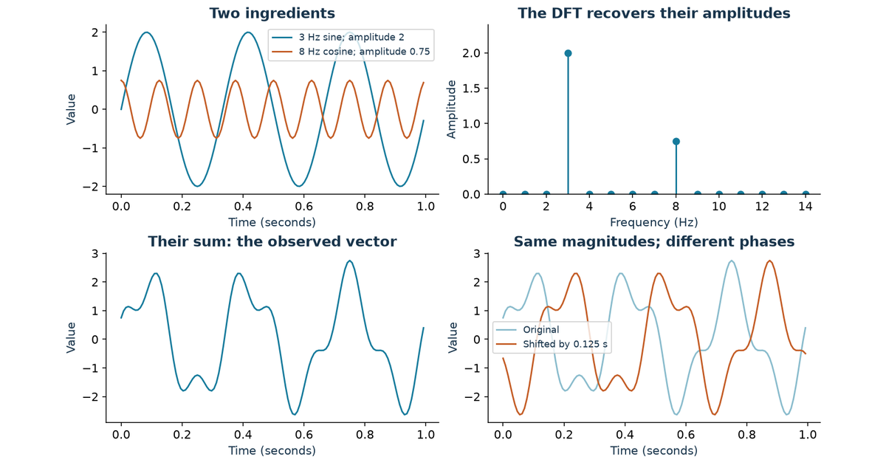
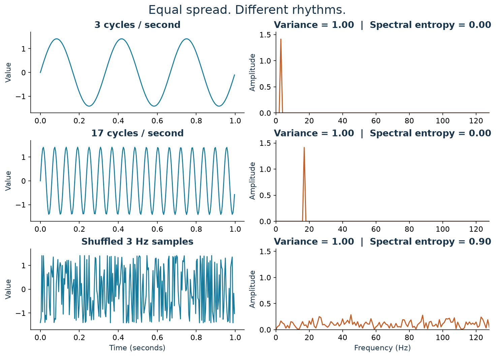
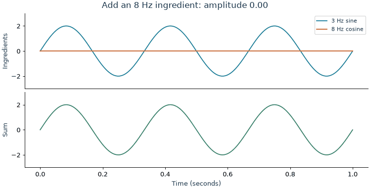
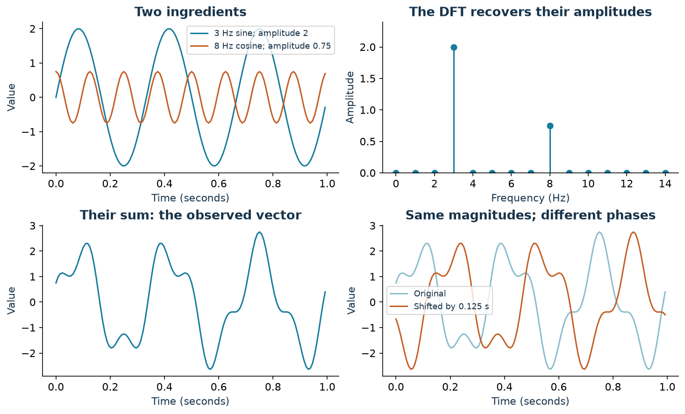
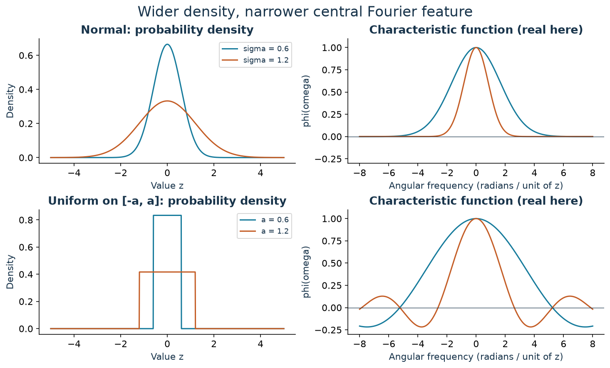
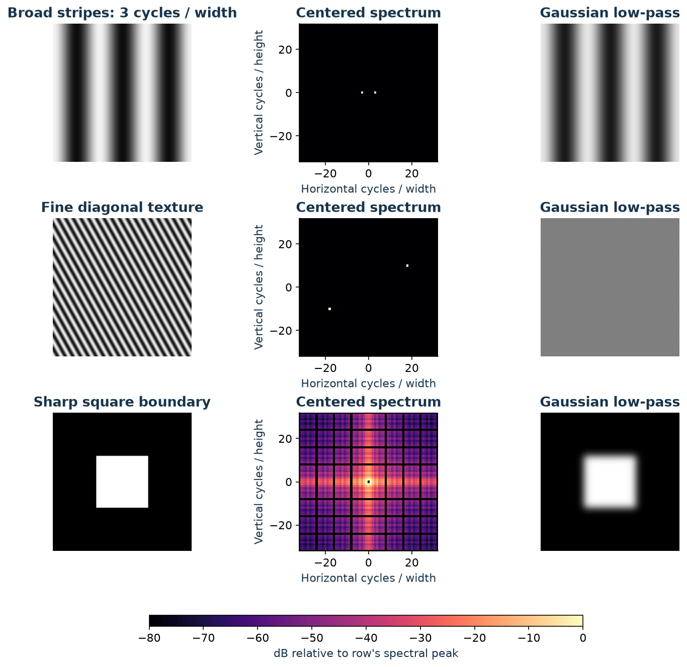
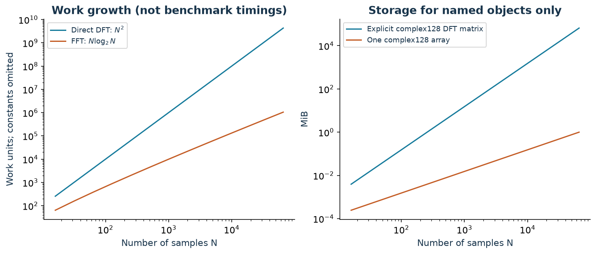
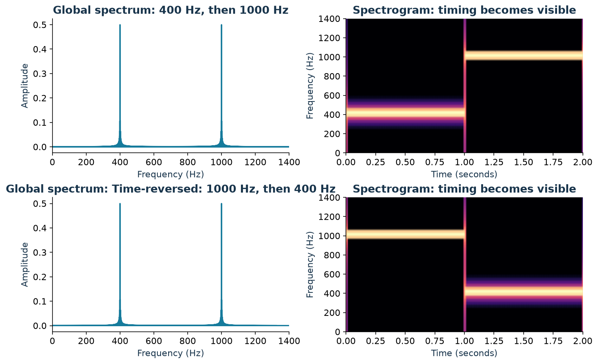
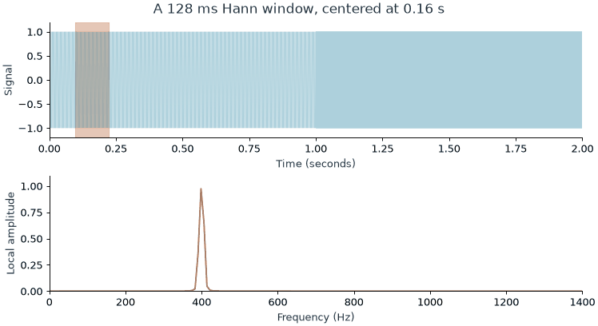
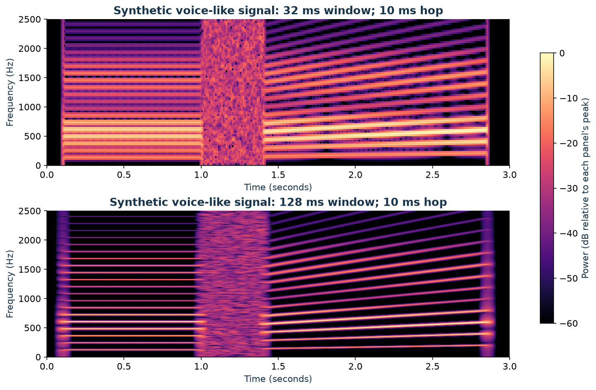

I want to understand what changes when I describe a sound, an image, or a probability curve by its frequencies instead of its values.

My starting theory is simple: **the Fourier transform tells me how fast things move or change.** That feels plausible for a vibrating string. It feels stranger for a photograph. Nothing in a photograph needs to move. And where do variance and entropy fit? Aren't they also ways of describing variation?

The idea starts to click when I separate three questions:

- **How much do the values vary?** That is a question about spread.
- **Over what distances or times do they vary?** That is a question about frequency.
- **How much uncertainty remains about what comes next?** That needs a probability model, not just a count of wiggles.

The examples are synthetic: I generate sums of sinusoids, grayscale patterns, and a toy voice-like waveform with known ingredients. There are no recordings or measured images to infer hidden causes from. The aim is to check whether the transform recovers what I put in; the danger is mistaking a property of these controlled examples for a guarantee about real data.

## My intuition needs one extra word: scale

When I say “fast change,” I might mean that a signal has a steep slope, or that it repeats many times per second. Those are related, but they are different measurements.

Consider a sinusoid:

$$
x(t)=A\sin(2\pi f t+\phi).
$$

I can change three ingredients independently:

- **Amplitude $A$:** how tall the wave is.
- **Frequency $f$:** how many cycles fit into one second, measured in hertz (Hz).
- **Phase $\phi$:** where the wave is in its cycle at the time origin.

A taller wave can have steeper slopes without completing any extra cycles. Differentiating makes the distinction concrete:

$$
\frac{dx}{dt}=2\pi fA\cos(2\pi ft+\phi).
$$

The largest slope depends on **both amplitude and frequency**. So my revised intuition is: **Fourier analysis describes a signal in terms of oscillations at different scales, with an amplitude and a phase for each.** It does not return one universal “speed of change.”

### Variance measures the amount of variation, not its pace

I generate one second of a 3 Hz sine wave and a 17 Hz sine wave, sampled at 256 Hz. Both have amplitude $\sqrt{2}$. Over these complete cycles, both have mean zero and population variance one:

$$
\operatorname{Var}\bigl(A\sin(2\pi ft)\bigr)=\frac{A^2}{2}.
$$

That equality assumes uniform coverage of complete cycles; a short, awkwardly cropped stretch need not have that variance.

I also shuffle the 3 Hz samples. Shuffling preserves every value, so it preserves the histogram, mean, and variance. It changes the ordering that made the wave a wave.

{#fig-variance fig-alt="Three rows compare slow sine, fast sine, and shuffled sine values. All have variance one. The two sine spectra have a single positive-frequency peak, while the shuffled spectrum is broad."}

**Aha: a histogram forgets the order. Fourier analysis is sensitive to it.** The shuffled signal has no larger spread, but it needs many more frequency ingredients to describe its arrangement.

There is a precise bridge between spread and spectrum. With the DFT convention I use shortly, Parseval's identity gives

$$
\underbrace{\frac{1}{N}\sum_{n=0}^{N-1}|x_n-\bar{x}|^2}_{\text{population variance}}
=\underbrace{\frac{1}{N^2}\sum_{k=1}^{N-1}|X_k|^2}_{\text{power in all nonzero-frequency bins}}.
$$

Here the sum includes positive **and** negative frequency bins. The zero-frequency term carries the mean and is left out. Variance totals the nonconstant power; the spectrum tells me where that total sits. This is the energy-preservation connection developed in [MIT's lecture on Fourier properties](https://live.ocw.mit.edu/courses/res-6-007-signals-and-systems-spring-2011/resources/lecture-9-fourier-transform-properties/).

### Entropy needs a definition before it can explain complexity

A high-frequency sine wave can be perfectly predictable. Knowing its amplitude, frequency, and phase lets me calculate its future values. More oscillations do not automatically mean more uncertainty.

I find it useful to distinguish three meanings:

| Quantity | What it asks | What it misses |
|---|---|---|
| Histogram entropy | How uncertain is the value of a randomly selected sample, using fixed value bins? | Ordering; shuffling leaves it unchanged |
| Spectral entropy | How widely is power distributed among selected frequency bins? | Phase and whether a generating rule is predictable |
| Entropy rate | How uncertain is the next value, given the past, under a stochastic model? | It cannot be read off from one magnitude spectrum in general |

For the figure, I remove the mean, form the one-sided power spectrum, and double interior bins to account for their negative-frequency partners. I exclude DC, keep the same $K$ remaining bins, and normalize their powers $P_k$:

$$
p_k=\frac{P_k}{\sum_jP_j},\qquad
H_{\mathrm{spec}}=\frac{-\sum_k p_k\log_2 p_k}{\log_2K}.
$$

I take $0\log 0=0$. A signal with no nonzero-frequency power needs separate handling because the denominator defining $p_k$ is zero.

- One occupied bin gives $H_{\mathrm{spec}}=0$.
- Equal power in all $K$ bins gives $H_{\mathrm{spec}}=1$.
- Multiplying the signal by a nonzero constant changes variance but leaves these normalized proportions unchanged.

The 3 Hz and 17 Hz examples both have essentially zero spectral entropy. The shuffled example has much higher spectral entropy. This concentration interpretation agrees with the definition used in [spectral-entropy monitoring research](https://www.mdpi.com/2075-5309/12/3/310).

But a deterministic sweep through frequencies can also have a broad spectrum. A tone falling between DFT bins can spread across bins too. **Spectral entropy measures spectral spread under chosen analysis settings; it is not a general test for randomness.**

## A vector becomes a list of wave ingredients

The slow and fast waves were deliberately simple. Now I want to see what happens when they overlap, as sound waves do at a microphone.

I construct a one-second signal at a sampling rate $f_s=128$ Hz:

$$
x_n=2\sin\left(2\pi\cdot3\frac{n}{128}\right)
+0.75\cos\left(2\pi\cdot8\frac{n}{128}\right),
\qquad n=0,\ldots,127.
$$

In the **time domain**, my vector answers “what value did I observe at sample $n$?” Its shape is a slow wave with a faster ripple.

::: {.fourier-animation}
{fig-alt="Animation of an 8 Hz cosine gradually being added to a 3 Hz sine, with their sum shown underneath."}
:::

The **frequency domain** asks “how much of each candidate oscillation is present, and how is it aligned?” For sampled data, the relevant transform is the discrete Fourier transform, or **DFT**:

$$
X_k=\sum_{n=0}^{N-1}x_n e^{-i2\pi kn/N},
\qquad k=0,\ldots,N-1.
$$

That exponential used to be the intimidating part for me. Euler's identity makes it less mysterious:

$$
e^{-i\theta}=\cos\theta-i\sin\theta.
$$

The DFT compares my vector with cosine and sine templates. A matching rhythm accumulates a large response; other rhythms cancel over the record when they lie on this frequency grid. Two template alignments let it detect a wave even when its peaks do not line up with the time origin.

The complex coefficient packages those two responses together:

- $|X_k|$ measures the strength of that component, before normalization.
- $\arg(X_k)$ describes its phase.
- $X_0/N$ is the mean, often called the **DC component**.

For nonnegative bins, the physical frequency is $f_k=kf_s/N$. With 128 samples at 128 Hz, bins are 1 Hz apart. Bin 3 means 3 Hz, not “the third sample.”

{#fig-ingredients fig-alt="Four panels show two component waves, their sum, two spectral peaks, and an original versus shifted waveform with identical Fourier magnitudes."}

This small NumPy example reproduces the amplitude calculation:

```python
import numpy as np

fs = 128
t = np.arange(fs) / fs
x = 2 * np.sin(2 * np.pi * 3 * t) + 0.75 * np.cos(2 * np.pi * 8 * t)

X = np.fft.rfft(x)
frequency = np.fft.rfftfreq(len(x), d=1 / fs)
amplitude = np.abs(X) / len(x)
amplitude[1:-1] *= 2  # Even N: do not double DC or the Nyquist bin.

print(amplitude[3], amplitude[8])  # 2.0, 0.75, up to rounding
recovered = np.fft.irfft(X, n=len(x))
assert np.allclose(recovered, x)
```

For a real-valued signal, positive and negative frequencies occur in conjugate pairs. `rfft` stores the nonnegative half. The doubling combines each interior pair; it would need a different slice for an odd-length input. These conventions follow [NumPy's FFT documentation](https://numpy.org/doc/stable/reference/routines.fft.html).

The variance is another check: $2^2/2+0.75^2/2=2.28125$. The two complete, distinct-frequency waves are orthogonal over this record, so their variance contributions add.

### What sampling and phase do to the picture

I now have an ingredient list, but its interpretation depends on how I collected the vector.

- **Sampling limits the frequencies I can distinguish.** At 128 samples per second, the Nyquist frequency is 64 Hz. Frequencies above that can masquerade as lower ones: aliasing. Recovering a continuous signal requires appropriate bandlimiting before sampling.
- **Record length sets the bin spacing.** A duration $T=N/f_s$ gives $\Delta f=1/T$. Zero-padding adds grid points; it does not provide the resolving power of a longer observation.
- **A finite record has boundaries.** The DFT represents its samples by a periodic extension. A tone that does not complete an integer number of cycles generally spreads into several bins, called spectral leakage. A tapering window reduces sidelobes at the cost of broadening peaks.

Those boundary and resolution effects are worked through in [SciPy's spectral-analysis guide](https://docs.scipy.org/doc/scipy/tutorial/signal.html#spectral-analysis).

Most importantly, **the full complex DFT retains the original vector**. Its inverse is

$$
x_n=\frac{1}{N}\sum_{k=0}^{N-1}X_k e^{i2\pi kn/N}.
$$

If I circularly shift the vector by $n_0$ samples, its coefficients become $X_k e^{-i2\pi kn_0/N}$. The magnitudes stay fixed; the phases change. That is why two curves in @fig-ingredients can look different while sharing an amplitude spectrum. Keeping only the peak heights throws away information that the transform itself preserved.

## Uniform and normal distributions: what am I transforming?

The variance connection raises a tempting question: does a normal distribution have different frequencies from a uniform distribution?

I have to specify the object first. There are **two different experiments** hiding inside that question.

### Transforming a sequence of random draws

Suppose I generate independent samples from either

$$
U_n\sim\operatorname{Uniform}(-\sqrt{3},\sqrt{3})
\quad\text{or}\quad
G_n\sim\mathcal N(0,1).
$$

Both processes have mean zero and variance one. Independence makes their nonzero-lag covariances zero, so both have a **flat theoretical power spectrum**. A finite realization has a bumpy estimate, not a perfectly flat line.

In fact, for either sequence and the unnormalized DFT,

$$
\mathbb E[|X_k|^2]
=\sum_{n,m}\mathbb E[x_nx_m]e^{-i2\pi k(n-m)/N}
=N.
$$

Only the $n=m$ terms survive. The spectrum's expected power does not tell me which of those two marginal distributions supplied the samples.

Now sort either vector. Its histogram is unchanged, but the sorted sequence has a slow sweep through values, plus the jump where its periodic extension wraps around. Its spectrum changes dramatically. This is the histogram-versus-order distinction again.

**Normal describes the distribution of values. White describes a covariance structure.** A process can be Gaussian and strongly correlated; “Gaussian noise” does not imply white noise unless that dependence assumption is supplied.

### Transforming the probability density itself

I can instead treat a density $p(z)$ as a curve over possible values $z$. There is no time axis here. Its Fourier-like representation is the **characteristic function**:

$$
\varphi_Z(\omega)=\mathbb E[e^{i\omega Z}]
=\int_{-\infty}^{\infty}p(z)e^{i\omega z}\,dz.
$$

Probability convention uses a plus sign in the exponent; my signal-processing convention used a minus sign. Also, $\omega$ is angular frequency, in radians per unit of $z$, with $\omega=2\pi f$. This definition is documented in [The Book of Statistical Proofs](https://statproofbook.github.io/D/cf.html).

For a normal variable,

$$
Z\sim\mathcal N(\mu,\sigma^2)
\quad\Longrightarrow\quad
\varphi_Z(\omega)=e^{i\mu\omega}e^{-\sigma^2\omega^2/2}.
$$

The centered Gaussian density transforms into a Gaussian-shaped curve. Increasing $\sigma$ spreads out the density and **narrows** the transform's magnitude. Moving the mean adds a phase factor.

For a centered uniform variable,

$$
Z\sim\operatorname{Uniform}(-a,a)
\quad\Longrightarrow\quad
\varphi_Z(\omega)=\frac{1}{2a}\int_{-a}^a e^{i\omega z}\,dz
=\frac{\sin(a\omega)}{a\omega},
$$

with $\varphi_Z(0)=1$ by continuity. This is a **sinc** curve. Its zeros occur at nonzero integer multiples of $\pi/a$, and it has negative lobes. A characteristic function is not a probability density; negative or complex values are allowed.

{#fig-distributions fig-alt="Normal and uniform densities at two widths are paired with their characteristic functions. Wider densities have narrower central Fourier features; the uniform transform has alternating positive and negative lobes."}

The two density shapes have different boundary behavior. The Gaussian decays smoothly; the uniform density stops abruptly at its endpoints. Those sharp endpoints produce the sinc's slowly decaying oscillations. The formulas are also derived in Marco Taboga's treatments of the [normal](https://www.statlect.com/probability-distributions/normal-distribution) and [uniform](https://www.statlect.com/probability-distributions/uniform-distribution) distributions.

This gives me three practical uses:

1. **Smoothing.** A Gaussian averaging kernel multiplies the frequency spectrum by a Gaussian, smoothly suppressing high frequencies. A continuous box average, shaped like a uniform density, has a sinc response with zeros and sidelobes. A finite discrete moving average has the corresponding periodic discrete response.
2. **Adding independent variables.** Independence gives $\varphi_{A+B}(\omega)=\varphi_A(\omega)\varphi_B(\omega)$. Density convolution becomes multiplication. Two independent uniform variables sum to a triangular density, whose characteristic function is the square of the original sinc.
3. **Comparing distributional models.** From observations $z_1,\ldots,z_M$, I can estimate $\varphi_Z(\omega)$ with $M^{-1}\sum_j e^{i\omega z_j}$ and compare it with a proposed normal or uniform model. This averages over observed values; it is not the DFT of their acquisition order.

There is a neat connection back to variance: when the second moment exists, $\varphi'_Z(0)=i\mathbb E[Z]$ and $\varphi''_Z(0)=-\mathbb E[Z^2]$. For a centered variable, variance controls the characteristic function's curvature at the origin. Larger spread makes it bend away from one faster.

That does **not** contradict the fast sine having the same variance as the slow sine. One experiment transforms an ordered time signal; the other transforms a density over values.

Even “maximum entropy” changes with the constraint. Among continuous densities supported on a fixed interval, the uniform has maximal differential entropy. With a fixed variance, the normal has maximal differential entropy. Neither statement ranks their time-series spectral entropy; it concerns a different object and a different entropy definition.

## A photograph changes as I move through space

The density example has already loosened my attachment to time. For a grayscale image, I move along rows and columns instead. The matrix entry $I_{r,c}$ is brightness at a pixel.

I can ask how quickly brightness changes **as position changes**:

- A broad, smooth variation uses low spatial frequencies.
- Fine stripes or texture need higher spatial frequencies.
- A sharp edge needs a range of frequencies, including high ones.

The units might be cycles per pixel, cycles per image width, or cycles per millimeter. No object has to move. A row of narrow alternating stripes has a high spatial frequency even in a still photograph.

For an $H\times W$ matrix, the 2D DFT is

$$
F_{u,v}=\sum_{r=0}^{H-1}\sum_{c=0}^{W-1}
I_{r,c}\exp\left[-i2\pi\left(\frac{ur}{H}+\frac{vc}{W}\right)\right].
$$

I read $(u,v)$ as an ingredient that oscillates $u$ times vertically and $v$ times horizontally over the image. In practice, signed frequency indices describe the direction after wrapping the DFT's indexing convention.

The basis patterns are waves of brightness—stripes at different spacings and orientations. Vertical stripes vary as I move horizontally, so their spectral peaks lie on the **horizontal frequency axis**. The frequency vector points across the stripes, perpendicular to them.

I generated three 128-by-128 images to make that orientation visible: broad vertical stripes, fine diagonal stripes, and a white square on black.

{#fig-spatial fig-alt="Three rows show broad vertical stripes, fine diagonal stripes, and a square. Paired spectral peaks encode stripe frequency and orientation. A smooth low-pass filter preserves broad stripes, removes fine texture, and blurs the square."}

I subtract the mean **only for displaying the spectra**, so a bright DC peak does not hide the interesting components. I use `fftshift` to put zero frequency in the center and a logarithmic brightness scale to reveal weaker components. Farther from the center means a larger frequency magnitude.

To make the filtered images, I keep the original DC term, multiply the complex coefficients by a smooth Gaussian that favors low frequencies, and apply the inverse transform. Fine stripes lose contrast; the square's sharp boundaries spread out. The filter changes coefficients, so this reconstruction is intentionally different from the original.

The DFT also treats opposite image borders as adjacent. A plain brightness ramp has a jump where its right edge wraps back to its left edge, which can generate high-frequency content. “Smooth image means low frequencies” needs that boundary qualification. My broad stripe example joins smoothly at the borders.

**Aha: temporal frequency measures cycles per time; spatial frequency measures cycles per distance.** The transform's job is unchanged. In two dimensions, it can be computed by transforming all rows and then all columns; [SciPy's Fourier tutorial](https://docs.scipy.org/doc/scipy/tutorial/fft.html) covers multidimensional transforms.

## The FFT makes the ingredient calculation practical

The DFT equation asks for $N$ coefficients, with a sum of $N$ terms for every coefficient. Evaluating those sums directly takes $O(N^2)$ work. That becomes expensive when a microphone keeps delivering new samples or an image contains millions of pixels.

The **fast Fourier transform**, or FFT, computes that same DFT by reusing intermediate work. It is an algorithm family, not a different frequency representation or an approximation obtained by deleting frequencies.

For a power-of-two length, split the input into its even-indexed and odd-indexed samples. Compute two transforms of length $N/2$, called $E_k$ and $O_k$, then combine them:

$$
\begin{aligned}
X_k&=E_k+e^{-i2\pi k/N}O_k,\\
X_{k+N/2}&=E_k-e^{-i2\pi k/N}O_k,
\qquad k=0,\ldots,N/2-1.
\end{aligned}
$$

The sum and difference reuse the same two smaller answers. Repeating the split gives $\log_2N$ levels, with $O(N)$ combining work per level:

$$
T(N)=2T(N/2)+O(N)=O(N\log N).
$$

This is the core idea of the [Cooley–Tukey algorithm](https://doi.org/10.1090/S0025-5718-1965-0178586-1). FFT libraries support other lengths too; a power of two makes the explanation convenient, not mandatory.

At $N=65{,}536$, the growth terms are $N^2=4{,}294{,}967{,}296$ and $N\log_2N=1{,}048{,}576$. Their ratio is 4096. That is a comparison of work-growth expressions, **not a measured 4096-fold speedup**: operations, constants, hardware, and implementation matter.

{#fig-cost fig-alt="Log-log curves compare quadratic direct-DFT work with N log N FFT work, and quadratic matrix storage with linear array storage."}

### Memory savings depend on the baseline

I initially want to say “the FFT saves both time and memory.” The time claim is clear; the memory claim needs a comparison.

| Implementation choice | Work | Storage implication |
|---|---|---|
| Explicit dense DFT matrix times a vector | $O(N^2)$ | The matrix alone has $N^2$ complex entries |
| Direct DFT sums, computed without storing the matrix | $O(N^2)$ | Input and output need $O(N)$ storage |
| Typical FFT implementation | $O(N\log N)$ | Typically $O(N)$ storage; buffers and workspace vary |

At $N=65{,}536$, a matrix of 16-byte complex numbers takes **64 GiB**. One length-$N$ array of those numbers takes **1 MiB**. An FFT avoids allocating that dense matrix, but a carefully written direct DFT can avoid it too.

Some FFT implementations overwrite the input in place; others allocate outputs and temporary workspace. [FFTW's documentation](https://www.fftw.org/fftw3_doc/Complex-One_002dDimensional-DFTs.html) distinguishes these choices. An FFT is not automatic compression: retaining a full transform preserves the signal's information, and complex output can use more bytes than the real input.

For an $H\times W$ image, separable row and column FFTs cost $O(HW(\log H+\log W))$. For streaming audio, the practical gain is that transforms can finish before the next processing deadline. Real-time performance still depends on window size, hardware, and the work surrounding the FFT.

## STFT makes “when” visible again

A whole-record Fourier transform tells me the ingredients of the record. But speech is an evolving sequence: a vowel, a hiss, a pause, another vowel. I need a representation that shows how those ingredients change locally.

I construct two seconds of audio: a 400 Hz tone for one second, then a 1000 Hz tone for one second. Then I reverse the samples. For a real signal, time reversal preserves Fourier magnitudes, so the two global amplitude spectra match even though the order is reversed.

{#fig-timing fig-alt="Identical global spectra have peaks at 400 and 1000 Hz. One spectrogram shows 400 Hz before 1000 Hz; the time-reversed example shows the opposite ordering."}

The missing ingredient in those magnitude plots is phase. **A standard Fourier transform does not destroy time information; a magnitude-only display hides much of it, and a global spectrum does not label local events directly.**

The short-time Fourier transform, or **STFT**, gives me that local view:

1. Select a short stretch of the signal.
2. Multiply it by a window, such as a Hann window, that tapers the endpoints.
3. Compute its Fourier transform, usually with an FFT.
4. Slide forward by a chosen number of samples—the **hop**—and repeat.

With window length $L$ and hop $R$, one convention is

$$
S[m,k]=\sum_{n=0}^{L-1}x[n+mR]w[n]e^{-i2\pi kn/L}.
$$

Now $m$ indexes time frames and $k$ indexes frequency bins. The complex STFT contains magnitude and phase in every frame. Its squared magnitude, $|S[m,k]|^2$, forms a **power spectrogram**, often displayed on a decibel scale.

::: {.fourier-animation}
{fig-alt="An orange analysis window slides along a two-tone signal while its local frequency spectrum changes between the two tones."}
:::

When the window overlaps the transition, both frequencies appear. That is an observation about the selected interval, not proof that both tones sounded simultaneously at one instant. [SciPy's ShortTimeFFT documentation](https://docs.scipy.org/doc/scipy/reference/generated/scipy.signal.ShortTimeFFT.html) describes the window, hop, and frequency-grid conventions used to generate these figures.

### A shorter window answers a different question

I cannot make time and frequency arbitrarily precise by choosing a clever plotting scale.

- A **short window** localizes changes more closely in time, but broadens frequency peaks.
- A **long window** can separate closer frequencies, but mixes events over a longer interval.
- A **smaller hop** samples the evolving analysis more often; it does not undo a long window's temporal averaging.

For 8 kHz audio, a 256-sample window spans 32 ms and, without zero-padding, has a 31.25 Hz FFT grid. A 1024-sample window spans 128 ms and has a 7.8125 Hz grid. Actual peak-separation ability also depends on the window shape; bin spacing alone is not a resolution guarantee.

### What I can see in a voice spectrogram

To make the speech connection concrete without pretending a toy example is a recording, I synthesize a three-second sound. It contains harmonics of a 120 Hz fundamental, a noise burst, and a rising fundamental with harmonics. I emphasize bands near 600 and 1500 Hz to imitate broad vocal-tract resonances. This is a voice-like teaching signal, not a spoken word or a model of an individual speaker.

```{=html}
<audio controls preload="none" aria-label="Synthetic harmonic and noise demonstration">
  <source src="synthetic-voice.wav" type="audio/wav">
  Your browser does not support embedded audio.
</audio>
```

[Download the synthetic audio](synthetic-voice.wav).

{#fig-voice fig-alt="Two spectrograms of the same synthetic harmonic-noise-harmonic signal show the time-frequency tradeoff. The long-window view has thinner frequency bands and broader event boundaries."}

This gives me landmarks to look for in real speech:

- **Voiced segments** often show harmonic bands. Their spacing relates to the fundamental frequency of vocal-fold vibration.
- **Formants** are broad resonances of the vocal tract that shape the strength of harmonics. They are not simply another name for the fundamental or its multiples.
- **Unvoiced sounds**, such as an “s,” often distribute energy over a broad frequency range.
- **Pauses and transitions** appear as changes along the time axis, subject to the window's blur.

[UCLA's acoustic phonetics examples](https://www.phonetics.ucla.edu/course/chapter8/figure8.html) show these distinctions in actual speech, including the difference between narrowband and wideband spectrograms.

That representation is useful for inspecting recordings, tracking pitch, detecting voice activity, and designing noise reduction. Audio systems can also pool spectral energy into perceptually spaced **mel bands** and take logarithms to form log-mel features. A spectrogram is a representation of sound, not a transcript; recognizing words requires more modeling.

The complex STFT can support reconstruction when the window, overlap, and inverse procedure satisfy the required conditions. Saving only the spectrogram's magnitudes loses phase, so that image alone does not generally specify a unique waveform.

My starting question—“how fast does it change?”—now has a more useful answer. I can ask how much variation is present, which scales carry it, and when those scales become active. A time series, a photograph, and a probability density give those axes different meanings. Fourier analysis connects them through the same operation: describe the curve by oscillatory ingredients, and keep track of their alignment.

## Reproduce the figures {.unnumbered}

The [figure generator](src/make_figures.py) creates all seven static figures, both GIFs, and the synthetic audio. It also checks reconstruction, spectral amplitudes, Parseval's identity, time-reversal magnitudes, and the normal and uniform characteristic functions numerically. Dependencies are pinned in [src/requirements.txt](src/requirements.txt); assets are built before Quarto renders the post.

```bash
uv venv .venv-fourier
uv pip install --python .venv-fourier/bin/python \
  -r posts/fourier-transform-intuition/src/requirements.txt
.venv-fourier/bin/python posts/fourier-transform-intuition/src/make_figures.py
.venv-fourier/bin/python scripts/make_cover.py posts/fourier-transform-intuition
```

Values. Vary. Frequencies. Locate. Scales. Phases. Preserve. Alignment. Windows. Locate. Change.

## References {.unnumbered}

- NumPy: [Discrete Fourier Transform](https://numpy.org/doc/stable/reference/routines.fft.html).
- Alan V. Oppenheim / MIT OpenCourseWare: [Fourier Transform Properties](https://live.ocw.mit.edu/courses/res-6-007-signals-and-systems-spring-2011/resources/lecture-9-fourier-transform-properties/).
- SciPy: [Fourier transforms](https://docs.scipy.org/doc/scipy/tutorial/fft.html), [spectral analysis](https://docs.scipy.org/doc/scipy/tutorial/signal.html#spectral-analysis), and [ShortTimeFFT](https://docs.scipy.org/doc/scipy/reference/generated/scipy.signal.ShortTimeFFT.html).
- Cooley and Tukey (1965): [An algorithm for the machine calculation of complex Fourier series](https://doi.org/10.1090/S0025-5718-1965-0178586-1).
- FFTW: [Complex One-Dimensional DFTs](https://www.fftw.org/fftw3_doc/Complex-One_002dDimensional-DFTs.html).
- The Book of Statistical Proofs: [Characteristic function](https://statproofbook.github.io/D/cf.html).
- Marco Taboga, StatLect: [Normal distribution](https://www.statlect.com/probability-distributions/normal-distribution) and [uniform distribution](https://www.statlect.com/probability-distributions/uniform-distribution).
- [Instantaneous Spectral Entropy: An Application for the Online Monitoring of Multi-Storey Frame Structures](https://www.mdpi.com/2075-5309/12/3/310) (2022).
- UCLA: [A Course in Phonetics, Chapter 8: Acoustic Phonetics](https://www.phonetics.ucla.edu/course/chapter8/figure8.html).
