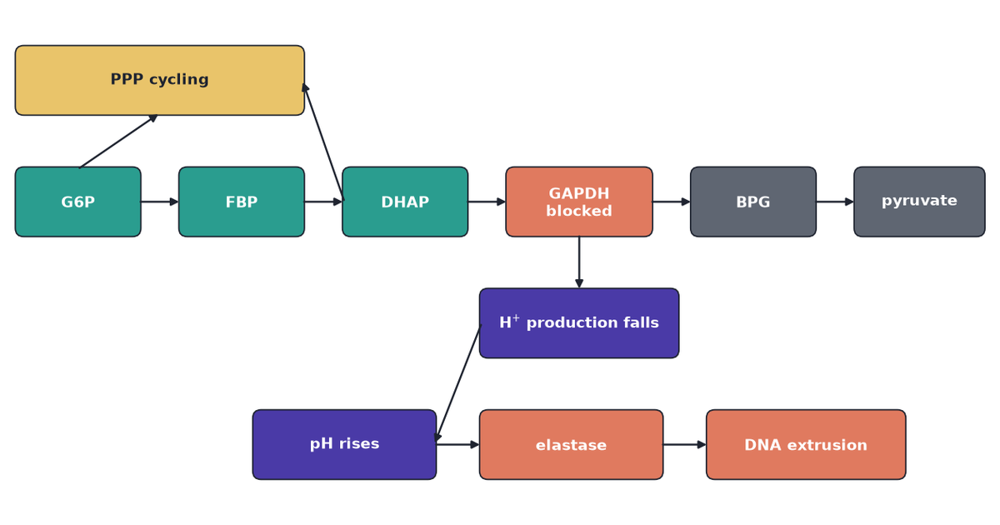

{fig-alt="Glycolysis blocked at GAPDH, then intracellular pH rising to neutrophil elastase and DNA extrusion."}

A labelled metabolome with three COVID groups will classify. That is the easy trick. It does not name the enzyme that lets neutrophils throw nets of DNA into a lung that is already failing.

Li et al. (2023) asked that enzyme question. They measured metabolites in neutrophils from 75 people — severe COVID-19, mild COVID-19, or no infection — then they blocked one glycolytic enzyme in healthy cells and watched nets form. The public spreadsheet is the first experiment. The mechanism is the second. [Neutrophil Metabolomes as a Matrix](../neutrophil-metabolome-axis/) is the layout of the spreadsheet: Mild does not sit on the Control–Severe line. This review is the follow-up: what GAPDH is doing, why pH — not extra NADPH — is the trigger, and which array shape those inhibitor tables would need before a tensor factorization is the right tool.

The deposited cohort is Metabolomics Workbench ST002477: 75 people, one snapshot each, 285 unique LC-MS peak-area features, CC BY 4.0. The numbers are chromatogram peak areas, not fluxes and not NET counts. The inhibitor tables — live-cell movies, pH dyes, $^{13}$C tracing — were not deposited as a cube.

```{python}
#| echo: false
#| output: false
import io

import numpy as np
from matplotlib.patches import FancyArrowPatch, FancyBboxPatch, Patch
from mpl_toolkits.mplot3d.art3d import Poly3DCollection
from PIL import Image
import matplotlib.pyplot as plt

INK = "#1F2430"
MUTED = "#5F6672"
RULE = "#D2D6D1"
TEAL = "#2A9D8F"
GOLD = "#E9C46A"
CORAL = "#E07A5F"
PURPLE = "#4A3AA7"

plt.rcParams.update(
    {
        "font.family": "sans-serif",
        "font.size": 10,
        "axes.edgecolor": RULE,
        "axes.linewidth": 0.8,
        "axes.spines.top": False,
        "axes.spines.right": False,
        "axes.labelcolor": INK,
        "text.color": INK,
        "xtick.color": MUTED,
        "ytick.color": MUTED,
        "axes.titleweight": "bold",
    }
)


def letterbox_cover(fig, path="cover.png", size=(1200, 630)):
    buf = io.BytesIO()
    fig.savefig(
        buf,
        dpi=160,
        bbox_inches="tight",
        pad_inches=0.25,
        facecolor="white",
        format="png",
    )
    buf.seek(0)
    raw = Image.open(buf).convert("RGB")
    arr = np.asarray(raw)
    ink = (arr < 250).any(axis=2)
    rows = np.where(ink.any(axis=1))[0]
    cols = np.where(ink.any(axis=0))[0]
    if len(rows) and len(cols):
        margin = 18
        raw = raw.crop(
            (
                max(0, int(cols[0]) - margin),
                max(0, int(rows[0]) - margin),
                min(raw.width, int(cols[-1]) + 1 + margin),
                min(raw.height, int(rows[-1]) + 1 + margin),
            )
        )
    width, height = size
    scale = min(width / raw.width, height / raw.height)
    new_w = max(1, round(raw.width * scale))
    new_h = max(1, round(raw.height * scale))
    raw = raw.resize((new_w, new_h), Image.Resampling.LANCZOS)
    canvas = Image.new("RGB", (width, height), (255, 255, 255))
    canvas.paste(raw, ((width - new_w) // 2, (height - new_h) // 2))
    canvas.save(path)


def node_box(ax, x, y, w, h, text, facecolor, textcolor="white"):
    patch = FancyBboxPatch(
        (x, y),
        w,
        h,
        boxstyle="round,pad=0.02,rounding_size=0.08",
        facecolor=facecolor,
        edgecolor=INK,
        linewidth=0.8,
        mutation_aspect=1.0,
    )
    ax.add_patch(patch)
    ax.text(
        x + w / 2,
        y + h / 2,
        text,
        ha="center",
        va="center",
        color=textcolor,
        fontsize=8.5,
        fontweight="bold",
        linespacing=1.15,
    )
    return (x, y, w, h)


def arrow(ax, src, dst):
    sx, sy, sw, sh = src
    dx, dy, dw, dh = dst
    x0, y0 = sx + sw / 2, sy + sh / 2
    x1, y1 = dx + dw / 2, dy + dh / 2
    if abs(x1 - x0) >= abs(y1 - y0):
        x0 = sx + sw if x1 > x0 else sx
        x1 = dx if x1 > sx else dx + dw
        y0 = sy + sh / 2
        y1 = dy + dh / 2
    else:
        y0 = sy if y1 < y0 else sy + sh
        y1 = dy + dh if y1 < sy else dy
        x0 = sx + sw / 2
        x1 = dx + dw / 2
    ax.add_patch(
        FancyArrowPatch(
            (x0, y0),
            (x1, y1),
            arrowstyle="-|>",
            mutation_scale=9,
            lw=1.1,
            color=INK,
            shrinkA=1,
            shrinkB=1,
        )
    )


def cuboid_faces(origin, size):
    x, y, z = origin
    dx, dy, dz = size
    v = np.array(
        [
            [x, y, z],
            [x + dx, y, z],
            [x + dx, y + dy, z],
            [x, y + dy, z],
            [x, y, z + dz],
            [x + dx, y, z + dz],
            [x + dx, y + dy, z + dz],
            [x, y + dy, z + dz],
        ],
        dtype=float,
    )
    return [
        [v[0], v[1], v[2], v[3]],
        [v[4], v[5], v[6], v[7]],
        [v[0], v[1], v[5], v[4]],
        [v[2], v[3], v[7], v[6]],
        [v[1], v[2], v[6], v[5]],
        [v[0], v[3], v[7], v[4]],
    ]
```

## Neutrophils throw DNA nets and do not come back

Most white cells in blood are neutrophils. They live hours to a couple of days. Their job is to find bacteria and fungi and kill them in one of three ways: swallow them, dump bleach-like oxidants, or throw out a net of their own DNA, studded with enzymes, that traps microbes outside the cell. Brinkmann et al. (2004) showed those nets kill bacteria. The same structures turn up in lungs that are already failing in severe COVID-19.

Throwing a net is not a reversible state. The nuclear envelope breaks, the chromatin unpacks, and DNA leaves the cell. The cell is gone. Immunologists call that NETosis. A short-lived cell in low-oxygen tissue still has to make ATP — energy — and NADPH, the reducing power for the oxidant burst. It also has to keep the net programme off until something warrants the cost. Metabolism is not only fuel. It is the switch.

What still needs a name is the switch itself. The paper's claim is that one enzyme in glycolysis is holding it.

## GAPDH is a valve in glycolysis, not a housekeeping stamp

The enzyme that holds the switch is GAPDH. Cells burn glucose in a chain of enzymes called glycolysis. About halfway down that chain sits glyceraldehyde-3-phosphate dehydrogenase. It takes a three-carbon sugar, oxidises it, and in the same step reduces $\mathrm{NAD}^+$ to NADH and releases a proton, $\mathrm{H}^+$. Textbooks call it housekeeping because every cell has it. In a neutrophil it behaves more like a valve. As long as sugar is flowing through GAPDH, the cell stays on the glycolytic path and keeps making acid. Block the valve and two things happen at once. Unprocessed sugar phosphates pile up upstream. Proton production falls, so the inside of the cell becomes more alkaline.

::: {.callout-note}
## A bottleneck, in plain terms

Think of a pipe with a narrow stretch. Slow that stretch and liquid backs up on one side and runs dry on the other. GAPDH is that stretch. Li et al. treat it as a rate-limiting node whose flow keeps nets off. They do not treat it as one more loading on a severity axis.
:::

A useful diagnostic of a block is a ratio. DHAP (dihydroxyacetone phosphate) sits just upstream of GAPDH. BPG (1,3-bisphosphoglycerate) sits just downstream. If GAPDH is slow, DHAP rises relative to BPG. Li et al. saw that DHAP:BPG ratio elevated in neutrophils from people with severe COVID-19. That is consistent with reduced GAPDH activity. It is not a proof that reactive oxygen species oxidised the enzyme in those patients. A snapshot ratio is a clue. It is not a knockout.

So they did the knockout the only way primary human neutrophils allow: they added a drug.

## Blocking GAPDH is enough to make a net

Heptelidic acid — also sold as koningic acid; one molecule, two names — is a covalent GAPDH inhibitor made by the fungus *Trichoderma koningii*. Iodoacetate is a second, chemically different inhibitor. Either one, added to neutrophils taken from healthy donors, is enough to make NETs.

Watch the traffic after the valve closes. Upper-glycolysis intermediates — DHAP, fructose-1,6-bisphosphate (FBP), fructose-6-phosphate (F6P) — rise. Lower-glycolysis products — pyruvate, BPG — fall. The $\mathrm{NAD}^+$/NADH ratio rises, as expected once GAPDH stops reducing $\mathrm{NAD}^+$.

Glucose-6-phosphate can still peel off into the pentose-phosphate pathway, a shunt that makes NADPH. That shunt gets busier after GAPDH is blocked. It is easy to guess that extra NADPH then drives the oxidant burst, and the oxidants make the net. That is how PMA, a classic lab trigger, makes nets. It is not how heptelidic acid does it.

Neutrophils make a burst of superoxide using NADPH oxidase (NOX). PMA needs that burst. Blocking G6PD — the first enzyme of the oxidative shunt — or blocking NOX with diphenyleneiodonium (DPI) stops PMA nets. The same blockers leave HA nets intact. DPI can even speed HA nets. HA also failed to raise mitochondrial ROS or collapse the GSH/GSSG ratio, the usual fingerprints of an oxidant crisis. So the HA path is not "more NADPH, more oxidants, more nets."

DHAP that cannot go through GAPDH spontaneously becomes methylglyoxal, a sticky aldehyde. That molecule blunts the respiratory burst. HA-treated cells are *worse* at making oxidants, not better.

The GAPDH reaction itself produces $\mathrm{H}^+$. Stop the reaction and the cell makes less acid. Intracellular pH rises. Buffer the outside with HEPES, or stop the cell exporting leftover protons with cariporide — an inhibitor of the $\mathrm{Na}^+/\mathrm{H}^+$ exchanger neutrophils use to set pH — and the pH rise is gone, and so are death and NET formation. The metabolic pile-up is not gone. DHAP and BPG stay where HA put them. pH is downstream of the block. The metabolome of an HA-treated cell still looks blocked even when the cell is saved.

Neutrophil elastase is a protease stored in granules. At higher pH it works better. Inhibitors of elastase (AZD9668, BAY-678, GW311616a) do not stop the membrane from becoming leaky. They stop DNA from leaving. The last mechanical step of the net is enzyme cutting, not a passive leak.

Severe COVID-19 serum is full of inflammatory cytokines. TNF-$\alpha$ pushes glycolysis forward. HA still blocks at GAPDH in that setting. Inflammatory drive and the GAPDH block are separable.

The causal order is linear until elastase:

```{mermaid}
flowchart TD
  g6p[G6P] --> upper[Upper glycolysis]
  g6p --> ppp[PPP cycling]
  upper --> dhap[DHAP and FBP]
  dhap --> gapdh[GAPDH blocked]
  dhap --> ppp
  gapdh --> lower[Lower glycolysis falls]
  gapdh --> protons["H+ production falls"]
  protons --> ph[Intracellular pH rises]
  ph --> ne[Neutrophil elastase]
  ne --> dna[DNA extrusion]
```

pH sits downstream of the metabolic block. Rescuing pH does not restore DHAP or BPG. A metabolome of an HA-treated cell therefore still looks "blocked" even when the cell does not throw a net. NET yield is a separate assay, not a hidden column of the concentration table.

The pathway drawing is the same order as the graph: glycolysis along the chain, pH and elastase on the finish, PPP on the shunt and not on the pH arrow.

```{python}
#| label: fig-pathway
#| fig-cap: "GAPDH block in glycolysis. Upper-glycolysis intermediates pile up, proton production falls, intracellular pH rises, and neutrophil elastase finishes DNA extrusion. PPP cycling rises and is not the pH driver."
#| fig-alt: "Boxes for G6P, FBP, DHAP, blocked GAPDH, BPG, pyruvate, PPP, falling H+, rising pH, elastase, and DNA extrusion, connected by arrows."
fig, ax = plt.subplots(figsize=(8.2, 4.6))
w, h = 1.15, 0.62
g6p = node_box(ax, 0.15, 2.55, w, h, "G6P", TEAL)
fbp = node_box(ax, 1.7, 2.55, w, h, "FBP", TEAL)
dhap = node_box(ax, 3.25, 2.55, w, h, "DHAP", TEAL)
gapdh = node_box(ax, 4.8, 2.55, 1.35, h, "GAPDH\nblocked", CORAL)
bpg = node_box(ax, 6.55, 2.55, w, h, "BPG", MUTED)
pyr = node_box(ax, 8.1, 2.55, 1.2, h, "pyruvate", MUTED)
ppp = node_box(ax, 0.15, 3.7, 2.7, h, "PPP cycling", GOLD, INK)
protons = node_box(ax, 4.55, 1.4, 1.85, h, r"H$^{+}$ production falls", PURPLE)
ph = node_box(ax, 2.4, 0.25, 1.7, h, "pH rises", PURPLE)
ne = node_box(ax, 4.55, 0.25, 1.7, h, "elastase", CORAL)
dna = node_box(ax, 6.7, 0.25, 1.85, h, "DNA extrusion", CORAL)
for src, dst in (
    (g6p, fbp),
    (fbp, dhap),
    (dhap, gapdh),
    (gapdh, bpg),
    (bpg, pyr),
    (g6p, ppp),
    (dhap, ppp),
    (gapdh, protons),
    (protons, ph),
    (ph, ne),
    (ne, dna),
):
    arrow(ax, src, dst)
ax.set_xlim(0, 9.5)
ax.set_ylim(0, 4.55)
ax.set_aspect("equal")
ax.axis("off")
fig.tight_layout()
letterbox_cover(fig)
```

The open question is no longer the chemistry. It is which table in the paper can carry it.

## The patient table and the inhibitor work are different arrays

The instinct, once the mechanism is in view, is to reach for a four-way tensor: people, metabolites, treatments, time. The public file is not that object.

Li et al. did two experiments. In the first, neutrophils from 19 healthy controls, 30 people with mild COVID-19, and 26 with severe disease were extracted once. Each person contributes one row. Group is a tag on that row, the way a train/test tag is a tag on a row. The array is $X \in \mathbb{R}^{75 \times 285}$. Peak area is not flux and not a NET. [Neutrophil Metabolomes as a Matrix](../neutrophil-metabolome-axis/) fits the line through the three means; Mild sits off it.

In the second, neutrophils from healthy donors were treated in the dish. Conditions include vehicle, heptelidic acid, iodoacetate, HA plus HEPES, HA plus cariporide, and HA plus an elastase inhibitor. PMA and the calcium ionophore A23187 are comparison NET inducers, not GAPDH inhibitors. Live-cell movies track nuclear shape and membrane integrity over minutes. Targeted metabolomics and $^{13}$C tracing sit on a subset of those conditions.

A tensor mode is just an index we can vary independently. Donor 3, condition HA, metabolite DHAP can, in principle, all be observed together. The patient file does not have that. Each person sits in one group. We cannot put the same person in Control and Severe. If we pad `sample × metabolite × group` anyway, two of three slices are empty for every row, and a factorization spends its effort explaining holes we invented.

That is the difference between a nested design and a crossed one. Nested: the group is a partition of people. Crossed: every donor is measured in every condition.

```{mermaid}
flowchart LR
  subgraph nested [Patient snapshot]
    people[75 people] --> matrixX["X: 75 x 285"]
    people --> partition[one group each]
  end
  subgraph crossed [Inhibitor design]
    donor[donor] --> cube["donor x condition x metabolite"]
    condition[condition] --> cube
    metabolite[metabolite] --> cube
  end
```

Two easy mistakes invent modes that were not measured. Koningic acid is heptelidic acid: listing both as separate conditions duplicates a level. Time-lapse microscopy is nuclear shape and membrane leak. It is not a metabolome sampled at $0, 15, 30, 60, 120$ min. The public table is not $\boldsymbol{\mathcal{X}} \in \mathbb{R}^{N \times M \times C \times T}$.

The donor counts in the inhibitor work are also much smaller than the patient cohort: eight donors for Sytox traces, five for glucose tracing. Those are the $I$ of a crossed cube, not $N \approx 80$.

What a crossed cube *would* buy is the next question.

## CP would recover a GAPDH-block pattern if the cube existed

Flatten a fluorescence cube and we throw away a mode that was measured. [Uses of Tensor Factorizations](../uses-of-tensor-factorizations/) is that case. Pad a nested table into a cube and we invent a mode that was not. The HA metabolomics sit in between: they *could* have been deposited as donor $\times$ treatment $\times$ metabolite. They were not. If they had been, CANDECOMP/PARAFAC — CP — would be the right compression. Kolda and Bader (2009) is the algebra.

CP writes a three-way array as a sum of rank-1 patterns. Each pattern is one outer product: a donor signature, a metabolite signature, and a condition signature that travel together. A three-way array $\boldsymbol{\mathcal{X}} \in \mathbb{R}^{I \times J \times K}$ with $I$ donors, $J$ metabolites, $K$ conditions factors as

$$
\boldsymbol{\mathcal{X}} \approx \sum_{r=1}^{R} \mathbf{a}_r \circ \mathbf{b}_r \circ \mathbf{c}_r.
$$

On the HA design those loadings would have a biological reading:

- $\mathbf{a}_r$: how strongly each healthy donor shows the pattern. Heterogeneity among people, not a COVID severity coordinate.
- $\mathbf{b}_r$: which metabolites move together. A GAPDH-block factor would load on DHAP and FBP against BPG and pyruvate, with PPP intermediates in the same direction as the pile-up.
- $\mathbf{c}_r$: which treatments fire the pattern. Vehicle low; HA and iodoacetate high and aligned; HA+HEPES still high on that metabolic factor, because pH rescue does not reverse the block.

A fourth mode exists only if the same metabolome is sampled in time:

$$
\boldsymbol{\mathcal{X}} \approx \sum_{r=1}^{R} \mathbf{a}_r \circ \mathbf{b}_r \circ \mathbf{c}_r \circ \mathbf{d}_r.
$$

Li et al. did not deposit that four-way array. NET yield is a separate assay. Putting NETosis percent into the metabolome cube as a silent time mode mixes a phenotype with a concentration table.

The drawing is synthetic geometry. It is not a fit to ST002477 and not a reconstruction of unpublished HA peak areas. Slab counts follow the paper's design: eight donors, twelve metabolite slots as a stand-in for a targeted panel, four conditions (vehicle, HA, HA+HEPES, HA+elastase inhibitor). Time is a caption, not an axis.

```{python}
#| label: fig-cube
#| fig-cap: "Schematic of a crossed inhibitor cube: donor × metabolite × condition. Colours mark vehicle, HA, HA plus HEPES, and HA plus an elastase inhibitor. Time is live-cell morphology, not a fourth metabolome index. Geometry only; no peak areas were loaded."
#| fig-alt: "Isometric drawing of four coloured slabs stacked along a condition axis, with metabolite and donor axes labelled."
conditions = (
    ("vehicle", TEAL),
    ("HA", CORAL),
    ("HA+HEPES", GOLD),
    ("HA+NE-i", PURPLE),
)
n_metabolites = 12
n_donors = 8
dz = 1.0
gap = 0.28
fig = plt.figure(figsize=(8.2, 5.2))
ax = fig.add_subplot(111, projection="3d")
ax.set_proj_type("ortho")
for i, (_name, color) in enumerate(conditions):
    z0 = i * (dz + gap)
    faces = cuboid_faces((0.0, 0.0, z0), (float(n_metabolites), float(n_donors), dz))
    ax.add_collection3d(
        Poly3DCollection(
            faces,
            facecolors=color,
            edgecolors=INK,
            linewidths=0.55,
            alpha=0.42,
        )
    )
handles = [
    Patch(facecolor=color, edgecolor=INK, alpha=0.55, label=name)
    for name, color in conditions
]
ax.set_xlim(0, n_metabolites)
ax.set_ylim(0, n_donors)
ax.set_zlim(0, len(conditions) * (dz + gap))
ax.set_xlabel("metabolite $J$")
ax.set_ylabel("donor $I$")
ax.set_zlabel("condition $K$")
ax.view_init(elev=18, azim=-58)
ax.xaxis.pane.fill = False
ax.yaxis.pane.fill = False
ax.zaxis.pane.fill = False
ax.legend(handles=handles, loc="upper left", frameon=False, fontsize=8)
ax.text2D(
    0.0,
    -0.06,
    r"Time $T$: live-cell morphology, not a metabolome index",
    transform=ax.transAxes,
    color=MUTED,
    fontsize=9,
)
fig.tight_layout()
print(f"schematic shape (donor, metabolite, condition) = ({n_donors}, {n_metabolites}, {len(conditions)})")
```

The print is $(8, 12, 4)$: eight donors, twelve metabolite slots, four conditions. CP on a padded patient cube would spend rank on holes the grouping created. SVD of $X$ is already that factorization. The inhibitor cube is the design where a treatment loading can isolate "GAPDH block" without inventing a group mode.

The chemistry, once named, also names the lever.

## The useful lever is upstream of DNA extrusion

DNase after lysis digests nets that have already left the cell. That is cleanup. The mechanism Li et al. isolate sits earlier.

Keep GAPDH flowing and the suppressor is still on. Buffer intracellular pH, or block $\mathrm{Na}^+/\mathrm{H}^+$ exchange, once the block is in place, and nets stop without DHAP or BPG returning to baseline. Block elastase at extrusion and the membrane can still become leaky while DNA stays inside.

Those three are not interchangeable with a linear severity score on ST002477. The public table can flag metabolites that leave the Control–Severe line. It cannot say which node, in which cell, at which pH, finished a net.

## Caveat: a snapshot is not a knockout, and HA is not the patient

This is a reading of Li et al. (2023) plus the layout of the public matrix. It is not a biomarker panel and not a fitted CP model.

Static peak area is not flux and not NET formation. An elevated DHAP:BPG ratio in severe neutrophils is consistent with reduced GAPDH activity; it is not a demonstrated ROS-oxidation event in those patients. HA on healthy cells is a causal intervention, not the patient milieu. Bulk pellets mix cell-state composition with within-cell change. pH rescue and elastase blockade were shown *ex vivo*; they are not a clinical protocol. One public cohort is not a replication.

The opening claim still holds inside those limits. A classifier on the spreadsheet will separate groups. The enzyme that lets the cell throw a net is not on that spreadsheet. It is in the dish, at GAPDH, and the last step is pH, then elastase.

Flux. Suppresses. Nets. pH. Finishes. Elastase. Nested. Groups. Do. Not. Factorize.

## References

- Brinkmann, V., et al. (2004). Neutrophil extracellular traps kill bacteria. *Science* 303: 1532–1535. [doi:10.1126/science.1092385](https://doi.org/10.1126/science.1092385)
- Kolda, T. G., and Bader, B. W. (2009). Tensor decompositions and applications. *SIAM Review* 51: 455–500. [doi:10.1137/07070111X](https://doi.org/10.1137/07070111X)
- Li, Y., et al. (2023). Neutrophil metabolomics in severe COVID-19 reveal GAPDH as a suppressor of neutrophil extracellular trap formation. *Nature Communications* 14: 2610. [doi:10.1038/s41467-023-37567-w](https://doi.org/10.1038/s41467-023-37567-w)
- Metabolomics Workbench ST002477 / PR001600. [doi:10.21228/M8W70C](https://doi.org/10.21228/M8W70C)
- [Neutrophil Metabolomes as a Matrix](../neutrophil-metabolome-axis/)
- [Uses of Tensor Factorizations](../uses-of-tensor-factorizations/)
