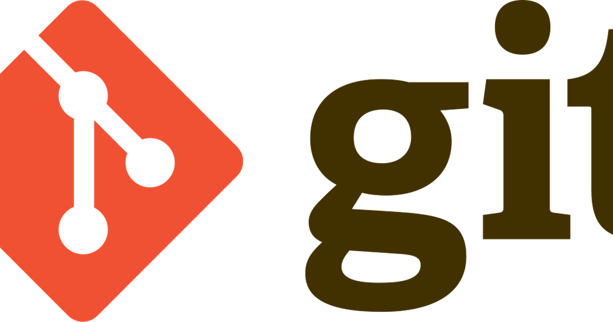

This post compares GitHub and GitLab by who built them, who owns them, and who leads today, then describes four AI-native platforms reshaping git hosting. The comparison assumes GitHub as the default workflow most open-source projects and individual developers already use.

## Origins and ownership

Both platforms wrap the same Git protocol. Their histories explain why one feels like a social network for code and the other like a single-vendor DevOps stack.

- **GitHub (2008):** Tom Preston-Werner, Chris Wanstrath, P. J. Hyett, and Scott Chacon; San Francisco. Bootstrapped profitably, then VC-backed. **Microsoft** acquired it for **$7.5B** (closed Oct 2018); wholly owned subsidiary since, with Copilot as the clearest AI bet on the platform.
- **GitLab (2011 OSS, 2014 Inc.):** Dmitriy Zaporozhets started the project in Ukraine; Sytse Sijbrandij built the company from the Netherlands. Y Combinator 2015. **Public on Nasdaq (GTLB)** since Oct 2021 IPO; Sijbrandij executive chairman.

## Dominance today

Git won the version-control war. The competition is between forges — services that host remotes, run CI, and gate merges.

- **GitHub leads** on adoption: ~**38% SCM market share** vs GitLab ~**16%**; roughly 2–3× on surveys and open-source gravity (Stack Overflow 2025: ~81% GitHub vs ~36% GitLab).
- **GitLab's wedge:** enterprise DevOps — integrated CI/security, self-managed installs, regulated buyers; higher spend per seat despite lower headcount share.
- **Third place:** Bitbucket (~9% revenue) inside Atlassian/Jira shops.

For most teams starting today, GitHub is the path of least resistance: contributors already have accounts, and the Actions marketplace covers most CI without a second vendor.

## Product split

Both are Git forges: remotes, PRs/MRs, review, CI, permissions. The split is how much of the delivery pipeline each ships in the box.

- **GitHub:** **Actions** marketplace, Pages, Dependabot, Copilot on-host. Wins on ecosystem depth and the assumption that the repo lives on GitHub.
- **GitLab:** CI, registry, scanning, environments in one product; **GitLab Duo** in-UI. Wins on single-vendor DevOps and self-hosting.

Pick GitHub when open-source reach and third-party Actions matter. Pick GitLab when you want the full stack on your infrastructure without stitching point tools.

## AI-native platforms

None of these replaces Git overnight. They change where code is hosted, how fast agents can read it, and what gets versioned besides commits. Legacy forges were built for human-paced PRs; agent fleets generate read traffic and merge volume those systems were not designed for.

- **[Cursor Origin](https://cursor.com/docs/origin)** (Aug 2026 beta): git forge inside [Cursor](/posts/cursor_ai/) — repos, PRs, code browse, **GitHub sync/mirror**; paid plans. Agent-scale hosting inside the editor; GitHub remains system of record for mirrored repos.
- **[Harness Code Repository](https://www.harness.io/blog/agent-ready-code-repository-ai-code-review)** (Aug 2026): SCM for **agent-scale PR volume**; paired **AI Code Review** (risk-ranked diffs); **MCP + CLI**; OPA gates; free tier; migrates from GitHub/GitLab.
- **[Entire](https://entire.io/)** (Jul 2026 preview): **Thomas Dohmke** (ex-GitHub CEO); **distributed Git network** — regional mirrors (US/EU/AU) offload agent clone/pull traffic from GitHub; native repos on roadmap; session memory in-repo.
- **[Zed DeltaDB](https://zed.dev/blog/introducing-deltadb)** (beta 2026): **CRDT delta stream** — versions every edit and linked agent conversation, not just commits; **runs alongside Git**; Delta client for multiplayer threads.

Git. Won. GitHub. Leads. GitLab. Integrated. Agents. Flood. PRs. Origin. Harness. Entire. Delta. Layer.

## References

- [GitHub — Wikipedia](https://en.wikipedia.org/wiki/GitHub) (founding, Microsoft acquisition)
- [History of GitLab — GitLab Handbook](https://handbook.gitlab.com/handbook/company/history/)
- [Code review tooling market — Jon Moshier](https://jonmoshier.com/notes/code-review-tooling-market-github-gitlab-and-the-pr-review-bottleneck/) (SCM share figures)
- [Cursor Origin documentation](https://cursor.com/docs/origin)
- [Harness Agent-Ready Code Repository — blog](https://www.harness.io/blog/agent-ready-code-repository-ai-code-review)
- [Entire distributed Git network — The New Stack](https://thenewstack.io/entire-git-for-agents/)
- [Introducing DeltaDB — Zed Blog](https://zed.dev/blog/introducing-deltadb)
