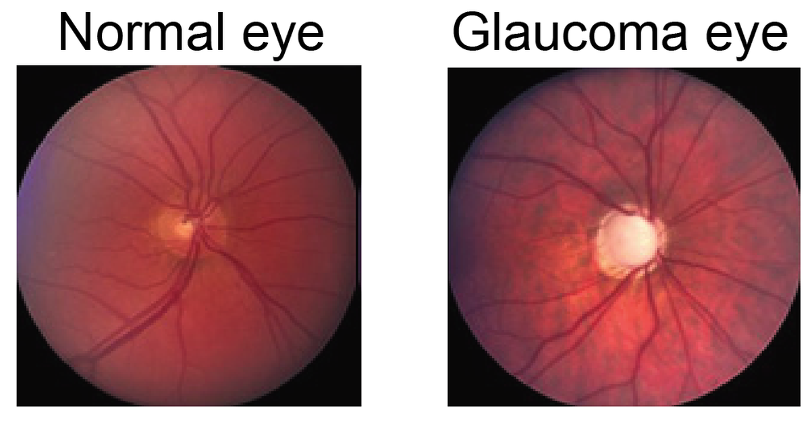

I spent a week at a computational biology workshop where nearly every talk, sooner or later,
turned into Kendall shape analysis. I had a slightly personal reason to pay attention: my
doctoral supervisor was [Brian Ripley](../brian-ripley-rousseeuw-prize/index.qmd), and *his*
supervisor was David Kendall. That makes Kendall my academic grandfather and this method
inherited family silver I had never taken out of the cupboard. So here it is, out of the
cupboard.

## Shape is what survives moving, resizing and turning

Nothing here is estimated or fitted: Kendall shape analysis is a deterministic geometric
transformation. It wants matrix-like input — $k$ landmarks $\times$ $m$ coordinate
dimensions, one $k \times m$ matrix per specimen, with landmark $i$ meaning the same
anatomical point every time.

Three nuisances come off in order:

- **Translation**, by centring on the landmark centroid: $X_c = CX$, where
  $C = I_k - \frac{1}{k}\mathbf{1}\mathbf{1}^\top$.
- **Scale**, by dividing by centroid size, the Frobenius norm
  $\lVert X_c \rVert_F = \sqrt{\sum_{ij} x_{ij}^2}$, leaving every configuration at size one.
- **Rotation**, by least squares against a target $Y$: take the SVD
  $Y^\top X = U\Sigma V^\top$, and $R = VU^\top$ is the rotation minimising
  $\lVert XR - Y \rVert_F$ (Gower, 1975).

What survives all three is shape (Kendall, 1984) — a claim easy to state and easy to doubt,
so the next section tests it where the right answer is known in advance.

## Six freehand copies of the same three pencils

The data is synthetic, deliberately. Each configuration is three pencil outlines — ten
landmarks each, 30 in total — and I made six copies, jittering every landmark by about 3% of
pencil length before applying a random rotation, a random scale between 0.6 and 1.8, and a
random translation.

That stands in for freehand tracings, where the tracer's hand position, the paper's angle
and the camera's zoom vary between sittings — none of it signal.
Simulating beats a real tracing dataset for one reason: I know the truth. Every copy came
from one template, so they *must* land on top of each other, and any residual is jitter I put
there rather than a fact about pencils.

```{python}
#| label: pencil-data
import numpy as np
import matplotlib.pyplot as plt

rng = np.random.default_rng(20)

# One pencil: 10 landmarks tracing a closed outline clockwise from the tip. Every
# one is a corner of the silhouette -- a point you could find again on another
# drawing of the same pencil -- rather than an arbitrary mark along a straight edge.
PENCIL = np.array([
    [0.00, 3.00],    # 0  graphite tip
    [0.25, 2.45],    # 1  right shoulder, where the sharpened cone meets the barrel
    [0.25, 0.62],    # 2  right barrel/ferrule joint
    [0.25, 0.20],    # 3  right ferrule/eraser joint
    [0.17, 0.02],    # 4  right corner of the eraser cap
    [0.00, -0.06],   # 5  eraser crown
    [-0.17, 0.02],   # 6  left corner of the eraser cap
    [-0.25, 0.20],   # 7  left ferrule/eraser joint
    [-0.25, 0.62],   # 8  left barrel/ferrule joint
    [-0.25, 2.45],   # 9  left shoulder
])
K = len(PENCIL)

# Interior detail lines, as chords between landmarks already in the set: the
# sharpening line, then the two edges of the ferrule band.
CHORDS = [(1, 9), (2, 8), (3, 7)]


def template():
    """Three similar-but-not-identical pencils side by side, as one 30x2 configuration."""
    pencils = []
    for offset, length in zip([-1.3, 0.0, 1.3], [1.0, 0.92, 1.08]):
        p = PENCIL * np.array([1.0, length])
        pencils.append(p + np.array([offset, 0.0]))
    return np.vstack(pencils)


def rotation(theta):
    c, s = np.cos(theta), np.sin(theta)
    return np.array([[c, -s], [s, c]])


def freehand_copy(base, rng):
    """Jitter the landmarks, then move, resize and turn the whole thing."""
    drawn = base + rng.normal(0.0, 0.09, base.shape)
    scale = rng.uniform(0.6, 1.8)
    shift = rng.uniform(-4.0, 4.0, size=2)
    return scale * (drawn @ rotation(rng.uniform(0, 2 * np.pi)).T) + shift


base = template()
copies = np.stack([freehand_copy(base, rng) for _ in range(6)])
print(f"{copies.shape[0]} copies of a {copies.shape[1]} x {copies.shape[2]} configuration")
```

Plotted as drawn, they share no frame of reference.

```{python}
#| label: fig-pencils-raw
#| fig-cap: "Six freehand copies of the same three pencils, before alignment. Same shape, six coordinate systems."
COLOURS = plt.cm.viridis(np.linspace(0.05, 0.85, 6))


def draw(ax, config, colour, lw=1.4, alpha=0.9):
    """Draw a configuration as three closed pencil outlines plus their detail lines."""
    for start in range(0, len(config), K):
        pencil = config[start:start + K]
        loop = np.vstack([pencil, pencil[0]])
        ax.plot(loop[:, 0], loop[:, 1], color=colour, lw=lw, alpha=alpha)
        for i, j in CHORDS:
            ax.plot(*pencil[[i, j]].T, color=colour, lw=lw * 0.8, alpha=alpha)


fig, ax = plt.subplots(figsize=(6.5, 5))
for config, colour in zip(copies, COLOURS):
    draw(ax, config, colour)
ax.set_aspect("equal")
ax.set_title("Raw configurations")
plt.show()
```

Generalised Procrustes analysis removes all three jointly. There is no closed form for the
mean of a set of shapes, so it iterates: centre and scale once, then rotate everything onto
the current mean and recompute that mean until it stops moving (Goodall, 1991).

```{python}
#| label: gpa
def centre_and_scale(config):
    """Remove translation (centring matrix) and scale (Frobenius norm)."""
    centred = config - config.mean(axis=0)
    return centred / np.linalg.norm(centred)


def rotate_onto(config, target):
    """Least-squares rotation of `config` onto `target`, via the SVD of the cross-product."""
    u, _, vt = np.linalg.svd(target.T @ config)
    R = vt.T @ u.T
    if np.linalg.det(R) < 0:  # a reflection is not a rotation; flip the last axis back
        vt[-1] *= -1
        R = vt.T @ u.T
    return config @ R


def gpa(configs, tol=1e-10, max_iter=100):
    """Generalised Procrustes analysis: centre, scale, then iterate rotate-to-mean."""
    aligned = np.stack([centre_and_scale(c) for c in configs])
    mean = aligned[0]
    for _ in range(max_iter):
        aligned = np.stack([rotate_onto(c, mean) for c in aligned])
        new_mean = centre_and_scale(aligned.mean(axis=0))
        if np.linalg.norm(new_mean - mean) < tol:
            break
        mean = new_mean
    return aligned, mean


aligned, mean_shape = gpa(copies)
residual = np.linalg.norm(aligned - mean_shape, axis=(1, 2))
print(f"residual distance to the mean shape: {residual.round(3)}")
```

Each copy now sits 0.06 to 0.08 from the mean, on configurations of size exactly 1 — under a
tenth of the shape's own extent, all of it jitter I put in. Overlaid, the six drawings are
one.

```{python}
#| label: fig-pencils-aligned
#| fig-cap: "The same six copies after generalised Procrustes analysis, with the mean shape in black. What is left is the freehand jitter."
fig, ax = plt.subplots(figsize=(6.5, 5))
for config, colour in zip(aligned, COLOURS):
    draw(ax, config, colour, lw=1.1, alpha=0.75)
draw(ax, mean_shape, "black", lw=2.2, alpha=1.0)
ax.set_aspect("equal")
ax.set_title("After generalised Procrustes analysis")
plt.show()
```

But pencils are rigged: I built the variation myself. The method has to earn its keep where
nobody knows the answer.

## Eleven monkeys, twenty-two optic nerve heads

For that, a real dataset shipped with [`geomstats`](https://geomstats.github.io/): optic
nerve head landmarks from Patrangenaru and Ellingson (2015). Eleven rhesus monkeys, both
eyes each, experimental glaucoma induced
in one eye and the fellow eye kept as control — 22 configurations of five landmarks in 3D,
digitised by vision researchers asking whether raised pressure *deforms* the nerve head.

The damage is visible before any mathematics: the glaucomatous disc goes pale and
excavated, its cup widening at the rim's expense.

 (Miolane et al., MIT licence); data from Patrangenaru and Ellingson (2015).](./optic-nerves.png){width=560 fig-align="center"}

The question here is the one that pairing was designed for: does nerve-head *shape* differ
between a glaucomatous eye and its own control? Glaucoma is staged from that appearance, so
misreading one means treating a healthy eye or letting a diseased one go blind.

Shape analysis fits for a specific reason: five landmarks and 22 configurations is far too
little to fit anything, and most of the raw variation is the digitiser's coordinate frame —
where the head sat, how far the camera was — which is not clinical signal. The pipeline
deletes exactly that, deterministically, before any statistics happen.

```{python}
#| label: nerve-align
#| warning: false
# pip install "geomstats<3" "numpy<2"   # geomstats 2.8 still imports numpy.trapz
from geomstats.datasets.utils import load_optical_nerves
from geomstats.geometry.pre_shape import PreShapeSpace
from geomstats.learning.frechet_mean import FrechetMean

nerves, labels, monkeys = load_optical_nerves()  # (22, 5, 3), 0 = control, 1 = glaucoma
print(f"{len(nerves)} nerve heads from {len(set(monkeys.tolist()))} monkeys, {nerves.shape[1]} landmarks in {nerves.shape[2]}D")

space = PreShapeSpace(k_landmarks=5, ambient_dim=3)
space.equip_with_group_action("rotations")   # the group we quotient out
space.equip_with_quotient()                  # ... giving Kendall shape space

preshape = space.projection(nerves)          # centre + scale, exactly as above
mean_nerve = FrechetMean(space.quotient).fit(preshape).estimate_
aligned_nerves = space.fiber_bundle.align(preshape, mean_nerve)

paired = [
    space.quotient.metric.dist(aligned_nerves[i], aligned_nerves[i + 1])
    for i in range(0, len(aligned_nerves), 2)
]
print(f"within-monkey shape distance, control vs glaucoma: {np.round(paired, 3)}")
```

Aligned to that mean, all 22 configurations sit in one frame:

```{python}
#| label: fig-nerves
#| fig-cap: "The 22 aligned nerve-head configurations (5 landmarks in 3D) with the Frechet mean in black. Landmark labels: S superior, T temporal, N nasal, I inferior, V nerve-head deepest point."
LANDMARKS = ["S", "T", "N", "I", "V"]
RIM = [0, 1, 3, 2, 0]  # S -> T -> I -> N -> S, the four rim points as a closed loop

fig = plt.figure(figsize=(7, 5.5))
ax = fig.add_subplot(projection="3d")
for config, label in zip(aligned_nerves, labels):
    ax.scatter(*config.T, s=26, alpha=0.8, edgecolors="none",
               color="#C0392B" if label == 1 else "#2E86C1")
ax.plot(*mean_nerve[RIM].T, color="black", lw=1.8)
ax.scatter(*mean_nerve.T, s=55, color="black", depthshade=False)
for name, point in zip(LANDMARKS, mean_nerve):
    ax.text(*point, f"   {name}", fontsize=12, fontweight="bold")
ax.view_init(elev=24, azim=-64)
ax.set_title("Aligned nerve heads: glaucoma (red), control (blue), mean (black)")
plt.show()
```

The clouds overlap heavily and the within-monkey distances swing from 0.03 to 0.29 — some
animals' eyes stayed almost identical in shape, others did not. Reading more out of that
needs ordinary multivariate statistics, and there the geometry pushes back.

## Curvature lives one level up, not in the pictures

::: {.callout-note}
## What exactly is curved here?

Nothing in the plots above — those landmarks sit in flat, ordinary 2D and 3D. Curvature
appears one level up, where an entire configuration collapses to a *single point*: eight
landmarks in 2D is one point in $\mathbb{R}^{16}$, five landmarks in 3D one point in
$\mathbb{R}^{15}$.

Two of the three steps bend that space. Normalising to unit Frobenius norm confines every
configuration to a hypersphere, curved by construction; quotienting by rotation folds it
further, gluing every rotated copy into one class.

The smallest interesting case is the triangle: three landmarks in 2D reduce to a literal
2-sphere, Kendall's shape sphere. Each *point on that sphere is one whole triangle shape*,
not a triangle drawn on the surface — equilateral at the poles, collinear around the equator.
:::

So shape space is curved, while covariances, means and linear models are flat-space ideas.
Morphometrics settles this the way cartographers did: approximate the globe with a flat map
near where you actually are (Dryden and Mardia, 2016). Take the Fréchet mean as the point of
tangency, log-map every aligned shape into the tangent space there, and run plain PCA. The
components come back as tangent vectors, and the exponential map pushes them out to real
shapes again — which is what "modes of shape variation" means.

```{python}
#| label: fig-modes
#| fig-cap: "Left: variance explained by each tangent-space principal component. Right: the first mode of variation, mean shape (black) pushed two standard deviations along PC1 (orange) and back (green), viewed down the depth axis."
from sklearn.decomposition import PCA

tangent = space.quotient.metric.log(aligned_nerves, mean_nerve)
pca = PCA().fit(tangent.reshape(len(tangent), -1))
evr = pca.explained_variance_ratio_

sd = np.sqrt(pca.explained_variance_[0])
pc1 = pca.components_[0].reshape(5, 3)
plus = space.quotient.metric.exp(2 * sd * pc1, mean_nerve)
minus = space.quotient.metric.exp(-2 * sd * pc1, mean_nerve)

fig, (ax1, ax2) = plt.subplots(1, 2, figsize=(10, 4))
ax1.bar(np.arange(1, 7), evr[:6], color="#4A3AA7")
ax1.set_xlabel("tangent-space principal component")
ax1.set_ylabel("variance explained")

for shape, colour, name in [(minus, "#27AE60", "-2 sd"),
                            (mean_nerve, "black", "mean"),
                            (plus, "#E67E22", "+2 sd")]:
    rim = shape[RIM]
    ax2.plot(rim[:, 0], rim[:, 1], "o-", color=colour, label=name, alpha=0.85)
    ax2.plot(*shape[4, :2], "*", color=colour, markersize=17)  # V, the deepest point
for name, point in zip(LANDMARKS, mean_nerve):
    ax2.annotate(name, point[:2], textcoords="offset points", xytext=(7, 5),
                 fontsize=11, fontweight="bold")
ax2.set_aspect("equal")
ax2.legend(loc="lower right")
ax2.set_xlabel("nasal - temporal")
ax2.set_ylabel("superior - inferior")
ax2.set_title("First mode: rim (lines) and V (stars)")
plt.show()

print(f"PC1 {evr[0]:.1%}, PC2 {evr[1]:.1%}, first two together {evr[:2].sum():.1%}")
```

Two components carry 88% of the variation, and the leading mode is almost entirely one
landmark: the deepest point V sliding across the disc along the nasal–temporal axis while the
rim drifts the other way. What it is *not* is a glaucoma detector — mean PC1 scores for
glaucomatous and control eyes differ by under a hundredth of a standard deviation. These
modes separate monkeys, not eyes: a real result, and one only visible once position, size and
rotation are gone.

### Caveat: the flat map is only honest locally

A tangent plane is exact where it touches and wrong away from it — Mercator is fine for a
city, absurd for Greenland. That is safe here only because these
shapes cluster tightly around the mean. Spread them widely and tangent PCA quietly distorts
what it measures; the distances to trust then are geodesic ones, computed on the manifold.

## Procrustes had the same idea, and much worse manners

The name is a warning. Procrustes was a bandit innkeeper on the road to Athens who offered
travellers a bed and guaranteed a perfect fit, achieving it by adjusting the guest rather
than the bed: too short and he stretched them on a rack, too tall and he amputated the
overhang. Theseus killed him by his own method, cut down to the length of his own bed.

The mathematics inherited the name honestly: Procrustes analysis also forces one object into
another's frame, and nothing about the target is negotiable. What differs is the fate of the
part that will not fit. The myth removed it; least squares keeps it, as the residual — which
is the entire point, because everything the method cannot rotate away is what the shapes had
to say. Kendall's contribution was to see that those leftovers live on a manifold with a
geometry of its own, and that knowing its curvature tells you how far a flat map of it can be
trusted.

## References

- Dryden, I. L. and Mardia, K. V. (2016). *Statistical Shape Analysis, with Applications in
  R*, 2nd edition. Wiley. [doi:10.1002/9781119072492](https://doi.org/10.1002/9781119072492)
- Goodall, C. (1991). Procrustes methods in the statistical analysis of shape. *JRSS B*
  53(2), 285–339. [doi:10.1111/j.2517-6161.1991.tb01825.x](https://doi.org/10.1111/j.2517-6161.1991.tb01825.x)
- Gower, J. C. (1975). Generalized Procrustes analysis. *Psychometrika* 40, 33–51.
  [doi:10.1007/BF02291478](https://doi.org/10.1007/BF02291478)
- Kendall, D. G. (1984). Shape manifolds, Procrustean metrics, and complex projective spaces.
  *Bulletin of the LMS* 16(2), 81–121. [doi:10.1112/blms/16.2.81](https://doi.org/10.1112/blms/16.2.81)
- Miolane, N. et al. (2020). Geomstats: a Python package for Riemannian geometry in machine
  learning. *JMLR* 21(223), 1–9. [jmlr.org/papers/v21/19-027.html](https://jmlr.org/papers/v21/19-027.html)
- Patrangenaru, V. and Ellingson, L. (2015). *Nonparametric Statistics on Manifolds and Their
  Applications to Object Data Analysis*. CRC Press.
  [doi:10.1201/b18969](https://doi.org/10.1201/b18969)
