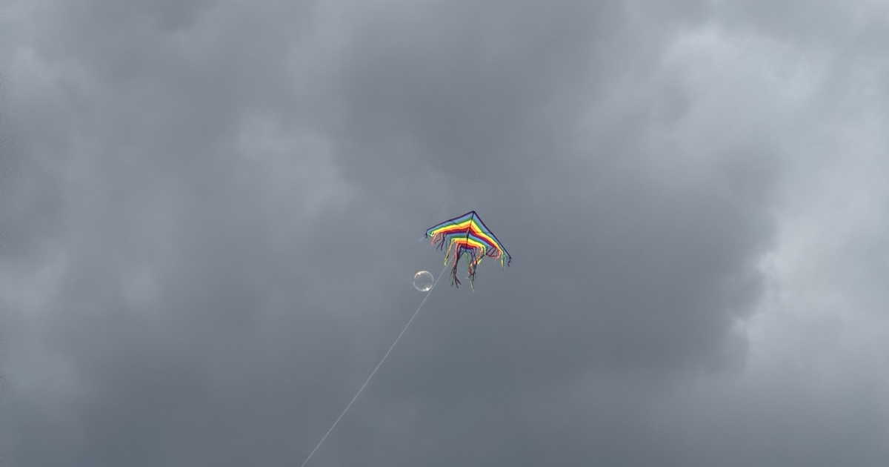
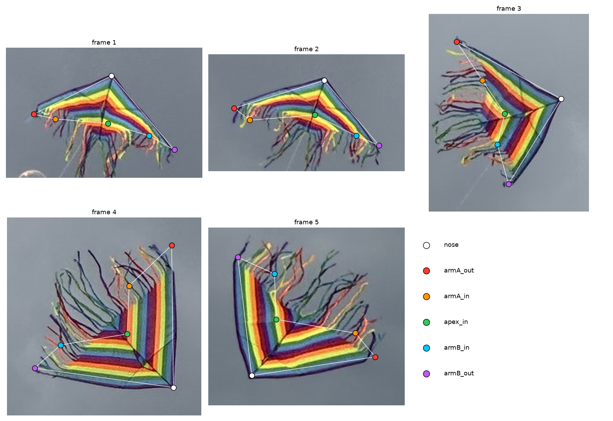
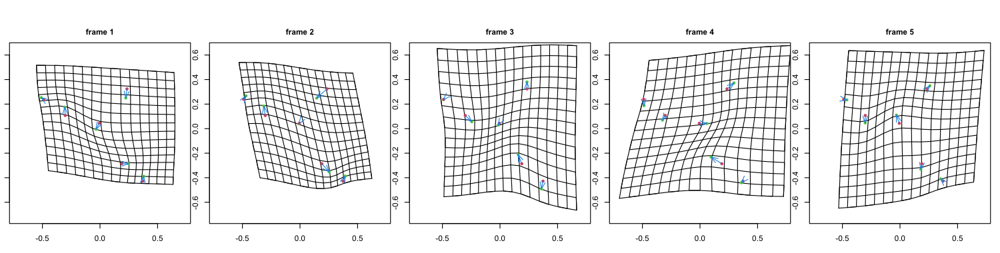
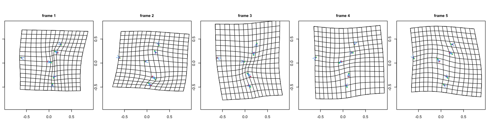

## Problem statement

Kendall shape analysis quotients out translation, scale, and rotation (the **similarity** group). Field photographs of a rigid object introduce **perspective**, which similarity cannot remove.

**Test case:** five iPhone photographs of one kite, nine seconds apart. Correct shape difference = 0. Standard GPA reports up to 0.33 Riemannian separation.

Method background: [Kendall shape analysis on synthetic pencils and optic nerve heads](../kendall-shape-analysis/index.qmd).

## Photograph data

**Provenance:** author photographs, Villa de Leyva kite festival, Boyacá, Colombia, 15 August 2026.

**Format:** iPhone HEIC, committed at 1512 × 2016 (half of 3024 × 4032). Timestamps 13:26:12–13:26:21 (9 s span).

**Collection:** handheld, no tripod, scale bar, or fixed distance.

**Objective:** does one rigid object photographed five times yield one shape under similarity quotient?

**Downstream impact:** morphometric studies comparing photographed specimens may confound biology with viewpoint if the nuisance group is wrong.

**Why this dataset:** ground truth is known (one unchanged kite); failure isolates the nuisance group, not landmark error.

## Image representation

A colour photograph is a $H \times W \times 3$ array of RGB intensities.

```{python}
#| label: fig-matrix
#| fig-cap: "One frame as a picture, as a brightness matrix, and as raw numbers. The sky patch is flat and bright: cloud is high in brightness and almost zero in colour."
import numpy as np
import matplotlib.pyplot as plt
from PIL import Image

photo = Image.open("photos/kite-01.jpg").convert("RGB")
rgb = np.asarray(photo)
grey = np.asarray(photo.convert("L"))

fig, axes = plt.subplots(1, 3, figsize=(13, 5))
axes[0].imshow(rgb)
axes[0].set_title(f"colour: {rgb.shape[1]} wide x {rgb.shape[0]} tall x {rgb.shape[2]}")
axes[1].imshow(grey, cmap="gray")
axes[1].set_title(f"brightness: {grey.shape[1]} wide x {grey.shape[0]} tall")

patch = grey[600:610, 500:510]
axes[2].imshow(patch, cmap="gray", interpolation="nearest", vmin=0, vmax=255)
for i in range(10):
    for j in range(10):
        axes[2].text(j, i, patch[i, j], ha="center", va="center", color="tab:red", fontsize=7)
axes[2].set_title("a 10x10 patch of cloud")
for ax in axes:
    ax.axis("off")
plt.show()
```

Cloud patch: high brightness, low colour spread.

## Saturation segmentation

**Saturation** = $(\max R,G,B - \min R,G,B) / \max R,G,B$. Kite fabric: high saturation. Sky: near zero.

Threshold 0.30 + largest connected component isolates the kite in all five frames. Streamers occupy ~half each mask and move independently — excluded from landmarks.

```{python}
#| label: fig-segment
#| fig-cap: "Top: the kite as photographed, cropped from each frame. Bottom: every pixel with saturation above 0.30. The sky vanishes completely."
from scipy import ndimage

def saturation(image):
    """Distance from grey, per pixel: (max channel - min channel) / max channel."""
    a = np.asarray(image).astype(np.float32) / 255.0
    top, bottom = a.max(axis=2), a.min(axis=2)
    return (top - bottom) / np.maximum(top, 1e-6)

def largest_blob(mask):
    """The biggest connected component, plus its bounding box."""
    labels, count = ndimage.label(mask)
    sizes = ndimage.sum(mask, labels, range(1, count + 1))
    best = int(np.argmax(sizes)) + 1
    return labels == best, ndimage.find_objects(labels)[best - 1]

fig, axes = plt.subplots(2, 5, figsize=(16, 7))
for frame in range(1, 6):
    image = Image.open(f"photos/kite-{frame:02d}.jpg").convert("RGB")
    kite, box = largest_blob(saturation(image) > 0.30)
    pad = 30
    rows = slice(max(0, box[0].start - pad), box[0].stop + pad)
    cols = slice(max(0, box[1].start - pad), box[1].stop + pad)
    axes[0][frame - 1].imshow(np.asarray(image)[rows, cols])
    axes[0][frame - 1].set_title(f"frame {frame}")
    axes[1][frame - 1].imshow(kite[rows, cols], cmap="gray")
for ax in axes.ravel():
    ax.axis("off")
plt.show()
```

Same kite appears as wide triangle (frame 1) vs narrow chevron (frame 4). Viewpoint changed; kite did not.

## Landmark correspondence

Procrustes requires **landmarks**: labelled points with the same anatomical meaning in every frame.

- Streamers excluded (non-rigid, no stable correspondence).
- Six sail landmarks on the rigid colour-chevron block:

| Label | Location |
|---|---|
| `nose` | Outer apex of leading edges |
| `armA_out`, `armB_out` | Far ends of leading edges |
| `armA_in`, `armB_in` | Inner boundary ends on each arm |
| `apex_in` | Inner apex where inner boundaries meet |

**Bilateral symmetry:** no single image determines which wing is `armA` vs `armB`. Fixed by consistent traversal order; frame 5 labels swapped relative to the photograph.

**Reflection:** Procrustes allows reflections (forbid → SS 0.855 vs 0.111 with allow). Affine ladder fits per frame separately and is not reflection-invariant.

**Digitisation:** hand-placed from committed photos, ±5 px on ~160 px sail width.



```{python}
#| label: load-landmarks
import csv

ORDER = ["nose", "armA_out", "armA_in", "apex_in", "armB_in", "armB_out"]

rows = list(csv.DictReader(open("landmarks.csv")))
by_frame = {}
for row in rows:
    by_frame.setdefault(int(row["frame"]), {})[row["landmark"]] = (
        float(row["x"]), float(row["y"]))

X = np.stack([np.array([by_frame[f][name] for name in ORDER]) for f in sorted(by_frame)])
print(f"{X.shape[0]} configurations of {X.shape[1]} landmarks in {X.shape[2]}D")
print(f"mean centroid size: {np.mean([np.linalg.norm(c - c.mean(0)) for c in X]):.0f} px")
```

## Nose-angle test

Similarity transformations preserve angles. If frames differ only by similarity, nose angle is invariant.

```{python}
#| label: nose-angle
def nose_angle(config):
    """Angle at the nose, between the two leading edges, in degrees."""
    left = config[ORDER.index("armA_out")] - config[ORDER.index("nose")]
    right = config[ORDER.index("armB_out")] - config[ORDER.index("nose")]
    cosine = np.dot(left, right) / (np.linalg.norm(left) * np.linalg.norm(right))
    return np.degrees(np.arccos(cosine))

angles = np.array([nose_angle(c) for c in X])
for frame, angle in enumerate(angles, start=1):
    print(f"  frame {frame}: {angle:6.2f} degrees")
print(f"\nspread: {angles.max() - angles.min():.1f} degrees")
```

Nose-angle spread: 31°. ±5 px jitter: 3.6–6.3° SD. Inter-frame map is not similarity.

## Generalised Procrustes analysis

Standard pipeline: centre, scale to unit Frobenius norm, iterate rotation-to-mean (GPA).

```{python}
#| label: gpa
def centre_and_scale(config):
    """Remove translation and size."""
    centred = config - config.mean(axis=0)
    return centred / np.linalg.norm(centred)

def align_onto(config, target):
    """Least-squares orthogonal map of `config` onto `target`, via an SVD.

    Reflections are allowed, deliberately. The usual version of this function
    forbids them, on the grounds that a mirror image is a different shape. That
    is right for a left and a right hand; it is wrong here, because which wing
    of a symmetric sail got labelled `armA` is a free choice rather than a fact
    about the kite (see above). Forbidding reflection would charge that free
    choice to the kite's shape.
    """
    u, _, vt = np.linalg.svd(target.T @ config)
    return config @ (vt.T @ u.T)

def gpa(configs, prepare=centre_and_scale, tol=1e-13, max_iter=500):
    """Generalised Procrustes: prepare each configuration, then iterate to a mean."""
    aligned = np.stack([prepare(c) for c in configs])
    mean = aligned[0]
    for _ in range(max_iter):
        aligned = np.stack([centre_and_scale(align_onto(c, mean)) for c in aligned])
        new_mean = centre_and_scale(aligned.mean(axis=0))
        if np.linalg.norm(new_mean - mean) < tol:
            break
        mean = new_mean
    return aligned, mean

aligned, mean_shape = gpa(X)
residual = np.linalg.norm(aligned - mean_shape, axis=(1, 2))
similarity_ss = float((residual ** 2).sum())
print("residual to the mean shape:", residual.round(4))
print(f"Procrustes sum of squares: {similarity_ss:.5f}")
print(f"RMS residual: {residual.mean():.4f}  ({100 * residual.mean():.1f}% of centroid size)")
```

RMS residual ≈ 0.15 at unit size. Procrustes SS = 0.111.

```{python}
#| label: fig-gpa-raw
#| fig-cap: "The five sails after generalised Procrustes analysis, with the mean shape in black. This is the best that translation, scale and rotation can do."
COLOURS = plt.cm.viridis(np.linspace(0.05, 0.85, 5))

def draw(ax, config, colour, lw=1.4, alpha=0.9):
    loop = np.vstack([config, config[0]])
    ax.plot(loop[:, 0], loop[:, 1], "-o", color=colour, lw=lw, ms=3.5, alpha=alpha)

fig, ax = plt.subplots(figsize=(6, 5))
for config, colour in zip(aligned, COLOURS):
    draw(ax, config, colour)
draw(ax, mean_shape, "black", lw=2.4, alpha=1.0)
ax.set_aspect("equal")
ax.invert_yaxis()
ax.set_title("After GPA: five frames of one rigid kite")
plt.show()
```

## Transformation model ladder

Candidate groups (nested):

| Model | DOF | Preserves | Use case |
|---|---|---|---|
| Similarity | 4 | Angles | Lab bench, square camera |
| Affine | 6 | Parallel lines | Weak perspective (distant camera) |
| Projective | 8 | Straight lines | General plane photograph |

Fit each model mapping frames 2–5 onto frame 1; compare RMS pixel error.

```{python}
#| label: ladder
from scipy.optimize import least_squares

def fit_similarity(src, dst, allow_reflection=True):
    """Best similarity map from `src` onto `dst` (Umeyama).

    Reflection is allowed by default, matching the Procrustes alignment above
    and for the same reason: the wing labelling is a free choice. Refusing it
    takes more than flipping the rotation matrix -- the smallest singular
    value's contribution to the optimal scale flips sign with it. Leaving
    `trace` at ``sv.sum()`` in that branch overshoots the scale, and is an easy
    bug to write by accident.
    """
    mu_s, mu_d = src.mean(0), dst.mean(0)
    s0, d0 = src - mu_s, dst - mu_d
    u, sv, vt = np.linalg.svd(d0.T @ s0)
    rotation = u @ vt
    trace = sv.sum()
    if not allow_reflection and np.linalg.det(rotation) < 0:
        u = u.copy()
        u[:, -1] *= -1
        rotation = u @ vt
        trace = sv[0] - sv[1]
    return (s0 @ rotation.T) * (trace / (s0 ** 2).sum()) + mu_d

def fit_affine(src, dst):
    design = np.hstack([src, np.ones((len(src), 1))])
    return design @ np.linalg.lstsq(design, dst, rcond=None)[0]

def apply_homography(h, src):
    p = np.hstack([src, np.ones((len(src), 1))]) @ h.T
    return p[:, :2] / p[:, 2:3]

def fit_projective(src, dst):
    """Normalised DLT for a starting point, then refine on *geometric* error.

    The plain DLT minimises an algebraic residual, which on six points can be
    far from the least-squares answer -- badly enough to score worse than the
    affine fit nested inside it, which is impossible for a correct fit.
    """
    def normalise(p):
        mu = p.mean(0)
        q = p - mu
        s = np.sqrt(2) / np.sqrt((q ** 2).sum(1)).mean()
        return np.array([[s, 0, -s * mu[0]], [0, s, -s * mu[1]], [0, 0, 1]]), np.hstack(
            [q * s, np.ones((len(p), 1))])

    t_src, ns = normalise(src)
    t_dst, nd = normalise(dst)
    rows = []
    for (x, y, _), (u, v, _) in zip(ns, nd):
        rows.append([x, y, 1, 0, 0, 0, -u * x, -u * y, -u])
        rows.append([0, 0, 0, x, y, 1, -v * x, -v * y, -v])
    _, _, vt = np.linalg.svd(np.array(rows))
    guess = np.linalg.inv(t_dst) @ vt[-1].reshape(3, 3) @ t_src
    guess = guess / guess[2, 2]
    fit = least_squares(
        lambda p: (apply_homography(np.append(p, 1.0).reshape(3, 3), src) - dst).ravel(),
        guess.ravel()[:8], method="lm", max_nfev=20000)
    return apply_homography(np.append(fit.x, 1.0).reshape(3, 3), src)

def rms(predicted, target):
    return float(np.sqrt(((predicted - target) ** 2).sum(1).mean()))

MODELS = [("similarity", 4, fit_similarity), ("affine", 6, fit_affine),
          ("projective", 8, fit_projective)]

print(f"{'onto frame 1':>14}" + "".join(f"{n + f' ({d})':>15}" for n, d, _ in MODELS))
totals = {name: [] for name, _, _ in MODELS}
for j in range(1, 5):
    line = f"{'frame ' + str(j + 1):>14}"
    for name, _, fit in MODELS:
        value = rms(fit(X[j], X[0]), X[0])
        totals[name].append(value)
        line += f"{value:15.2f}"
    print(line)
print(f"\n{'mean':>14}" + "".join(f"{np.mean(v):15.2f}" for v in totals.values()) + "   px")
```

**Noise floor:** RMS between two independent ±5 px jittered copies of the same frame (true difference = 0).

```{python}
#| label: ladder-floor
rng = np.random.default_rng(1)

print(f"{'':12}{'observed':>10}{'noise floor':>13}{'ratio':>8}")
for name, _, fit in MODELS:
    scores = []
    for base in X:
        for _ in range(120):
            a = base + rng.normal(0, 5, base.shape)
            b = base + rng.normal(0, 5, base.shape)
            scores.append(rms(fit(a, b), b))
    floor, seen = float(np.mean(scores)), float(np.mean(totals[name]))
    print(f"{name:12}{seen:10.2f}{floor:13.2f}{seen / floor:7.1f}x")
```

Ladder results (observed / noise floor):

- Similarity: 12.5 / 7.9 px — above floor (confirms nose-angle test).
- Affine: 8.2 / 6.7 px — near floor.
- Projective: 6.7 / 5.8 px — no improvement over affine on six landmarks.

**Reading:** weak perspective holds; affine is the smallest adequate model for these photographs.

## Affine quotient

Compare shapes up to affine maps, not similarity.

**Trap:** swapping GPA rotation for iterative affine fit collapses configurations (aspect ratio → 0.0002; false 74% viewpoint share).

::: {.callout-warning}
## Iterating affine fits to a mean is not affine Procrustes

Unit centroid size prevents shrink-to-point but not flatten-to-line. Check aspect ratio before trusting the residual.
:::

**Closed-form fix:** centre, SVD-whiten to isotropic second moment (`remove_affine`). Any affine image shares the same canonical form.

```{python}
#| label: whiten
def remove_affine(config):
    """Map a configuration to its affine-invariant canonical form."""
    centred = config - config.mean(axis=0)
    u, _, _ = np.linalg.svd(centred, full_matrices=False)
    whitened = u * np.sqrt(len(config))     # singular values replaced by 1
    return whitened / np.linalg.norm(whitened)

affine_aligned, affine_mean = gpa(X, prepare=remove_affine)
affine_residual = np.linalg.norm(affine_aligned - affine_mean, axis=(1, 2))
affine_ss = float((affine_residual ** 2).sum())

aspect = [np.divide(*np.linalg.svd(c, compute_uv=False)[::-1]) for c in affine_aligned]
print(f"aspect ratio of the aligned configurations: {np.mean(aspect):.3f}  (1.0 = no collapse)")
print(f"\nProcrustes SS, similarity quotient: {similarity_ss:.5f}")
print(f"Procrustes SS, affine quotient    : {affine_ss:.5f}")
print(f"share of shape variation the viewpoint explains: {100 * (1 - affine_ss / similarity_ss):.1f}%")
```

Affine quotient removes 38% of similarity SS. Aspect ratio stays 1.0 (no collapse).

## Digitisation noise floor

Simulate zero true shape difference: replicate one frame five times, jitter landmarks ($\sigma$ px), measure Procrustes SS.

Gaussian $\sigma = 5$ is slightly pessimistic vs ±5 px bound (RMS displacement ≈ 7 px).

```{python}
#| label: noise-floor
rng = np.random.default_rng(0)

def procrustes_ss(configs, prepare):
    aligned, mean = gpa(configs, prepare=prepare)
    return float((np.linalg.norm(aligned - mean, axis=(1, 2)) ** 2).sum())

# Every frame gets a turn as the base. Which one you pick matters: the flattest
# sails amplify jitter under the affine quotient, so a single base frame can
# understate the floor by a factor of three.
print(f"{'sigma':>7}{'similarity SS':>26}{'affine SS':>26}")
for sigma in [2, 3, 5, 8]:
    per_base = np.array([
        [np.mean([procrustes_ss(base + rng.normal(0, sigma, (5,) + base.shape), prepare)
                  for _ in range(300)])
         for prepare in (centre_and_scale, remove_affine)]
        for base in X
    ])
    cells = "".join(
        f"{per_base[:, k].mean():14.4f}  [{per_base[:, k].min():.4f}-{per_base[:, k].max():.4f}]"
        for k in (0, 1))
    print(f"{sigma:5.0f}px{cells}")

print(f"\n{'observed':>7}{similarity_ss:14.4f}{'':15}{affine_ss:14.4f}")
```

Results ($\sigma = 5$):

- Similarity: observed 0.111 vs floor 0.032 (3.5×) — failure not explained by digitisation.
- Affine: observed 0.068 vs floor 0.042 (1.6×); worst base frame 1.1×; at $\sigma = 8$ floor exceeds observed.

**Conclusion:**

- Similarity quotient is wrong for these photographs.
- Affine quotient removes real viewpoint variation.
- Residual after affine is within digitisation noise; sail billow cannot be resolved with six hand-placed landmarks.

## R shapes package cross-check

Ian Dryden's [`shapes`](https://cran.r-project.org/package=shapes): `procGPA`, `riemdist`, `tpsgrid`, `shapepca`.

R script (pre-run, committed figures): [`src/shapes_analysis.R`](https://github.com/project-delphi/ml-blog/blob/main/posts/kite-shape-analysis/src/shapes_analysis.R).

```{r}
#| eval: false
options(rgl.useNULL = TRUE)
library(shapes)

# landmarks.csv -> the k x m x n array every shapes:: function expects
X <- array(NA_real_, c(6, 2, 5))   # 6 landmarks, 2 coordinates, 5 frames

# Quotient out similarity. reflect = TRUE because the sail is bilaterally
# symmetric: no single photograph says which physical wing is which, so the
# labelling is a free choice and should not count as shape difference.
sim <- procGPA(X, scale = TRUE, reflect = TRUE)

# Quotient out affine, in closed form -- see the callout above for why the
# iterative version collapses.
whiten <- function(cfg) {
  cfg <- scale(cfg, center = TRUE, scale = FALSE)
  w <- svd(cfg)$u * sqrt(nrow(cfg))
  w / sqrt(sum(w^2))
}
aff <- procGPA(array(apply(X, 3, whiten), dim(X)), scale = TRUE, reflect = TRUE)

# Pairwise Riemannian distance in Kendall shape space
riemdist(X[, , 1], X[, , 2])

# Deformation grids, mean shape -> each frame
tpsgrid(sim$mshape, sim$rotated[, , 3], mag = 1, ngrid = 16, opt = 1)
```

```{python}
#| label: r-agreement
import json

r = json.load(open("r_results.json"))
print(f"R {r['r_version']}, shapes {r['shapes_version']}\n")
print(f"{'':22}{'R':>12}{'Python':>12}")
print(f"{'similarity SS':22}{r['similarity']['procrustes_ss']:12.5f}{similarity_ss:12.5f}")
print(f"{'affine SS':22}{r['affine']['procrustes_ss']:12.5f}{affine_ss:12.5f}")
print(f"{'uniform share':22}{100 * r['uniform_share']:11.1f}%{100 * (1 - affine_ss / similarity_ss):11.1f}%")

riem = np.array(r["riemannian"])
print("\npairwise Riemannian distance in shape space (R's riemdist):")
print(np.round(riem, 3))
print(f"\nlargest: {riem.max():.3f} between frames "
      f"{np.unravel_index(riem.argmax(), riem.shape)[0] + 1} and "
      f"{np.unravel_index(riem.argmax(), riem.shape)[1] + 1}")
```

Python and R agree to five decimal places. Maximum pairwise Riemannian distance: 0.33.






## Photograph warping

Thin-plate spline (TPS) warps images using the same landmark maps as `tpsgrid`. Each frame transported to a shared panel by similarity and by affine map.

```{r}
#| eval: false
# U(r) = r^2 log r^2, the 2D biharmonic kernel: the shape a thin metal plate
# takes when pinned at the landmarks. Solving for an affine part plus one
# radial term per landmark gives the smoothest map carrying every source
# landmark exactly onto its target.
tps_kernel <- function(d2) ifelse(d2 > 0, d2 * log(d2), 0)

tps_fit <- function(src, dst) {
  K <- tps_kernel(as.matrix(dist(src))^2)
  P <- cbind(1, src)
  L <- rbind(cbind(K, P), cbind(t(P), matrix(0, 3, 3)))
  W <- solve(L, rbind(dst, matrix(0, 3, 2)))
  list(src = src, w = W[seq_len(nrow(src)), ], a = W[nrow(src) + 1:3, ])
}

tps_apply <- function(fit, pts) {
  d2 <- outer(pts[, 1], fit$src[, 1], "-")^2 + outer(pts[, 2], fit$src[, 2], "-")^2
  cbind(1, pts) %*% fit$a + tps_kernel(d2) %*% fit$w
}

# Warping an image is the same map run backwards: for every output pixel, ask
# where in the original photograph it came from, then sample there.
warp <- function(photo, from, to) {
  sample_image(photo, tps_apply(tps_fit(to, from), output_grid))
}
```

The static version first, because it carries the finding on its own and an animation should never
be the only copy of a result.


- Top row: cropped source windows.
- Middle: similarity transport.
- Bottom: affine transport. Middle-to-bottom change is small visually despite 38% SS reduction.

### TPS extrapolation limits

Streamers smear outside the six-landmark hull. TPS interpolates inside; extrapolates (unreliably) outside. Streamers are non-rigid and lack correspondence.

### Morph animation


Pixel SD across aligned frames: 0.127 (similarity) vs 0.128 (affine) on sail bounding box — visually indistinguishable. Landmark registration improves 7.0 → 5.1 px (25%); too small to see without magnification.

## Summary

Kendall shape analysis removes only the nuisance group specified.

- Similarity (translation, scale, rotation) is insufficient for field photographs with perspective.
- Diagnostic checks: invariant angles, model ladder with noise floors, digitisation simulation, pixel warping.
- Affine quotient fits these data; residual after affine is within ±5 px landmark noise.

## References

- Dryden, I. L., and Mardia, K. V. (2016). *Statistical Shape Analysis, with Applications in R*, 2nd ed. Wiley.
- [`shapes` R package](https://cran.r-project.org/package=shapes) (Ian Dryden).
- Kalia, R. [Kendall shape analysis](../kendall-shape-analysis/index.qmd) — method background on synthetic pencils and optic nerve heads.
