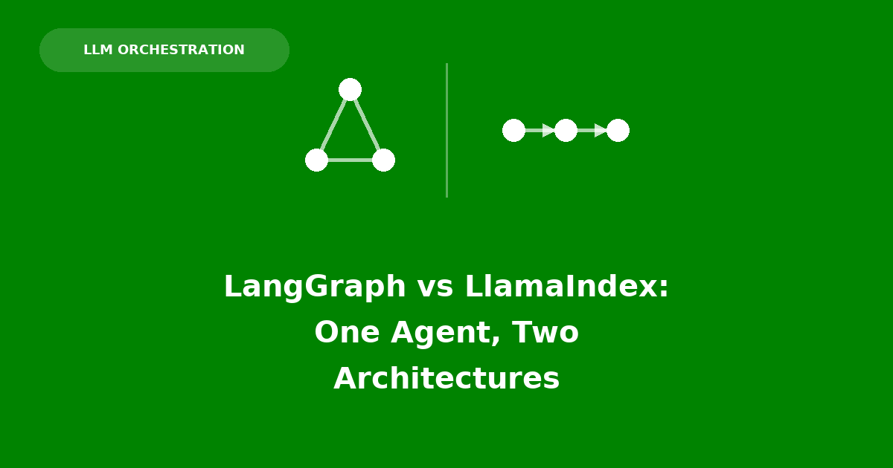

## Introduction

Here is one agent: an inbound customer-support email router. Classify the email into a department (billing, support, or sales), retrieve that department's policy knowledge with RAG, and draft a grounded reply. It's a small enough task to hold in your head completely, which makes it a good instrument for a different question — not "which framework is more powerful," but **what does each framework's core abstraction make easy, and what does it make hard?**

[LangGraph](https://langchain-ai.github.io/langgraph/) models an agent as a **graph traversal over shared state**: nodes are plain functions, edges (some conditional) decide what runs next, and a single mutable state object flows through the whole thing. [LlamaIndex Workflows](https://docs.llamaindex.ai/en/stable/module_guides/workflow/) models the same kind of agent as **event-driven steps**: `@step`-decorated async functions declare what event type they consume and what they emit, and the framework wires the graph implicitly from those type annotations.

This post builds the router twice — once in each framework — then raises the stakes with a second requirement (a 3-reply cap with human escalation) and watches where each architecture bends easily and where it doesn't. The full code for all four versions lives in [`code/`](./code/) alongside this post.

## What an LLM Agent Actually Is

Before comparing two concrete frameworks, it's worth being precise about what "agent" means, because the LLM itself does surprisingly little. A language model is a **stateless, text-in/text-out function**: give it a prompt, it gives back a completion, and it has no memory of having done so a moment ago.

```{python}
#| eval: false
class LLM:
    """A stateless model call. No memory between invocations."""

    def complete(self, prompt: str) -> str:
        ...  # one forward pass, one string back
```

Everything that makes a system feel like an "agent" — deciding what to do next, remembering earlier turns, calling a tool, retrying, escalating — is orchestration code sitting *around* that one function. Stripped to its essence, an agent is a loop with three moving parts: something that builds a prompt from the model's current context, something that interprets the model's output as a decision, and something that carries state from one call to the next so the next prompt can be built with full context.

```{python}
#| eval: false
class Agent:
    """The orchestration loop wrapped around a stateless LLM."""

    def __init__(self, llm: LLM):
        self.llm = llm
        self.state: dict = {}

    def step(self, observation: str) -> str:
        prompt = self.build_prompt(observation, self.state)
        raw = self.llm.complete(prompt)
        action = self.interpret(raw)           # e.g. "route to billing"
        self.state = self.update_state(self.state, action)
        return action
```

Nothing in that sketch is specific to LangGraph or LlamaIndex — it's the shape underneath a hand-rolled `while` loop, a single `if/else` chain, or a full graph framework alike. What actually differs between frameworks is how `self.state` is modeled (one shared dict vs. typed messages passed between handlers) and how the "what happens next" decision is structured (declared edges vs. inferred from types). That's precisely the axis the rest of this post walks through, on one concrete agent.

## The Agent, Stated Once

Both versions solve the identical problem:

1. Classify an inbound email into `billing`, `support`, or `sales`.
2. Retrieve the 2 most relevant policy snippets from that department's knowledge base.
3. Draft a short reply grounded only in the retrieved context.

Both scripts use the same `gpt-4o-mini` model and the same three department knowledge bases — the comparison below is about architecture, not model choice. The one deliberate asymmetry is classification itself: LangGraph forces a typed, schema-validated decision via `with_structured_output`; LlamaIndex asks for free-form text and parses it by hand with a string fallback. That's not a fairness gap — it's each framework's idiomatic way of getting a department out of the model, and it's called out again where it appears below.

## LangGraph: A Graph Over Shared State

### The state schema

LangGraph starts by declaring a `TypedDict` — the single object every node reads from and writes a partial update to:

```{python}
#| eval: false
class State(TypedDict):
    email: str
    department: str
    context: str
    draft: str


# Structured output schema so classification is typed, not string-parsed
class RouteDecision(BaseModel):
    department: Literal["billing", "support", "sales"] = Field(
        description="The department best suited to answer this email."
    )
```

Every node signature is the same shape: `State in, partial-dict update out`. There's no separate concept of "what does this node need" beyond "which keys of `State` does it read" — the whole graph shares one namespace.

```{python}
#| eval: false
def classify(state: State) -> dict:
    decision = llm.with_structured_output(RouteDecision).invoke(
        "Classify this customer email into one department.\n\n"
        f"EMAIL:\n{state['email']}"
    )
    return {"department": decision.department}


def make_retrieve_node(dept: str):
    """Factory: one retrieval node per department."""

    def retrieve(state: State) -> dict:
        docs = STORES[dept].similarity_search(state["email"], k=2)
        return {"context": "\n\n".join(d.page_content for d in docs)}

    return retrieve
```

Notice `make_retrieve_node`: LangGraph's author chose to build **three separate named nodes** (`retrieve_billing`, `retrieve_support`, `retrieve_sales`) via a factory, rather than one node that branches internally on `state["department"]`. Nothing about LangGraph forces that choice, but it's the natural idiom — if you want each branch visible in the graph's topology (useful for logging, tracing, or `graph.get_graph().draw_mermaid()`), you give it a name and an edge.

### Conditional edges

Routing is declared, not written as an `if/else` inside a node:

```{python}
#| eval: false
builder.add_conditional_edges(
    "classify",
    route,                      # returns "billing" | "support" | "sales"
    {dept: f"retrieve_{dept}" for dept in DEPARTMENT_DOCS},
)
```

The dict literal *is* the branch table. Every possible destination is named up front, at graph-construction time — a structural guarantee that a `classify` node can't accidentally route somewhere unwired.

```{mermaid}
%%{init: {'theme':'base', 'themeVariables': {'primaryColor':'#ffffff','primaryBorderColor':'#4A3AA7','primaryTextColor':'#1a1a1a','lineColor':'#4A3AA7','edgeLabelBackground':'#ffffff'}}}%%
flowchart LR
    START([START]) --> classify
    classify -->|billing| rb[retrieve_billing]
    classify -->|support| rs[retrieve_support]
    classify -->|sales| rsl[retrieve_sales]
    rb --> draft
    rs --> draft
    rsl --> draft
    draft --> END([END])
```

## LlamaIndex: Workflows as an Event Bus

### Events as the wires between steps

LlamaIndex has no graph object to build. Instead, custom `Event` subclasses describe the payloads that move between steps:

```{python}
#| eval: false
class RoutedEvent(Event):
    department: str


class ContextReadyEvent(Event):
    department: str
    context: str
```

A `@step` method declares what it consumes and what it returns in its type signature — that's the entire wiring mechanism. There's no separate `builder.add_edge(...)` call anywhere; the framework infers the graph from which steps consume which event types.

```{python}
#| eval: false
class EmailRouterWorkflow(Workflow):
    @step
    async def classify(self, ctx: Context, ev: StartEvent) -> RoutedEvent:
        email: str = ev.email
        await ctx.store.set("email", email)  # stash for later steps

        resp = await Settings.llm.acomplete(
            "Classify this customer email into exactly one department: "
            "billing, support, or sales.\n"
            "Reply with only the department name, lowercase.\n\n"
            f"EMAIL:\n{email}"
        )
        dept = resp.text.strip().lower()
        if dept not in INDEXES:
            dept = "support"
        return RoutedEvent(department=dept)

    @step
    async def retrieve(self, ctx: Context, ev: RoutedEvent) -> ContextReadyEvent:
        email: str = await ctx.store.get("email")
        retriever = INDEXES[ev.department].as_retriever(similarity_top_k=2)
        nodes = await retriever.aretrieve(email)
        context = "\n\n".join(n.get_content() for n in nodes)
        return ContextReadyEvent(department=ev.department, context=context)
```

`retrieve` is a **single** step handling all three departments, dispatching on `ev.department` as ordinary data (`INDEXES[ev.department]`). Where LangGraph's author reached for three named nodes plus a branch table, LlamaIndex's plain-Python dict lookup inside one step does the same job — and the department fan-out is invisible from outside the step; nothing in the workflow's static structure shows three branches.

Also notice `classify` here isn't using structured output the way LangGraph's version does: it asks the model for a bare lowercase word and parses `resp.text` by hand, with `dept not in INDEXES` as a manual fallback to `"support"`. Nothing in LlamaIndex prevents `with_structured_output`-style validation — this script just didn't reach for it, so a truly apples-to-apples pair would need one of the two updated to match.

### The Context store

`email` has to survive from `classify` to `retrieve` to `draft`, but it isn't part of any event payload after `classify` emits `RoutedEvent`. `ctx.store` is the escape hatch — a plain async key-value store scoped to the running workflow, for exactly this kind of "not really an event, just some state I need later" data:

```{python}
#| eval: false
@step
async def draft(self, ctx: Context, ev: ContextReadyEvent) -> StopEvent:
    email: str = await ctx.store.get("email")
    resp = await Settings.llm.acomplete(
        f"You are a {ev.department} representative. Draft a short, "
        "friendly reply to the customer email below. Base your answer "
        "ONLY on the company knowledge provided.\n\n"
        f"COMPANY KNOWLEDGE:\n{ev.context}\n\n"
        f"CUSTOMER EMAIL:\n{email}\n\n"
        "REPLY:"
    )
    return StopEvent(result={"department": ev.department, "draft": resp.text.strip()})
```

```{mermaid}
%%{init: {'theme':'base', 'themeVariables': {'primaryColor':'#ffffff','primaryBorderColor':'#4A3AA7','primaryTextColor':'#1a1a1a','lineColor':'#4A3AA7','edgeLabelBackground':'#ffffff'}}}%%
flowchart LR
    Start([StartEvent: email]) -->|consumes| classify
    classify -->|RoutedEvent| retrieve
    retrieve -->|ContextReadyEvent| draft
    draft --> Stop([StopEvent: result])
```

## What Each Paradigm Makes Easy, So Far

At this stateless, single-turn scale the two are close to a wash:

- **Branching a known set of routes** is slightly more ceremony in LangGraph (name a node per branch, populate a dict) but the payoff is a topology you can inspect and draw. LlamaIndex folds the same branching into ordinary control flow inside one step — less ceremony, but the branch count is now only discoverable by reading the function body.
- **Passing incidental state** (`email`, needed three steps later) is implicit in LangGraph — it's just another key in the shared `State` dict, present everywhere. LlamaIndex requires an explicit `ctx.store.set` / `ctx.store.get` pair — more typing, but it's clear at each call site exactly what a step depends on beyond its declared event.
- **Typed contracts.** LlamaIndex's events are Pydantic models, so `RoutedEvent(department=...)` is validated at construction. LangGraph's `State` is a `TypedDict` — structurally documented, but not validated at runtime; a node returning `{"deprtment": "billing"}` (typo) would silently create a new, unused key rather than raise.

Neither architecture is under real pressure yet, because nothing here spans more than one email. The next requirement changes that.

## Raising the Stakes: Reply Cap + Escalation

New business rule: **the agent may reply to a customer thread at most 3 times.** On the 4th inbound email, stop drafting and forward the whole thread to the department inbox for a human.

This is no longer a single-shot function — it's a *thread* that spans multiple invocations, needs to remember how many times it has already replied, and needs a genuinely new control-flow branch (escalate) that didn't exist before.

### LangGraph v2: a new node in front of the old one

The state schema grows a message list (with a reducer), a reply counter, and escalation fields:

```{python}
#| eval: false
class State(TypedDict, total=False):
    messages: Annotated[list[BaseMessage], add_messages]  # full thread
    department: str
    context: str
    reply_count: int
    escalated: bool
    forward: str  # the internal forward composed on escalation
```

`Annotated[list[BaseMessage], add_messages]` is a **reducer**: instead of a node's return value replacing `state["messages"]`, LangGraph appends to it. That's the graph declaring, once, how updates to this field should merge — every node can just return `{"messages": [new_message]}` without knowing or caring about the existing list.

The reply-cap check becomes a new node, `gate`, wired in *before* the original entry point:

```{python}
#| eval: false
def gate(state: State) -> dict:
    """Anchor node for the reply-cap branch. No state change."""
    return {}


def route_gate(state: State) -> str:
    if state.get("reply_count", 0) >= MAX_AGENT_REPLIES:
        return "escalate"
    return "classify"
```

`gate` does no work — its only job is to give `route_gate`'s conditional edge a node to attach to. The original `classify` node is otherwise untouched, aside from one guard so it doesn't re-classify a thread that's already been routed:

```{python}
#| eval: false
def classify(state: State) -> dict:
    if state.get("department"):  # already routed on a previous turn
        return {}
    decision = llm.with_structured_output(RouteDecision).invoke(...)
    return {"department": decision.department}
```

Cross-invocation persistence — remembering `reply_count` and `department` from one `graph.invoke()` to the next — is handled by compiling with a checkpointer and passing a `thread_id`:

```{python}
#| eval: false
graph = builder.compile(checkpointer=MemorySaver())

thread = {"configurable": {"thread_id": "customer-4482"}}
result = graph.invoke({"messages": [HumanMessage(content=email)]}, thread)
```

Each call only sends the *new* inbound message; the checkpointer restores everything else from the last checkpoint under that `thread_id`, merges the new message in via the `add_messages` reducer, and persists the result.

```{mermaid}
%%{init: {'theme':'base', 'themeVariables': {'primaryColor':'#ffffff','primaryBorderColor':'#4A3AA7','primaryTextColor':'#1a1a1a','lineColor':'#4A3AA7','edgeLabelBackground':'#ffffff'}}}%%
flowchart LR
    START([START]) --> gate
    gate -->|reply_count >= 3| escalate
    gate -->|else| classify
    classify -->|billing| rb[retrieve_billing]
    classify -->|support| rs[retrieve_support]
    classify -->|sales| rsl[retrieve_sales]
    rb --> draft
    rs --> draft
    rsl --> draft
    draft --> END1([END])
    escalate --> END2([END])
```

### LlamaIndex v2: the old step absorbs the new logic

LlamaIndex has no separate "graph" to insert a node into. The natural entry point for a workflow is whichever step consumes `StartEvent` — and there was already exactly one of those (`classify`). So the reply-cap logic doesn't get a new node in front; it gets folded into the entry step itself, renamed `intake`:

```{python}
#| eval: false
class EmailThreadWorkflow(Workflow):
    @step
    async def intake(
        self, ctx: Context, ev: StartEvent
    ) -> RoutedEvent | EscalateEvent:
        """Record the inbound email, enforce the reply cap, route."""
        email: str = ev.email

        history: list = await ctx.store.get("history", default=[])
        history.append({"role": "customer", "content": email})
        await ctx.store.set("history", history)

        reply_count: int = await ctx.store.get("reply_count", default=0)
        department: str | None = await ctx.store.get("department", default=None)

        if reply_count >= MAX_AGENT_REPLIES:
            return EscalateEvent(department=department or "support")

        if department is None:  # classify once per thread; then it sticks
            resp = await Settings.llm.acomplete(...)
            department = resp.text.strip().lower()
            if department not in INDEXES:
                department = "support"
            await ctx.store.set("department", department)

        return RoutedEvent(department=department)
```

The return type `RoutedEvent | EscalateEvent` — a plain Python union — is what makes this a branching step: LlamaIndex infers from the annotation that `intake` can lead to either `retrieve` (which consumes `RoutedEvent`) or a new `escalate` step (which consumes `EscalateEvent`). No separate branch table to populate; the type checker's union *is* the branch declaration.

Persistence across `wf.run()` calls needs no framework-level concept like a checkpointer at all — it's just Python object reuse. The same `Context` instance is passed into every call for a given customer:

```{python}
#| eval: false
wf = EmailThreadWorkflow(timeout=120, verbose=False)
ctx = Context(wf)  # ONE context = ONE customer thread; reuse across runs

for email in inbound:
    result = await wf.run(email=email, ctx=ctx)
```

`ctx.store` holds `history`, `reply_count`, and `department` explicitly — nothing is restored automatically the way LangGraph's checkpointer restores `State`. Every step that needs prior data fetches it with `await ctx.store.get(...)`.

```{mermaid}
%%{init: {'theme':'base', 'themeVariables': {'primaryColor':'#ffffff','primaryBorderColor':'#4A3AA7','primaryTextColor':'#1a1a1a','lineColor':'#4A3AA7','edgeLabelBackground':'#ffffff'}}}%%
flowchart LR
    Start([StartEvent: email]) --> intake
    intake -->|"EscalateEvent (reply_count >= 3)"| escalate
    intake -->|"RoutedEvent (else)"| retrieve
    retrieve -->|ContextReadyEvent| draft
    draft --> Stop1([StopEvent: reply])
    escalate --> Stop2([StopEvent: escalated])
```

## How the New Requirement Exposed the Differences

Both versions ended up almost the same length — this was never a "one framework needs less code" story. The differences are structural, and they trace directly back to what each core abstraction treats as a first-class concept:

**Where the new logic went.** LangGraph's graph has an explicit shape you can insert into: `gate` slots in *before* `classify` as a new named node with its own edge, and `classify` needed only a one-line memoization guard. LlamaIndex's entry point is defined by "whichever step consumes `StartEvent`," and there's only one natural place for that — so the new gating logic had nowhere to go but *into* the existing entry step, which is why `intake` is a visibly heavier function than the `classify` it replaced. Insertion vs. absorption is a direct consequence of one framework having an explicit graph object to edit and the other not.

**What persistence costs.** LangGraph's checkpointer + `thread_id` is opt-in infrastructure decided once, at `compile()` time; after that, every node just returns partial updates and trusts the reducer (`add_messages`) and the checkpointer to do the merging and restoring. LlamaIndex's `Context` is an explicit object you must remember to create once and thread through every `wf.run()` call yourself, and every field it holds is read and written by hand via `ctx.store`. The first is a declarative promise made to the framework; the second is an imperative promise you keep yourself.

**What memoization costs.** Interestingly, this part is equally manual in both — `classify`'s `if state.get("department"): return {}` and `intake`'s `if department is None:` are the same guard, hand-written in both frameworks. Neither one auto-memoizes a step's work across invocations of the same thread; that logic is on you either way.

**Branching mechanics.** LangGraph's new branch is a dict (`{"escalate": "escalate", "classify": "classify"}`) — a runtime data structure inspectable at graph-build time. LlamaIndex's new branch is a type annotation (`RoutedEvent | EscalateEvent`) — a compile-time (or at least static-analysis-time) contract with no runtime object representing "the graph" at all.

## Verdict

| | LangGraph | LlamaIndex Workflows |
|---|---|---|
| Core abstraction | Graph of nodes + edges over shared, typed-dict state | Async steps wired implicitly by the `Event` types they consume/emit |
| Branching declared as | A dict passed to `add_conditional_edges` | A `Union` return-type annotation |
| Incidental state | Implicit — any key on the shared `State` | Explicit — `await ctx.store.get/set` |
| Cross-invocation persistence | First-class: checkpointer + `thread_id`, restored automatically | Manual: reuse the same `Context` object yourself |
| Inserting logic before an existing entry point | Add a node + edge; original node barely changes | Folds into the existing entry step; that step grows |
| Topology you can inspect/draw | Yes — `graph.get_graph().draw_mermaid()` | No separate graph object exists |
| New vocabulary on top of Python | Nodes, edges, conditional edges, reducers, checkpointers | Events, steps — much closer to "just async functions" |

For a single-turn, stateless task like the v1 router, the choice barely matters — both are a thin layer over "call an LLM, do some routing, call an LLM again." The gap opens once state has to survive across turns and a new branch has to be threaded in without disturbing what's already there. **Reach for LangGraph** when the agent is genuinely multi-turn and thread-scoped state is core to the problem (this email router with a reply cap, a human-in-the-loop review queue, anything where you want to pause, inspect, and resume a specific conversation by ID) — the checkpointer earns its keep, and having an actual graph object pays off the moment you want to visualize, replay, or time-travel-debug a run. **Reach for LlamaIndex Workflows** when the mental model is closer to a set of async functions reacting to typed messages than to named states and transitions — fewer new concepts to learn on top of plain Python and `asyncio`, at the cost of hand-rolling whatever persistence the task needs via `Context`.

## Key Takeaways

- The same email-routing agent, built twice, stays nearly identical in size and shape at v1 — the frameworks only diverge once state has to persist across multiple invocations.
- LangGraph makes branching and shared state *implicit and declarative* (a dict of edges, a `TypedDict`, a reducer) at the cost of a larger vocabulary (nodes, edges, conditional edges, checkpointers).
- LlamaIndex Workflows makes control flow *explicit in the type system* (event unions) and keeps incidental state in an escape-hatch `Context` store, staying closer to plain `asyncio` at the cost of manual state threading.
- Adding the reply-cap requirement inserted a new node *in front of* LangGraph's existing entry point, but had to be *absorbed into* LlamaIndex's existing entry step — a direct consequence of one framework having an editable graph object and the other inferring its graph from type annotations.
- Neither framework auto-memoizes "classify once per thread" — that guard is hand-written in both.
