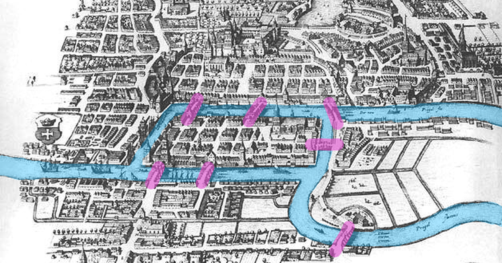

The first LLM application anyone builds is a chain: prompt, model, parse, done. The
second needs to do something different depending on what the model said, call a tool,
come back, and maybe loop, and at that point the chain has to become a program with
control flow and memory. LangGraph is the library that makes that program explicit: a
graph of nodes, each a function or a model call, all reading and writing one shared
state, with edges that say where to go next. This is the tour I wrote in March 2025,
of what the graph buys and how the pieces fit; the API has moved since, and the
post that builds a real agent on it twice is
[LangGraph vs LlamaIndex](../langgraph-vs-llamaindex/).

## A chain hides control flow; a graph declares it

LangChain's chain is a sequence, and a sequence cannot branch or repeat except by
nesting chains inside code that does. LangGraph lifts the control flow into data:
nodes are the steps, edges are the transitions, and a conditional edge picks the next
node from the state. Three things follow that a chain cannot offer without help.
Branches are visible and testable, because they are edges rather than `if` statements
buried in a callback. Independent branches can run in parallel. And because the state
is one object that every node reads and writes, the workflow always knows where it is,
which is what a long-lived conversational agent needs to pick up after a tool call or
a pause.

| | Chain | Graph |
|---|---|---|
| Structure | a list of steps | nodes and edges |
| Control flow | linear, or code around the chain | conditional edges in the graph |
| State | inputs and outputs passed step to step | one shared, typed state |
| Concurrency | none built in | parallel branches |
| Fits | a prompt with one model call | agents, tools, loops, multi-step workflows |

## The pieces are a state, some nodes, and edges to `END`

The whole API is small. A `StateGraph` is built over a state type, which is usually a
typed dictionary; nodes are functions from state to state; edges connect them; and
`END` is the node that stops. Compile it, and the result is a callable that runs the
graph from its entry point. The illustrative version below counts, which is enough to
see every piece and is the shape of the 2025 API rather than a current one:

```python
from typing import TypedDict

from langgraph.graph import END, StateGraph


class State(TypedDict):
    count: int


def increment(state: State) -> State:
    return {"count": state["count"] + 1}


def adjust(state: State) -> State:
    even = state["count"] % 2 == 0
    return {"count": state["count"] + (2 if even else -1)}


builder = StateGraph(State)
builder.add_node("increment", increment)
builder.add_node("adjust", adjust)
builder.set_entry_point("increment")
builder.add_edge("increment", "adjust")
builder.add_edge("adjust", END)

graph = builder.compile()
print(graph.invoke({"count": 0}))   # increment -> 1, odd -> 0: {'count': 0}
```

Read the trace against the graph: `increment` takes 0 to 1, `adjust` sees an odd count
and subtracts one, `END` stops. The earlier version of this post printed 2 for that
run, which the code could not produce; the arithmetic is the point of a worked
example, so it is traced here. A real agent replaces `increment` with a model call
and `adjust` with a conditional edge that routes to a tool node or to `END` on what
the model returned, and the loop back from the tool to the model is one more edge.

## When the graph is worth its weight

A graph is more to read than a chain, and for a prompt with one model call it is
overhead. It pays for itself at the first conditional: a router that sends a request to
one of several handlers, a tool-using agent that loops until it has an answer, a
multi-agent system where several roles share one state, or any workflow that has to
survive a pause and resume. Those are the cases where the `if` statements were
becoming the program anyway, and the graph makes them the program on purpose.

Chains. Go. Straight. Graphs. Branch. State. Persists. Agents. Need. That.

## References

- [LangGraph documentation](https://langchain-ai.github.io/langgraph/)
- [LangChain documentation](https://python.langchain.com/)
- [LangGraph vs LlamaIndex](../langgraph-vs-llamaindex/) on this blog: the same agent
  built twice, and the current API
- [LLM agents from first principles](../llm-agents-from-first-principles/) on this
  blog, for what the loop is without a framework
