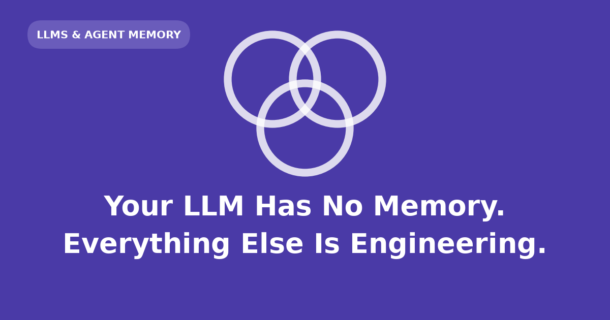

An LLM is **stateless per call**: each request is independent; no state survives inside the model. "Memory" is external engineering — what goes into the prompt, what is stored outside it, and when it is re-injected.

This post uses a voice assistant (speech in, transcript to model, text-to-speech out) as the running example.

## Context window

Within one call, the model appears to remember because the full conversation is re-sent each turn.

- The model reads one block of text per request.
- The **context window** caps how much text fits; the transcript lives under that ceiling.
- Turn *n* includes the system prompt and all prior turns in one request.

```{python}
SYSTEM = "You are a phone assistant. Two sentences max; replies are spoken aloud."

turns = [
    ("user", "Hi, call me Alex"),
    ("assistant", "Nice to meet you, Alex."),
    ("user", "How hard should tomorrow's ride be?"),
]
request = [{"role": "system", "content": SYSTEM}]
request += [{"role": r, "content": c} for r, c in turns]

print(f"{len(request)} messages, {sum(len(m['content']) for m in request)} characters sent")
```

Every message is sent on each turn. Latency and cost grow with transcript length.

Compaction (**context editing**) replaces older turns with a summary when the window fills, rather than dropping the oldest turn outright (which often holds the most valuable facts).

```{python}
def compact(history, keep=4):
    """Replace all but the last `keep` turns with one summary message."""
    old, recent = history[:-keep], history[-keep:]
    gist = "; ".join(c for _, c in old)[:60]
    return [{"role": "system", "content": f"Earlier in this call: {gist}…"}] + [
        {"role": r, "content": c} for r, c in recent
    ]

long_call = turns * 8
print(f"{len(long_call)} messages -> {len(compact(long_call))} after compaction")
```

Compaction is lossy and dies when the call ends. Facts needed across sessions must be stored elsewhere.

## Prompt slots

Each request has two injection points, not memory stores:

- **System prompt** — fixed frame: persona, rules, constraints. In voice apps: short replies, no markdown, units spelled out.
- **User prompt** — the current turn.

Cross-session facts must live outside the prompt and be injected back into a slot on the next call.

## Long-term storage options

Four mechanisms; pick by size, shape, and lookup pattern:

### RAG

For facts in a large, fuzzy, changing corpus (e.g., help-centre articles).

- Embed document chunks; embed the query at call time; retrieve nearest neighbours by meaning.
- Pattern: [retrieval-augmented generation](../how-does-rag-work/) (RAG).
- Cost: embedding call, extra tokens, occasional irrelevant chunks.

### Key-value lookup

For small, discrete per-user facts (voice ID, name, language, timezone).

- `user_id → voice_id` is faster and more reliable than vector search.
- Belongs on the latency path (e.g., TTS voice selection).

### Memory tool

For facts the schema did not anticipate.

- Give the agent write/read tools pointed at durable storage.
- The agent decides what to persist (e.g., tone preferences).
- Requires curation: files grow, contradict, and go stale.

```{python}
import tempfile
from pathlib import Path

store = Path(tempfile.mkdtemp())  # a real deployment uses durable storage


def memory_write(user_id, text):
    """The agent's write tool: append a durable fact about this caller."""
    path = store / f"{user_id}.md"
    with path.open("a") as fh:
        fh.write(text + "\n")
    return f"wrote {len(text)} chars to {path.name}"


print(memory_write("u_8213", "- Prefers a calm, low-pitched voice; dislikes the default."))
print(memory_write("u_8213", "- Usually asks about cycling training."))
```

### Fine-tuning

Rarely appropriate for personal facts.

- Facts become part of model weights; not editable per user, not inspectable, not deletable without retraining.
- Use for behavior and style, not per-user state.

## Compaction and memory tool ordering

Compaction rewrites older turns into a summary. If compaction runs before the memory tool writes durable facts, information is lost.

- Write durable facts **before** compaction lands.
- RAG needs a vector database for embedded corpus search.
- **Prompt caching** is a latency/billing optimization over a stable prefix, not memory.

## Session assembly

Session two starts with an empty window. The assistant "knows" the caller because code assembles context before the first token:

```{python}
voices = {"u_8213": "bm_george"}  # key-value store: user_id -> Kokoro voice pack

remembered = (store / "u_8213.md").read_text()
system_prompt = f"{SYSTEM}\n\nWhat you know about this caller:\n{remembered}"

print("TTS voice:", voices["u_8213"])
print("---")
print(system_prompt)
```

- Key-value lookup for voice
- Memory file read into system prompt
- Empty window filled turn by turn; RAG may run mid-call for corpus questions

## Kokoro TTS

`bm_george` names a voice pack in [Kokoro-82M](https://huggingface.co/hexgrad/Kokoro-82M): 82M parameters, Apache-2.0, StyleTTS 2 architecture, ISTFTNet vocoder, 54 voices, ~327MB.

Personalizing voice costs one string in a key-value row; the TTS model runs locally.

Audio clips were generated ahead of render by `src/make_audio.py` against Kokoro weights; only greeting text and voice ID differ:

::: {.widget}

```{=html}
<div class="tts-demo">
  <div class="tts-row">
    <button class="tts-play" data-target="tts-1" aria-label="Play the session one greeting">&#9654;</button>
    <div>
      <span class="tts-meta">Session 1 — nothing stored yet. Default voice, <code>af_heart</code>.</span><br>
      “Nice to meet you. How can I help?”
    </div>
    <audio id="tts-1" preload="none" src="audio/session-1-default.mp3"></audio>
  </div>
  <div class="tts-row">
    <button class="tts-play" data-target="tts-2" aria-label="Play the session two greeting">&#9654;</button>
    <div>
      <span class="tts-meta">Session 2 — name from the memory file, voice from the key-value store, <code>bm_george</code>.</span><br>
      “Morning, Alex. Ready to talk about tomorrow's ride?”
    </div>
    <audio id="tts-2" preload="none" src="audio/session-2-remembered.mp3"></audio>
  </div>
</div>

<style>
/* The .widget wrapper is unstyled in this post — bayesian-bootstrap's theme.scss
   is not shipped here — so spacing lives on .tts-demo itself. */
.tts-demo {
  display: flex; flex-direction: column; gap: .9rem;
  margin: 1.6rem 0 1.9rem; padding: 1.1rem 1.2rem;
  border: 1px solid rgba(128, 128, 128, .32); border-radius: .5rem;
}
.tts-row { display: flex; align-items: center; gap: .85rem; line-height: 1.45; }
.tts-meta { font-size: .82em; opacity: .72; }
.tts-play {
  flex: 0 0 auto; width: 2.6rem; height: 2.6rem; border: 0; border-radius: 50%;
  background: #4A3AA7; color: #fff; font-size: .95rem; cursor: pointer;
}
.tts-play:hover { background: #6A5CBB; }
.tts-play:focus-visible { outline: 2px solid #6A5CBB; outline-offset: 2px; }
</style>

<script>
document.querySelectorAll('.tts-play').forEach(function (button) {
  var audio = document.getElementById(button.dataset.target);
  button.addEventListener('click', function () {
    document.querySelectorAll('.tts-demo audio').forEach(function (other) {
      if (other !== audio) { other.pause(); other.currentTime = 0; }
    });
    audio.paused ? audio.play() : audio.pause();
  });
  audio.addEventListener('play', function () { button.innerHTML = '&#10074;&#10074;'; });
  ['pause', 'ended'].forEach(function (event) {
    audio.addEventListener(event, function () { button.innerHTML = '&#9654;'; });
  });
});
</script>
```

:::

Session 2 uses name from the memory file and voice from the key-value store; neither came from the LLM.

## Mechanism comparison

| Concept | What it stores | Where it lives | Persists across sessions? | Best for |
|---|---|---|---|---|
| Context window / conversation history | Transcript of one session | The request, every turn | No | Coherence within one call |
| System prompt | Persona, rules, injected memory | Top of every request | No — you re-inject it | Session-wide behaviour: "keep replies speakable" |
| User prompt | The current turn | The request | No | Whatever the user just said |
| Compaction / context editing | A summary replacing older turns | The request, rewritten | No | Sessions that outgrow the window |
| RAG | Documents, as embeddings | Vector database over your corpus | Yes | Large fuzzy corpora searched at call time |
| Key-value store lookup | Small discrete facts, by key | Any ordinary datastore | Yes | Per-user settings: voice ID, name, language |
| Memory tool (agent-managed files) | Whatever the model judged durable | Files it reads and writes via tools | Yes | Preferences no schema anticipated |
| Fine-tuning | Patterns baked into weights | The model itself | Yes, but not editable | Behaviour and style, not personal facts |

## Debugging

The model never remembers; failures are assembly or storage issues:

- Forgetting within a call → compaction dropped information
- Forgetting between calls → nothing was stored
- False statements → retrieval miss or stale stored fact

## References

- [How Does RAG Work?](../how-does-rag-work/)
- [Kokoro-82M](https://huggingface.co/hexgrad/Kokoro-82M) — text-to-speech model used for demo audio
