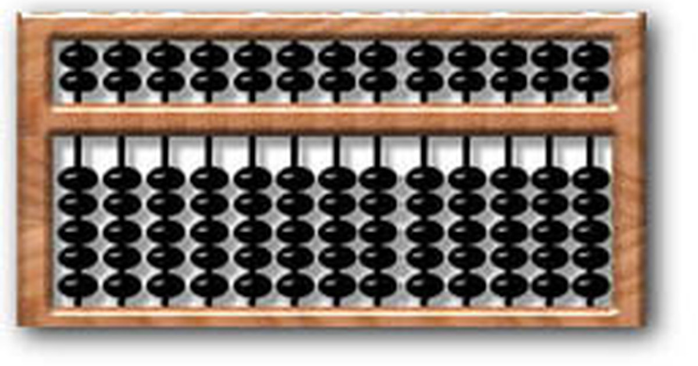

Token prices move faster than almost anything else in this industry — several of the providers below have repriced more than once in the past few months, and at least one intro rate on this page expires at the end of August. So read this as a snapshot taken in early August 2026, not a standing reference. Every figure is **USD per million tokens** unless stated otherwise.

The headline rate is the number everyone compares, and it is the one that explains the least. Caching, long-context surcharges, modality coverage and output multiples each move a real bill further than the difference between two providers' advertised per-token prices — which is why two models at the same \$2.00 input can cost very different amounts to actually run.

Covered here: **Anthropic** (Claude), **OpenAI** (GPT), **Google** (Gemini), **DeepSeek**, **Moonshot** (Kimi), **Alibaba** (Qwen), and **xAI** (Grok) — one section each with per-model rates, context windows and supported modalities, then a single combined table sorted by input price, and the structural differences that outlast any particular number.

Two conventions worth fixing before the tables start. A dash (—) in a Context column means the provider does not publish a headline window for that model, not that the window is unlimited. And providers mix decimal and binary units when quoting windows: 262K and 256K are the same 262,144-token window written two ways, as are 1.05M and 1M. Small differences between providers' stated windows are often unit conventions rather than real capability gaps.

## Where these numbers come from, and how far to trust them

This matters more than usual for a pricing post, so it goes before the tables rather than in a footnote.

The figures below are **compiled from secondary sources** — pricing-tracker sites and explainer posts, listed in full under Further Reading — with one exception: the Anthropic table was checked against Anthropic's own published documentation, which is the only first-party pricing page in the reference list. Nobody collected this dataset as a survey; it is an aggregation of what various trackers reported in early August 2026, and those trackers are themselves reading provider pages on their own schedules. Two of them disagreeing by a decimal place is a normal occurrence, not an anomaly.

That provenance sets the ceiling on what this post can support. It is reliable for the questions it is built to answer — which tier is roughly in which price band, which providers surcharge long context, who treats audio and video as first-class — because those conclusions survive a figure being off by 10%. It is **not** a billing source of truth. A per-token rate you are about to multiply by projected volume should come from the provider's own pricing page, not from here, because the cost of being wrong is a budget that misses by the size of the error and a procurement decision made on a stale number. Where a figure below carries an internal oddity worth a second look, the text says so.

## Anthropic charges one rate no matter how long the prompt

Anthropic prices on a clean tiered ladder — small/mid/large/frontier — and is the only Western major with **no long-context surcharge**: on models 4.6 and newer the rate is flat regardless of prompt length. (Haiku 4.5 predates that guarantee, but at a 200K window it has no long-context tier to surcharge in the first place.)

| Model | Input $/M | Output $/M | Context | Notes |
|:---|---:|---:|---:|:---|
| Haiku 4.5 | 1.00 | 5.00 | 200K | Cheapest tier; the one current model not at 1M |
| Sonnet 5 | 2.00 | 10.00 | 1M | Intro rate through 31 Aug 2026; then 3.00 / 15.00 |
| Opus 5 | 5.00 | 25.00 | 1M | |
| Fable 5 | 10.00 | 50.00 | 1M | Frontier tier |
| Mythos 5 | 10.00 | 50.00 | 1M | Same capabilities and price as Fable 5, but **not generally available** — Project Glasswing participants only |

**Modalities:** text, image, PDF/documents.

**Discounts:** prompt caching takes roughly 90% off cached input *reads* — but cache *writes* cost more than base input (1.25× at the 5-minute TTL, 2× at the 1-hour), so break-even is two requests at 5m and three at 1h. The Batch API is a flat 50% off both input *and* output.

## OpenAI spreads the widest price range, and taxes long context

Anthropic's flat rate is the exception, not the rule. OpenAI's GPT-5.6 line spans a far wider price range — Luna is among the cheapest tiers anywhere, Sol among the most expensive — and it does charge a long-context premium. Audio also lives in a separate, much pricier model rather than being folded into the text SKUs.

| Model | Input $/M | Output $/M | Context | Notes |
|:---|---:|---:|---:|:---|
| GPT-5.6 Luna | 0.20 | 1.20 | 1.05M | Budget tier |
| GPT-5.6 Terra | 2.00 | 12.00 | 1.05M | Mid tier |
| GPT-5.6 Sol | 5.00 | 30.00 | 1.05M | Flagship |
| GPT-Realtime-2.1 | 32.00 | 64.00 | — | Audio in / audio out, per M audio tokens |

**Modalities:** text and image on the GPT-5.6 line; audio only via GPT-Realtime-2.1.

**Long-context surcharge:** above 272K tokens, input is charged at 2× and output at 1.5×.

## Gemini treats audio and video as first-class, not as a separate product

OpenAI's split between text SKUs and a separate audio model is the industry's usual shape. Google is the exception: Gemini takes audio and video as first-class inputs on every tier, and is the only provider here that also sells image and video *generation* per unit. It charges its own long-context premium, at a lower threshold than OpenAI's.

| Model | Input $/M | Output $/M | Context | Notes |
|:---|---:|---:|---:|:---|
| Gemini 3.5 Flash-Lite | 0.30 | 2.50 | — | Cheapest tier |
| Gemini 3.6 Flash | 1.50 | 7.50 | — | Mid tier |
| Gemini 3.1 Pro (≤200K) | 2.00 | 12.00 | 2M | Rate below the 200K threshold |
| Gemini 3.1 Pro (>200K) | 4.00 | 18.00 | 2M | Long-context rate |

**Modalities:** text, image, audio, video. Image generation from \$0.02/image; video generation from \$0.15/second.

**Discounts:** Batch is 50% off. Cache *storage* is billed separately at \$1–4.50 per M tokens per hour.

## DeepSeek's discount depends entirely on what you compare it to

That is the Western field: broad modality coverage, and a surcharge once prompts get long. The Chinese labs compete on the axis the Western majors mostly don't — headline rate. DeepSeek has the lowest output price in this comparison and an aggressive cache-hit rate on top. Against the Western *flagships* the gap is one to two orders of magnitude — V4-Flash input is 36× cheaper than Opus 5 and 71× cheaper than Fable 5 — but against their budget tiers it nearly vanishes, to 1.4× versus GPT-5.6 Luna. Which comparison you make decides whether DeepSeek looks transformative or marginal. The trade-off is scope: text only, no batch tier.

| Model | Input $/M | Output $/M | Context | Notes |
|:---|---:|---:|---:|:---|
| V4-Flash | 0.14 | 0.28 | 1M | Cache-hit input \$0.0028 |
| V4-Pro | 0.435 | 0.87 | 1M | Cache-hit input \$0.0036 |

**Modalities:** text.

**Caveats:** no batch tier, and a 2× peak-hour pricing scheme has been announced without a start date — worth watching if you are budgeting on these rates.

One figure here is worth checking at the source before you rely on it: V4-Pro's cache-hit input works out to 99.2% off its base rate, against 98% for V4-Flash, which would mean the more expensive model gets the deeper proportional discount. That is possible but unusual, and a single-decimal transcription slip in a secondary source would produce exactly this pattern. It is also the sole basis for the "up to 99%" upper bound in the takeaways below.

## Kimi buys native video with the weakest batch tier here

DeepSeek buys its price floor by staying text-only. Kimi spends some of that advantage back on modality: it sits between the Chinese price leaders and the Western flagships, and is the only non-Google provider here with native video input. It also has the weakest batch tier on this page — a 40% discount where Anthropic and Google give 50% — and the flagship is excluded from it entirely.

| Model | Input $/M | Output $/M | Context | Notes |
|:---|---:|---:|---:|:---|
| K2.5 | 0.60 | 3.00 | 262K | Batch eligible |
| K2.6 / K2.7 Code | 0.95 | 4.00 | 256K | Batch eligible |
| K3 | 3.00 | 15.00 | 1M | Flagship; cache-hit input \$0.30; **not** batch eligible |

**Modalities:** text, image, video.

**Discounts:** batch bills at 60% of the standard rate — a 40% discount, not 60% off — and applies to K2.5/K2.6/K2.7 only.

## Qwen has the lowest input price, at one regional endpoint of two

Kimi pays for video with a weak batch tier. Qwen's concession is geographic instead: its headline numbers are among the lowest for a flagship-class model, but everything below is the **international (Singapore)** rate, and the cheaper endpoint is not equally reachable.

| Model | Input $/M | Output $/M | Context | Notes |
|:---|---:|---:|---:|:---|
| Qwen3.5 Flash | 0.10 | 0.40 | — | Lowest input price in this comparison |
| Qwen3.5 Plus | 0.40 | 2.40 | 1M | |
| Qwen3.8-Max | 2.00 | 6.00 | 1M | Flagship; cached input \$0.25 |

**Modalities:** text on Flash (some image variants); text and image on Plus and Max.

**Regional pricing:** the Mainland China endpoint is 60–70% cheaper, but comes with no free quota.

## Grok sells access to live social data, not a lower rate

Every provider so far competes on some combination of price, modality, and context. Grok competes on data nobody else can sell: live X/Twitter access is a first-class input across the line. Its other oddity is the output multiple — 2–3× input, where most Western text tiers sit at 5–6× and Gemini 3.5 Flash-Lite reaches 8.3×. Only DeepSeek is as low, at a flat 2× that Grok 4.3 exactly matches; the rest of the Chinese field runs 3–6×, no cheaper on output than the West. So "Chinese labs are cheaper" holds on input far more reliably than on output.

| Model | Input $/M | Output $/M | Context | Notes |
|:---|---:|---:|---:|:---|
| Grok 4.1 Fast | 0.20 | 0.50 | 2M | Joint-largest context here, tied with Gemini 3.1 Pro |
| Grok 4.3 | 1.25 | 2.50 | 1M | |
| Grok 4.5 | 2.00 | 6.00 | 500K | Flagship; cached input \$0.50; no batch discount |

**Modalities:** text, image, live X/Twitter data.

## Sorted end to end, the price bands overlap more than the tiers suggest

Seven providers, seven different things being optimised. Sorting every model by input price puts those choices on one axis — and shows how much the tiers overlap once provider labels come off.

| Provider | Model | Input $/M | Output $/M | Context | Modalities | Notes |
|:---|:---|---:|---:|---:|:---|:---|
| Alibaba | Qwen3.5 Flash | 0.10 | 0.40 | — | text | some image variants |
| DeepSeek | V4-Flash | 0.14 | 0.28 | 1M | text | |
| OpenAI | GPT-5.6 Luna | 0.20 | 1.20 | 1.05M | text, image | |
| xAI | Grok 4.1 Fast | 0.20 | 0.50 | 2M | text, image, live X | |
| Google | Gemini 3.5 Flash-Lite | 0.30 | 2.50 | — | text, image, audio, video | |
| Alibaba | Qwen3.5 Plus | 0.40 | 2.40 | 1M | text, image | |
| DeepSeek | V4-Pro | 0.435 | 0.87 | 1M | text | |
| Moonshot | K2.5 | 0.60 | 3.00 | 262K | text, image, video | |
| Moonshot | K2.6 / K2.7 Code | 0.95 | 4.00 | 256K | text, image, video | same window as K2.5, binary units |
| Anthropic | Haiku 4.5 | 1.00 | 5.00 | 200K | text, image, PDF | |
| xAI | Grok 4.3 | 1.25 | 2.50 | 1M | text, image, live X | |
| Google | Gemini 3.6 Flash | 1.50 | 7.50 | — | text, image, audio, video | |
| Anthropic | Sonnet 5 | 2.00 | 10.00 | 1M | text, image, PDF | intro rate to 31 Aug 2026; then 3.00 / 15.00 |
| OpenAI | GPT-5.6 Terra | 2.00 | 12.00 | 1.05M | text, image | |
| Google | Gemini 3.1 Pro | 2.00 | 12.00 | 2M | text, image, audio, video | rate at ≤200K |
| Alibaba | Qwen3.8-Max | 2.00 | 6.00 | 1M | text, image | |
| xAI | Grok 4.5 | 2.00 | 6.00 | 500K | text, image, live X | |
| Moonshot | K3 | 3.00 | 15.00 | 1M | text, image, video | |
| Google | Gemini 3.1 Pro | 4.00 | 18.00 | 2M | text, image, audio, video | rate above 200K |
| Anthropic | Opus 5 | 5.00 | 25.00 | 1M | text, image, PDF | |
| OpenAI | GPT-5.6 Sol | 5.00 | 30.00 | 1.05M | text, image | |
| Anthropic | Fable 5 | 10.00 | 50.00 | 1M | text, image, PDF | |
| Anthropic | Mythos 5 | 10.00 | 50.00 | 1M | text, image, PDF | ‡ not generally available |
| OpenAI | GPT-Realtime-2.1 | 32.00 | 64.00 | — | audio | † per M **audio** tokens |

† Audio and text tokens are not interchangeable units, so this row's position in the price sort is not a like-for-like comparison with the text-token rows above it.

‡ Project Glasswing participants only. Listed for completeness, not as a tier you can buy.

## The structural differences move a bill further than the headline rate

Read down the sorted table and the tiers blur: five models sit at exactly \$2.00 input, one from each of five different providers, and the cheapest and dearest text tiers are a hundredfold apart with everything else packed in between. The headline rate is where comparison starts, not where it ends. Four things separate these providers once the rate stops being the deciding factor:

- **Caching usually moves the bill more than the rate does** — 75–99% off cached input, which dominates real-world cost for any workload with a stable system prompt. But the asymmetry decides whether it helps at all: cache *writes* cost more than base input (1.25–2× on Anthropic, depending on TTL), so caching only pays from the second or third request onward. A low-reuse workload is worse off with it, and no headline rate tells you that.
- **Long-context surcharges relocate the price at exactly the prompt sizes that matter.** OpenAI charges 2× input and 1.5× output past 272K, Google past 200K. Anthropic is alone among the Western majors in charging one rate throughout, so its 1M-context models bill the same at 1M as at 1K — which can invert a comparison made on headline rates alone. Several Chinese providers also list no surcharge.
- **Modality coverage is a hard boundary, not a discount.** Gemini takes audio and video as first-class inputs on every tier; Kimi handles image and video; DeepSeek and most of Qwen are text shops. No price advantage helps if the provider cannot accept your input at all.
- **Output multiples vary more than input prices do.** 2× at DeepSeek and Grok 4.3, 8.3× at Gemini 3.5 Flash-Lite. On output-heavy workloads that ratio, not the input rate, sets the bill — which is why Qwen3.5 Flash and DeepSeek V4-Flash cost exactly the same on a typical 3:1 mix despite Qwen being 29% cheaper on input.

The cheap-Chinese-labs story survives all this, but narrowed: they lead on input price and hold that lead against Western *flagships* by one to two orders of magnitude, while against Western budget tiers the gap falls under 2× and on output multiples they hold no advantage at all.

So the snapshot is worth what a snapshot is worth. Several of these providers repriced more than once in the past few months, one intro rate on this page expires at the end of August, and the figures come from trackers rather than from the providers themselves. Treat the bands and the structural differences as the durable part — those are what change how you'd build — and treat every individual number as something to confirm before it reaches a budget.

## Further reading & references

**Anthropic**

- [Anthropic platform pricing documentation](https://platform.claude.com/docs/en/about-claude/pricing)
- [CloudZero: Claude pricing breakdown](https://www.cloudzero.com/blog/claude-pricing/)
- [MetaCTO: Anthropic API pricing — full breakdown of costs and integration](https://www.metacto.com/blogs/anthropic-api-pricing-a-full-breakdown-of-costs-and-integration)
- [BenchLM: Anthropic API pricing tracker](https://benchlm.ai/anthropic/api-pricing)

**OpenAI**

- [Finout: OpenAI pricing in 2026](https://www.finout.io/blog/openai-pricing-in-2026)
- [DevTK: OpenAI API pricing guide 2026](https://devtk.ai/en/blog/openai-api-pricing-guide-2026/)
- [BenchLM: OpenAI API pricing tracker](https://benchlm.ai/openai/api-pricing)
- [AI Pricing Guru: OpenAI pricing](https://www.aipricing.guru/openai-pricing/)

**Google (Gemini)**

- [Fello AI: Gemini pricing explained](https://felloai.com/gemini-pricing/)
- [CloudZero: Gemini pricing breakdown](https://www.cloudzero.com/blog/gemini-pricing/)
- [BenchLM: Google API pricing tracker](https://benchlm.ai/google/api-pricing)
- [CostGoat: Gemini API pricing](https://costgoat.com/pricing/gemini-api)

**DeepSeek**

- [Morph: DeepSeek API overview and rates](https://www.morphllm.com/deepseek-api)
- [Fello AI: DeepSeek pricing explained](https://felloai.com/deepseek-pricing/)
- [BenchLM: DeepSeek API pricing tracker](https://benchlm.ai/deepseek/api-pricing)
- [CostGoat: DeepSeek API pricing](https://costgoat.com/pricing/deepseek-api)

**Moonshot (Kimi)**

- [Puter: Kimi API pricing tutorial](https://developer.puter.com/tutorials/kimi-api-pricing/)
- [BenchLM: Moonshot API pricing tracker](https://benchlm.ai/moonshot/api-pricing)
- [SecondTalent: every Kimi AI model explained and compared](https://www.secondtalent.com/resources/every-kimi-ai-model-explained-compared/)
- [CostGoat: Kimi API pricing](https://costgoat.com/pricing/kimi-api)

**Alibaba (Qwen)**

- [Puter: Qwen API pricing tutorial](https://developer.puter.com/tutorials/qwen-api-pricing/)
- [eesel: Qwen pricing guide](https://www.eesel.ai/blog/qwen-pricing)
- [BenchLM: Alibaba API pricing tracker](https://benchlm.ai/alibaba/api-pricing)
- [YottaLabs: Qwen 3.8 API access, token plans and pricing 2026](https://www.yottalabs.ai/post/qwen-3-8-api-access-token-plan-pricing-2026)

**xAI (Grok)**

- [Fello AI: Grok pricing explained](https://felloai.com/grok-pricing/)
- [Layer3 Labs: Grok 4.5 API pricing guide](https://www.layer3labs.io/guides/grok-4-5-api-pricing)
- [BenchLM: xAI API pricing tracker](https://benchlm.ai/xai/api-pricing)
- [Mem0: xAI Grok API pricing](https://mem0.ai/blog/xai-grok-api-pricing)

## A note on accuracy

Every number here reflects rates as reported by the sources above as of **8 August 2026**, and will go stale quickly. Intro rates expire (Sonnet 5's on 31 August 2026), announced changes land without warning (DeepSeek's peak-hour multiplier), and regional endpoints diverge from the international rates quoted here.

One caveat about that reference list, since the sources shape what the figures are worth: it is almost entirely **secondary** — pricing trackers and explainer posts. Anthropic's is the only first-party pricing page in it, and the Anthropic table is correspondingly the only one checked against the provider's own documentation. For the other six providers, go to that provider's own pricing page before committing anything to a budget. Nothing linked below is a substitute for it.
