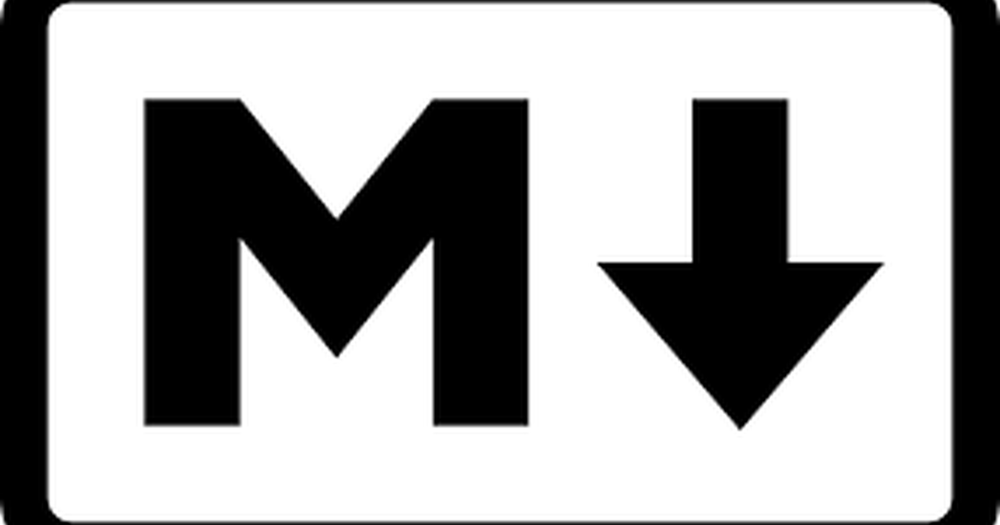

Every technical writer uses markdown daily and few stop to ask why it is called that.
The name is not a pun; it is a design rule, and the rule explains why the format has
outlived a dozen richer ones.

I was preparing a workshop on Quarto, which builds its whole workflow on a markdown
variant, and was reading the excellent [Quarto documentation](https://quarto.org/docs/guide/)
when I came across the line that names the rule, from the format's author:

> A Markdown-formatted document should be publishable as-is, as plain text, without
> looking like it's been marked up with tags or formatting instructions.
> — [John Gruber](https://daringfireball.net/projects/markdown/syntax#philosophy)

Markup languages, HTML above all, mark text *up*: they add tags around it that a
machine reads and a person has to see past. Markdown marks text *down*: the
asterisks, hashes and dashes are the marks people were already making in plain-text
email to show emphasis, headings and lists, so a document is readable before any
conversion and stays readable after. I had always thought of markdown as a shorthand
for HTML. It is the other way round: the plain text is the document, and the HTML is
one rendering of it.

Names. Carry. Intent. Markdown. Stays. Readable. Unmarked. Plain. Text. First.

## References

- Gruber, J. (2004). [Markdown: Syntax, Philosophy](https://daringfireball.net/projects/markdown/syntax#philosophy)
- [Quarto guide](https://quarto.org/docs/guide/)
