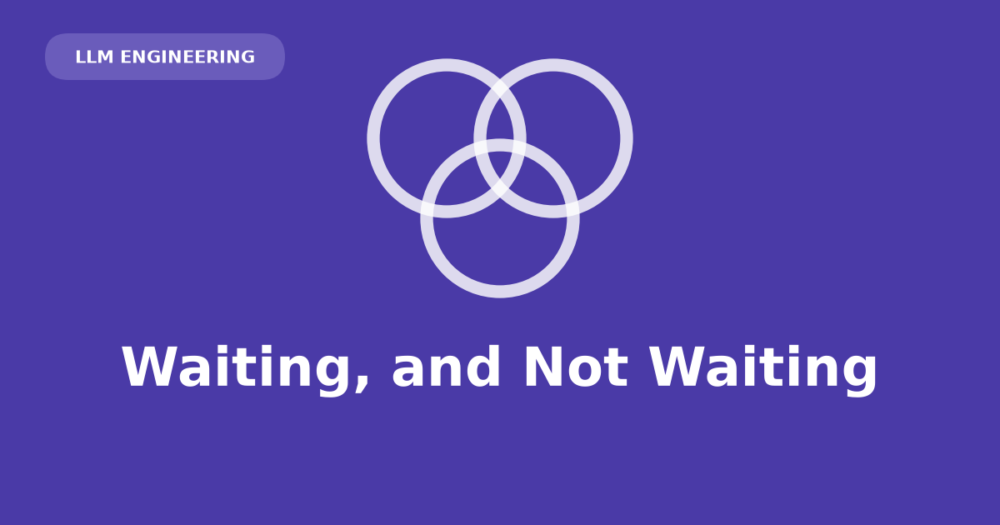

The Anthropic Messages API (`POST /v1/messages`) returns a complete `Message` or streams it as Server-Sent Events (SSE). Same endpoint, same request body except one field. Delivery mode affects UX, timeouts, and parsing — especially for tool calls.

## Endpoint

All requests go through `POST /v1/messages`. Tool use, images, and structured output are request fields, not separate endpoints.

Properties:

- **Stateless.** No session id; resend the full message list each turn.
- **`content` is a list of blocks**, not a string. `claude-opus-5` emits a `thinking` block before text; tool calls add another. Check `block.type`; do not assume `content[0].text`.

## Non-streaming requests

Block until generation completes; receive one finished `Message`.

```{python}
#| eval: false
import anthropic

client = anthropic.Anthropic()  # reads ANTHROPIC_API_KEY from the environment

response = client.messages.create(
    model="claude-opus-5",
    max_tokens=4096,  # covers thinking *and* text — see below
    messages=[{"role": "user", "content": "Name three uses for a paperclip."}],
)

for block in response.content:
    if block.type == "text":
        print(block.text)
```

- `max_tokens` caps **all** generated tokens, including thinking — not just printed text. Too low → `stop_reason: "max_tokens"` and truncated or empty output.
- Full responses are easier to log, assert on, and test. Prefer non-streaming while validating prompts.

## Streaming

The server keeps the connection open and writes labelled chunks (`event:` + `data:` JSON) as they become ready — Server-Sent Events (SSE) over plain HTTP.

Reasons to stream:

- **Perceived latency** — time-to-first-token drops; total generation time unchanged.
- **Timeouts** — long non-streaming requests can be dropped by proxies or client idle limits. The Python SDK raises `ValueError` for non-streaming requests with `max_tokens` large enough to risk this.

```{python}
#| eval: false
with client.messages.stream(
    model="claude-opus-5",
    max_tokens=1024,
    messages=[{"role": "user", "content": "Name three uses for a paperclip."}],
) as stream:
    for text in stream.text_stream:
        print(text, end="", flush=True)

    final = stream.get_final_message()  # the same object create() would return

print(f"\n[{final.usage.output_tokens} output tokens]")
```

`get_final_message()` accumulates all events and returns the same object as `create()`. For timeout avoidance only, use this and ignore individual events.

## Event sequence

`text_stream` wraps a nested open/close structure:

| Event | What it carries |
|---|---|
| `message_start` | The `Message` shell — id, model, role, with `content` empty |
| `content_block_start` | A block begins, at a given `index` |
| `content_block_delta` | One fragment, for the block at that `index` |
| `content_block_stop` | That block is complete |
| `message_delta` | Top-level updates: `stop_reason`, and cumulative `usage` |
| `message_stop` | Done |

`index` is the block's position in the final `content` array. Multiple blocks (thinking, text, tool call) are distinguished by index.

Delta types include `text_delta`, `thinking_delta`, `signature_delta`, and `input_json_delta` (tool arguments). Treat the list as open.

::: {.callout-note}
## Parser pitfalls

- `usage` on `message_delta` is **cumulative**, not per-event.
- Streams may include `ping` events and unknown event types — ignore unrecognized types.
:::

## Tool argument fragments

A tool is a function description (name, description, argument schema). The model returns the name and arguments; your code executes the function.

Streamed tool arguments arrive as `input_json_delta` events with `partial_json` — literal substrings of the serialized JSON:

```json
{"type":"input_json_delta","partial_json":"{\"location\":"}
{"type":"input_json_delta","partial_json":" \"San"}
{"type":"input_json_delta","partial_json":" Francisc"}
{"type":"input_json_delta","partial_json":"o, CA\"}"}
```

Individual fragments are not valid JSON. Parsing each delta as it arrives fails; occasional fragments may parse as unrelated valid JSON.

::: {.callout-warning}
## Concatenate first, parse once

Append each `partial_json` to a buffer keyed by block `index`. Call `json.loads()` only after that block's `content_block_stop`. The final `tool_use.input` is always a complete object.
:::

Prefer `get_final_message()` for parsed `input` dicts when tools are in play.

## Mode selection

| What you're building | Mode | Why |
|---|---|---|
| Batch job, eval harness, classifier | Full response | Nobody's watching a clock. Simpler code, testable output. Consider the Batches API too — same requests, half the price |
| Chat UI | Streaming | The entire point is time-to-first-word |
| Agent that calls tools | Streaming, accumulated | Turns run long; use `get_final_message()` and treat tool input as one value, never as fragments |
| Long report generation | Streaming, not optional | This is the timeout case — a large `max_tokens` without streaming is a connection waiting to be dropped |

Stream when a human watches output or when response length risks connection drops. Otherwise use non-streaming.

## Failures and recovery

**Overload:** 529 `overloaded_error` is retryable. SDK defaults: `max_retries=2` with exponential backoff on 429, 5xx, and connection errors. Mid-stream overload arrives as an `error` event.

Once bytes flow, dropped connections and mid-stream errors are your responsibility — the SDK cannot rewind a stream.

**Resume after drop:** send received text back as a **user** message asking the model to continue. On Claude 4.6+, prefilling the assistant turn is rejected.

Recovery limits:

- **Text blocks** — can resume from partial text.
- **Tool use blocks** — half-delivered JSON has no valid object to replay.
- **Thinking blocks** — closed by cryptographic `signature_delta`; unsigned fragments cannot be replayed. Discard back to the last completed text block.

::: {.callout-tip}
## Raw event iterator exercise

`client.messages.create(..., stream=True)` and print `event.type`:

```{python}
#| eval: false
last_usage = None

for event in client.messages.create(
    model="claude-opus-5",
    max_tokens=4096,
    messages=[{"role": "user", "content": "Name three uses for a paperclip."}],
    stream=True,
):
    print(event.type)
    if event.type == "message_delta":
        last_usage = event.usage

print(last_usage.output_tokens)
```

On `claude-opus-5`, expect **two** `content_block_start`/`content_block_stop` pairs (thinking then text). Compare final `output_tokens` to `stream.get_final_message().usage.output_tokens` — they match, confirming cumulative usage.
:::
