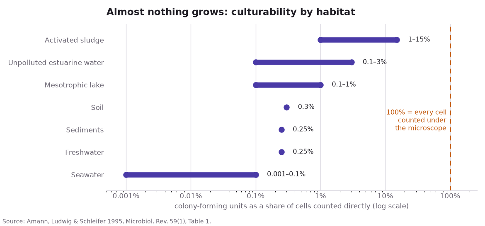
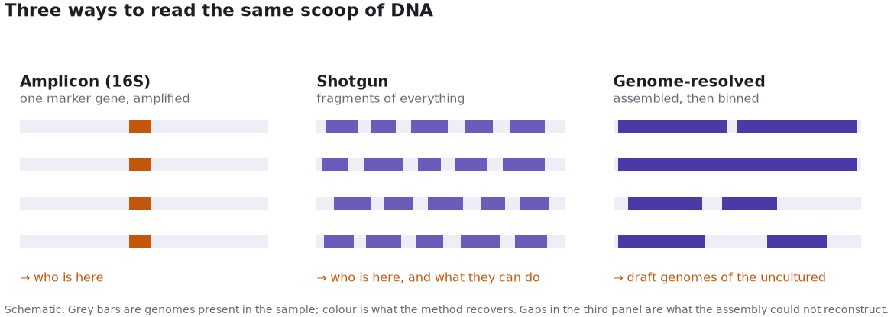
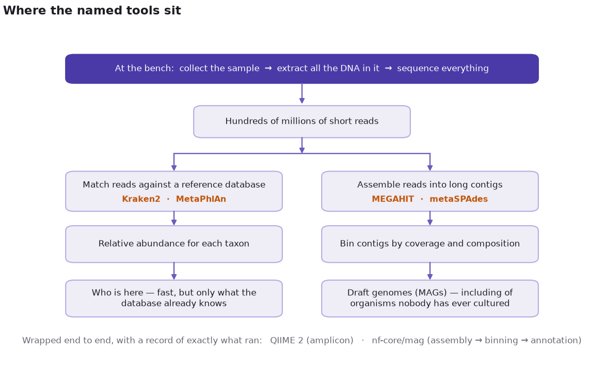

**Metagenomics:** extract all DNA from a sample, sequence it, and reconstruct the community without culturing organisms.

A teaspoon of soil holds on the order of a billion bacterial cells from thousands of species. Agar plates recover a few dozen kinds. The rest stay uncultured.

## Plate count anomaly

Count cells under a microscope, then count colonies on agar. The two numbers disagree by orders of magnitude. Staley and Konopka (1985) named this the *great plate count anomaly*.

Amann, Ludwig and Schleifer (1995) compiled paired counts across habitats. The figure below is that literature table, not new measurement. Reported culturability runs from a thousandth of a percent to the low tens of a percent (log scale).

If agar recovers 0.3% of soil cells, a plate census mis-describes the habitat: abundant uncultured taxa are missing; agar-loving rarities look typical.

A plate is one diet, temperature, oxygen level, and neighbourhood. Most microbes decline that combination.

## Three read depths

A sequencer reads short fragments, not whole chromosomes. Three common designs differ in how much of the pooled DNA is read and how hard it is reassembled.

- **Amplicon (16S):** copy one ribosomal gene present in all bacteria and variable enough to name them. Cheap; answers *who is here*.
- **Shotgun:** fragment pooled DNA at random and sequence everything. Recovers other genes; answers what the community can *do*.
- **Genome-resolved:** overlap fragments, bin them per organism, recover draft genomes (MAGs) for uncultured taxa.

## History

- **Norman R. Pace (1985):** sequence ribosomal RNA genes from the environment; culture-independent microbiology.
- **Jo Handelsman (1998):** coined *metagenomics* for pooled soil DNA as one large genome to clone and screen.
- **Jill Banfield / Tyson et al. (2004):** near-complete genomes from an acid mine drainage biofilm.
- **Rob Knight:** human microbiome and planet-scale surveys; much of the common software.

## Pipeline

One run returns hundreds of millions of unlabelled short reads from an unknown mixture. Two jobs: assemble longer sequences; assign taxonomy.

- **Assembly:** overlapping reads → contigs. **MEGAHIT** (succinct de Bruijn graph, low memory). **metaSPAdes** (uneven abundance).
- **Taxonomic profiling:** **MetaPhlAn** (clade-specific marker genes). **Kraken2** (exact k-mer matches; fast).
- **Workflows:** **QIIME 2** (amplicon + provenance). **nf-core/mag** (short reads to annotated genomes via Nextflow).

## Constraints

- A MAG is a composite over near-identical cells, not a single-cell genome.
- Abundances are relative shares; one taxon can appear to rise because another fell.
- DNA presence does not imply expression (that needs RNA).
- A profiler names only taxa in its reference database. The unclassified fraction is often the interesting part.

Figures 2 and 3 are schematics and plot no data. Figure 1 is transcribed from Amann et al. 1995 Table 1. Figure scripts: `src/make_figs.py`.

## References

- Staley, J. T. & Konopka, A. (1985). [Measurement of in situ activities of nonphotosynthetic microorganisms in aquatic and terrestrial habitats](https://doi.org/10.1146/annurev.mi.39.100185.001541). *Annual Review of Microbiology* 39:321–346.
- Amann, R. I., Ludwig, W. & Schleifer, K.-H. (1995). [Phylogenetic identification and in situ detection of individual microbial cells without cultivation](https://doi.org/10.1128/mr.59.1.143-169.1995). *Microbiological Reviews* 59(1):143–169.
- Pace, N. R., Stahl, D. A., Lane, D. J. & Olsen, G. J. (1985). Analyzing natural microbial populations by rRNA sequences. *ASM News* 51:4–12. Full treatment: [The analysis of natural microbial populations by ribosomal RNA sequences](https://doi.org/10.1007/978-1-4757-0611-6_1), *Advances in Microbial Ecology* 9:1–55. Method: Lane et al. (1985), [Rapid determination of 16S ribosomal RNA sequences for phylogenetic analyses](https://doi.org/10.1073/pnas.82.20.6955), *PNAS* 82(20):6955–6959.
- Handelsman, J. et al. (1998). [Molecular biological access to the chemistry of unknown soil microbes](https://doi.org/10.1016/S1074-5521(98)90108-9). *Chemistry & Biology* 5(10):R245–R249.
- Tyson, G. W. et al. (2004). [Community structure and metabolism through reconstruction of microbial genomes from the environment](https://doi.org/10.1038/nature02340). *Nature* 428:37–43.
- Bolyen, E. et al. (2019). [Reproducible, interactive, scalable and extensible microbiome data science using QIIME 2](https://doi.org/10.1038/s41587-019-0209-9). *Nature Biotechnology* 37:852–857.
- Tools: [MEGAHIT](https://github.com/voutcn/megahit), [metaSPAdes](https://github.com/ablab/spades), [MetaPhlAn](https://github.com/biobakery/MetaPhlAn), [Kraken2](https://github.com/DerrickWood/kraken2), [QIIME 2](https://qiime2.org/), [nf-core/mag](https://nf-co.re/mag).
