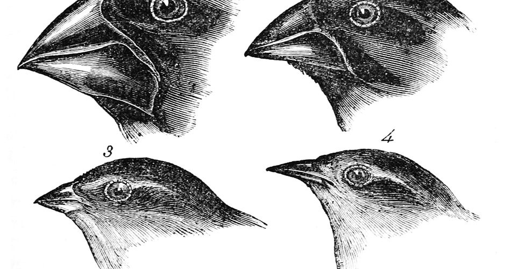

Ask why a random forest beat the neural network on last week's tabular data, and the
honest answer is that nobody knew in advance; several models were trained, one scored
best on held-out data, and that one was kept. Strip the vocabulary away and that is
selection: variation, an environment, a fitness measure, survivors. This post pushes
the analogy between model selection and biological evolution as far as it will go,
because it makes a few things about the workflow obvious that the textbook description
leaves implicit, and then says where it breaks.

## A model family is a species, and a trained model is one organism

The scikit-learn cheat sheet is a map of species: linear models, tree ensembles,
kernel machines, nearest-neighbour methods, neural networks. Each family is a body
plan, a fixed way of turning inputs into outputs with some parameters left free. A
particular trained model is one organism of that species, with its own parameter
values the way an individual has its own genome. And beneath the species are the
protocells: the small, reusable pieces every family is assembled from, such as affine
maps, non-linearities, recursion, branching and iteration. Nothing in the map is
irreducible; a gradient-boosted tree and a transformer are different arrangements of
the same handful of primitives.

Two of the analogy's moves follow at once. Training is maturation, not birth: an
organism is born with a genome and grows into its environment, and a model is
instantiated with hyperparameters and fits its parameters to the training data. And
the data is the environment. A dataset presents resources and hazards, such as
informative features, noise, imbalance and missing values, and a species that thrives
on one may not survive another.

## The validation score is fitness, and it belongs to the habitat, not the organism

Fitness in biology is not a property of an organism alone. It is a relation between the
organism and its habitat: the same beak that cracks seeds on one island starves on the
next. The validation score has exactly that shape. It is not a property of the model; it
is a measurement of the model's predictions against observed outcomes on a particular
held-out set, for a particular task. Change the metric and the fitness changes. Change
the validation data and it changes again. There is no such thing as the best model,
only the best model here.

The three-way data split is three habitats, and the analogy says what each is for:

| Split | Habitat | What happens there |
|---|---|---|
| Training | the nursery | organisms mature: parameters fit |
| Validation | the proving ground | fitness is measured and survivors chosen |
| Test | the unseen island | the survivor's fitness is reported, once, without selection |

Overfitting is over-specialisation. A model that memorises the training environment
has adapted to one habitat so completely that it cannot survive the next, which is why
a model is never selected on the environment it matured in. And the test set must stay
unseen for the same reason a field biologist does not report survival rates from the
enclosure the animals were bred in: selection on a habitat contaminates any fitness
estimate taken there. Select on validation, report on test, never the reverse.

## Hyperparameter tuning is speciation

Darwin's finches descended from one ancestral population, and on different islands
with different food the beaks diverged: heavy for seeds, slender for insects, until the
populations were distinct species. A hyperparameter grid does the same thing to one
model family. Every setting of tree depth, learning rate or regularisation strength is
a variant with the same body plan and different traits, and the validation habitat
decides which variants persist. Default hyperparameters are the ancestral genome,
tuned to do tolerably well on the environments the library's authors had in mind;
tuned hyperparameters are the island-specific beak.

The analogy then hands over five things the workflow already knows but rarely says
out loud:

- **Diversity is worth paying for.** No species is fittest everywhere, so a model zoo
  beats a favourite, and the reason to try several families is that nobody knows the
  habitat's demands in advance.
- **Fitness is task-relative.** The best subspecies for one dataset is not the best for
  the next, so a leaderboard is a statement about one habitat.
- **Ensembles are ecosystems.** Bagging and stacking combine species that fail in
  different ways, the way a stable ecosystem is populated by organisms that exploit
  different resources.
- **Inductive bias is body plan.** Geometric deep learning, which builds a symmetry of
  the data into the architecture, is a species whose anatomy encodes a regularity of
  its habitat, the way a fish's shape encodes water.
- **Ideas move sideways.** Attention appeared in translation models and now sits in
  vision, proteins and tabular learners: horizontal gene transfer, a mechanism copied
  across lineages rather than inherited down one.

## Where it stops holding

Evolution has no intent and no objective; model selection has both, and the analogy
hides that. A practitioner chooses the metric, the splits and the candidate species,
which makes the process artificial selection, breeding rather than natural selection,
and breeding can be aimed at the wrong trait. The analogy also has no place for the
cost of a fitness evaluation, which in practice decides how many variants get tried at
all. And it says nothing about why one species should be preferred when two score the
same, where the answer is usually the simpler one, on grounds of interpretability or
serving cost that no habitat measures.

One thing the picture does predict, and it has held up: there is no single model for
all data, and there will not be one. The best model is the one best adapted to the
habitat at hand, and generalisation is the hope that the next habitat resembles it.

Models. Are. Species. Data. Is. Habitat. Validation. Selects. Nothing. Fits. Everywhere.

## References

- Wolpert, D. H. (1996). The lack of a priori distinctions between learning
  algorithms. *Neural Computation* **8**(7). The no-free-lunch theorems, which are the
  formal version of the closing claim.
- Bronstein, M. M., Bruna, J., Cohen, T. and Veličković, P. (2021). Geometric deep
  learning: grids, groups, graphs, geodesics, and gauges. arXiv:2104.13478.
- [Choosing the right estimator](https://scikit-learn.org/stable/machine_learning_map.html),
  the scikit-learn map of model families.
- [Darwin's finches](https://en.wikipedia.org/wiki/Darwin%27s_finches) on Wikipedia;
  the cover is from John Gould's plates in *The Zoology of the Voyage of H.M.S.
  Beagle* (1841), public domain.
- [Train, dev and test splits](../train-dev-test-splits/) on this blog, for the
  three habitats without the metaphor.
