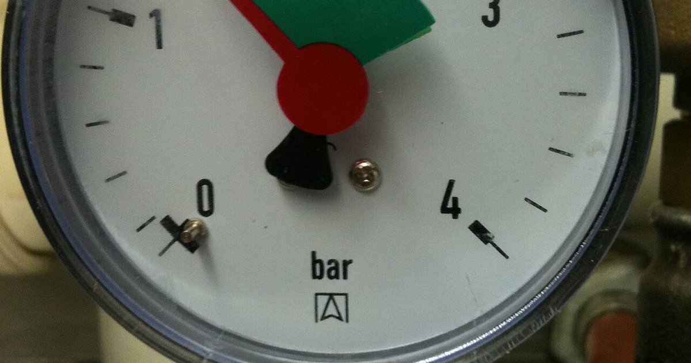

A model is trained once and used for months, and in those months the world it was
trained on moves: customers change, prices change, a product is launched, a fraud
pattern is retired because it stopped working. The model does not change with it. It
keeps making the predictions it learned, with the same confidence, and the only thing
that reveals the gap is someone measuring. This post says what to measure, why the two
common failures need different instruments, and which of AWS's two SageMaker tools
covers which, as of early 2025.

## Drift is the inputs moving; degradation is the answers getting worse

The failures come in a sequence, and the instruments differ by where in the sequence
they look.

**Data drift** is the earliest and cheapest signal: the distribution of the inputs the
model sees today differs from the training data. It needs no labels, only the
production inputs and the training set, and a two-sample test per feature says how far
apart they are: the Kolmogorov–Smirnov statistic for a continuous feature, the
population stability index (a binned divergence that credit-risk teams have used for
decades), or the Jensen–Shannon divergence between histograms. Drift in the inputs does
not prove the predictions are wrong, but it is the earliest warning that they might be.

**Concept drift** is the relationship between inputs and outputs changing: the same
customer profile now churns when it used not to. Detecting it needs the outcomes, which
arrive late (a loan defaults months after the score) and sometimes never. Adaptive
windows and change-point tests such as Page–Hinkley watch the error rate as labels
trickle in; a shadow model retrained on recent data, compared against the deployed one,
is the blunt check.

**Performance degradation** is the thing the business notices: accuracy, AUC, RMSE or
whatever the metric is, tracked over time and against thresholds once ground truth is
available. It is the lagging indicator, and the reason the two kinds of drift are
watched at all is to catch it before it lags.

The response to all three is the same loop: log every input and prediction, alert on
the tests, retrain on a schedule or on a trigger, and compare the retrained model with
the deployed one before it takes over.

## Bias is a different question, asked at a different time

Drift asks whether the model still works. Fairness asks whether it works for everyone,
and that question does not wait for the world to move; a model can be biased on the
day it ships. The measurements are also different in kind: demographic parity,
equalised odds, disparate-impact ratios compare outcomes across groups, and
explanation methods such as SHAP say which features a prediction leaned on, so a proxy
for a protected attribute can be seen doing the work. Those checks belong before
training (is the data imbalanced), after training (are the predictions), and again in
production, but they are audits rather than monitors, and conflating them with drift
detection is the common mistake in a monitoring plan.

## Two SageMaker tools, one for each question

AWS splits the two questions across two products, and the split is the right way to
remember them.

**SageMaker Model Monitor** is the drift instrument. It computes a baseline from the
training data (per-feature statistics and constraints), captures the inputs and
outputs of a deployed endpoint, runs the statistical comparisons on a schedule, and
raises CloudWatch alarms when a feature's distribution, a data-quality constraint or,
once labels arrive, a performance metric crosses its threshold. Custom monitoring
scripts plug in for anything it does not compute itself. It runs after deployment,
continuously.

**SageMaker Clarify** is the bias-and-explanation instrument. Before training it
reports imbalance in the data across the groups you name; after training it computes
the fairness metrics on the predictions; and it produces SHAP-based feature
attributions per prediction. It runs at the points where a fairness decision is being
made, and it can be scheduled against production traffic too, but its output is a
report to read, not an alarm to page on.

| | Model Monitor | Clarify |
|---|---|---|
| Question | is the model still seeing what it was trained on, and still right? | is it fair, and why did it say that? |
| When | after deployment, on a schedule | before and after training, and on demand |
| Method | per-feature distribution tests against a baseline; metrics once labels arrive | fairness metrics across groups; SHAP attributions |
| Output | alarms and violation reports | bias reports and explanations |

## Where it stops holding

Both tools measure what they are pointed at. A drift alarm on a feature nobody looks at
is noise, and a fairness report on the groups the team did not think to name is
silent; the choice of features, groups and thresholds is the work, and the tools do
not do it. And a monitor is only as good as the ground truth it eventually gets: a
system that never records outcomes can watch its inputs drift forever without knowing
whether it matters.

Models. Rot. Silently. Data. Drifts. First. Monitor. Detects. Clarify. Explains.

## References

- [Amazon SageMaker Model Monitor](https://docs.aws.amazon.com/sagemaker/latest/dg/model-monitor.html)
- [Amazon SageMaker Clarify](https://docs.aws.amazon.com/sagemaker/latest/dg/clarify.html)
- Gama, J. et al. (2014). A survey on concept drift adaptation. *ACM Computing Surveys*
  **46**(4).
- Lundberg, S. M. and Lee, S.-I. (2017). A unified approach to interpreting model
  predictions. *NeurIPS 30*. (SHAP.)
- [Explainability vs causality](../explainability-vs-causality/) on this blog, for what
  an attribution does and does not say
