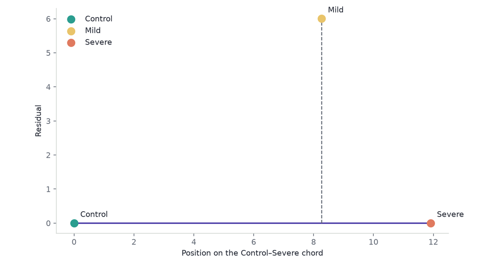

{fig-alt="Three group-mean points in a plane: Control and Severe on a line, Mild off that line."}

A classifier will separate these three COVID neutrophil groups. That is the easy trick. It does not mean mild disease sits on the road from healthy to severe.

Seventy-five people, 285 metabolites, three labels. PCA, then a linear model, then — if the labels look like an extra axis — a tensor: that is the usual ML stack. The labels are tags on rows, the way train and test tags are. Stacking them into a cube fills two-thirds of the array with holes. A severity score that parks Mild at the midpoint mixes two kinds of change: metabolites that rise with disease, and metabolites that dip in Mild and bounce in Severe.

Li et al. (2023) isolated neutrophils from 75 people, extracted two million cells each, and deposited LC-MS peak areas as Metabolomics Workbench ST002477 (CC BY 4.0). They wanted the cell that kills, not plasma. The numbers are relative ion intensities, not counts and not fluxes. The job that fits the file is a line through three group means, then a look at what the line misses.

```{python}
#| echo: false
#| output: false
from pathlib import Path

import numpy as np
import pandas as pd
from PIL import Image
from sklearn.decomposition import PCA
import matplotlib.pyplot as plt

INK = "#1F2430"
MUTED = "#5F6672"
RULE = "#D2D6D1"
CONTROL = "#2A9D8F"
MILD = "#E9C46A"
SEVERE = "#E07A5F"
LINE = "#4A3AA7"

plt.rcParams.update(
    {
        "font.family": "sans-serif",
        "font.size": 10,
        "axes.edgecolor": RULE,
        "axes.linewidth": 0.8,
        "axes.spines.top": False,
        "axes.spines.right": False,
        "axes.labelcolor": INK,
        "text.color": INK,
        "xtick.color": MUTED,
        "ytick.color": MUTED,
        "axes.titleweight": "bold",
    }
)

DATA = Path("data")
abundances = pd.read_csv(DATA / "abundances.tsv", sep="\t", index_col=0)
samples = pd.read_csv(DATA / "samples.tsv", sep="\t")
assert list(abundances.columns) == list(samples["sample_id"])
X = abundances.to_numpy(dtype=np.float64).T
labels = samples["group"].to_numpy()
feature_names = abundances.index.to_numpy()
GROUPS = ("Control", "Mild", "Severe")
COLOURS = {"Control": CONTROL, "Mild": MILD, "Severe": SEVERE}


def iqr_scale(matrix):
    transformed = np.log1p(matrix)
    median = np.median(transformed, axis=0)
    iqr = np.subtract(*np.percentile(transformed, [75, 25], axis=0))
    iqr = np.where(iqr == 0.0, 1.0, iqr)
    return (transformed - median) / iqr


Z = iqr_scale(X)
means = {group: Z[labels == group].mean(axis=0) for group in GROUPS}
delta = means["Severe"] - means["Control"]
offset = means["Mild"] - means["Control"]
t_hat = float(np.dot(offset, delta) / np.dot(delta, delta))
kappa = offset - t_hat * delta
n = Z.shape[0]
score = np.array(
    [0.0 if group == "Control" else t_hat if group == "Mild" else 1.0 for group in labels]
)
design = np.column_stack([np.ones(n), score])
fitted = design @ np.linalg.lstsq(design, Z, rcond=None)[0]
axis_rss = float(np.sum((Z - fitted) ** 2))
categorical_rss = float(
    sum(np.sum((Z[labels == group] - means[group]) ** 2) for group in GROUPS)
)
total_rss = float(np.sum((Z - Z.mean(axis=0)) ** 2))
between_rss = total_rss - categorical_rss
off_line = (axis_rss - categorical_rss) / between_rss
pca = PCA(n_components=2).fit(Z)
pc_scores = pca.transform(Z)
pc_var = pca.explained_variance_ratio_


def letterbox_cover(fig, path="cover.png", size=(1200, 630)):
    import io

    buf = io.BytesIO()
    fig.savefig(buf, dpi=160, bbox_inches="tight", pad_inches=0.25, facecolor="white", format="png")
    buf.seek(0)
    raw = Image.open(buf).convert("RGB")
    arr = np.asarray(raw)
    ink = (arr < 250).any(axis=2)
    rows = np.where(ink.any(axis=1))[0]
    cols = np.where(ink.any(axis=0))[0]
    if len(rows) and len(cols):
        margin = 18
        raw = raw.crop(
            (
                max(0, int(cols[0]) - margin),
                max(0, int(rows[0]) - margin),
                min(raw.width, int(cols[-1]) + 1 + margin),
                min(raw.height, int(rows[-1]) + 1 + margin),
            )
        )
    width, height = size
    scale = min(width / raw.width, height / raw.height)
    new_w = max(1, round(raw.width * scale))
    new_h = max(1, round(raw.height * scale))
    raw = raw.resize((new_w, new_h), Image.Resampling.LANCZOS)
    canvas = Image.new("RGB", (width, height), (255, 255, 255))
    canvas.paste(raw, ((width - new_w) // 2, (height - new_h) // 2))
    canvas.save(path)
```

## Neutrophil metabolomes

Plasma metabolomes mix liver, muscle, and lunch. This table is one cell type: the neutrophil, the cell that does the killing.

Neutrophils eat microbes, dump oxidants, and throw DNA nets (NETs). That work runs on glycolysis and the pentose-phosphate pathway (Morrison, Watts, Sadiku, and Walmsley 2022). In severe COVID-19 these cells pile up in failing lungs. If their fuel is off, killing and damage move together. Li et al. saw amino-acid, redox, and central-carbon pools shift, and showed GAPDH can suppress NET formation. Peak area is not that flux. It is still the public readout of the cell.

Erythrose 4-phosphate sits on the pathway that powers the oxidant burst (Britt et al. 2022). Hypotaurine and glycine sit near redox handling. A linear "disease score" will scramble names like these if they do not move in a straight line from Control to Severe.

## Source table

75 profiles: 19 Control, 30 Mild, 26 Severe. 287 named rows, 285 unique vectors. Chromatogram peak areas from a targeted Q Exactive method, median-normalised per sample. Nonnegative and continuous. Not integer counts.

```{python}
#| echo: false
#| output: asis
display_features = [
    "Hypotaurine",
    "Glycine",
    "Erythrose 4-phosphate",
    "1,3/ 2,3-Bisphosphoglycerate",
    "Creatine",
    "Uridine monophosphate",
]
display_samples = ["PMN_74", "PMN_75", "PMN_02", "PMN_03", "PMN_48", "PMN_49"]
header_groups = samples.set_index("sample_id").loc[display_samples, "group"]
headers = [f"{sid} ({grp[0]})" for sid, grp in zip(display_samples, header_groups)]
block = abundances.loc[display_features, display_samples]
lines = [
    "| metabolite | " + " | ".join(headers) + " |",
    "| --- | " + " | ".join(["---:"] * len(headers)) + " |",
]
for name, row in block.iterrows():
    cells = " | ".join(f"{value:.2e}" for value in row)
    lines.append(f"| {name} | {cells} |")
print("\n".join(lines))
```

Relative peak areas, two samples per group. The range is normal for ion intensity. It is not a count table.

## Matrix layout

Each person is one row. Each metabolite is one column. $X \in \mathbb{R}^{75 \times 285}$. Control, Mild, and Severe partition those rows. They do not add a third index.

A tensor mode can vary on its own. Here each person sits in one group. `sample × metabolite × group` leaves two slices empty for every person. CP on that cube would spend rank explaining holes the design made.

Collapse to group means and the sample mode becomes three levels: a $3 \times 285$ matrix, still two-way. Three points live in a plane. Rank at most two.

```{mermaid}
flowchart LR
  subgraph nested [Nested design]
    samples["75 samples"] --> matrixX["X: 75 x 285"]
    samples --> partition["19 Control / 30 Mild / 26 Severe"]
  end
  subgraph crossed [Crossed design]
    donor["donor"] --> cube["donor x condition x metabolite"]
    condition["condition"] --> cube
    metabolite["metabolite"] --> cube
  end
```

Group would be a third mode if the same people were measured in all three states. This cohort is one snapshot per person. Raw chromatograms could still be `sample × retention time × m/z`. Those files are not in the public table.

## Shared mean axis

Three class means in 285 dimensions are three points. They always sit in a plane. The live question is whether they also sit on a line: whether one severity number reconstructs the means. If not, any model that uses that number mixes two directions.

Park Mild at a free place $t$ on the Control–Severe line:

$$
\kappa(t)=\bar x_{\mathrm{Mild}}-\bigl[(1-t)\bar x_{\mathrm{Control}}+t\bar x_{\mathrm{Severe}}\bigr].
$$

One shared $t$ minimises $\lVert\kappa(t)\rVert_2^2$. Ordinary least squares. The midpoint model is $t=0.5$.

```{python}
print(f"t_hat = {t_hat:.2f}")
print(f"off-line fraction of between-group SS = {off_line:.2f}")
print(f"Control n = {(labels == 'Control').sum()}")
print(f"Mild n = {(labels == 'Mild').sum()}")
print(f"Severe n = {(labels == 'Severe').sum()}")
print(f"features = {Z.shape[1]}")
```

Least-squares puts Mild at $t=0.69$, nearer Severe than Control. The leftover $\kappa$ is 28% of the between-group sum of squares. Most of the three means still sit on the line. What misses it is structured.

Hypotaurine and glycine dip in Mild and rise in Severe. Erythrose 4-phosphate and bisphosphoglycerate drop in Severe. A severity score will not look like those names. They are candidates for a follow-up assay. They are not a pathway map.

```{python}
#| label: fig-axis
#| fig-cap: "Group means in the plane of the Control–Severe chord and its residual. Control and Severe sit on the horizontal line. Mild sits off it. Coordinates are log1p then IQR-scaled peak areas."
#| fig-alt: "Scatter of three labelled points. Control at the origin, Severe on the x-axis, Mild above the x-axis with a vertical residual."
chord = float(np.linalg.norm(delta))
fig, ax = plt.subplots()
ax.plot([0.0, chord], [0.0, 0.0], color=LINE, lw=1.8, zorder=1)
ax.plot([t_hat * chord, t_hat * chord], [0.0, float(np.linalg.norm(kappa))], color=MUTED, ls="--", lw=1.2)
points = {
    "Control": (0.0, 0.0),
    "Mild": (t_hat * chord, float(np.linalg.norm(kappa))),
    "Severe": (chord, 0.0),
}
for group, (x, y) in points.items():
    ax.scatter([x], [y], s=90, color=COLOURS[group], zorder=3, label=group)
    ax.annotate(group, (x, y), textcoords="offset points", xytext=(8, 8), color=INK)
ax.set_xlabel("Position on the Control–Severe chord")
ax.set_ylabel("Residual")
ax.legend(frameon=False, loc="upper left")
fig.tight_layout()
letterbox_cover(fig)
```

Rank one of the three centroids is the line. Rank two is the leftover. Rank three is empty. CP on the 75 × 285 table is SVD. Padding groups into a cube does not change that.

## PCA

Do the 75 people separate, or only their means?

```{python}
print(f"PC1 variance fraction = {pc_var[0]:.2f}")
print(f"PC2 variance fraction = {pc_var[1]:.2f}")
for group in GROUPS:
    centre = pc_scores[labels == group].mean(axis=0)
    print(f"{group} mean PC1 = {centre[0]:.2f}, mean PC2 = {centre[1]:.2f}")
```

```{python}
#| label: fig-pca
#| fig-cap: "First two principal components of the 75 log1p/IQR profiles. PC1 holds 21% of sample variance; PC2 holds 11%."
#| fig-alt: "Scatter of 75 points coloured by Control, Mild, and Severe on PC1 versus PC2."
fig, ax = plt.subplots()
for group in GROUPS:
    pts = pc_scores[labels == group]
    ax.scatter(pts[:, 0], pts[:, 1], s=28, color=COLOURS[group], alpha=0.85, label=group)
ax.set_xlabel("PC1")
ax.set_ylabel("PC2")
ax.legend(frameon=False)
fig.tight_layout()
```

PC1 holds 21% of sample variance; PC2 holds 11%. Group means on PC1: Control −6.95, Mild 1.75, Severe 3.06. Mild sits between the ends, closer to Severe. On PC2, Mild (−2.23) sits opposite Severe (2.48). People overlap. The leftover is in the cloud, not only in the means.

## Downstream models

Use the split. Do not score past it.

- **Line through the three means.** Is one severity number enough? $t=0.69$ and a 28% leftover say no.
- **PCA of people.** Do individuals separate? They overlap.
- **Tests with false-discovery control**, as in a [volcano plot](../volcano-plots/). Rank metabolites by distance off the line, not by label accuracy.
- **Sparse PLS or elastic net**, group-stratified CV, only to rank features. 75 people will not carry a biomarker; see [From Dataset to Biological Signature](../dataset-to-biological-signature/).
- **CP / PARAFAC** only on a real cube: chromatograms, or the same donors in more than one state. [Uses of Tensor Factorizations](../uses-of-tensor-factorizations/) is that case. This file is not.

Skip an unregularised 285-feature classifier, a deep net, Poisson models, and NMF on Li et al.'s signed Dataset 3.

NumPy and scikit-learn for the line and PCA. MetaboAnalyst for tables (Pang et al. 2021). mixOmics / ropls for PLS. MZmine, XCMS, pyOpenMS, matchms for chromatograms. TensorLy for PARAFAC (Bro 1997).

## Constraints

This is one transform of one matrix, not a biomarker panel.

- Peak area is not flux and not NETs.
- A deposited name is not a confirmed structure. Forty lipids are sum-composition labels.
- Groups are not time. One cohort is not a replication. Bulk pellets mix cell-state with within-cell change.
- $t=0.69$ and the 28% leftover move if the transform moves.

Line. First. Mild. Sits. Off. Score. After. Residual. Cubes. Need. Crossed. Modes.

## References

- Britt, E. C., et al. (2022). Switching to the cyclic pentose phosphate pathway powers the oxidative burst in activated neutrophils. *Nature Metabolism*. [doi:10.1038/s42255-022-00550-8](https://doi.org/10.1038/s42255-022-00550-8)
- Bro, R. (1997). PARAFAC. Tutorial and applications. *Chemometrics and Intelligent Laboratory Systems* 38: 149–171. [doi:10.1016/S0169-7439(97)00032-4](https://doi.org/10.1016/S0169-7439(97)00032-4)
- Information retained and lost by a shared linear mean axis in COVID-19 neutrophil metabolomics. Research Square preprint `rs-10583501`. [doi:10.21203/rs.3.rs-10583501/v1](https://doi.org/10.21203/rs.3.rs-10583501/v1)
- Li, Y., et al. (2023). Neutrophil metabolomics in severe COVID-19 reveal GAPDH as a suppressor of neutrophil extracellular trap formation. *Nature Communications* 14: 2610. [doi:10.1038/s41467-023-37567-w](https://doi.org/10.1038/s41467-023-37567-w)
- Metabolomics Workbench ST002477 / PR001600. [doi:10.21228/M8W70C](https://doi.org/10.21228/M8W70C)
- Morrison, T., Watts, E. R., Sadiku, P., and Walmsley, S. R. (2022). The emerging role for metabolism in fueling neutrophilic inflammation. *Immunological Reviews*. [doi:10.1111/imr.13157](https://doi.org/10.1111/imr.13157)
- Pang, Z., et al. (2021). MetaboAnalyst 5.0: narrowing the gap between raw spectra and functional insights. *Nucleic Acids Research*. [doi:10.1093/nar/gkab382](https://doi.org/10.1093/nar/gkab382)
- [From Dataset to Biological Signature](../dataset-to-biological-signature/)
- [The Anatomy of a Volcano Plot](../volcano-plots/)
- [Uses of Tensor Factorizations](../uses-of-tensor-factorizations/)
