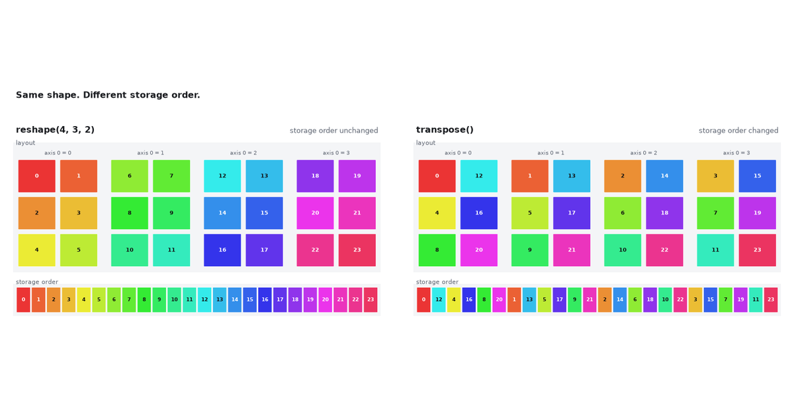

Nested Python lists already hold a grid. They do not carry a shape we can reshape. A tiny class that stores a flat list and a shape tuple gives NumPy's layout methods with no NumPy.

We already write nested lists and call `len` for the first axis. The other axes are nested loops. NumPy's `.shape` is that layout made explicit. `shape`, `ndim`, and `size` are attributes, not calls.

## Storage

This post uses a synthetic $2\times 3\times 4$ array of `range(24)`.

Provenance:

- The 24 integers are generated, not measured.
- The array stands in for a small 3-way table (batch × row × column).
- Size 24 was chosen so each entry can keep one colour in the figures.
- A measured table of that shape is larger; the layout questions are the same.

The constructor flattens nested lists and records a shape. It rejects a shape whose product is not `len(data)`.

```python
from math import prod


def _flatten_shape(data):
    if not isinstance(data, list):
        return [data], ()
    if not data:
        return [], (0,)
    parts = [_flatten_shape(item) for item in data]
    shape = parts[0][1]
    if any(s != shape for _, s in parts):
        raise ValueError("ragged nested list")
    flat = [v for f, _ in parts for v in f]
    return flat, (len(data),) + shape


def _unravel(index, shape):
    out = []
    for size in reversed(shape):
        out.append(index % size)
        index //= size
    return tuple(reversed(out))


def _ravel(multi, shape):
    index = 0
    for i, n in zip(multi, shape):
        index = index * n + i
    return index


class Tensor:
    def __init__(self, data, shape=None):
        if shape is None:
            data, shape = _flatten_shape(data)
        data = list(data)
        shape = tuple(shape)
        if prod(shape) != len(data):
            raise ValueError("shape does not match size")
        self._data = data
        self._shape = shape
```

## Counts

Four numbers describe the same layout:

- **shape** — length of each axis: `(2, 3, 4)`.
- **ndim** — how many axes: `3`.
- **size** — product of the shape: `24`.
- **len** — first axis only: `2`, not `24`.

```python
    @property
    def shape(self):
        return self._shape

    @property
    def ndim(self):
        return len(self._shape)

    @property
    def size(self):
        return prod(self._shape)

    def __len__(self):
        return self._shape[0]
```

## Reshape

`reshape` returns a new `Tensor` with the same `_data` and a new shape. The product must equal `.size`. The list is copied; this is not a NumPy view.

```python
    def reshape(self, *shape):
        if prod(shape) != self.size:
            raise ValueError("size mismatch")
        return Tensor(self._data, shape)
```

Each colour is one entry. The strip is storage order.

{#fig-reshape fig-alt="Animation. Top panel is the tensor layout; bottom panel is a 24-cell storage strip, one colour per entry. Starts as two 3 by 4 slabs, morphs to a column of 24, a row of 24, then four 3 by 2 slabs. The storage strip remains 0 through 23 in rainbow order."}

The column, the row, and the $4\times 3\times 2$ keep that order.

## Transpose

Default `transpose` reverses axes. $(2, 3, 4)$ becomes $(4, 3, 2)$. Each multi-index is permuted and written into a new flat list.

```python
    def transpose(self, *axes):
        if not axes:
            axes = tuple(range(self.ndim - 1, -1, -1))
        new_shape = tuple(self._shape[a] for a in axes)
        out = [None] * self.size
        for i, value in enumerate(self._data):
            old = _unravel(i, self._shape)
            new = tuple(old[a] for a in axes)
            out[_ravel(new, new_shape)] = value
        return Tensor(out, new_shape)
```

{#fig-transpose fig-alt="Animation. Same start as the reshape GIF: two 3 by 4 slabs and a rainbow storage strip 0 through 23. After transpose the layout is four 3 by 2 slabs with mixed colours, and the storage strip reads 0, 12, 4, 16, and so on."}

The $4\times 3\times 2$ box matches the last reshape. The strip does not.

## Constraints

No broadcasting, no slicing, no dtype, no views. Enough to see why NumPy treats shape as data. [NumPy to JAX](../numpy-to-jax/) is the real API.

## Class

Markdown fences do not join. `reshape` and `transpose` are ordinary methods on `Tensor`:

```python
from math import prod


def _flatten_shape(data):
    if not isinstance(data, list):
        return [data], ()
    if not data:
        return [], (0,)
    parts = [_flatten_shape(item) for item in data]
    shape = parts[0][1]
    if any(s != shape for _, s in parts):
        raise ValueError("ragged nested list")
    flat = [v for f, _ in parts for v in f]
    return flat, (len(data),) + shape


def _unravel(index, shape):
    out = []
    for size in reversed(shape):
        out.append(index % size)
        index //= size
    return tuple(reversed(out))


def _ravel(multi, shape):
    index = 0
    for i, n in zip(multi, shape):
        index = index * n + i
    return index


class Tensor:
    def __init__(self, data, shape=None):
        if shape is None:
            data, shape = _flatten_shape(data)
        data = list(data)
        shape = tuple(shape)
        if prod(shape) != len(data):
            raise ValueError("shape does not match size")
        self._data = data
        self._shape = shape

    @property
    def shape(self):
        return self._shape

    @property
    def ndim(self):
        return len(self._shape)

    @property
    def size(self):
        return prod(self._shape)

    def __len__(self):
        return self._shape[0]

    def reshape(self, *shape):
        if prod(shape) != self.size:
            raise ValueError("size mismatch")
        return Tensor(self._data, shape)

    def transpose(self, *axes):
        if not axes:
            axes = tuple(range(self.ndim - 1, -1, -1))
        new_shape = tuple(self._shape[a] for a in axes)
        out = [None] * self.size
        for i, value in enumerate(self._data):
            old = _unravel(i, self._shape)
            new = tuple(old[a] for a in axes)
            out[_ravel(new, new_shape)] = value
        return Tensor(out, new_shape)


t = Tensor(list(range(24)), (2, 3, 4))
assert t.shape == (2, 3, 4)
assert len(t) == 2
assert t.reshape(4, 3, 2)._data == t._data
assert t.transpose()._data != t._data
```

Storage. Order. Survives. Reshape. Transpose. Breaks. It. Shape. Is. Data.

## References

- NumPy, [The N-dimensional array (`ndarray`)](https://numpy.org/doc/stable/reference/arrays.ndarray.html).
- [NumPy to JAX](../numpy-to-jax/) — this blog; `shape`, `ndim`, `size`, and `reshape` on the real array type.
