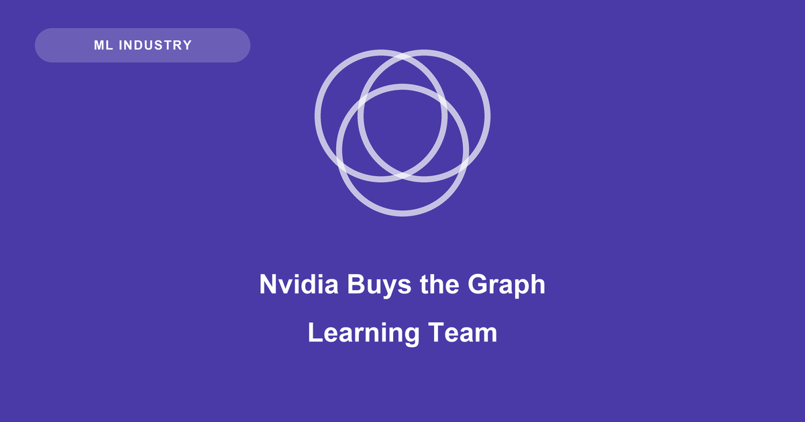

## The people who review my pull requests now work for Nvidia

I contribute to [PyTorch Geometric](https://github.com/pyg-team/pytorch_geometric), so this acquisition landed differently for me than it did for anyone reading it as market news. In June, Nvidia bought [Kumo AI](https://kumo.ai). [The Information reported](https://www.theinformation.com/articles/nvidia-buys-enterprise-model-maker-kumo-ai-least-400-million) a price of at least $400 million; [Fortune's account](https://fortune.com/2026/06/03/nvidia-snaps-up-kumo-ai-in-latest-acquisition/) says plainly that financial terms could not be learned. Treat the number as reported rather than confirmed.

The coverage reads it as an enterprise-data play, which is correct and incomplete. What changed hands was also a large share of the people who built the graph-learning stack the rest of us use.

## The reported motive is the prediction layer above the warehouse

Kumo's product, KumoRFM, is a relational foundation model. Point it at the tables you already have, define what you mean by "churn", and get a prediction back without training a task-specific model — churn, fraud, recommendations, the unglamorous predictions that live in schemas rather than documents. It ships as a native Snowflake app and a Databricks lakehouse app, reading and writing inside the customer's own environment.

That makes the strategic logic legible. Nvidia owns the compute floor already; what it doesn't own is the layer deciding how much inference an enterprise performs in the first place. Buying the prediction layer directly above Snowflake and Databricks is buying a generator of GPU-bound work — moving up the stack to manufacture demand for the thing underneath.

## Caveat: the benchmark numbers are largely self-reported

The evidence that relational foundation models beat supervised baselines comes mainly from [RelBench](https://arxiv.org/abs/2407.20060), whose author list includes Matthias Fey, Jan Lenssen and Jure Leskovec — the same people behind the model topping it. Nor is that only my discomfort: the [TabPFN-3 report](https://arxiv.org/abs/2605.13986), from a rival foundation-model group, argues KumoRFM's leaderboard figures follow a different evaluation protocol that overestimates performance. The claims may well survive scrutiny. They haven't yet had any from a party without a stake.

## What Nvidia actually acquired is PyG's braintrust

Here is the thread the reporting drops. [Matthias Fey](https://rusty1s.github.io/) created PyG with Jan Lenssen in 2019 and became Kumo's founding engineer. [Jure Leskovec](https://cs.stanford.edu/people/jure/) — Stanford, and six years as Pinterest's chief scientist — is Kumo's co-founder and chief scientist, and a co-author on the PyG 2.0 paper. Kumo's own material for [KumoRFM-2](https://arxiv.org/abs/2604.12596) describes it as built by the team that created PyTorch Geometric. PyG isn't adjacent to Kumo's origin story; it is the origin story.

## Speculation: a netlist is also a graph

What follows is my conjecture, and no reporting on this deal supports it. Nvidia has been putting graph neural networks on chip-design problems since [GRANNITE](https://research.nvidia.com/research-area/circuits) at DAC 2020, which propagates toggle rates through a netlist-as-graph to estimate power an order of magnitude faster than gate-level simulation. That sits inside a [substantial literature on GNNs for EDA](https://dl.acm.org/doi/abs/10.1145/3543853), downstream of the learned-placement work Google's AlphaChip made credible in 2021.

Nothing about the acquisition points that way; the deal is about warehouses, and Kumo's team was hired to keep building for warehouses. But Nvidia now employs several of the strongest graph-learning people alive, in a company already running GNNs over its own silicon. I'd be surprised if nobody in Santa Clara has had the thought.

So the price is the least interesting number here. What I'll watch is the next few PyG release cycles — whether a library maintained by Nvidia employees still behaves like a community project, or starts quietly optimising for one vendor's hardware.
