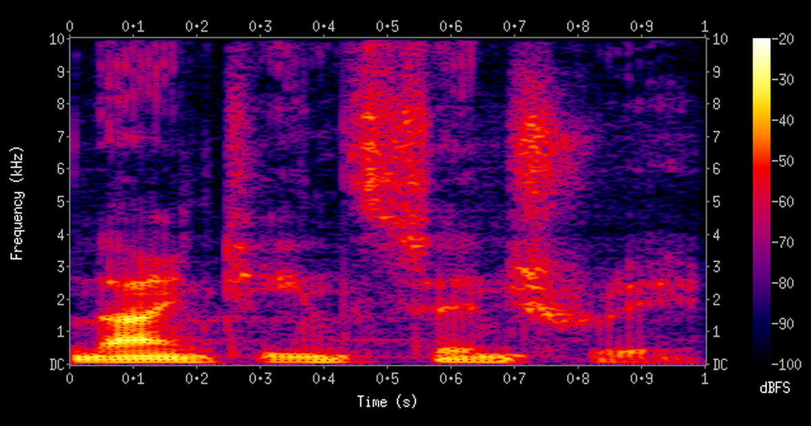

You already know these voices. The flat buzzing one from an old science-fiction
film. The satnav that reads a road name in a register it clearly recorded on a
different day from the rest of the sentence. The customer-service line that sounds
like a person right up until it reads out a postcode. You can date each of them by
ear, within a decade, without knowing anything about how it was built.

That is an unusual property for a technology to have. Speech synthesis is one of
the few corners of machine learning where thirty years of progress fits into twenty
seconds of listening — your ear does the evaluation, and no benchmark is required.

Underneath the changing sound is one idea repeating. Every era of text-to-speech
moved the **unit of generation** down a level of abstraction: from rules about how
a voice resonates, to recorded fragments of speech, to statistical parameters, to
raw audio samples, to discrete tokens. Each move down bought naturalness and gave
up control.

The old engines still install, so this is no museum tour. Every era below has a
player, and four of the five clips were made on a laptop while writing this.

## Five eras, each defined by what it generates

The tidiest way to tell these decades apart is not by which lab did what, but by
asking a single question of each system: what is the smallest thing it produces
before assembling the answer? A rule? A recorded fragment? A number? A raw sample?
A token? Everything else about an era — how natural it sounds, how much disk it
needs, whether you can change the voice — follows from that answer.

Five eras, then, and five answers. Click one.

```{=html}
<div class="ttshist">
  <div class="ttshist-rail" role="tablist" aria-label="Eras of text-to-speech">
    <button class="ttshist-era" id="ttshist-tab-0" role="tab" aria-controls="ttshist-panel" aria-selected="true" tabindex="0"
            data-title="1990s &middot; Rules and fragments"
            data-body="Formant synthesis generates speech from hand-written rules, storing no recorded audio at all. Diphone concatenation splices together one recorded copy of each sound-to-sound transition. Intelligible, unmistakably synthetic.">
      <span class="ttshist-dot"></span>
      <span class="ttshist-year">1990s</span>
      <span class="ttshist-label">Formant &amp; diphone</span>
    </button>
    <button class="ttshist-era" id="ttshist-tab-1" role="tab" aria-controls="ttshist-panel" aria-selected="false" tabindex="-1"
            data-title="2000s &middot; Hoard it or model it"
            data-body="Unit selection records hours of speech and picks the longest matching run at synthesis time. Statistical parametric synthesis does the opposite: store no waveforms, model spectrum, pitch and duration instead.">
      <span class="ttshist-dot"></span>
      <span class="ttshist-year">2000s</span>
      <span class="ttshist-label">Unit selection &amp; HMMs</span>
    </button>
    <button class="ttshist-era" id="ttshist-tab-2" role="tab" aria-controls="ttshist-panel" aria-selected="false" tabindex="-1"
            data-title="2010s &middot; The pipeline collapses"
            data-body="WaveNet models raw waveform samples directly. Tacotron learns the text front-end that took decades to hand-write. Two neural networks replace the whole stack — and it is far slower than real time.">
      <span class="ttshist-dot"></span>
      <span class="ttshist-year">2010s</span>
      <span class="ttshist-label">Seq2seq &amp; neural vocoders</span>
    </button>
    <button class="ttshist-era" id="ttshist-tab-3" role="tab" aria-controls="ttshist-panel" aria-selected="false" tabindex="-1"
            data-title="Early 2020s &middot; Fast enough to ship"
            data-body="FastSpeech 2 generates the whole spectrogram in parallel. HiFi-GAN turns the vocoder into a GAN. VITS folds both stages into one model. Real time on ordinary hardware, with fixed voices.">
      <span class="ttshist-dot"></span>
      <span class="ttshist-year">Early 2020s</span>
      <span class="ttshist-label">Non-autoregressive &amp; GANs</span>
    </button>
    <button class="ttshist-era" id="ttshist-tab-4" role="tab" aria-controls="ttshist-panel" aria-selected="false" tabindex="-1"
            data-title="Now &middot; Speech as tokens"
            data-body="A neural audio codec turns sound into discrete tokens, so a transformer can predict speech exactly as it predicts words. Zero-shot voice cloning and prompted emotion arrive as side effects.">
      <span class="ttshist-dot"></span>
      <span class="ttshist-year">2026</span>
      <span class="ttshist-label">Codec tokens &amp; speech-LLMs</span>
    </button>
  </div>
  <!-- Seeded with the first era so the panel still says something if the script
       never runs; select() overwrites it on init. No aria-live here — the tab
       pattern already announces the panel on selection, and the two together
       double-announce on some screen readers. -->
  <div class="ttshist-panel" id="ttshist-panel" role="tabpanel" tabindex="0"
       aria-labelledby="ttshist-tab-0">
    <p class="ttshist-panel-title">1990s &middot; Rules and fragments</p>
    <p class="ttshist-panel-body">Formant synthesis generates speech from hand-written rules, storing no recorded audio at all. Diphone concatenation splices together one recorded copy of each sound-to-sound transition. Intelligible, unmistakably synthetic.</p>
  </div>
</div>

<style>
.ttshist { margin: 1.6rem 0 2rem; }
.ttshist-rail {
  position: relative; display: flex; overflow-x: auto;
  padding: 0.25rem 0 0.5rem; scrollbar-width: thin;
}
/* The connecting rail sits behind the dots, at their vertical centre. The 10%
   inset is not arbitrary: five equal-width markers put their dot centres at
   10/30/50/70/90%, so anything smaller leaves the line protruding past the
   outer dots. Keep it in step with the number of eras. */
.ttshist-rail::before {
  content: ""; position: absolute; left: 10%; right: 10%; top: 13px;
  height: 3px; background: #d9d4ee; z-index: 0;
}
.ttshist-era {
  position: relative; z-index: 1; flex: 1 0 8.5rem;
  display: flex; flex-direction: column; align-items: center; gap: 0.35rem;
  background: none; border: 0; padding: 0 0.4rem; cursor: pointer;
  font: inherit; color: inherit; text-align: center;
}
.ttshist-dot {
  width: 17px; height: 17px; border-radius: 50%;
  background: #fff; border: 3px solid #b7afdd; box-sizing: border-box;
  transition: transform 120ms ease, background-color 120ms ease, border-color 120ms ease;
}
.ttshist-year { font-weight: 700; font-size: 0.86rem; line-height: 1.1; }
.ttshist-label { font-size: 0.74rem; opacity: 0.72; line-height: 1.2; }
/* The selected state must not depend on colour alone. Browser "auto dark mode"
   rewrites these purples to a flat grey — and so does any forced-colours or
   high-contrast setting — which would leave no visible selection at all. Size,
   border weight and an underline all survive that rewriting. */
.ttshist-era[aria-selected="true"] .ttshist-dot {
  background: #4A3AA7; border-color: #4A3AA7;
  border-width: 5px; transform: scale(1.35);
}
.ttshist-era[aria-selected="true"] .ttshist-year {
  color: #4A3AA7; text-decoration: underline; text-underline-offset: 4px;
  text-decoration-thickness: 2px;
}
.ttshist-era:hover .ttshist-dot { border-color: #4A3AA7; }
.ttshist-era:focus-visible { outline: 2px solid #4A3AA7; outline-offset: 3px; border-radius: 6px; }
.ttshist-panel {
  margin-top: 0.5rem; padding: 0.85rem 1rem;
  border-left: 4px solid #4A3AA7; background: rgba(74, 58, 167, 0.06);
  border-radius: 0 6px 6px 0; min-height: 5.5rem;
}
.ttshist-panel-title { margin: 0 0 0.3rem; font-weight: 700; color: #4A3AA7; }
.ttshist-panel-body { margin: 0; font-size: 0.94rem; line-height: 1.5; }
@media (prefers-reduced-motion: reduce) {
  .ttshist-dot { transition: none; }
}
</style>

<script>
(function () {
  var root = document.querySelector(".ttshist");
  if (!root) return;
  var tabs = Array.prototype.slice.call(root.querySelectorAll(".ttshist-era"));
  var panel = root.querySelector(".ttshist-panel");
  var title = root.querySelector(".ttshist-panel-title");
  var body = root.querySelector(".ttshist-panel-body");

  function select(index, focus) {
    tabs.forEach(function (tab, i) {
      var on = i === index;
      tab.setAttribute("aria-selected", on ? "true" : "false");
      tab.tabIndex = on ? 0 : -1;
    });
    // textContent, not innerHTML: the HTML parser already entity-decoded these
    // attributes, so they are plain strings by the time they reach the dataset.
    title.textContent = tabs[index].dataset.title;
    body.textContent = tabs[index].dataset.body;
    panel.setAttribute("aria-labelledby", tabs[index].id);
    if (focus) tabs[index].focus();
  }

  tabs.forEach(function (tab, i) {
    tab.addEventListener("click", function () { select(i, false); });
    // Arrow keys are the expected way to move through a tablist.
    tab.addEventListener("keydown", function (event) {
      var delta = { ArrowRight: 1, ArrowLeft: -1, Home: -Infinity, End: Infinity }[event.key];
      if (delta === undefined) return;
      event.preventDefault();
      var next = delta === -Infinity ? 0
        : delta === Infinity ? tabs.length - 1
        : (i + delta + tabs.length) % tabs.length;
      select(next, true);
    });
  });

  select(0, false);
})();
</script>
```

## The 1990s: you could understand it, but never mistake it for a person

The first era stored no speech at all. Your throat and mouth are a set of
resonating chambers, and changing their shape boosts some frequency bands while
damping others — which is the whole difference between "ee" and "ah". Those bands
are called *formants*. Describe them well enough and you can skip the human
entirely: drive a bank of oscillators and filters from a table of settings, and
speech comes out of arithmetic. That is **formant synthesis**. Rules turn letters
into phonemes, the individual sounds a language distinguishes between, and phonemes
into filter settings. It is how DECtalk spoke, and why Stephen Hawking's voice
sounded as it did.

The alternative was to record a human once and then cut the recording up. The hard
part of speech is not the steady middle of a sound but the join between two of
them, so the unit worth storing is the transition — the milliseconds spanning "k"
into "æ" — rather than the sound itself. Keep one copy of every transition the
language uses and any sentence can be spliced from them, with the pitch bent to
fit. That is **diphone concatenation**. Edinburgh's Festival, released in 1996 and
still the ancestor of most open-source TTS, did exactly this.

**What changed:** arbitrary text became speakable on a machine with almost no
memory. The cost was humanity: every syllable is identical every time, because
only one copy exists.

## The 2000s: two opposite fixes for the same robotic seam

Both 1990s techniques failed in the same place: the joins. Splice two fragments
recorded seconds apart and the ear hears the edit. The next decade produced two
opposite responses to that one problem.

The first was to make the joins rarer by having far more material to work with.
Record hours of a single speaker rather than one clip of each transition, then at
synthesis time search that database for the longest contiguous stretch of real
audio matching what you need to say. Fewer cuts, fewer seams. That is **unit
selection**, and when the database happens to contain your phrase, the output *is*
a human recording. When it does not, the voice lurches between registers
mid-sentence — a rarer failure and a much more startling one.

The second response was to stop storing waveforms at all. Speech can be described
compactly by a handful of slowly-changing numbers: which frequencies are loud, how
high the pitch is, how long each sound lasts. Model how those numbers move, and you
can generate a fresh set for a new sentence and rebuild audio from them using a
*vocoder* — a component whose only job is turning that compact description back
into a waveform. That is **statistical parametric synthesis**. The HTS toolkit did
it with hidden Markov models, which treat a sequence as a chain of hidden states
that each emit an observation. The result was tiny and easy to bend: change a
parameter, change the speaker. It also sounded muffled and buzzy, because averaging
is what a statistical model does, and the average of many pronunciations is blurrier
than any one of them.

**What changed:** the field split into hoarding real audio versus modelling its
parameters, and neither got both naturalness and flexibility. The neural era broke
that deadlock.

## The 2010s: the hand-built pipeline collapsed into two networks

Both 2000s approaches kept an intermediate description of speech between the text
and the sound. DeepMind's WaveNet (2016) threw that away. A digital recording is
ultimately just a long list of amplitude numbers — sixteen thousand or more of them
for every second of audio — so WaveNet predicted that list directly, one number at
a time, each conditioned on every number before it. Predicting the next element of
a sequence from all its predecessors is what makes a model *autoregressive*, in the
same sense as a language model predicting the next word. At 16,000-odd predictions
per second of audio it was glacially slow, and it beat everything before it.

Tacotron (2017) removed the other half of the stack. It used a sequence-to-sequence
network — the architecture built for translation, which reads one variable-length
sequence and emits another — to map characters straight to a mel spectrogram: a
picture of which frequencies are loud at each instant, on a frequency scale spaced
the way human hearing actually is. Doing that meant learning from data the
pronunciation and prosody rules people had been hand-writing for decades. Tacotron 2
then bolted the two halves together, a spectrogram predictor feeding WaveNet as a
**neural vocoder**, and scored 4.53 on a 5-point naturalness rating — a mean opinion
score, the average grade a panel of listeners gives a clip — against 4.58 for
professionally recorded human speech.

**What changed:** the linguistic front-end stopped being engineered and started
being learned. The price was speed. WaveGlow (2018) began clawing it back with a
flow, an invertible network that turns noise into a whole waveform in one parallel
pass instead of sample by sample.

## The early 2020s: dropping autoregression made it fast enough to ship

Quality was solved; throughput was not, and autoregression was the reason. If every
output waits on the one before it, nothing can be computed in parallel, and a modern
accelerator sits mostly idle. Removing that dependency is what this era is about.

FastSpeech 2 (2020) predicts each phoneme's duration up front, which frees it to
emit the entire spectrogram in one parallel pass rather than left to right.
HiFi-GAN (2020) did the same for the vocoder, training a generator against several
discriminators — networks whose job is to tell synthesised audio from real, the
adversarial arrangement a GAN takes its name from — and ran hundreds of times
faster than real time on a GPU, and, crucially, faster than real time on a laptop
CPU. VITS (2021) closed the last seam by training both stages end to end, with no
separate vocoder in between.

**What changed:** open-source TTS became deployable rather than demonstrable. The
limitation was rigidity — a model gave you the voices it was trained on, and a new
voice meant a new training run.

## Now: speech is just another token stream

Fixed voices were the last thing left to give up, and what gave them up came from
outside speech research. Text models had spent a decade getting very good at one
narrow task: predict the next symbol in a sequence drawn from a fixed vocabulary.
Audio has no such vocabulary, because a waveform is continuous — unless somebody
builds one. A model that squeezes sound down into a short run of discrete symbols
and decodes them back to audio does precisely that. The symbols are *codec tokens*
and the model is a **neural audio codec**: a vocabulary for sound, playing the role
subword tokens play for text.

Once speech is a token sequence, generating speech is a language-modelling problem
and the whole transformer toolkit transfers unchanged. Chatterbox is explicitly a
Llama-style backbone — Meta's open-weights transformer architecture — predicting
speech tokens rather than word ones; CosyVoice 2, OpenAudio S1-mini and IndexTTS-2
are variations on the theme.

**What changed:** voice stopped being a property of the weights and became part of
the prompt. Give one a few seconds of reference audio and it clones a speaker with
no fine-tuning; ask for an emotion and it obliges. The costs return too:
autoregression brings back latency and occasional garbled output, and effortless
cloning is a real misuse risk — which is why models like Chatterbox watermark what
they emit.

## Hear thirty years of the same sentence

Five eras described is a good deal less useful than five eras heard, and the whole
argument of this post is that your ear is the better instrument. Here is that arc
as sound. Four of the five clips were generated locally by
[this post's build script](https://github.com/project-delphi/ml-blog/blob/main/posts/open-source-tts-history/src/make_audio.py),
all saying one sentence so the only variable is technique. These are living
descendants, not original binaries — eSpeak NG still synthesises by formant rule,
and Flite still ships a diphone database and a parametric voice.

```{=html}
<div class="ttshist-samples">

  <div class="ttshist-sample">
    <div class="ttshist-sample-head">
      <span class="ttshist-sample-era">1990s &middot; formant synthesis</span>
      <span class="ttshist-sample-eng">eSpeak NG 1.52</span>
    </div>
    <audio controls preload="metadata" src="audio/01-formant-espeak-ng.mp3"></audio>
    <p class="ttshist-sample-note">No recorded human speech anywhere in this file. Every sound is rules driving filters.</p>
  </div>

  <div class="ttshist-sample">
    <div class="ttshist-sample-head">
      <span class="ttshist-sample-era">1990s &middot; diphone concatenation</span>
      <span class="ttshist-sample-eng">Flite 2.2, <code>cmu_us_kal</code></span>
    </div>
    <audio controls preload="metadata" src="audio/02-diphone-flite-kal.mp3"></audio>
    <p class="ttshist-sample-note">A real person&rsquo;s voice, chopped into transitions and pitch-shifted back together. Listen for the seams.</p>
  </div>

  <div class="ttshist-sample">
    <div class="ttshist-sample-head">
      <span class="ttshist-sample-era">2000s &middot; statistical parametric</span>
      <span class="ttshist-sample-eng">Flite 2.2, <code>cmu_us_slt</code> Clustergen</span>
    </div>
    <audio controls preload="metadata" src="audio/03-parametric-flite-slt.mp3"></audio>
    <p class="ttshist-sample-note">Smooth where the diphone voice was jagged, muffled where it was sharp. Clustergen is the same family as HMM-based HTS, not literally HTS.</p>
  </div>

  <div class="ttshist-sample">
    <div class="ttshist-sample-head">
      <span class="ttshist-sample-era">2010s &middot; seq2seq + neural vocoder</span>
      <span class="ttshist-sample-eng">Tacotron 2 (Google)</span>
    </div>
    <audio controls preload="metadata" src="audio/04-tacotron2-google.mp3"></audio>
    <p class="ttshist-sample-note">The one clip not generated here, and a different sentence: Tacotron 2&rsquo;s checkpoint was never released, so this is mirrored from <a href="https://google.github.io/tacotron/publications/tacotron2/" target="_blank" rel="noopener">Google&rsquo;s demo page</a>.</p>
  </div>

  <div class="ttshist-sample">
    <div class="ttshist-sample-head">
      <span class="ttshist-sample-era">2026 &middot; codec-era neural TTS</span>
      <span class="ttshist-sample-eng">Kokoro-82M, voice <code>af_heart</code></span>
    </div>
    <audio controls preload="metadata" src="audio/05-kokoro-82m.mp3"></audio>
    <p class="ttshist-sample-note">82 million parameters, generated on a laptop CPU in seconds. Try other voices in the <a href="https://huggingface.co/spaces/hexgrad/Kokoro-TTS" target="_blank" rel="noopener">official Kokoro Space</a>.</p>
  </div>

</div>

<style>
.ttshist-samples { display: grid; gap: 1.1rem; margin: 1.5rem 0 2rem; }
.ttshist-sample {
  padding: 0.9rem 1rem; border: 1px solid #e3e0f0; border-radius: 8px;
  background: rgba(74, 58, 167, 0.035);
}
.ttshist-sample-head {
  display: flex; flex-wrap: wrap; gap: 0.4rem 0.9rem;
  align-items: baseline; margin-bottom: 0.55rem;
}
.ttshist-sample-era { font-weight: 700; color: #4A3AA7; font-size: 0.95rem; }
.ttshist-sample-eng { font-size: 0.82rem; opacity: 0.75; }
.ttshist-sample audio { width: 100%; max-width: 100%; display: block; }
.ttshist-sample-note { margin: 0.55rem 0 0; font-size: 0.86rem; line-height: 1.45; opacity: 0.85; }
</style>
```

The jump from the third clip to the fifth is the entire neural revolution — the one
place where reading about mean opinion scores tells you less than four seconds of
listening.

## What you can actually download today

The eras above are history until you can run one. These five are the current
generation and all of them are downloadable: each runs locally on ordinary
hardware, each carries a permissive licence, and each sits either in the codec-token
era or in the non-autoregressive one just before it. Read the parameter count and
the underlying tech together — between them they account for most of what each model
will and will not do for you.

| Model | Provider | Parameters | Underlying tech | Licence |
|---|---|---|---|---|
| [Kokoro-82M](https://huggingface.co/hexgrad/Kokoro-82M) | hexgrad | 82M | Non-autoregressive StyleTTS 2 architecture with an ISTFTNet decoder | Apache 2.0 |
| [Chatterbox / Turbo](https://github.com/resemble-ai/chatterbox) | Resemble AI | 500M / 350M | Llama-style token generator plus a distilled diffusion decoder | MIT |
| [CosyVoice 2](https://huggingface.co/FunAudioLLM/CosyVoice2-0.5B) | Alibaba (FunAudioLLM) | 0.5B | LLM-based codec TTS, streaming-optimised to ~150 ms latency | Apache 2.0 |
| [OpenAudio S1-mini](https://huggingface.co/fishaudio/openaudio-s1-mini) | Fish Audio | 0.5B | Dual autoregressive (Dual-AR) codec architecture with GFSQ | Apache 2.0 |
| [IndexTTS-2](https://github.com/index-tts/index-tts) | Bilibili | not published | Autoregressive text-to-semantic then semantic-to-mel, with duration and emotion control | Apache 2.0 |

: Leading open-source TTS models as of August 2026. IndexTTS-2's parameter count is not stated in its repository, model card or paper, so it is left blank rather than guessed.

## Caveat: parameter count is a poor proxy for quality here

That table invites a comparison it cannot support. Kokoro is roughly six times
smaller than the codec models beside it and still ranks near the top of community
listening arenas — public head-to-head tests where visitors vote on which of two
clips sounds better — because it does a narrower job — fixed voices, no cloning, no
emotion prompt. The larger models buy controllability, not better sentences. Pick
on the axis you need, and treat naturalness scores as noisy — they shift with the
listener pool, the text, and who ran the evaluation.

## The next move down removes text-to-speech as a component

The direction of travel is that TTS stops being a separate thing at all. Once
speech is tokens, there is no principled reason to generate text and then read it
aloud — one model can emit speech tokens directly, which removes the prosody errors
that come from a synthesiser guessing at an intent it never saw. Expect streaming by
default rather than as an optimisation, emotion and style addressed in the prompt
like everything else, and watermarking to get far more attention, because a
technology that clones a voice from six seconds of audio has already outrun the
norms around it.

That is the through-line arriving at its logical end. Every era moved the unit of
generation down — rules, then fragments, then parameters, then samples, then tokens
— and every move bought naturalness by giving up a handle somebody used to hold.
The next one gives up the component itself: if the model choosing the words is also
producing the sound, there is no synthesiser left to hand a sentence to, and no
seam between intent and voice to intervene at. What almost certainly survives is
the thing you did at the top of this post. You will still be able to date a voice by
ear. That has held for thirty years, and nothing about this decade suggests it
stops now.

## Sources

- WaveNet — [arXiv:1609.03499](https://arxiv.org/abs/1609.03499); Tacotron — [arXiv:1703.10135](https://arxiv.org/abs/1703.10135); Tacotron 2, including the 4.53 vs 4.58 MOS figures — [arXiv:1712.05884](https://arxiv.org/abs/1712.05884); WaveGlow — [arXiv:1811.00002](https://arxiv.org/abs/1811.00002)
- FastSpeech 2 — [arXiv:2006.04558](https://arxiv.org/abs/2006.04558); HiFi-GAN — [arXiv:2010.05646](https://arxiv.org/abs/2010.05646); VITS — [arXiv:2106.06103](https://arxiv.org/abs/2106.06103)
- [Festival](https://www.cstr.ed.ac.uk/projects/festival/) (CSTR Edinburgh), [Flite](https://github.com/festvox/flite) and [HTS](https://hts.sp.nitech.ac.jp/) for the pre-neural eras; [eSpeak NG](https://github.com/espeak-ng/espeak-ng) for formant synthesis
- Model cards and repositories linked in the table above; Chatterbox parameter counts and PerTh watermarking from [Resemble AI](https://www.resemble.ai/chatterbox/)
- Tacotron 2 sample clip mirrored from [Google's demo page](https://google.github.io/tacotron/publications/tacotron2/)
