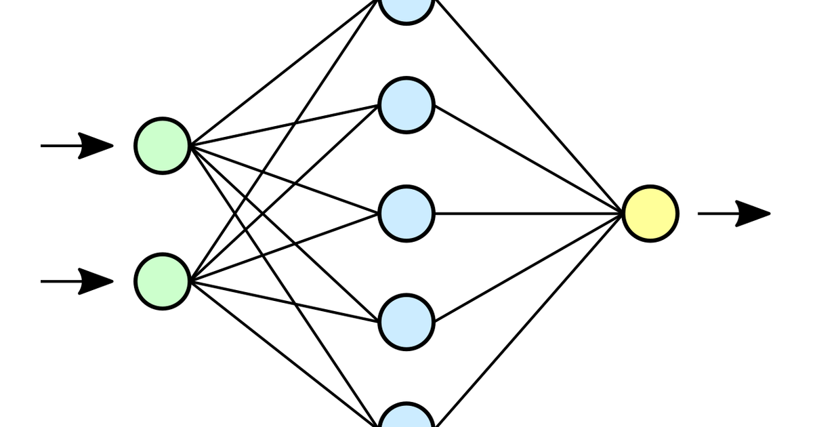

A PyTorch model is a Python program: every forward pass re-executes your code, dispatching op by op, deciding at runtime what to do next. Exporting it to ONNX turns that program into a static graph — a data structure describing the computation once, which a specialised runtime can then inspect whole, fuse, and schedule.

That is a compile step, with a compiler's trade. You give up the thing that made PyTorch pleasant — you can no longer edit the model, branch on data, or debug with `print` — and in return a runtime that knows the entire graph in advance can do things eager execution cannot. On the measurements below that is worth **3× on CPU latency**, and another **2× with quantization on top**.

The point of this post is that the trade is measurable, and you should measure it rather than assume it.

## Installing: ONNX is no longer part of `optimum`

Start here, because it is where the previous version of this post broke. `optimum` 2.x moved every ONNX backend into a separate distribution, so the old incantation installs a package with no `optimum.onnxruntime` in it:

```bash
# No longer works -- optimum 2.x ships no ONNX support of its own
pip install optimum[onnxruntime] onnx

# Correct as of optimum 2.x
pip install "optimum-onnx[onnxruntime]"
```

Confusingly, the *import* paths did not change: `optimum-onnx` registers itself under `optimum.onnxruntime` and `optimum.exporters.onnx` exactly as before. So the failure appears as `ModuleNotFoundError` on a line that is correct, and the fix is in your install step rather than your code.

That split also pins this post to an older `transformers`. `optimum-onnx` 0.1.0 declares `transformers<4.58`, so unlike the rest of the posts here it runs on a 4.57 kernel rather than 5.x — the versions are in `requirements.txt` alongside.

## Exporting is a one-time compile

`main_export` traces the model with dummy inputs, records the operations, and writes a graph. We use a checkpoint that has actually been fine-tuned for its task — `distilbert-base-uncased-finetuned-sst-2-english` — because exporting a bare `bert-base-uncased` with `task="text-classification"` attaches a *randomly initialised* classification head, and its confident-looking predictions are noise:

```{python}
import os
import shutil
import tempfile
import warnings

warnings.filterwarnings("ignore")

from optimum.exporters.onnx import main_export

MODEL = "distilbert/distilbert-base-uncased-finetuned-sst-2-english"
ONNX_DIR = os.path.join(tempfile.gettempdir(), "onnx-sst2")
shutil.rmtree(ONNX_DIR, ignore_errors=True)

main_export(model_name_or_path=MODEL, output=ONNX_DIR, task="text-classification")

print(sorted(os.listdir(ONNX_DIR)))
print(f"model.onnx: {os.path.getsize(os.path.join(ONNX_DIR, 'model.onnx')) / 1024**2:.1f} MB")
```

One `model.onnx` holding the graph and the weights, plus the tokenizer files copied alongside — the export is enough to serve the model, which is much of the appeal for deployment. The runtime is no longer Python.

## The exported graph is a drop-in

`ORTModelForSequenceClassification` presents the ONNX Runtime session behind the same interface as a `transformers` model, so it slots into a `pipeline` unchanged:

```{python}
from transformers import AutoTokenizer, pipeline
from optimum.onnxruntime import ORTModelForSequenceClassification

tokenizer = AutoTokenizer.from_pretrained(ONNX_DIR)
onnx_model = ORTModelForSequenceClassification.from_pretrained(ONNX_DIR)

onnx_pipe = pipeline("text-classification", model=onnx_model, tokenizer=tokenizer)
print(onnx_pipe("This is amazing!"))
```

Use `"text-classification"` rather than the `"sentiment-analysis"` alias here. More importantly, the label and the confidence should match what PyTorch produces — an export that changes predictions is a bug, and checking is the first thing to do after any compile step.

## Measuring the trade

Now the part the original post asserted and never showed. Same input, same tokenizer, same weights — one running as a Python program, one as a compiled graph:

```{python}
import time

import torch
from transformers import AutoModelForSequenceClassification

torch_model = AutoModelForSequenceClassification.from_pretrained(
    MODEL, use_safetensors=False
).eval()
encoded = tokenizer("This is amazing!", return_tensors="pt")


def benchmark(fn, runs=60, warmup=10):
    """Mean milliseconds per call, after warm-up."""
    for _ in range(warmup):
        fn()
    start = time.perf_counter()
    for _ in range(runs):
        fn()
    return (time.perf_counter() - start) / runs * 1000


with torch.no_grad():
    torch_ms = benchmark(lambda: torch_model(**encoded))
onnx_ms = benchmark(lambda: onnx_model(**encoded))

print(f"PyTorch (eager)   : {torch_ms:6.2f} ms")
print(f"ONNX Runtime      : {onnx_ms:6.2f} ms")
print(f"speed-up          : {torch_ms / onnx_ms:6.2f}x")
```

Roughly a threefold reduction in CPU latency for a change that touched no weights. The gain comes from what a whole-graph view permits — fusing the attention and layer-norm patterns into single kernels, folding constants, planning memory reuse — none of which eager PyTorch can do, because it does not know what you are going to ask for next.

### Caveat: this is a CPU result on a batch of one

That number is not a universal speed-up and should not be quoted as one. Single short sequence, batch size one, CPU, on one machine. Larger batches give PyTorch more to amortise over and narrow the gap; on a GPU the comparison changes completely, and `torch.compile` closes much of it without leaving Python at all.

The reason to benchmark is that all of these depend on your shapes and your hardware. The method above — same inputs, warm-up, mean over repeats — is the transferable part; the ratio is not.

## Quantization: smaller as well as faster

Export makes the graph optimisable. Quantization then changes the numbers in it, storing weights as 8-bit integers instead of 32-bit floats. Dynamic quantization needs no calibration data, which makes it the cheapest thing to try:

```{python}
from optimum.onnxruntime import ORTQuantizer
from optimum.onnxruntime.configuration import AutoQuantizationConfig

INT8_DIR = os.path.join(tempfile.gettempdir(), "onnx-sst2-int8")
shutil.rmtree(INT8_DIR, ignore_errors=True)

quantizer = ORTQuantizer.from_pretrained(ONNX_DIR)
quantizer.quantize(
    save_dir=INT8_DIR,
    quantization_config=AutoQuantizationConfig.arm64(is_static=False, per_channel=False),
)

fp32_mb = os.path.getsize(os.path.join(ONNX_DIR, "model.onnx")) / 1024**2
int8_mb = os.path.getsize(os.path.join(INT8_DIR, "model_quantized.onnx")) / 1024**2
print(f"FP32: {fp32_mb:6.1f} MB")
print(f"INT8: {int8_mb:6.1f} MB   ({fp32_mb / int8_mb:.1f}x smaller)")
```

Four times smaller, as the arithmetic promises. `AutoQuantizationConfig.arm64` targets Apple Silicon and Graviton; use `.avx512_vnni()` or `.avx2()` on Intel — the config names an instruction set because the speed-up comes from integer kernels that only exist on some hardware.

The question quantization always raises is what it cost in accuracy:

```{python}
int8_model = ORTModelForSequenceClassification.from_pretrained(
    INT8_DIR, file_name="model_quantized.onnx"
)

with torch.no_grad():
    torch_probs = torch_model(**encoded).logits.softmax(-1)[0]
onnx_probs = onnx_model(**encoded).logits.softmax(-1)[0]
int8_probs = int8_model(**encoded).logits.softmax(-1)[0]

for name, probs in [("PyTorch", torch_probs), ("ONNX", onnx_probs), ("ONNX INT8", int8_probs)]:
    print(f"{name:10s} P(POSITIVE) = {float(probs[1]):.6f}")

print(f"\nINT8 latency: {benchmark(lambda: int8_model(**encoded)):.2f} ms")
```

The prediction survives to roughly four decimal places and inference halves again. On this example, quantization is close to free.

### Caveat: one example is not an accuracy evaluation

"The probability barely moved on a sentence that was already easy" is the weakest possible evidence. Quantization error concentrates near the decision boundary, which is exactly where this test has nothing to say — a model that agrees on the confident cases can still flip a meaningful share of the borderline ones.

Before shipping a quantized model, score it on a real held-out set and compare to the FP32 baseline. That is a job for the [`evaluate` library](../hugging-face-evaluate-library/index.qmd), and the asymmetry of your task decides how much drift is acceptable.

## What compiling buys, and what it costs

The claim was that ONNX export is a compile step whose trade should be measured. Measured here: 3× on CPU latency from export, 2× again and 4× smaller from INT8, with predictions intact to four decimals — for a model that is now a static graph plus its tokenizer, deployable without Python.

The cost is the program: you cannot fine-tune the exported graph, change its architecture, or step through it. Dynamic control flow has to be traced away at export time, and a model whose behaviour genuinely depends on its input values may export subtly wrong rather than fail loudly. Export at the end of the model's life cycle, once the weights are final — and re-run the prediction check every time, because a compile step that silently changes answers is worse than a slow model.
