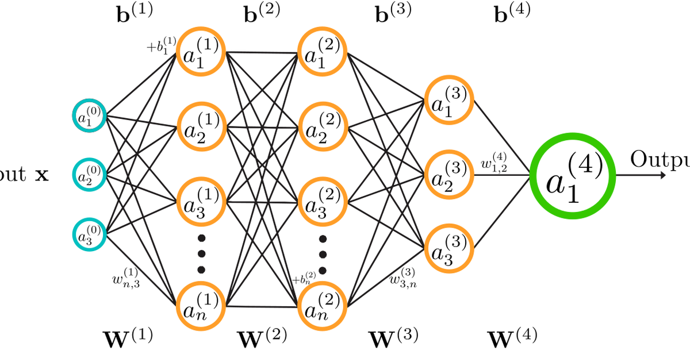

Fine-tuning GPT-2 with LoRA updates 294,912 of its 124 million parameters — 0.24% — and the result saves to a file of about one megabyte, against 523 MB for the base model. The obvious question is why that is not catastrophically worse than updating every weight.

The answer is a claim about the *update*, not the model. Full fine-tuning learns a weight change ΔW for each matrix, and the empirical observation behind LoRA is that this ΔW has low intrinsic rank: adapting a pretrained model to a task moves the weights in a small number of directions, even though the weights themselves are full-rank. So you do not need a full matrix to represent the change. You need two thin ones.

Everything else — the memory savings, the swappable adapters, the fact that this scales to models you could never fully fine-tune — falls out of that.

## The update is a product of two thin matrices

LoRA leaves the pretrained `W` frozen and learns `A` and `B` alongside it, where the effective weight during the forward pass is:

```
W_eff = W + ΔW,   ΔW = B @ A
```

If `W` is `d × k`, then `A` is `r × k` and `B` is `d × r` for some rank `r` much smaller than either dimension. With `r = 8` on a 768-wide model, each adapted matrix costs `8 × 768 × 2 = 12,288` parameters instead of `768 × 768 = 589,824`. Only `A` and `B` receive gradients.

Wrapping a model is two objects — a config describing the scheme, and `get_peft_model` to apply it:

```{python}
import warnings

warnings.filterwarnings("ignore")

from transformers import AutoModelForCausalLM, AutoTokenizer
from peft import get_peft_model, LoraConfig, TaskType

base = AutoModelForCausalLM.from_pretrained("openai-community/gpt2")
tokenizer = AutoTokenizer.from_pretrained("openai-community/gpt2")

lora_config = LoraConfig(
    task_type=TaskType.CAUSAL_LM,
    inference_mode=False,
    r=8,
    lora_alpha=16,
    lora_dropout=0.1,
)

model = get_peft_model(base, lora_config)
model.print_trainable_parameters()
```

0.24% trainable. The frozen 99.76% still runs in the forward pass and still needs to be held in memory — the saving is in the optimizer, not the weights. That distinction matters more than it sounds: Adam keeps two moments per *trainable* parameter, so the optimizer state drops by the same three-orders-of-magnitude factor, and that is usually what was actually exhausting the GPU.

### Caveat: GPT-2 uses `Conv1D`, not `Linear`

Running the cell above on GPT-2 emits a warning that `fan_in_fan_out` was flipped to `True`. GPT-2's attention projections are `transformers`' `Conv1D`, which stores its weight transposed relative to `nn.Linear`. `peft` detects this and corrects, but on a custom architecture it cannot: if your adapters train to nonsense, a silently transposed `ΔW` is the first thing to check.

## The adapter is the only thing you keep

Because the base weights never change, saving a fine-tuned model means saving `A` and `B` and nothing else:

```{python}
import os
import tempfile
from huggingface_hub import snapshot_download

save_dir = tempfile.mkdtemp()
model.save_pretrained(save_dir)

adapter_files = sorted(f for f in os.listdir(save_dir) if os.path.isfile(os.path.join(save_dir, f)))
adapter_bytes = sum(os.path.getsize(os.path.join(save_dir, f)) for f in adapter_files)

base_path = snapshot_download("openai-community/gpt2", allow_patterns=["model.safetensors"])
base_bytes = os.path.getsize(os.path.join(base_path, "model.safetensors"))

print(f"adapter files: {adapter_files}")
print(f"adapter      : {adapter_bytes / 1024**2:6.2f} MB")
print(f"base model   : {base_bytes / 1024**2:6.1f} MB")
print(f"ratio        : {base_bytes / adapter_bytes:6.0f}x smaller")
```

Three files, and the weights among them are about a megabyte. Ten task-specific adaptations of one model cost 523 MB plus ten megabytes, not ten times 523 MB. Serving systems exploit exactly this — hold one base model resident, swap adapters per request.

The `adapter_config.json` is what makes it reloadable; it records the base model id and the rank, so `PeftModel.from_pretrained(base, save_dir)` knows what to reconstruct.

## Prompt tuning changes the input instead

LoRA modifies matrices inside the transformer blocks. The main alternative leaves the network untouched and learns new *inputs* — a handful of continuous embedding vectors prepended to the sequence, optimized by gradient descent while the transformer blocks stay frozen:

```{python}
from peft import PromptTuningConfig

prompt_config = PromptTuningConfig(
    task_type=TaskType.CAUSAL_LM,
    num_virtual_tokens=10,
    tokenizer_name_or_path="openai-community/gpt2",
)

prompt_model = get_peft_model(
    AutoModelForCausalLM.from_pretrained("openai-community/gpt2"), prompt_config
)
prompt_model.print_trainable_parameters()

hidden = prompt_model.config.n_embd
print(f"\n{prompt_config.num_virtual_tokens} virtual tokens x {hidden} hidden = "
      f"{prompt_config.num_virtual_tokens * hidden:,} parameters")
```

7,680 parameters — 0.0062%, another factor of forty below LoRA — and the arithmetic is fully transparent: ten vectors of width 768. These are "soft" prompts in the sense that they are points in embedding space that need not correspond to any token in the vocabulary, which is precisely why they can express instructions no English string could.

The trade is expressiveness against cost. Prompt tuning can only influence the model through the input, so it steers a frozen function; LoRA can alter the function itself at every adapted layer. Prompt tuning is correspondingly cheaper and correspondingly weaker, and it is known to need larger base models before it becomes competitive.

| | Prompt tuning | LoRA |
|---|---|---|
| Trainable | Virtual token embeddings | Low-rank `A`, `B` per matrix |
| Acts on | Input embeddings only | Attention and FFN weights |
| GPT-2 cost here | 7,680 params (0.0062%) | 294,912 params (0.24%) |
| Expressiveness | Steers a frozen function | Modifies the function |
| Merge into base? | No | Yes |

## Merging removes the inference cost

That last row is LoRA's quiet advantage. Since `ΔW = B @ A` is just a matrix, it can be added into `W` once, after training, leaving a model architecturally identical to the original:

```{python}
merged = model.merge_and_unload()

print(type(merged).__name__)
print(f"trainable after merge: {sum(p.numel() for p in merged.parameters() if p.requires_grad):,}")
print(f"total after merge    : {sum(p.numel() for p in merged.parameters()):,}")
```

A plain `GPT2LMHeadModel` again, back to its original parameter count, with the adaptation folded in. There is no LoRA left to execute, so inference costs exactly what the base model costs — no extra matrix multiplications per layer. Prompt tuning cannot do this: its virtual tokens lengthen every input sequence, so its cost is paid on every forward pass forever.

Merging is also one-way. Once folded in, the adapter is no longer separable and the swap-per-request trick is gone — so merge for a single deployed task, keep adapters separate for many.

## Where the low-rank claim holds

The argument was that LoRA works because task adaptation is low-rank, not because 0.24% of parameters happens to be enough. The evidence is that `r` is tunable and small values suffice: raising the rank buys little on tasks close to the pretraining distribution, which is what "the update has low intrinsic rank" predicts and what a "we got lucky with parameter count" story would not.

It stops holding when the adaptation is not a small perturbation. Teaching a model a genuinely new language or modality moves the weights in many directions at once, the low-rank approximation starts costing real accuracy, and a larger `r` — or full fine-tuning — earns its keep. The practical tell is the same one that showed up with the corpus-size problem in tokenization: if raising `r` keeps improving the validation loss, your update was never low-rank, and no amount of adapter engineering will substitute.
