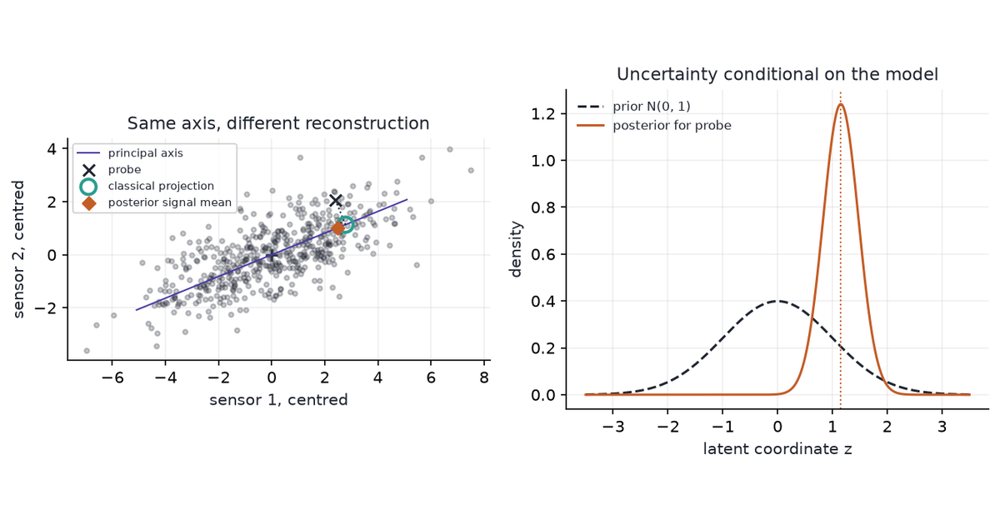

{fig-alt="A two-sensor cloud with classical PCA and PPCA reconstructions, beside an example of a posterior distribution for an unobserved coordinate."}

Probabilistic PCA estimates a noisy low-dimensional signal with a Gaussian model: its maximum-likelihood fit recovers PCA's principal subspace, while its posterior reconstruction shrinks toward the mean.

A classical PCA projection gives us coordinates and a reconstruction error. If we also want uncertainty about the unobserved signal, we need assumptions about how the measurements were generated; that is the role of the probability model.

[Six Views of PCA](../six-views-of-pca/) derives the geometric optimization. We use that subspace result here and distinguish three objects: the fitted distribution of observations, the posterior latent coordinates, and the reconstructed signal.

## Gaussian latent-variable model

Suppose a few unobserved quantities influence many measurements. Write one observation as

$$
x=\mu+Wz+\varepsilon,\qquad
z\sim N(0,I_k),\qquad
\varepsilon\sim N(0,\sigma^2 I_d),
\qquad z\perp\varepsilon.
$$

- $x\in\mathbb R^d$ contains observed features; $z\in\mathbb R^k$ contains latent, or unobserved, coordinates, with $k<d$.
- $W\in\mathbb R^{d\times k}$ maps latent coordinates to features. Its columns need not be orthonormal.
- $\mu$ is the observation mean. We assume independent observations with common parameters.
- $\sigma^2>0$ is the noise variance in every feature direction. This equal-variance assumption is called **isotropic noise**; it refers to the chosen measurement coordinates.

Independent Gaussian contributions add their covariances, giving

$$
x\sim N(\mu,C),\qquad C=WW^\top+\sigma^2I_d.
$$

The signal covariance $WW^\top$ has rank at most $k$. Noise adds variance in all $d$ directions, so the observation distribution has full rank even though its signal lies in a smaller subspace.

This is the PPCA model introduced by [Tipping and Bishop (1999)](https://www.microsoft.com/en-us/research/wp-content/uploads/2016/02/bishop-ppca-jrss.pdf). Fixing the latent covariance to $I_k$ leaves a rotation ambiguity: $W$ and $WR$ describe the same observation distribution whenever $R^\top R=I_k$.

## Maximum-likelihood fit

### Covariance convention

For $n$ complete observations, the fitted mean is $\hat\mu=\bar x$. Let $X$ contain the centred observations as rows, and define

$$
S_{\mathrm{ML}}=\frac1nX^\top X
=V\operatorname{diag}(\lambda_1,\ldots,\lambda_d)V^\top,
\qquad \lambda_1\ge\cdots\ge\lambda_d.
$$

The denominator is $n$, as required by this Gaussian likelihood. Eigenvalues computed using $n-1$ must be multiplied by $(n-1)/n$ before using the PPCA formulas; the eigenvectors are unchanged.

Apart from a constant, the log likelihood is

$$
\ell(W,\sigma^2)
=-\frac n2\left[\log\det C+
\operatorname{tr}(C^{-1}S_{\mathrm{ML}})\right].
$$

The determinant term penalizes an excessively diffuse distribution. The trace term penalizes observed variation that the model assigns too little variance to.

### Principal subspace and residual variance

At the maximum, the model aligns its signal subspace with the leading sample eigenvectors. Let $c_j$ denote its covariance eigenvalues: the first $k$ can exceed $\sigma^2$, while the remaining $d-k$ all equal $\sigma^2$.

With that alignment, minimizing the negative likelihood reduces to

$$
\sum_{j=1}^k\left(\log c_j+\frac{\lambda_j}{c_j}\right)
 +(d-k)\log\sigma^2+
 \frac{\sum_{j=k+1}^d\lambda_j}{\sigma^2}.
$$

Differentiating gives $c_j=\lambda_j$ for retained directions and an average for the discarded directions. Thus

$$
\hat\sigma^2=\frac{1}{d-k}\sum_{j=k+1}^{d}\lambda_j,
\qquad
\hat W=V_k(\Lambda_k-\hat\sigma^2I_k)^{1/2}R.
$$

Here $\Lambda_k=\operatorname{diag}(\lambda_1,\ldots,\lambda_k)$ and $R$ is any orthogonal $k\times k$ matrix. The construction matches retained covariance eigenvalues and replaces discarded ones with their average.

- If $\lambda_k>\hat\sigma^2>0$, the columns of $\hat W$ span the classical principal subspace. The scales of those columns differ from unit PCA axes.
- If $\lambda_k=\hat\sigma^2$, the corresponding loading vanishes, so the effective signal dimension is smaller than the requested $k$.
- If the discarded variance is zero, the solution lies at a singular zero-noise boundary; it is not a nonsingular Gaussian density.

The leading-subspace result follows from the likelihood optimization in Tipping and Bishop. It is agreement between optimizers under a model, not an identity between the likelihood and PCA's reconstruction error for every $W$.

## Posterior coordinates and reconstruction

### Conditional distribution

For a new measurement, we infer $z$ with fitted parameters held fixed. Let $M=W^\top W+\sigma^2I_k$; completing the square in the Gaussian density gives

$$
z\mid x\sim N(m_z,\Sigma_z),\qquad
m_z=M^{-1}W^\top(x-\mu),\qquad
\Sigma_z=\sigma^2M^{-1}.
$$

The posterior expresses uncertainty about this observation's latent coordinates. It does not include uncertainty in the fitted parameters $W$, $\mu$, or $\sigma^2$.

Choose $R=I_k$ to compare directly with classical scores $a_j=v_j^\top(x-\mu)$. At the maximum-likelihood fit,

$$
(m_z)_j=\frac{\sqrt{\lambda_j-\hat\sigma^2}}{\lambda_j}a_j,
\qquad
(\Sigma_z)_{jj}=\frac{\hat\sigma^2}{\lambda_j}.
$$

Latent coordinates use the model's unit-variance prior scale. They are not the ordinary PCA scores $a_j$.

### Signal reconstruction

The posterior mean of the noise-free signal $s=\mu+Wz$ is

$$
\mathbb E[s\mid x]
=\mu+Wm_z
=\mu+V_k\operatorname{diag}\!\left(1-\frac{\hat\sigma^2}{\lambda_j}\right)
 V_k^\top(x-\mu).
$$

Classical PCA retains $a_j$ unchanged in the selected subspace. PPCA multiplies it by $1-\hat\sigma^2/\lambda_j$: when a retained direction has little variance beyond the fitted noise, the model attributes less of an extreme measurement to signal.

For a fixed principal subspace with positive retained eigenvalues, the reconstruction approaches the classical orthogonal projection as $\sigma^2\to0$. The latent mean instead approaches $\Lambda_k^{-1/2}V_k^\top(x-\mu)$, up to the latent rotation; its rescaling does not disappear.

### Worked calculation

Consider a centred sample with eigenvalues $(9,4,1)$ under the $1/n$ convention and axes equal to the coordinate axes. This is an illustrative covariance, chosen to make the residual average explicit, not an empirical dataset.

For $k=1$, we obtain $\hat\sigma^2=(4+1)/2=2.5$ and $\hat W=(\sqrt{6.5},0,0)^\top$. For an observation $x=(3,1,0)^\top$, compare the three outputs:

| Object | Value |
|---|---|
| Classical PCA score | $a_1=3$ |
| Posterior latent mean | $m_z=3\sqrt{6.5}/9\approx0.850$ |
| Classical reconstruction | $(3,0,0)^\top$ |
| Posterior signal mean | $(13/6,0,0)^\top\approx(2.167,0,0)^\top$ |
| Posterior latent variance | $2.5/9\approx0.278$ |

Both reconstructions lie on the first coordinate axis. The posterior signal estimate is closer to the mean, while its latent coordinate is expressed on a different scale.

## Reproducible sensor example

### Data and fit

We generate 500 synthetic paired sensor readings from $z\sim N(0,1)$, $W=(2.2,0.9)^\top$, $\mu=(1,-1)^\top$, and independent sensor noise with standard deviation $0.8$. The example represents two calibrated sensors responding to one shared quantity with equal noise variance.

There is no external collector: the code generates both the signal and the noise. We ask whether the fitted model recovers the shared direction and changes reconstruction as derived; a real application would need to check the equal-noise assumption before trusting its uncertainty estimates.

```{python}
#| label: setup
#| echo: false
import numpy as np
import matplotlib.pyplot as plt

INK, PURPLE, TEAL, ORANGE = "#1F2430", "#4A3AA7", "#2A9D8F", "#C45C26"
plt.rcParams.update({
    "figure.facecolor": "white", "axes.facecolor": "white",
    "axes.spines.top": False, "axes.spines.right": False,
    "axes.labelcolor": INK, "text.color": INK,
    "font.size": 10, "axes.titlesize": 11,
    "axes.grid": True, "grid.alpha": 0.2,
})
np.set_printoptions(precision=4, suppress=True)
```

```{python}
#| label: ppca-fit
#| code-fold: false
rng = np.random.default_rng(19)
n, d, k = 500, 2, 1
W_true = np.array([[2.2], [0.9]])
mu_true = np.array([1.0, -1.0])
z_true = rng.normal(size=(n, k))
observations = mu_true + z_true @ W_true.T + rng.normal(scale=0.8, size=(n, d))
mu = observations.mean(axis=0)
X = observations - mu
_, singular, Vt = np.linalg.svd(X, full_matrices=False)
eigenvalues = singular**2 / n
V = Vt[:k].T
# Fix a plotting convention without consulting labels or the true latent z.
V *= np.where(V[np.argmax(abs(V), axis=0), np.arange(k)] < 0, -1, 1)
noise = eigenvalues[k:].mean()
W = V * np.sqrt(eigenvalues[:k] - noise)
covariance = W @ W.T + noise * np.eye(d)
print("sample covariance eigenvalues:", eigenvalues)
print(f"fitted noise variance: {noise:.4f}; generating value: {0.8**2:.4f}")
alignment = abs(float(V[:, 0] @ W_true[:, 0])) / np.linalg.norm(W_true)
print(f"absolute cosine with generating direction: {alignment:.4f}")
assert np.allclose(np.linalg.eigvalsh(covariance)[::-1], eigenvalues)
```

The fitted noise variance is 0.6283, compared with the generating value 0.6400. With $d=2$ and $k=1$, only one eigenvalue is discarded, so this PPCA model can reproduce both eigenvalues of any positive-definite sample covariance.

Covariance agreement here checks the implementation; it is not a goodness-of-fit test for Gaussianity or a proof about the true sensor noise.

### Reconstruction check

We compute both estimates for every observation and check the shrinkage equation. A fixed probe, three units along the fitted first axis and one unit perpendicular to it, makes the two reconstructions easy to distinguish in the figure.

```{python}
#| label: ppca-posterior
M = W.T @ W + noise * np.eye(k)
latent_mean = np.linalg.solve(M, W.T @ X.T).T
latent_cov = noise * np.linalg.solve(M, np.eye(k))
classic = X @ V @ V.T
signal_mean = latent_mean @ W.T
shrink = 1 - noise / eigenvalues[:k]
assert np.allclose(signal_mean, (X @ V * shrink) @ V.T)
assert np.allclose(latent_cov.diagonal(), noise / eigenvalues[:k])
assert np.sum((X - classic)**2) <= np.sum((X - signal_mean)**2)

# Verify the hand calculation independently of the simulated fit.
hand_noise = np.mean([4.0, 1.0])
hand_W = np.sqrt(9.0 - hand_noise)
hand_mean = hand_W * 3.0 / 9.0
assert np.isclose(hand_mean * hand_W, 13 / 6)
assert np.isclose(hand_noise / 9.0, 5 / 18)
print(f"hand example: latent mean {hand_mean:.4f}; signal coordinate {hand_mean * hand_W:.4f}")
print(f"sensor fit: reconstruction multiplier {shrink[0]:.4f}")
print(f"posterior latent standard deviation: {np.sqrt(latent_cov[0, 0]):.4f}")
```

The fitted reconstruction multiplier is 0.8965: the posterior signal mean retains about 90% of the classical score along this axis. Classical PCA has the smaller squared error against the observed measurements, the quantity it optimizes.

PPCA's posterior mean estimates the unobserved signal under the fitted model; better fit to the noisy observations is not its criterion.

```{python}
#| label: fig-ppca
#| fig-cap: "Left: synthetic sensor readings and a fixed probe, with its classical projection and PPCA posterior signal mean on the fitted axis. Right: the probe's latent prior and posterior densities, conditional on fitted parameters."
#| fig-alt: "A diagonal cloud of paired readings with a probe off the fitted line. Its PPCA reconstruction is closer to the fitted mean than its classical projection. A second panel compares a broad standard normal prior with a narrower shifted latent posterior."
#| fig-width: 9
#| fig-height: 3.8
v = V[:, 0]
perpendicular = np.array([-v[1], v[0]])
probe = 3 * v + perpendicular
probe_classic = 3 * v
probe_latent = np.linalg.solve(M, W.T @ probe)
probe_signal = W @ probe_latent
fig, (ax, density_ax) = plt.subplots(1, 2, figsize=(9, 3.8))
ax.scatter(X[:, 0], X[:, 1], s=9, alpha=0.25, color=INK)
span = np.array([-5.5, 5.5])
ax.plot(span * v[0], span * v[1], color=PURPLE, lw=1, label="principal axis")
ax.plot([probe[0], probe_classic[0]], [probe[1], probe_classic[1]],
        color=INK, ls=":", lw=1)
ax.scatter(*probe, color=INK, marker="x", s=55, label="probe")
ax.scatter(*probe_classic, facecolors="none", edgecolors=TEAL,
           s=95, linewidths=2, label="classical projection", zorder=4)
ax.scatter(*probe_signal, color=ORANGE, marker="D", s=35,
           label="posterior signal mean", zorder=5)
ax.scatter(0, 0, color=INK, marker="+", s=55)
ax.set(xlabel="sensor 1, centred", ylabel="sensor 2, centred", title="Same axis, different reconstruction")
ax.set_aspect("equal")
ax.legend(frameon=True, fontsize=7, loc="upper left")
grid = np.linspace(-3.5, 3.5, 500)
sd = np.sqrt(latent_cov[0, 0])
normal = lambda t, mean, scale: np.exp(-0.5 * ((t - mean) / scale)**2) / (scale * np.sqrt(2 * np.pi))
density_ax.plot(grid, normal(grid, 0, 1), color=INK, ls="--", label="prior N(0, 1)")
density_ax.plot(grid, normal(grid, probe_latent[0], sd), color=ORANGE, label="posterior for probe")
density_ax.axvline(probe_latent[0], color=ORANGE, ls=":", lw=1)
density_ax.set(xlabel="latent coordinate z", ylabel="density", title="Uncertainty conditional on the model")
density_ax.legend(frameon=False, fontsize=8)
fig.tight_layout(pad=1.2)
plt.show()
```

The orange point stays on the principal axis but moves toward the fitted mean. The posterior density describes the latent coordinate's remaining uncertainty; it is not a confidence interval for the axis itself.

## Constraints and use

- **Equal noise is a substantive assumption.** Feature rescaling changes its meaning. Different sensor noise variances call for a different observation model; ordinary standardization does not establish isotropic noise.
- **Latent uncertainty is conditional.** A narrow posterior can still be misleading if the noise model or fitted parameters are wrong. PPCA with point-estimated parameters is not a fully Bayesian treatment of parameter uncertainty.
- **Choosing $k$ requires a criterion.** The MLE formulas assume $k$ is fixed. A larger fitted likelihood alone does not validate a larger dimension; model comparison or held-out performance must account for complexity.
- **Missing values require a different fitting procedure.** Given parameters, the Gaussian model can condition on observed coordinates. Learning those parameters from incomplete data requires an observed-data likelihood, for example optimized by EM; the complete-data covariance formula does not apply unchanged. The original PPCA paper develops that extension.

Use classical PCA when the goal is an orthogonal projection minimizing squared reconstruction error. Use PPCA when a Gaussian observation model is defensible and a density or conditional latent uncertainty is useful.

Model. Signal. Estimate. Noise. Recover. Subspaces. Shrink. Reconstructions. Check. Assumptions.

## References

- Tipping, M. E., and Bishop, C. M. (1999). [Probabilistic principal component analysis](https://www.microsoft.com/en-us/research/wp-content/uploads/2016/02/bishop-ppca-jrss.pdf). *Journal of the Royal Statistical Society, Series B* 61(3), 611–622. [DOI](https://doi.org/10.1111/1467-9868.00196).
- [Six Views of PCA](../six-views-of-pca/) — projection geometry, equivalent objectives, and preprocessing.
